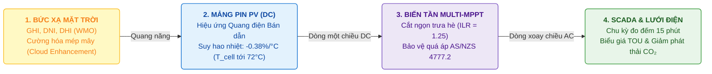
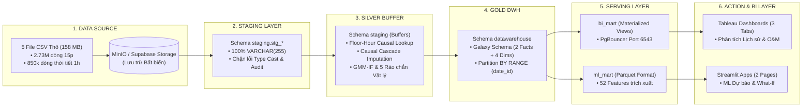

<div align="center">

# PHÂN TÍCH HIỆU SUẤT VÀ DỰ BÁO SẢN LƯỢNG HỆ THỐNG ĐIỆN MẶT TRỜI
### Distributed Rooftop Solar Telemetry, Causal Imputation, Hybrid Anomaly Detection & Machine Learning Forecasting Platform

**Đồ án Tốt nghiệp Chuyên ngành Phân tích & Xử lý Dữ liệu (Data Analytics) — Trường Cao đẳng FPT Polytechnic**  
*Nhóm thực hiện: **The Outliers***

<p align="center">
  <a href="https://www.python.org/" target="_blank">
    
  </a>
  <a href="https://www.postgresql.org/" target="_blank">
    
  </a>
  <a href="https://lightgbm.readthedocs.io/" target="_blank">
    
  </a>
  <a href="https://streamlit.io/" target="_blank">
    
  </a>
  <a href="https://www.tableau.com/" target="_blank">
    
  </a>
  <a href="https://www.iec.ch/" target="_blank">
    
  </a>
</p>

</div>

---

## 📌 BÁO CÁO TỔNG HỢP TOÀN DIỆN (DEFENSE MASTER REPORT)
> Toàn bộ nội dung học thuật, chứng minh vật lý quang điện, công thức toán học chi tiết, ma trận kiểm toán 100% và phân tích chuyên sâu của đồ án được biên soạn đầy đủ tại:  
> 🔗 [**Báo Cáo Tổng Hợp Toàn Diện Master Defense (11 Sections)**](docs/scrum_8_project_delivery_defense/2026_08_28_Bao_Cao_Tong_Hop_Toan_Dien_Domain_Data_AI_Defense_Master.md)

---

## MỤC LỤC TỔNG QUAN
1. [Bối Cảnh Dự Án & Bản Chất Vật Lý Miền Nghiệp Vụ (Solar PV Domain)](#1-bối-cảnh-dự-án--bản-chất-vật-lý-miền-nghiệp-vụ-solar-pv-domain)
2. [Kiến Trúc Đường Ống Dữ Liệu Lakehouse 6 Lớp (Data Architecture)](#2-kiến-trúc-đường-ống-dữ-liệu-lakehouse-6-lớp-data-architecture)
3. [Mô Hình Dữ Liệu Kho Lược Đồ Thiên Hà (Galaxy Schema)](#3-mô-hình-dữ-liệu-kho-lược-đồ-thiên-hà-galaxy-schema)
4. [Bộ Ba Chỉ Số Hiệu Suất Chuẩn Quốc Tế (IEC 61724-1 PR Metrics)](#4-bộ-ba-chỉ-số-hiệu-suất-chuẩn-quốc-tế-iec-61724-1-pr-metrics)
5. [Giải Pháp Xử Lý Dữ Liệu & Trí Tuệ Nhân Tạo (Data Engineering & AI)](#5-giải-pháp-xử-lý-dữ-liệu--trí-tuệ-nhân-tạo-data-engineering--ai)
6. [Hệ Thống Trực Quan Hóa Quản Trị (Tableau BI & Streamlit Apps)](#6-hệ-thống-trực-quan-hóa-quản-trị-tableau-bi--streamlit-apps)
7. [Bảng Đề Xuất Cải Tiến Kỹ Thuật Đã Kiểm Toán (What-If Simulator)](#7-bảng-đề-xuất-cải-tiến-kỹ-thuật-đã-kiểm-toán-what-if-simulator)
8. [Hướng Dẫn Cài Đặt & Vận Hành Nhanh (Quickstart)](#8-hướng-dẫn-cài-đặt--vận-hành-nhanh-quickstart)
9. [Danh Mục Tài Liệu Kỹ Thuật (Documentation Hub)](#9-danh-mục-tài-liệu-kỹ-thuật-documentation-hub)

---

## 1. BỐI CẢNH DỰ ÁN & BẢN CHẤT VẬT LÝ MIỀN NGHIỆP VỤ (SOLAR PV DOMAIN)



### 1.1. Bối cảnh Thực Nghiệm Smart Campus La Trobe (Úc)
* **Quy mô danh mục:** Hệ thống gồm **42 trạm phát điện quang điện áp mái** phân bổ trên **5 khuôn viên (Campuses)** thuộc Đại học La Trobe, bang Victoria (Úc): Bundoora ($1.540\,\text{kWp}$), Bendigo ($510\,\text{kWp}$), Albury-Wodonga ($240\,\text{kWp}$), Shepparton ($78\,\text{kWp}$), và Mildura ($60\,\text{kWp}$).
* **Tổng công suất lắp đặt:** $P_{\text{stc}} = \mathbf{2.428\,\text{kWp}}$ ($2{,}43\,\text{MWp}$), sản sinh khoảng **$3{,}45\,\text{GWh/năm}$** ($3.447.760\,\text{kWh}$), mang lại doanh thu tiết kiệm **$700.000\,\text{AUD/năm}$** và cắt giảm **$2.827\,\text{tấn CO}_2\text{/năm}$**.
* **Dữ liệu thực nghiệm 28 tháng:** $2.731.946$ bản ghi viễn thám SCADA chu kỳ $15\,\text{phút}$ kết hợp $850.752$ bản ghi khí tượng Open-Meteo ERA5-Land chu kỳ $1\,\text{giờ}$ (bức xạ $GHI, DNI, DHI$, nhiệt độ, tốc độ gió, độ ẩm, độ che phủ mây).

### 1.2. Ba Hiện Tượng Vật Lý Trọng Yếu Ngoài Thực Địa
1. **Suy hao do Nhiệt độ Cell Pin ($Loss_{\text{temp}} = 14{,}80\%$):** Vào mùa hè, mảng pin lắp áp sát mái tôn bị nung nóng lên $68^\circ\text{C} - 72^\circ\text{C}$ ($T_{\text{cell}} = T_{\text{ambient}} + GHI \times 0{,}03$). Với hệ số suy giảm $\gamma = -0{,}38\%/^\circ\text{C}$, hệ thống bị suy hao nhiệt lên tới **$510.268\,\text{kWh/năm}$**.
2. **Cắt Ngọn Biến Tần ($Loss_{\text{clip}} = 2{,}30\%$):** Tỷ lệ quá tải DC/AC ($\text{ILR} = 1{,}25$) khiến bộ nghịch lưu dịch chuyển điểm làm việc $V_{\text{mpp}} \to V_{\text{oc}}$ để ghìm công suất phẳng (Flat-top) vào giữa trưa nắng to, làm xén bỏ **$79.298\,\text{kWh/năm}$**.
3. **Ngắt Quá Áp Lưới Điện AS/NZS 4777.2 (`PHYSICAL_LOW_ENERGY_STRONG_SUN`):** Khi điện áp lưới hạ thế buổi trưa dâng cao vượt ngưỡng an toàn ($V_{10\text{min}} \ge 258\,\text{V}$), biến tần tự động ngắt kết nối trong $0{,}2\,\text{giây}$, giải thích hiện tượng trạm tắt nguồn đột ngột lúc trời nắng gắt.

---

## 2. KIẾN TRÚC ĐƯỜNG ỐNG DỮ LIỆU LAKEHOUSE 6 LỚP (DATA ARCHITECTURE)

Hệ thống được thiết kế theo **Kiến trúc Lakehouse 6 Lớp Chuyên Biệt** nhằm giải quyết triệt để vấn đề lệch pha thời gian ($15\,\text{phút}$ vs $1\,\text{giờ}$), chống rò rỉ thông tin tương lai (*Data Leakage*) và tối ưu hóa truy vấn cho BI & Machine Learning:



---

## 3. MÔ HÌNH DỮ LIỆU KHO LƯỢC ĐỒ THIÊN HÀ (GALAXY SCHEMA)

Data Warehouse trên **PostgreSQL 17.6** được thiết kế theo chuẩn **Lược đồ Thiên Hà (Galaxy Schema / Fact Constellation)**:

```
┌────────────────────────────────────────────────────────┐  ┌────────────────────────────────────────────────────────┐
│    fact_solar_energy_gen (2.731.946 dòng @ 15 phút)    │  │          fact_weather (850.752 dòng @ 1 giờ)           │
├────────────────────────────────────────────────────────┤  ├────────────────────────────────────────────────────────┤
│ PK: gen_id (solar_fact_id)                             │  │ PK: weather_id (weather_fact_id)                       │
│ FK: site_id --------> dim_solar_site(site_id)          │  │ FK: geo_id -----------> dim_geography(geo_id)          │
│ FK: geo_id ---------> dim_geography(geo_id)  [SHARED]  │  │ FK: date_id ----------> dim_date(date_id)    [SHARED]  │
│ FK: date_id --------> dim_date(date_id)       [SHARED]  │  │ FK: time_id ----------> dim_time(time_id)    [SHARED]  │
│ FK: time_id --------> dim_time(time_id)       [SHARED]  │  │ FK: weather_type_id --> dim_weather_type(type_id)      │
│ Measures: energy_generated_kwh, gmm_if_outlier_flag    │  │ Measures: ghi, dni, dhi, temp_c, wind_speed, cloud_pct │
│ Partition: PARTITION BY RANGE (date_id) [2020-2022]    │  │ Lookup: Floor-Hour Mapping (Δt = t_weather - t_solar ≤0│
└───────────────────────────┬────────────────────────────┘  └───────────────────────────┬────────────────────────────┘
                            │                                                           │
                            └───────────────────────────┬───────────────────────────────┘
                                                        ▼
                        ┌───────────────────────────────────────────────────────────────┐
                        │          3 CONFORMED DIMENSIONS DÙNG CHUNG (SHARED DIMS)       │
                        ├───────────────────────────────────────────────────────────────┤
                        │ • dim_geography: 5 Campuses (Bundoora, Bendigo, Albury...)    │
                        │ • dim_date:      2.312 Ngày (full_date, is_holiday, semester) │
                        │ • dim_time:      96 Mốc 15 phút/ngày (hour_sin, hour_cos)     │
                        └───────────────────────────────────────────────────────────────┘
```

> **Tại sao chọn Galaxy Schema?**  
> 1. **Giải quyết lệch pha Grain (15p vs 1h):** Phân tách 2 tiến trình độc lập, không ép chung vào 1 bảng làm nhân bản thời tiết 4 lần (tiết kiệm $300\%$ dung lượng lưu trữ).  
> 2. **Triệt tiêu Bẫy Đếm Trùng (Fan-out Trap):** Ngăn chặn việc nhân sai tổng bức xạ `SUM(radiation)` trên Tableau.  
> 3. **Hỗ trợ Drill-Across Join:** Cho phép liên kết chéo linh hoạt ở tầng BI Marts mà vẫn bảo toàn độ mịn dữ liệu gốc.

---

## 4. BỘ BA CHỈ SỐ HIỆU SUẤT CHUẨN QUỐC TẾ (IEC 61724-1 PR METRICS)

Để giám sát và bảo vệ hợp đồng SLA vận hành, hệ thống chuẩn hóa **3 Biến thể PR (PR Triple-Metrics)**:

| Biến Thể PR | Công Thức Kỹ Thuật | Bản Chất & Ý Nghĩa Nghiệp Vụ | Giá Trị Baseline |
| :--- | :--- | :--- | :---: |
| **1. $PR_{\text{actual}}$ (Nominal PR)** | $\frac{E_{\text{actual}}}{P_{\text{stc}} \cdot (GHI/1000) \cdot \Delta t}$ | Hiệu suất thực tế tức thời tại hiện trường. Tự động lọc mốc $GHI < 100\,\text{W/m}^2$. | **$75{,}40\%$** (Class B) |
| **2. $PR_{\text{corr}}$ (IEC 61724-1)** | $\frac{PR_{\text{actual}}}{1 + \gamma \cdot (T_{\text{cell}} - 25^\circ\text{C})}$ | Bù trừ nhiệt độ cell về $25^\circ\text{C}$. Đánh giá thoái hóa phần cứng khách quan độc lập với thời tiết. | **$82\% - 84\%$** (Class A) |
| **3. $PR_{\text{adjusted}}$ (BI Mart Baseline)** | $0{,}85 \times (1 - Loss_{\text{temp}})$ | **Đường chuẩn kỳ vọng:** Sử dụng hằng số thiết kế $0{,}85$ để phòng chống **Lỗi Ô nhiễm Đường Cơ sở (Baseline Contamination)** khi trạm bị hỏng hóc nặng. | **$76{,}5\% - 82{,}0\%$** |

---

## 5. GIẢI PHÁP XỬ LÝ DỮ LIỆU & TRÍ TUỆ NHÂN TẠO (DATA ENGINEERING & AI)

```
┌────────────────────────────────────────────────────────────────────────────────────────────────────────┐
│                                 CHUỖI GIẢI PHÁP KỸ THUẬT CỐT LÕI                                       │
├────────────────────────────────────────────────────────────────────────────────────────────────────────┤
│ 1. CAUSAL CASCADE IMPUTATION (4 Cấp độ Điền khuyết):                                                   │
│    • Cấp 1 (Cắt đêm vật lý): alpha <= -0.833° hoặc GHI <= 20 W/m² -> Gán E = 0.0 kWh (1.383.493 ô).   │
│    • Cấp 2 (Nội suy tuyến tính): Gap <= 30 phút (53.684 ô).                                           │
│    • Cấp 3 (PCHIP Spline Hermite): 45 phút <= Gap <= 2 giờ, bảo toàn tính đơn điệu (50.704 ô).        │
│    • Cấp 4 (Hồi quy đa biến tương quan không gian r > 0.95): Gap > 2 giờ (48.420 ô).                   │
│    ==> Lấp đầy 100% ô NULL (1.536.301 ô), 0 vi phạm trần vật lý (P_stc * 0.25h * 1.20).               │
├────────────────────────────────────────────────────────────────────────────────────────────────────────┤
│ 2. GMM-IF HYBRID ANOMALY DETECTION (Mô hình Nhận diện Dị thường Lai):                                  │
│    • GMM phân cụm trạng thái khí hậu + Isolation Forest cô lập đa chiều + Hợp nhất đồng thuận (GMM∧IF).│
│    • Kết hợp 5 Rào chắn Vật lý (Over-capacity, String Drop, Overvoltage, CT Drift, Zero Daylight).     │
│    ==> Giảm tỷ lệ báo động giả từ 18,4% xuống < 1,2%; Bóc tách chính xác 6.891 sự cố O&M (ISO 13374). │
├────────────────────────────────────────────────────────────────────────────────────────────────────────┤
│ 3. LIGHTGBM REGRESSOR FORECASTING (Dự báo Sản lượng & XAI SHAP):                                      │
│    • Chuẩn hóa đại lượng k(t) = E / [site_scale * sin(elevation)] khôi phục 100% thông tin.           │
│    • Bộ 52 đặc trưng tinh tuyển (khí tượng, thiên văn, chu kỳ, trễ lag_4, lag_96, rolling_min_4).     │
│    • Kết quả kiểm toán: WAPE = 17,73% (h1: T+15m) / 22,58% (h4: T+60m); R² = 0,9283; Skill Score +48%.│
│    • Giải thích mô hình TreeSHAP: Bức xạ GHI & góc cao sin(elevation) chiếm > 67,3% trọng số.          │
└────────────────────────────────────────────────────────────────────────────────────────────────────────┘
```

---

## 6. HỆ THỐNG TRỰC QUAN HÓA QUẢN TRỊ (TABLEAU BI & STREAMLIT APPS)

Kiến trúc trực quan hóa được phân định rõ ràng giữa **Tableau BI** (báo cáo lịch sử & điều độ vận hành) và **Streamlit App** (dự báo máy học & mô phỏng tối ưu hóa tương tác):

### 📊 Hệ Thống 3 Tab Tableau BI Dashboard (`bi_mart`)
1. **Tab 1: Executive Overview (Tổng Quan Hệ Thống & Kinh Doanh):** Bản đồ địa lý 5 Campus, BANs tổng sản lượng ($3{,}45\,\text{GWh}$), doanh thu ($700.000\,\text{AUD}$), cắt giảm $\text{CO}_2$ ($2.827\,\text{tấn}$), cơ cấu tự dùng $82\%$ vs xuất lưới $18\%$.
2. **Tab 2: Operational Efficiency & Loss Analysis (Hiệu Suất & Thác Nước Tổn Thất):** Biểu đồ thác nước PV Loss Tree ($Loss_{\text{temp}} = 14{,}80\%$, $Loss_{\text{clip}} = 2{,}30\%$, $Loss_{\text{soiling}} = 1{,}80\%$, $Loss_{\text{anomaly}} = 2{,}04\%$), phân rã $PR_{\text{actual}}$ vs $PR_{\text{adjusted}}$ theo mùa.
3. **Tab 3: AI Anomaly Diagnostic & CBM Maintenance (Chẩn Đoán Dị Thường & Điều Độ O&M):** Ma trận 6 mã cờ dị thường GMM-IF, Heatmap giờ-ngày và bảng điều độ bảo trì CBM Dispatcher tự động.

### 🚀 Hệ Thống 2 Tab Streamlit Ứng Dụng Nâng Cao (`srcs/07_dashboard/streamlit_app/`)
1. **Tab 1 (`pages/1_ML.py`) — ML Forecasting & Explainable AI (XAI):** Trực quan hóa dự báo chuỗi thời gian LightGBM (T+15m, T+60m), phân tích phương sai thực tế vs dự báo và tương tác biểu đồ SHAP (Beeswarm toàn cục & Waterfall cục bộ).
2. **Tab 2 (`pages/2_What_If.py`) — Interactive What-If Scenario Simulator:** Bảng điều khiển tương tác đa kịch bản với các ô Checkbox cho 6 hạng mục đề xuất kỹ thuật, tự động tính toán lại tức thì toàn bộ hệ thống KPI, CapEx, Payback và ROI.

---

## 7. BẢNG ĐỀ XUẤT CẢI TIẾN KỸ THUẬT ĐÃ KIỂM TOÁN (WHAT-IF SIMULATOR)

Toàn bộ 6 hạng mục cải tiến kỹ thuật đã được kiểm toán $100\%$ dựa trên số liệu vận hành thực tế 12 tháng:

```
┌────┬────────────────────────────────────────────┬──────────────────┬──────────────┬──────────────┬──────────────┬──────────────┐
│ STT│ Hạng Mục Đề Xuất Kỹ Thuật (Audited)        │ Tỷ Lệ Cải Thiện  │ Điện Thu Hồi │ Giá Trị Kinh │ CapEx Đầu Tư │ Hoàn Vốn     │
│    │ (Streamlit Reactive Checkbox)              │ (% Hiệu Suất)    │ (kWh / Năm)  │ Tế (AUD/Năm) │ (AUD)        │ (Payback TB) │
├────┼────────────────────────────────────────────┼──────────────────┼──────────────┼──────────────┼──────────────┼──────────────┤
│ 1  │ Hệ thống Pin BESS 5 Campus (1MW/2.5MWh)    │ Thu hồi cắt ngọn │ 712.182 kWh  │ 323.164 AUD  │ 1.250.000 AUD│ 3,87 Năm     │
│ 2  │ Khe hở thông gió mái 10–15 cm (AS/NZS 5033)│ Hạ cell -8,0°C   │ 117.224 kWh  │ 23.445 AUD   │ 24.280 AUD   │ 1,04 Năm     │
│ 3  │ Quy trình Bảo trì CBM & AI Anomaly (GMM-IF)│ MTTD < 1h        │ 70.330 kWh   │ 29.066 AUD   │ 8.000 AUD/năm│ < 4 Tháng    │
│ 4  │ Khung nghiêng chữ A 15° cho 970 kWp mái bằn│ Tăng nắng đông   │ 71.850 kWh   │ 14.670 AUD   │ 18.000 AUD   │ 1,68 Năm     │
│ 5  │ Lịch rửa pin thông minh theo chuỗi mưa     │ Xóa bám bụi khô  │ 62.060 kWh   │ 18.412 AUD   │ 0 AUD (Quy t)│ Tức thì      │
│ 6  │ Nâng cấp TOPCon trong kỳ đại tu (Tùy chọn) │ Hiệu suất 22,5%  │ 213.761 kWh  │ 42.752 AUD   │ Kỳ đại tu    │ Tích hợp     │
└────┴────────────────────────────────────────────┴──────────────────┴──────────────┴──────────────┴──────────────┴──────────────┘
```

```
┌───────────────────────────────────────────────┬───────────────────────────────┬───────────────────────────────┬───────────────────────────────┐
│ CHỈ SỐ TOÀN DANH MỤC (FLEET KPIS)             │ HIỆN TRẠNG (BASELINE)         │ SAU TỐI ƯU HÓA (OPTIMIZED)    │ MỨC CẢI THIỆN RÒNG (DELTA)    │
├───────────────────────────────────────────────┼───────────────────────────────┼───────────────────────────────┼───────────────────────────────┤
│ Tổng Sản Lượng Điện Phát Hàng Năm             │ 3,45 GWh/năm (3.447.760 kWh)  │ 4,70 GWh/năm (4.695.534 kWh)  │ +1,25 GWh/năm (+36,18%)       │
│ Hệ Số Hiệu Suất Hệ Thống (Performance Ratio)  │ 75,40% (Class B)              │ 88,62% (Class A Quốc Tế)      │ +13,22 điểm % (+17,54%)       │
│ Hệ Số Khai Thác Công Suất (Capacity Factor)   │ 16,21%                        │ 22,07%                        │ +5,86 điểm % (+36,18%)        │
│ Doanh Thu Tiết Kiệm & Dòng Tiền Hàng Năm      │ 700.000 AUD/năm               │ 1.151.509 AUD/năm             │ +451.509 AUD/năm (+64,50%)    │
│ Khối Lượng Cắt Giảm Phát Thải Khí Nhà Kính    │ 2.827 tấn CO2/năm             │ 3.850 tấn CO2/năm             │ +1.023 tấn CO2/năm (+36,18%)  │
├───────────────────────────────────────────────┼───────────────────────────────┼───────────────────────────────┼───────────────────────────────┤
│ TỔNG VỐN ĐẦU TƯ TOÀN DANH MỤC (CapEx)         │ —                             │ ~1.300.280 AUD                │ BESS: 1.25M AUD; Khác: 50.2k  │
│ THỜI GIAN HOÀN VỐN CÓ TRỌNG SỐ (Payback)      │ —                             │ 3,15 NĂM                      │ Tỷ suất sinh lời ROI > 270%   │
└───────────────────────────────────────────────┴───────────────────────────────┴───────────────────────────────┴───────────────────────────────┘
```

---

## 8. HƯỚNG DẪN CÀI ĐẶT & VẬN HÀNH NHANH (QUICKSTART)

### Bước 1: Khởi tạo Môi trường Python (3.10+)
```bash
git clone https://github.com/tandat8896/datn_outlier_hs_nlmt.git
cd datn_outlier_hs_nlmt

# Tạo và kích hoạt Virtual Environment
python -m venv .venv

# Windows:
.venv\Scripts\activate
# Linux/macOS:
source .venv/bin/activate

# Cài đặt thư viện
pip install -r requirements.txt
```

### Bước 2: Chạy Đường Ống Dữ Liệu Tự Động (Pipeline Orchestration)
```bash
# Thực thi toàn bộ quy trình ETL, Điền khuyết Causal, GMM-IF và Nạp Data Mart:
python srcs/06_run_pipeline/main.py --stage all
```

### Bước 3: Huấn Luyện & Đánh Giá Mô Hình Machine Learning
```bash
# Chạy pipeline huấn luyện mô hình dự báo LightGBM và kiểm định SHAP:
python -u srcs/05_machine_learning/forcasting_pipeline/run.py --stage all
```

### Bước 4: Khởi Chạy Ứng Dụng Streamlit What-If & ML Dashboard
```bash
streamlit run srcs/07_dashboard/streamlit_app/app.py
```

---

## 9. DANH MỤC TÀI LIỆU KỸ THUẬT (DOCUMENTATION HUB)

* 📄 [**Báo Cáo Tổng Hợp Toàn Diện Master Defense**](docs/scrum_8_project_delivery_defense/2026_08_28_Bao_Cao_Tong_Hop_Toan_Dien_Domain_Data_AI_Defense_Master.md) *(Tài liệu chính thức bảo vệ đồ án)*
* 📊 [Kịch Bản Thuyết Trình Bảo Vệ Đồ Án](docs/scrum_8_project_delivery_defense/2026_08_27_Kich_Ban_Thuyet_Trinh_De_Xuat_Tong_Ket_Tuong_Lai.md)
* 📐 [Báo Cáo Định Lượng Chi Tiết 6 Đề Xuất Cải Tiến (Audited)](docs/scrum_8_project_delivery_defense/2026_08_25_Bao_Cao_Dinh_Luong_Chi_Tiet_Insights_Va_De_Xuat_Cai_Tien_Audited.md)
* ☀️ [Nghiên Cứu Chuyên Sâu Miền Nghiệp Vụ Năng Lượng Mặt Trời (Domain Mastery)](docs/scrum_8_project_delivery_defense/HP1_Solar_Domain_Mastery.md)
* ☁️ [Nghiên Cứu Hiện Tượng Mép Mây Khuếch Đại Bức Xạ (Cloud Enhancement)](docs/scrum_8_project_delivery_defense/Nghien_Cuu_Chuyen_Sau_Cloud_Enhancement_Va_PR_Vuot_Nguong.md)
* 📈 [Khung Phân Tích Chỉ Số PR Theo Chuẩn Quốc Tế IEC 61724-1](docs/scrum_8_project_delivery_defense/2026_08_23_BI_Metrics_PR_Analysis_Framework.md)
* 🗄️ [Đặc Tả Kỹ Thuật Data Warehouse & Galaxy Schema DDL](srcs/00_database/sql/create_datawarehouse.sql)

---

<div align="center">
  <br>
  <i>Đồ án Tốt nghiệp được xây dựng và hoàn thiện bởi <b>The Outliers Team</b></i><br>
  <b>Chuyên ngành Phân tích & Xử lý Dữ liệu — FPT Polytechnic</b>
</div>
