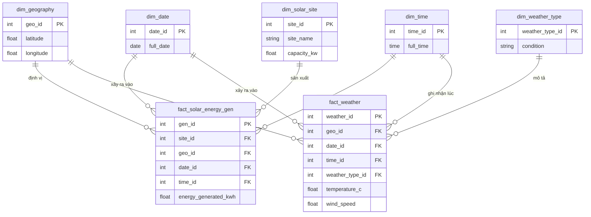
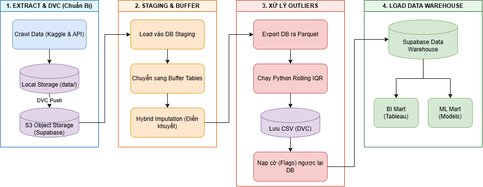

<div align="center">

# HỆ THỐNG PHÂN TÍCH VÀ DỰ BÁO SẢN LƯỢNG ĐIỆN MẶT TRỜI
**Dự án Tốt nghiệp chuyên ngành Xử lý Dữ liệu - The Outliers**

<p align="center">
  <a href="https://www.python.org/" target="_blank">
    
  </a>
  <a href="https://supabase.com/" target="_blank">
    
  </a>
  <a href="https://www.postgresql.org/" target="_blank">
    
  </a>
  <a href="https://scikit-learn.org/" target="_blank">
    
  </a>
  <a href="https://dvc.org/" target="_blank">
    
  </a>
</p>

</div>

---

## MỤC LỤC
- [1. Tổng Quan Dự Án](#1-tổng-quan-dự-án)
- [2. Kiến Trúc Hệ Thống & Data Modeling](#2-kiến-trúc-hệ-thống--data-modeling)
- [3. Quy Trình Vận Hành Dữ Liệu (ETL Pipeline)](#3-quy-trình-vận-hành-dữ-liệu-etl-pipeline)
- [4. Các Insight & Khám Phá Nổi Bật (EDA)](#4-các-insight--khám-phá-nổi-bật-eda)
- [5. Bắt Đầu Nhanh & Hướng Dẫn Cài Đặt](#5-bắt-đầu-nhanh--hướng-dẫn-cài-đặt)
- [6. Hệ Thống Học Máy & Dự Báo (Machine Learning)](#6-hệ-thống-học-máy--dự-báo-machine-learning)
- [7. Tổng Hợp Tài Liệu Dự Án (Documentation Hub)](#7-tổng-hợp-tài-liệu-dự-án-documentation-hub)

---

## 1. TỔNG QUAN DỰ ÁN

Dự án xây dựng một **Hệ thống phân tích, phát hiện bất thường và dự báo sản lượng điện** cho 42 trạm điện quang điện (PV) tại Úc. Bằng cách kết hợp dữ liệu vận hành thực tế (sản lượng sinh ra) và dữ liệu khí tượng viễn thám từ Open-Meteo (nhiệt độ, bức xạ, sức gió, v.v.), dự án mang đến quy trình ETL tự động hóa mạnh mẽ, cung cấp Insight kinh doanh giá trị và hỗ trợ **bảo trì dự đoán (Predictive Maintenance)**.

### Mục tiêu và Đóng góp cốt lõi:
- **Kho Dữ Liệu (Data Warehouse):** Xây dựng kho dữ liệu quy chuẩn tích hợp dữ liệu thời tiết và sản lượng trên Supabase, giải quyết bài toán lệch pha thời gian (15 phút vs 1 giờ).
- **Tự động hóa ETL Pipeline:** Trích xuất, làm sạch, và nội suy (*imputation*) các khoảng dữ liệu bị thiếu; đồng thời áp dụng thuật toán nhận diện và loại bỏ nhiễu ban đêm (*night-time leakage*).
- **Phát hiện Bất thường (Outlier Detection):** Xây dựng thuật toán thống kê (Rolling IQR) kết hợp Machine Learning để tự động gắn cờ các bất thường về sản lượng sinh ra so với bức xạ lý thuyết.
- **Dự báo (Forecasting):** Ứng dụng các mô hình học máy và Time-Series (như ARIMA, Prophet, XGBoost) nhằm dự báo sản lượng ngắn hạn và dài hạn.
- **Trực quan hóa (BI Dashboard):** Xây dựng Dashboard (Tableau) để giúp ban giám đốc và kỹ sư vận hành tối ưu hóa quyết định bảo trì và theo dõi suy hao (*degradation*).

---

## 2. KIẾN TRÚC HỆ THỐNG & DATA MODELING

Hệ thống được lưu trữ hoàn toàn trên **Supabase (PostgreSQL)** với kiến trúc **Lược đồ Thiên hà (Galaxy Schema)**. Kiến trúc này được thiết kế đặc biệt để giải quyết việc có nhiều mức độ chi tiết (*granularity*) khác nhau giữa bảng Fact Thời tiết (chu kỳ 1 giờ) và bảng Fact Sản lượng (chu kỳ 15 phút).



> **Tài liệu Tham chiếu Kiến trúc:**
> - Thiết kế CSDL Logic & Vật lý: [Physical Model](docs/scrum_6_business_logic_eda/2026_05_22_Physical_Model_VanSy.docx), [Data Dictionary](docs/scrum_6_business_logic_eda/2026_05_24_Data_Dictionary_VanSy.docx), [Multidimension Model Design](docs/scrum_6_business_logic_eda/2026_05_25_Multidimension_Model_Design_VanSy.docx)
> - Báo cáo Data Mart: [Tổng quan Hệ thống Data Mart](docs/scrum_5_pipeline_foundation/2026_06_19_BÁO_CÁO_TỔNG_QUAN_HỆ_THỐNG_DATA_MART_By_Toàn.docx)

---

## 3. QUY TRÌNH VẬN HÀNH DỮ LIỆU (ETL PIPELINE)

Quy trình ETL của dự án không chỉ đơn thuần là đẩy dữ liệu vào CSDL, mà là sự kết hợp chặt chẽ giữa **Python Orchestrator**, **Quản lý phiên bản DVC**, **S3 Object Storage** và **PostgreSQL**.

<p align="center">
  
</p>

### Các tính năng kỹ thuật nổi bật:
- **Quản trị Storage & DVC:** Dữ liệu thô và các tệp trung gian (Parquet/CSV) được quản lý bằng DVC và đồng bộ với S3 (Supabase Storage). Tránh việc phình to dung lượng kho lưu trữ Git và cho phép load trực tiếp từ Cloud Storage vào PostgreSQL.
- **Tách lớp Data:** Dữ liệu thô ở `Staging` -> được làm sạch, Imputation sang `Buffer` -> chạy tính toán Outlier bằng Pandas -> Đổ vào Kho dữ liệu cuối cùng.
- **Thuật toán Outlier Hybrid:** Thay vì xử lý Outlier bằng SQL, hệ thống kết hợp Pandas (Python) xuất dữ liệu, tính toán theo thuật toán Rolling IQR để nhận diện lỗi thiết bị, và nạp lại "Cờ Outlier" vào Warehouse.

> **Tài liệu Tham chiếu ETL & Pipeline:**
> - [Báo cáo Kỹ thuật Load Data DW](docs/scrum_5_pipeline_foundation/2026_06_14_Bao_Cao_Ky_Thuat_Load_DW_TanDat.docx)
> - [Hướng dẫn & Báo cáo Tích hợp DVC Storage](docs/configurations_and_setups/2026_06_21_BaoCaoDVC_NgoTanDat.pdf)
> - [Đối soát & Tính Toàn vẹn Dữ liệu (Data Integrity)](docs/scrum_5_pipeline_foundation/2026_06_13_Data_Integrity_and_Reconciliation_Check_CongToan.docx)

---

## 4. CÁC INSIGHT & KHÁM PHÁ NỔI BẬT (EDA)

Dựa trên dữ liệu sạch từ Data Warehouse, các quá trình thống kê mô tả (EDA) và xây dựng BI Mart đã làm sáng tỏ nhiều Insight đắt giá:

- **Suy hao do nhiệt độ (Thermal Degradation):** Bức xạ mặt trời vào ban trưa cao nhất, nhưng khi nhiệt độ bề mặt vượt quá 25°C, hiệu suất tấm pin lại sụt giảm mạnh.
- **Tín hiệu cảnh báo bảo trì (Predictive Maintenance):** Hiện tượng sản lượng thực tế giảm đột ngột trong khi bức xạ khu vực vẫn cao, kết hợp cờ Outlier từ thuật toán, cho phép chẩn đoán ngay hiện tượng bám bẩn (Soiling) hoặc lỗi Inverter.
- **Nhiễu rò rỉ ban đêm:** Hệ thống ghi nhận các hiện tượng dòng điện rò trong khoảng từ 18h đến 5h sáng (ban đêm không có bức xạ). Nếu không loại bỏ qua khâu ETL, điều này gây sai số hàng ngàn kWh trong báo cáo tài chính hằng năm.
- **Phân tích Tương quan & Biến động:** Ứng dụng ACF, PACF và Correlation Heatmap để định lượng chính xác sự tương quan giữa sức gió, nhiệt độ và sản lượng.

> **Tài liệu Tham chiếu EDA & Business Logic:**
> - [Báo cáo Phát hiện Outlier Generation](docs/scrum_7_visualization_forecasting/2026_06_18_bao_cao_phat_hien_outlier_generation_TanDat.pdf)
> - [Hệ thống KPIs và BI Measures](docs/scrum_6_business_logic_eda/2026_06_17_BI_Mart_Measures.md)
> - [Báo cáo Phân tích Tương quan (Correlation Heatmap)](docs/scrum_6_business_logic_eda/2026_06_27_BaoCao_CorrelationHeatmap.docx)
> - [Thống Kê Mô Tả và Biểu Đồ](docs/scrum_6_business_logic_eda/20260628_SCRUM_48_bao_cao_thong_ke_mo_ta.docx)

---

## 5. BẮT ĐẦU NHANH & HƯỚNG DẪN CÀI ĐẶT

Dành cho các kỹ sư muốn clone dự án và chạy thử môi trường ngay lập tức.

### Bước 1: Chuẩn bị Môi trường (Yêu cầu Python 3.10+)

```bash
git clone https://github.com/tandat8896/datn_outlier_hs_nlmt.git
cd datn_outlier_hs_nlmt

# Tạo và kích hoạt Virtual Environment
python -m venv .venv

# Dành cho Linux/macOS
source .venv/bin/activate  
# Dành cho Windows
.venv\Scripts\activate

# Cài đặt toàn bộ thư viện cần thiết
pip install -r requirements.txt
```

### Bước 2: Cấu hình Cơ sở dữ liệu
Hệ thống sử dụng cơ sở dữ liệu PostgreSQL (qua dịch vụ Supabase). Bạn cần sao chép file cấu hình:
```bash
cp .env.example .env
```
Mở file `.env` vừa tạo và điền các thông tin kết nối Supabase của bạn. Kiểm tra kết nối đến Database:
```bash
python tests/test_db_connection.py
```

### Bước 3: Vận hành Toàn bộ Hệ thống (Pipeline)
Dự án được quản lý tập trung qua một điểm điều khiển duy nhất (Orchestrator), tự động chạy từ khâu trích xuất, làm sạch, tính toán Outlier đến nạp kho dữ liệu.
```bash
python srcs/06_run_pipeline/main.py --stage all
```

<details>
<summary><b>Xem lệnh Ghi log (Tùy chọn)</b></summary>

```bash
# Linux/macOS/Git Bash
mkdir -p logs
python -u srcs/06_run_pipeline/main.py --stage all 2>&1 | tee logs/pipeline_stage_all_$(date +%Y%m%d_%H%M%S).log
```

```powershell
# Windows PowerShell
mkdir logs -Force
python -u srcs/06_run_pipeline/main.py --stage all 2>&1 | Tee-Object -FilePath ("logs/pipeline_stage_all_{0}.log" -f (Get-Date -Format "yyyyMMdd_HHmmss"))
```

</details>

---

## 6. HỆ THỐNG HỌC MÁY & DỰ BÁO (MACHINE LEARNING)

Huấn luyện **LightGBM** dự báo sản lượng ở hai tầm: H1 (T+15 phút) và H4 (T+60 phút),
kèm **Prophet** làm mô hình đối chứng.

| Tầm | WAPE | RMSE | MAE | R² | So với Prophet |
|---|---:|---:|---:|---:|---:|
| H1 | 17,74% | 3,4143 | 1,3791 | 0,9243 | +49,5% |
| H4 | 22,62% | 4,1828 | 1,7589 | 0,8864 | +36,3% |

### Cách 1: Chạy bằng Notebook

`notebooks/forcasting_v4_energy/`, mở tuần tự theo số:

```
00_fill_null_imputation  ->  00b_recheck_fill_null
01_reindex_mask_outlier
02_split_time_series
02_EDA
03_1_features_time  ->  03_2_features_spatial  ->  03_3_features_aggregate
04_vif_diagnostics  ->  05_select_features
06_1_train_mae   06_2_train_huber   06_3_train_mse
06_4_validate_model_selection
07_final_test
08_explainable_ai       06_0b_baseline_prophet
```

Nhớ lưu notebook sau khi chạy.

Bảy notebook `05b` `05c` `05d` `05e` `09` `10` `11` là thực nghiệm, không sinh mô hình:

- `05c`, `05d`, `05e`, `11`: chạy được ngay sau bước chọn đặc trưng.
- `05b`, `09`, `10`: phải chờ train xong, vì đọc `06_train` và `07_final_test`.

`05b` nặng nhất (huấn luyện lại 18 lần) nên để cuối cùng.

### Cách 2: Chạy bằng Pipeline `.py`

```bash
# Liet ke 12 giai doan
python -u srcs/05_machine_learning/forcasting_pipeline/run.py --list

# Chay toan bo
python -u srcs/05_machine_learning/forcasting_pipeline/run.py --stage all

# Hoac tung giai doan
python -u srcs/05_machine_learning/forcasting_pipeline/run.py --stage s00
```

Mười hai giai đoạn `s00` tới `s11` tương ứng với các notebook ở trên. Riêng `s10` (SHAP)
chạy rất lâu nên chạy nền.

> Chi tiết: [`srcs/05_machine_learning/forcasting_pipeline/README.md`](srcs/05_machine_learning/forcasting_pipeline/README.md)

---

## 7. TỔNG HỢP TÀI LIỆU DỰ ÁN (DOCUMENTATION HUB)

Để tiện cho quá trình bàn giao, tiếp nhận và bảo trì hệ thống, toàn bộ tài liệu dự án được tổng hợp và phân loại logic dưới đây. Bạn có thể bấm vào từng link để đọc tài liệu gốc (Định dạng Word, PDF, Markdown).

### 7.1. DÀNH CHO QUẢN TRỊ VIÊN & KỸ SƯ DỮ LIỆU (ADMIN / DATA ENGINEER)
*Các tài liệu thiết lập hạ tầng, cài đặt tự động hóa và kiến trúc nền tảng:*
- **Hướng dẫn Cấu hình & Môi trường:**
  - [Hướng dẫn cấu hình Database Supabase và Galaxy Schema](docs/configurations_and_setups/supabase_connection.md)
  - [Cẩm nang đưa dự án lên Cloud (Supabase/Docker)](docs/configurations_and_setups/HUONG_DAN_CHAY_CLOUD.md)
  - [Hướng dẫn thiết lập môi trường Windows](docs/configurations_and_setups/WINDOWS_SETUP.md)
- **Quản lý Nguồn & Dữ liệu:**
  - [Hướng dẫn Quản lý Dữ liệu lớn bằng DVC](docs/configurations_and_setups/2026_06_21_BaoCaoDVC_NgoTanDat.pdf)
  - [Quy chuẩn Đặt tên và Commit Git](docs/scrum_5_pipeline_foundation/2026_05_20_Commit_Message_Convention_TanDat.docx)
  - [Quy tắc Viết Mã Nguồn Sạch (Coding Rules)](docs/configurations_and_setups/2026_06_05_coding_rule_TanDat.pdf)
  - [Báo cáo Tái cấu trúc dự án (Refactor Codebase)](docs/configurations_and_setups/2026_06_21_bao_cao_refactor_NgoTanDat.pdf)
- **Pipeline & Nạp Dữ Liệu:**
  - [Báo cáo Cấu trúc Load Data Staging](docs/scrum_5_pipeline_foundation/2026_06_07_Upload_Staging_Data_Document_CongToan.docx)
  - [Kỹ thuật Fill Null (Xử lý Missing Data)](docs/scrum_5_pipeline_foundation/2026_06_11_Bao_Cao_Source_Code_Fill_Null_Energy_Generated_CongToan.docx)

### 7.2. DÀNH CHO KỸ SƯ PHÂN TÍCH & KHOA HỌC DỮ LIỆU (DATA ANALYST / SCIENTIST)
*Các báo cáo về logic dữ liệu, phát hiện bất thường và trực quan hóa:*
- **Mô Hình Dữ Liệu (Data Modeling):**
  - [Từ điển Dữ liệu Toàn diện (Data Dictionary)](docs/scrum_6_business_logic_eda/2026_05_24_Data_Dictionary_VanSy.docx)
  - [Thiết kế Mô hình Logic & Vật lý](docs/scrum_6_business_logic_eda/2026_05_22_Physical_Model_VanSy.docx)
  - [Thiết kế Lược đồ Đa chiều (Multidimension Model)](docs/scrum_6_business_logic_eda/2026_05_25_Multidimension_Model_Design_VanSy.docx)
  - [Tổng quan Thiết kế Data Mart](docs/scrum_5_pipeline_foundation/2026_06_19_BÁO_CÁO_TỔNG_QUAN_HỆ_THỐNG_DATA_MART_By_Toàn.docx)
- **Logic Nghiệp vụ & Khám phá Dữ liệu (EDA):**
  - [Giải thích thuật toán Lọc Nhiễu & Xử lý Outlier](docs/scrum_6_business_logic_eda/2026_06_14_bao_cao_outliner_TanDat.pdf)
  - [Định nghĩa Hệ thống KPIs và Measures kinh doanh (BI Mart)](docs/scrum_6_business_logic_eda/2026_06_17_BI_Mart_Measures.md)
  - [Báo cáo EDA và Phân Phối Đơn Biến](docs/scrum_7_visualization_forecasting/2026_06_26_Bao_cao_bieu_do_phan_phoi_don_bien_VSY.docx)
  - [Báo cáo ACF, PACF & Machine Learning Mart](docs/scrum_6_business_logic_eda/2026_06_28_BaoCao_ACF_PACF_ml_mart_base_V1.docx)
- **Dashboard & Trực Quan Hóa (Tableau):**
  - [Báo cáo Hướng Dẫn EDA (Visualization)](docs/scrum_7_visualization_forecasting/2026_06_21_Bao_Cao_Huong_DanEDA_NgoTanDT.pdf)
  - [Guidelines Trực Quan Hóa Tableau](docs/scrum_7_visualization_forecasting/tableau_visualization_guidelines.md)
- **Kiểm soát Chất lượng (QA/QC):**
  - [Đối soát Tính toàn vẹn Dữ liệu (Data Integrity)](docs/scrum_5_pipeline_foundation/2026_06_13_Data_Integrity_and_Reconciliation_Check_CongToan.docx)
  - [Kế hoạch và Thực thi QA/QC Dữ liệu](docs/scrum_6_business_logic_eda/2026_06_23_bao_cao_QA_QC.docx)

### 7.3. DÀNH CHO NGƯỜI DÙNG PHỔ THÔNG & ĐÁNH GIÁ (GENERAL USER)
- Mời bạn đón đọc **[Báo cáo Luận văn Tốt nghiệp Chính thức (PDF)](reports/)** tại thư mục Reports để xem toàn cảnh đồ án từ A đến Z, kèm theo các file thuyết trình, biểu đồ minh họa.
- Tham khảo **[Mục lục Sổ tay Scrum (docs/)](docs/README.md)** để theo dõi lịch sử làm việc của nhóm qua từng giai đoạn Sprint.

<div align="center">
  <br>
  <i>Được phát triển bởi đội ngũ <b>The Outliers</b></i>
</div>
