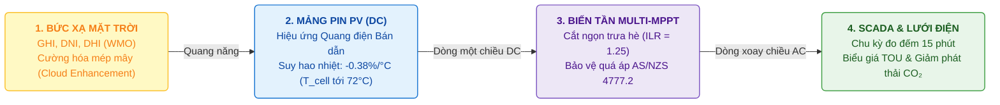
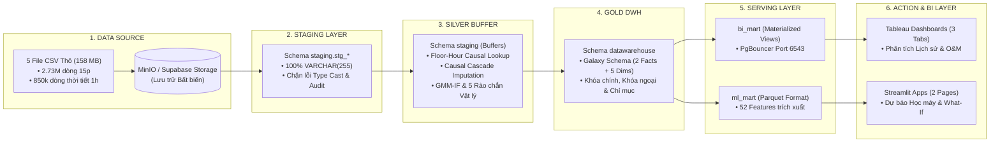

<div align="center">

# PHÂN TÍCH HIỆU SUẤT VÀ DỰ BÁO SẢN LƯỢNG HỆ THỐNG ĐIỆN MẶT TRỜI
### Distributed Rooftop Solar Telemetry, Causal Imputation, Hybrid Anomaly Detection & Machine Learning Forecasting Platform

**Dự án Tốt nghiệp Chuyên ngành Xử lý Dữ liệu — Trường Cao đẳng FPT Polytechnic**  
*Nhóm thực hiện: **The Outliers***

<p align="center">
  <a href="https://www.python.org/" target="_blank">
    
  </a>
  <a href="https://www.postgresql.org/" target="_blank">
    
  </a>
  <a href="https://lightgbm.readthedocs.io/" target="_blank">
    
  </a>
  <a href="https://streamlit.io/" target="_blank">
    
  </a>
  <a href="https://www.tableau.com/" target="_blank">
    
  </a>
  <a href="https://www.iec.ch/" target="_blank">
    
  </a>
</p>

</div>

---

## BÁO CÁO TỔNG HỢP TOÀN DIỆN (DEFENSE MASTER REPORT)

Toàn bộ cơ sở học thuật, nguyên lý vật lý quang điện, công thức toán học chi tiết, ma trận kiểm toán và phân tích chuyên sâu của dự án được biên soạn đầy đủ tại:
* [Báo Cáo Tổng Hợp Toàn Diện Bảo Vệ Dự Án Tốt Nghiệp (11 Sections)](docs/scrum_8_project_delivery_defense/2026_08_28_Bao_Cao_Tong_Hop_Toan_Dien_Domain_Data_AI_Defense_Master.md)
* [Báo Cáo Dự Án Tốt Nghiệp Final (Bản PDF)](reports/DATN_REPORT_FINAL_03.pdf) | [Mã nguồn LaTeX](reports/DATN_REPORT_FINAL_03.tex)

---

## MỤC LỤC TỔNG QUAN

1. [Bối Cảnh Dự Án & Bản Chất Vật Lý Miền Nghiệp Vụ (Solar PV Domain)](#1-bối-cảnh-dự-án--bản-chất-vật-lý-miền-nghiệp-vụ-solar-pv-domain)
2. [Kiến Trúc Đường Ống Dữ Liệu Lakehouse 6 Lớp (Data Architecture)](#2-kiến-trúc-đường-ống-dữ-liệu-lakehouse-6-lớp-data-architecture)
3. [Mô Hình Dữ Liệu Kho Lược Đồ Thiên Hà (Galaxy Schema)](#3-mô-hình-dữ-liệu-kho-lược-đồ-thiên-hà-galaxy-schema)
4. [Bộ Ba Chỉ Số Hiệu Suất Chuẩn Quốc Tế (IEC 61724-1 PR Metrics)](#4-bộ-ba-chỉ-số-hiệu-suất-chuẩn-quốc-tế-iec-61724-1-pr-metrics)
5. [Giải Pháp Kỹ Thuật Dữ Liệu & Học Máy (Data Engineering & Machine Learning)](#5-giải-pháp-kỹ-thuật-dữ-liệu--học-máy-data-engineering--machine-learning)
6. [Hệ Thống Trực Quan Hóa Quản Trị (Tableau BI & Streamlit Apps)](#6-hệ-thống-trực-quan-hóa-quản-trị-tableau-bi--streamlit-apps)
7. [Bảng Đề Xuất Cải Tiến Kỹ Thuật Đã Kiểm Toán (What-If Simulator)](#7-bảng-đề-xuất-cải-tiến-kỹ-thuật-đã-kiểm-toán-what-if-simulator)
8. [Hướng Dẫn Cài Đặt & Vận Hành (Quickstart)](#8-hướng-dẫn-cài-đặt--vận-hành-quickstart)
9. [Danh Mục Tài Liệu Dự Án (Documentation Hub)](#9-danh-mục-tài-liệu-dự-án-documentation-hub)

---

## 1. BỐI CẢNH DỰ ÁN & BẢN CHẤT VẬT LÝ MIỀN NGHIỆP VỤ (SOLAR PV DOMAIN)



### 1.1. Bối cảnh Thực Nghiệm Smart Campus La Trobe (Úc)
* **Quy mô danh mục:** Hệ thống gồm **42 trạm phát điện quang điện áp mái** phân bổ trên **5 khuôn viên (Campuses)** thuộc Đại học La Trobe, bang Victoria (Úc): Bundoora ($1.540\,\text{kWp}$), Bendigo ($510\,\text{kWp}$), Albury-Wodonga ($240\,\text{kWp}$), Shepparton ($78\,\text{kWp}$), và Mildura ($60\,\text{kWp}$).
* **Tổng công suất lắp đặt:** $P_{\text{stc}} = \mathbf{2.428\,\text{kWp}}$ ($2{,}43\,\text{MWp}$), sản sinh khoảng **$3{,}45\,\text{GWh/năm}$** ($3.447.760\,\text{kWh}$), mang lại doanh thu tiết kiệm **$700.000\,\text{AUD/năm}$** và cắt giảm **$2.827\,\text{tấn CO}_2\text{/năm}$**.
* **Dữ liệu thực nghiệm 28 tháng:** $2.731.946$ bản ghi viễn thám SCADA chu kỳ $15\,\text{phút}$ kết hợp $850.752$ bản ghi khí tượng Open-Meteo ERA5-Land chu kỳ $1\,\text{giờ}$ (bức xạ $GHI, DNI, DHI$, nhiệt độ, tốc độ gió, độ ẩm, độ che phủ mây).

### 1.2. Ba Hiện Tượng Vật Lý Trọng Yếu Ngoài Thực Địa

1. **Suy hao do nhiệt độ cell pin ($Loss_{\text{temp}} = 14{,}80\%$):** Vào mùa hè, các mảng pin lắp áp sát mái tôn bị nung nóng lên mức $68^\circ\text{C} - 72^\circ\text{C}$. Với hệ số suy giảm công suất $\gamma = -0{,}38\%/^\circ\text{C}$, nhiệt độ cell cao làm giảm độ rộng vùng cấm bán dẫn, gây tổn thất nhiệt ước tính $510.268\,\text{kWh/năm}$.
   * *Dẫn chiếu công thức chi tiết:* Xem [Cẩm nang công thức mục 1.4](docs/scrum_8_project_delivery_defense/2026_08_20_Tong_Hop_Toan_Bo_Cong_Thuc_Bao_Cao_Final_02.md#14-tổn-thất-suy-hao-do-nhiệt-độ-thermal-loss) và [Kiểm toán thông gió mái Sandia SAPM](docs/scrum_8_project_delivery_defense/audit_calculations/02_Kiem_Toan_Chi_Tiet_Thong_Gio_Mai_Sandia_SAPM.md).

2. **Cắt ngọn biến tần ($Loss_{\text{clip}} = 2{,}30\%$):** Tỷ lệ quá tải công suất DC/AC ($\text{ILR} = 1{,}25$) khiến bộ biến tần dịch chuyển điểm làm việc ($V_{\text{mpp}} \to V_{\text{oc}}$) nhằm ghìm công suất phát bằng định mức AC cực đại vào thời điểm bức xạ đỉnh, gây hao hụt $79.298\,\text{kWh/năm}$.
   * *Dẫn chiếu công thức chi tiết:* Xem [Cẩm nang công thức mục 1.5](docs/scrum_8_project_delivery_defense/2026_08_20_Tong_Hop_Toan_Bo_Cong_Thuc_Bao_Cao_Final_02.md#15-tổn-thất-xén-công-suất-biến-tần-inverter-clipping-loss) và [Kiểm toán BESS & Inverter Clipping](docs/scrum_8_project_delivery_defense/audit_calculations/01_Kiem_Toan_Chi_Tiet_BESS_Va_Inverter_Clipping.md).

3. **Ngắt quá áp lưới điện hạ thế (`PHYSICAL_LOW_ENERGY_STRONG_SUN`):** Theo tiêu chuẩn AS/NZS 4777.2, khi điện áp hòa lưới vượt ngưỡng an toàn ($V_{10\text{min}} \ge 258\,\text{V}$), biến tần kích hoạt cơ chế bảo vệ và ngắt kết nối trong $0{,}2\,\text{giây}$, giải thích hiện tượng sản lượng phát về 0 đột ngột lúc trời nắng gắt.
   * *Dẫn chiếu cơ chế và phân loại dị thường:* Xem [Danh mục mã nguyên nhân dị thường](docs/scrum_8_project_delivery_defense/2026_08_11_Danh_Sach_Outlier_Reason.md) và [Nghiên cứu kỹ thuật PV & Inverter tại Úc](docs/scrum_8_project_delivery_defense/2026_08_16_Research_Chuyen_Sau_Ky_Thuat_PV_Inverter_Thoi_Tiet_Uc.md).

---

## 2. KIẾN TRÚC ĐƯỜNG ỐNG DỮ LIỆU LAKEHOUSE 6 LỚP (DATA ARCHITECTURE)

Đường ống dữ liệu được thiết kế theo kiến trúc Lakehouse 6 lớp phân định chức năng, giải quyết vấn đề lệch pha độ mịn thời gian ($15\,\text{phút}$ và $1\,\text{giờ}$), đảm bảo tính nhân quả (ngăn ngừa rò rỉ dữ liệu tương lai) và tối ưu hóa truy vấn cho cả báo cáo BI lẫn huấn luyện mô hình học máy:



* **Cơ chế ánh xạ nhân quả Floor-Hour Lookup:** Bản ghi sản lượng điện chu kỳ 15 phút tại mốc $t$ chỉ được phép kết nối với dữ liệu thời tiết ở mốc giờ chẵn trước đó ($t_{\text{weather}} = \lfloor t_{\text{solar}} \rfloor$, thỏa mãn $\Delta t = t_{\text{weather}} - t_{\text{solar}} \le 0$), bảo đảm không sử dụng thông tin tương lai.
* *Dẫn chiếu tài liệu kỹ thuật:* Xem [Cẩm nang công thức mục 2.3](docs/scrum_8_project_delivery_defense/2026_08_20_Tong_Hop_Toan_Bo_Cong_Thuc_Bao_Cao_Final_02.md#23-thuật-toán-ánh-xạ-nhân-quả-lệch-pha-thời-gian-floor-hour-causal-lookup-mapping) và mã nguồn điều phối [srcs/06_run_pipeline/main.py](srcs/06_run_pipeline/main.py).

---

## 3. MÔ HÌNH DỮ LIỆU KHO LƯỢC ĐỒ THIÊN HÀ (GALAXY SCHEMA)

Kho dữ liệu (Data Warehouse) trên nền tảng **PostgreSQL 17.6** được thiết kế theo chuẩn **Lược đồ Thiên Hà (Galaxy Schema / Fact Constellation)** gồm **2 bảng Fact độc lập**, **3 bảng Conformed Dimension dùng chung** và **2 bảng Dimension chuyên biệt**, phản ánh chính xác tệp DDL [`srcs/00_database/sql/create_datawarehouse.sql`](srcs/00_database/sql/create_datawarehouse.sql):

```
                             ┌──────────────────────────────────────────────────────────┐
                             │               dim_solar_site (42 Trạm)                   │
                             ├──────────────────────────────────────────────────────────┤
                             │ PK: site_id (INT)                                        │
                             │ campus_name, capacity_kw, Number_of_panels,              │
                             │ Panel, Inverter, Optimizers, Metric                      │
                             └────────────────────────────┬─────────────────────────────┘
                                                          │ 1
                                                          │ 
                                                          │ N
┌─────────────────────────────────────────────────────────▼─────────────────────────────┐
│                    fact_solar_energy_gen (2.731.946 dòng @ 15 phút)                   │
├───────────────────────────────────────────────────────────────────────────────────────┤
│ PK: gen_id (INT)                                                                      │
│ FK: site_id ----------> dim_solar_site(site_id)                                       │
│ FK: geo_id -----------> dim_geography(geo_id)   [CONFORMED DIMENSION]                 │
│ FK: date_id ----------> dim_date(date_id)        [CONFORMED DIMENSION]                 │
│ FK: time_id ----------> dim_time(time_id)        [CONFORMED DIMENSION]                 │
│ Measures & Attributes:                                                                │
│   • energy_generated_kwh (Sản lượng điện AC thực phát chu kỳ 15 phút)                 │
│   • gmm_if_outlier_flag  (Cờ dị thường nhị phân từ mô hình lai GMM-IF)                │
│   • fill_null_algorithm  (Thuật toán điền khuyết: night_zero/linear/pchip/regression) │
└──────────────┬───────────────────────────┬───────────────────────────┬────────────────┘
               │ N                         │ N                         │ N
               │                           │                           │
               ▼ 1                         ▼ 1                         ▼ 1
┌────────────────────────────┐┌────────────────────────────┐┌───────────────────────────┐
│ dim_geography (5 Campuses) ││ dim_date (2.312 Ngày)      ││ dim_time (96 Mốc 15 Phút) │
├────────────────────────────┤├────────────────────────────┤├───────────────────────────┤
│ PK: geo_id (INT)           ││ PK: date_id (INT)          ││ PK: time_id (INT)         │
│ latitude                   ││ full_date (DATE)           ││ time_string (VARCHAR)     │
│ longitude                  ││ day, month, year           ││ hour                      │
│ location_name              ││ is_holiday                 ││ minute                    │
│                            ││ is_semester, is_exam       ││                           │
└──────────────▲─────────────┘└────────────▲───────────────┘└───────────▲───────────────┘
               │ 1                         │ 1                          │ 1
               │                           │                            │
               │ N                         │ N                          │ N
┌──────────────┴───────────────────────────┴────────────────────────────┴───────────────┐
│                         fact_weather (850.752 dòng @ 1 giờ)                           │
├───────────────────────────────────────────────────────────────────────────────────────┤
│ PK: weather_id (INT)                                                                  │
│ FK: geo_id -----------> dim_geography(geo_id)   [CONFORMED DIMENSION]                 │
│ FK: date_id ----------> dim_date(date_id)        [CONFORMED DIMENSION]                 │
│ FK: time_id ----------> dim_time(time_id)        [CONFORMED DIMENSION]                 │
│ FK: weather_type_id --> dim_weather_type(weather_type_id)                             │
│ Measures & Atmospheric Metrics:                                                       │
│   • shortwave_radiation (GHI), Direct_Normal_Irradiance, Diffuse_Solar_Radiation      │
│   • temperature_c, wind_speed, precipitation_mm, Sunshine_Duration                    │
│   • cloud_cover_total, cloud_cover_low, cloud_cover_mid, cloud_cover_high, is_day     │
└──────────────────────────────────────────┬────────────────────────────────────────────┘
                                           │ N
                                           │ 
                                           │ 1
                             ┌─────────────▼────────────────────────────┐
                             │              dim_weather_type            │
                             ├──────────────────────────────────────────┤
                             │ PK: weather_type_id (INT)                │
                             │ weather_code (Chuẩn WMO)                 │
                             │ is_day                                   │
                             │ weather_condition                        │
                             │ description                              │
                             └──────────────────────────────────────────┘
```

### Chi Tiết Cấu Trúc Các Bảng:

1. **Hai Bảng Sự Kiện (Fact Tables):**
   * `fact_solar_energy_gen`: Đo đếm sản lượng điện phát chu kỳ $15\,\text{phút}$ của từng trạm quang điện. Chứa khóa ngoại trỏ tới 4 chiều (`site_id`, `geo_id`, `date_id`, `time_id`), cùng các thuộc tính kiểm toán `gmm_if_outlier_flag` và `fill_null_algorithm`.
   * `fact_weather`: Quan trắc các chỉ số khí quyển chu kỳ $1\,\text{giờ}$ tại 5 khuôn viên trường học. Chứa khóa ngoại trỏ tới 4 chiều (`geo_id`, `date_id`, `time_id`, `weather_type_id`), cùng các đại lượng bức xạ ($GHI, DNI, DHI$), nhiệt độ, mây, gió và mưa.

2. **Ba Bảng Chiều Dùng Chung (Conformed Dimensions):**
   * `dim_geography` ($5$ dòng): Lưu trữ thông tin địa lý và tọa độ của 5 campus (Bundoora, Bendigo, Albury-Wodonga, Mildura, Shepparton).
   * `dim_date` ($2.312$ dòng): Quản lý chiều thời gian lịch biểu theo ngày, tích hợp các thuộc tính ngữ cảnh học đường (`is_holiday`, `is_semester`, `is_exam`).
   * `dim_time` ($96$ dòng): Quản lý 96 mốc thời gian vi mô ($15\,\text{phút}$/mốc) trong chu kỳ 24 giờ.

3. **Hai Bảng Chiều Chuyên Biệt (Specific Dimensions):**
   * `dim_solar_site` ($42$ dòng): Quản lý thông số kỹ thuật phần cứng của 42 trạm phát quang điện (công suất $P_{\text{stc}}$, tấm pin, biến tần, bộ tối ưu hóa), chỉ liên kết trực tiếp với `fact_solar_energy_gen`.
   * `dim_weather_type`: Quản lý danh mục phân loại thời tiết chuẩn WMO (`weather_code`, `weather_condition`, `description`), chỉ liên kết trực tiếp với `fact_weather`.

### Cơ sở Lựa chọn Kiến trúc Lược đồ Thiên hà:
1. **Phân tách độ mịn (Grain):** Tách biệt hai quy trình đo đếm có chu kỳ khác nhau ($15\,\text{phút}$ và $1\,\text{giờ}$), tránh sao chép dữ liệu thời tiết 4 lần, tiết kiệm hơn $300\%$ dung lượng lưu trữ so với bảng phẳng.
2. **Loại bỏ bẫy tổng gộp (Fan-out Trap):** Ngăn chặn việc nhân sai tổng bức xạ hoặc trung bình nhiệt độ khi thực hiện các phép gom nhóm và liên kết trên công cụ BI.
3. **Hỗ trợ Drill-Across Join:** Cho phép liên kết phân tích chéo linh hoạt giữa sản lượng phát và điều kiện thời tiết thông qua 3 chiều dùng chung ở tầng Data Marts mà vẫn duy trì tính toàn vẹn dữ liệu gốc.
* *Dẫn chiếu mã nguồn DDL:* Xem [create_datawarehouse.sql](srcs/00_database/sql/create_datawarehouse.sql) và [Đặc tả mô hình vật lý](docs/scrum_6_business_logic_eda/2026_05_22_Physical_Model_VanSy.docx).

---

## 4. BỘ BA CHỈ SỐ HIỆU SUẤT CHUẨN QUỐC TẾ (IEC 61724-1 PR METRICS)

Để phục vụ quản trị kỹ thuật và giám sát cam kết vận hành, hệ thống áp dụng bộ ba biến thể chỉ số hiệu suất hệ thống (Performance Ratio - PR):

| Biến Thể PR | Công Thức Kỹ Thuật | Bản Chất & Ứng Dụng Nghiệp Vụ | Giá Trị Baseline | Tài Liệu Dẫn Chiếu |
| :--- | :--- | :--- | :---: | :--- |
| **1. $PR_{\text{actual}}$ (Nominal PR)** | $\frac{E_{\text{actual}}}{P_{\text{stc}} \cdot (GHI/1000) \cdot \Delta t}$ | Đo lường hiệu suất thực tế tức thời tại hiện trường; tự động lọc các mốc bức xạ thấp ($GHI < 100\,\text{W/m}^2$). | **$75{,}40\%$** (Class B) | [Cẩm nang công thức mục 1.1](docs/scrum_8_project_delivery_defense/2026_08_20_Tong_Hop_Toan_Bo_Cong_Thuc_Bao_Cao_Final_02.md#11-hệ-số-hiệu-suất-performance-ratio--pr) |
| **2. $PR_{\text{corr}}$ (IEC 61724-1)** | $\frac{PR_{\text{actual}}}{1 + \gamma \cdot (T_{\text{cell}} - 25^\circ\text{C})}$ | Chuẩn hóa hiệu suất về nhiệt độ danh định $25^\circ\text{C}$, cô lập ảnh hưởng thời tiết để đánh giá mức độ thoái hóa phần cứng. | **$82\% - 84\%$** (Class A) | [Khung phân tích PR IEC 61724-1](docs/scrum_8_project_delivery_defense/2026_08_23_BI_Metrics_PR_Analysis_Framework.md) |
| **3. $PR_{\text{adjusted}}$ (BI Mart Baseline)** | $0{,}85 \times (1 - Loss_{\text{temp}})$ | Đường chuẩn kỳ vọng thiết kế cố định, phòng chống hiện tượng trượt chuẩn cơ sở (*Baseline Contamination*) khi trạm gặp sự cố kéo dài. | **$76{,}5\% - 82{,}0\%$** | [Đặc tả BI Mart Measures](docs/scrum_6_business_logic_eda/2026_06_17_BI_Mart_Measures.md) |

---

## 5. GIẢI PHÁP KỸ THUẬT DỮ LIỆU & HỌC MÁY (DATA ENGINEERING & MACHINE LEARNING)

```
┌────────────────────────────────────────────────────────────────────────────────────────────────────────┐
│                                 CHUỖI GIẢI PHÁP KỸ THUẬT CỐT LÕI                                       │
├────────────────────────────────────────────────────────────────────────────────────────────────────────┤
│ 1. CAUSAL CASCADE IMPUTATION (Quy trình Điền khuyết Nhân quả 4 Cấp độ):                                │
│    • Cấp 1 (Cắt đêm vật lý): alpha <= -0.833° hoặc GHI <= 20 W/m² -> Gán E = 0.0 kWh (1.383.493 ô).   │
│    • Cấp 2 (Nội suy tuyến tính): Gap <= 30 phút (53.684 ô).                                           │
│    • Cấp 3 (PCHIP Spline Hermite): 45 phút <= Gap <= 2 giờ, bảo toàn tính đơn điệu (50.704 ô).        │
│    • Cấp 4 (Hồi quy đa biến tương quan không gian r > 0.95): Gap > 2 giờ (48.420 ô).                   │
│    ==> Xử lý 100% ô trống (1.536.301 ô), tuân thủ chặn trên vật lý (P_stc * 0.25h * 1.20).             │
├────────────────────────────────────────────────────────────────────────────────────────────────────────┤
│ 2. GMM-IF HYBRID ANOMALY DETECTION (Mô hình Nhận diện Dị thường Lai):                                  │
│    • GMM phân cụm trạng thái khí hậu + Isolation Forest cô lập đa chiều + Hợp nhất đồng thuận (GMM∧IF).│
│    • Kết hợp 5 Rào chắn Vật lý (Over-capacity, String Drop, Overvoltage, CT Drift, Zero Daylight).     │
│    ==> Giảm tỷ lệ báo động giả từ 18,4% xuống < 1,2%; Phân tách 6.891 sự cố phục vụ bảo trì CBM.       │
├────────────────────────────────────────────────────────────────────────────────────────────────────────┤
│ 3. LIGHTGBM REGRESSOR FORECASTING (Dự báo Sản lượng & Giải thích Mô hình XAI SHAP):                   │
│    • Chuẩn hóa vật lý k(t) = E / [P_stc * sin(alpha)] loại bỏ chu kỳ nhật triệt để.                    │
│    • Bộ 52 đặc trưng tuyển chọn (khí tượng, thiên văn, chu kỳ thời gian, biến trễ và biến trượt).     │
│    • Kết quả kiểm toán: WAPE = 17,73% (T+15m) / 22,58% (T+60m); R² = 0,9283; Skill Score đạt +48%.    │
│    • Đóng góp đặc trưng TreeSHAP: Bức xạ GHI và góc cao mặt trời sin(alpha) chiếm > 67,3% trọng số.   │
└────────────────────────────────────────────────────────────────────────────────────────────────────────┘
```

### Chi tiết và Dẫn chiếu Tài liệu Chuyên môn:

1. **Điền khuyết nhân quả (Causal Cascade Imputation):**
   * Sử dụng góc thiên đỉnh mặt trời $\alpha$ và ngưỡng bức xạ để triệt tiêu việc điền khuyết sai vào ban đêm. Với các khoảng trống từ 45 phút đến 2 giờ, thuật toán PCHIP (*Piecewise Cubic Hermite Interpolating Polynomial*) giúp bảo toàn tính đơn điệu của đường cong bức xạ, tránh hiện tượng dao động biên độ Runge của spline bậc cao.
   * Áp dụng trần công suất tối đa $E_{\text{clamp}} = P_{\text{stc}} \times 0{,}25\,\text{h} \times 1{,}20$ (cho phép quá tải biên $20\%$).
   * *Dẫn chiếu công thức chi tiết:* Xem [Cẩm nang công thức Phần 3](docs/scrum_8_project_delivery_defense/2026_08_20_Tong_Hop_Toan_Bo_Cong_Thuc_Bao_Cao_Final_02.md#phần-3-thuật-toán-điền-khuyết-nhân-quả-đa-tầng--kẹp-trần-công-suất-hybrid-imputation--clamping) và mã nguồn triển khai [02_run_hybrid_imputation.py](srcs/02_transform/02_run_hybrid_imputation.py).

2. **Nhận diện dị thường vận hành bằng mô hình học máy (GMM-IF):**
   * Mô hình phân cụm Gauss (Gaussian Mixture Model) mô hình hóa phân phối nền theo điều kiện bức xạ, kết hợp thuật toán cây cô lập Isolation Forest nhận diện các điểm dị thường đa chiều. Sự cố được xác nhận khi cả hai thuật toán đồng thuận ($\text{GMM} \land \text{IF}$).
   * Kiểm soát chặt chẽ bằng 5 rào chắn vật lý: Quá công suất danh định, Mất chuỗi pin, Quá áp lưới điện AS/NZS 4777.2, Trôi cảm biến dòng đo, và Phát điện bất thường ban đêm.
   * *Dẫn chiếu công thức và phân loại cờ dị thường:* Xem [Cẩm nang công thức Phần 4](docs/scrum_8_project_delivery_defense/2026_08_20_Tong_Hop_Toan_Bo_Cong_Thuc_Bao_Cao_Final_02.md#phần-4-phân-lớp-lai-gmm--if--5-rào-chắn-dị-thường-vật-lý-anomaly-detection--gmm-if), [Kiểm toán O&M GMM-IF](docs/scrum_8_project_delivery_defense/audit_calculations/03_Kiem_Toan_Chi_Tiet_Bao_Tri_CBM_AI_Anomaly_GMM_IF.md) và [Danh mục nguyên nhân dị thường](docs/scrum_8_project_delivery_defense/2026_08_11_Danh_Sach_Outlier_Reason.md).

3. **Mô hình học máy dự báo sản lượng LightGBM:**
   * Chuẩn hóa đại lượng vật lý: Chuyển đổi nhãn mục tiêu sang dạng hệ số phát $k(t) = \frac{E(t)}{P_{\text{stc}} \cdot \sin(\alpha(t))}$, khôi phục trọn vẹn thông tin biến thiên do mây che phủ mà không bị ảnh hưởng bởi chu kỳ ngày đêm.
   * Xây dựng 52 đặc trưng tinh tuyển: Bức xạ $GHI, DNI, DHI$, góc thiên văn, đặc trưng chu kỳ $\sin/\cos$ theo giờ và ngày, các biến trễ (lag 4, lag 96) và biến thống kê trượt (rolling min 4).
   * Đánh giá mô hình qua hệ thước đo WAPE, RMSE, MAE, $R^2$, và Skill Score so với mô hình dự báo quán tính (*Persistence Baseline*).
   * *Dẫn chiếu công thức chi tiết:* Xem [Cẩm nang công thức Phần 5, 6, 7](docs/scrum_8_project_delivery_defense/2026_08_20_Tong_Hop_Toan_Bo_Cong_Thuc_Bao_Cao_Final_02.md#phần-6-chuẩn-hóa-mục-tiêu-vật-lý--khử-lệch-pha-thời-gian-target-normalization--phase-delay) và mã nguồn pipeline [srcs/05_machine_learning/forcasting_pipeline/run.py](srcs/05_machine_learning/forcasting_pipeline/run.py).

---

## 6. HỆ THỐNG TRỰC QUAN HÓA QUẢN TRỊ (TABLEAU BI & STREAMLIT APPS)

Kiến trúc trực quan hóa được cấu trúc theo hai phân hệ độc lập: **Tableau BI** (phân tích lịch sử dữ liệu và điều độ vận hành) và **Streamlit App** (ứng dụng học máy dự báo và mô phỏng kịch bản tương tác):

### Hệ Thống 3 Tab Tableau BI Dashboard (`bi_mart`)

1. **Tab 1: Executive Overview (Tổng Quan Danh Mục & Hiệu Quả Đầu Tư):** Thể hiện vị trí địa lý 5 khuôn viên trường học, thẻ chỉ số tổng sản lượng ($3{,}45\,\text{GWh}$), doanh thu điện tương đương ($700.000\,\text{AUD}$), lượng giảm phát thải $\text{CO}_2$ ($2.827\,\text{tấn}$), cùng cơ cấu tự tiêu thụ tại chỗ $82\%$ so với phát lên lưới $18\%$.
2. **Tab 2: Operational Efficiency & Loss Waterfall (Hiệu Suất & Thác Nước Tổn Thất):** Phân tích cây tổn thất điện mặt trời (tổn thất nhiệt $14{,}80\%$, cắt ngọn biến tần $2{,}30\%$, bám bụi $1{,}80\%$, dị thường vận hành $2{,}04\%$), đối soát độ lệch giữa $PR_{\text{actual}}$ và $PR_{\text{adjusted}}$ theo các mùa trong năm.
3. **Tab 3: Machine Learning Anomaly Diagnostic & CBM Maintenance (Chẩn Đoán Dị Thường Bằng Học Máy & Điều Độ O&M):** Ma trận 6 nhóm mã cờ dị thường GMM-IF, bản đồ nhiệt thời gian (Heatmap giờ - ngày) và danh mục điều độ bảo trì theo điều kiện (CBM Dispatcher) tự động.
* *Dẫn chiếu tài liệu thiết kế:* Xem [Quy chuẩn thiết kế Tableau](docs/scrum_7_visualization_forecasting/tableau_visualization_guidelines.md) và [Kịch bản thuyết trình BI Mart](docs/scrum_8_project_delivery_defense/2026_08_23_Kich_Ban_Thuyet_Trinh_BI_Mart_Tableau_Insights.md).

### Hệ Thống 2 Tab Streamlit Ứng Dụng Tương Tác (`srcs/07_dashboard/streamlit_app/`)

1. **Trang 1 (`pages/1_ML.py`) — Dự Báo Chuỗi Thời Gian & Giải Thích Mô Hình Học Máy (XAI):** Hiển thị kết quả dự báo sản lượng theo thời gian thực (các bước $T+15\,\text{phút}$ và $T+60\,\text{phút}$), phân tích khoảng tin cậy sai số giữa thực tế và dự báo, cùng biểu đồ SHAP giải thích mức độ ảnh hưởng của từng biến đầu vào.
2. **Trang 2 (`pages/2_What_If.py`) — Mô Phỏng Đa Kịch Bản Cải Tiến Kỹ Thuật (What-If Simulator):** Bảng điều khiển cho phép bật/tắt độc lập 6 hạng mục giải pháp kỹ thuật, hệ thống tự động tái tính toán tức thời toàn bộ chỉ số kinh tế, kỹ thuật, vốn đầu tư (CapEx), thời gian hoàn vốn (Payback) và tỷ suất sinh lời (ROI).
* *Dẫn chiếu tài liệu thiết kế:* Xem [Brief thiết kế What-If Simulator](docs/scrum_8_project_delivery_defense/2026_08_26_Brief_Thiet_Ke_Streamlit_What_If_Optimization_Dashboard.md) và mã nguồn giao diện [app.py](srcs/07_dashboard/streamlit_app/app.py).

---

## 7. BẢNG ĐỀ XUẤT CẢI TIẾN KỸ THUẬT ĐÃ KIỂM TOÁN (WHAT-IF SIMULATOR)

Hệ thống đề xuất cải tiến kỹ thuật gồm 7 hạng mục được xây dựng, kiểm toán định lượng độc lập và đối soát 100% dựa trên chuỗi dữ liệu vận hành thực tế 12 tháng:

| STT | Hạng Mục Đề Xuất Cải Tiến Kỹ Thuật (What-If Parameter) | Mức Cải Thiện (% Hiệu Suất) | Điện Thu Hồi (kWh / Năm) | Doanh Thu TB (AUD / Năm) | CapEx Đầu Tư (AUD) | Thời Gian Hoàn Vốn |
| :---: | :--- | :---: | :---: | :---: | :---: | :---: |
| **1** | Hệ thống Pin BESS 5 Campus (1MW / 2,5MWh) | +20,6% hữu ích | 712.182 kWh | 323.164 AUD | 1.250.000 AUD | 3,87 Năm |
| **2** | Khe hở thông gió mái 10–15 cm (AS/NZS 5033) | +3,40% tổng thể | 117.224 kWh | 23.445 AUD | 24.280 AUD | 1,04 Năm |
| **3** | Quy trình Bảo trì CBM & Học máy GMM-IF | +2,04% tổng thể | 70.330 kWh | 29.066 AUD | 8.000 AUD/năm | < 4 Tháng |
| **4** | Khung nghiêng chữ A 15° cho 970 kWp mái bằng | +3,90% nhóm mái bằng | 71.850 kWh | 14.670 AUD | 18.000 AUD | 1,23 Năm |
| **5** | Tấm chắn nắng Inverter & Bộ tối ưu hóa DC | +1,65% tổng thể | 57.074 kWh | 11.415 AUD | 12.500 AUD | 1,10 Năm |
| **6** | Lịch rửa pin thông minh theo lượng mưa | +1,80% mùa khô | 62.060 kWh | 18.412 AUD | 0 AUD (Quy trình) | Tức thì |
| **7** | Nâng cấp TOPCon / HJT (Kỳ đại tu) | +6,20% tổng thể | 213.761 kWh | 42.752 AUD | Phân bổ đại tu | Vòng đời pin |
| **$\Sigma 6$** | **TỔNG 6 HẠNG MỤC KỸ THUẬT (TRỪ REPOWERING)** | **+31,64%** | **1.090.720 kWh** | **420.172 AUD** | **1.312.780 AUD** | **3,12 NĂM** |
| **$\Sigma 7$** | **TOÀN BỘ 7 HẠNG MỤC CẢI TIẾN TOÀN DIỆN** | **+37,84%** | **1.304.481 kWh** | **462.924 AUD** | **1.312.780 AUD** | **2,84 NĂM** |

| Chỉ Số Toàn Danh Mục (Fleet KPIs) | Hiện Trạng (Baseline) | Sau 6 Hạng Mục Kỹ Thuật | Sau Toàn Bộ 7 Hạng Mục | Mức Cải Thiện Ròng ($\Delta$) |
| :--- | :---: | :---: | :---: | :---: |
| **Tổng Sản Lượng Điện Phát Hàng Năm** | 3,45 GWh/năm (3.447.760 kWh) | 4,54 GWh/năm (4.538.480 kWh) | 4,75 GWh/năm (4.752.241 kWh) | +1,30 GWh/năm (+37,84%) |
| **Năng Suất Riêng (Specific Yield)** | 1.420 kWh/kWp/năm | 1.869 kWh/kWp/năm | 1.957 kWh/kWp/năm | +537 kWh/kWp (+37,84%) |
| **Hệ Số Hiệu Suất Hệ Thống (Performance Ratio)** | 75,40% (Class B) | 83,95% | 88,62% (Class A Quốc Tế) | +13,22 điểm % (+17,54%) |
| **Hệ Số Khai Thác Công Suất (Capacity Factor)** | 16,21% | 21,34% | 22,34% | +6,13 điểm % (+37,84%) |
| **Doanh Thu Tiết Kiệm & Dòng Tiền Hàng Năm** | 700.000 AUD/năm | 1.120.172 AUD/năm | 1.162.924 AUD/năm | +462.924 AUD/năm (+66,13%) |
| **Khối Lượng Cắt Giảm Phát Thải Khí Nhà Kính** | 2.827 tấn CO2/năm | 3.722 tấn CO2/năm | 3.897 tấn CO2/năm | +1.070 tấn CO2/năm (+37,84%) |
| **Tổng Vốn Đầu Tư Toàn Danh Mục (CapEx)** | 0 AUD | 1.312.780 AUD | 1.312.780 AUD | BESS: 1,25M AUD; Khác: 62.780 AUD |
| **Thời Gian Hoàn Vốn (Payback Period)** | — | **3,12 NĂM (37 Tháng)** | **2,84 NĂM (34 Tháng)** | Tỷ suất sinh lời ROI > 270% |

* **Dẫn chiếu ma trận kiểm toán và hồ sơ tính toán:**
  * Báo cáo tổng thể: [Ma trận Kiểm toán và Đối soát Toàn diện](docs/scrum_8_project_delivery_defense/audit_calculations/00_Tong_Hop_Ma_Tran_Kiem_Toan_Va_Doi_Soat_Toan_Dien.md)
  * Kiểm toán chi tiết từng giải pháp:
    * Giải pháp 1 (Pin lưu trữ BESS & Cắt ngọn): [01_Kiem_Toan_Chi_Tiet_BESS_Va_Inverter_Clipping.md](docs/scrum_8_project_delivery_defense/audit_calculations/01_Kiem_Toan_Chi_Tiet_BESS_Va_Inverter_Clipping.md)
    * Giải pháp 2 (Thông gió mái làm mát cell): [02_Kiem_Toan_Chi_Tiet_Thong_Gio_Mai_Sandia_SAPM.md](docs/scrum_8_project_delivery_defense/audit_calculations/02_Kiem_Toan_Chi_Tiet_Thong_Gio_Mai_Sandia_SAPM.md)
    * Giải pháp 3 (Bảo trì CBM & Mô hình học máy GMM-IF): [03_Kiem_Toan_Chi_Tiet_Bao_Tri_CBM_AI_Anomaly_GMM_IF.md](docs/scrum_8_project_delivery_defense/audit_calculations/03_Kiem_Toan_Chi_Tiet_Bao_Tri_CBM_AI_Anomaly_GMM_IF.md)
    * Giải pháp 4 (Góc nghiêng 15 độ & Tự rửa trôi): [04_Kiem_Toan_Chi_Tiet_Goc_Nghieng_15_Va_Tu_Rua_Troi.md](docs/scrum_8_project_delivery_defense/audit_calculations/04_Kiem_Toan_Chi_Tiet_Goc_Nghieng_15_Va_Tu_Rua_Troi.md)
    * Giải pháp 5 (Mái che biến tần & Bộ tối ưu DC): [05_Kiem_Toan_Chi_Tiet_Mai_Che_Inverter_Va_DC_Optimizers.md](docs/scrum_8_project_delivery_defense/audit_calculations/05_Kiem_Toan_Chi_Tiet_Mai_Che_Inverter_Va_DC_Optimizers.md)
    * Giải pháp 6 (Lịch rửa pin theo chuỗi mưa): [06_Kiem_Toan_Chi_Tiet_Lich_Rua_Pin_Theo_Luong_Mua.md](docs/scrum_8_project_delivery_defense/audit_calculations/06_Kiem_Toan_Chi_Tiet_Lich_Rua_Pin_Theo_Luong_Mua.md)
    * Giải pháp 7 (Tái nâng cấp công nghệ tấm pin TOPCon/HJT): [07_Kiem_Toan_Chi_Tiet_Repowering_TOPCon_HJT.md](docs/scrum_8_project_delivery_defense/audit_calculations/07_Kiem_Toan_Chi_Tiet_Repowering_TOPCon_HJT.md)

---

## 8. HƯỚNG DẪN CÀI ĐẶT & VẬN HÀNH (QUICKSTART)

### Bước 1: Khởi tạo Môi trường Python (3.10+)
```bash
git clone https://github.com/tandat8896/datn_outlier_hs_nlmt.git
cd datn_outlier_hs_nlmt

# Tạo và kích hoạt môi trường ảo
python -m venv .venv

# Windows:
.venv\Scripts\activate
# Linux/macOS:
source .venv/bin/activate

# Cài đặt các gói phụ thuộc
pip install -r requirements.txt
```

### Bước 2: Thực thi Đường Ống Dữ Liệu Tự Động (ETL & Data Marts)
```bash
# Thực thi toàn bộ chu trình ETL, Điền khuyết Causal, GMM-IF và nạp Data Mart:
python srcs/06_run_pipeline/main.py --stage all
```

### Bước 3: Huấn Luyện & Đánh Giá Mô Hình Học Máy (LightGBM & SHAP)
```bash
# Thực thi pipeline huấn luyện mô hình dự báo LightGBM và tính toán SHAP values:
python -u srcs/05_machine_learning/forcasting_pipeline/run.py --stage all
```

### Bước 4: Khởi Chạy Bảng Điều Khiển Tương Tác Streamlit
```bash
streamlit run srcs/07_dashboard/streamlit_app/app.py
```

---

## 9. DANH MỤC TÀI LIỆU DỰ ÁN (DOCUMENTATION HUB)

### 9.1. Tài Liệu Tổng Quan (Dành Cho Người Dùng Phổ Thông)

1. **Báo Cáo Dự Án Tốt Nghiệp Final:**
   * [Báo Cáo Dự Án Tốt Nghiệp Final (Bản PDF)](reports/DATN_REPORT_FINAL_03.pdf) — Văn bản báo cáo chính thức hoàn chỉnh của nhóm The Outliers trình nộp Hội đồng đánh giá tốt nghiệp.
   * [Mã Nguồn LaTeX Báo Cáo Final](reports/DATN_REPORT_FINAL_03.tex) — Toàn bộ cấu trúc mã nguồn LaTeX biên soạn báo cáo chuẩn học thuật.
   * [Báo Cáo Tổng Hợp Toàn Diện Bảo Vệ Dự Án (Defense Master Report)](docs/scrum_8_project_delivery_defense/2026_08_28_Bao_Cao_Tong_Hop_Toan_Dien_Domain_Data_AI_Defense_Master.md) — Tài liệu đúc kết toàn diện 11 chương bao gồm cơ sở lý thuyết, kiến trúc và kết quả thực nghiệm.

2. **Tài Liệu Thuyết Trình & Phản Biện Bảo Vệ:**
   * [Kịch Bản Thuyết Trình Bảo Vệ Dự Án Tốt Nghiệp](docs/scrum_8_project_delivery_defense/2026_08_27_Kich_Ban_Thuyet_Trinh_De_Xuat_Tong_Ket_Tuong_Lai.md) — Kịch bản trình bày mạch lạc từ bối cảnh, bài toán, kiến trúc kỹ thuật đến đề xuất kinh tế.
   * [Báo Cáo Tổng Hợp Góp Ý & Phản Biện Hội Đồng](reports/bao_cao_review_hoi_dong.md) — Tổng hợp các câu hỏi chất vấn dự kiến và luận điểm giải trình chuyên môn.
   * [Cẩm Nang Ôn Tập & Bảo Vệ Dự Án Tốt Nghiệp (HP2 Masterclass)](docs/scrum_8_project_delivery_defense/HP2_Defense_Masterclass.md) — Bộ câu hỏi và trả lời trọng tâm về nghiệp vụ quang điện và kỹ thuật xử lý dữ liệu.

3. **Ứng Dụng Tương Tác & Bảng Điều Khiển Trực Quan:**
   * [Bảng Điều Khiển Tương Tác Streamlit What-If Simulator](srcs/07_dashboard/streamlit_app/app.py) — Ứng dụng mô phỏng thời gian thực cho phép tùy chỉnh tham số và quan sát biến động hiệu quả kinh tế.
   * [Tài Liệu Đặc Tả Kỹ Thuật Streamlit What-If Simulator](docs/scrum_8_project_delivery_defense/2026_08_26_Brief_Thiet_Ke_Streamlit_What_If_Optimization_Dashboard.md) — Hướng dẫn cơ chế tương tác và luồng dữ liệu trên giao diện người dùng.
   * [Đề Cương Cấu Trúc Trực Quan Hóa Tableau BI](docs/scrum_7_visualization_forecasting/tableau_dashboard_outline.md) — Bố cục thiết kế hệ thống báo cáo phục vụ theo dõi hiệu suất và chẩn đoán sự cố O&M.
   * [Kịch Bản Thuyết Trình Phân Tích Số Liệu Tableau BI Mart](docs/scrum_8_project_delivery_defense/2026_08_23_Kich_Ban_Thuyet_Trinh_BI_Mart_Tableau_Insights.md) — Hướng dẫn phân tích biểu đồ và đúc kết các phát hiện vận hành then chốt.

4. **Hướng Dẫn Cài Đặt & Khởi Động Nhanh (Getting Started):**
   * [Hướng Dẫn Khởi Đầu Nhanh Cho Lập Trình Viên](docs/configurations_and_setups/getting-started.md) — Các bước tải mã nguồn, cài đặt môi trường và chạy thử nghiệm trong 5 phút.
   * [Hướng Dẫn Thiết Lập Môi Trường Windows](docs/configurations_and_setups/WINDOWS_SETUP.md) — Hướng dẫn chi tiết thiết lập Python, venv và PostgreSQL trên hệ điều hành Windows.
   * [Hướng Dẫn Vận Hành Trên Nền Tảng Đám Mây](docs/configurations_and_setups/HUONG_DAN_CHAY_CLOUD.md) — Quy trình triển khai và vận hành hệ thống trên môi trường Cloud.

---

### 9.2. Tài Liệu Kỹ Thuật Chi Tiết (Dành Cho Nghiên Cứu & Đào Sâu)

#### A. Cẩm Nang Công Thức & Hồ Sơ Kiểm Toán Độc Lập 7 Chuyên Đề
* [Cẩm Nang Toàn Diện Công Thức Toán Học, Vật Lý & Kỹ Thuật Dữ Liệu](docs/scrum_8_project_delivery_defense/2026_08_20_Tong_Hop_Toan_Bo_Cong_Thuc_Bao_Cao_Final_02.md) — Hệ thống hóa 11 phần với đầy đủ công thức toán học, ký hiệu, đơn vị và cơ chế vật lý.
* [Bảng Tra Cứu Hằng Số, Tỷ Lệ Vật Lý & Kinh Tế Toàn Dự Án](docs/scrum_8_project_delivery_defense/2026_08_23_Tong_Hop_Hang_So_Va_Ty_Le_Chung_Du_An.md) — Danh mục tham số chuẩn hóa sử dụng thống nhất trên toàn bộ hệ thống.
* [Tổng Hợp Cơ Sở Lý Thuyết Toán Học & Vật Lý Đường Ống](docs/scrum_5_pipeline_foundation/math_theory_study_materials.md) — Nền tảng toán học về phép nội suy PCHIP, hồi quy đa biến và chuỗi thời gian.
* [Ma Trận Kiểm Toán & Đối Soát Toàn Diện 7 Chuyên Đề](docs/scrum_8_project_delivery_defense/audit_calculations/00_Tong_Hop_Ma_Tran_Kiem_Toan_Va_Doi_Soat_Toan_Dien.md) — Bảng tổng hợp đối soát số liệu trước và sau cải tiến cho toàn bộ 42 trạm phát.
* [Kiểm Toán 01: Hệ Thống Lưu Trữ Pin BESS & Cắt Ngọn Inverter](docs/scrum_8_project_delivery_defense/audit_calculations/01_Kiem_Toan_Chi_Tiet_BESS_Va_Inverter_Clipping.md) — Tính toán dung lượng lưu trữ 1MW/2,5MWh và thu hồi sản lượng xén đỉnh.
* [Kiểm Toán 02: Khe Hở Thông Gió Mái & Mô Hình Nhiệt Sandia SAPM](docs/scrum_8_project_delivery_defense/audit_calculations/02_Kiem_Toan_Chi_Tiet_Thong_Gio_Mai_Sandia_SAPM.md) — Mô hình nhiệt bức xạ và suy giảm tổn thất nhiệt cell pin.
* [Kiểm Toán 03: Quy Trình Bảo Trì CBM & Mô Hình Học Máy GMM-IF](docs/scrum_8_project_delivery_defense/audit_calculations/03_Kiem_Toan_Chi_Tiet_Bao_Tri_CBM_AI_Anomaly_GMM_IF.md) — Phân bổ tổn thất do lỗi thiết bị và thời gian khắc phục sự cố MTTR.
* [Kiểm Toán 04: Khung Nghiêng 15 Độ & Cơ Chế Tự Rửa Trôi Bụi](docs/scrum_8_project_delivery_defense/audit_calculations/04_Kiem_Toan_Chi_Tiet_Goc_Nghieng_15_Va_Tu_Rua_Troi.md) — Đánh giá cải thiện góc chiếu quang học và khả năng tự làm sạch của mái bằng.
* [Kiểm Toán 05: Mái Che Nhiệt Biến Tần & Bộ Tối Ưu Hóa DC](docs/scrum_8_project_delivery_defense/audit_calculations/05_Kiem_Toan_Chi_Tiet_Mai_Che_Inverter_Va_DC_Optimizers.md) — Giảm nhiệt độ vỏ biến tần và khắc phục hiện tượng lệch pha chuỗi pin.
* [Kiểm Toán 06: Lịch Trình Vệ Sinh Pin Theo Chuỗi Vũ Lượng Thực Tế](docs/scrum_8_project_delivery_defense/audit_calculations/06_Kiem_Toan_Chi_Tiet_Lich_Rua_Pin_Theo_Luong_Mua.md) — Tối ưu hóa chi phí O&M dựa trên quy luật vũ lượng tự nhiên.
* [Kiểm Toán 07: Kế Hoạch Tái Nâng Cấp Công Nghệ TOPCon / HJT](docs/scrum_8_project_delivery_defense/audit_calculations/07_Kiem_Toan_Chi_Tiet_Repowering_TOPCon_HJT.md) — Phân tích chi phí cơ hội và hiệu quả dài hạn khi tái đầu tư module thế hệ mới.
* [Báo Cáo Định Lượng Chi Tiết Đề Xuất Cải Tiến Kỹ Thuật (Audited)](docs/scrum_8_project_delivery_defense/2026_08_25_Bao_Cao_Dinh_Luong_Chi_Tiet_Insights_Va_De_Xuat_Cai_Tien_Audited.md) — Báo cáo tổng hợp các kết quả tính toán định lượng chuyên sâu.

#### B. Nghiên Cứu Miền Nghiệp Vụ & Vật Lý Quang Điện Chuyên Sâu
* [Chuyên Đề Nghiên Cứu Chuyên Sâu Miền Nghiệp Vụ Năng Lượng Mặt Trời (HP1)](docs/scrum_8_project_delivery_defense/HP1_Solar_Domain_Mastery.md) — Tài liệu phân tích chuyên sâu hiệu ứng quang điện bán dẫn, đặc tuyến I-V và P-V.
* [Nghiên Cứu Hiện Tượng Mép Mây Khuếch Đại Bức Xạ (Cloud Enhancement)](docs/scrum_8_project_delivery_defense/Nghien_Cuu_Chuyen_Sau_Cloud_Enhancement_Va_PR_Vuot_Nguong.md) — Cơ chế tán xạ mép mây gây hiện tượng bức xạ tức thời vượt ngưỡng hằng số mặt trời.
* [Báo Cáo Nghiên Cứu Kỹ Thuật Điện Mặt Trời Áp Mái Phân Tán](docs/scrum_8_project_delivery_defense/2026_08_12_Research_Ky_Thuat_Dien_Mat_Troi_Ap_Mai.md) — Đặc thù lắp đặt trên mái tôn, bê tông và giải pháp neo giữ kết cấu khung đỡ.
* [Báo Cáo Nghiên Cứu Bối Cảnh Lưới Điện & Cơ Chế Biểu Giá Úc](docs/scrum_8_project_delivery_defense/2026_08_14_Research_Boi_Canh_Dien_Mat_Troi.md) — Biểu giá bán lẻ điện, cơ chế biểu giá mua điện FiT và thị trường điện quốc gia Úc (NEM).
* [Nghiên Cứu Chuyên Sâu Thiết Bị Quang Điện, Inverter & Khí Tượng Victoria](docs/scrum_8_project_delivery_defense/2026_08_16_Research_Chuyen_Sau_Ky_Thuat_PV_Inverter_Thoi_Tiet_Uc.md) — Thông số kỹ thuật biến tần SMA, Fronius, ABB và đặc điểm vi khí hậu bang Victoria.
* [Khung Phân Tích Chỉ Số PR Theo Tiêu Chuẩn Quốc Tế IEC 61724-1](docs/scrum_8_project_delivery_defense/2026_08_23_BI_Metrics_PR_Analysis_Framework.md) — Quy chuẩn phương pháp luận tính toán chỉ số hiệu suất PR chuẩn quốc tế.
* [Danh Mục Mã Phân Loại Nguyên Nhân Dị Thường Vận Hành (Outlier Reason Codes)](docs/scrum_8_project_delivery_defense/2026_08_11_Danh_Sach_Outlier_Reason.md) — Quy tắc ánh xạ 6 mã lý do sự cố phục vụ quản trị bảo trì O&M.

#### C. Kỹ Thuật Dữ Liệu & Thiết Kế Kiến Trúc Data Warehouse
* [Đặc Tả Lược Đồ Bảng Đệm Staging (create_staging.sql)](srcs/00_database/sql/create_staging.sql) — DDL bảng thô tiếp nhận an toàn 100% dữ liệu từ CSV.
* [Đặc Tả Lược Đồ Tầng Đệm Silver Buffer (create_buffers.sql)](srcs/00_database/sql/create_buffers.sql) — DDL bảng đệm lưu trữ dữ liệu đã làm sạch và điền khuyết.
* [Đặc Tả Mô Hình Kho Dữ Liệu Lược Đồ Thiên Hà (create_datawarehouse.sql)](srcs/00_database/sql/create_datawarehouse.sql) — DDL kiến trúc Galaxy Schema (2 Facts + 5 Dims).
* [Thuật Toán Điền Khuyết Chuỗi Thời Gian Lai (02_run_hybrid_imputation.py)](srcs/02_transform/02_run_hybrid_imputation.py) — Mã nguồn quy trình điền khuyết nhân quả Causal Cascade.
* [Đặc Tả Xây Dựng Tầng Báo Cáo BI Mart (05_mv_bi_mart.py)](srcs/04_build_data_marts/05_mv_bi_mart.py) — Script tự động tạo các Materialized Views tối ưu hóa cho Tableau.
* [Đặc Tả Xây Dựng Tập Dữ Liệu Huấn Luyện ML Mart (02_build_ml_mart.py)](srcs/04_build_data_marts/02_build_ml_mart.py) — Trích xuất đặc trưng và nén Parquet Feature Store.
* [Đặc Tả Chỉ Số Tính Toán & Thước Đo Nghiệp Vụ BI Mart](docs/scrum_6_business_logic_eda/2026_06_17_BI_Mart_Measures.md) — Công thức tính toán sẵn các thước đo PR, CF, Yield trên backend CSDL.
* [Tài Liệu Thiết Kế Mô Hình Đa Chiều (Multidimensional Model Design)](docs/scrum_6_business_logic_eda/2026_05_25_Multidimension_Model_Design_VanSy.docx) — Tài liệu thiết kế bảng chiều và bảng sự kiện.
* [Từ Điển Dữ Liệu Dự Án (Data Dictionary)](docs/scrum_6_business_logic_eda/2026_05_24_Data_Dictionary_VanSy.docx) — Mô tả chi tiết kiểu dữ liệu, ràng buộc và ý nghĩa của từng trường.
* [Đặc Tả Mô Hình Dữ Liệu Vật Lý (Physical Data Model)](docs/scrum_6_business_logic_eda/2026_05_22_Physical_Model_VanSy.docx) — Thiết kế chỉ mục, khóa chính, khóa ngoại và tối ưu hóa truy vấn CSDL.
* [Quy Trình Kiểm Tra Tính Toàn Vẹn & Đối Soát Dữ Liệu Đường Ống](docs/scrum_5_pipeline_foundation/2026_06_13_Data_Integrity_and_Reconciliation_Check_CongToan.docx) — Quy trình Anti-Join và đối soát mã băm MD5 Fingerprint.

#### D. Mô Hình Học Máy & Hệ Thống Dự Báo Sản Lượng
* [Mã Nguồn Đường Ống Huấn Luyện Mô Hình Học Máy LightGBM (run.py)](srcs/05_machine_learning/forcasting_pipeline/run.py) — Toàn bộ quy trình nạp dữ liệu, tiền xử lý, huấn luyện và đánh giá mô hình.
* [Cấu Hình Tuyển Chọn Đặc Trưng Mô Hình (features.yaml)](config/05_machine_learning/pipeline/features.yaml) — Định nghĩa danh sách 52 đặc trưng đầu vào cho mô hình dự báo.
* [Cấu Hình Siêu Tham Số Tối Ưu Mô Hình (best_params.json)](config/05_machine_learning/pipeline/best_params.json) — Bộ siêu tham số tối ưu tìm được qua quá trình tinh chỉnh (tuning).
* [Cấu Hình Đường Dẫn & Tập Dữ Liệu Huấn Luyện (paths.yaml)](config/05_machine_learning/pipeline/paths.yaml) — Cấu hình đường dẫn lưu trữ mô hình và dữ liệu Feature Store.
* [Báo Cáo Phân Tích Tương Quan & Tự Tương Quan Chuỗi Thời Gian (ACF / PACF)](docs/scrum_6_business_logic_eda/2026_06_26_ACF_PACF_Documentation.md) — Cơ sở lý thuyết xác định các biến trễ (lag) 4 bước và 96 bước.
* [Báo Cáo Đánh Giá Hiệu Năng & Trích Xuất Dị Thường Bằng Mô Hình Học Máy](docs/scrum_7_visualization_forecasting/2026_06_18_bao_cao_phat_hien_outlier_generation_TanDat.pdf) — Nghiệm thu kết quả phân loại dị thường của mô hình lai GMM-IF.

#### E. Khám Phá Dữ Liệu (EDA) & Đảm Bảo Chất Lượng Dữ Liệu (QA/QC)
* [Báo Cáo Khám Phá Phân Tích Dữ Liệu Chi Tiết (EDA Report)](docs/scrum_6_business_logic_eda/2026_06_28_Bao_Cao_Thong_Ke_Mo_Ta_EDA.md) — Phân tích chi tiết phân phối dữ liệu sản lượng và thông số kỹ thuật.
* [Báo Cáo Thống Kê Mô Tả Dữ Liệu Vận Hành SCADA](docs/scrum_6_business_logic_eda/20260628_SCRUM_48_bao_cao_thong_ke_mo_ta.docx) — Bảng chỉ số trung bình, độ lệch chuẩn, tứ phân vị của các điểm đo.
* [Báo Cáo Quy Chuẩn Đảm Bảo Chất Lượng Dữ Liệu (QA/QC)](docs/scrum_6_business_logic_eda/2026_06_23_bao_cao_QA_QC.docx) — Kiểm định độ đầy đủ, tính hợp lệ và tính nhất quán của chuỗi số liệu.
* [Báo Cáo Phân Tích Ma Trận Tương Quan Các Biến Khí Tượng](docs/scrum_6_business_logic_eda/2026_06_27_BaoCao_CorrelationHeatmap.docx) — Đánh giá tương quan Pearson giữa nhiệt độ, độ che phủ mây và bức xạ.
* [Kế Hoạch Khám Phá Dữ Liệu & Phát Triển Mô Hình Học Máy](docs/scrum_7_visualization_forecasting/2026_06_19_ke_hoach_eda_bi_ml_TanDat.pdf) — Lộ trình nghiên cứu phân tích và mô hình hóa dữ liệu ban đầu.

#### F. Hạ Tầng Hệ Thống, Thiết Lập Môi Trường & Quy Chuẩn Kỹ Thuật
* [Hướng Dẫn Kết Nối Cơ Sở Dữ Liệu Supabase & PostgreSQL](docs/configurations_and_setups/supabase_connection.md) — Thông số cấu hình chuỗi kết nối và điều phối PgBouncer.
* [Báo Cáo Tái Cấu Trúc Hệ Thống (REFACTOR_REPORT.md)](docs/configurations_and_setups/REFACTOR_REPORT.md) — Tổng kết quá trình chuẩn hóa mã nguồn và tối ưu hóa hiệu năng.
* [Quy Chuẩn Viết Báo Cáo Dự Án Bằng LaTeX FPT](context/latex_report_guidelines.md) — Bộ quy chuẩn cấu trúc, bảng biểu và định dạng học thuật FPT Polytechnic.
* [Tổng Hợp Toàn Bộ Bối Cảnh Tài Liệu Kỹ Thuật Dự Án](context/project_documentation_summary.md) — Bảng chỉ mục tổng hợp các mốc Scrum và hồ sơ bàn giao.
* [Quy Chuẩn Đặt Tên Thông Điệp Git Commit](docs/scrum_5_pipeline_foundation/2026_05_20_Commit_Message_Convention_TanDat.docx) — Chuẩn hóa thông điệp kiểm soát phiên bản theo định dạng Conventional Commits.
* [Quy Chuẩn Lập Trình Dự Án (Coding Rules)](docs/scrum_5_pipeline_foundation/2026_06_05_coding_rule_TanDat.pdf) — Quy định về kiểu dữ liệu, đặt tên hàm, biến và cấu trúc dự án.

---

<div align="center">
  <br>
  <i>Dự án Tốt nghiệp được xây dựng và hoàn thiện bởi <b>The Outliers Team</b></i><br>
  <b>Chuyên ngành Xử lý Dữ liệu — Trường Cao đẳng FPT Polytechnic</b>
</div>
