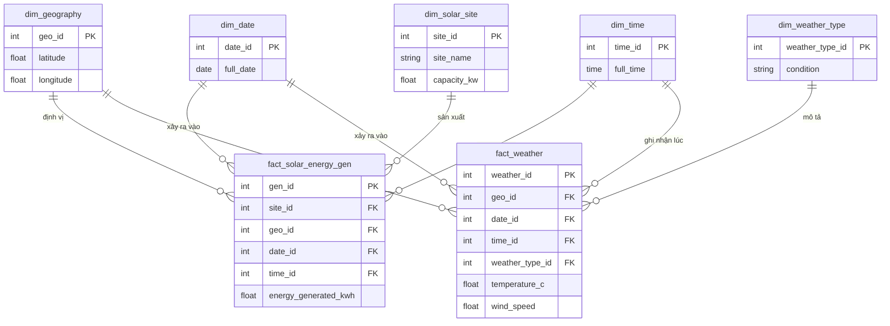
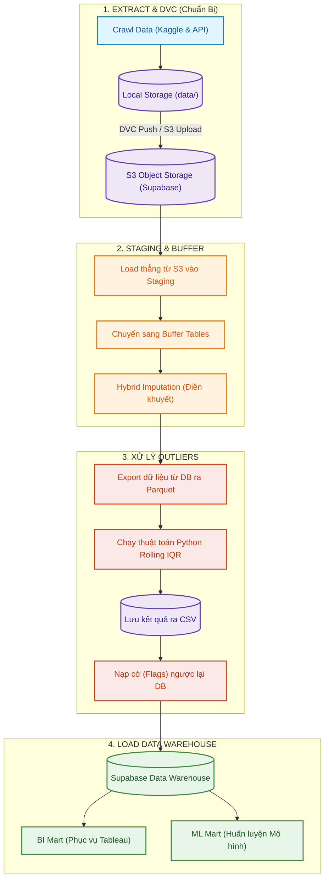

<div align="center">

# HỆ THỐNG PHÂN TÍCH VÀ DỰ BÁO SẢN LƯỢNG ĐIỆN MẶT TRỜI
**Dự án Tốt nghiệp chuyên ngành Xử lý Dữ liệu - The Outliers**

<p align="center">
  <a href="https://www.python.org/" target="_blank">
    
  </a>
  <a href="https://supabase.com/" target="_blank">
    
  </a>
  <a href="https://www.postgresql.org/" target="_blank">
    
  </a>
  <a href="https://scikit-learn.org/" target="_blank">
    
  </a>
  <a href="https://dvc.org/" target="_blank">
    
  </a>
</p>

[Tổng quan](#tổng-quan-dự-án) • [Cài đặt Nhanh](#bắt-đầu-nhanh-quick-start) • [Kiến trúc](#kiến-trúc-hệ-thống) • [ETL Pipeline](#quy-trình-vận-hành-dữ-liệu-data-engineering-pipeline) • [Tài liệu Chi tiết](#tổng-hợp-tài-liệu-dự-án-documentation-hub)

</div>

---

## TỔNG QUAN DỰ ÁN

Dự án xây dựng một **Hệ thống phân tích, phát hiện bất thường và dự báo sản lượng điện** cho 42 trạm điện quang điện (PV) tại Úc. Bằng cách kết hợp dữ liệu vận hành thực tế và dữ liệu khí tượng viễn thám từ Open-Meteo, dự án mang đến quy trình ETL tự động hóa mạnh mẽ, cung cấp Insight kinh doanh giá trị và hỗ trợ **bảo trì dự đoán (Predictive Maintenance)**.

**Mục tiêu cốt lõi:**
1. Xây dựng Data Warehouse tích hợp dữ liệu thời tiết và sản lượng.
2. Tự động hóa Pipeline ETL: lọc nhiễu ban đêm, xử lý missing data và các bất thường (Outliers).
3. Đào tạo mô hình học máy (ARIMA, Prophet) phục vụ dự báo.
4. Xây dựng Dashboard để tối ưu hóa quyết định vận hành.

---

## BẮT ĐẦU NHANH (QUICK START)

Dành cho những người dùng muốn chạy thử và trải nghiệm hệ thống phân tích ngay lập tức.

### 1. Chuẩn bị Môi trường (Yêu cầu Python 3.10+)

```bash
git clone https://github.com/tandat8896/datn_outlier_hs_nlmt.git
cd datn_outlier_hs_nlmt

# Tạo và kích hoạt Virtual Environment
python -m venv .venv
source .venv/bin/activate  # (Dành cho Windows: .venv\Scripts\activate)

# Cài đặt thư viện
pip install -r requirements.txt
```

### 2. Cấu hình Cơ sở dữ liệu
Hệ thống sử dụng cơ sở dữ liệu PostgreSQL (Supabase). Copy file mẫu cấu hình:
```bash
cp .env.example .env
```
Mở file `.env` vừa tạo và điền các thông tin kết nối Supabase của bạn. Kiểm tra kết nối:
```bash
python tests/test_db_connection.py
```

### 3. Vận hành Toàn bộ Hệ thống (Pipeline)
Dự án được quản lý tập trung qua một điểm điều khiển duy nhất (Orchestrator).
```bash
# Lệnh chạy tự động toàn bộ quy trình: từ trích xuất, làm sạch, lọc outlier đến nạp kho dữ liệu
python srcs/06_run_pipeline/main.py --stage all
```

---

## KIẾN TRÚC HỆ THỐNG

Hệ thống lưu trữ trên **Supabase (PostgreSQL)** với kiến trúc **Lược đồ Thiên hà (Galaxy Schema)** để xử lý đồng thời hai tập dữ kiện có độ trễ/tần suất khác nhau: Sản lượng (15 phút) và Thời tiết (1 giờ).



> **Đọc thêm tài liệu chuyên sâu:**
> - [Thiết kế Data Warehouse (Galaxy Schema)](docs/configurations_and_setups/supabase_connection.md)
> - [Từ điển Dữ liệu Toàn diện (Data Dictionary)](docs/scrum_6_business_logic_eda/2026_05_24_Data_Dictionary_VanSy.docx)

---

## QUY TRÌNH VẬN HÀNH DỮ LIỆU (DATA ENGINEERING PIPELINE)

Quy trình ETL của dự án không chỉ diễn ra hoàn toàn trong CSDL mà là sự kết hợp chặt chẽ giữa **Python Orchestrator**, **Quản lý phiên bản DVC**, **S3 Object Storage** và **PostgreSQL (Supabase)**.



**Các đặc điểm kỹ thuật nổi bật:**
- **DVC & S3 Storage:** Dữ liệu thô và dữ liệu sinh ra giữa các bước được quản lý bằng DVC và lưu trên S3 (Supabase Storage) nhằm tránh phình to dung lượng Git. CSDL lấy thẳng dữ liệu từ S3 để tiết kiệm băng thông.
- **Tách lớp Staging & Buffer:** Dữ liệu chưa qua xử lý nằm ở Staging, sau đó đổ sang Buffer để tiến hành làm sạch, nội suy tuyến tính (Hybrid Imputation).
- **Outlier Detection Hybrid:** Thay vì dùng hàm SQL chậm chạp, hệ thống xuất dữ liệu ra Parquet, dùng Python/Pandas chạy thuật toán Rolling IQR phát hiện nhiễu đột biến, rồi nạp lại "cờ" (Outlier Flags) vào CSDL.

> **Đọc thêm tài liệu chuyên sâu:**
> - [Báo cáo Lọc Outlier & Missing Data (Toán học & Code)](docs/scrum_6_business_logic_eda/2026_06_14_bao_cao_outliner_TanDat.pdf)
> - [Hướng dẫn & Báo cáo Tích hợp DVC Storage](docs/configurations_and_setups/2026_06_21_BaoCaoDVC_NgoTanDat.pdf)

---

## CÁC INSIGHT NỔI BẬT

Sau khi phân tích trên Kho dữ liệu sạch, nhóm đã rút ra được các kết luận giá trị:
- **Suy hao do nhiệt độ (Thermal Degradation):** Hiệu suất tấm pin giảm mạnh khi nhiệt độ vượt quá 25°C. Buổi trưa bức xạ cao nhất không đồng nghĩa với sản lượng đạt đỉnh tuyệt đối.
- **Tín hiệu cảnh báo bảo trì:** Khi sản lượng thực tế sụt giảm so với Baseline (dự báo) trong khi bức xạ vẫn cao, hệ thống sẽ chẩn đoán tấm pin đang bị bám bẩn hoặc Inverter lỗi.
- **Nhiễu rò rỉ:** Khám phá dòng điện rò ban đêm (18h-5h). Nếu bỏ qua trong khâu ETL, sẽ dẫn đến sai số doanh thu lũy kế hàng năm.

---

## TỔNG HỢP TÀI LIỆU DỰ ÁN (DOCUMENTATION HUB)

Để tiện cho người dùng có nhu cầu tìm hiểu chuyên sâu, cũng như các Admin/Kỹ sư cần tiếp nhận và bảo trì hệ thống, toàn bộ tài liệu dự án được tổng hợp và phân loại logic dưới đây:

### 1. DÀNH CHO QUẢN TRỊ VIÊN & KỸ SƯ DỮ LIỆU (ADMIN / DATA ENGINEER)
*Các tài liệu thiết lập hạ tầng, cài đặt tự động hóa và kiến trúc nền tảng:*
- **Hướng dẫn Cài đặt Môi trường & Cloud:**
  - [Hướng dẫn cấu hình Database Supabase và Galaxy Schema](docs/configurations_and_setups/supabase_connection.md)
  - [Cẩm nang đưa dự án lên Cloud (Supabase/Docker)](docs/configurations_and_setups/HUONG_DAN_CHAY_CLOUD.md)
  - [Hướng dẫn thiết lập môi trường Windows](docs/configurations_and_setups/WINDOWS_SETUP.md)
- **Kiểm soát & Quản lý Mã Nguồn / Dữ Liệu:**
  - [Hướng dẫn Quản lý Dữ liệu lớn bằng DVC](docs/configurations_and_setups/2026_06_21_BaoCaoDVC_NgoTanDat.pdf)
  - [Quy chuẩn Đặt tên và Commit Git](docs/scrum_5_pipeline_foundation/2026_05_20_Commit_Message_Convention_TanDat.docx)
  - [Quy tắc Viết Mã Nguồn Sạch (Coding Rules)](docs/configurations_and_setups/2026_06_05_coding_rule_TanDat.pdf)
  - [Báo cáo Tái cấu trúc dự án (Refactor Codebase)](docs/configurations_and_setups/2026_06_21_bao_cao_refactor_NgoTanDat.pdf)
- **Tài liệu Chi tiết Mã Nguồn:** 
  - [Hướng dẫn Đọc/Chạy Thư mục `srcs/`](srcs/README.md)

### 2. DÀNH CHO KỸ SƯ PHÂN TÍCH & KHOA HỌC DỮ LIỆU (DATA ANALYST / SCIENTIST)
*Các báo cáo về logic dữ liệu, phát hiện bất thường và trực quan hóa:*
- **Kiến trúc Cơ sở dữ liệu (Data Modeling):**
  - [Từ điển Dữ liệu Toàn diện (Data Dictionary)](docs/scrum_6_business_logic_eda/2026_05_24_Data_Dictionary_VanSy.docx)
  - [Thiết kế Mô hình Logic & Vật lý (Logical/Physical Model)](docs/scrum_6_business_logic_eda/2026_05_22_Physical_Model_VanSy.docx)
  - [Báo cáo Tổng quan thiết kế Data Mart](docs/scrum_5_pipeline_foundation/2026_06_19_BÁO_CÁO_TỔNG_QUAN_HỆ_THỐNG_DATA_MART_By_Toàn.docx)
- **Logic Nghiệp vụ & Khám phá Dữ liệu (EDA):**
  - [Giải thích thuật toán Lọc Nhiễu & Xử lý Outlier](docs/scrum_6_business_logic_eda/2026_06_14_bao_cao_outliner_TanDat.pdf)
  - [Định nghĩa Hệ thống KPIs và Measures kinh doanh (BI Mart)](docs/scrum_6_business_logic_eda/2026_06_17_BI_Mart_Measures.md)
  - [Báo cáo Phát hiện Outlier Generation](docs/scrum_7_visualization_forecasting/2026_06_18_bao_cao_phat_hien_outlier_generation_TanDat.pdf)
- **Kiểm soát Chất lượng (QA/QC):**
  - [Kế hoạch và Thực thi QA/QC Dữ liệu](docs/scrum_6_business_logic_eda/2026_06_21%20bao_cao_QA_QC.docx)
  - [Đối soát Tính toàn vẹn Dữ liệu (Data Integrity)](docs/scrum_5_pipeline_foundation/2026_06_13_Data_Integrity_and_Reconciliation_Check_CongToan.docx)

### 3. DÀNH CHO NGƯỜI DÙNG PHỔ THÔNG & ĐÁNH GIÁ (GENERAL USER)
- Mời bạn đón đọc **[Báo cáo Luận văn Tốt nghiệp Chính thức (PDF)](reports/)** tại thư mục Reports để xem toàn cảnh đồ án từ A đến Z, kèm theo các file thuyết trình, biểu đồ minh họa.
- Nếu muốn xem tài liệu lịch sử làm việc theo từng chu kỳ ngắn hạn, vui lòng tham khảo **[Mục lục Sổ tay Scrum (docs/)](docs/README.md)**.

<div align="center">
  <br>
  <i>Được phát triển bởi đội ngũ <b>The Outliers</b></i>
</div>
