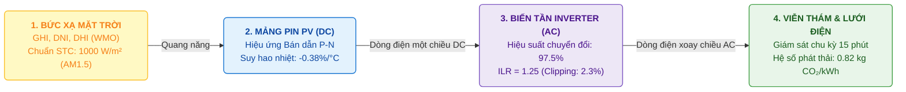
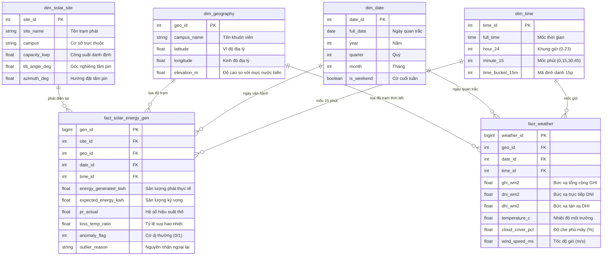

<div align="center">

# HỆ THỐNG XỬ LÝ DỮ LIỆU, NHẬN DIỆN DỊ THƯỜNG VẬN HÀNH VÀ DỰ BÁO SẢN LƯỢNG 42 TRẠM ĐIỆN MẶT TRỜI TẠI ÚC
### Distributed Rooftop Solar Telemetry, Causal Imputation, Hybrid Anomaly Detection & Machine Learning Forecasting Platform

**Đồ án Tốt nghiệp Chuyên ngành Phân tích & Xử lý Dữ liệu (Data Analytics) — Trường Cao đẳng FPT Polytechnic**  
*Nhóm thực hiện: **The Outliers***

<p align="center">
  <a href="https://www.python.org/" target="_blank">
    
  </a>
  <a href="https://supabase.com/" target="_blank">
    
  </a>
  <a href="https://lightgbm.readthedocs.io/" target="_blank">
    
  </a>
  <a href="https://www.tableau.com/" target="_blank">
    
  </a>
  <a href="https://dvc.org/" target="_blank">
    
  </a>
  <a href="https://www.iec.ch/" target="_blank">
    
  </a>
</p>

</div>

---

## MỤC LỤC TỔNG QUAN
- [1. Bối Cảnh Nghiên Cứu & Miền Nghiệp Vụ (Solar Domain)](#1-bối-cảnh-nghiên-cứu--miền-nghiệp-vụ-solar-domain)
  - [1.1. Bối cảnh Thực nghiệm Smart Campus La Trobe](#11-bối-cảnh-thực-nghiệm-smart-campus-la-trobe)
  - [1.2. Cơ sở Vật lý Quang điện & Chuẩn Đo lường Quốc tế](#12-cơ-sở-vật-lý-quang-điện--chuẩn-đo-lường-quốc-tế)
  - [1.3. Bốn Thách thức Kỹ thuật Trọng yếu](#13-bốn-thách-thức-kỹ-thuật-trọng-yếu)
- [2. Kiến Trúc Hệ Thống Luồng Dữ Liệu 6 Lớp (6-Layer Architecture)](#2-kiến-trúc-hệ-thống-luồng-dữ-liệu-6-lớp-6-layer-architecture)
- [3. Mô Hình Hóa Dữ Liệu Kho (Galaxy Schema)](#3-mô-hình-hóa-dữ-liệu-kho-galaxy-schema)
- [4. Các Phương Pháp Kỹ Thuật Trọng Tâm](#4-các-phương-pháp-kỹ-thuật-trọng-tâm)
  - [4.1. Điền khuyết Nhân quả Đa tầng (Causal Cascade Imputation)](#41-điền-khuyết-nhân-quả-đa-tầng-causal-cascade-imputation)
  - [4.2. Nhận diện Dị thường Lai GMM-IF & 5 Rào chắn Vật lý](#42-nhận-diện-dị-thường-lai-gmm-if--5-rào-chắn-vật-lý)
  - [4.3. Tầng Phục vụ BI Data Mart & Trực quan hóa Quản trị Tableau](#43-tầng-phục-vụ-bi-data-mart--trực-quan-hóa-quản-trị-tableau)
  - [4.4. Học Máy Dự Báo Công Suất Ngắn Hạn (LightGBM Regressor)](#44-học-máy-dự-báo-công-suất-ngắn-hạn-lightgbm-regressor)
- [5. Kết Quả Phân Tích & Khuyến Nghị Kỹ Thuật O&M](#5-kết-quả-phân-tích--khuyến-nghị-kỹ-thuật-om)
- [6. Hướng Dẫn Cài Đặt & Vận Hành Nhanh (Quickstart)](#6-hướng-dẫn-cài-đặt--vận-hành-nhanh-quickstart)
- [7. Danh Mục Tài Liệu Kỹ Thuật & Hệ Thống (Documentation Hub)](#7-danh-mục-tài-liệu-kỹ-thuật--hệ-thống-dự-án-documentation-hub)

---

## 1. BỐI CẢNH NGHIÊN CỨU & MIỀN NGHIỆP VỤ (SOLAR DOMAIN)



### 1.1. Bối cảnh Thực nghiệm Smart Campus La Trobe
- **Quy mô mạng lưới:** Hệ thống gồm **42 trạm phát điện mặt trời áp mái (Rooftop PV)** phân tán tại **5 cơ sở (Campuses)** thuộc Đại học La Trobe (bang Victoria, Úc): Bundoora (Melbourne), Bendigo, Albury-Wodonga, Mildura, và Shepparton.
- **Tổng công suất lắp đặt:** $P_{\text{stc}} = \mathbf{2.428\,\text{kWp}}$ ($2{,}43\,\text{MWp}$ theo công suất danh định toàn mạng lưới; trong đó $2.271{,}51\,\text{kWp}$ ghi nhận chi tiết theo siêu dữ liệu 25 trạm), phục vụ chiến lược Net Zero Carbon và tự chủ năng lượng khuôn viên trường.
- **Tập dữ liệu viễn thám Telemetry:** **$2.731.946$ bản ghi** đo lường liên tục ở chu kỳ **15 phút** trong suốt 28 tháng (01/01/2020 – 30/04/2022).
- **Dữ liệu tái phân tích khí tượng ERA5-Land (ECMWF):** **$850.752$ bản ghi** khí tượng cấp **1 giờ** thu thập qua Open-Meteo REST API (8 biến WMO: Bức xạ $GHI, DNI, DHI$, Nhiệt độ $T_{\text{ambient}}$, Tốc độ gió, Độ ẩm, Áp suất, Góc thiên đỉnh).
- **Chỉ số thống kê vận hành:** Tổng sản lượng tích lũy đạt **$9{,}06\,\text{GWh}$** ($9.064.825\,\text{kWh}$ toàn bộ dữ liệu kho sau ETL; mốc đối soát chuẩn **$7{,}50\,\text{GWh}$** ~ $7.498.000\,\text{kWh}$), giúp cắt giảm **$6.148 - 7.433\,\text{tấn CO}_2$** phát thải gián tiếp Scope 2 và tiết kiệm khoảng **$1{,}12 - 1{,}45\,\text{triệu AUD}$** chi phí năng lượng.

### 1.2. Cơ sở Vật lý Quang điện & Chuẩn Đo lường Quốc tế
1. **Hiệu ứng Quang điện & Suy hao Nhiệt ($\gamma$):**
   Mỗi $1^\circ\text{C}$ nhiệt độ cell pin vượt mốc tiêu chuẩn $25^\circ\text{C}$ ($T_{\text{STC}}$), công suất phát bị suy giảm **$\gamma = -0{,}38\%/^\circ\text{C}$**. Vào buổi trưa mùa hè tại bang Victoria, nhiệt độ cell có thể đạt $68^\circ\text{C} - 72^\circ\text{C}$ ($T_{\text{cell}} = T_{\text{ambient}} + GHI \times 0{,}03$), dẫn đến suy hao nhiệt $Loss_{\text{temp}}$ từ **$14{,}8\% - 17{,}5\%$**.
2. **Khung Bộ Chỉ số Hiệu năng theo IEC 61724-1:**
   - **Hệ số Hiệu suất thô ($PR_{\text{actual}}$):** Phản ánh trạng thái tức thời của hệ thống: $PR_{\text{actual}} = \frac{E_{\text{actual}}}{P_{\text{stc}} \cdot (GHI / 1000) \cdot \Delta t}$.
   - **Hiệu suất kỳ vọng ($PR_{\text{adjusted}}$):** Mốc tham chiếu kỹ thuật độc lập: $PR_{\text{adjusted}} = 0{,}85 \times (1 - Loss_{\text{temp}})$.
   - **Hiệu suất chuẩn hóa nhiệt ($PR_{\text{correct}}$):** Bù trừ ảnh hưởng nhiệt độ về mốc $25^\circ\text{C}$ theo IEC 61724-1 Phụ lục B để đánh giá tình trạng phần cứng: $PR_{\text{correct}} = \frac{PR_{\text{actual}}}{1 + \gamma \cdot (T_{\text{cell}} - 25^\circ\text{C})}$.
   - **Hệ số Công suất (Capacity Factor — $CF$):** $CF = \frac{E_{\text{actual}}}{P_{\text{stc}} \times 24\,\text{h}} \times 100\%$. Trung bình toàn mạng lưới đạt $17{,}2\%$ (Mùa hè: $20{,}0\%$, Mùa đông: $7{,}03\%$).
   - **Năng suất Riêng (Final Yield — $Y_f$):** Trung bình đạt **$4{,}35\,\text{kWh/kWp/ngày}$**.

### 1.3. Bốn Thách thức Kỹ thuật Trọng yếu
| Thách thức | Đặc tính Kỹ thuật & Vật lý | Giải pháp Áp dụng |
| :--- | :--- | :--- |
| **1. Lệch pha thời gian** | Sản lượng đo chu kỳ 15 phút ($2.73\text{M}$ dòng) vs Thời tiết đo chu kỳ 1 giờ ($850\text{k}$ dòng). | Khớp nối nhân quả sàn giờ (**Floor-Hour Matching**) và tổng hợp tầng BI Mart 1 giờ. |
| **2. Dữ liệu khuyết thiếu** | $1.536.301$ ô khuyết sản lượng thô ($56{,}23\%$) do gián đoạn viễn thông SCADA. | Thuật toán **Causal Cascade Imputation 4 cấp độ** điền $1.536.400$ điểm khuyết, triệt tiêu 100% rò rỉ tương lai. |
| **3. Phân bố Đa đỉnh** | Biến động bức xạ do mây che phi tuyến, hạn chế của phân bố chuẩn. | Mô hình kết hợp **CART $\to$ GMM $\to$ Isolation Forest** cùng **5 rào chắn vật lý**. |
| **4. Hiệu năng tính toán BI** | Tính toán $PR$ và $Loss$ trên 2.73 triệu dòng làm chậm truy vấn Tableau. | Tầng **BI Data Mart Materialized View** nén dung lượng $<80\,\text{MB}$, phản hồi $<100\,\text{ms}$. |

---

## 2. KIẾN TRÚC HỆ THỐNG LUỒNG DỮ LIỆU 6 LỚP (6-LAYER ARCHITECTURE)

```mermaid
flowchart LR
    %% Bảng màu trực quan chuẩn hóa cho các tầng kiến trúc
    classDef l1 fill:#E1F5FE,stroke:#0288D1,stroke-width:1.5px,color:#01579B,rx:6px,ry:6px;
    classDef l2 fill:#F1F5F9,stroke:#64748B,stroke-width:1.5px,color:#0F172A,rx:6px,ry:6px;
    classDef l3 fill:#EDE7F6,stroke:#5E35B1,stroke-width:1.5px,color:#311B92,rx:6px,ry:6px;
    classDef l4 fill:#E8F5E9,stroke:#2E7D32,stroke-width:1.5px,color:#1B5E20,rx:6px,ry:6px;
    classDef bi fill:#FCE4EC,stroke:#C2185B,stroke-width:1.5px,color:#880E4F,rx:6px,ry:6px;
    classDef ml fill:#FFF3E0,stroke:#EF6C00,stroke-width:1.5px,color:#BF360C,rx:6px,ry:6px;
    classDef db fill:#FFFFFF,stroke:#37474F,stroke-width:1.5px,color:#263238,rx:4px,ry:4px;

    %% 1. INGESTION LAYER
    subgraph L1 ["<b>1. INGESTION</b>"]
        direction TB
        S1["<b>IoT 42 Sites</b><br/>2.73M dòng • 15p"]:::l1
        S2["<b>ERA5 Weather</b><br/>850k dòng • 1h"]:::l1
        S3[("<b>Raw S3 Lake</b><br/>DVC Storage")]:::db
        S1 --> S3
        S2 --> S3
    end

    %% 2. STAGING LAYER
    subgraph L2 ["<b>2. STAGING</b>"]
        direction TB
        ST1["<b>Staging Tables</b><br/>VARCHAR Buffer"]:::l2
        ST2["<b>Grid Resampling</b><br/>Lưới chuẩn 15p"]:::l2
        ST3["<b>QA/QC Integrity</b><br/>MD5 Checksum"]:::l2
        ST1 --> ST2 --> ST3
    end

    %% 3. TRANSFORM & CLEANING
    subgraph L3 ["<b>3. TRANSFORM</b>"]
        direction TB
        T1["<b>Cascade Impute</b><br/>4 cấp (1.54M ô)"]:::l3
        T2["<b>Floor-Hour</b><br/>Khớp nối nhân quả"]:::l3
        T3["<b>GMM-IF + 5 Rules</b><br/>Lọc dị thường O&M"]:::l3
        T1 --> T2 --> T3
    end

    %% 4. DWH CORE (GALAXY SCHEMA)
    subgraph L4 ["<b>4. DWH CORE (GALAXY)</b>"]
        direction TB
        D1[("<b>fact_solar_energy_gen</b><br/>2.73M dòng • 15 phút")]:::l4
        D2[("<b>fact_weather</b><br/>850k dòng • 1 giờ")]:::l4
        D3[("<b>5 Dim Tables</b><br/>Site • Geo • Date<br/>Time • WeatherType")]:::db
        D3 -.-> D1
        D3 -.-> D2
    end

    %% NHÁNH 1: BI DATA MART & TABLEAU
    subgraph BI_Branch ["<b>NHÁNH BI DATA MART & DASHBOARDS</b>"]
        direction TB
        M_BI[("<b>bi_mart.mv_bi_mart_hourly_measures</b><br/>Nén 1h • Tiền tính PR & Loss Temp")]:::bi
        A_BI["<b>Tableau Dashboard Suite</b><br/>DB1 Executive • DB2 Loss • DB3 CBM"]:::bi
        M_BI ==> A_BI
    end

    %% NHÁNH 2: ML DATA MART & MACHINE LEARNING
    subgraph ML_Branch ["<b>NHÁNH ML DATA MART & MACHINE LEARNING</b>"]
        direction TB
        M_ML[("<b>ml_mart.ml_mart_base</b><br/>Feature Store 52 biến trễ & vật lý")]:::ml
        A_ML["<b>LightGBM Regressor</b><br/>Dự báo Đa bước H1 (15p) &rarr; H4 (60p)"]:::ml
        M_ML ==> A_ML
    end

    %% PIPELINE FLOW CONNECTIONS
    S3 ==> ST1
    ST3 ==> T1
    T3 ==> D1
    T2 ==> D2

    %% TÁCH NHÁNH SONG SONG TỪ DWH CORE
    D1 ==>|Aggregate & Pre-calc| M_BI
    D2 ==>|Join Weather 1h| M_BI

    D1 ==>|Lag Features & Normalization| M_ML
    D2 ==>|Weather Features| M_ML
```



> *Tài liệu chi tiết toàn bộ các sơ đồ hệ thống: [`reports/diagrams/data_pipeline.md`](reports/diagrams/data_pipeline.md)*

---

## 3. MÔ HÌNH HÓA DỮ LIỆU KHO (GALAXY SCHEMA)

Hệ thống Data Warehouse trên **PostgreSQL / Supabase** được thiết kế theo chuẩn **Lược đồ Thiên hà (Galaxy Schema / Fact Constellation)** với 2 bảng Fact trung tâm liên kết qua các Conformed Dimensions:



---

## 4. CÁC PHƯƠNG PHÁP KỸ THUẬT TRỌNG TÂM

### 4.1. Điền khuyết Nhân quả Đa tầng (Causal Cascade Imputation)
Phương pháp điền khuyết 4 cấp độ tuân thủ nguyên lý nhân quả thời gian, xử lý triệt để **$1.536.400$ ô khuyết** ($1.536.301$ ô khuyết chuỗi sản lượng thô, chiếm $56{,}23\%$):
1. **Cấp 1 — Cắt Đêm Vật Lý ($E = 0{,}0\,\text{kWh}$):** Áp dụng góc nâng mặt trời thiên văn $\alpha \le -0{,}833^\circ$ hoặc $GHI \le 20\,\text{W/m}^2$. Xử lý **$1.383.493$ ô khuyết ban đêm ($90{,}05\%$)**, triệt tiêu 100% rò rỉ dữ liệu ảo.
2. **Cấp 2 — Nội suy Tuyến tính ($Gap \le 30\,\text{phút}$):** Khai thác hệ số tự tương quan $r_1 > 0{,}98$ ở khoảng trống $\le 2$ bước. Xử lý **$53.684$ ô khuyết ($3{,}49\%$)**.
3. **Cấp 3 — PCHIP Cubic Spline ($45\,\text{phút} \le Gap \le 2\,\text{giờ}$):** Đường cong nội suy Hermite bảo toàn tính đơn điệu, hạn chế dao động ngoại biên và triệt tiêu giá trị âm. Xử lý **$50.704$ ô khuyết ($3{,}30\%$)**.
4. **Cấp 4 — Khung mẫu Lịch sử KNN Khí tượng ($Gap > 2\,\text{giờ}$):** Truy xuất sản lượng từ các ngày có đặc trưng khí tượng tương đồng trong lịch sử. Xử lý **$48.519$ ô khuyết ($3{,}16\%$)**.

### 4.2. Nhận diện Dị thường Lai GMM-IF & 5 Rào chắn Vật lý
Khắc phục hạn chế của các phương pháp thống kê giả định chuẩn (Z-score, 3-Sigma) trên dữ liệu quang điện có phân bố đa đỉnh:
- **Tầng 1 (CART Partitioning):** Cây quyết định độ sâu 5 phân chia không gian thời tiết thành các vùng cục bộ đồng nhất ($R^2 \approx 0{,}758$).
- **Tầng 2 (GMM Density Estimation):** Đánh giá mật độ xác suất trong từng cụm thời tiết với ngưỡng $p(x) < 0{,}02$.
- **Tầng 3 (Isolation Forest):** Phát hiện dị thường toàn cục với tỷ lệ nhiễm bẩn $3\%$.
- **Tầng 4 (5 Rào Chắn Kiểm Định Vật Lý):**
  1. `PHYSICAL_NIGHT_POSITIVE`: Ban đêm ghi nhận sản lượng ($E > 0{,}05\,\text{kWh}$ khi $\alpha \le -0{,}833^\circ$).
  2. `PHYSICAL_OVER_CAPACITY`: Vượt trần công suất danh định $+20\%$ ($E > P_{\text{stc}} \times 0{,}25 \times 1{,}20$).
  3. `PHYSICAL_ZERO_DAYLIGHT`: Ban ngày bức xạ cao ($GHI \ge 100\,\text{W/m}^2$) nhưng sản lượng bằng $0$.
  4. `PHYSICAL_LOW_ENERGY_STRONG_SUN`: Bức xạ cao ($GHI \ge 700\,\text{W/m}^2$, Sunshine $\ge 3000\text{s}$) nhưng sản lượng $< 5\% \times P_{95}$.
  5. `PHYSICAL_DISTRIBUTION_JUMP`: Nhảy đột ngột vượt $4 \times \text{IQR}$ và sai khác lân cận $|\Delta| \ge \max(0{,}15 \times P_{95}, 1\,\text{kWh})$.

### 4.3. Tầng Phục vụ BI Data Mart & Trực quan hóa Quản trị Tableau
Tầng BI Mart xây dựng View tổng hợp `bi_mart.mv_bi_mart_hourly_measures` nén $2.73$ triệu dòng 15 phút thành $\sim 683$ nghìn dòng 1 giờ, tiền tính toán sẵn các chỉ số cốt lõi:
- **Dashboard 1 — Executive Overview:** Dành cho **Ban Quản trị** theo dõi 5 chỉ số tổng hợp (Total kWh, CF, PR, Sunshine Hours, $\text{CO}_2$ Avoided), chuỗi thời gian 28 tháng và phân bổ theo 5 cơ sở trường học.
- **Dashboard 2 — Operational Efficiency & Loss:** Dành cho **Kỹ sư Năng lượng** phân tích suy hao nhiệt độ $Loss_{\text{temp}}$, chu kỳ suy giảm hiệu suất theo mùa và đánh giá mô hình lắp đặt.
- **Dashboard 3 — Anomaly Detection & CBM:** Dành cho **Kỹ sư O&M** định vị 104 giờ dị thường O&M ($0{,}45\%$ số giờ hoạt động), hỗ trợ chẩn đoán nguyên nhân và chuyển đổi sang mô hình **Bảo trì Dựa trên Điều kiện (CBM)**.

### 4.4. Học Máy Dự Báo Công Suất Ngắn Hạn (LightGBM Regressor)
- **Kiến trúc:** Mô hình cây tăng cường LightGBM Regressor tối ưu hóa với hàm mất mát **MAE** và **Huber Loss ($\delta = 1{,}0$)** kết hợp kỹ nghệ 52 đặc trưng (bao gồm 13 đặc trưng tất định tại mốc đích $T+h$).
- **Chuẩn hóa Mục tiêu Vật Lý:** Biến đổi $k(t) = \frac{E(t)}{P_{\text{stc}} \cdot \sin(\alpha(t))}$ nhằm loại bỏ quy luật nhật động hình sin theo góc nâng mặt trời.
- **Tầm dự báo:** $H_1$ ($T+15\text{ phút}$) và $H_4$ ($T+60\text{ phút}$).

| Chỉ số Đánh giá | Tầm H1 (T+15 phút) | Tầm H4 (T+60 phút) | So sánh với Baseline Prophet |
| :--- | :---: | :---: | :---: |
| **WAPE (Đo thật ban ngày)** | **$17{,}46\%$** ($17{,}52\%$ tập chung) | **$21{,}60\%$** ($21{,}74\%$ tập chung) | **Skill Score $+50{,}09\%$ ($H_1$) / $+37{,}80\%$ ($H_4$)** |
| **Hệ số Xác định ($R^2$)** | **$0{,}9293$** | **$0{,}8953$** | Tăng độ khớp dữ liệu quang điện |
| **RMSE / MAE** | $3{,}304\,\text{kWh}$ / $1{,}380\,\text{kWh}$ | $4{,}085\,\text{kWh}$ / $1{,}797\,\text{kWh}$ | Kháng nhiễu ngoại lai do mây che |

---

## 5. KẾT QUẢ PHÂN TÍCH & KHUYẾN NGHỊ KỸ THUẬT O&M

### 1. Chu kỳ Mùa vụ của Hệ số Hiệu suất PR
- **Mùa hè (Tháng 11 – Tháng 2):** Bức xạ mặt trời cao, tổng sản lượng điện (kWh) và Hệ số công suất CF đạt mức cao nhất ($20{,}0\%$), nhưng **$PR_{\text{actual}}$ giảm xuống mức thấp nhất trong năm ($75\% - 78\%$)** do nhiệt độ cell pin tăng cao trên $68^\circ\text{C}$.
- **Mùa đông (Tháng 5 – Tháng 8, đặc biệt Tháng 6 & 7):** Sản lượng kWh và CF thấp ($7{,}03\%$), nhưng **$PR_{\text{actual}}$ đạt giá trị cao nhất trong năm ($86\% - 88\%$, Class A)** do nhiệt độ môi trường thấp ($10 - 15^\circ\text{C}$), hỗ trợ giải nhiệt cho mảng pin.

### 2. Ma trận Hiệu quả Tản nhiệt theo Mô hình Lắp đặt
| Mô hình Lắp đặt | Nhiệt độ Cell Mùa hè | Tổn thất Nhiệt Ước tính | Cơ chế Làm mát | Mức Chênh lệch Sản lượng | Đặc điểm Vận hành |
| :--- | :---: | :---: | :--- | :---: | :--- |
| **Áp mái sát tôn ($< 5\text{cm}$)** | $68^\circ\text{C} - 72^\circ\text{C}$ | $16{,}5\% - 18{,}0\%$ | Tích tụ nhiệt mặt dưới | $0\%$ (Mốc đối chứng) | Chi phí đầu tư ban đầu thấp |
| **Áp mái nâng cao ($10-15\text{cm}$)** | $58^\circ\text{C} - 62^\circ\text{C}$ | $12{,}5\% - 14{,}0\%$ | Đối lưu nhiệt (Stack Effect) | **$+3{,}5\% \to +4{,}5\%$** | Tận dụng kết cấu mái, hỗ trợ đối lưu nhiệt |
| **Solar Carport (Nhà để xe)** | $52^\circ\text{C} - 56^\circ\text{C}$ | $10{,}0\% - 11{,}5\%$ | Thông gió đa hướng $360^\circ$ | **$+6{,}0\% \to +7{,}5\%$** | Che chắn phương tiện, thuận tiện tích hợp trạm sạc EV |
| **Mặt đất (Ground Mount)** | $54^\circ\text{C} - 58^\circ\text{C}$ | $11{,}0\% - 12{,}5\%$ | Đối lưu tự nhiên | **$+5{,}0\% \to +6{,}0\%$** | Linh hoạt điều chỉnh góc nghiêng và bảo dưỡng |

### 3. Năm Nguyên tắc Kỹ thuật Lắp đặt:
1. **Hướng lắp đặt (Azimuth):** Định hướng về **chính Bắc ($0^\circ$)** tại Nam Bán Cầu (Úc) để đón nhận bức xạ mặt trời tối ưu quanh năm; hoặc bố trí theo hướng **Đông - Tây** để mở rộng khung giờ tự tiêu thụ.
2. **Góc nghiêng (Tilt Angle):** Thiết lập góc **$30^\circ - 35^\circ$** (tương đương vĩ độ bang Victoria) nhằm tối ưu hóa bức xạ mùa đông và hỗ trợ tự làm sạch bề mặt khi có mưa.
3. **Khoảng cách thông gió:** Duy trì khoảng cách chân pin cách mặt mái từ **$10 - 15\,\text{cm}$** để tạo luồng khí đối lưu tự nhiên dưới tấm pin.
4. **Vị trí lắp đặt:** Tận dụng khu vực bãi đỗ xe để triển khai mô hình **Solar Carport** nhờ khả năng thông gió tự nhiên tốt.
5. **Chuyển đổi O&M sang CBM:** Chuyển đổi từ bảo trì theo chu kỳ cố định sang **Bảo trì Dựa trên Điều kiện (CBM)**, tập trung kiểm tra hệ thống làm mát biến tần trước mùa nắng nóng (Tháng 9) và xử lý cảnh báo trong 24 giờ.

---

## 6. HƯỚNG DẪN CÀI ĐẶT & VẬN HÀNH NHANH (QUICKSTART)

### Bước 1: Khởi tạo Môi trường Python (3.10+)
```bash
git clone https://github.com/tandat8896/datn_outlier_hs_nlmt.git
cd datn_outlier_hs_nlmt

# Tạo và kích hoạt Virtual Environment
python -m venv .venv

# Dành cho Windows:
.venv\Scripts\activate
# Dành cho Linux/macOS:
source .venv/bin/activate

# Cài đặt toàn bộ thư viện phụ thuộc
pip install -r requirements.txt
```

### Bước 2: Cấu hình Kết nối CSDL Supabase
Sao chép tệp mẫu và điền chuỗi kết nối Database / Supabase Storage:
```bash
cp .env.example .env
# Kiểm tra kết nối CSDL
python tests/test_db_connection.py
```

### Bước 3: Vận hành Toàn bộ Đường ống Dữ liệu (End-to-End Pipeline)
Dự án được điều phối tập trung qua một điểm điều khiển Orchestrator:
```bash
# Chạy toàn bộ các giai đoạn ETL, Imputation, GMM-IF và nạp Data Mart:
python srcs/06_run_pipeline/main.py --stage all
```

### Bước 4: Huấn luyện Mô hình Machine Learning
```bash
# Xem danh sách 12 giai đoạn Pipeline ML:
python -u srcs/05_machine_learning/forcasting_pipeline/run.py --list

# Chạy toàn bộ huấn luyện và kiểm định mô hình LightGBM:
python -u srcs/05_machine_learning/forcasting_pipeline/run.py --stage all
```

---

## 7. DANH MỤC TÀI LIỆU KỸ THUẬT & HỆ THỐNG DỰ ÁN (DOCUMENTATION HUB)

Toàn bộ tài liệu kỹ thuật, nghiên cứu chuyên sâu và hướng dẫn cấu hình của dự án được lưu trữ chi tiết tại thư mục [`docs/`](docs/):

### 7.1. Nghiên Cứu Chuyên Sâu & Khung Chỉ Số Domain (Domain & Metrics Framework)
- [Tài Liệu Tổng Quan Miền Nghiệp Vụ Điện Mặt Trời](docs/scrum_8_project_delivery_defense/HP1_Solar_Domain_Mastery.md)
- [Khung Phân Tích Chỉ Số Hiệu Năng PR Theo Chuẩn IEC 61724-1](docs/scrum_8_project_delivery_defense/2026_08_23_BI_Metrics_PR_Analysis_Framework.md)
- [Bảng Tra Cứu Hằng Số Và Tham Số Kỹ Thuật Dự Án](docs/scrum_8_project_delivery_defense/2026_08_23_Tong_Hop_Hang_So_Va_Ty_Le_Chung_Du_An.md)
- [Tổng Hợp Toàn Bộ Công Thức Toán Học & Vật Lý](docs/scrum_8_project_delivery_defense/2026_08_20_Tong_Hop_Toan_Bo_Cong_Thuc_Bao_Cao_Final_02.md)
- [Nghiên Cứu Hiện Tượng Mép Mây Khuếch Đại Bức Xạ (Cloud Enhancement) & PR Vượt Ngưỡng](docs/scrum_8_project_delivery_defense/Nghien_Cuu_Chuyen_Sau_Cloud_Enhancement_Va_PR_Vuot_Nguong.md)
- [Nghiên Cứu Kỹ Thuật PV, Inverter & Vi Khí Hậu Bang Victoria](docs/scrum_8_project_delivery_defense/2026_08_16_Research_Chuyen_Sau_Ky_Thuat_PV_Inverter_Thoi_Tiet_Uc.md)
- [Nghiên Cứu Kỹ Thuật Điện Mặt Trời Áp Mái Phân Tán](docs/scrum_8_project_delivery_defense/2026_08_12_Research_Ky_Thuat_Dien_Mat_Troi_Ap_Mai.md)
- [Bối Cảnh & Xu Hướng Phát Triển Điện Mặt Trời Toàn Cầu](docs/scrum_8_project_delivery_defense/2026_08_14_Research_Boi_Canh_Dien_Mat_Troi.md)
- [Danh Sách & Phân Loại Mã Lỗi Outlier Reason](docs/scrum_8_project_delivery_defense/2026_08_11_Danh_Sach_Outlier_Reason.md)

### 7.2. Chuỗi Báo Cáo Thực Nghiệm Pipeline Machine Learning (ML Pipeline v5)
- [Hướng dẫn Chuỗi Thực Nghiệm Machine Learning](docs/scrum_8_project_delivery_defense/notebook_ml_v5/00_DOC_TRUOC_TIEN.md)
- Bộ 20 tài liệu kỹ thuật thực nghiệm chi tiết (từ Điền khuyết dữ liệu, Trích xuất đặc trưng, VIF Diagnostics, Huấn luyện mô hình Huber Loss đến Kiểm định XAI SHAP) tại [`docs/scrum_8_project_delivery_defense/notebook_ml_v5/`](docs/scrum_8_project_delivery_defense/notebook_ml_v5/).

### 7.3. Kiến Trúc Sơ Đồ & Thiết Kế Trực Quan Hóa (Architecture & BI Guidelines)
- [Hệ Thống Sơ Đồ Kiến Trúc & Đường Ống Dữ Liệu Chi Tiết](reports/diagrams/data_pipeline.md)
- [Quy chuẩn Thiết kế & Guidelines Tableau Visualization](docs/scrum_7_visualization_forecasting/tableau_visualization_guidelines.md)
- [Quy Chuẩn Hệ Thống KPIs & Measures BI Mart](docs/scrum_6_business_logic_eda/2026_06_17_BI_Mart_Measures.md)

### 7.4. Hướng Dẫn Cấu Hình & Triển Khai Hạ Tầng (Infrastructure & Deployment)
- [Hướng Dẫn Kết Nối Database Supabase & Lược Đồ Kho](docs/configurations_and_setups/supabase_connection.md)
- [Hướng Dẫn Triển Khai Hệ Thống Trên Cloud & Docker](docs/configurations_and_setups/HUONG_DAN_CHAY_CLOUD.md)
- [Hướng Dẫn Thiết Lập Môi Trường Phát Triển Trên Windows](docs/configurations_and_setups/WINDOWS_SETUP.md)

---

<div align="center">
  <br>
  <i>Hệ thống được thiết kế, xây dựng và hoàn thiện bởi <b>The Outliers Team</b></i><br>
  <b>Chuyên ngành Xử lý Dữ liệu</b>
</div>
