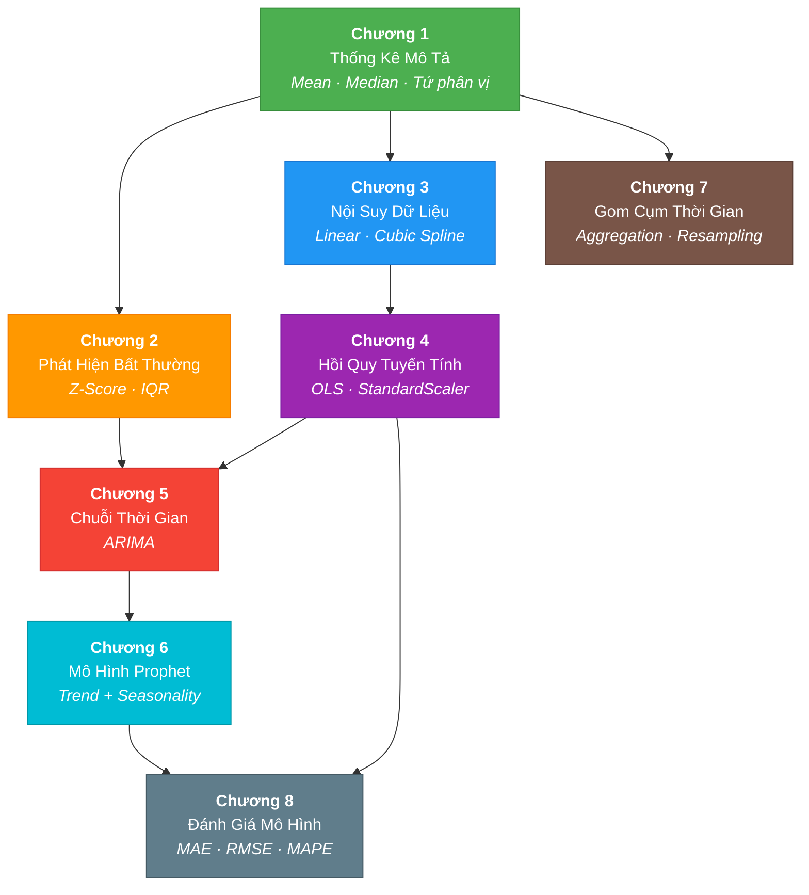

# Tài Liệu Tự Học: Lý Thuyết Toán Học Trong Dự Án Tốt Nghiệp

> **Dự án:** Phân tích Hiệu suất và Dự báo Sản lượng Hệ thống Điện Mặt Trời  
> **Nhóm:** The Outliers — Cao đẳng FPT Polytechnic (Chuyên ngành Xử lý Dữ liệu)  
> **Phiên bản:** v2.0 — Ngày biên soạn: 16/06/2026  

---

## Phần I. Cấu Trúc Tổng Quan (Course Concept Map)

Sơ đồ dưới đây mô tả mối quan hệ phụ thuộc giữa các chương kiến thức. Chương phía trên là nền tảng (prerequisite) cho các chương phía dưới.



---

## Phần II. Các Module Tự Học Chi Tiết

---

## Chương 1: Thống Kê Mô Tả (Descriptive Statistics)

### 1.1. Định Hướng Nhận Thức

**Mục tiêu đầu ra cụ thể:**

Sau khi hoàn thành chương này, sinh viên có thể:
- **Tính toán** được giá trị trung bình, trung vị, phương sai và độ lệch chuẩn của một tập dữ liệu sản lượng điện.
- **Phân biệt** được khi nào nên dùng Mean và khi nào nên dùng Median để đại diện cho một tập dữ liệu.
- **Giải thích** được ý nghĩa vật lý của tứ phân vị $Q_1$, $Q_2$, $Q_3$ trong ngữ cảnh phân tích sản lượng PV.

**Câu hỏi cốt lõi (Essential Questions):**
1. *"Tại sao giá trị trung bình (Mean) có thể gây hiểu lầm khi dữ liệu sản lượng chứa nhiều nhiễu cảm biến?"*
2. *"Phần trăm dữ liệu nào nằm giữa $Q_1$ và $Q_3$? Tại sao khoảng này có vai trò quan trọng trong phát hiện bất thường?"*

### 1.2. Tóm Tắt Lý Thuyết

#### Giải thích trực quan

Xét dữ liệu sản lượng điện (kWh) của một trạm PV trong 24 giờ. Khi sắp xếp các giá trị từ nhỏ đến lớn, **Trung vị (Median)** là điểm chia đôi dãy số, còn **Trung bình (Mean)** là trọng tâm. Chỉ cần một giá trị cực lớn (do nhiễu cảm biến) là trọng tâm bị kéo lệch, trong khi Median vẫn ổn định.

Bảng 1.1 minh họa hiệu ứng này:

| Tập dữ liệu | Giá trị (kWh) | Mean | Median | Nhận xét |
|:---|:---|:---:|:---:|:---|
| Dữ liệu bình thường | 0.0, 0.0, 0.5, 1.2, 2.8, 3.1, 3.5, 4.0 | 1.89 | 2.00 | Mean ≈ Median |
| Dữ liệu có outlier | 0.0, 0.0, 0.5, 1.2, 2.8, 3.1, 3.5, **99.0** | **13.76** | 2.00 | Mean bị kéo lệch nghiêm trọng |

#### Bảng đối chiếu thuật ngữ

| Ký hiệu | Tiếng Anh | Tiếng Việt | Định nghĩa |
|:---:|:---|:---|:---|
| $\bar{x}$ hoặc $\mu$ | Mean | Trung bình cộng | Tổng tất cả giá trị chia cho số quan sát |
| $\tilde{x}$ | Median | Trung vị | Giá trị tại vị trí chính giữa khi sắp xếp |
| $\sigma^2$ | Variance | Phương sai | Trung bình bình phương độ lệch so với Mean |
| $\sigma$ | Standard Deviation | Độ lệch chuẩn | Căn bậc hai của phương sai |
| $Q_1$ | First Quartile | Tứ phân vị thứ nhất | Giá trị tại phân vị 25% |
| $Q_3$ | Third Quartile | Tứ phân vị thứ ba | Giá trị tại phân vị 75% |
| IQR | Interquartile Range | Khoảng tứ phân vị | $Q_3 - Q_1$, chứa 50% dữ liệu trung tâm |
| $n$ | Sample Size | Kích thước mẫu | Tổng số quan sát |

#### Các công thức cốt lõi

**Trung bình cộng (Arithmetic Mean):**

$$\bar{x} = \frac{1}{n} \sum_{i=1}^{n} x_i = \frac{x_1 + x_2 + \cdots + x_n}{n}$$

**Phương sai mẫu (Sample Variance):**

$$s^2 = \frac{1}{n-1} \sum_{i=1}^{n} (x_i - \bar{x})^2$$

*Ghi chú:* Mẫu số là $(n-1)$ thay vì $n$ do hiệu chỉnh Bessel — khi ước lượng phương sai tổng thể từ mẫu, chia cho $(n-1)$ cho kết quả không thiên lệch (unbiased estimator).

**Độ lệch chuẩn (Standard Deviation):**

$$s = \sqrt{s^2} = \sqrt{\frac{1}{n-1} \sum_{i=1}^{n} (x_i - \bar{x})^2}$$

**Khoảng tứ phân vị (IQR):**

$$\text{IQR} = Q_3 - Q_1$$

IQR đại diện cho 50% dữ liệu trung tâm — chính là phần "hoạt động bình thường" của sản lượng điện. Mọi giá trị nằm ngoài biên IQR là ứng viên bất thường (outlier).

**Tài liệu tham khảo chuyên sâu:**
- Tukey, J. W. (1977). *Exploratory Data Analysis*. Addison-Wesley — Chương 2: Stems-and-Leaves, Box Plots.
- [NIST/SEMATECH e-Handbook of Statistical Methods — Measures of Location](https://www.itl.nist.gov/div898/handbook/eda/section3/eda351.htm)

### 1.3. Chiến Lược Giải Quyết Vấn Đề

#### Ví dụ mẫu có phân tích tư duy (Worked Example)

**Đề bài:** Cho dữ liệu sản lượng điện (kWh) của trạm SiteKey=1 trong 8 giờ liên tiếp: $[0.5,\; 1.2,\; 2.8,\; 3.1,\; 3.5,\; 4.0,\; 0.0,\; 0.0]$. Tính Mean, Median, Variance, IQR.

**Bước 1 — Sắp xếp tăng dần** *(Tại sao? Vì Median và Quartiles yêu cầu dữ liệu có thứ tự.)*

$$\text{Sorted} = [0.0, \; 0.0, \; 0.5, \; 1.2, \; 2.8, \; 3.1, \; 3.5, \; 4.0]$$

**Bước 2 — Tính Mean:**

$$\bar{x} = \frac{0.0 + 0.0 + 0.5 + 1.2 + 2.8 + 3.1 + 3.5 + 4.0}{8} = \frac{15.1}{8} = 1.8875$$

**Bước 3 — Tính Median** *(n = 8, chẵn → lấy trung bình 2 giá trị giữa: vị trí 4 và 5)*

$$\tilde{x} = \frac{x_4 + x_5}{2} = \frac{1.2 + 2.8}{2} = 2.0$$

**Bước 4 — Tính Quartiles:**

$$Q_1 = \frac{x_2 + x_3}{2} = \frac{0.0 + 0.5}{2} = 0.25 \qquad Q_3 = \frac{x_6 + x_7}{2} = \frac{3.1 + 3.5}{2} = 3.3$$

**Bước 5 — Tính IQR:**

$$\text{IQR} = Q_3 - Q_1 = 3.3 - 0.25 = 3.05$$

Bảng tổng hợp kết quả:

| Thống kê | Giá trị | Ý nghĩa trong ngữ cảnh |
|:---|:---:|:---|
| Mean ($\bar{x}$) | 1.8875 kWh | Bị kéo thấp bởi 2 giá trị 0.0 vào ban đêm |
| Median ($\tilde{x}$) | 2.0000 kWh | Phản ánh sản lượng "điển hình" chính xác hơn |
| IQR | 3.0500 kWh | Biên độ dao động bình thường của sản lượng |

#### Các Sai Lầm Thường Gặp (Common Misconceptions)

**Lỗi kinh điển 1:** Nhầm lẫn Mean và Median khi dữ liệu bị lệch (skewed). Trong dữ liệu điện mặt trời, chuỗi ban đêm toàn giá trị 0 khiến Mean bị kéo xuống thấp hơn so với Median (giá trị ban ngày). Nếu báo cáo dùng Mean thay Median → đánh giá sai hiệu suất trạm.

**Lỗi kinh điển 2:** Quên rằng `pandas .describe()` mặc định tính phương sai mẫu (chia $n-1$), không phải phương sai tổng thể (chia $n$). Khi so sánh với kết quả tính tay, cần thống nhất mẫu số.

### 1.4. Bộ Luyện Tập Phân Cấp

**Mức 1 — Trực diện (40%):**

1. Cho dữ liệu sản lượng $[1.5,\; 2.3,\; 0.0,\; 4.1,\; 3.7,\; 2.9]$. Tính $\bar{x}$, $\tilde{x}$, $s^2$.
2. Viết code Python dùng `numpy` để tính mean, median, std cho mảng trên.
3. Chứng minh rằng $Q_2 = \tilde{x}$ luôn đúng theo định nghĩa phân vị.

**Mức 2 — Kết nối (40%):**

4. Cho 2 trạm A và B có $\bar{x}_A = \bar{x}_B = 3.0$ kWh, nhưng $\sigma_A = 0.5$ và $\sigma_B = 2.5$. Trạm nào vận hành ổn định hơn? Giải thích mối quan hệ giữa $\sigma$ và tính ổn định.
5. Dùng `pandas` đọc DataFrame có cột `energy_generated_kwh`, tính IQR và vẽ Boxplot bằng `matplotlib`. So sánh Boxplot giữa 2 trạm bất kỳ.

**Mức 3 — Thử thách (20%):**

6. Trong pipeline thực tế ([solar_data_pipeline.py](file:///D:/Learning/FPT_polytechnic/Sem6/datn_outlier_hs_nlmt/notebooks/solar_data_pipeline.py), dòng 196), biểu thức `total_null/total_rows*100` được dùng để báo cáo phần trăm NULL. Hãy viết lại công thức này dưới dạng toán học chính quy, giải thích ý nghĩa thống kê, và phân tích điều kiện biên khi `total_rows = 0`.

---

## Chương 2: Phát Hiện Giá Trị Bất Thường (Outlier Detection)

### 2.1. Định Hướng Nhận Thức

**Mục tiêu đầu ra cụ thể:**

- **Tính toán** được Z-Score của một điểm dữ liệu và xác định nó có phải outlier không.
- **Áp dụng** phương pháp IQR để tìm biên trên/biên dưới và lọc bỏ các bất thường.
- **So sánh** ưu nhược điểm giữa Z-Score và IQR trong bối cảnh dữ liệu lệch phân phối.

**Câu hỏi cốt lõi:**
1. *"Tại sao dự án chọn phương pháp IQR thay vì Z-Score để phát hiện bất thường trong dữ liệu sản lượng điện?"*
2. *"Khi thay đổi hệ số nhân từ 1.5 thành 1.0 hoặc 3.0, biên phát hiện bất thường thay đổi như thế nào?"*

### 2.2. Tóm Tắt Lý Thuyết

#### Giải thích trực quan

Biểu đồ Hộp (Boxplot) là cách biểu diễn trực quan nhất cho phương pháp IQR. Cấu trúc logic của biểu đồ như sau:

```
  ──────────── Biểu đồ Hộp (Boxplot) ────────────

            Outlier                                Outlier
              ●                                      ●
              |                                      |
  ──────|─────┬═══════════════════┬──────|──────
              Q1       Q2(Median)       Q3
              ├─────── IQR ───────┤
        │                                      │
   Lower Bound                           Upper Bound
  (Q1 - 1.5·IQR)                      (Q3 + 1.5·IQR)
```

Mọi điểm nằm ngoài Lower Bound hoặc Upper Bound được phân loại là giá trị bất thường.

#### Bảng đối chiếu thuật ngữ

| Ký hiệu | Tiếng Anh | Tiếng Việt | Định nghĩa |
|:---:|:---|:---|:---|
| $Z$ | Z-Score | Điểm chuẩn hóa Z | Số lần $\sigma$ mà một giá trị cách xa $\mu$ |
| $\mu$ | Population Mean | Trung bình tổng thể | Giá trị kỳ vọng của toàn bộ quần thể |
| $\sigma$ | Population Std Dev | Độ lệch chuẩn tổng thể | Mức độ phân tán của quần thể |
| IQR | Interquartile Range | Khoảng tứ phân vị | $Q_3 - Q_1$ |
| $k$ | Multiplier | Hệ số nhân | 1.5 (outlier thông thường) hoặc 3.0 (extreme outlier) |
| $e_t$ | Residual | Phần dư | Chênh lệch $y_t - \hat{y}_t$ |

#### Các công thức cốt lõi

**Phương pháp 1 — Z-Score:**

$$Z = \frac{x - \mu}{\sigma}$$

Quy tắc: Một bản ghi bị gắn cờ bất thường nếu $|Z| > 3$ (tức giá trị cách xa trung bình hơn 3 lần độ lệch chuẩn).

*Hạn chế:* Z-Score giả định dữ liệu tuân theo phân phối chuẩn (Normal Distribution). Dữ liệu sản lượng điện mặt trời **không** tuân theo phân phối chuẩn — ban đêm luôn bằng 0, ban ngày biến thiên mạnh theo thời tiết.

**Phương pháp 2 — IQR (được sử dụng trong dự án):**

$$\text{IQR} = Q_3 - Q_1$$

$$\text{Lower Bound} = Q_1 - 1.5 \times \text{IQR}$$

$$\text{Upper Bound} = Q_3 + 1.5 \times \text{IQR}$$

Quy tắc: Mọi giá trị $x$ thỏa mãn $x < \text{Lower Bound}$ hoặc $x > \text{Upper Bound}$ bị phân loại là **bất thường** (outlier).

Bảng 2.1 so sánh hai phương pháp:

| Tiêu chí | Z-Score | IQR |
|:---|:---|:---|
| Giả định phân phối | Yêu cầu phân phối chuẩn | Không yêu cầu (non-parametric) |
| Độ nhạy với extreme values | Cao (Mean và $\sigma$ bị ảnh hưởng) | Thấp (chỉ dùng $Q_1$, $Q_3$) |
| Phù hợp với dữ liệu lệch | Kém | Tốt |
| Ngưỡng chuẩn | $\|Z\| > 3$ | $k = 1.5$ |
| Ứng dụng trong dự án | Không sử dụng | Sử dụng chính |

*Lý do dự án chọn IQR:* Dữ liệu sản lượng có phân phối lệch phải (right-skewed) với đuôi dài về phía giá trị cao. IQR không bị ảnh hưởng bởi các giá trị cực đoan, cho kết quả phát hiện bất thường đáng tin cậy hơn (Tukey, 1977).

**Phương pháp 3 — Phân tích phần dư (Residual Analysis):**

$$e_t = y_t - \hat{y}_t$$

Trong đó $y_t$ = giá trị thực tế tại thời điểm $t$, $\hat{y}_t$ = giá trị dự báo. Nếu $|e_t|$ vượt quá một ngưỡng cho trước, hệ thống phát tín hiệu cảnh báo bất thường.

**Tài liệu tham khảo chuyên sâu:**
- Chandola, V., Banerjee, A., & Kumar, V. (2009). *Anomaly Detection: A Survey*. ACM Computing Surveys, 41(3), Article 15.
- [Penn State STAT 200 — Identifying Outliers: IQR Method](https://online.stat.psu.edu/stat200/lesson/3/3.2)
- [NIST Engineering Statistics Handbook — Detection of Outliers](https://www.itl.nist.gov/div898/handbook/eda/section3/eda35h.htm)

### 2.3. Chiến Lược Giải Quyết Vấn Đề

#### Ví dụ mẫu — Áp dụng IQR

**Đề bài:** Dữ liệu sản lượng đã sắp xếp: $[0.0,\; 0.1,\; 0.5,\; 1.2,\; 2.8,\; 3.1,\; 3.5,\; 4.0,\; 15.0]$. Xác định bất thường bằng IQR.

| Bước | Phép tính | Kết quả |
|:---|:---|:---:|
| 1. Tính $Q_1$ (vị trí 25% của 9 giá trị) | $Q_1 \approx 0.3$ | 0.30 |
| 2. Tính $Q_3$ (vị trí 75% của 9 giá trị) | $Q_3 \approx 3.75$ | 3.75 |
| 3. Tính IQR | $3.75 - 0.30$ | 3.45 |
| 4. Tính Lower Bound | $0.30 - 1.5 \times 3.45$ | −4.875 |
| 5. Tính Upper Bound | $3.75 + 1.5 \times 3.45$ | 8.925 |
| 6. Kiểm tra giá trị 15.0 | $15.0 > 8.925$ | **Outlier** |

*Lưu ý:* Lower Bound = −4.875, nhưng sản lượng điện không thể âm. Trong thực tế, pipeline áp dụng `clip(lower=0)` ([solar_data_pipeline.py](file:///D:/Learning/FPT_polytechnic/Sem6/datn_outlier_hs_nlmt/notebooks/solar_data_pipeline.py), dòng 283) để ép biên dưới về 0.

#### Các Sai Lầm Thường Gặp

**Lỗi nghiêm trọng:** Áp dụng IQR trên **toàn bộ dữ liệu bao gồm cả ban đêm**. Dữ liệu ban đêm toàn giá trị 0 sẽ kéo $Q_1$ xuống 0 và thu hẹp IQR, khiến hầu hết giá trị ban ngày bình thường cũng bị gắn cờ bất thường. Giải pháp trong pipeline: Lọc nhiễu ban đêm trước (`rule_based_night_zero`), rồi mới áp dụng IQR trên dữ liệu ban ngày.

### 2.4. Bộ Luyện Tập Phân Cấp

**Mức 1 — Trực diện (40%):**

1. Tính Z-Score cho giá trị $x = 10.5$ với $\mu = 3.2$, $\sigma = 1.8$. Đây có phải outlier không theo quy tắc $|Z| > 3$?
2. Cho $Q_1 = 1.0$, $Q_3 = 5.0$. Tính IQR, Lower Bound, Upper Bound. Phân loại từng giá trị trong tập $\{-2.0,\; 0.5,\; 3.0,\; 7.0,\; 12.0\}$.

**Mức 2 — Kết nối (40%):**

3. Chứng minh rằng với dữ liệu phân phối chuẩn, hệ số $k = 1.5$ trong IQR tương ứng xấp xỉ $\pm 2.7\sigma$. (*Gợi ý:* Đối với phân phối chuẩn, $Q_1 \approx \mu - 0.675\sigma$ và $Q_3 \approx \mu + 0.675\sigma$.)
4. Phân tích tại sao pipeline phải lọc nhiễu ban đêm trước khi áp dụng IQR. Viết pseudo-code giải thích thứ tự xử lý.

**Mức 3 — Thử thách (20%):**

5. Đề xuất một biến thể IQR sử dụng **Rolling Window** (cửa sổ trượt 7 ngày) để phát hiện bất thường theo ngữ cảnh thời gian. Viết công thức, so sánh ưu nhược điểm so với IQR tĩnh, và thiết kế hàm Python minh họa.

---

## Chương 3: Nội Suy Dữ Liệu Khuyết Thiếu (Interpolation Methods)

### 3.1. Định Hướng Nhận Thức

**Mục tiêu đầu ra cụ thể:**

- **Tính toán** được giá trị nội suy tuyến tính giữa hai điểm dữ liệu bằng tay.
- **Phân biệt** khi nào dùng Nội suy Tuyến tính, Cubic Spline, và Hồi quy Đa biến.
- **Giải thích** được hệ thống phân loại khoảng trống (Gap Classification) trong pipeline dự án.

**Câu hỏi cốt lõi:**
1. *"Tại sao không dùng cùng một phương pháp nội suy cho mọi khoảng trống dữ liệu?"*
2. *"Nội suy có thể sinh ra giá trị âm cho sản lượng điện không? Pipeline xử lý vấn đề này như thế nào?"*

### 3.2. Tóm Tắt Lý Thuyết

#### Giải thích trực quan

Nội suy (Interpolation) là quá trình ước lượng giá trị chưa biết nằm **giữa** các điểm dữ liệu đã biết. Bảng 3.1 so sánh ba phương pháp:

| Đặc tính | Nội suy Tuyến tính | Cubic Spline | Hồi quy Đa biến |
|:---|:---|:---|:---|
| Dạng hàm | Đường thẳng | Đa thức bậc 3 từng đoạn | Mặt phẳng siêu chiều |
| Độ mượt | Liên tục nhưng có góc nhọn | Liên tục cả đạo hàm bậc 1 và 2 | Phụ thuộc mô hình |
| Yêu cầu dữ liệu | 2 điểm lân cận | Nhiều điểm lân cận | Biến ngoại sinh (thời tiết) |
| Rủi ro | Sai lệch lớn khi gap dài | Dao động ngoài kiểm soát (oscillation) | Cần đủ mẫu huấn luyện |
| Phù hợp cho gap | Ngắn (≤ 30 phút) | Vừa (≤ 2 giờ) | Dài (> 2 giờ) |

#### Bảng đối chiếu thuật ngữ

| Thuật ngữ | Tiếng Anh | Tiếng Việt | Định nghĩa |
|:---|:---|:---|:---|
| Interpolation | Interpolation | Nội suy | Ước lượng giá trị chưa biết giữa hai điểm đã biết |
| Linear | Linear Interpolation | Nội suy tuyến tính | Nối 2 điểm bằng đoạn thẳng |
| Cubic Spline | Cubic Spline Interpolation | Nội suy Spline bậc 3 | Nối bằng đa thức bậc 3, đảm bảo mượt mà |
| Gap Size | Gap Size | Kích thước khoảng trống | Số dòng dữ liệu liên tiếp bị NULL |
| `GAP_LINEAR_MAX` | — | — | Ngưỡng ≤ 2 dòng (≤ 30 phút) dùng Linear |
| `GAP_CUBIC_MAX` | — | — | Ngưỡng 3–8 dòng (≤ 2 giờ) dùng Cubic |

#### Các công thức cốt lõi

**Nội suy Tuyến tính (Linear Interpolation):**

Cho hai điểm đã biết $(x_0, y_0)$ và $(x_1, y_1)$, giá trị nội suy tại $x$ ($x_0 \le x \le x_1$):

$$y(x) = y_0 + \frac{(x - x_0)}{(x_1 - x_0)} \cdot (y_1 - y_0)$$

Trong pipeline, `pandas.interpolate(method="time")` sử dụng timestamp làm trục $x$:

$$y(t) = y(t_0) + \frac{(t - t_0)}{(t_1 - t_0)} \cdot \left[y(t_1) - y(t_0)\right]$$

**Nội suy Cubic Spline:**

Trên mỗi khoảng $[x_i, x_{i+1}]$, hàm nội suy có dạng đa thức bậc 3:

$$S_i(x) = a_i + b_i(x - x_i) + c_i(x - x_i)^2 + d_i(x - x_i)^3$$

Các hệ số $a_i, b_i, c_i, d_i$ được xác định từ hệ phương trình thỏa mãn ba điều kiện:

| Điều kiện | Ý nghĩa toán học | Ý nghĩa vật lý |
|:---|:---|:---|
| Liên tục tại mỗi mối nối | $S_i(x_{i+1}) = S_{i+1}(x_{i+1})$ | Không có bước nhảy tại điểm nối |
| Đạo hàm bậc 1 liên tục | $S_i'(x_{i+1}) = S_{i+1}'(x_{i+1})$ | Không có góc nhọn |
| Đạo hàm bậc 2 liên tục | $S_i''(x_{i+1}) = S_{i+1}''(x_{i+1})$ | Không có thay đổi độ cong đột ngột |

Cubic Spline tạo đường cong mượt hơn Linear, phù hợp với dữ liệu sản lượng vốn biến thiên liên tục theo chu kỳ bức xạ mặt trời.

#### Chiến lược phân loại khoảng trống trong pipeline

Pipeline sử dụng chiến lược **Hybrid Strict** — phân loại khoảng trống theo kích thước trước khi chọn phương pháp nội suy phù hợp:

| Kích thước Gap (dòng) | Thời gian tương đương | Phương pháp | Căn cứ lựa chọn |
|:---:|:---|:---|:---|
| ≤ 2 | ≤ 30 phút | Nội suy Tuyến tính | Khoảng ngắn, biến thiên nhỏ → đường thẳng đủ chính xác |
| 3 – 8 | 45 phút – 2 giờ | Cubic Spline | Cần đường cong mượt theo chu kỳ bức xạ |
| > 8 | > 2 giờ | Hồi quy Đa biến | Khoảng quá dài, cần thông tin thời tiết bổ sung |

Tham chiếu mã nguồn: Dòng 46–48 và 231–238 trong [solar_data_pipeline.py](file:///D:/Learning/FPT_polytechnic/Sem6/datn_outlier_hs_nlmt/notebooks/solar_data_pipeline.py).

**Tài liệu tham khảo chuyên sâu:**
- Chapra, S. C. & Canale, R. P. *Numerical Methods for Engineers*. McGraw-Hill — Chương 18: Splines and Piecewise Interpolation.
- [SciPy Documentation — scipy.interpolate.CubicSpline](https://docs.scipy.org/doc/scipy/reference/generated/scipy.interpolate.CubicSpline.html)
- [pandas Documentation — DataFrame.interpolate](https://pandas.pydata.org/docs/reference/api/pandas.DataFrame.interpolate.html)

### 3.3. Chiến Lược Giải Quyết Vấn Đề

#### Ví dụ mẫu

**Đề bài:** Chuỗi sản lượng theo giờ: $[2.0,\; \text{NULL},\; \text{NULL},\; 5.0]$ tại các thời điểm $t = 0, 1, 2, 3$ giờ. Tính giá trị nội suy tuyến tính tại $t = 1$ và $t = 2$.

*Phân tích:* Có 2 điểm đã biết: $(0, 2.0)$ và $(3, 5.0)$. Khoảng trống = 2 dòng → theo bảng phân loại, áp dụng Linear.

| Thời điểm $t$ | Công thức | Kết quả |
|:---:|:---|:---:|
| $t = 1$ | $y(1) = 2.0 + \frac{1-0}{3-0} \times (5.0 - 2.0)$ | **3.0** kWh |
| $t = 2$ | $y(2) = 2.0 + \frac{2-0}{3-0} \times (5.0 - 2.0)$ | **4.0** kWh |

#### Các Sai Lầm Thường Gặp

**Lỗi nghiêm trọng:** Dùng Cubic Spline khi có khoảng trống lớn liền kề nhau. Trong pipeline, dòng 257–258 ghi rõ: *"Điền tuyến tính tạm thời vào một bản sao ẩn để tránh hiện tượng sập nhiễu ma trận khi gặp mảng trống lớn lân cận."* Nếu không làm bước tiền xử lý này, Cubic Spline có thể dao động ngoài kiểm soát (Runge phenomenon) và tạo ra giá trị cực lớn hoặc cực âm.

**Lỗi phổ biến:** Nội suy tạo ra giá trị âm cho sản lượng điện. Giải pháp: Pipeline áp dụng `.clip(lower=0)` (dòng 283) để ép mọi giá trị âm về 0 — phản ánh ràng buộc vật lý rằng sản lượng phát điện không thể nhỏ hơn 0.

### 3.4. Bộ Luyện Tập Phân Cấp

**Mức 1 — Trực diện (40%):**

1. Cho $(x_0, y_0) = (2, 4.0)$ và $(x_1, y_1) = (5, 10.0)$. Tính $y(3)$ bằng nội suy tuyến tính.
2. Chuỗi $[1.0,\; \text{NULL},\; 3.0,\; \text{NULL},\; \text{NULL},\; 6.0]$. Điền bằng nội suy tuyến tính.

**Mức 2 — Kết nối (40%):**

3. Giải thích tại sao Cubic Spline cần điều kiện đạo hàm bậc 2 liên tục. Mô tả sự khác biệt trực quan giữa đường nội suy có và không có điều kiện này.
4. Với chuỗi có 10 giá trị NULL liên tiếp, pipeline sẽ chọn phương pháp nào? Tra bảng phân loại và giải thích lý do.

**Mức 3 — Thử thách (20%):**

5. Thiết kế hàm Python `smart_interpolate(series, gap_linear_max, gap_cubic_max)` tự động phân loại gap và áp dụng phương pháp phù hợp, bao gồm xử lý edge case giá trị âm.

---

## Chương 4: Hồi Quy Tuyến Tính Đa Biến (Multiple Linear Regression)

### 4.1. Định Hướng Nhận Thức

**Mục tiêu đầu ra cụ thể:**

- **Viết** được phương trình hồi quy tuyến tính đa biến với $p$ biến độc lập.
- **Giải thích** được ý nghĩa của hệ số hồi quy $\beta_j$ và lý do cần chuẩn hóa đặc trưng (StandardScaler).
- **Ứng dụng** hồi quy để dự đoán sản lượng điện từ các biến thời tiết.

**Câu hỏi cốt lõi:**
1. *"Tại sao dự án cần chuẩn hóa dữ liệu đầu vào trước khi huấn luyện mô hình hồi quy?"*
2. *"Mối quan hệ giữa bức xạ sóng ngắn và sản lượng điện có thực sự tuyến tính không?"*

### 4.2. Tóm Tắt Lý Thuyết

#### Bảng đối chiếu thuật ngữ

| Ký hiệu | Tiếng Anh | Tiếng Việt | Định nghĩa |
|:---:|:---|:---|:---|
| $\hat{y}$ | Predicted Value | Giá trị dự đoán | Đầu ra của mô hình |
| $\beta_0$ | Intercept | Hệ số chặn | Giá trị $\hat{y}$ khi tất cả $x_j = 0$ |
| $\beta_j$ | Coefficient | Hệ số hồi quy | Mức thay đổi $\hat{y}$ khi $x_j$ tăng 1 đơn vị (ceteris paribus) |
| OLS | Ordinary Least Squares | Bình phương Tối thiểu | Phương pháp ước lượng tham số |
| $R^2$ | Coefficient of Determination | Hệ số xác định | Phần trăm phương sai được giải thích bởi mô hình |
| StandardScaler | Z-score Normalization | Chuẩn hóa Z | Biến đổi dữ liệu về mean = 0, std = 1 |

#### Các công thức cốt lõi

**Phương trình Hồi Quy Đa Biến tổng quát:**

$$\hat{y} = \beta_0 + \beta_1 x_1 + \beta_2 x_2 + \cdots + \beta_p x_p$$

**Trong dự án**, 4 biến đầu vào được sử dụng để nội suy khoảng trống diện rộng:

$$\hat{y}_{\text{energy}} = \beta_0 + \beta_1 \cdot x_{\text{shortwave}} + \beta_2 \cdot x_{\text{DNI}} + \beta_3 \cdot x_{\text{diffuse}} + \beta_4 \cdot x_{\text{temp}}$$

Tham chiếu mã nguồn: Dòng 118, hàm [regression_imputation_large_gaps_strict](file:///D:/Learning/FPT_polytechnic/Sem6/datn_outlier_hs_nlmt/notebooks/solar_data_pipeline.py#L116-L164).

Bảng 4.1 mô tả vai trò và dấu kỳ vọng của từng biến:

| Biến độc lập ($x_j$) | Đơn vị | Dấu $\beta_j$ kỳ vọng | Căn cứ vật lý |
|:---|:---:|:---:|:---|
| `shortwave_radiation` | W/m² | Dương (+) | Bức xạ cao → sản lượng cao |
| `direct_normal_irradiance` | W/m² | Dương (+) | Bức xạ trực tiếp là nguồn năng lượng chính |
| `diffuse_solar_radiation` | W/m² | Dương (+) | Bức xạ tán xạ cũng đóng góp sản lượng |
| `temperature_c` | °C | Âm (−) | Hiệu ứng suy hao nhiệt (Thermal Degradation) |

**Mục tiêu OLS — Tối thiểu hóa tổng bình phương phần dư (RSS):**

$$\min_{\boldsymbol{\beta}} \sum_{i=1}^{n} \left(y_i - \hat{y}_i\right)^2 = \min_{\boldsymbol{\beta}} \sum_{i=1}^{n} \left(y_i - \mathbf{x}_i^T \boldsymbol{\beta}\right)^2$$

**Nghiệm dạng đóng (Normal Equation):**

$$\hat{\boldsymbol{\beta}} = (\mathbf{X}^T \mathbf{X})^{-1} \mathbf{X}^T \mathbf{y}$$

Trong đó: $\mathbf{X}$ = ma trận thiết kế $(n \times p)$, $\mathbf{y}$ = vector đầu ra $(n \times 1)$, $\hat{\boldsymbol{\beta}}$ = vector hệ số $(p \times 1)$.

**Chuẩn hóa Z-Score (StandardScaler):**

Trước khi huấn luyện, mỗi đặc trưng $x_j$ được chuẩn hóa:

$$z_j = \frac{x_j - \mu_j}{\sigma_j}$$

*Tại sao cần chuẩn hóa?* Các biến có đơn vị và thang đo khác nhau (bức xạ: 0–1200 W/m², nhiệt độ: 5–45°C). Nếu không chuẩn hóa, biến có giá trị lớn sẽ thống trị mô hình, khiến hệ số $\beta$ của các biến nhỏ bị đánh giá thấp. Sau chuẩn hóa, mỗi $\beta_j$ phản ánh mức thay đổi $\hat{y}$ khi $x_j$ tăng một độ lệch chuẩn — cho phép **so sánh tầm quan trọng tương đối** giữa các biến.

**Hệ số xác định ($R^2$):**

$$R^2 = 1 - \frac{\sum_{i=1}^{n}(y_i - \hat{y}_i)^2}{\sum_{i=1}^{n}(y_i - \bar{y})^2} = 1 - \frac{SS_{\text{res}}}{SS_{\text{tot}}}$$

Ý nghĩa: $R^2 = 0.85$ có nghĩa mô hình giải thích được 85% sự biến thiên trong dữ liệu sản lượng.

**Tài liệu tham khảo chuyên sâu:**
- James, G. et al. *An Introduction to Statistical Learning*. Springer — Chương 3: Linear Regression.
- [scikit-learn Documentation — LinearRegression](https://scikit-learn.org/stable/modules/generated/sklearn.linear_model.LinearRegression.html)
- [scikit-learn Documentation — StandardScaler](https://scikit-learn.org/stable/modules/generated/sklearn.preprocessing.StandardScaler.html)

### 4.3. Chiến Lược Giải Quyết Vấn Đề

#### Ví dụ mẫu

**Đề bài:** Mô hình đã huấn luyện cho ra: $\hat{y} = 0.02 + 0.005 \cdot x_{\text{radiation}} - 0.03 \cdot x_{\text{temp}}$. Dự đoán sản lượng khi bức xạ = 800 W/m² và nhiệt độ = 35°C.

**Phân tích:** Hệ số nhiệt độ âm ($-0.03$) phản ánh hiện tượng suy hao do nhiệt — nhiệt độ càng cao, sản lượng càng giảm. Đây là insight vật lý quan trọng.

| Thành phần | Giá trị | Đóng góp |
|:---|:---:|:---|
| Hệ số chặn $\beta_0$ | 0.02 | Giá trị nền |
| Bức xạ: $0.005 \times 800$ | +4.00 | Đóng góp chính |
| Nhiệt độ: $-0.03 \times 35$ | −1.05 | Suy hao nhiệt |
| **Tổng $\hat{y}$** | **2.97 kWh** | Giá trị dự đoán cuối cùng |

Pipeline còn áp dụng `max(0.0, y_pred)` (dòng 160) để đảm bảo kết quả không âm.

#### Các Sai Lầm Thường Gặp

**Lỗi phổ biến:** Quên chuẩn hóa dữ liệu dự đoán (`X_pred`) bằng **cùng scaler** đã fit trên dữ liệu huấn luyện. Trong pipeline, `scaler.transform(X_pred)` (dòng 150) sử dụng chính `scaler` đã `fit_transform(X_train)` (dòng 143). Nếu dùng scaler khác hoặc quên transform, kết quả dự đoán sẽ sai hoàn toàn.

### 4.4. Bộ Luyện Tập Phân Cấp

**Mức 1 — Trực diện (40%):**

1. Cho $\hat{y} = 1.5 + 0.8x_1 - 0.2x_2$. Tính $\hat{y}$ khi $x_1 = 3$, $x_2 = 5$.
2. Giải thích $\beta_1 = 0.8$ nghĩa gì trong ngữ cảnh: "Khi $x_1$ tăng 1 đơn vị (ceteris paribus) thì $\hat{y}$ thay đổi bao nhiêu?"

**Mức 2 — Kết nối (40%):**

3. Viết code Python dùng `sklearn.linear_model.LinearRegression` huấn luyện mô hình trên DataFrame có 4 cột feature và target `energy_generated_kwh`. Bao gồm bước `StandardScaler`.
4. Trong pipeline, tại sao lại yêu cầu `train_mask.sum() >= 10` (dòng 136) trước khi huấn luyện? Phân tích điều gì xảy ra khi chỉ có 3 mẫu huấn luyện với 4 biến.

**Mức 3 — Thử thách (20%):**

5. Thêm biến `cloud_cover` và `wind_speed` vào mô hình. Viết phương trình hồi quy 6 biến, dự đoán dấu của mỗi hệ số dựa trên căn cứ vật lý, và giải thích hiện tượng đa cộng tuyến (multicollinearity) có thể xảy ra giữa `shortwave_radiation` và `cloud_cover`.

---

## Chương 5: Mô Hình ARIMA — Dự Báo Chuỗi Thời Gian

### 5.1. Định Hướng Nhận Thức

**Mục tiêu đầu ra cụ thể:**

- **Giải thích** được ý nghĩa của 3 tham số $(p, d, q)$ trong ARIMA.
- **Nhận biết** chuỗi dừng (stationary) và **áp dụng** sai phân để đưa chuỗi về dạng dừng.
- **Viết** được phương trình ARIMA ở dạng toán tử lùi $B$.

**Câu hỏi cốt lõi:**
1. *"Tại sao chuỗi thời gian cần 'dừng' (stationary) trước khi áp dụng ARIMA?"*
2. *"Làm sao biết nên chọn $p = 2$ hay $p = 5$? Công cụ nào hỗ trợ việc lựa chọn?"*

### 5.2. Tóm Tắt Lý Thuyết

#### Giải thích trực quan

ARIMA = **A**uto**R**egressive + **I**ntegrated + **M**oving **A**verage. Bảng 5.1 phân tách ý nghĩa từng thành phần:

| Thành phần | Tham số | Ý tưởng cốt lõi | Phép tương tự |
|:---|:---:|:---|:---|
| **AR** (Tự hồi quy) | $p$ | Dự đoán hiện tại dựa vào $p$ giá trị quá khứ | "Nếu hôm qua sản lượng cao, hôm nay có khả năng cũng cao" |
| **I** (Tích hợp/Sai phân) | $d$ | Thay vì dự đoán giá trị tuyệt đối, dự đoán mức thay đổi | "Sản lượng tăng/giảm bao nhiêu so với hôm qua?" |
| **MA** (Trung bình trượt) | $q$ | Dự đoán dựa trên $q$ sai số dự báo trước đó | "Nếu dự đoán sai 0.5 kWh hôm qua, hiệu chỉnh hôm nay" |

#### Bảng đối chiếu thuật ngữ

| Ký hiệu | Tiếng Anh | Tiếng Việt | Định nghĩa |
|:---:|:---|:---|:---|
| $p$ | AR Order | Bậc tự hồi quy | Số bước lùi mà giá trị hiện tại phụ thuộc |
| $d$ | Differencing Order | Bậc sai phân | Số lần sai phân để chuỗi trở nên dừng |
| $q$ | MA Order | Bậc trung bình trượt | Số sai số quá khứ được sử dụng |
| $B$ | Backshift Operator | Toán tử lùi | $BX_t = X_{t-1}$ |
| $\phi_i$ | AR Coefficient | Hệ số tự hồi quy | Trọng số giá trị quá khứ thứ $i$ |
| $\theta_j$ | MA Coefficient | Hệ số trung bình trượt | Trọng số sai số quá khứ thứ $j$ |
| $\varepsilon_t$ | White Noise | Nhiễu trắng | Sai số ngẫu nhiên $\sim N(0, \sigma^2)$ |
| Stationary | Stationary Series | Chuỗi dừng | Chuỗi có mean và variance không đổi theo $t$ |

#### Các công thức cốt lõi

**Toán tử lùi (Backshift Operator):**

$$BX_t = X_{t-1}, \quad B^2 X_t = X_{t-2}, \quad B^k X_t = X_{t-k}$$

**Sai phân bậc $d$:**

$$(1 - B)X_t = X_t - X_{t-1} \qquad (1 - B)^2 X_t = X_t - 2X_{t-1} + X_{t-2}$$

**Đa thức AR (AutoRegressive Polynomial):**

$$\phi(B) = 1 - \phi_1 B - \phi_2 B^2 - \cdots - \phi_p B^p$$

**Đa thức MA (Moving Average Polynomial):**

$$\theta(B) = 1 + \theta_1 B + \theta_2 B^2 + \cdots + \theta_q B^q$$

**Phương trình ARIMA$(p, d, q)$ tổng quát:**

$$\boxed{\phi(B)(1 - B)^d X_t = \theta(B)\varepsilon_t}$$

Bảng 5.2 liệt kê các trường hợp đặc biệt:

| Mô hình | Ký hiệu ARIMA | Phương trình khai triển |
|:---|:---:|:---|
| Random Walk | ARIMA(0,1,0) | $X_t = X_{t-1} + \varepsilon_t$ |
| AR(1) | ARIMA(1,0,0) | $X_t = \phi_1 X_{t-1} + \varepsilon_t$ |
| MA(1) | ARIMA(0,0,1) | $X_t = \varepsilon_t + \theta_1 \varepsilon_{t-1}$ |
| ARIMA(1,1,1) | — | $X_t = (1 + \phi_1)X_{t-1} - \phi_1 X_{t-2} + \varepsilon_t + \theta_1 \varepsilon_{t-1}$ |

**Khai triển ARIMA(1,1,1):**

$$(1 - \phi_1 B)(1 - B)X_t = (1 + \theta_1 B)\varepsilon_t$$

$$X_t - X_{t-1} - \phi_1 X_{t-1} + \phi_1 X_{t-2} = \varepsilon_t + \theta_1 \varepsilon_{t-1}$$

$$X_t = (1 + \phi_1) X_{t-1} - \phi_1 X_{t-2} + \varepsilon_t + \theta_1 \varepsilon_{t-1}$$

**Tài liệu tham khảo chuyên sâu:**
- Box, G. E. P., Jenkins, G. M., Reinsel, G. C., & Ljung, G. M. (2015). *Time Series Analysis: Forecasting and Control*. 5th ed. Wiley.
- Hyndman, R. J. & Athanasopoulos, G. *Forecasting: Principles and Practice* — [Chương 9: ARIMA models](https://otexts.com/fpp3/arima.html)
- [UC Berkeley STAT 153 — ARIMA Lecture Notes](https://www.stat.berkeley.edu/~aditya/resources/LecNotes2.pdf)

### 5.3. Chiến Lược Giải Quyết Vấn Đề

#### Ví dụ mẫu — Sai phân bậc 1

**Đề bài:** Chuỗi sản lượng ngày: $X = [10, 12, 15, 14, 18]$. Tính chuỗi sai phân bậc 1.

*Phân tích:* Sai phân bậc 1 = chênh lệch giữa giá trị liền kề. Đây là cách loại bỏ xu hướng (trend) tuyến tính.

| $t$ | $X_t$ | $\Delta X_t = X_t - X_{t-1}$ | Nhận xét |
|:---:|:---:|:---:|:---|
| 0 | 10 | — | Không có giá trị trước |
| 1 | 12 | +2 | Tăng |
| 2 | 15 | +3 | Tăng |
| 3 | 14 | −1 | Giảm |
| 4 | 18 | +4 | Tăng mạnh |

Chuỗi gốc có xu hướng tăng ($10 \to 18$). Sau sai phân, chuỗi $[2, 3, -1, 4]$ dao động quanh giá trị trung bình → gần dừng hơn.

#### Các Sai Lầm Thường Gặp

**Lỗi phổ biến:** Sai phân quá nhiều lần ($d > 2$). Mỗi lần sai phân, chuỗi mất 1 điểm dữ liệu và gia tăng nhiễu. Thông thường $d = 0$ hoặc $d = 1$ là đủ. Nếu cần $d \geq 2$, cần kiểm tra liệu dữ liệu có cần biến đổi logarithm trước khi sai phân.

### 5.4. Bộ Luyện Tập Phân Cấp

**Mức 1 — Trực diện (40%):**

1. Khai triển ARIMA(2,0,0) — tức AR(2). Viết phương trình dạng $X_t = \ldots$
2. Cho $X_t = 0.6 X_{t-1} + \varepsilon_t$ với $X_{t-1} = 5.0$ và $\varepsilon_t = 0.3$. Tính $X_t$.

**Mức 2 — Kết nối (40%):**

3. Chuỗi $[100, 110, 121, 133, 146]$ không dừng. Tính sai phân bậc 1 và bậc 2. Phân tích chuỗi nào gần dừng hơn.
4. Giải thích tại sao ARIMA phù hợp làm Baseline dự báo sản lượng điện mặt trời. So sánh với phương pháp đơn giản hơn như trung bình trượt (Moving Average).

**Mức 3 — Thử thách (20%):**

5. Nghiên cứu Seasonal ARIMA — SARIMA$(p, d, q)(P, D, Q)_m$. Viết phương trình tổng quát và giải thích tham số $m$ (chu kỳ mùa vụ) trong ngữ cảnh dữ liệu sản lượng theo giờ ($m = 24$).

---

## Chương 6: Mô Hình Prophet — Dự Báo Theo Phân Rã Mùa Vụ

### 6.1. Định Hướng Nhận Thức

**Mục tiêu đầu ra cụ thể:**

- **Phân biệt** được 3 thành phần $g(t)$, $s(t)$, $h(t)$ của mô hình Prophet.
- **Giải thích** tại sao Prophet xử lý tốt dữ liệu có giá trị khuyết thiếu.
- **So sánh** ưu nhược điểm giữa Prophet và ARIMA trong bối cảnh dự án.

**Câu hỏi cốt lõi:**
1. *"Prophet có phải mô hình Machine Learning không? Nó thuộc lớp mô hình nào?"*
2. *"Tại sao Prophet hoạt động tốt hơn ARIMA khi dữ liệu có hiệu ứng ngày lễ?"*

### 6.2. Tóm Tắt Lý Thuyết

#### Bảng đối chiếu thuật ngữ

| Ký hiệu | Tiếng Anh | Tiếng Việt | Định nghĩa |
|:---:|:---|:---|:---|
| $g(t)$ | Trend / Growth | Xu hướng | Mô hình hóa xu hướng dài hạn (tuyến tính hoặc logistic) |
| $s(t)$ | Seasonality | Tính mùa vụ | Các mẫu lặp lại theo chu kỳ (ngày, tuần, năm) |
| $h(t)$ | Holiday Effects | Hiệu ứng ngày lễ | Tác động bất thường vào ngày lễ cụ thể |
| $\varepsilon_t$ | Error Term | Sai số | Phần nhiễu không giải thích được |
| Changepoint | Changepoint | Điểm đổi chiều | Thời điểm xu hướng thay đổi đột ngột |
| Fourier Series | Fourier Series | Chuỗi Fourier | Biểu diễn hàm tuần hoàn bằng tổ hợp sin/cos |

#### Các công thức cốt lõi

**Phương trình Prophet tổng quát (Generalized Additive Model):**

$$\boxed{y(t) = g(t) + s(t) + h(t) + \varepsilon_t}$$

**Thành phần Xu hướng — Tuyến tính từng phần (Piecewise Linear Trend):**

$$g(t) = \left(k + \sum_{j:\, s_j < t} \delta_j \right) t + \left(m + \sum_{j:\, s_j < t} \gamma_j \right)$$

| Ký hiệu | Ý nghĩa |
|:---:|:---|
| $k$ | Tốc độ tăng trưởng ban đầu (growth rate) |
| $\delta_j$ | Điều chỉnh tốc độ tại changepoint $s_j$ |
| $m$ | Offset ban đầu |
| $\gamma_j$ | Điều chỉnh offset tại changepoint $s_j$ để đảm bảo liên tục |

**Thành phần Mùa vụ — Chuỗi Fourier:**

$$s(t) = \sum_{n=1}^{N} \left[a_n \cos\!\left(\frac{2\pi n t}{P}\right) + b_n \sin\!\left(\frac{2\pi n t}{P}\right)\right]$$

| Tham số | Ý nghĩa | Giá trị thường dùng |
|:---:|:---|:---|
| $P$ | Chu kỳ | 365.25 (năm), 7 (tuần), 24 (ngày — nếu dữ liệu giờ) |
| $N$ | Bậc Fourier | 10 (năm), 3 (tuần) — càng cao càng linh hoạt, nhưng dễ overfitting |
| $a_n$, $b_n$ | Hệ số Fourier | Ước lượng từ dữ liệu |

*Cơ sở toán học:* Định lý Fourier khẳng định mọi hàm tuần hoàn có thể xấp xỉ bằng tổ hợp hữu hạn các hàm sin và cos. Đây là nền tảng toán học cho việc mô hình hóa tính mùa vụ.

**Thành phần Ngày lễ:**

$$h(t) = \sum_{i=1}^{L} \kappa_i \cdot \mathbf{1}(t \in D_i)$$

Trong đó $D_i$ là tập hợp ngày thuộc sự kiện lễ thứ $i$, $\kappa_i$ là mức tác động, $\mathbf{1}(\cdot)$ là hàm chỉ thị (indicator function).

#### So sánh ARIMA và Prophet

| Tiêu chí | ARIMA | Prophet |
|:---|:---|:---|
| Lớp mô hình | Box-Jenkins (thống kê truyền thống) | GAM (Generalized Additive Model) |
| Dữ liệu khuyết thiếu | Yêu cầu xử lý trước | Xử lý tự động |
| Tính mùa vụ | Cần mở rộng SARIMA | Fourier Series tích hợp sẵn |
| Điều chỉnh tham số | Thủ công qua ACF/PACF | Tự động hóa phần lớn |
| Hiệu ứng ngày lễ | Không hỗ trợ gốc | Hỗ trợ tích hợp |
| Tốc độ huấn luyện | Nhanh | Trung bình |
| Khả năng giải thích | Cao | Rất cao (phân rã trực quan) |

**Tài liệu tham khảo chuyên sâu:**
- Taylor, S. J. & Letham, B. (2018). Forecasting at Scale. *The American Statistician*, 72(1), 37–45. [DOI: 10.1080/00031305.2017.1380032](https://doi.org/10.1080/00031305.2017.1380032)
- [Prophet Official Documentation](https://facebook.github.io/prophet/docs/quick_start.html)
- [PeerJ Preprint — Forecasting at Scale (Full Paper PDF)](https://peerj.com/preprints/3190.pdf)

### 6.3. Chiến Lược Giải Quyết Vấn Đề

#### Ví dụ mẫu — Tính thành phần Fourier

**Đề bài:** Cho $s(t) = a_1 \cos\!\left(\frac{2\pi t}{24}\right) + b_1 \sin\!\left(\frac{2\pi t}{24}\right)$ với $a_1 = 2.0$, $b_1 = 1.5$. Tính $s(6)$ (tức lúc 6 giờ sáng).

$$s(6) = 2.0 \cos\!\left(\frac{2\pi \times 6}{24}\right) + 1.5 \sin\!\left(\frac{2\pi \times 6}{24}\right) = 2.0 \cos\!\left(\frac{\pi}{2}\right) + 1.5 \sin\!\left(\frac{\pi}{2}\right) = 2.0 \times 0 + 1.5 \times 1 = 1.5$$

*Nhận xét:* $s(6) > 0$ phản ánh sản lượng điện bắt đầu tăng vào 6 giờ sáng — phù hợp với chu kỳ bức xạ mặt trời.

### 6.4. Bộ Luyện Tập Phân Cấp

**Mức 1 — Trực diện (40%):**

1. Xác định $g(t)$, $s(t)$, $h(t)$ trong tình huống: "Sản lượng điện tăng 2% mỗi năm, có chu kỳ ngày (cao ban trưa, thấp sáng/chiều tối), và giảm mạnh vào ngày Giáng sinh."
2. Tính $s(12)$ với cùng tham số ở ví dụ mẫu. So sánh với $s(6)$ và giải thích.

**Mức 2 — Kết nối (40%):**

3. Phân tích tại sao tăng bậc Fourier $N$ từ 3 lên 20 có thể gây overfitting. Minh họa bằng mô tả trực quan.
4. Trong dự án, bảng `dim_date` có các cột `is_holiday`, `is_semester`, `is_exam`. Phân tích các cột này tương ứng với thành phần nào trong mô hình Prophet.

**Mức 3 — Thử thách (20%):**

5. Đề xuất cách tích hợp thêm **regressors** (biến ngoại sinh) vào mô hình Prophet, ví dụ: `shortwave_radiation` và `cloud_cover`. Viết pseudo-code và giải thích cách phương trình Prophet mở rộng thành $y(t) = g(t) + s(t) + h(t) + \beta_1 x_1(t) + \beta_2 x_2(t) + \varepsilon_t$.

---

## Chương 7: Gom Cụm và Chuyển Đổi Tần Suất Dữ Liệu (Aggregation & Resampling)

### 7.1. Định Hướng Nhận Thức

**Mục tiêu đầu ra cụ thể:**

- **Giải thích** được bài toán Granularity Mismatch (lệch pha tần suất dữ liệu).
- **Áp dụng** được công thức gom cụm phù hợp (SUM hoặc MEAN) tùy theo bản chất đại lượng.
- **Phân biệt** đại lượng tích lũy (additive) và đại lượng cường độ (intensive).

**Câu hỏi cốt lõi:**
1. *"Khi gom cụm sản lượng từ 15 phút lên 1 giờ, ta nên dùng SUM hay MEAN? Tại sao?"*
2. *"Tại sao dữ liệu thời tiết (chu kỳ 1 giờ) và sản lượng (chu kỳ 15 phút) không thể JOIN trực tiếp?"*

### 7.2. Tóm Tắt Lý Thuyết

#### Bài toán Granularity Mismatch

Dự án có hai nguồn dữ liệu với tần suất khác nhau:

| Nguồn dữ liệu | Tần suất ghi nhận | Số dòng / ngày / trạm |
|:---|:---:|:---:|
| Sản lượng điện (`fact_solar_energy_gen`) | 15 phút | 96 |
| Thời tiết (`fact_weather`) | 1 giờ | 24 |

Để phân tích tương quan và huấn luyện mô hình, hai nguồn phải được đưa về **cùng tần suất 1 giờ**.

#### Công thức gom cụm

Bảng 7.1 phân loại phương pháp gom cụm theo bản chất đại lượng:

| Đại lượng | Bản chất | Phép gom | Công thức | Ví dụ |
|:---|:---|:---:|:---|:---|
| Sản lượng (kWh) | Tích lũy (Additive) | SUM | $E_h = \sum_{k=1}^{4} E_{15\text{min},k}$ | 4 khoảng 15 phút cộng lại |
| Nhiệt độ (°C) | Cường độ (Intensive) | MEAN | $T_h = \frac{1}{4}\sum_{k=1}^{4} T_{15\text{min},k}$ | Trung bình 4 lần đo |
| Lượng mưa (mm) | Tích lũy | SUM | $P_h = \sum_{k=1}^{4} P_{15\text{min},k}$ | Tổng lượng mưa |
| Bức xạ (W/m²) | Cường độ | MEAN | $R_h = \frac{1}{4}\sum_{k=1}^{4} R_{15\text{min},k}$ | Trung bình cường độ |

**Tỷ lệ dữ liệu khuyết thiếu:**

$$\text{NULL\%} = \frac{N_{\text{null}}}{N_{\text{total}}} \times 100\%$$

Tham chiếu: [solar_data_pipeline.py](file:///D:/Learning/FPT_polytechnic/Sem6/datn_outlier_hs_nlmt/notebooks/solar_data_pipeline.py), dòng 196.

#### Các Sai Lầm Thường Gặp

**Lỗi kinh điển:** Dùng MEAN cho sản lượng điện khi gom cụm. Sản lượng là đại lượng tích lũy (kWh) — nếu dùng MEAN, sản lượng giờ sẽ bằng $\frac{1}{4}$ giá trị thực tế, dẫn đến sai lệch nghiêm trọng trong mọi phân tích và báo cáo xuôi dòng.

### 7.3. Bộ Luyện Tập Phân Cấp

**Mức 1 (40%):**

1. Cho 4 giá trị sản lượng 15 phút: $[0.5, 0.7, 0.8, 0.6]$ kWh. Tính sản lượng giờ bằng SUM và MEAN. Giá trị nào đúng?
2. Viết code `pandas` dùng `resample('1H').sum()` cho sản lượng và `resample('1H').mean()` cho nhiệt độ.

**Mức 2 (40%):**

3. Giải thích tại sao Galaxy Schema (Fact Constellation) giải quyết Granularity Mismatch tốt hơn Star Schema đơn.

**Mức 3 (20%):**

4. Thiết kế hàm gom cụm tổng quát nhận tham số `agg_method` theo cột, tự động phân loại SUM/MEAN dựa trên metadata.

---

## Chương 8: Đánh Giá Hiệu Năng Mô Hình (Model Evaluation Metrics)

### 8.1. Định Hướng Nhận Thức

**Mục tiêu đầu ra cụ thể:**

- **Tính toán** được MAE, RMSE, MAPE bằng tay cho một tập dữ liệu nhỏ.
- **So sánh** ưu nhược điểm giữa MAE, RMSE, MAPE và lựa chọn metric phù hợp.
- **Đánh giá** được mô hình dự báo Baseline (ARIMA/Prophet) dựa trên các metrics.

### 8.2. Tóm Tắt Lý Thuyết

#### Bảng đối chiếu thuật ngữ

| Ký hiệu | Tiếng Anh | Tiếng Việt | Đơn vị | Đặc tính |
|:---:|:---|:---|:---:|:---|
| MAE | Mean Absolute Error | Sai số Tuyệt đối TB | Cùng $y$ | Đối xử bình đẳng mọi sai số |
| MSE | Mean Squared Error | Sai số Bình phương TB | $(\text{đơn vị } y)^2$ | Phạt nặng sai số lớn |
| RMSE | Root Mean Squared Error | Căn Sai số Bình phương TB | Cùng $y$ | Phạt nặng sai số lớn, cùng đơn vị $y$ |
| MAPE | Mean Absolute Percentage Error | Sai số Phần trăm TB | % | Không phụ thuộc đơn vị |

#### Các công thức cốt lõi

**MAE:**

$$\text{MAE} = \frac{1}{n} \sum_{i=1}^{n} |y_i - \hat{y}_i|$$

**MSE:**

$$\text{MSE} = \frac{1}{n} \sum_{i=1}^{n} (y_i - \hat{y}_i)^2$$

**RMSE:**

$$\text{RMSE} = \sqrt{\text{MSE}} = \sqrt{\frac{1}{n} \sum_{i=1}^{n} (y_i - \hat{y}_i)^2}$$

**MAPE:**

$$\text{MAPE} = \frac{100\%}{n} \sum_{i=1}^{n} \left|\frac{y_i - \hat{y}_i}{y_i}\right|$$

*Lưu ý quan trọng:* MAPE không xác định khi $y_i = 0$ (chia cho 0). Trong dữ liệu điện mặt trời, ban đêm $y = 0$ khiến MAPE bị lỗi. Giải pháp: Chỉ tính MAPE cho dữ liệu ban ngày hoặc sử dụng sMAPE (Symmetric MAPE).

**Tài liệu tham khảo chuyên sâu:**
- Hyndman, R. J. & Koehler, A. B. (2006). Another look at measures of forecast accuracy. *International Journal of Forecasting*, 22(4), 679–688.
- [scikit-learn Documentation — Regression Metrics](https://scikit-learn.org/stable/modules/model_evaluation.html#regression-metrics)

### 8.3. Chiến Lược Giải Quyết Vấn Đề

#### Ví dụ mẫu

**Đề bài:** Cho 5 cặp (thực tế, dự đoán):

| $i$ | $y_i$ | $\hat{y}_i$ | $\|e_i\|$ | $e_i^2$ | $\|e_i / y_i\|$ |
|:---:|:---:|:---:|:---:|:---:|:---:|
| 1 | 3.0 | 2.8 | 0.2 | 0.04 | 0.0667 |
| 2 | 5.0 | 4.5 | 0.5 | 0.25 | 0.1000 |
| 3 | 2.0 | 2.3 | 0.3 | 0.09 | 0.1500 |
| 4 | 4.0 | 3.6 | 0.4 | 0.16 | 0.1000 |
| 5 | 1.0 | 1.5 | 0.5 | 0.25 | 0.5000 |
| **Tổng** | — | — | **1.9** | **0.79** | **0.9167** |

$$\text{MAE} = \frac{1.9}{5} = 0.380 \qquad \text{RMSE} = \sqrt{\frac{0.79}{5}} = \sqrt{0.158} \approx 0.397 \qquad \text{MAPE} = \frac{100\% \times 0.9167}{5} = 18.33\%$$

*Nhận xét:* Giá trị $y_5 = 1.0$ nhỏ nhưng sai 0.5 kWh, đóng góp tới 50% vào tổng MAPE. Điều này minh họa nhược điểm chính của MAPE đối với dữ liệu có giá trị gần 0.

#### Bảng so sánh lựa chọn metric

| Tình huống | Metric phù hợp | Lý do |
|:---|:---:|:---|
| Muốn metric dễ hiểu, cùng đơn vị với $y$ | MAE | Trực quan nhất |
| Cần phạt nặng các dự đoán sai xa | RMSE | Bình phương khuếch đại sai số lớn |
| Cần so sánh giữa các trạm có quy mô khác nhau | MAPE | Không phụ thuộc đơn vị |
| Dữ liệu có nhiều giá trị $y \approx 0$ | MAE hoặc sMAPE | MAPE bị lỗi chia 0 |

### 8.4. Bộ Luyện Tập Phân Cấp

**Mức 1 — Trực diện (40%):**

1. Cho `actual = [2.0, 4.0, 6.0]`, `predicted = [2.5, 3.5, 5.0]`. Tính MAE, RMSE.
2. Viết code Python sử dụng `sklearn.metrics` tính MAE, MSE, RMSE cho bộ dữ liệu trên.

**Mức 2 — Kết nối (40%):**

3. Chứng minh rằng $\text{RMSE} \geq \text{MAE}$ luôn đúng. (*Gợi ý:* Sử dụng bất đẳng thức giữa trung bình bình phương và trung bình cộng — QM ≥ AM.)
4. Mô hình A có MAE = 0.5, RMSE = 0.8. Mô hình B có MAE = 0.6, RMSE = 0.65. Phân tích mô hình nào nên chọn trong từng ngữ cảnh.

**Mức 3 — Thử thách (20%):**

5. Đề xuất Symmetric MAPE (sMAPE) thay thế MAPE:

$$\text{sMAPE} = \frac{100\%}{n} \sum_{i=1}^{n} \frac{|y_i - \hat{y}_i|}{(|y_i| + |\hat{y}_i|)/2}$$

Phân tích ưu nhược điểm so với MAPE và tính sMAPE cho bộ dữ liệu ở ví dụ mẫu.

---

## Phần III. Quy Trình Tự Học Hàng Tuần

Để sử dụng tài liệu này hiệu quả, sinh viên nên tuân thủ quy trình sau mỗi tuần:

| Bước | Hoạt động | Thời lượng | Phương pháp |
|:---:|:---|:---:|:---|
| 1 | **Kích hoạt tư duy (Pre-read)** | 15–20 phút | Đọc lướt Tiêu đề, Câu hỏi cốt lõi và Mục tiêu đầu ra. Xem sơ đồ và bảng thuật ngữ. |
| 2 | **Tương tác sâu (Active Reading)** | 45–60 phút | Đọc chi tiết lý thuyết. Áp dụng phương pháp Cornell: chia giấy 2 cột — trái ghi từ khóa, phải ghi tóm tắt bằng ngôn ngữ riêng. |
| 3 | **Luyện tập gợi nhớ (Retrieval Practice)** | 30–45 phút | Gấp tài liệu lại, tự giải Worked Examples. Sau đó làm Bài tập phân cấp từ Mức 1 → 3. |
| 4 | **Đánh giá lại nhận thức (Metacognitive Review)** | 15 phút | Sử dụng bộ Concept Check ở Phần IV. Đánh dấu phần chưa rõ để hỏi giảng viên hoặc thảo luận nhóm. |

---

## Phần IV. Bộ Công Cụ Tự Đánh Giá

### Concept Check Questions (Không yêu cầu tính toán)

1. IQR chỉ áp dụng được khi dữ liệu tuân theo phân phối chuẩn. **Đúng hay Sai?**
2. Nội suy Cubic Spline luôn chính xác hơn nội suy Tuyến tính. **Đúng hay Sai?**
3. Trong ARIMA(0, 1, 0), mô hình chỉ sử dụng thành phần nào duy nhất? **(AR / I / MA)**
4. Prophet xử lý giá trị khuyết thiếu bằng cách nào? **(a)** Xóa dòng, **(b)** Nội suy trước khi fit, **(c)** Bỏ qua tự động khi fit.
5. RMSE luôn lớn hơn hoặc bằng MAE. **Đúng hay Sai?**

<details>
<summary>Đáp án</summary>

1. **Sai.** IQR không cần giả định phân phối — đây chính là ưu điểm then chốt so với Z-Score. IQR chỉ dựa vào $Q_1$ và $Q_3$, là các thống kê thứ tự (order statistics), không phụ thuộc vào dạng phân phối.
2. **Sai.** Cubic Spline có thể dao động ngoài kiểm soát (Runge phenomenon) khi khoảng trống quá lớn hoặc dữ liệu không mượt. Ngoài ra, Cubic Spline nhạy cảm hơn với nhiễu cục bộ.
3. **I (Sai phân bậc 1 thuần túy)** — mô hình Random Walk: $X_t = X_{t-1} + \varepsilon_t$.
4. **(c)** — Prophet thiết kế theo mô hình GAM (Generalized Additive Model) nên tự động bỏ qua các giá trị thiếu khi ước lượng tham số.
5. **Đúng.** Theo bất đẳng thức QM ≥ AM (Quadratic Mean ≥ Arithmetic Mean), RMSE luôn ≥ MAE, và dấu bằng xảy ra khi mọi sai số bằng nhau.
</details>

### The Feynman Technique Prompt

> **Thử thách cuối cùng:** Hãy giải thích cho một người không có nền tảng toán học hiểu được:  
> *"Tại sao khi trời nóng quá, tấm pin mặt trời lại phát ra ít điện hơn, dù nắng rất nhiều?"*
>
> Nếu không thể giải thích một cách đơn giản, đó là dấu hiệu cho thấy khái niệm Thermal Degradation (Insight 1 của dự án) chưa được nắm vững.

---

## Tài Liệu Tham Khảo

| # | Tài liệu | Lĩnh vực |
|:---:|:---|:---|
| [1] | Tukey, J. W. (1977). *Exploratory Data Analysis*. Addison-Wesley. | Thống kê mô tả, IQR, Boxplot |
| [2] | Box, G. E. P. et al. (2015). *Time Series Analysis: Forecasting and Control*. 5th ed. Wiley. | ARIMA |
| [3] | Taylor, S. J. & Letham, B. (2018). Forecasting at Scale. *The American Statistician*, 72(1), 37–45. | Prophet |
| [4] | Chandola, V. et al. (2009). Anomaly Detection: A Survey. *ACM Computing Surveys*, 41(3), Article 15. | Phát hiện bất thường |
| [5] | Kimball, R. & Ross, M. (2013). *The Data Warehouse Toolkit*. 3rd ed. Wiley. | Galaxy Schema, DWH |
| [6] | James, G. et al. *An Introduction to Statistical Learning*. Springer. | Hồi quy, ML tổng quan |
| [7] | Chapra, S. C. & Canale, R. P. *Numerical Methods for Engineers*. McGraw-Hill. | Nội suy, Spline |
| [8] | Hyndman, R. J. & Athanasopoulos, G. *Forecasting: Principles and Practice*. [OTexts](https://otexts.com/fpp3/) | ARIMA, đánh giá mô hình |
| [9] | Hyndman, R. J. & Koehler, A. B. (2006). Another look at measures of forecast accuracy. *Int. J. Forecasting*, 22(4). | MAE, RMSE, MAPE |
| [10] | [NIST/SEMATECH e-Handbook of Statistical Methods](https://www.itl.nist.gov/div898/handbook/) | Thống kê tổng hợp |
| [11] | [scikit-learn Documentation](https://scikit-learn.org/stable/) | LinearRegression, StandardScaler, Metrics |
| [12] | [SciPy Documentation — scipy.interpolate](https://docs.scipy.org/doc/scipy/reference/interpolate.html) | Nội suy |
| [13] | [Prophet Official Documentation](https://facebook.github.io/prophet/) | Prophet API |
