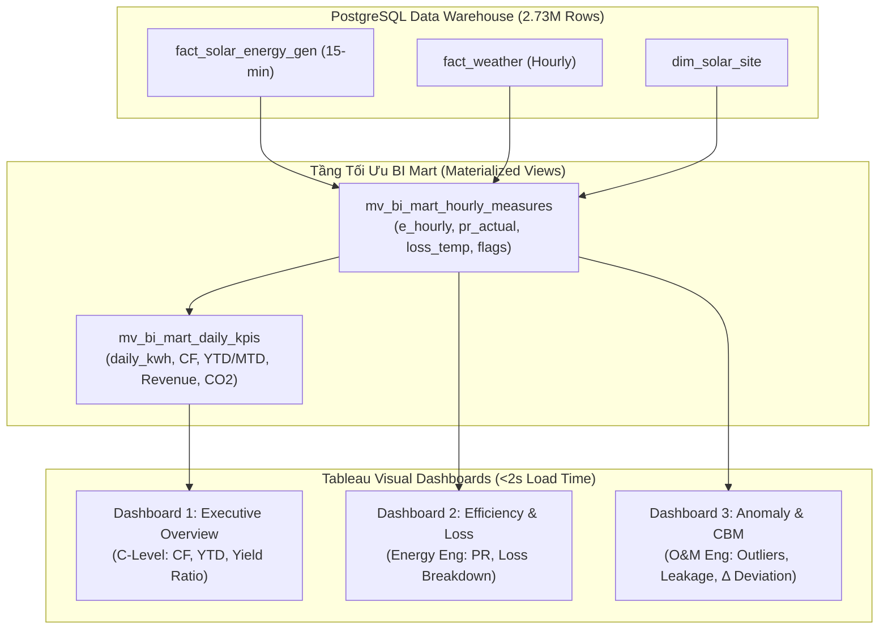
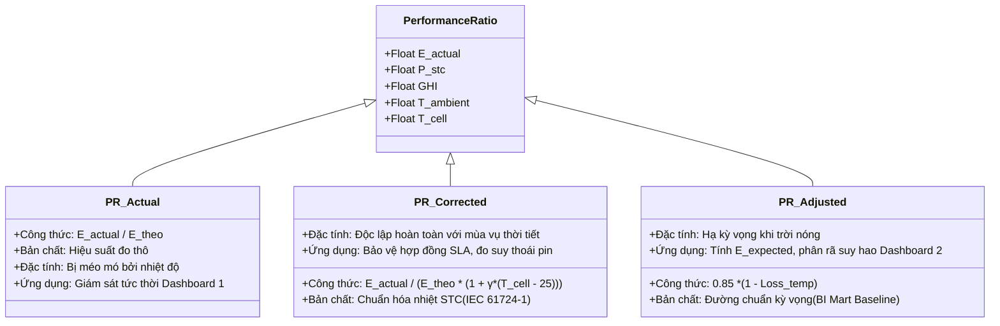
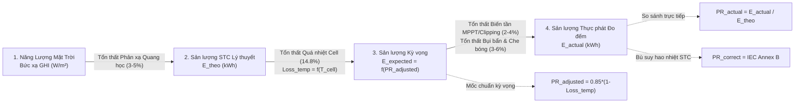
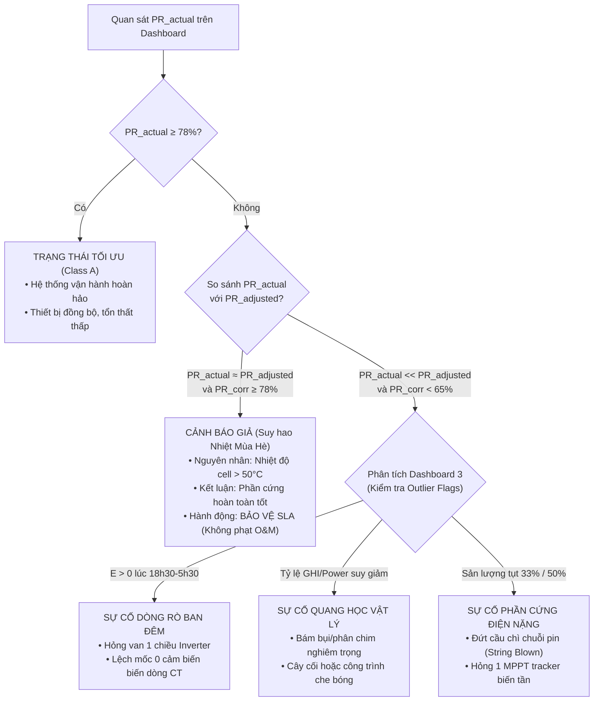

# HỆ THỐNG METRICS TẦNG BI MART VÀ CẨM NANG CHUYÊN SÂU PERFORMANCE RATIO (PR)
> **Dự án:** Hệ thống Phân tích Dữ liệu, Phát hiện Dị thường Vận hành và Dự báo Sản lượng 42 Trạm Điện Mặt Trời (The Outliers)  
> **Tài liệu tham chiếu:** Tiêu chuẩn Quốc tế IEC 61724-1:2021, NREL Performance Metric Framework, Báo cáo Đồ án [`DATN_REPORT_FINAL_02.tex`](file:///D:/Learning/FPT_polytechnic/Sem6/datn_outlier_hs_nlmt/reports/DATN_REPORT_FINAL_02.tex)  
> **Đối tượng sử dụng:** Ban Giám Đốc (C-Level), Kỹ sư Năng lượng, Kỹ sư Vận hành & Bảo trì (O&M), Data Analyst bảo vệ đồ án tốt nghiệp.

---

## MỤC LỤC TỔNG QUAN

1. [TỔNG QUAN HỆ THỐNG METRICS TẦNG BI (BUSINESS INTELLIGENCE)](#1-tổng-quan-hệ-thống-metrics-tầng-bi-business-intelligence)
   - [1.1. Nhóm Chỉ số Vận hành & Sản lượng (Dashboard 1: Executive Overview)](#11-nhóm-chỉ-số-vận-hành--sản-lượng-dashboard-1-executive-overview)
   - [1.2. Nhóm Chỉ số Hiệu suất & Phân rã Tổn thất (Dashboard 2: Operational Efficiency & Loss)](#12-nhóm-chỉ-số-hiệu-suất--phân-rã-tổn-thất-dashboard-2-operational-efficiency--loss)
   - [1.3. Nhóm Chỉ số Giám sát Dị thường & Cảnh báo O&M (Dashboard 3: Anomaly Detection)](#13-nhóm-chỉ-số-giám-sát-dị-thường--cảnh-báo-om-dashboard-3-anomaly-detection)
   - [1.4. Nhóm Chỉ số Kinh tế Tài chính & Giảm phát thải Môi trường (Financial & ESG)](#14-nhóm-chỉ-số-kinh-tế-tài-chính--giảm-phát-thải-môi-trường-financial--esg)
   - [1.5. Bảng Ánh xạ Calculated Fields trên Tableau Desktop](#15-bảng-ánh-xạ-calculated-fields-trên-tableau-desktop)
2. [BẢN CHẤT CỦA PERFORMANCE RATIO (PR)](#2-bản-chất-của-performance-ratio-pr)
   - [2.1. PR là gì và vì sao bắt buộc phải có PR?](#21-pr-là-gì-và-vì-sao-bắt-buộc-phải-có-pr)
   - [2.2. Thang Phân hạng Hiệu năng Vận hành theo Chuẩn IEC 61724-1](#22-thang-phân-hạng-hiệu-năng-vận-hành-theo-chuẩn-iec-61724-1)
   - [2.3. Quy tắc Lọc Bức xạ Sáng sớm/Chiều muộn ($GHI \ge 100\,\text{W/m}^2$)](#23-quy-tắc-lọc-bức-xạ-sáng-sớmchiều-muộn-ghi-ge-100textwm2)
3. [PHÂN BIỆT CHI TIẾT: PR ACTUAL, PR ADJUST VÀ PR CORRECT](#3-phân-biệt-chi-tiết-pr-actual-pr-adjust-và-pr-correct)
   - [3.1. $PR_{\text{actual}}$ (Nominal / Actual Performance Ratio)](#31-practual-nominal--actual-performance-ratio)
   - [3.2. $PR_{\text{correct}}$ (Temperature-Corrected PR — Chuẩn IEC 61724-1 Phụ lục B)](#32-prcorrect-temperature-corrected-pr--chuẩn-iec-61724-1-phụ-lục-b)
   - [3.3. $PR_{\text{adjusted}}$ (Expected / Benchmark PR tại Tầng BI Mart)](#33-pradjusted-expected--benchmark-pr-tại-tầng-bi-mart)
   - [3.4. Chuyên khảo: Vì sao $PR_{\text{adjusted}}$ dùng con số $0{,}85$ mà không tính từ $PR_{\text{actual}}$?](#34-chuyên-khảo-vì-sao-pradjusted-dùng-con-số-085-mà-không-tính-từ-practual)
     - [3.4.1. Bản chất vật lý của con số $0{,}85$ (Hệ số thiết kế danh định STC)](#341-bản-chất-vật-lý-của-con-số-085-hệ-số-thiết-kế-danh-định-stc)
     - [3.4.2. Vai trò "Thước đo kỳ vọng độc lập" (Expected Benchmark Ground Truth)](#342-vai-trò-thước-đo-kỳ-vọng-độc-lập-expected-benchmark-ground-truth)
     - [3.4.3. Nguy cơ lỗi vòng lặp (Circular Logic) và Ô nhiễm đường cơ sở](#343-nguy-cơ-lỗi-vòng-lặp-circular-logic-và-ô-nhiễm-đường-cơ-sở)
     - [3.4.4. Phân tích toán học: Chiều Nhân giảm (Hạ chuẩn kỳ vọng) vs Chiều Chia bù (Chuẩn hóa về STC)](#344-phân-tích-toán-học-chiều-nhân-giảm-hạ-chuẩn-kỳ-vọng-vs-chiều-chia-bù-chuẩn-hóa-về-stc)
     - [3.4.5. Đề xuất cải tiến kiến trúc: Động hóa $PR_{\text{design}}(site)$ theo Catalog tấm pin](#345-đề-xuất-cải-tiến-kiến-trúc-động-hóa-prdesignsite-theo-catalog-tấm-pin)
   - [3.5. Bảng So sánh Đối chiếu 3 Biến thể PR](#35-bảng-so-sánh-đối-chiếu-3-biến-thể-pr)
4. [MỐI TƯƠNG QUAN BIỆN CHỨNG & MA TRẬN CHẨN ĐOÁN VẬN HÀNH](#4-mối-tương-quan-biện-chứng--ma-trận-chẩn-đoán-vận-hành)
   - [4.1. Sơ đồ Luồng Biến đổi Năng lượng & Điểm Đo lường PR](#41-sơ-đồ-luồng-biến-đổi-năng-lượng--điểm-đo-lường-pr)
   - [4.2. Biến động Định lượng theo Mùa vụ & Nhiệt độ Vận hành](#42-biến-động-định-lượng-theo-mùa-vụ--nhiệt-độ-vận-hành)
   - [4.3. Ma trận Cây Quyết định Chẩn đoán Sự cố O&M & Bảo vệ SLA](#43-ma-trận-cây-quyết-định-chẩn-đoán-sự-cố-om--bảo-vệ-sla)
   - [4.4. Tương quan Thống kê Thực nghiệm trong Dữ liệu EDA](#44-tương-quan-thống-kê-thực-nghiệm-trong-dữ-liệu-eda)

---

# 1. TỔNG QUAN HỆ THỐNG METRICS TẦNG BI (BUSINESS INTELLIGENCE)

Hệ thống trực quan hóa Tableau kết nối trực tiếp với tầng **BI Data Mart** thông qua 2 Materialized Views lõi:
- `bi_mart.mv_bi_mart_hourly_measures`: Dữ liệu đo lường cấp giờ phục vụ phân rã suy hao và phát hiện ngoại lai.
- `bi_mart.mv_bi_mart_daily_kpis`: Dữ liệu tổng hợp cấp ngày phục vụ báo cáo quản trị cấp cao.



---

### 1.1. Nhóm Chỉ số Vận hành & Sản lượng (Dashboard 1: Executive Overview)

| Tên Chỉ số (Metric) | Ký hiệu | Đơn vị | Công thức Toán học | Mục đích & Ý nghĩa Kỹ thuật |
| :--- | :---: | :---: | :--- | :--- |
| **Sản lượng Thực phát** | $E_{\text{actual}}$ | $\text{kWh}$ | $E_{\text{hourly}} = \sum_{t=1}^{4} E_{\text{15min}, t}$ | Tổng điện năng xoay chiều (AC) đo đếm thực tế phát ra tại Inverter/Smart Meter. |
| **Sản lượng Lũy kế** | $E_{\text{cum}}$ | $\text{MWh / GWh}$ | $\sum E_{\text{actual}}$ theo WTD, MTD, YTD | Theo dõi tiến độ hoàn thành chỉ tiêu năng lượng qua các mốc thời gian. |
| **Hệ số Công suất** | $\text{CF}$ | $\%$ | $\text{CF} = \frac{\sum E_{\text{actual}}}{P_{\text{stc}} \times 24\,\text{h} \times N_{\text{days}}} \times 100\%$ | Đo lường hiệu suất sử dụng vốn đầu tư so với kịch bản chạy tối đa $100\%$ công suất $24/24\text{h}$ ($\text{CF}$ chuẩn đạt $15\% - 22\%$). |
| **Năng suất Riêng (Final Yield)** | $Y_f$ | $\text{kWh/kWp/ngày}$ | $Y_f = \frac{E_{\text{actual}}}{P_{\text{stc}}}$ | Chuẩn hóa sản lượng trên mỗi $kWp$ lắp đặt để so sánh công bằng giữa trạm nhỏ ($10\,\text{kWp}$) và trạm lớn ($500\,\text{kWp}$). |
| **Năng suất Tham chiếu** | $Y_r$ | $\text{PSH / giờ}$ | $Y_r = \frac{\sum GHI \cdot \Delta t}{1000\,\text{W/m}^2}$ | Số giờ nắng đỉnh quy đổi lý thuyết (*Peak Sun Hours*). |
| **Sản lượng STC Lý thuyết** | $E_{\text{theo}}$ | $\text{kWh}$ | $E_{\text{theo}} = P_{\text{stc}} \times \left(\frac{GHI}{1000}\right) \times \Delta t$ | Sản lượng kỳ vọng ở điều kiện phòng thí nghiệm ($1000\,\text{W/m}^2, 25^\circ\text{C}$). |
| **Sản lượng trên mỗi Tấm Pin** | $E_{\text{panel}}$ | $\text{kWh/panel}$ | $E_{\text{panel}} = \frac{E_{\text{actual}}}{\text{Number\_of\_panels}}$ | Đánh giá độ đồng đều và phát hiện cụm pin suy giảm chất lượng. |

---

### 1.2. Nhóm Chỉ số Hiệu suất & Phân rã Tổn thất (Dashboard 2: Operational Efficiency & Loss)

| Tên Chỉ số (Metric) | Ký hiệu | Đơn vị | Công thức Toán học | Mục đích & Ý nghĩa Kỹ thuật |
| :--- | :---: | :---: | :--- | :--- |
| **Hệ số Hiệu suất Thực tế** | $PR_{\text{actual}}$ | $\%$ | $PR_{\text{actual}} = \frac{E_{\text{actual}}}{E_{\text{theo}}} \times 100\% = \frac{Y_f}{Y_r} \times 100\%$ | Đo lường hiệu suất tức thời thô của hệ thống trong điều kiện thực địa. |
| **Nhiệt độ Tế bào Pin** | $T_{\text{cell}}$ | $^\circ\text{C}$ | $T_{\text{cell}} = T_{\text{ambient}} + \left(\frac{\text{NOCT} - 20}{800}\right) \times GHI$ | Nhiệt độ thực tế bề mặt silicon (nóng hơn nhiệt độ không khí $20 - 30^\circ\text{C}$ lúc giữa trưa). |
| **Tỷ lệ Tổn thất Nhiệt** | $Loss_{\text{temp}}$ | $\%$ | $Loss_{\text{temp}} = 0{,}0038 \times \max(0, T_{\text{cell}} - 25^\circ\text{C})$ | Tỷ lệ công suất bị suy hao tự nhiên do quá nhiệt dải vùng cấm bán dẫn. |
| **PR Hiệu chỉnh Kỳ vọng** | $PR_{\text{adjusted}}$ | $\%$ | $PR_{\text{adjusted}} = 0{,}85 \times (1 - Loss_{\text{temp}})$ | Hiệu suất kỳ vọng đã tính trừ suy hao nhiệt tại tầng BI Mart làm đường Baseline tham chiếu. |
| **PR Chuẩn hóa Nhiệt độ (IEC)** | $PR_{\text{corr}}$ | $\%$ | $PR_{\text{corr}} = \frac{E_{\text{actual}}}{E_{\text{theo}} \cdot [1 + \gamma \cdot (T_{\text{cell}} - 25^\circ\text{C})]} \times 100\%$ | Loại bỏ biến động thời tiết nóng/lạnh, phản ánh chính xác độ bền vật lý của thiết bị. |
| **Sản lượng Kỳ vọng Thực tế** | $E_{\text{expected}}$ | $\text{kWh}$ | $E_{\text{expected}} = P_{\text{stc}} \times \left(\frac{GHI}{1000}\right) \times PR_{\text{adjusted}}$ | Sản lượng chuẩn kỳ vọng phát ra trong điều kiện thời tiết tại khung giờ đó. |
| **Tổn thất Nhiệt lượng** | $E_{\text{loss, temp}}$ | $\text{kWh}$ | $E_{\text{loss, temp}} = E_{\text{theo}} \times Loss_{\text{temp}}$ | Lượng điện năng bị mất đi do hiệu ứng nhiệt (chiếm $\approx 14{,}8\%$ toàn trạm). |
| **Tổn thất Xén Biến tần** | $E_{\text{loss, clip}}$ | $\text{kWh}$ | $\max\Big(0, (P_{\text{dc\_in}} \cdot \eta_{\text{inv}} - P_{\text{ac\_max}}) \times \Delta t\Big)$ | Suy hao khi công suất DC vượt ngưỡng công suất định mức AC của Inverter. |
| **Tỷ lệ Đáp ứng Mục tiêu** | $\text{Yield Ratio}$ | $\%$ | $\text{Yield Ratio} = \frac{\sum E_{\text{actual}}}{\sum E_{\text{expected}}} \times 100\%$ | Đo lường mức độ hoàn thành chỉ tiêu kỹ thuật thực tế so với kỳ vọng mô hình. |

---

### 1.3. Nhóm Chỉ số Giám sát Dị thường & Cảnh báo O&M (Dashboard 3: Anomaly Detection)

| Tên Chỉ số (Metric) | Ký hiệu | Đơn vị | Công thức Toán học | Mục đích & Ý nghĩa Kỹ thuật |
| :--- | :---: | :---: | :--- | :--- |
| **Tỷ lệ Dị thường Vận hành** | $\text{Outlier Rate}$ | $\%$ | $\frac{\text{Số bản ghi gắn cờ GMM-IF}}{\text{Tổng số bản ghi trong kỳ}} \times 100\%$ | Đánh giá độ ổn định và tỷ lệ thời gian hệ thống vận hành bất thường. |
| **Tổng Giờ Bất thường** | $\text{Outlier Hours}$ | $\text{giờ (h)}$ | $\sum \text{Outlier Flags} \times \Delta t$ | Tổng thời gian trạm phát sinh lỗi cần kỹ sư can thiệp bảo trì. |
| **Tăng trưởng Giờ Lỗi MoM** | $\text{Outlier MoM}$ | $\%$ | $\frac{\text{Outlier Hours}_{\text{tháng này}} - \text{Outlier Hours}_{\text{tháng trước}}}{\text{Outlier Hours}_{\text{tháng trước}}} \times 100\%$ | Cảnh báo sớm xu hướng hỏng hóc gia tăng của thiết bị theo tháng. |
| **Độ lệch Cơ sở Dự báo** | $\Delta_{\text{baseline}}$ | $\text{kWh}$ | $\Delta_{\text{baseline}} = E_{\text{actual}} - E_{\text{forecast\_baseline}}$ | Phát hiện trượt hiệu năng khi $\Delta < -3\sigma$ (kích hoạt cảnh báo đỏ). |
| **Tỷ lệ Bức xạ - Công suất** | $\text{Ratio}_{G \to P}$ | $\text{kWh}/(\text{W/m}^2)$ | $\text{Ratio}_{G \to P} = \frac{E_{\text{actual}}}{GHI}$ | Nhận diện hiện tượng bám bụi nặng (Soiling) hoặc bóng che cục bộ (Shading). |
| **Dòng Rò Ban Đêm** | $E_{\text{night\_leak}}$ | $\text{kWh}$ | $E_{\text{actual}} > 0$ trong khung giờ $18:30 - 05:30$ | Bằng chứng phát hiện rò rỉ dòng ngược hoặc cảm biến CT bị lệch mốc 0. |

---

### 1.4. Nhóm Chỉ số Kinh tế Tài chính & Giảm phát thải Môi trường (Financial & ESG)

| Tên Chỉ số (Metric) | Ký hiệu | Đơn vị | Công thức Toán học | Ý nghĩa Thực tế Dự án UNISOLAR |
| :--- | :---: | :---: | :--- | :--- |
| **Doanh thu Phát điện Tiết kiệm** | $\text{Revenue}$ | $\text{AUD}$ | $E_{\text{actual}} \times \text{FiT}$ *(với $\text{FiT} \approx 0{,}16\,\text{AUD/kWh}$)* | Tiết kiệm hơn **$11{,}2\text{ triệu AUD}$** chi phí mua điện lưới cho ĐH La Trobe. |
| **Chi phí Tổn thất Kém Hiệu quả** | $\text{Lost Revenue}$ | $\text{AUD}$ | $(E_{\text{expected}} - E_{\text{actual}}) \times \text{FiT}$ | Lượng tiền bị thất thoát do trạm bám bụi hoặc hỏng hóc chưa sửa chữa. |
| **Khối lượng Giảm phát thải $\text{CO}_2$** | $\text{CO}_{2\text{ avoided}}$ | $\text{Tấn CO}_2$ | $\frac{E_{\text{actual}} \times 0{,}82\,\text{kg CO}_2\text{-e/kWh}}{1000}$ | Cắt giảm lũy kế **$61.485\text{ tấn CO}_2$** (chuẩn NGA Factors bang Victoria, Úc). |
| **Cây xanh Tương đương** | $\text{Trees}$ | Cây | $\frac{\text{CO}_{2\text{ avoided (kg)}}}{21{,}77\,\text{kg/cây/năm}}$ | Tương đương trồng mới hơn **$2{,}8\text{ triệu}$** cây xanh trưởng thành hấp thụ carbon. |

---

### 1.5. Bảng Ánh xạ Calculated Fields trên Tableau Desktop

```sql
-- Cú pháp trường tính toán thực tế trong Tableau Desktop (.twb / DAX / SQL):
-- 1. [PR Actual %]
SUM([Energy Generated Kwh]) / SUM([Theoretical Energy Kwh]) * 100

-- 2. [Specific Yield kWh/kWp]
SUM([Energy Generated Kwh]) / ATTR([Capacity Kw])

-- 3. [Capacity Factor %]
SUM([Energy Generated Kwh]) / (ATTR([Capacity Kw]) * 24 * COUNTD([Date])) * 100

-- 4. [Theoretical Energy Kwh]
(ATTR([Capacity Kw]) * [Ghi] / 1000.0) * 0.25

-- 5. [Thermal Loss Kwh]
SUM([Theoretical Energy Kwh]) * 0.0038 * MAX(0, AVG([Temperature 2m]) + (AVG([Ghi]) * 0.03) - 25)

-- 6. [Inverter Clipping Loss Kwh]
SUM(IF [Gmm If Outlier Reason] = 'PHYSICAL_LOW_ENERGY_STRONG_SUN' 
    THEN [Theoretical Energy Kwh] - [Energy Generated Kwh] ELSE 0 END)

-- 7. [Outlier Rate %]
COUNTD(IF [Gmm If Outlier Flag] = TRUE THEN [Gen Id] END) / COUNTD([Gen Id]) * 100

-- 8. [Lost Revenue AUD]
SUM([Theoretical Energy Kwh] - [Energy Generated Kwh]) * 0.16

-- 9. [CO2 Avoided Tonnes]
SUM([Energy Generated Kwh]) * 0.82 / 1000.0
```

---

# 2. BẢN CHẤT CỦA PERFORMANCE RATIO (PR)

### 2.1. PR là gì và vì sao bắt buộc phải có PR?

**Performance Ratio ($PR$)** là thước đo chuẩn hóa quốc tế quy định bởi **IEC 61724-1:2021** nhằm đánh giá chất lượng thiết kế, lắp đặt và độ hoàn thiện vận hành nội tại của hệ thống quang điện, hoàn toàn **độc lập với quy mô công suất trạm ($kWp$) và cường độ nắng ($GHI$) tại địa phương**.

```
                   Sản lượng Thực phát (Final Yield - Y_f)
    PR (%) = ─────────────────────────────────────────────────── × 100%
              Sản lượng Tham chiếu Bức xạ (Reference Yield - Y_r)
```

$$\text{PR} = \frac{Y_f}{Y_r} = \frac{\frac{E_{\text{actual}}}{P_{\text{stc}}}}{\frac{\sum GHI \cdot \Delta t}{G_{\text{STC}}}} = \frac{E_{\text{actual}}}{P_{\text{stc}} \times \left(\frac{GHI}{1000\,\text{W/m}^2}\right) \times \Delta t} \times 100\%$$

#### Vì sao không thể chỉ dùng Sản lượng ($kWh$)?
- Một trạm $100\,\text{kWp}$ vào ngày mùa đông trời mây chỉ phát ra $150\,\text{kWh}$, nhưng vào ngày mùa hè nắng gắt phát ra $650\,\text{kWh}$.
- Nếu người quản lý chỉ dựa vào $E_{\text{actual}}$, họ sẽ **kết luận sai lầm** rằng mùa đông trạm bị sự cố kỹ thuật.
- Chỉ số $PR$ loại bỏ tác động của lượng nắng chiếu xuống: nếu trong cả hai ngày $PR$ đều duy trì $\approx 82\%$, trạm đang vận hành ở trạng thái kỹ thuật hoàn hảo.

---

### 2.2. Thang Phân hạng Hiệu năng Vận hành theo Chuẩn IEC 61724-1

```
┌──────────────────────────────────────────────────────────────────────────────────────┐
│                  IEC 61724-1 PERFORMANCE RATIO CLASSIFICATION                       │
├─────────────────────┬───────────────────┬────────────────────────────────────────────┤
│ Phân hạng Hệ thống  │ Ngưỡng Giá trị PR │ Đánh giá Trạng thái Kỹ thuật Vật lý       │
├─────────────────────┼───────────────────┼────────────────────────────────────────────┤
│ Class A (Tối ưu)    │ PR ≥ 78%          │ Xuất sắc, thiết bị đồng bộ, tổn thất thấp. │
│ Class B (Trung bình)│ 65% ≤ PR < 78%    │ Chấp nhận được; chịu suy hao nhiệt mùa hè. │
│ Class C (Cảnh báo)  │ PR < 65%          │ Kém / Dị thường nghiêm trọng (hỏng thiết bị)│
└─────────────────────┴───────────────────┴────────────────────────────────────────────┘
```

---

### 2.3. Quy tắc Lọc Bức xạ Sáng sớm/Chiều muộn ($GHI \ge 100\,\text{W/m}^2$)

Theo tiêu chuẩn IEC 61724-1, **mọi phép tính $PR$ trung bình ngày/tháng bắt buộc phải lọc bỏ các bản ghi có $GHI < 100\,\text{W/m}^2$** vì hai lý do vật lý cốt lõi:
1. **Điện áp Khởi động Inverter ($V_{\text{start}}$):** Khi sáng sớm hoặc chiều muộn ($GHI < 100\,\text{W/m}^2$), mảng pin chưa đủ điện áp kích hoạt bộ biến tần, hiệu suất chuyển đổi Inverter rơi vào vùng phi tuyến rất thấp ($< 60\%$).
2. **Sai số Góc tới Quang học (Cosine Error):** Tia sáng chiếu xiên sát mặt đất làm cảm biến đo bức xạ Pyranometer bị khúc xạ sai lệch lớn.
3. *Hậu quả nếu không lọc:* Giá trị $PR$ tức thời sáng sớm/chiều muộn sẽ bị méo mó giả tạo ($10\% - 40\%$), kéo tụt $PR$ trung bình của toàn trạm và gây ra các cảnh báo ảo (False Alarms).

---

# 3. PHÂN BIỆT CHI TIẾT: PR ACTUAL, PR ADJUST VÀ PR CORRECT



---

### 3.1. $PR_{\text{actual}}$ (Nominal / Actual Performance Ratio)
- **Công thức:**
  $$PR_{\text{actual}} = \frac{E_{\text{actual}}}{P_{\text{stc}} \times \left(\frac{GHI}{1000}\right) \times \Delta t} \times 100\%$$
- **Bản chất:** Là tỷ số hiệu suất **đo đạc thô** tại hiện trường.
- **Hiện tượng vật lý:** Vào mùa hè giữa trưa nắng gắt, dù trạm hoạt động bình thường nhưng bề mặt tấm pin bị hun nóng lên tới $65^\circ\text{C}$, làm sụt giảm điện áp hở mạch ($V_{\text{oc}}$), khiến $PR_{\text{actual}}$ bị kéo tụt xuống **$68\% - 72\%$** (rơi xuống Class B).
- **Hạn chế:** Không phân biệt được trạm giảm hiệu suất do thời tiết nắng nóng hay do hỏng hóc thiết bị.

---

### 3.2. $PR_{\text{correct}}$ (Temperature-Corrected PR — Chuẩn IEC 61724-1 Phụ lục B)
- **Công thức:**
  $$PR_{\text{corr}} = \frac{E_{\text{actual}}}{P_{\text{stc}} \cdot \left(\frac{GHI}{1000}\right) \cdot \Delta t \cdot \left[1 + \gamma \cdot (T_{\text{cell}} - 25^\circ\text{C})\right]} \times 100\%$$
  *(Trong đó $\gamma \approx -0{,}38\%/^\circ\text{C}$ là hệ số suy giảm công suất theo nhiệt độ của tấm pin Silicon)*.
- **Bản chất:** **Chuẩn hóa nhiệt độ về mốc STC ($25^\circ\text{C}$)**. Bằng cách nhân hệ số bù suy hao nhiệt $[1 + \gamma \cdot (T_{\text{cell}} - 25)]$ vào mẫu số, chỉ số này loại trừ hoàn toàn ảnh hưởng của thời tiết nóng/lạnh.
- **Ứng dụng sống còn:**
  - **Bảo vệ hợp đồng SLA O&M:** Tránh việc chủ đầu tư phạt nhầm nhà thầu bảo trì khi $PR$ tụt vào mùa hè.
  - **Theo dõi tốc độ thoái hóa pin qua từng năm (Degradation Rate):** Cho phép tính toán chính xác mức suy hao vật liệu bán dẫn ($\approx 0{,}5\%/\text{năm}$) qua chu kỳ $5 - 10$ năm.

---

### 3.3. $PR_{\text{adjusted}}$ (Expected / Benchmark PR tại Tầng BI Mart)
- **Công thức tính trong BI Mart:**
  $$T_{\text{cell}} = T_{\text{ambient}} + (GHI \times 0{,}03)$$
  $$Loss_{\text{temp}} = 0{,}0038 \times \max(0, T_{\text{cell}} - 25^\circ\text{C})$$
  $$PR_{\text{adjusted}} = 0{,}85 \times (1 - Loss_{\text{temp}})$$
- **Bản chất:** Là **đường hiệu suất chuẩn kỳ vọng (Baseline)**. Với giả định một trạm đạt chuẩn thiết kế có hiệu suất định mức $0{,}85$ ở $25^\circ\text{C}$, công thức này tính ra hiệu suất kỳ vọng khi trạm phải chịu nhiệt độ $T_{\text{ambient}}$ và bức xạ $GHI$ hiện tại.
- **Ứng dụng:** Làm đường tham chiếu (Reference Line) trên Dashboard 2 để nhân với $E_{\text{theo}}$ tính ra **Sản lượng kỳ vọng ($E_{\text{expected}}$)**, từ đó phát hiện sai lệch: $\Delta = E_{\text{actual}} - E_{\text{expected}}$.

---

### 3.4. Chuyên khảo: Vì sao $PR_{\text{adjusted}}$ dùng con số $0{,}85$ mà không tính từ $PR_{\text{actual}}$?

#### 3.4.1. Bản chất vật lý của con số $0{,}85$ (Hệ số thiết kế danh định STC)
Con số $0{,}85$ không phải là một con số cảm tính, mà là **Hệ số Hiệu suất Thiết kế Danh định (Design Benchmark PR)** chuẩn mực quốc tế (theo NREL, IEA-PVPS và phần mềm mô phỏng công nghiệp PVsyst) của một hệ thống điện mặt trời mới, vận hành tối ưu ở điều kiện chuẩn STC ($25^\circ\text{C}$).
- Ngay cả ở điều kiện phòng thí nghiệm lý tưởng, một hệ thống luôn tồn tại các **tổn thất vật lý cố định nội tại không thể tránh khỏi**:
  - Tổn thất nghịch lưu Inverter DC $\to$ AC: $\approx 2{,}0\% - 2{,}5\%$
  - Tổn thất trên đường dây dẫn và cáp truyền tải DC/AC: $\approx 1{,}5\% - 2{,}0\%$
  - Tổn thất phản xạ quang học mặt kính (Soiling/Reflection): $\approx 2{,}0\% - 3{,}0\%$
  - Tổn thất dung sai chế tạo tấm pin (Module Mismatch): $\approx 1{,}0\% - 1{,}5\%$
- Tổng hợp các tổn thất cố định này khiến hiệu suất tối đa của một trạm hoàn hảo ở $25^\circ\text{C}$ đạt mức trần danh định:
  $$PR_{\text{benchmark, STC}} \approx 100\% - (2{,}0\% + 1{,}5\% + 2{,}5\% + 1{,}0\%) \approx \mathbf{85\% \ (0{,}85)}$$

---

#### 3.4.2. Vai trò "Thước đo kỳ vọng độc lập" (Expected Benchmark Ground Truth)
$PR_{\text{adjusted}}$ trong tầng BI Mart được xây dựng để trả lời câu hỏi nghiệp vụ quản trị:
> *"Với một trạm pin hoạt động bình thường (chuẩn $85\%$), nếu hôm nay trời nắng gắt làm tấm pin nóng lên $55^\circ\text{C}$ ($Loss_{\text{temp}} = 11{,}4\%$), thì **mức hiệu suất KỲ VỌNG** của trạm này phải là bao nhiêu?"*

$$\mathbf{PR_{\text{adjusted}}} = 0{,}85 \times (1 - Loss_{\text{temp}}) = 0{,}85 \times (1 - 0{,}114) = \mathbf{75{,}3\%}$$

Từ $PR_{\text{adjusted}}$, hệ thống mới nhân với bức xạ $GHI$ để tính ra **Sản lượng Kỳ vọng ($E_{\text{expected}}$)**, đóng vai trò là "Cột mốc chuẩn độc lập" (Ground Truth) để so sánh với thực tế.

---

#### 3.4.3. Nguy cơ lỗi vòng lặp (Circular Logic) và Ô nhiễm đường cơ sở
Nếu kỹ sư thay thế hằng số $0{,}85$ bằng $PR_{\text{actual}}$, hệ thống sẽ mắc phải lỗi nghiêm trọng về tư duy dữ liệu: **"Lỗi Ô nhiễm Đường Cơ sở" (Baseline Contamination)**.

```
                  ┌────────────────────────────────────────────────────────┐
                  │ TRẠM BỊ HỎNG NẶNG (Đứt cầu chì, Inverter hỏng 1 pha)   │
                  │              PR_actual tụt xuống 30%                   │
                  └──────────────────────────┬─────────────────────────────┘
                                             │
      ┌──────────────────────────────────────┴──────────────────────────────────────┐
      ▼                                                                             ▼
【CÁCH TÍNH CHUẨN HIỆN TẠI (0.85)】                           【NẾU TÍNH TỪ PR_ACTUAL】
• PR_adjusted = 0.85 × (1 - 10% nhiệt) = 76.5%               • PR_adjusted = 30% × (1 - 10% nhiệt) = 27.0%
• E_expected = 100 kWh × 76.5% = 76.5 kWh                    • E_expected = 100 kWh × 27.0% = 27.0 kWh
• So sánh: E_actual (30) < E_expected (76.5)                 • So sánh: E_actual (30) > E_expected (27.0)
  ==> LỆCH ÂM (-46.5 kWh) ==> BẬT CÒI CẢNH BÁO ĐỎ!             ==> HỆ THỐNG TƯỞNG TRẠM VẬN HÀNH VƯỢT KỲ VỌNG!
```

> [!CAUTION]
> **Hệ quả nếu tính $PR_{\text{adjusted}}$ từ $PR_{\text{actual}}$:**
> - Khi trạm bị sự cố phần cứng làm $PR_{\text{actual}}$ tụt sâu, đường kỳ vọng $PR_{\text{adjusted}}$ cũng bị tụt theo.
> - Toàn bộ hệ thống giám sát cảnh báo hỏng hóc, tính toán $\Delta \text{ Baseline Deviation}$ và doanh thu thất thoát $\text{Lost Revenue} = (E_{\text{expected}} - E_{\text{actual}}) \times \text{FiT}$ sẽ bị **VÔ HIỆU HÓA HOÀN TOÀN**.

---

#### 3.4.4. Phân tích toán học: Chiều Nhân giảm (Hạ chuẩn kỳ vọng) vs Chiều Chia bù (Chuẩn hóa về STC)

```
                            [MỐC CHUẨN STC 25°C]
                                     │
           HẠ CHUẨN KỲ VỌNG          │          BÙ SUY HAO THỰC TẾ
        (Nhân giảm: × (1 - Loss))    │       (Chia bù: ÷ (1 - Loss))
                                     │
                                     ▼
                     ┌───────────────────────────────┐
                     │ ĐIỀU KIỆN NHIỆT ĐỘ THỰC TẾ    │
                     │ (T_cell = 60°C; Loss = 13.3%) │
                     └───────────────────────────────┘
                                     │
        ┌────────────────────────────┴────────────────────────────┐
        ▼                                                         ▼
【TỪ CHUẨN XUỐNG THỰC TẾ】                                【TỪ THỰC TẾ VỀ CHUẨN】
  PR_adjusted (BI Mart)                                     PR_correct (IEC 61724-1)
= 0.85 × (1 - Loss_temp)                                  = PR_actual ÷ [1 + γ·(T_cell - 25)]
= 0.85 × (1 - 0.133) = 73.7%                              = 70.0% ÷ (1 - 0.133) = 80.7%
(Hạ mốc kỳ vọng để so sánh)                               (Bù suy hao để đo độ khỏe phần cứng)
```

1. **Chiều 1: Từ Chuẩn STC $\to$ Điều kiện Thực tế ($PR_{\text{adjusted}}$):**
   - **Phép toán:** **NHÂN GIẢM** $\implies 0{,}85 \times (1 - Loss_{\text{temp}})$.
   - **Mục đích:** Hạ mốc kỳ vọng xuống cho phù hợp với thời tiết nóng để làm đường tham chiếu đối soát.
2. **Chiều 2: Từ Thực tế $\to$ Mốc Chuẩn STC ($PR_{\text{correct}}$):**
   - **Phép toán:** **CHIA BÙ (hoặc CỘNG BÙ)** $\implies \frac{PR_{\text{actual}}}{1 + \gamma \cdot (T_{\text{cell}} - 25^\circ\text{C})}$.
   - **Mục đích:** Trả lại phần năng lượng đã bị nhiệt độ làm tiêu tán, đưa hiệu suất thực tế về mốc $25^\circ\text{C}$ để kiểm tra xem phần cứng có đạt chuẩn Class A ($\ge 78\%$) hay không.

---

#### 3.4.5. Đề xuất cải tiến kiến trúc: Động hóa $PR_{\text{design}}(site)$ theo Catalog tấm pin
Thay vì gán cứng hằng số $0{,}85$ cho toàn bộ 42 trạm, mô hình có thể được tối ưu hóa nâng cao bằng cách lấy $PR_{\text{design}}$ động từ bảng `dim_solar_site` theo thông số kỹ thuật của từng nhà sản xuất:
- Trạm lắp pin cao cấp **SunPower SPR-E20-435**: Hiệu suất thiết kế STC đạt **$0{,}88$ ($88\%$)**.
- Trạm lắp pin tiêu chuẩn **Trina Solar 330W**: Hiệu suất thiết kế STC đạt **$0{,}84$ ($84\%$)**.
- Trạm cũ hoặc không trang bị bộ tối ưu Optimizer: Hiệu suất thiết kế STC đạt **$0{,}80$ ($80\%$)**.

$$\mathbf{PR_{\text{adjusted}}}(site, t) = PR_{\text{design}}(site) \times \big(1 - Loss_{\text{temp}}(site, t)\big)$$

---

### 3.5. Bảng So sánh Đối chiếu 3 Biến thể PR

| Tiêu chí So sánh | $PR_{\text{actual}}$ (Nominal PR) | $PR_{\text{correct}}$ (Temperature-Corrected PR) | $PR_{\text{adjusted}}$ (Expected / Benchmark PR) |
| :--- | :--- | :--- | :--- |
| **Chuẩn mực tham chiếu** | Tiêu chuẩn IEC 61724-1 | Tiêu chuẩn IEC 61724-1 Phụ lục B & NREL | Logic tiền tính toán tầng BI Data Mart |
| **Mục đích sử dụng** | Báo cáo hiệu năng thực tế thô | Đánh giá sức khỏe phần cứng, bảo vệ SLA O&M | Làm mốc chuẩn kỳ vọng theo thời tiết thực |
| **Gốc dữ liệu đầu vào** | Đo trực tiếp từ đồng hồ ($E_{\text{actual}}$) | Đo từ $E_{\text{actual}}$ sau đó chia bù nhiệt | Đi từ hiệu suất chuẩn thiết kế ($0{,}85$) |
| **Xử lý suy hao nhiệt** | Không xử lý (chịu đủ suy hao) | Bù trừ trực tiếp vào mẫu số về mốc $25^\circ\text{C}$ | Giảm trừ trực tiếp vào hệ số chuẩn $0{,}85$ |
| **Giá trị mùa hè ($60^\circ\text{C}$)** | Bị kéo tụt xuống $68\% - 73\%$ | Duy trì mức cao $80\% - 85\%$ | Tự động hạ kỳ vọng xuống $72\% - 75\%$ |
| **Vị trí hiển thị trên BI** | BANs Dashboard 1 & Trục chính DB 2 | Chỉ số phân tích chuyên sâu O&M | Đường chuẩn (Reference Line) Dashboard 2 |

---

# 4. MỐI TƯƠNG QUAN BIỆN CHỨNG & MA TRẬN CHẨN ĐOÁN VẬN HÀNH

### 4.1. Sơ đồ Luồng Biến đổi Năng lượng & Điểm Đo lường PR



---

### 4.2. Biến động Định lượng theo Mùa vụ & Nhiệt độ Vận hành

```
┌────────────────────────────────────────────────────────────────────────────────────────┐
│                        DIỄN BIẾN PR THEO MÙA TẠI BANG VICTORIA (ÚC)                    │
├──────────────────────┬────────────────────────┬────────────────────────────────────────┤
│ Điều kiện Thời tiết  │ Mùa Đông (Tháng 6 - 7) │ Mùa Hè Nắng Gắt (Tháng 12 - 1 - 2)     │
├──────────────────────┼────────────────────────┼────────────────────────────────────────┤
│ Nhiệt độ ô pin Tcell │ 15°C – 25°C            │ 55°C – 68°C                            │
│ Tổn thất nhiệt Loss  │ 0.0%                   │ 11.4% – 16.3%                          │
│ PR_actual            │ 81.5% – 84.0% (Tối ưu) │ 69.0% – 73.5% (Tụt sâu do nhiệt độ)    │
│ PR_adjusted          │ 85.0%                  │ 71.1% – 75.3% (Tự hạ mốc kỳ vọng)      │
│ PR_correct           │ 82.0% – 84.5% (Ổn định)│ 81.8% – 84.2% (Bảo toàn chuẩn Class A) │
└──────────────────────┴────────────────────────┴────────────────────────────────────────┘
```

---

### 4.3. Ma trận Cây Quyết định Chẩn đoán Sự cố O&M & Bảo vệ SLA

Khi trực quan hóa đồng thời 3 chỉ số PR trên Dashboard 2 & 3, kỹ sư O&M đưa ra các quyết định hành động chuẩn xác theo cây quyết định:



---

### 4.4. Tương quan Thống kê Thực nghiệm trong Dữ liệu EDA

Trích xuất từ ma trận tương quan phân tích khám phá dữ liệu (`2026_06_28_Bao_Cao_Thong_Ke_Mo_Ta_EDA.md`):

```
┌──────────────────┬───────────┬───────────┬───────────┬─────────────┬────────────────┐
│ Biến số          │ e_hourly  │ pr_actual │ loss_temp │ capacity_kw │ co2_avoided_kg │
├──────────────────┼───────────┼───────────┼───────────┼─────────────┼────────────────┤
│ e_hourly         │ 1.00      │ 0.38      │ 0.45      │ 0.43        │ 1.00           │
│ pr_actual        │ 0.38      │ 1.00      │ 0.21      │ -0.05       │ 0.38           │
│ loss_temp        │ 0.45      │ 0.21      │ 1.00      │ 0.00        │ 0.45           │
│ capacity_kw      │ 0.43      │ -0.05     │ 0.00      │ 1.00        │ 0.43           │
│ co2_avoided_kg   │ 1.00      │ 0.38      │ 0.45      │ 0.43        │ 1.00           │
└──────────────────┴───────────┴───────────┴───────────┴─────────────┴────────────────┘
```

#### Các Insight Rút ra từ Tương quan Thống kê:
1. **$PR_{\text{actual}}$ độc lập với quy mô công suất trạm ($r = -0{,}05$):** Khẳng định tính chuẩn hóa tuyệt đối của $PR$, chứng minh trạm $10\,\text{kWp}$ hay $500\,\text{kWp}$ đều có thể so sánh công bằng trên cùng một thang đo.
2. **Sản lượng tương quan tuyến tính tuyệt đối với Giảm phát thải $\text{CO}_2$ ($r = 1{,}00$):** Cung cấp độ tin cậy tuyệt đối cho các báo cáo phát triển bền vững ESG của trường đại học.
3. **Mối tương quan giữa Sản lượng và Tổn thất Nhiệt ($r = 0{,}45$):** Khi sản lượng đạt đỉnh giữa trưa cũng là lúc nhiệt độ tấm pin cao nhất, tạo ra hiện tượng "nghịch lý quang điện" (nhiệt độ kìm hãm hiệu suất phát quang điện). Việc tách bạch các biến thể $PR$ giúp Dashboard Tableau phân rã rõ ràng **$14{,}8\%$ thất thoát do nhiệt** so với các thất thoát do lỗi thiết bị.
