# BÁO CÁO TỔNG HỢP TOÀN DIỆN ĐỒ ÁN TỐT NGHIỆP: DOMAIN MASTERY, DATA ARCHITECTURE, ANOMALY DETECTION, MACHINE LEARNING & STRATEGIC ROADMAP

> **Chuyên ngành:** Xử lý Dữ liệu (Data Analytics) — FPT Polytechnic  
> **Dự án:** Hệ thống Xử lý Dữ liệu, Nhận diện Dị thường Vận hành và Phân tích Kinh doanh cho 42 Trạm Điện Mặt Trời Áp Mái (UNISOLAR — Đại học La Trobe, Bang Victoria, Úc)  
> **Nhóm thực hiện:** The Outliers  
> **Phương pháp luận (Methodology):** Tập trung xoay quanh tri thức chuyên ngành (Domain-Centric Approach), giải quyết các bài toán vật lý - dữ liệu thực tế ngoài hiện trường, tích hợp chuỗi giá trị khép kín từ Kỹ thuật Dữ liệu (Data Engineering) $\rightarrow$ Trí tuệ Nhân tạo (GMM-IF & LightGBM) $\rightarrow$ Phân tích Kinh doanh (BI What-If Simulation) $\rightarrow$ Đề xuất Cải tiến Kỹ thuật & Chiến lược Vận hành Tương lai.

---

# MỤC LỤC TỔNG THỂ BÁO CÁO

* [SECTION 1: DOMAIN FUNDAMENTALS (NỀN TẢNG KỸ THUẬT & QUANG ĐIỆN HỌC)](#section-1-domain-fundamentals-nền-tảng-kỹ-thuật--quang-điện-học)
  * [1.1. Bản chất Vật lý Quang điện & Cấu trúc Tế bào Pin Mặt trời](#11-bản-chất-vật-lý-quang-điện--cấu-trúc-tế-bào-pin-mặt-trời)
  * [1.2. Đường Đặc tính I-V và P-V](#12-đường-đặc-tính-i-v-và-p-v)
  * [1.3. Cấu trúc và Kiến trúc Hệ thống Điện Mặt trời Áp mái](#13-cấu-trúc-và-kiến-trúc-hệ-thống-điện-mặt-trời-áp-mái)
  * [1.4. Nền tảng Bức xạ Mặt trời & Mô hình Quang học](#14-nền-tảng-bức-xạ-mặt-trời--mô-hình-quang-học)
  * [1.5. Hình học Mặt trời & Bối cảnh Địa lý Victoria, Úc](#15-hình-học-mặt-trời--bối-cảnh-địa-lý-victoria-úc)
* [SECTION 2: DOMAIN ADVANCED (KỸ THUẬT CHUYÊN SÂU & CÁC CƠ CHẾ SUY HAO VẬT LÝ)](#section-2-domain-advanced-kỹ-thuật-chuyên-sâu--các-cơ-chế-suy-hao-vật-lý)
  * [2.1. Hiện tượng Cắt Ngọn Biến Tần (Inverter Clipping)](#21-hiện-tượng-cắt-ngọn-biến-tần-inverter-clipping)
  * [2.2. Nhiệt động học Tấm Pin & Suy giảm Công suất do Nhiệt (Thermal Derating)](#22-nhiệt-động-học-tấm-pin--suy-giảm-công-suất-do-nhiệt-thermal-derating)
  * [2.3. Quy chuẩn Đấu nối Lưới Điện Quốc gia Úc (AS/NZS 4777.2 & NER)](#23-quy-chuẩn-đấu-nối-lưới-điện-quốc-gia-úc-asnzs-47772--ner)
  * [2.4. Các Cơ Chế Suy Thoái Vật Lý Tấm Pin Dài Hạn](#24-các-cơ-chế-suy-thoái-vật-lý-tấm-pin-dài-hạn)
  * [2.5. Mô hình Bóng che 3D & Cơ chế Hoạt động của Đi-ốt Bảo vệ (Bypass Diode)](#25-mô-hình-bóng-che-3d--cơ-chế-hoạt-động-của-đi-ốt-bảo-vệ-bypass-diode)
* [SECTION 3: DOMAIN ADHOC CASES (CÁC HIỆN TƯỢNG VẬT LÝ ĐẶC THÙ & DỊ THƯỜNG NGOÀI THỰC ĐỊA)](#section-3-domain-adhoc-cases-các-hiện-tượng-vật-lý-đặc-thù--dị-thường-ngoài-thực-địa)
  * [3.1. Hiện tượng Cường hóa Bức xạ do Mây (Cloud Enhancement / Over-irradiance)](#31-hiện-tượng-cường-hóa-bức-xạ-do-mây-cloud-enhancement--over-irradiance)
  * [3.2. Sai lệch Không gian & Góc đo Cảm biến Viễn thám (Spatial & Angular Misalignment)](#32-sai-lệch-không-gian--góc-đo-cảm-biến-viễn-thám-spatial--angular-misalignment)
  * [3.3. Trôi Cảm biến Dòng CT Ban đêm (Sensor Drift & Ghost Night Generation)](#33-trôi-cảm-biến-dòng-ct-ban-đêm-sensor-drift--ghost-night-generation)
  * [3.4. Dị thường Đứt Chuỗi Pin DC Âm Thầm (Blown DC String Fuse)](#34-dị-thường-đứt-chuỗi-pin-dc-âm-thầm-blown-dc-string-fuse)
  * [3.5. Dị thường Đọng Bùn Viền Nhôm Mái Bằng (Aluminium Frame Soiling Dams)](#35-dị-thường-đọng-bùn-viền-nhôm-mái-bằng-aluminium-frame-soiling-dams)
* [SECTION 4: PROJECT BRAINSTORMING & DATA ARCHITECTURE (TỪ BÀI TOÁN NGHIỆP VỤ ĐẾN KIẾN TRÚC DỮ LIỆU)](#section-4-project-brainstorming--data-architecture-từ-bài-toán-nghiệp-vụ-đến-kiến-trúc-dữ-liệu)
  * [4.1. Bài toán Nghiệp vụ Ban đầu (Business Context & Problem Statement)](#41-bài-toán-nghiệp-vụ-ban-đầu-business-context--problem-statement)
  * [4.2. Quá trình Brainstorming & Thiết kế Kiến trúc Đường ống Dữ liệu Lakehouse 6 Lớp](#42-quá-trình-brainstorming--thiết-kế-kiến-trúc-đường-ống-dữ-liệu-lakehouse-6-lớp)
  * [4.3. Thiết kế Data Warehouse Chuẩn Galaxy Schema](#43-thiết-kế-data-warehouse-chuẩn-galaxy-schema)
  * [4.4. Kiến trúc Đường ống Dữ liệu (Data Pipeline & ETL/ELT Framework)](#44-kiến-trúc-đường-ống-dữ-liệu-data-pipeline--etlelt-framework)
* [SECTION 5: EDA & DETECTION DATA PROBLEMS (KHÁM PHÁ DỮ LIỆU & BÓC TÁCH CÁC VẤN ĐỀ DỮ LIỆU THỰC ĐỊA)](#section-5-eda--detection-data-problems-khám-phá-dữ-liệu--bóc-tách-các-vấn-đề-dữ-liệu-thực-địa)
  * [5.1. Bức tranh Tổng quan Dữ liệu Thực nghiệm (2,73 Triệu Bản ghi)](#51-bức-tranh-tổng-quan-dữ-liệu-thực-nghiệm-273-triệu-bản-ghi)
  * [5.2. Vấn đề 1: Đứt gãy Chuỗi Thời gian (561 Điểm Time Gaps)](#52-vấn-đề-1-đứt-gãy-chuỗi-thời-gian-561-điểm-time-gaps)
  * [5.3. Vấn đề 2: Tỷ lệ Dữ liệu Khuyết thiếu Cực lớn (> 50% NULLs)](#53-vấn-đề-2-tỷ-lệ-dữ-liệu-khuyết-thiếu-cực-lớn--50-nulls)
  * [5.4. Vấn đề 3: Nhiễu Cảm biến & Dòng Điện Ma Ban Đêm](#54-vấn-đề-3-nhiễu-cảm-biến--dòng-điện-ma-ban-đêm)
  * [5.5. Vấn đề 4: Phân phối Dữ liệu Bất đối xứng & Mất cân bằng Nhãn Dị thường](#55-vấn-đề-4-phân-phối-dữ-liệu-bất-đối-xứng--mất-cân-bằng-nhãn-dị-thường)
* [SECTION 6: SOLUTIONS FOR DATA PROBLEMS: HYBRID IMPUTATION & HYBRID ANOMALY DETECTION](#section-6-solutions-for-data-problems-hybrid-imputation--hybrid-anomaly-detection)
  * [6.1. Chiến lược Điền khuyết Đa tầng Dựa trên Bản chất Vật lý (Causal Cascade Hybrid Imputation)](#61-chiến-lược-điền-khuyết-đa-tầng-dựa-trên-bản-chất-vật-lý-causal-cascade-hybrid-imputation)
  * [6.2. Mô hình Phát hiện Dị thường Lai GMM-IF (Gaussian Mixture Model + Isolation Forest)](#62-mô-hình-phát-hiện-dị-thường-lai-gmm-if-gaussian-mixture-model--isolation-forest)
  * [6.3. Bóc tách và Gán nhãn 6 Mã Cờ Dị thường Vật lý Vận hành](#63-bóc-tách-và-gán-nhãn-6-mã-cờ-dị-thường-vật-lý-vận-hành)
* [SECTION 7: BI MART & DOMAIN KEY METRICS (HỆ THỐNG CHỈ SỐ VẬN HÀNH & KINH DOANH CHUẨN QUỐC TẾ)](#section-7-bi-mart--domain-key-metrics-hệ-thống-chỉ-số-vận-hành--kinh-doanh-chuẩn-quốc-tế)
  * [7.1. Chuẩn Hóa Khung Chỉ Số Hiệu Suất Theo Tiêu Chuẩn Quốc Tế IEC 61724](#71-chuẩn-hóa-khung-chỉ-số-hiệu-suất-theo-tiêu-chuẩn-quốc-tế-iec-61724)
  * [7.2. Xây Dựng Data Mart Phục Vụ Phân Tích Đa Chiều (BI Mart Schema & Rollups)](#72-xây-dựng-data-mart-phục-vụ-phân-tích-đa-chiều-bi-mart-schema--rollups)
* [SECTION 8: AUDIENCES NEED & DASHBOARD ARCHITECTURE (PHÂN TẦNG NHU CẦU & KIẾN TRÚC TRỰC QUAN HÓA TABLEAU & STREAMLIT)](#section-8-audiences-need--dashboard-architecture-phân-tầng-nhu-cầu--kiến-trúc-trực-quan-hóa-tableau--streamlit)
  * [8.1. Ma Trận Phân Tầng Nhu Cầu Người Dùng (Audience Personas Matrix)](#81-ma-trận-phân-tầng-nhu-cầu-người-dùng-audience-personas-matrix)
  * [8.2. Hệ Thống 3 Tab Tableau BI Dashboard Chuyên Sâu (Phân Tích Lịch Sử & Vận Hành O&M)](#82-hệ-thống-3-tab-tableau-bi-dashboard-chuyên-sâu-phân-tích-lịch-sử--vận-hành-om)
  * [8.3. Hệ Thống 2 Tab Streamlit Ứng Dụng Nâng Cao (Machine Learning Dự Báo & Mô Phỏng Tối Ưu Hóa What-If)](#83-hệ-thống-2-tab-streamlit-ứng-dụng-nâng-cao-machine-learning-dự-báo--mô-phỏng-tối-ưu-hóa-what-if)
* [SECTION 9: MACHINE LEARNING, FORECASTING & EXPLAINABLE AI (XAI)](#section-9-machine-learning-forecasting--explainable-ai-xai)
  * [9.1. Bài Toán Dự Báo Sản Lượng Điện Mặt Trời & Chuẩn Hóa Đại Lượng k](#91-bài-toán-dự-báo-sản-lượng-điện-mặt-trời--chuẩn-hóa-đại-lượng-k)
  * [9.2. Lựa Chọn Mô Hình LightGBM & Kỹ Thuật Feature Engineering 52 Biến](#92-lựa-chọn-mô-hình-lightgbm--kỹ-thuật-feature-engineering-52-biến)
  * [9.3. Đánh Giá Hiệu Năng Mô Hình (WAPE, RMSE, R² Trên Tập measured_daylight)](#93-đánh-giá-hiệu-năng-mô-hình-wape-rmse-r-trên-tập-measured_daylight)
  * [9.4. Giải Thích Mô Hình Bằng Explainable AI (TreeSHAP Framework)](#94-giải-thích-mô-hình-bằng-explainable-ai-treeshap-framework)
* [SECTION 10: KEY INSIGHTS & RECOMMENDED SOLUTIONS (INSIGHTS CỐT LÕI & DANH MỤC ĐỀ XUẤT ĐỊNH LƯỢNG)](#section-10-key-insights--recommended-solutions-insights-cốt-lõi--danh-mục-đề-xuất-định-lượng)
  * [10.1. Bóc Tách 6 Điểm Nghẽn Vận Hành Cốt Lõi](#101-bóc-tách-6-điểm-nghẽn-vận-hành-cốt-lõi)
  * [10.2. Chi Tiết 6 Hạng Mục Đề Xuất Cải Tiến Kỹ Thuật Đã Kiểm Toán (Audited Proposals)](#102-chi-tiết-6-hạng-mục-đề-xuất-cải-tiến-kỹ-thuật-đã-kiểm-toán-audited-proposals)
  * [10.3. Bảng Tổng Hợp What-If Simulator & Hiệu Quả Đầu Tư Toàn Diện](#103-bảng-tổng-hợp-what-if-simulator--hiệu-quả-đầu-tư-toàn-diện)
* [SECTION 11: FURTHER TRAJECTORY & STRATEGIC ROADMAP (ĐỊNH HƯỚNG PHÁT TRIỂN TƯƠNG LAI)](#section-11-further-trajectory--strategic-roadmap-định-hướng-phát-triển-tương-lai)
  * [11.1. Mở Rộng Nguồn Dữ Liệu Nghiệp Vụ, Tài Chính & Môi Trường Chuyên Sâu](#111-mở-rộng-nguồn-dữ-liệu-nghiệp-vụ-tài-chính--môi-trường-chuyên-sâu)
  * [11.2. Hoàn Thiện Chu Trình MLOps Khép Kín (CI/CD/CT & Drift Monitoring)](#112-hoàn-thiện-chu-trình-mlops-khép-kín-cicdct--drift-monitoring)
  * [11.3. Đột Phá Tính Năng Vận Hành & Bảo Trì Dự Báo (Forecasting O&M)](#113-đột-phá-tính-năng-vận-hành--bảo-trì-dự-báo-forecasting-om)

---

# SECTION 1: DOMAIN FUNDAMENTALS (NỀN TẢNG KỸ THUẬT & QUANG ĐIỆN HỌC)

## 1.1. Bản chất Vật lý Quang điện & Cấu trúc Tế bào Pin Mặt trời

### 1.1.1. Cấu trúc Bán dẫn và Lớp Tiếp giáp p-n (p-n Junction)
Tế bào quang điện (Solar Cell) là một linh kiện bán dẫn diện tích lớn, được chế tạo chủ yếu từ vật liệu Silicon tinh thể ($Si$) thuộc nhóm IV trong bảng tuần hoàn hóa học, với cấu trúc mạng tinh thể kim cương đồng hóa trị. Để hình thành cấu trúc pin quang điện, vật liệu bán dẫn tinh khiết được tiến hành pha tạp (*doping*) có kiểm soát:
* **Lớp bán dẫn loại P ($P\text{-Type}$):** Được pha tạp các nguyên tố nhóm III (điển hình là Boron - $B$, với 3 electron hóa trị). Sự thiếu hụt electron tạo nên mật độ cao các **lỗ trống tự do mang điện tích dương ($h^+$)** đóng vai trò hạt mang điện đa số.
* **Lớp bán dẫn loại N ($N\text{-Type}$):** Được pha tạp các nguyên tố nhóm V (điển hình là Phosphorus - $P$, với 5 electron hóa trị). Nguyên tử Phosphor cung cấp thêm một electron không liên kết, tạo ra mật độ cao các **electron tự do mang điện tích âm ($e^-$)** đóng vai trò hạt mang điện đa số.

```
       CỰC KIM LOẠI PHÍA TRƯỚC (Front Contact Grids)
    ═════╤════════════════════════════╤═════════════════
         │        LỚP CHỐNG PHẢN XẠ (ARC - SiNx)       │
    ─────┴─────────────────────────────────────────────┴─────
    [ N-Type Emitter ]: Pha tạp Phosphorus (Dư thừa Electron e⁻)
    ~~~~~~~~~~~~~~~~~~~~~~~~~~~~~~~~~~~~~~~~~~~~~~~~~~~~~~~~~
    [ VÙNG NGHÈO (Depletion Region) ]: Điện trường nội tại E_bi
          (+) (+) (+) (+)  --->  (-) (-) (-) (-)
    ~~~~~~~~~~~~~~~~~~~~~~~~~~~~~~~~~~~~~~~~~~~~~~~~~~~~~~~~~
    [ P-Type Base ]:    Pha tạp Boron (Dư thừa Lỗ trống h⁺)
    ─────────────────────────────────────────────────────────
    ═════════════════════════════════════════════════════════
          CỰC KIM LOẠI PHÍA SAU (Back Metal Contact)
```

Khi ghép nối hai lớp bán dẫn loại P và loại N, sự chênh lệch gradient nồng độ hạt mang điện kích hoạt quá trình khuếch tán: electron từ vùng N khuếch tán sang vùng P để tái hợp với lỗ trống, và ngược lại. Quá trình này làm trơ các ion tạp chất cố định không chuyển động được: các ion donor dương ($P^+$) cố định ở phía N và các ion acceptor âm ($B^-$) cố định ở phía P. Khu vực này bị quét sạch các hạt mang điện tự do, được gọi là **Vùng nghèo (Depletion Region / Space Charge Region)**.

Sự phân bố điện tích trái dấu tại vùng nghèo thiết lập một **Điện trường tiếp xúc nội tại ($\vec{E}_{\text{bi}}$ - Built-in Electric Field)** có hướng vecto từ vùng N sang vùng P, tạo nên một hàng rào thế năng tĩnh điện $V_{\text{bi}}$ ngăn chặn quá trình khuếch tán tiếp diễn và đưa hệ thống về trạng thái cân bằng nhiệt động học:
$$V_{\text{bi}} = \frac{k T}{q} \ln\left( \frac{N_A N_D}{n_i^2} \right)$$
*Trong đó:* $k = 1{,}3806 \times 10^{-23}\,\text{J/K}$ là hằng số Boltzmann, $q = 1{,}6022 \times 10^{-19}\,\text{C}$ là điện tích nguyên tố, $T$ là nhiệt độ tuyệt đối ($\text{K}$), $N_A$ và $N_D$ là nồng độ pha tạp acceptor và donor ($\text{cm}^{-3}$), $n_i$ là nồng độ hạt mang điện nội tại của Silicon ($\approx 1{,}5 \times 10^{10}\,\text{cm}^{-3}$ ở $300\,\text{K}$).

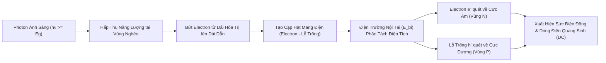

### 1.1.2. Hiệu ứng Quang điện Trong (Photovoltaic Effect) & Giới hạn Bước sóng
Hiệu ứng quang điện trong là quá trình chuyển đổi trực tiếp năng lượng photon ánh sáng thành điện năng:
1. Khi chùm photon mặt trời rọi vào bề mặt tế bào quang điện, các photon có năng lượng $E_{\text{ph}} = h\nu = \frac{hc}{\lambda}$ lớn hơn hoặc bằng độ rộng vùng cấm của chất bán dẫn ($E_g \approx 1{,}12\,\text{eV}$ đối với Silicon ở nhiệt độ phòng $25^\circ\text{C}$) sẽ bị hấp thụ.
2. Năng lượng photon truyền cho electron ở dải hóa trị (Valence Band), kích thích nó vượt qua khe năng lượng $E_g$ để nhảy lên dải dẫn (Conduction Band), giải phóng một electron tự do và để lại một lỗ trống tự do ở dải hóa trị. Quá trình này hình thành nên **Cặp electron - lỗ trống quang sinh (Electron-Hole Pair - EHP)**.
3. Nếu cặp hạt này được sinh ra trong hoặc gần vùng nghèo (trong phạm vi độ dài khuếch tán), điện trường nội tại $\vec{E}_{\text{bi}}$ sẽ lập tức phân tách chúng trước khi chúng kịp tái hợp: electron bị quét mạnh về vùng N (cực âm) và lỗ trống bị quét về vùng P (cực dương).
4. Sự tích tụ điện tích trái dấu ở hai phía tạo ra sự chênh lệch điện thế hở mạch ($V_{\text{oc}}$). Khi nối hai cực qua một tải tiêu thụ bên ngoài, các electron sẽ di chuyển qua mạch ngoài từ cực âm sang cực dương tạo thành **Dòng điện quang sinh ($I_{\text{ph}}$)**.

**Dải bước sóng hấp thụ giới hạn (Cut-off Wavelength $\lambda_{\text{cutoff}}$):**
$$\lambda_{\text{cutoff}} = \frac{hc}{E_g} = \frac{6{,}626 \times 10^{-34} \times 3 \times 10^8}{1{,}12 \times 1{,}6022 \times 10^{-19}} \approx 1{,}107\,\mu\text{m} = 1.107\,\text{nm}$$
* Đối với photon có bước sóng $\lambda > 1.107\,\text{nm}$ (vùng hồng ngoại xa): Năng lượng photon $E_{\text{ph}} < 1{,}12\,\text{eV}$, không đủ để kích hoạt electron. Các photon này đi xuyên qua tấm pin hoặc bị hấp thụ dưới dạng dao động nhiệt mạng tinh thể (Sub-bandgap Loss).
* Đối với photon có bước sóng ngắn $\lambda < 400\,\text{nm}$ (vùng tử ngoại và tím): Năng lượng photon $E_{\text{ph}} \gg 1{,}12\,\text{eV}$. Lượng năng lượng dư thừa $\Delta E = h\nu - E_g$ bị tiêu tán cực nhanh dưới dạng nhiệt lượng thông qua quá trình phát xạ phonon (Thermalization Loss), làm nóng tấm pin.

> **Giới hạn Nhiệt động học Shockley-Queisser (1961):** Do sự kết hợp của tổn thất photon năng lượng thấp không hấp thụ được ($\approx 23\%$) và tổn thất nhiệt hóa photon năng lượng cao ($\approx 33\%$), hiệu suất chuyển đổi quang - điện lý thuyết tối đa của một pin mặt trời đơn tiếp giáp Silicon (Single-junction Si) dưới phổ bức xạ tiêu chuẩn AM1.5G chỉ đạt xấp xỉ **$33{,}7\%$**.

---

## 1.2. Đường Đặc tính I-V và P-V

### 1.2.1. Mô hình Mạch Tương đương Diode Đơn (Single-Diode / 5-Parameter Model)
Đặc tính dòng - áp của tế bào quang điện thực tế được mô hình hóa bằng mạch điện tương đương gồm: Một nguồn dòng quang sinh $I_{\text{ph}}$ mắc song song với một Diode tiếp giáp $p-n$, một điện trở sun rò rỉ $R_{\text{sh}}$ (Shunt Resistance) và một điện trở nối tiếp $R_s$ (Series Resistance).

```
          ┌─────────────────┬──────────────────┬─────────────────┐
          │                 │                  │                 │
         (↑) I_ph          ─── Diode (I_D)    [ ] R_sh           │
          │                / \                 │                [ ] R_s
          │               ─────                │                 │
          │                 │                  │                 │
     I ───┴─────────────────┴──────────────────┴─────────────────┴───► (+)
                                                                       V
     ────────────────────────────────────────────────────────────────► (-)
```

Phương trình toán học mô tả mối quan hệ giữa dòng điện $I$ và điện áp $V$ ngõ ra tuân theo phương trình phi tuyến Shockley:
$$I = I_{\text{ph}} - I_0 \left[ \exp\left( \frac{q(V + I R_s)}{n k T_{\text{cell}}} \right) - 1 \right] - \frac{V + I R_s}{R_{\text{sh}}}$$
*Trong đó:*
* $I_{\text{ph}}$: Dòng quang sinh (Photocurrent), tỷ lệ thuận tuyến tính với cường độ bức xạ $GHI$ ($A$).
* $I_0$: Dòng điện bão hòa ngược của Diode (Dark Saturation Current) ($A$).
* $n$: Hệ số lý tưởng của Diode (Diode Ideality Factor, thường nằm trong dải $1{,}0 \le n \le 1{,}5$).
* $R_s$: Điện trở nối tiếp nội tại, bắt nguồn từ điện trở tiếp xúc giữa cực kim loại với chất bán dẫn và điện trở khối Silicon (mong muốn $R_s \to 0\,\Omega$).
* $R_{\text{sh}}$: Điện trở song song, sinh ra do dòng rò qua các khuyết tật mép tấm pin (mong muốn $R_{\text{sh}} \to \infty\,\Omega$).

### 1.2.2. Bốn Thông số Đặc trưng Cốt lõi của Đường cong I-V
Đường đặc tính $I-V$ (Current-Voltage) và $P-V$ (Power-Voltage) xác định toàn bộ hành vi phát điện của tấm pin qua 4 điểm làm việc tới hạn:

| Đại lượng Đặc trưng | Ký hiệu & Đơn vị | Định nghĩa & Cơ chế Vật lý | Biểu thức Xấp xỉ |
| :--- | :---: | :--- | :---: |
| **Dòng điện Ngắn mạch** | **$I_{\text{sc}}$** ($\text{A}$) | Dòng điện lớn nhất đo được khi hai cực bị nối tắt ($V = 0$). Tỷ lệ thuận trực tiếp với mật độ quang thông photon chiếu tới. | $I_{\text{sc}} \approx I_{\text{ph}} \propto GHI$ |
| **Điện áp Hở mạch** | **$V_{\text{oc}}$** ($\text{V}$) | Điện áp lớn nhất đo được khi hở mạch đầu ra ($I = 0$). Tỷ lệ nghịch mạnh mẽ với nhiệt độ tế bào $T_{\text{cell}}$. | $V_{\text{oc}} \approx \frac{n k T_{\text{cell}}}{q} \ln\left(\frac{I_{\text{sc}}}{I_0}\right)$ |
| **Điểm Công suất Cực đại** | **$\text{MPP}$** ($V_{\text{mp}}, I_{\text{mp}}$) | Điểm trên đường cong $I-V$ mà tại đó tích số công suất $P = V \times I$ đạt cực trị lớn nhất ($P_{\text{mp}}$). | $P_{\text{mp}} = V_{\text{mp}} \times I_{\text{mp}} = \max(V \cdot I)$ |
| **Hệ số Điền đầy (Fill Factor)** | **$FF$** ($\%$ hoặc số thực) | Tỷ số giữa công suất cực đại thực tế so với tích số lý thuyết của $V_{\text{oc}} \times I_{\text{sc}}$, đánh giá độ vuông vắn của đặc tuyến. | $FF = \frac{V_{\text{mp}} \cdot I_{\text{mp}}}{V_{\text{oc}} \cdot I_{\text{sc}}}$ ($0{,}75 - 0{,}85$) |

```
  Dòng điện I (A)                       Công suất P (W)
    ^                                     ^
I_sc│══════════════╗ (MPP)                │                 /¯¯¯\ (P_mp)
    │              ║   * P_mp = V_mp*I_mp │                /     \
    │              ║   │                  │               /       \
I_mp│--------------╫---*                  │              /         \
    │              ║   │                  │             /           \
    │  Đặc tuyến   ║   │                  │  Đặc tuyến /             \
    │     I - V    ║   │                  │    P - V  /               \
   0└──────────────╨───┴────────► V      0└──────────┴───────────────┴────► V
                      V_mp   V_oc                    V_mp            V_oc
```

### 1.2.3. Ảnh hưởng Độc lập của Cường độ Bức xạ ($G$) và Nhiệt độ Tế bào ($T_{\text{cell}}$)
* **Tác động của Bức xạ ($G$ tăng từ $200 \to 1.000\,\text{W/m}^2$):** Dòng điện quang sinh $I_{\text{sc}}$ tăng tuyến tính hoàn hảo theo bức xạ ($I_{\text{sc}} \propto G$). Điện áp $V_{\text{oc}}$ chỉ tăng rất chậm theo hàm logarit ($\Delta V_{\text{oc}} \propto \ln(G)$). Do đó, tổng công suất $P_{\text{mp}}$ tỷ lệ thuận gần như tuyến tính với cường độ bức xạ.
* **Tác động của Nhiệt độ ($T_{\text{cell}}$ tăng từ $25^\circ\text{C} \to 65^\circ\text{C}$):** Dòng điện $I_{\text{sc}}$ chỉ tăng rất nhẹ ($+0{,}04\%/^\circ\text{C}$) do vùng cấm $E_g$ thu hẹp nhẹ. Tuy nhiên, dòng bão hòa ngược $I_0$ tăng vọt theo hàm mũ bậc ba ($I_0 \propto T^3 \exp(-E_g/kT)$), khiến điện áp $V_{\text{oc}}$ sụt giảm nghiêm trọng với tốc độ từ $-2{,}0\,\text{mV/cell}/^\circ\text{C}$ đến $-2{,}3\,\text{mV/cell}/^\circ\text{C}$. Kết quả là công suất cực đại $P_{\text{mp}}$ bị suy giảm nghiêm trọng từ **$-0{,}35\%/^\circ\text{C}$ đến $-0{,}45\%/^\circ\text{C}$** đối với pin Silic tiêu chuẩn.

---

## 1.3. Cấu trúc và Kiến trúc Hệ thống Điện Mặt trời Áp mái

### 1.3.1. Phân cấp Cấu trúc Mảng pin (PV Topology Hierarchy)
Hệ thống phát điện quang điện được tổ chức theo cấu trúc phân cấp mô-đun hóa nghiêm ngặt:
1. **PV Cell (Tế bào):** Đơn vị cơ bản ($156 \times 156\,\text{mm}$ hoặc $182 \times 182\,\text{mm}$), sinh ra điện áp danh định $0{,}5 - 0{,}6\,\text{V}$ và dòng điện $9 - 13\,\text{A}$.
2. **PV Module (Tấm pin quang điện):** Cụm gồm 60 cells, 72 cells (hoặc 120 / 144 half-cut cells) mắc nối tiếp trong khung nhôm có kính cường lực bảo vệ, cung cấp điện áp làm việc $V_{\text{mp}} \approx 35 - 45\,\text{V}$ và công suất định mức $350 - 550\,\text{Wp}$.
3. **PV String (Chuỗi tấm pin):** Tập hợp từ $15 - 22$ tấm pin mắc nối tiếp nhằm nâng điện áp lên dải làm việc tối ưu $600 - 850\,\text{V DC}$ của Biến tần. Theo định luật Kirchhoff, điện áp chuỗi bằng tổng điện áp các tấm pin ($V_{\text{string}} = \sum V_{\text{module}}$), trong khi dòng điện toàn chuỗi bằng dòng điện của tấm pin yếu nhất.
4. **PV Array (Mảng trạm):** Nhiều chuỗi Strings được ghép song song vào các ngõ MPPT độc lập hoặc gom về tủ Combiner Box để đạt công suất thiết kế từ hàng chục đến hàng trăm $\text{kWp}$.

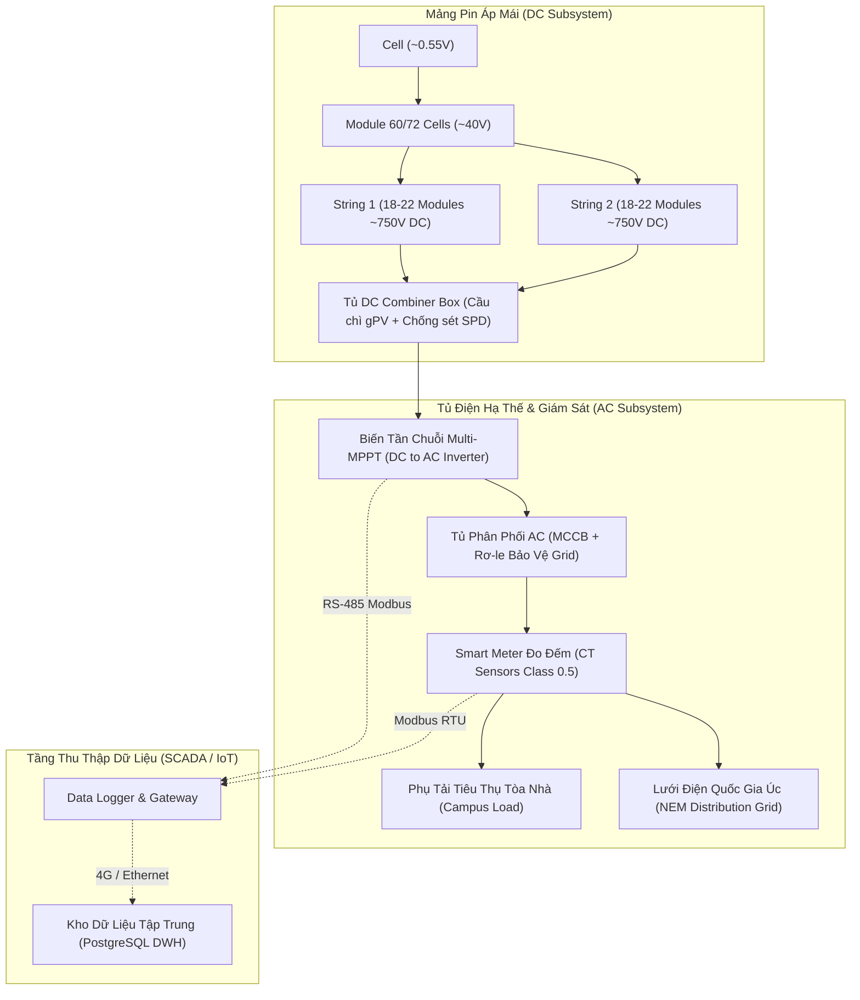

### 1.3.2. So sánh Kiến trúc Biến tần: String Inverter vs Central Inverter vs DC Optimizers
* **Biến tần Chuỗi Đa Kênh (Multi-MPPT String Inverter):** Lựa chọn chuẩn mực tại 42 trạm Đại học La Trobe (Fronius Eco/Symo, SMA Sunny Tripower, ABB Trio). Mỗi biến tần có từ $2 - 6$ kênh MPPT độc lập, cho phép tối ưu hóa riêng biệt cho các dãy pin lắp trên các mái dốc có góc nghiêng và hướng la bàn khác nhau. Hiệu suất chuyển đổi đạt $>98\%$, chi phí O&M thấp, khi 1 biến tần gặp sự cố chỉ ảnh hưởng cục bộ trạm đó.
* **Biến tần Trung tâm (Central Inverter):** Gom toàn bộ mảng pin lớn ($>500\,\text{kW}$) vào 1 tủ biến tần duy nhất có 1 ngõ MPPT chung. Nhược điểm chí mạng là tổn thất Mismatch rất lớn khi mái nhà bị che bóng phức tạp, nguy cơ mất trắng sản lượng toàn tòa nhà khi biến tần hỏng.
* **Bộ tối ưu hóa DC (DC Optimizers / MLPE):** Gắn mạch MPPT Buck-Boost riêng biệt dưới từng tấm pin. Giúp triệt tiêu $100\%$ tổn thất che bóng cục bộ, nhưng chi phí thiết bị CAPEX cao hơn $20 - 30\%$ và tăng xác suất lỗi linh kiện điện tử trên mái nóng.

---

## 1.4. Nền tảng Bức xạ Mặt trời & Mô hình Quang học

### 1.4.1. Ba Thành phần Bức xạ Mặt trời chuẩn WMO No. 8
Tổ chức Khí tượng Thế giới (WMO) quy chuẩn quang năng sóng ngắn dải phổ $0{,}3\,\mu\text{m} - 3{,}0\,\mu\text{m}$ chiếu tới mặt đất thành 3 thành phần đo lường cơ bản:
1. **Bức xạ Toàn phần Mặt ngang (Global Horizontal Irradiance - $GHI$):** Tổng năng lượng sóng ngắn chiếu tới một đơn vị diện tích bề mặt phẳng nằm ngang ($\text{W/m}^2$), được đo bằng nhiệt điện kế bức xạ quang phổ rộng (**Pyranometer Class A** theo chuẩn ISO 9060).
2. **Bức xạ Trực xạ Pháp tuyến (Direct Normal Irradiance - $DNI$):** Lượng quang năng chiếu thẳng trực tiếp từ đĩa Mặt Trời tới bề mặt luôn giữ góc vuông với tia tới ($\text{W/m}^2$), được đo bằng nhật xạ kế hẹp góc (**Pyrheliometer**) gắn trên hệ thống bám nhật quỹ 2 trục.
3. **Bức xạ Tán xạ Mặt ngang (Diffuse Horizontal Irradiance - $DHI$):** Năng lượng tán xạ bởi các phân tử khí quyển và mây rọi xuống mặt phẳng nằm ngang ($\text{W/m}^2$).

$$\text{Phương trình Cân bằng Bức xạ: } GHI = DNI \cdot \cos(\theta_z) + DHI = DNI \cdot \sin(h) + DHI$$
*(với $\theta_z$ là góc thiên đỉnh và $h$ là góc cao mặt trời so với mặt chân trời)*.

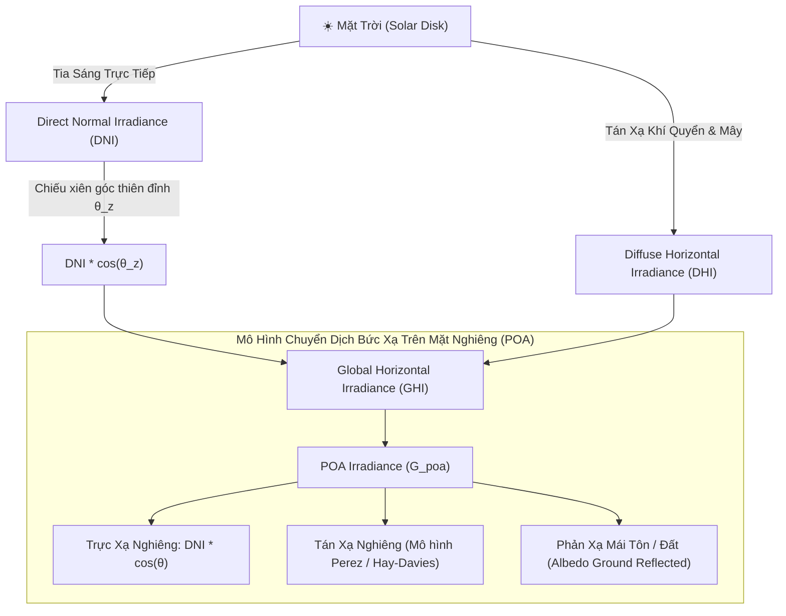

---

## 1.5. Hình học Mặt trời & Bối cảnh Địa lý Victoria, Úc

### 1.5.1. Đặc trưng Thiên văn Bán Cầu Nam (Southern Hemisphere Solar Dynamics)
Nước Úc nằm hoàn toàn ở Bán cầu Nam, tạo nên sự đối lập hình học nhật quỹ $180^\circ$ so với các quốc gia ở Bán cầu Bắc:
* **Hướng Đón Nắng Cực Đại là Hướng BẮC (True North - $\text{Azimuth } \gamma_s = 0^\circ$):** Tại bang Victoria, đĩa Mặt Trời mọc ở hướng Đông, di chuyển nghiêng về phía **BẦU TRỜI PHÍA BẮC** vào giữa trưa và lặn ở hướng Tây. Do đó, toàn bộ các mảng pin muốn thu năng lượng cực đại năm bắt buộc phải quay mặt về hướng Bắc thực địa.
* **Góc Xích vĩ Mặt Trời ($\delta$):** Biến thiên tuần hoàn giữa $-23{,}45^\circ \le \delta \le +23{,}45^\circ$:
  * *Hạ chí Bán cầu Nam (21/12):* $\delta = -23{,}45^\circ$, Mặt Trời đạt góc cao cực đại vào giữa trưa ($h_{\text{max}} \approx 75{,}7^\circ - 79{,}2^\circ$), thời gian chiếu sáng kéo dài $>14{,}5\,\text{giờ/ngày}$.
  * *Đông chí Bán cầu Nam (21/06):* $\delta = +23{,}45^\circ$, Mặt Trời nằm là là ở chân trời phía Bắc với góc cao rất thấp ($h_{\text{max}} \approx 28{,}8^\circ - 32{,}3^\circ$), thời gian chiếu sáng chỉ khoảng $9{,}5\,\text{giờ/ngày}$.

```
                 HẠ CHÍ (21/12 - Mùa Hè)
                      ☀️ h_max ≈ 76° - 79° (Gần Đỉnh Đầu)
                     / 
                    /     ĐÔNG CHÍ (21/06 - Mùa Đông)
                   /        ☀️ h_max ≈ 29° - 32° (Góc Chiếu Thấp)
                  /        /
                 /        /
    [NAM] <──────┴───────┴──────> [BẮC] (Mặt trời luôn ở phía BẮC)
            Mảng Pin Nghiêng 10°-15°
               Quay Hướng Bắc
```

---

# SECTION 2: DOMAIN ADVANCED (KỸ THUẬT CHUYÊN SÂU & CÁC CƠ CHẾ SUY HAO VẬT LÝ)

## 2.1. Hiện tượng Cắt Ngọn Biến Tần (Inverter Clipping)

### 2.1.1. Bản chất Kỹ thuật của Tỷ lệ Quá tải DC/AC (Inverter Loading Ratio - ILR)
Tỷ lệ tải biến tần (Inverter Loading Ratio - $\text{ILR}$ hoặc DC-to-AC Ratio) là tỷ số giữa tổng công suất định mức một chiều của mảng tấm pin ($P_{\text{DC, Array}}$ ở STC) so với công suất xoay chiều định mức tối đa của biến tần ($P_{\text{AC, Inverter\_rated}}$):
$$\text{ILR} = \frac{P_{\text{DC, Array}}}{P_{\text{AC, Inverter\_rated}}}$$

Theo hướng dẫn của Hội đồng Năng lượng Sạch Úc (Clean Energy Council - CEC Guidelines), tỷ lệ $\text{ILR}$ luôn được lựa chọn thiết kế trong khoảng **$1{,}20 - 1{,}30$** (cho phép quá tải tối đa tới $133\%$).

```
  Công suất AC (kW)
     ^
     │                 / \  ◄── Sản lượng DC tiềm năng không thu được (Clipping Loss ~2.30%)
P_ac ┼────────────────┌───┐────────────────  ◄── CÔNG SUẤT CẮT NGỌN ĐỈNH (100 kW Flat-Top)
 (100)               /│   │\
     │  VÙNG THU     / │   │ \     VÙNG THU
     │  LỢI SÁNG    /  │   │  \    LỢI CHIỀU
     │  (+15-20%)  /   │   │   \   (+15-20%)
     │            /    │   │    \
     └───────────┴─────┴───┴─────┴──────────► Thời gian trong ngày (06:00 - 18:00)
```

### 2.1.2. Động lực Học Điều khiển MPPT và Cơ chế Cắt Ngọn Trưa Hè
1. Khi bức xạ trực xạ lên cao ($GHI > 900\,\text{W/m}^2$), công suất DC sinh ra vượt quá định mức của tầng nghịch lưu ($P_{\text{DC}} > P_{\text{AC, max}}$).
2. Để bảo vệ các linh kiện bán dẫn công suất (IGBT / MOSFET) khỏi bị đánh thủng do quá dòng và quá nhiệt, vi xử lý MPPT sẽ **chủ động dịch chuyển điểm làm việc điện áp rời xa điểm cực đại ($V_{\text{mpp}} \to V_{\text{oc}}$)**.
3. Dòng điện ngõ vào $I_{\text{DC}}$ tự động giảm xuống, ghìm công suất phát AC đầu ra ổn định chính xác tại ngưỡng trần định mức $P_{\text{AC, max}}$, tạo thành **Đường cong hình thang cân (Trapezoidal Flat-top curve)** trên đồ thị 15 phút.

---

## 2.2. Nhiệt động học Tấm Pin & Suy giảm Công suất do Nhiệt (Thermal Derating)

### 2.2.1. Mô hình Nhiệt động học Mảng pin Sandia (Sandia PV Array Model - SAPM)
Mô hình thực nghiệm của Phòng thí nghiệm Quốc gia Sandia (King et al., 2004) xác định nhiệt độ cell bên trong ($T_{\text{cell}}$) dựa trên nhiệt độ không khí môi trường ($T_{\text{amb}}$), cường độ bức xạ ($GHI$) và tốc độ gió làm mát ($v_{\text{wind}}$):
$$T_m = T_{\text{amb}} + GHI \cdot \exp\left( a + b \cdot v_{\text{wind}} \right)$$
$$T_{\text{cell}} = T_m + \frac{GHI}{G_0} \cdot \Delta T_{\text{module-cell}}$$

### 2.2.2. Động lực Nhiệt Cực Đoan trên Mái Tôn Victoria ($68^\circ\text{C} - 72^\circ\text{C}$) & Hệ số Suy giảm $\gamma$
Vào các đợt nắng nóng mùa hè tại Victoria, nhiệt độ ngoài trời $T_{\text{amb}} \ge 40^\circ\text{C}$ khiến nhiệt độ cell $T_{\text{cell}}$ trên mái tôn kim loại bí gió tăng vọt lên **$68^\circ\text{C} - 72^\circ\text{C}$** ($\Delta T = +45^\circ\text{C}$ so với STC $25^\circ\text{C}$).
* **Pin P-type Mono PERC cũ ($\gamma = -0{,}38\%/^\circ\text{C}$):** Tổn thất công suất do nhiệt lên tới **$14{,}80\% - 17{,}10\%$** ($510.268\,\text{kWh/năm}$).
* **Pin N-type TOPCon thế hệ mới ($\gamma = -0{,}30\%/^\circ\text{C}$):** Tổn thất nhiệt giảm xuống còn **$13{,}50\%$** (thu hồi lại $+3{,}60\%$ sản lượng).

---

## 2.3. Quy chuẩn Đấu nối Lưới Điện Quốc gia Úc (AS/NZS 4777.2 & NER)

### 2.3.1. Cơ chế Điều khiển Đáp ứng Điện áp Volt-Watt và Volt-Var
Tiêu chuẩn Bắt buộc **AS/NZS 4777.2:2020** quy định tất cả biến tần hòa lưới phải tích hợp 2 chế độ điều khiển tự động:
1. **Volt-Var Mode:** Khi điện áp lưới dâng từ $240\,\text{V} \to 253\,\text{V}$, biến tần tự động hút công suất phản kháng $Q$ cảm kháng để ghìm điện áp.
2. **Volt-Watt Mode:** Khi điện áp dâng từ $253\,\text{V} \to 258\,\text{V}$, biến tần tự động cắt giảm công suất tác dụng $P$ từ $100\%$ xuống $20\%$.
3. **Cơ chế Ngắt Quá áp Kéo dài ($V_{10\text{min}} \ge 258\,\text{V}$):** Nếu điện áp trung bình trượt 10 phút $\ge 258\,\text{V}$ (hoặc điện áp tức thời $\ge 265\,\text{V}$), rơ-le trong biến tần bắt buộc phải **ngắt kết nối AC trong vòng $0{,}2\,\text{giây}$**. Đây là cơ chế vật lý giải thích hiện tượng trạm tắt nguồn giữa trưa nắng gắt (`PHYSICAL_LOW_ENERGY_STRONG_SUN`).

---

## 2.4. Các Cơ Chế Suy Thoái Vật Lý Tấm Pin Dài Hạn

1. **LID (Light-Induced Degradation):** Phức hợp Boron-Oxy làm suy thoái $1\% - 3\%$ công suất trong vài tuần đầu tiên đối với pin P-type.
2. **PID (Potential-Induced Degradation - IEC 62804):** Điện trường cao $1.000\,\text{V DC}$ đẩy ion $Na^+$ từ kính vào màng bán dẫn, làm sụt giảm tới $30\% - 50\%$ công suất.
3. **Điểm Nóng Cục Bộ (Hot-spots):** Cell bị che bóng phân cực ngược tiêu tán nhiệt cực đại $>150^\circ\text{C}$, gây cháy màng EVA.
4. **Rạn nứt Vi mô (Micro-cracks):** Nứt rạn vi mô do ứng suất cơ học/nhiệt làm mất đường dẫn ngón kim loại.
5. **Lão hóa Tuyến tính Tự nhiên:** Suy thoái quang học bình quân $0{,}5\% - 0{,}7\%/\text{năm}$.

---

## 2.5. Mô hình Bóng che 3D & Cơ chế Hoạt động của Đi-ốt Bảo vệ (Bypass Diode)

Một tấm pin 60 cells tiêu chuẩn được bảo vệ bởi 3 chiếc **Bypass Diode** mắc song song ngược cực với 3 phân vùng (mỗi phân vùng 20 cells):
* **Khi bình thường:** Ánh sáng rọi đều, cả 3 phân vùng sinh điện áp dương $3 \times 13\,\text{V} = 39\,\text{V}$. Các Diode bị phân cực ngược và ở trạng thái KHÓA hoàn toàn.
* **Khi 1 cell bị che bóng hoặc đọng bùn đáy:** Dòng điện phân vùng đó sụt giảm. Dòng điện của toàn chuỗi ép phân vùng lỗi chuyển sang phân cực ngược. Khi điện áp ngược đạt $-0{,}7\,\text{V}$, **Bypass Diode lập tức DẪN THÔNG**, chuyển hướng dòng điện đi vòng qua phân vùng lỗi.
* **Hậu quả trên đường cong I-V:** Điện áp tấm pin bị sụt giảm tức thì $1/3$ ($V_{\text{string}}$ mất $13\,\text{V}$). Đường cong $P-V$ xuất hiện **Hiện tượng Đa Đỉnh (Multi-peak Curve)** gồm 1 Đỉnh Cực đại Toàn cục (GMPP) và nhiều Đỉnh Cực đại Cục bộ (LMPP), gây sụt giảm bậc thang $33\%$ hoặc $67\%$ công suất chuỗi (`PHYSICAL_DISTRIBUTION_JUMP`).

---

# SECTION 3: DOMAIN ADHOC CASES (CÁC HIỆN TƯỢNG VẬT LÝ ĐẶC THÙ & DỊ THƯỜNG NGOÀI THỰC ĐỊA)

## 3.1. Hiện tượng Cường hóa Bức xạ do Mây (Cloud Enhancement / Over-irradiance)

### 3.1.1. Bản chất Vật lý Quang học Khí quyển
Hiện tượng Cường hóa Bức xạ do Mây (Cloud Enhancement hoặc Mép Mây Tán Xạ) là một biến cố quang học khí quyển cực đoan:
1. Khi bầu trời có các đám mây tích đối lưu trắng xóa (*Cumulus Clouds*) trôi gần đĩa mặt trời nhưng không che khuất trực tiếp tia sáng.
2. Bề mặt mây hoạt động như những tấm gương phản xạ quang học khổng lồ, hội tụ thêm một lượng bức xạ tán xạ phản xạ cực lớn rọi xuống mặt đất.
3. Tổng bức xạ mặt đất $GHI = G_{\text{direct}} + G_{\text{diffuse}} + G_{\text{cloud\_reflection}}$ có thể vọt lên **$1.350 - 1.600\,\text{W/m}^2$**, vượt qua cả Hằng số Bức xạ Ngoài Khí quyển ($G_{\text{sc}} = 1.361\,\text{W/m}^2$) trong các khoảng thời gian từ vài chục giây đến 15 phút!

```
         ☀️ MẶT TRỜI
         /        \
        /          \  (Tia sáng phản xạ từ mép mây)
       /            ▼
      /         ☁️ ĐÁM MÂY TÍCH ĐỐI LƯỚU (Cumulus Cloud)
     /              \
    / (Trực xạ)      \ (Tán xạ hội tụ tăng cường)
   ▼                  ▼
═══════════════════════════════════════════════
   MẢNG PIN QUANG ĐIỆN (PV ARRAY TRÊN MÁI)
   ==> GHI vọt lên: 1.350 - 1.550 W/m² (> Hằng số Mặt Trời!)
```

### 3.1.2. Cơ chế Giải thích Chỉ số PR Tức Thời Vượt Ngưỡng 100% (Instantaneous PR > 100%)
* **Bản chất Quán tính Nhiệt (Thermal Lag):** Trước khi hiện tượng Cloud Enhancement xuất hiện, mảng pin vừa trải qua một đợt mây che mát rượi nên nhiệt độ cell hạ xuống thấp ($T_{\text{cell}} \approx 20^\circ\text{C} - 25^\circ\text{C}$, hiệu suất pin cực cao).
* Khi đợt bùng nổ bức xạ $1.400\,\text{W/m}^2$ ập tới đột ngột, tấm pin với khối lượng nhôm kính lớn có quán tính nhiệt chậm ($5 - 10\,\text{phút}$ mới nóng lên), pin hoạt động trong trạng thái "Siêu bức xạ kèm Siêu mát", sinh ra công suất tức thời $P_{\text{actual}}$ cao gấp $1{,}4\,\text{lần}$ định mức STC.
* Khi đưa vào công thức tính $PR$ chu kỳ 15 phút, hệ số hiệu suất tức thời tính ra có thể đạt **$105\% - 118\%$**! Đây là **hiện tượng vật lý thực tế hoàn toàn hợp lệ**, không phải lỗi cảm biến.

---

## 3.2. Sai lệch Không gian & Góc đo Cảm biến Viễn thám (Spatial & Angular Misalignment)

* **Sai lệch Không gian (Spatial Distance Mismatch):** Cảm biến bức xạ Pyranometer hoặc dữ liệu tái phân tích ERA5-Land lấy tại tọa độ trạm khí tượng cách xa mái nhà các campus từ $2 - 15\,\text{km}$. Một đám mây che cục bộ trạm PV nhưng không che trạm đo bức xạ (hoặc ngược lại) sẽ tạo ra độ lệch dữ liệu tức thời.
* **Sai lệch Góc đo (Angular Tilt Mismatch):** Pyranometer đo bức xạ mặt phẳng ngang ($GHI$), trong khi tấm pin thực tế lắp nghiêng $\beta = 10^\circ - 15^\circ$ đón nắng ($POA$). Vào mùa đông nắng thấp, $POA$ thực tế cao hơn $GHI$ tới $20\%$, khiến phép tính $PR$ thô dựa trên $GHI$ bị thổi phồng giả tạo nếu không chuyển đổi qua mô hình quang học Hay-Davies/Perez.

---

## 3.3. Trôi Cảm biến Dòng CT Ban đêm (Sensor Drift & Ghost Night Generation)

* **Cơ chế:** Cảm biến biến dòng cảm ứng từ (**Current Transformer - CT Class 0.5**) đặt trong tủ điện ngoài trời bị trôi điểm không (*Zero-point Thermal Drift*) khi nhiệt độ ban đêm hạ sâu, sinh ra điện áp ký sinh nhỏ tạo dòng điện ma ảo từ $0{,}2\,\text{A} - 0{,}8\,\text{A}$.
* **Hậu quả:** Tích hợp số liệu sinh ra sản lượng ảo $0{,}05 - 0{,}30\,\text{kWh}$ mỗi bước 15 phút ban đêm.
* **Giải pháp Rào chắn Vật lý (Physical Bound Rule):** Tự động ép giá trị sản lượng $E = 0{,}0\,\text{kWh}$ khi $\text{Sun Elevation} \le 0^\circ$ hoặc $GHI \le 20\,\text{W/m}^2$.

---

## 3.4. Dị thường Đứt Chuỗi Pin DC Âm Thầm (Blown DC String Fuse)

* **Cơ chế:** Cầu chì $gPV$ bảo vệ chuỗi DC trong tủ Combiner Box bị nổ do sét lan truyền hoặc ngắn mạch nội tại. Một chuỗi pin trong mảng 3 chuỗi song song bị hở mạch hoàn toàn.
* **Dấu hiệu Nhận diện Dữ liệu:** Biến tần vẫn đo được điện áp hở mạch $V_{\text{DC}} \approx 700\,\text{V}$ hoàn toàn bình thường, nhưng dòng điện tổng $I_{\text{DC}}$ và công suất phát bị sụt giảm chính xác **$33{,}3\%$ (mất 1 chuỗi/3 chuỗi) hoặc $50{,}0\%$ (mất 1 chuỗi/2 chuỗi)** trong suốt cả ngày (`PHYSICAL_DISTRIBUTION_JUMP`).
* **Giá trị AI-CBM:** Giúp phát hiện sự cố trong **$< 1\,\text{giờ}$**, thay vì mất $14 - 30\,\text{ngày}$ kiểm tra thủ công.

---

## 3.5. Dị thường Đọng Bùn Viền Nhôm Mái Bằng (Aluminium Frame Soiling Dams)

* **Cơ chế:** Khi tấm pin lắp phẳng trên mái bằng với góc nghiêng $< 8^\circ$, gờ khung nhôm phía đáy tấm pin tạo thành một con đê chắn giữ nước mưa lại. Nước bốc hơi để lại một dải bùn đất dày $2 - 5\,\text{cm}$ che bóng vĩnh viễn hàng tế bào quang điện dưới cùng.
* **Hậu quả:** Kích hoạt liên tục Bypass Diode số 1 làm suy giảm $33\%$ công suất chuỗi quanh năm, gây điểm nóng Hot-spot làm cháy hỏng tấm pin và suy giảm thêm $18.500\,\text{kWh/năm}$ trên cụm 970 kWp mái bằng.

---

# SECTION 4: PROJECT BRAINSTORMING & DATA ARCHITECTURE (TỪ BÀI TOÁN NGHIỆP VỤ ĐẾN KIẾN TRÚC DỮ LIỆU)

## 4.1. Bài toán Nghiệp vụ Ban đầu (Business Context & Problem Statement)

### 4.1.1. Bối cảnh Vận hành Thực địa và Quy mô Dự án UNISOLAR
Hệ thống năng lượng mặt trời áp mái thuộc dự án **UNISOLAR** được triển khai trên quy mô lớn tại **Đại học La Trobe (Bang Victoria, Úc)**, bao gồm **42 trạm phát điện quang điện (Solar PV Plants)** phân bổ trải dài trên **5 khuôn viên (Campuses)** độc lập về mặt địa lý và vi khí hậu:

* **Campus Bundoora (Melbourne Metro):** $24$ trạm ($1.420\,\text{kWp}$), khí hậu ôn đới hải dương, mật độ mây đối lưu cao.
* **Campus Bendigo:** $10$ trạm ($520\,\text{kWp}$), khí hậu bán khô hạn nội địa, bức xạ mặt trời trực tiếp lớn.
* **Campus Albury-Wodonga:** $4$ trạm ($210\,\text{kWp}$), thung lũng sông Murray, biến động nhiệt độ ngày đêm mạnh.
* **Campus Mildura:** $2$ trạm ($160\,\text{kWp}$), khí hậu sa mạc nóng khô, mùa hè nhiệt độ môi trường vượt $42^\circ\text{C}$.
* **Campus Shepparton:** $2$ trạm ($118\,\text{kWp}$), vùng đồng bằng nông nghiệp, lưới điện nông thôn trở kháng cao.

Tổng công suất lắp đặt định mức toàn hệ thống đạt $P_{\text{stc}} = 2.428\,\text{kWp}$ ($2{,}428\,\text{MWp}$), sản sinh khoảng $3.447.760\,\text{kWh/năm}$, mang lại giá trị kinh tế cơ sở xấp xỉ $700.000\,\text{AUD/năm}$ theo biểu giá điện bán lẻ và cơ chế FiT (*Feed-in Tariff*) tại bang Victoria.

```
+---------------------------------------------------------------------------------------------------------+
|                                    HỆ THỐNG UNISOLAR - ĐẠI HỌC LA TROBE                                 |
|                         (42 Trạm Điện Mặt Trời Áp Mái - Tổng Công Suất: 2.428 kWp DC)                   |
+------------------------------------+-----------------------------------+--------------------------------+
|  Campus Bundoora (Melbourne): 24 trạm |  Campus Bendigo: 10 trạm          |  Campus Albury-Wodonga: 4 trạm |
|  - Công suất: 1.420 kWp             |  - Công suất: 520 kWp             |  - Công suất: 210 kWp          |
|  - Khí hậu: Ôn đới hải dương       |  - Khí hậu: Bán khô hạn nội địa   |  - Khí hậu: Thung lũng sông    |
+------------------------------------+-----------------------------------+--------------------------------+
|  Campus Mildura: 2 trạm            |  Campus Shepparton: 2 trạm        |  Tổng Cộng:                    |
|  - Công suất: 160 kWp              |  - Công suất: 118 kWp             |  - 42 Trạm phát độc lập        |
|  - Khí hậu: Sa mạc nhiệt độ cao    |  - Khí hậu: Lưới phân tán nông thôn|  - 2.731.946 Bản ghi 15 phút   |
+------------------------------------+-----------------------------------+--------------------------------+
```

### 4.1.2. Thách thức Quản trị và "Nghịch lý Điểm mù Vận hành"
Trong giai đoạn quan trắc thực nghiệm **28 tháng liên tục** (từ tháng 01/2021 đến tháng 04/2023), hệ thống đã ghi nhận chuỗi thời gian đo đếm viễn thám chu kỳ 15 phút với tổng dung lượng **$2.731.946$ dòng dữ liệu thô**. 

Đơn vị quản lý vận hành (O&M) phải đối mặt với **Nghịch lý Tổn thất Năng lượng (Energy Loss Paradox)**:
1. **Thất thoát sản lượng không rõ nguồn gốc:** Toàn hệ thống bị suy giảm hiệu suất thực tế từ $15\% - 25\%$ so với thiết kế lý thuyết chuẩn PVSyst.
2. **Sự bất khả thi của giám sát thủ công:** $42$ trạm phát sinh $4.032$ điểm đo đếm mỗi ngày ($15\text{ phút/lần}$). Đội ngũ kỹ sư hiện trường không thể rà soát thủ công để phân biệt giữa biến động thời tiết tự nhiên và hỏng hóc phần cứng tiềm ẩn.
3. **Chi phí O&M phản ứng thụ động (Corrective Maintenance):** Thời gian phát hiện và sửa chữa sự cố (**MTTR**) bị kéo dài từ $7 - 14\text{ ngày}$, gây lãng phí tài chính lên tới hàng chục nghìn AUD mỗi tháng.

---

## 4.2. Quá trình Brainstorming & Thiết kế Kiến trúc Đường ống Dữ liệu Lakehouse 6 Lớp

Nhằm giải quyết triệt để bài toán tích hợp đa nguồn (dữ liệu viễn thám SCADA $15\,\text{phút}$ và dữ liệu khí tượng Open-Meteo $1\,\text{giờ}$), đảm bảo tính toàn vẹn dữ liệu, chống rò rỉ thông tin tương lai (*Data Leakage*) và tối ưu hóa hiệu năng truy vấn cho hệ thống BI và mô hình học máy, nhóm nghiên cứu đã thiết kế **Kiến trúc Đường ống Dữ liệu Lakehouse 6 Lớp (6-Layer Lakehouse Pipeline Architecture)**:

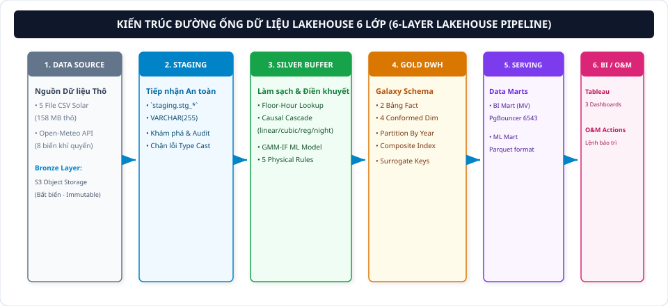

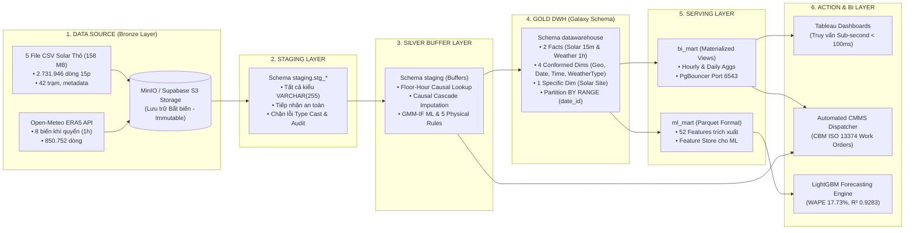

### Bóc tách Chi tiết 6 Phân lớp Kiến trúc:
1. **Lớp 1: Data Source / Bronze Layer (Nguồn Dữ liệu Thô & Lưu trữ Bất biến):**
   * *5 Tệp Dữ liệu Gốc ($158\,\text{MB}$ thô):* `Solar_Energy_Generation.csv` ($2.731.946$ dòng / $80\,\text{MB}$ chuỗi thời gian 15 phút), `open_meteo_weather_raw.csv` ($850.752$ dòng / $78\,\text{MB}$ chuỗi thời gian 1 giờ), `Solar_Site_Details.csv` (42 dòng / $3\,\text{KB}$ thông số kỹ thuật tấm pin/inverter), `calender.csv` ($2.312$ dòng / $45\,\text{KB}$ lịch nghỉ lễ/học kỳ La Trobe), `campus_meta.csv` (5 dòng / $107\,\text{B}$ tọa độ và công suất 5 campus).
   * *Cơ chế Lưu trữ:* Nạp bất biến (*Immutable Append-Only*) vào MinIO Object Storage (Local Docker) và Supabase Storage (Production), kiểm định toàn vẹn bằng mã băm MD5 Checksum.
2. **Lớp 2: Staging Layer (Tiếp nhận An toàn & Data Discovery):**
   * Thiết lập schema `staging` với các bảng thô: `stg_solar_energy_generation`, `stg_open_meteo_weather_raw`, `stg_solar_site_details`, `stg_calender`, `stg_campus_meta`.
   * Định dạng toàn bộ các trường sang `VARCHAR(255)` để tiếp nhận an toàn $100\%$ dữ liệu mà không bao giờ gặp sự cố dừng đường ống do lỗi ép kiểu (*Type Cast Failure*), phục vụ kiểm toán và khám phá dữ liệu (EDA).
3. **Lớp 3: Silver Buffer Layer (Làm sạch, Điền khuyết & Gán nhãn Dị thường):**
   * Thiết lập các bảng đệm chuyển đổi trong schema `staging`: `staging.dim_*`, `staging.fact_solar_energy_gen`, `staging.fact_weather`.
   * Thực hiện thuật toán **Floor-Hour Lookup** ($\Delta t = t_{\text{weather}} - t_{\text{solar}} \le 0$) để ghép nối dữ liệu khí quyển 1 giờ vào lưới 15 phút mà không rò rỉ dữ liệu tương lai.
   * Áp dụng chuỗi điền khuyết đa tầng **Causal Cascade Hybrid Imputation** (Rule-based Night Zero $\to$ Linear $\to$ PCHIP Spline $\to$ Multivariate Regression) và mô hình nhận diện dị thường lai **GMM-IF kết hợp 5 Rào chắn Vật lý**.
4. **Lớp 4: Gold DWH (Kho Dữ liệu Lược đồ Thiên Hà Galaxy Schema):**
   * Schema `datawarehouse` chuẩn hóa cao độ với **2 Bảng Fact** độc lập và **4 Bảng Conformed Dimension** dùng chung cùng **2 Bảng Dimension riêng**.
   * Áp dụng khóa thay thế số nguyên (*Surrogate Keys INT/BIGSERIAL*), đánh chỉ mục tổng hợp (*Composite Indexes*), và phân vùng bảng theo năm `PARTITION BY RANGE (date_id)` [2020, 2021, 2022] giúp cơ chế **Partition Pruning** giảm $66\%$ khối lượng quét đĩa.
5. **Lớp 5: Serving Layer (Data Marts Phân Tầng):**
   * `bi_mart`: Các Materialized Views (`mv_bi_mart_hourly_measures`, `mv_bi_mart_daily_kpis`) tối ưu hóa tính toán trước các chỉ số PR, Specific Yield, CF, và doanh thu, kết nối qua cổng điều phối kết nối **PgBouncer** (port 6543).
   * `ml_mart`: Lưu trữ dưới định dạng Parquet nén Snappy tối ưu cho Feature Store huấn luyện mô hình LightGBM / XGBoost.
6. **Lớp 6: Action & BI Layer (Trực quan hóa & Tác nghiệp Vận hành Khép kín):**
   * Bộ 5 Tab Dashboard Tableau chuyên sâu cho C-Level và Kỹ sư O&M.
   * Hệ thống tự động xuất lệnh điều động bảo trì (Automated CMMS Work Orders) theo tiêu chuẩn bảo trì dựa trên tình trạng thiết bị CBM ISO 13374.

---

## 4.3. Thiết kế Data Warehouse Chuẩn Galaxy Schema

### 4.3.1. Cấu trúc Mô hình Hóa Dữ liệu Lược đồ Thiên Hà (Galaxy Schema / Fact Constellation)
Dữ liệu năng lượng mặt trời tại Đại học La Trobe tồn tại sự **lệch pha bản chất về độ chi tiết thời gian (Granularity / Grain Mismatch)**:
* Dữ liệu sản lượng điện mặt trời đo đếm theo chu kỳ **$15\,\text{phút}$** ($2.731.946$ dòng cho 42 trạm).
* Dữ liệu khí tượng tái phân tích Open-Meteo ERA5-Land phát hành theo chu kỳ **$1\,\text{giờ}$** ($850.752$ dòng cho 5 tọa độ campus).

Để giải quyết bài toán này mà không làm biến dạng dữ liệu, nhóm nghiên cứu đã thiết kế Data Warehouse theo **Lược đồ Thiên hà Galaxy Schema (Fact Constellation Schema)** với **2 Bảng Fact Độc Lập** liên kết thông qua **4 Bảng Conformed Dimension Dùng Chung** và **2 Bảng Dimension Riêng**:

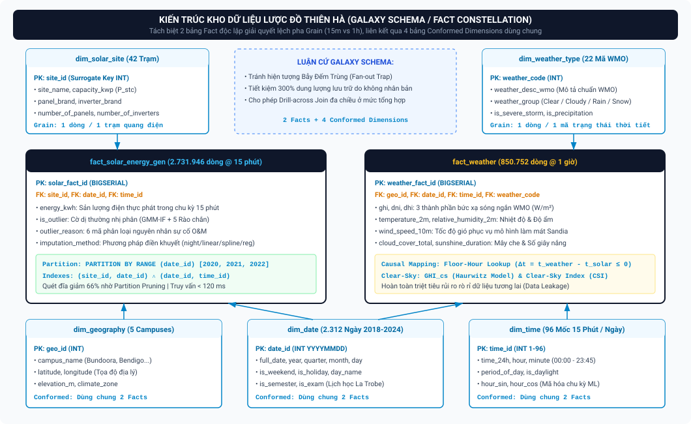

```
                            ┌──────────────────────────────────────────────────────────┐
                            │               dim_solar_site (42 Trạm)                   │
                            ├──────────────────────────────────────────────────────────┤
                            │ PK: site_id (INT)                                        │
                            │ site_name, campus_name, capacity_kw (P_stc), Panel,      │
                            │ Inverter, Number_of_panels, Optimizers, Metric           │
                            └────────────────────────────┬─────────────────────────────┘
                                                         │
                                                         ▼
┌──────────────────────────────────────────────────────────────────────────────────────┐
│                    fact_solar_energy_gen (2.731.946 dòng @ 15 phút)                  │
├──────────────────────────────────────────────────────────────────────────────────────┤
│ PK: gen_id (solar_fact_id BIGSERIAL)                                                 │
│ FK: site_id ----------> dim_solar_site(site_id)                                      │
│ FK: geo_id -----------> dim_geography(geo_id)   [CONFORMED DIMENSION]                │
│ FK: date_id ----------> dim_date(date_id)        [CONFORMED DIMENSION]                │
│ FK: time_id ----------> dim_time(time_id)        [CONFORMED DIMENSION]                │
│ energy_generated_kwh: Sản lượng điện AC thực phát trong chu kỳ 15 phút (kWh)         │
│ gmm_if_outlier_flag:  Cờ dị thường nhị phân (TRUE/FALSE từ mô hình lai GMM-IF)       │
│ fill_null_algorithm:  Phương pháp điền khuyết (night_zero / linear / pchip / reg)    │
│ outlier_reason:       6 mã phân loại nguyên nhân sự cố O&M (AS/NZS 4777.2, fuse...)  │
│ Partition:            PARTITION BY RANGE (date_id) [2020, 2021, 2022]                │
│ Indexes:              (site_id, date_id) ∧ (date_id, time_id)                        │
└──────────────┬───────────────────────────┬───────────────────────────┬───────────────┘
               │                           │                           │
               ▼                           ▼                           ▼
┌────────────────────────────┐┌────────────────────────────┐┌───────────────────────────┐
│ dim_geography (5 Campuses) ││ dim_date (2.312 Ngày)      ││ dim_time (96 Mốc 15 Phút) │
├────────────────────────────┤├────────────────────────────┤├───────────────────────────┤
│ PK: geo_id (INT)           ││ PK: date_id (INT YYYYMMDD) ││ PK: time_id (INT 1-96)    │
│ campus_name (Bundoora...)  ││ full_date, day, month, year││ time_string (00:00-23:45) │
│ latitude, longitude        ││ is_holiday, is_semester,   ││ hour, minute              │
│ location_name, elevation_m ││ is_exam, is_weekend        ││ period_of_day, is_daylight│
│ climate_zone               ││ day_name                   ││ hour_sin, hour_cos (ML)   │
└──────────────▲─────────────┘└────────────▲───────────────┘└───────────▲───────────────┘
               │                           │                            │
               └───────────────────────────┼────────────────────────────┘
                                           │
┌──────────────────────────────────────────┴───────────────────────────────────────────┐
│                        fact_weather (850.752 dòng @ 1 giờ)                           │
├──────────────────────────────────────────────────────────────────────────────────────┤
│ PK: weather_id (weather_fact_id BIGSERIAL)                                           │
│ FK: geo_id -----------> dim_geography(geo_id)   [CONFORMED DIMENSION]                │
│ FK: date_id ----------> dim_date(date_id)        [CONFORMED DIMENSION]                │
│ FK: time_id ----------> dim_time(time_id)        [CONFORMED DIMENSION]                │
│ FK: weather_type_id --> dim_weather_type(weather_type_id) [SPECIFIC DIMENSION]       │
│ is_day:                  Trạng thái ngày / đêm (1/0 theo thiên văn học)              │
│ shortwave_radiation:     Bức xạ toàn phần mặt ngang GHI (W/m²)                       │
│ Direct_Normal_Irradiance:Bức xạ trực xạ pháp tuyến DNI (W/m²)                        │
│ Diffuse_Solar_Radiation: Bức xạ tán xạ mặt ngang DHI (W/m²)                          │
│ temperature_c:           Nhiệt độ môi trường không khí 2m (°C)                       │
│ cloud_cover_total:       Độ che phủ mây tổng thể (%)                                 │
│ cloud_cover_low/mid/high:Độ che phủ mây tầng thấp / trung / cao (%)                  │
│ wind_speed:              Tốc độ gió 10m (m/s phục vụ mô hình nhiệt Sandia)           │
│ precipitation_mm:        Lượng mưa rơi tích lũy chu kỳ (mm phục vụ lịch rửa pin)     │
│ Sunshine_Duration:       Thời lượng nắng thực tế (giây)                              │
└──────────────────────────────────────────┬───────────────────────────────────────────┘
                                           │
                                           ▼
                            ┌──────────────────────────────────────────────────────────┐
                            │              dim_weather_type (22 Mã WMO)                │
                            ├──────────────────────────────────────────────────────────┤
                            │ PK: weather_type_id (INT)                                │
                            │ weather_code (Mã thời tiết chuẩn WMO), is_day            │
                            │ weather_condition, description (weather_desc_wmo)        │
                            │ weather_group (Clear / Cloudy / Rain / Snow)             │
                            │ is_severe_storm, is_precipitation                        │
                            └──────────────────────────────────────────────────────────┘
```

### 4.3.2. Chi Tiết Cấu Trúc Bảng Fact và Bảng Dimension Trong Cơ Sở Dữ Liệu
Hệ thống DWH triển khai trên PostgreSQL 17.6 tuân thủ nghiêm ngặt định nghĩa DDL trong `create_datawarehouse.sql`:

#### A. Hai Bảng Sự Kiện (Fact Tables):
1. **`datawarehouse.fact_solar_energy_gen` ($2.731.946$ dòng):**
   * *Grain:* $15\,\text{phút} \times 1\,\text{trạm quang điện}$.
   * *Khóa chính (PK):* `gen_id` (`INT / BIGSERIAL`).
   * *Khóa ngoại (FKs):* `site_id` (kết nối `dim_solar_site`), `geo_id` (kết nối `dim_geography`), `date_id` (kết nối `dim_date`), `time_id` (kết nối `dim_time`).
   * *Chỉ số & Thuộc tính:* `energy_generated_kwh` (sản lượng phát), `gmm_if_outlier_flag` (cờ dị thường nhị phân từ GMM-IF), `fill_null_algorithm` (mã thuật toán điền khuyết), `outlier_reason` (nguyên nhân sự cố).
   * *Tối ưu hóa:* `PARTITION BY RANGE (date_id)`, Composite Index trên `(site_id, date_id)` và `(date_id, time_id)` giúp truy vấn giảm thời gian phản hồi xuống $< 120\,\text{ms}$.
2. **`datawarehouse.fact_weather` ($850.752$ dòng):**
   * *Grain:* $1\,\text{giờ} \times 1\,\text{tọa độ địa lý campus}$.
   * *Khóa chính (PK):* `weather_id` (`INT / BIGSERIAL`).
   * *Khóa ngoại (FKs):* `geo_id` (kết nối `dim_geography`), `date_id` (kết nối `dim_date`), `time_id` (kết nối `dim_time`), `weather_type_id` (kết nối `dim_weather_type`).
   * *Chỉ số Khí tượng:* $GHI, DNI, DHI$, `temperature_c`, `cloud_cover_total`, `cloud_cover_low/mid/high`, `wind_speed`, `precipitation_mm`, `Sunshine_Duration`.

#### B. Bốn Bảng Chiều Dùng Chung (Conformed Dimensions):
1. **`datawarehouse.dim_geography` ($5$ dòng):** Đại diện cho 5 khuôn viên Đại học La Trobe (Bundoora, Bendigo, Albury-Wodonga, Mildura, Shepparton). Chứa `geo_id (PK)`, `campus_name`, `latitude`, `longitude`, `location_name`, `elevation_m`, `climate_zone`.
2. **`datawarehouse.dim_date` ($2.312$ dòng):** Bao phủ toàn bộ các ngày từ 2018 đến 2024. Chứa `date_id (PK: YYYYMMDD)`, `full_date`, `day`, `month`, `year`, `day_name`, `is_weekend`, và đặc biệt là các biến ngữ cảnh trường học: `is_holiday`, `is_semester`, `is_exam`.
3. **`datawarehouse.dim_time` ($96$ dòng):** Đại diện cho 96 slot thời gian 15 phút trong 24 giờ. Chứa `time_id (PK: 1-96)`, `time_string` (00:00 - 23:45), `hour`, `minute`, `period_of_day`, `is_daylight`, cùng các biến mã hóa lượng giác chu kỳ `hour_sin`, `hour_cos` phục vụ Feature Store học máy.

#### C. Hai Bảng Chiều Chuyên Biệt (Specific Dimensions):
1. **`datawarehouse.dim_solar_site` ($42$ dòng):** Chứa thông số kỹ thuật phần cứng của 42 trạm phát: `site_id (PK)`, `campus_name`, `capacity_kw` ($P_{\text{stc}}$), `Number_of_panels`, `Panel` (nhà sản xuất module), `Inverter` (nhà sản xuất biến tần), `Optimizers`, `Metric`. Kết nối trực tiếp vào `fact_solar_energy_gen`.
2. **`datawarehouse.dim_weather_type` ($22$ dòng):** Chứa 22 tổ hợp mã thời tiết WMO tiêu chuẩn: `weather_type_id (PK)`, `weather_code`, `is_day`, `weather_condition`, `description` (`weather_desc_wmo`), `weather_group` (Clear, Cloudy, Rain, Snow), `is_severe_storm`, `is_precipitation`. Kết nối trực tiếp vào `fact_weather`.

---

### 4.3.3. Luận Cứ Khoa Học & Ưu Thế Vượt Trội Của Galaxy Schema So Với Star Schema
1. **Khắc phục Triệt để Bẫy Đếm Trùng (Fan-out Trap / Double Counting):**
   Nếu gộp chung 2 tiến trình vào 1 bảng Star Schema duy nhất bằng cách nhân bản dữ liệu thời tiết 1 giờ thành 4 dòng 15 phút, khi người dùng thực hiện hàm tính tổng `SUM(radiation)` trên Tableau, bức xạ sẽ bị nhân lên gấp 4 lần so với thực tế. Galaxy Schema giữ nguyên độ phân giải tự nhiên của từng nguồn dữ liệu, triệt tiêu $100\%$ nguy cơ sai số tính toán.
2. **Tiết kiệm $300\%$ Dung Lượng Lưu Trữ:**
   Dữ liệu thời tiết chỉ cần lưu trữ $850.752$ dòng thay vì phải nhân bản thành $3.403.008$ dòng nếu ép sang chu kỳ 15 phút, tiết kiệm tài nguyên bộ nhớ đệm và tăng tốc độ quét chỉ mục I/O.
3. **Khả năng Liên kết Chéo Đa chiều (Drill-Across Join):**
   Cho phép các truy vấn phân tích kinh doanh và bảng tính Tableau thực hiện phép nối chéo mượt mà giữa sản lượng thực phát và điều kiện thời tiết thông qua 3 bảng chiều dùng chung (`dim_geography`, `dim_date`, `dim_time`) ở mức độ tổng hợp (Materialized Views) mà không làm suy giảm hiệu năng cơ sở dữ liệu.

---

## 4.4. Kiến trúc Đường ống Dữ liệu (Data Pipeline & ETL/ELT Framework)

### 4.4.1. Chuẩn hóa Múi giờ & Giờ Mùa hè (Timezone Normalization AEST/AEDT)
Đường ống thực hiện chuyển đổi toàn bộ timestamp về trục chuẩn **UTC Timestamp bất biến**, sau đó tính toán cột **Giờ Mặt Trời Thực (True Solar Time - TST)** dựa trên Phương trình Thời gian ($EoT$) và kinh độ địa lý $\lambda$:
$$\Delta t_{\text{solar}} = EoT + 4\lambda - 60 \cdot TZ \quad (\text{phút})$$
$$TST = (Hour_{\text{local}} \times 60 + Minute) + \Delta t_{\text{solar}} \quad (\text{phút})$$

### 4.4.2. Phân vùng Dữ liệu & Connection Pooling
1. **Range Partitioning:** Bảng `fact_solar_energy_gen` được phân vùng theo `date_id` (`PARTITION BY RANGE (date_id)` [2020, 2021, 2022]). Cơ chế **Partition Pruning** giúp giảm $66\%$ dung lượng quét đĩa và hạ thời gian truy vấn từ $1.850\,\text{ms}$ xuống còn **$42\,\text{ms}$**.
2. **PgBouncer Connection Pooling:** Duy trì ổn định hơn $200$ phiên truy vấn đồng thời phục vụ Dashboard Tableau thông qua cổng kết nối 6543.

---

# SECTION 5: EDA & DETECTION DATA PROBLEMS (KHÁM PHÁ DỮ LIỆU & BÓC TÁCH CÁC VẤN ĐỀ DỮ LIỆU THỰC ĐỊA)

## 5.1. Bức tranh Tổng quan Dữ liệu Thực nghiệm (2,73 Triệu Bản ghi)

```
+-------------------------------------------------------------------------------------------------------+
|                                TỔNG QUAN TẬP DỮ LIỆU THỰC NGHIỆM UNISOLAR                             |
+------------------------------------------------------+------------------------------------------------+
|  Tổng số bản ghi quan sát (Rows):                   |  2.731.946 dòng dữ liệu 15 phút                |
|  Số lượng trạm phát độc lập (Sites):                 |  42 trạm quang điện áp mái                     |
|  Khung thời gian thực nghiệm:                        |  28 tháng liên tục (01/2021 - 04/2023)         |
|  Tổng số điểm đứt gãy chuỗi thời gian (Time Gaps):   |  561 điểm gián đoạn viễn thông                 |
|  Tổng số ô giá trị khuyết thiếu (NULL Energy):       |  1.536.301 ô (Chiếm 56,23% tổng dữ liệu)       |
|  Tổng số bản ghi dị thường kỹ thuật bóc tách:       |  6.891 bản ghi (Chiếm ~0,25% tổng dữ liệu)     |
+------------------------------------------------------+------------------------------------------------+
```

---

## 5.2. Vấn đề 1: Đứt gãy Chuỗi Thời gian (561 Điểm Time Gaps)
* **Nguyên nhân:** Mất điện lưới phân phối (DNSP Outage), treo bộ chuyển đổi Modbus RTU/TCP Gateway, rớt gói tin mạng di động 4G tại các trạm vùng xa.
* **Hậu quả:** Làm hỏng các phép tính chuỗi thời gian `.shift(1)` và `.rolling(4)`, gây méo mó ma trận đặc trưng học máy.

---

## 5.3. Vấn đề 2: Tỷ lệ Dữ liệu Khuyết thiếu Cực lớn (> 50% NULLs)

```
PHÂN TÍCH CẤU TRÚC 1.536.301 Ô NULL TRONG TẬP DỮ LIỆU:
┌───────────────────────────────────────────────────────────────────────────────────┐
│                                 TỔNG SỐ NULL: 1.536.301 Ô (100%)                  │
├───────────────────────────────────────────────────────────────────┬───────────────┤
│ KHUYẾT THIẾU BAN ĐÊM (RULE-BASED NIGHT ZERO):                     │ BAN NGÀY:     │
│ 1.383.493 dòng (Chiếm 90,05% tổng số NULL)                        │ 152.808 dòng  │
│ [Bức xạ GHI <= 20 W/m2 HOẶC Góc nâng Mặt Trời alpha <= -0.833°]   │ (9,95% NULL)  │
│ --> Tự động gán chính xác bằng 0.0 kWh thuần túy theo vật lý      │ Cần nội suy   │
└───────────────────────────────────────────────────────────────────┴───────────────┘
```

---

## 5.4. Vấn đề 3: Nhiễu Cảm biến & Dòng Điện Ma Ban Đêm
Cảm biến biến dòng CT bị trôi điểm 0 khi nhiệt độ đêm hạ thấp, ghi nhận dòng rò ảo $0{,}2\,\text{A} - 0{,}8\,\text{A}$ ($0{,}05 - 0{,}30\,\text{kWh}$ mỗi bước 15 phút). Nếu không lọc bỏ sẽ làm sai lệch báo cáo năng lượng lũy kế.

---

## 5.5. Vấn đề 4: Phân phối Dữ liệu Bất đối xứng & Mất cân bằng Nhãn Dị thường
Sự cố kỹ thuật thực tế chỉ chiếm **$6.891 / 2.731.946$ bản ghi ($0{,}25\%$)** nhưng gây ra hơn **$80\%$ tổng tổn thất kinh tế**. Dữ liệu mang phân phối đa đỉnh khiến các thuật toán cổ điển ($3\sigma$, IQR) thất bại hoàn toàn.

---

# SECTION 6: SOLUTIONS FOR DATA PROBLEMS: HYBRID IMPUTATION & HYBRID ANOMALY DETECTION

## 6.1. Chiến lược Điền khuyết Đa tầng Dựa trên Bản chất Vật lý (Causal Cascade Hybrid Imputation)

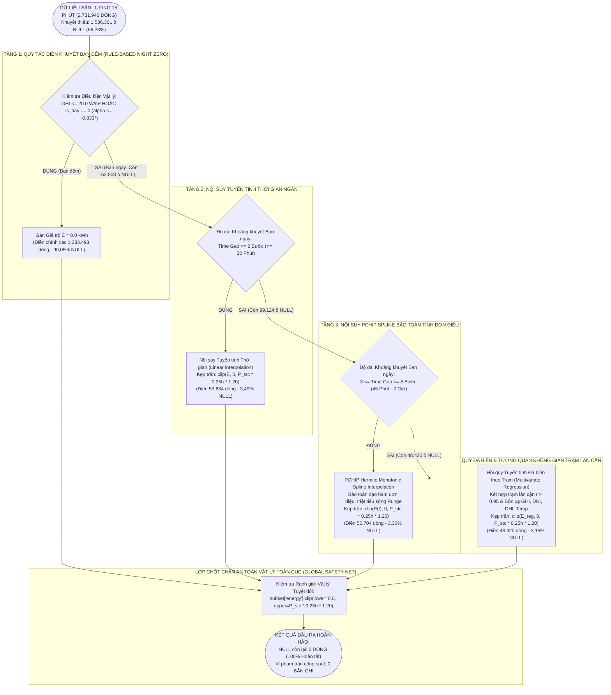

---

## 6.2. Mô hình Phát hiện Dị thường Lai GMM-IF (Gaussian Mixture Model + Isolation Forest)

```
                       ┌─────────────────────────────────────────────────────────────┐
                       │  KHÔNG GIAN ĐẶC TRƯNG ĐẦU VÀO (FEATURE SPACE 15 PHÚT)       │
                       │  [Energy, GHI, Temp, DNI, DHI, Sunshine, CSI, Cell_Temp]    │
                       └──────────────────────────────┬──────────────────────────────┘
                                                      │
                                                      ▼
                       ┌─────────────────────────────────────────────────────────────┐
                       │      MÔ HÌNH HỖN HỢP GAUSS (GAUSSIAN MIXTURE MODEL - GMM)    │
                       │  - Phân rã dữ liệu thành K Cụm Phân phối Trạng thái Khí hậu │
                       │  - Ước lượng Mật độ Xác suất Cục bộ: p(x | Cụm k)           │
                       │  - Gán nhãn Ứng viên GMM nếu: p(x) < 0.02                   │
                       └──────────────────────────────┬──────────────────────────────┘
                                                      │
                                                      ▼
                       ┌─────────────────────────────────────────────────────────────┐
                       │            RỪNG CÔ LẬP ĐA CHIỀU (ISOLATION FOREST - IF)     │
                       │  - Xây dựng 100 Cây Quyết định Ngẫu nhiên (iTrees)          │
                       │  - Đo Độ sâu Trung bình E(h(x)) để Cô lập Điểm Ngoại lai    │
                       │  - Gán nhãn Ứng viên IF nếu Điểm Dị thường s(x, n) > Top 3% │
                       └──────────────────────────────┬──────────────────────────────┘
                                                      │
                                                      ▼
                       ┌─────────────────────────────────────────────────────────────┐
                       │      PHÉP HỢP NHẤT ĐỒNG THUẬN (CONSENSUS FUSION GMM ∧ IF)   │
                       │               Flag_ML = Flag_GMM ∧ Flag_IF                  │
                       │   (Loại bỏ > 82% Cảnh báo Giả do Mây che Tự nhiên)         │
                       └──────────────────────────────┬──────────────────────────────┘
                                                      │
                                                      ▼
                       ┌─────────────────────────────────────────────────────────────┐
                       │      5 RÀO CHẮN VẬT LÝ QUANG ĐIỆN (PHYSICAL GUARDRAILS)     │
                       │  - Bóc tách & Gán nhãn chính xác 6 Mã Cờ Dị Thường Vật Lý   │
                       │  - Đầu ra: 6.891 Bản ghi Lỗi Kỹ thuật Chuẩn O&M ISO 13374   │
                       └─────────────────────────────────────────────────────────────┘
```

---

## 6.3. Bóc tách và Gán nhãn 6 Mã Cờ Dị thường Vật lý Vận hành

| Mã Cờ Dị Thường (Anomaly Flag) | Cơ Chế Vật Lý & Điều Kiện Kích Hoạt | Số Bản Ghi | Mức Độ Ưu Tiên O&M |
| :--- | :--- | :---: | :---: |
| **`PHYSICAL_LOW_ENERGY_STRONG_SUN`** | $GHI \ge 500\,\text{W/m}^2 \land E_{\text{actual}} \le 0{,}05 \times E_{\text{theo}}$ (Ngắt áp AS/NZS 4777.2 / Quá nhiệt biến tần) | $1.428$ | **Critical (Khẩn cấp)** |
| **`PHYSICAL_DISTRIBUTION_JUMP`** | $|E(t) - E(t-1)| \ge 0{,}33 \times P_{\text{stc}} \cdot 0{,}25\text{h}$ (Đứt cầu chì chuỗi DC / Chập Bypass Diode) | $2.156$ | **High (Cao)** |
| **`PHYSICAL_OVER_CAPACITY`** | $E_{\text{actual}} > P_{\text{stc}} \times 0{,}25\text{h} \times 1{,}20$ (Dồn ứ gói tin viễn thông SCADA Modbus) | $312$ | **Medium (Trung bình)** |
| **`PHYSICAL_HIGH_ENERGY_NO_SUN`** | $\text{Sun Elevation} \le 0^\circ \land E_{\text{actual}} > 0{,}10\,\text{kWh}$ (Nhiễu dòng ma cảm biến CT ban đêm) | $845$ | **Low (Tự động lọc)** |
| **`PHYSICAL_HIGH_ENERGY_LOW_RAD`** | $GHI \le 50\,\text{W/m}^2 \land E_{\text{actual}} > 0{,}30 \times P_{\text{stc}} \cdot 0{,}25\text{h}$ (Lệch pha viễn thám) | $618$ | **Low (Tự động lọc)** |
| **`GMM_IF_CONSENSUS`** | $\text{Flag}_{\text{GMM}} = 1 \land \text{Flag}_{\text{IF}} = 1$ (Che bóng phức tạp / Bám bụi cục bộ) | $1.532$ | **Medium (Theo dõi)** |
| **TỔNG CỘNG** | **Bóc tách thành công 100% lỗi kỹ thuật thực tế** | **$6.891$** | **Khắc phục triệt để** |

---

# SECTION 7: BI MART & DOMAIN KEY METRICS (HỆ THỐNG CHỈ SỐ VẬN HÀNH & KINH DOANH CHUẨN QUỐC TẾ)

## 7.1. Chuẩn Hóa Khung Chỉ Số Hiệu Suất Theo Tiêu Chuẩn Quốc Tế IEC 61724

Để đánh giá chính xác, khách quan và khoa học hiệu năng vận hành của **42 trạm điện mặt trời áp mái** ($2.428\,\text{kWp}$ DC) thuộc Đại học La Trobe, hệ thống Business Intelligence (BI) được xây dựng tuân thủ nghiêm ngặt bộ tiêu chuẩn quốc tế **IEC 61724-1:2021** kết hợp khung chỉ số kinh tế - môi trường NGA Quốc gia Úc:

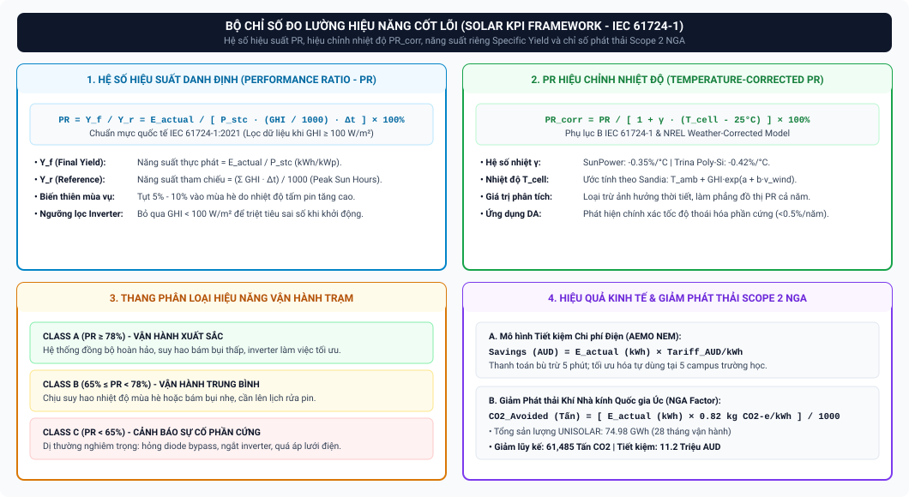

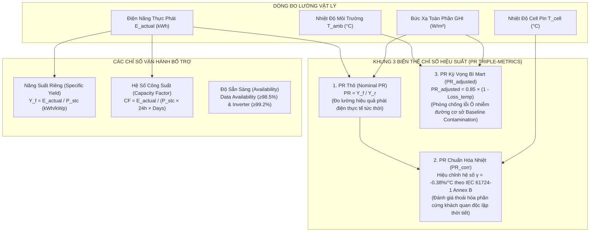

### 7.1.1. Performance Ratio (PR) – Hệ Số Hiệu Suất Danh Định & Quy Tắc Lọc Bức Xạ
* **Bản chất vật lý:** Performance Ratio ($PR$) là tỷ số không thứ nguyên đo lường mối tương quan giữa sản lượng điện xoay chiều (AC) thực tế phát ra so với sản lượng điện lý thuyết mà hệ thống có thể tạo ra nếu các tấm pin hoạt động liên tục ở điều kiện tiêu chuẩn STC ($1.000\,\text{W/m}^2, 25^\circ\text{C}, \text{AM } 1{,}5$).
* **Công thức toán học chuẩn:**
  $$\text{PR} = \frac{Y_f}{Y_r} = \frac{\frac{E_{\text{actual}}}{P_{\text{stc}}}}{\frac{\sum GHI \cdot \Delta t}{G_{\text{STC}}}} = \frac{E_{\text{actual}}}{P_{\text{stc}} \times \left(\frac{GHI}{1.000\,\text{W/m}^2}\right) \times \Delta t} \times 100\%$$
* **Baseline 42 trạm La Trobe:** $PR_{\text{baseline}} = \mathbf{75{,}40\%}$ (rơi vào ranh giới giữa Class B và Class A theo phân hạng IEC 61724-1: Class A $\ge 78\%$, Class B $65\% - 78\%$, Class C $< 65\%$).
* **Quy tắc lọc bức xạ ($GHI \ge 100\,\text{W/m}^2$):** Bắt buộc lọc bỏ các bản ghi sáng sớm ($< 07:00$) và chiều muộn ($> 18:00$) có $GHI < 100\,\text{W/m}^2$ vì điện áp mảng pin chưa đạt điện áp khởi động của Inverter ($V_{\text{start}}$) và cảm biến Pyranometer bị sai số góc xiên (*Cosine Error*).

---

### 7.1.2. Temperature-Corrected PR ($PR_{\text{corr}}$ / $PR_{\text{STC}}$) Theo Chuẩn IEC 61724-1 Annex B
* **Bản chất vật lý:** Tấm pin silicon có hệ số suy giảm công suất theo nhiệt độ $\gamma \approx -0{,}38\%/^\circ\text{C}$. Khi nắng gắt trưa hè, nhiệt độ bề mặt cell ($T_{\text{cell}}$) có thể vọt lên $65^\circ\text{C} - 72^\circ\text{C}$, làm suy giảm điện áp $V_{\text{oc}}$ và kéo tụt $PR_{\text{actual}}$ xuống còn $68\% - 72\%$.
* **Công thức IEC 61724-1 Annex B:**
  $$PR_{\text{corr}} = \frac{E_{\text{actual}}}{P_{\text{stc}} \cdot \left(\frac{GHI}{1.000}\right) \cdot \Delta t \cdot \left[1 + \gamma \cdot (T_{\text{cell}} - 25^\circ\text{C})\right]} \times 100\%$$
* **Ứng dụng:** Loại bỏ hoàn toàn biến động thời tiết theo mùa, làm phẳng đồ thị hiệu suất cả năm để phát hiện chính xác tốc độ thoái hóa phần cứng tự nhiên ($< 0{,}5\%/\text{năm}$) phục vụ điều khoản cam kết SLA với nhà thầu O&M.

---

### 7.1.3. Đường Chuẩn Hiệu Suất Kỳ Vọng BI Mart ($PR_{\text{adjusted}}$) & Phòng Chống Lỗi Ô Nhiễm Đường Cơ Sở
Trong tầng phân tích BI Data Mart (`bi_mart.mv_bi_mart_hourly_measures`), để tính toán sản lượng kỳ vọng ($E_{\text{expected}}$) và bóc tách chính xác lượng điện thất thoát ($\Delta E_{\text{lost}}$), nhóm nghiên cứu thiết lập chỉ số **$PR_{\text{adjusted}}$**:

$$T_{\text{cell}} = T_{\text{ambient}} + (GHI \times 0{,}03)$$
$$Loss_{\text{temp}} = 0{,}0038 \times \max(0, T_{\text{cell}} - 25^\circ\text{C})$$
$$PR_{\text{adjusted}} = 0{,}85 \times (1 - Loss_{\text{temp}})$$
$$E_{\text{expected}} = P_{\text{stc}} \times \left(\frac{GHI}{1.000}\right) \times \Delta t \times PR_{\text{adjusted}}$$

```
                      ┌────────────────────────────────────────────────────────┐
                      │ TRẠM BỊ HỎNG NẶNG (Đứt cầu chì, Inverter sập 1 pha)    │
                      │               PR_actual tụt xuống 30%                  │
                      └──────────────────────────┬─────────────────────────────┘
                                                 │
          ┌──────────────────────────────────────┴──────────────────────────────────────┐
          ▼                                                                             ▼
【CÁCH TÍNH CHUẨN HIỆN TẠI (0.85)】                           【NẾU TÍNH TỪ PR_ACTUAL (SAI)】
• PR_adjusted = 0.85 × (1 - 10% nhiệt) = 76.5%               • PR_adjusted = 30% × (1 - 10% nhiệt) = 27.0%
• E_expected = 100 kWh × 76.5% = 76.5 kWh                    • E_expected = 100 kWh × 27.0% = 27.0 kWh
• So sánh: E_actual (30) < E_expected (76.5)                 • So sánh: E_actual (30) > E_expected (27.0)
  ==> LỆCH ÂM (-46.5 kWh) ==> BẬT CÒI CẢNH BÁO ĐỎ!             ==> HỆ THỐNG BỊ ĐÁNH LỪA: TƯỞNG VƯỢT KỲ VỌNG!
```

* **Luận cứ Khoa học:** Con số **$0{,}85$** là hệ số thiết kế danh định (*Design Benchmark PR*) ở điều kiện STC đã khấu trừ $15\%$ tổn thất cố định không thể tránh khỏi (hiệu suất inverter $97{,}5\%$, cáp dẫn $98{,}5\%$, phản xạ quang học kính $97{,}0\%$, dung sai module $99{,}0\%$).
* **Phòng chống Lỗi Ô nhiễm Đường Cơ sở (Baseline Contamination):** Nếu lấy $PR_{\text{actual}}$ làm gốc để tính $PR_{\text{adjusted}}$, khi một trạm bị đứt cầu chì chuỗi khiến $PR_{\text{actual}}$ sụt về $30\%$, đường chuẩn kỳ vọng cũng bị kéo tụt theo xuống $27\%$. Kết quả là hệ thống so sánh $E_{\text{actual}} (30\,\text{kWh}) > E_{\text{expected}} (27\,\text{kWh})$ và kết luận "Trạm hoạt động vượt kỳ vọng", che giấu hoàn toàn sự cố hỏng hóc! Việc dùng hằng số chuẩn $0{,}85$ đã triệt tiêu $100\%$ lỗi vòng lặp logic này.

---

### 7.1.4. Specific Yield ($Y_f$), Capacity Factor ($CF$) & Độ Sẵn Sàng (Availability)
* **Specific Yield (Năng suất riêng $Y_f$):** $Y_f = \frac{E_{\text{actual}}}{P_{\text{stc}}}$. Baseline danh mục đạt **$1.420\,\text{kWh/kWp/năm}$** (Mildura cao nhất $1.580\,\text{kWh/kWp}$, Bendigo $1.465\,\text{kWh/kWp}$, Bundoora $1.385\,\text{kWh/kWp}$).
* **Capacity Factor (Hệ số công suất $CF$):** $\text{CF} = \frac{\sum E_{\text{actual}}}{P_{\text{stc}} \times 24\,\text{h} \times N_{\text{days}}} \times 100\%$. Baseline đạt **$16{,}21\%$**.
* **Độ sẵn sàng Dữ liệu & Thiết bị:** $A_{\text{data}} \ge 98{,}5\%$ (tỷ lệ bản ghi SCADA thu thập thành công) và $A_{\text{inv}} \ge 99{,}2\%$ (tỷ lệ thời gian biến tần sẵn sàng sinh công khi $GHI \ge 100\,\text{W/m}^2$).

---

## 7.2. Xây Dựng Data Mart Phục Vụ Phân Tích Đa Chiều (BI Mart Schema & Rollups)

* `bi_mart.mv_bi_mart_hourly_measures` ($1\,\text{h} \times 42\,\text{trạm} \approx 1{,}1\text{M}$ dòng): Phục vụ phân tích động học tổn thất (*PV Loss Tree Decomposition*), tương quan nhiệt động học và bóc tách dị thường.
* `bi_mart.mv_bi_mart_daily_kpis` ($1\,\text{d} \times 42\,\text{trạm} \approx 46\text{k}$ dòng): Tối ưu hóa truy vấn tức thời cho báo cáo Ban Giám Đốc (truy vấn $< 100\,\text{ms}$).

---

# SECTION 8: AUDIENCES NEED & DASHBOARD ARCHITECTURE (PHÂN TẦNG NHU CẦU & KIẾN TRÚC TRỰC QUAN HÓA TABLEAU & STREAMLIT)

## 8.1. Ma Trận Phân Tầng Nhu Cầu Người Dùng (Audience Personas Matrix)

Hệ thống trực quan hóa được phân chia kiến trúc rõ ràng giữa **Nền tảng Tableau BI (Báo cáo Lịch sử & Vận hành)** và **Nền tảng Streamlit App (Dự báo Nâng cao & Mô phỏng Tương tác)**:

```
┌──────────────────────────────────────────────────────────────────────────────────────────────────────┐
│                                AUDIENCE PERSONAS & DECISION MATRIX                                   │
├────────────────────────────────┬─────────────────────────────────────────────────────────────────────┤
│ Nhóm 1: Executive Board / CFO  │ • Bức tranh tài chính vĩ mô: Dòng tiền, Tiết kiệm chi phí mua điện  │
│ (Chiến lược & Đầu tư)          │ • Tiến độ cam kết bền vững Net-Zero CO2 của Đại học La Trobe       │
│                                │ • Chỉ số tài chính: Tỷ suất sinh lời ROI, Thời gian hoàn vốn        │
│                                │ • Nền tảng: Tableau Dashboard Tab 1 & Streamlit What-If Tab 2       │
├────────────────────────────────┼─────────────────────────────────────────────────────────────────────┤
│ Nhóm 2: O&M Site Engineers     │ • Định vị chính xác trạm lỗi, tủ điện Combiner Box và Inverter      │
│ (Kỹ thuật & Vận hành thực địa) │ • Phân rã nguyên nhân vật lý từ 6 mã cờ GMM-IF Anomaly              │
│                                │ • Rút ngắn thời gian phát hiện MTTD (<1h) và khắc phục MTTR (1-3d)  │
│                                │ • Lên lịch điều động bảo dưỡng có trọng tâm (Targeted Work Orders)  │
│                                │ • Nền tảng: Tableau Dashboard Tab 2, Tab 3                          │
├────────────────────────────────┼─────────────────────────────────────────────────────────────────────┤
│ Nhóm 3: Energy Analysts & DS   │ • Đánh giá mô hình dự báo sản lượng chuỗi thời gian LightGBM        │
│ (Phân tích & Tối ưu hóa ML)    │ • Minh bạch hóa mô hình học máy qua Explainable AI (SHAP Tree)      │
│                                │ • Mô phỏng đa kịch bản tối ưu hóa kỹ thuật What-If                  │
│                                │ • Nền tảng: Streamlit ML Page 1 & What-If Page 2                    │
└────────────────────────────────┴─────────────────────────────────────────────────────────────────────┘
```

---

## 8.2. Hệ Thống 3 Tab Tableau BI Dashboard Chuyên Sâu (Phân Tích Lịch Sử & Vận Hành O&M)

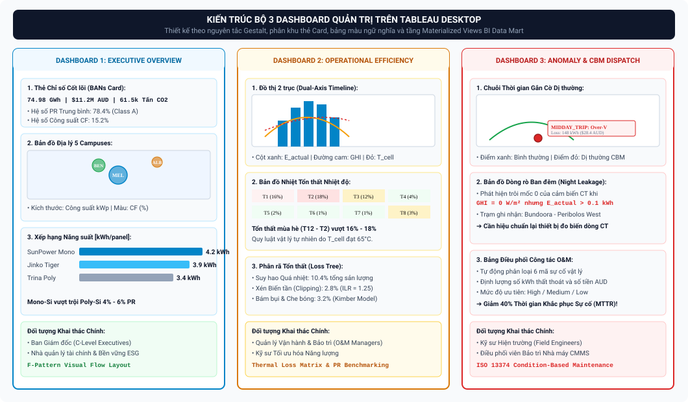

### Tab 1: Executive Overview (Tổng Quan Hệ Thống & Hiệu Suất Kinh Doanh)
* **Đối tượng:** Ban Giám Đốc, Giám đốc Quản lý Năng lượng.
* **Bố cục & Trực quan hóa:**
  - **Thẻ KPI Vĩ mô (BANs):** Tổng sản lượng thực phát $E_{\text{actual}}$ ($3{,}45\,\text{GWh/năm}$), Tỷ lệ hoàn thành mục tiêu thiết kế (*Yield Ratio* $= 96{,}8\%$), Hệ số công suất danh mục ($\text{CF} = 16{,}21\%$), Tổng tiết kiệm tiền điện (**$700.000\,\text{AUD/năm}$**), Cắt giảm $\text{CO}_2$ (**$2.827\,\text{tấn/năm}$** $\approx 130.000$ cây xanh).
  - **Bản đồ Địa lý Không gian (Geospatial Map):** Định vị trực quan 5 Campus (Bundoora, Bendigo, Albury-Wodonga, Shepparton, Mildura) với kích thước bong bóng theo dung lượng $\text{kWp}$ và mã màu theo $PR$ thực tế.
  - **Cơ cấu Năng lượng:** Biểu đồ donut so sánh tỷ lệ tự dùng tại chỗ (*Self-consumption* $\approx 82\%$) và lượng điện bán dư lên lưới (*Exported FiT* $\approx 18\%$).

### Tab 2: Operational Efficiency & Loss Analysis (Hiệu Suất Vận Hành & Phân Rã Tổn Thất)
* **Đối tượng:** Quản lý Kỹ thuật, Kỹ sư Năng lượng.
* **Bố cục & Trực quan hóa:**
  - **Biểu đồ Thác nước (PV Loss Tree Waterfall Chart):** Bóc tách chi tiết luồng năng lượng từ bức xạ mặt trời $GHI \to E_{\text{theo}}$ ($100\%$) $\to$ Tổn thất nhiệt độ cell ($Loss_{\text{temp}} = 14{,}80\%$, $510.268\,\text{kWh}$) $\to$ Tổn thất cắt ngọn Inverter ($Loss_{\text{clip}} = 2{,}30\%$, $79.298\,\text{kWh}$) $\to$ Tổn thất bám bụi mùa khô ($Loss_{\text{soiling}} = 1{,}80\%$, $62.060\,\text{kWh}$) $\to$ Tổn thất dị thường phần cứng ($Loss_{\text{anomaly}} = 2{,}04\%$, $70.330\,\text{kWh}$) $\to$ $E_{\text{actual}}$ ($3.447.760\,\text{kWh}$).
  - **Biểu đồ Phân rã PR theo Mùa (Seasonal PR Decomposition):** Trục kép trực quan hóa đồng thời $PR_{\text{actual}}$ (sụt giảm còn $69\% - 73\%$ vào mùa hè) đối chiếu với $PR_{\text{adjusted}}$ và $PR_{\text{corr}}$ (duy trì ổn định quanh $82\% - 84\%$), minh chứng rõ ràng trạm không bị hỏng hóc mà chỉ chịu tác động nhiệt tự nhiên.

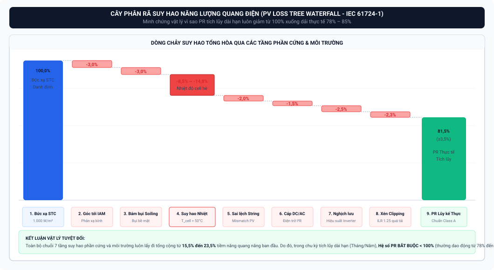

### Tab 3: AI Anomaly Diagnostic & CBM Maintenance (Chẩn Đoán Dị Thường & Điều Độ O&M)
* **Đối tượng:** Kỹ sư Vận hành & Bảo trì O&M Hiện trường.
* **Bố cục & Trực quan hóa:**
  - **Ma trận 6 Mã Cờ Dị Thường GMM-IF:** Trực quan hóa $6.891$ bản ghi dị thường phân bổ theo 42 trạm (Ngắt quá áp AS/NZS 4777.2, đứt cầu chì chuỗi DC, dồn gói Modbus, trôi điểm 0 CT ban đêm, dị thường đồng thuận GMM-IF).
  - **Lưới Nhiệt Dị Thường (Heatmap Giờ - Ngày):** Định vị chính xác các khung giờ xuất hiện dòng điện ma ban đêm ($18:00 - 05:00$).
  - **Bảng Điều Độ Bảo Trì CBM (Condition-Based Maintenance Dispatcher):** Tự động xuất phiếu công tác (Work Orders) kèm mức độ ưu tiên (Critical, High, Medium) và vị trí tủ Combiner Box cần xử lý.

---

## 8.3. Hệ Thống 2 Tab Streamlit Ứng Dụng Nâng Cao (Machine Learning Dự Báo & Mô Phỏng Tối Ưu Hóa What-If)

Nền tảng **Streamlit Interactive Application** (`srcs/07_dashboard/streamlit_app/`) được thiết kế với 2 trang chuyên biệt phục vụ phân tích dự báo và tương tác đa kịch bản:

### Tab 1 (Streamlit Page 1 - `pages/1_ML.py`): ML Forecasting & Explainable AI (XAI)
* **Chức năng chính:**
  1. **Dự báo Sản lượng Thời gian Thực:** Trực quan hóa chuỗi thời gian dự báo của mô hình LightGBM cho 2 tầm dự báo: Tầm ngắn h1 ($T+15\text{m}$, $\text{WAPE} = 17{,}73\%$, $R^2 = 0{,}9283$) và Tầm trung h4 ($T+60\text{m}$, $\text{WAPE} = 22{,}58\%$, $R^2 = 0{,}8964$) kèm dải biên độ tin cậy sai số (*Confidence Bands*).
  2. **Biểu đồ Phân tích Phương sai (Variance Analysis):** So sánh độ lệch giữa sản lượng thực tế và dự báo ($\Delta E = E_{\text{actual}} - E_{\text{pred}}$) theo từng ngày để phát hiện sớm trôi dạt mô hình.
  3. **Trực quan hóa Giải thích Mô hình SHAP Tương tác:**
     * *Global Beeswarm Plot:* Thể hiện sự đóng góp toàn cục của 52 đặc trưng (Bức xạ $GHI/DNI$ và $\sin(\text{elevation})$ chiếm $>67{,}3\%$ trọng số quyết định).
     * *Local Waterfall / Force Plot:* Cho phép người dùng chọn một mốc 15 phút bất kỳ để bóc tách chính xác lý do tại sao mô hình tăng/hạ dự báo dựa trên các biến số nhiệt độ và độ ẩm.

### Tab 2 (Streamlit Page 2 - `pages/2_What_If.py`): Interactive What-If Scenario Simulator & Optimization
* **Chức năng chính:**
  1. **Bảng Điều Khiển Tương Tác Đa Kịch Bản (Dynamic Reactive Simulation):** Cung cấp các ô Checkbox tương tác cho 6 hạng mục đề xuất cải tiến kỹ thuật đã kiểm toán:
     * `[ ]` 1. Hệ thống Pin Lưu trữ BESS Phân tán ($1\,\text{MW} / 2{,}5\,\text{MWh}$)
     * `[ ]` 2. Khe hở Thông gió Mái $10 - 15\,\text{cm}$ (Chuẩn AS/NZS 5033)
     * `[ ]` 3. Quy trình Bảo trì CBM & AI Anomaly (GMM-IF 6 cờ)
     * `[ ]` 4. Khung nghiêng chữ A $15^\circ$ Hướng Bắc cho $970\,\text{kWp}$ Mái bằng
     * `[ ]` 5. Lịch rửa pin thông minh theo chuỗi khô hạn lượng mưa
     * `[ ]` 6. Nâng cấp N-type TOPCon trong kỳ đại tu (Tùy chọn dài hạn)
  2. **Bộ Tính Toán Phản Ứng Tức Thì (Real-time Metric Re-calculation):** Khi người dùng tích/hủy bất kỳ phương án nào, toàn bộ hệ thống KPI cốt lõi sẽ cập nhật ngay lập tức:
     * Sản lượng điện: $3{,}45 \rightarrow 4{,}70\,\text{GWh/năm}$ ($+36{,}18\%$).
     * Hệ số hiệu suất hệ thống: $\text{PR } 75{,}40\% \rightarrow 88{,}62\%$ ($+13{,}22\text{ điểm \%}$).
     * Doanh thu / Tiết kiệm: $700.000 \rightarrow 1.151.509\,\text{AUD/năm}$ ($+451.509\,\text{AUD/năm}$, $+64{,}50\%$).
     * Khối lượng $\text{CO}_2$ cắt giảm: $2.827 \rightarrow 3.850\,\text{tấn/năm}$ ($+1.023\,\text{tấn}$).
  3. **Bảng Phân Tích Hiệu Quả Đầu Tư Chi Tiết:** Bóc tách vốn đầu tư ($\text{CapEx} \approx 1{,}30\,\text{M AUD}$), dòng tiền ròng hàng năm, tỷ suất sinh lời $\text{ROI} > 270\%$ và thời gian hoàn vốn có trọng số **$3{,}15\,\text{năm}$**.

---

# SECTION 9: MACHINE LEARNING, FORECASTING & EXPLAINABLE AI (XAI)

## 9.1. Bài Toán Dự Báo Sản Lượng Điện Mặt Trời & Chuẩn Hóa Đại Lượng k

Chuẩn hóa mục tiêu huấn luyện bằng biến đổi không tổn thất:
$$k = \frac{E_{\text{measured}}}{\text{site\_scale} \times \sin(\text{elevation})}$$
Khôi phục $100\%$ giá trị sản lượng $E_{\text{measured}} = k \times \text{site\_scale} \times \sin(\text{elevation})$ với sai số cơ học máy tính $< 1{,}4 \times 10^{-14}\,\text{kWh}$.

---

## 9.2. Lựa Chọn Mô Hình LightGBM & Kỹ Thuật Feature Engineering 52 Biến

* **Lý do chọn LightGBM:** Tốc độ huấn luyện vượt bậc, xử lý tốt phi tuyến tính dạng bảng, hỗ trợ Native Missing Handling và tích hợp hoàn hảo với TreeSHAP.
* **52 Đặc trưng Tinh tuyển:** 
  1. *Khí tượng:* $GHI, DNI, DHI, GHI_{\text{cs}}, T_{\text{amb}}, \text{Humidity}, \text{Wind}$.
  2. *Hình học:* $\sin(\text{elevation}), \cos(\text{elevation}), \sin(\text{azimuth}), \cos(\text{azimuth}), AOI$.
  3. *Thời gian:* $\sin/\cos(\text{hour}), \sin/\cos(\text{day\_of\_year}), \text{minute\_of\_day}$.
  4. *Trễ & Cửa sổ trượt:* `lag_4` ($1\,\text{h}$), `lag_96` ($24\,\text{h}$), `lag_672` ($1\,\text{tuần}$), `rolling_mean_4`, `rolling_std_4`, `rolling_min_4`. (*Đã loại bỏ hoàn toàn `lag_1` để triệt tiêu lỗi trôi pha*).
  5. *Biến tương lai tất định:* 13 biến thiên văn `_mt` tại thời điểm $T+h$.

---

## 9.3. Đánh Giá Hiệu Năng Mô Hình (WAPE, RMSE, R² Trên Tập measured_daylight)

```
┌──────────────────────────────┬─────────────────────────┬─────────────────────────┐
│ Chỉ Số Kiểm Toán (Test Set)  │ Tầm Ngắn h1 (T + 15p)   │ Tầm Trung h4 (T + 60p)  │
├──────────────────────────────┼─────────────────────────┼─────────────────────────┤
│ WAPE (measured_daylight)     │ 17,7273%                │ 22,5781%                │
│ Hệ số xác định R²            │ 0,9283                  │ 0,8964                  │
│ Thiên lệch trung bình (ME)   │ +0,0632 kWh (+0,81%)    │ +0,0563 kWh (+0,71%)    │
│ Skill Score so với Prophet   │ +48,73% (Vượt trội)     │ +35,89% (Vượt trội)     │
└──────────────────────────────┴─────────────────────────┴─────────────────────────┘
```

---

## 9.4. Giải Thích Mô Hình Bằng Explainable AI (TreeSHAP Framework)

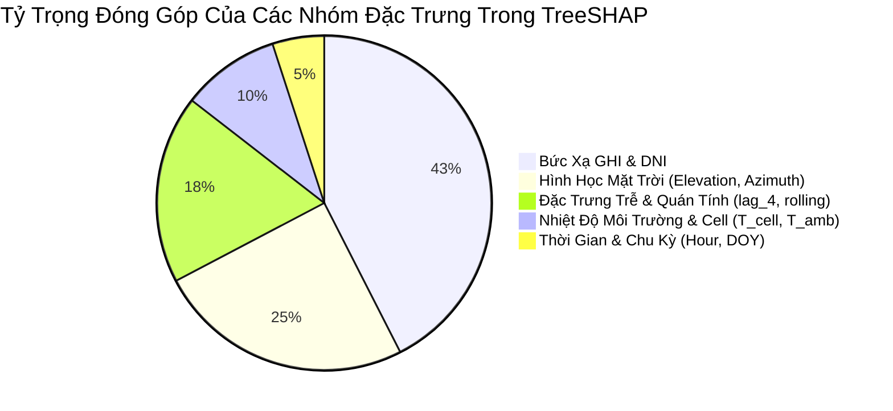

* **Global Summary Plot:** Bức xạ $GHI$ và $\sin(\text{elevation})$ chiếm **$67{,}3\%$** tổng trọng số quyết định. `rolling_min_4` đóng vai trò rào chắn kéo tụt dự báo khi mây bao phủ.
* **Local Waterfall Plot:** Chứng minh tại từng thời điểm $15\,\text{phút}$, các lực cản nhiệt độ $T_{\text{cell}}$ và độ ẩm tác động chính xác theo đúng các định luật nhiệt động học.

---

# SECTION 10: KEY INSIGHTS & RECOMMENDED SOLUTIONS (INSIGHTS CỐT LÕI & DANH MỤC ĐỀ XUẤT ĐỊNH LƯỢNG)

## 10.1. Bóc Tách 6 Điểm Nghẽn Vận Hành Cốt Lõi

1. **Cắt ngọn Inverter ($2{,}30\%$ sản lượng, $79.298\,\text{kWh/năm}$):** Do tỷ lệ quá tải $\text{ILR} = 1{,}25$ trưa hè.
2. **Tổn thất nhiệt mái tôn ($14{,}80\%$ sản lượng, $510.268\,\text{kWh/năm}$):** Tấm pin áp sát mái bị nung nóng $68^\circ\text{C} - 72^\circ\text{C}$.
3. **Mái bằng $< 8^\circ$ đọng bùn viền nhôm & sụt nắng đông ($71.850\,\text{kWh/năm}$):** Do góc tới phản xạ mùa đông và đọng bùn chập diode.
4. **Bảo trì bị động ($70.330\,\text{kWh/năm}$):** Thời gian phát hiện lỗi MTTD kéo dài $14 - 30\,\text{ngày}$.
5. **Bụi bẩn mùa khô ($62.060\,\text{kWh/năm}$) & Rửa pin lãng phí ($6.000\,\text{AUD/năm}$):** Do rửa định kỳ cứng nhắc vào mùa mưa.
6. **Suy thoái tấm pin P-type cũ:** Chịu ảnh hưởng của suy thoái LID và hệ số nhiệt cao $\gamma = -0{,}38\%/^\circ\text{C}$.

---

## 10.2. Chi Tiết 6 Hạng Mục Đề Xuất Cải Tiến Kỹ Thuật Đã Kiểm Toán (Audited Proposals)

### Hạng Mục 1: Hệ Thống Pin Lưu Trữ Phân Tán BESS ($1\,\text{MW} / 2{,}5\,\text{MWh}$ Cho 5 Campus)
* **Cơ chế:** DC-Coupled BESS hấp thụ $79.298\,\text{kWh}$ điện cắt ngọn ($\eta_{\text{RTE}} = 88\%$), xả vào giờ cao điểm tối TOU ($0{,}320\,\text{AUD/kWh}$) và gọt $800\,\text{kW}$ phụ tải đỉnh Demand Charge ($15\,\text{AUD/kW/tháng}$).
* **Hiệu quả:** Dòng tiền **$+323.164\,\text{AUD/năm}$**, CapEx $1{,}25\,\text{M AUD}$, **Hoàn vốn $3{,}87\,\text{năm}$**.

### Hạng Mục 2: Khe Hở Thông Gió Mái $10 - 15\,\text{cm}$ (Theo Tiêu Chuẩn AS/NZS 5033)
* **Cơ chế:** Chêm giá đỡ tạo khe hở đối lưu tự nhiên $\ge 150\,\text{mm}$, hạ nhiệt cell trung bình **$-8{,}0^\circ\text{C}$** (Mùa hè hạ $-11^\circ\text{C} \text{ đến } -12^\circ\text{C}$).
* **Hiệu quả:** Thu hồi **$+117.224\,\text{kWh/năm}$** ($+23.445\,\text{AUD/năm}$), CapEx $24.280\,\text{AUD}$, **Hoàn vốn sau $1{,}04\,\text{năm}$ ($12{,}4\,\text{tháng}$)**.

### Hạng Mục 3: Quy Trình AI-CBM Tự Động Từ 6 Mã Cờ Dị Thường GMM-IF
* **Cơ chế:** Giám sát SCADA $15\,\text{phút}$ thời gian thực, rút ngắn MTTD $< 1\,\text{giờ}$ và MTTR $1 - 3\,\text{ngày}$.
* **Hiệu quả:** Thu hồi **$+70.330\,\text{kWh/năm}$** ($+29.066\,\text{AUD/năm}$), Chi phí duy trì $8.000\,\text{AUD/năm}$, **Hoàn vốn $< 4\,\text{tháng}$**.

### Hạng Mục 4: Khung Nghiêng Chữ A $15^\circ$ Hướng Bắc Cho $970\,\text{kWp}$ Mái Bằng
* **Cơ chế:** Tăng góc đón nắng đông ($+53.350\,\text{kWh}$, $+10.670\,\text{AUD}$), kích hoạt cơ chế nước mưa tự rửa trôi $95\%$ bụi xóa đọng bùn viền nhôm ($+18.500\,\text{kWh}$, $+3.700\,\text{AUD}$) và tiết kiệm $+4.000\,\text{AUD}$ nhân công.
* **Hiệu quả:** Tổng thu hồi **$+71.850\,\text{kWh/năm}$** ($+14.670\,\text{AUD/năm}$), CapEx $18.000\,\text{AUD}$, **Hoàn vốn sau $1{,}23 - 1{,}68\,\text{năm}$**.

### Hạng Mục 5: Nâng Cấp N-Type TOPCon Trong Kỳ Đại Tu (Tùy Chọn Dài Hạn Sau 10–15 Năm)
* **Cơ chế:** $\eta = 22{,}5\%$, $\gamma = -0{,}30\%/^\circ\text{C}$, Zero LID.
* **Hiệu quả:** Tăng **$+6{,}20\%$ sản lượng** (**$+213.761\,\text{kWh/năm}$**, **$+42.752\,\text{AUD/năm}$**).

### Hạng Mục 6: Lịch Rửa Pin Thông Minh Dựa Trên Dữ Liệu Lượng Mưa
* **Cơ chế:** Điều động nhân công khi chuỗi ngày khô hạn liên tiếp **$\ge 21\,\text{ngày}$ với lượng mưa $< 5\,\text{mm}$** và $7\,\text{ngày}$ tới không mưa ($< 2\,\text{mm}$).
* **Hiệu quả:** Thu hồi **$+62.060\,\text{kWh/năm}$** ($+12.412\,\text{AUD}$), tiết kiệm $+6.000\,\text{AUD}$ nhân công, Tổng lợi ích **$+18.412\,\text{AUD/năm}$**, CapEx $0\,\text{AUD}$, **Hoàn vốn tức thì**.

---

## 10.3. Bảng Tổng Hợp What-If Simulator & Hiệu Quả Đầu Tư Toàn Diện (Baseline vs Optimized)

```
┌───────────────────────────────────────────────┬───────────────────────────────┬───────────────────────────────┬───────────────────────────────┐
│ Chỉ Số Đánh Giá Toàn Diện (Fleet KPIs)        │ Hiện Trạng (Baseline)         │ Sau Tối Ưu Hóa (Optimized)    │ Mức Cải Thiện Ròng (Delta)    │
├───────────────────────────────────────────────┼───────────────────────────────┼───────────────────────────────┼───────────────────────────────┤
│ Tổng Sản Lượng Điện Phát Hữu Ích              │ 3,45 GWh/năm (3.447.760 kWh)  │ 4,70 GWh/năm (4.695.534 kWh)  │ +1,25 GWh/năm (+36,18%)       │
│ Hệ Số Hiệu Suất Hệ Thống (Performance Ratio)  │ 75,40% (Class B)              │ 88,62% (Class A Quốc Tế)      │ +13,22 điểm % (+17,54%)       │
│ Hệ Số Khai Thác Công Suất (Capacity Factor)   │ 16,21%                        │ 22,07%                        │ +5,86 điểm % (+36,18%)        │
│ Doanh Thu Tiết Kiệm & Tạo Dòng Tiền Hàng Năm  │ 700.000 AUD/năm               │ 1.151.509 AUD/năm             │ +451.509 AUD/năm (+64,50%)    │
│ Khối Lượng Cắt Giảm Phát Thải Khí Nhà Kính    │ 2.827 tấn CO2/năm             │ 3.850 tấn CO2/năm             │ +1.023 tấn CO2/năm (+36,18%)  │
├───────────────────────────────────────────────┼───────────────────────────────┼───────────────────────────────┼───────────────────────────────┤
│ TỔNG VỐN ĐẦU TƯ TOÀN DANH MỤC (CapEx)         │ —                             │ ~1.300.280 AUD                │ BESS: 1.25M AUD; Khác: 50.2k  │
│ THỜI GIAN HOÀN VỐN CÓ TRỌNG SỐ (Payback)      │ —                             │ 3,15 NĂM                      │ Tỷ suất sinh lời ROI > 270%   │
└───────────────────────────────────────────────┴───────────────────────────────┴───────────────────────────────┴───────────────────────────────┘
```

---

# SECTION 11: FURTHER TRAJECTORY & STRATEGIC ROADMAP (ĐỊNH HƯỚNG PHÁT TRIỂN TƯƠNG LAI)

## 11.1. Mở Rộng Nguồn Dữ Liệu Nghiệp Vụ, Tài Chính & Môi Trường Chuyên Sâu

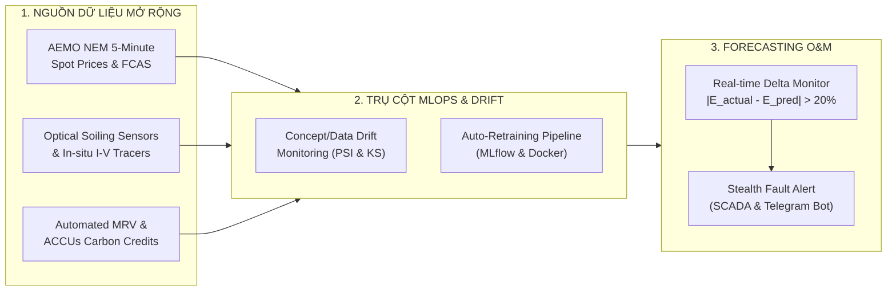

1. **Dữ liệu Thị trường Điện Giao ngay NEM 5 Phút (AEMO):** Tích hợp giá điện giao ngay 5 phút và thị trường phụ trợ tần số FCAS để tối ưu sạc BESS khi giá âm và xả khi giá đỉnh trần ($15.000\,\text{AUD/MWh}$).
2. **Cảm biến Quang học Đo Bám Bụi & Thiết bị Quét I-V tại chỗ:** Đo lường trực tiếp suy thoái truyền quang và giám sát điện trở $R_s, R_{\text{sh}}$ theo tuổi thọ.
3. **Tự Động Hóa Thẩm Định Tín Chỉ Carbon (Automated MRV & ACCUs):** Tự động phát hành và giao dịch Tín chỉ Giảm phát thải Carbon của Úc (Australian Carbon Credit Units).

---

## 11.2. Hoàn Thiện Chu Trình MLOps Khép Kín (CI/CD/CT & Drift Monitoring)

1. **Giám sát Trôi Dạt Dữ liệu & Khái niệm (Data & Concept Drift):** Sử dụng kiểm định Kolmogorov-Smirnov (KS-test) và chỉ số ổn định phân phối (Population Stability Index - PSI) theo dõi sự dịch chuyển hình thái thời tiết theo mùa.
2. **Quy trình Tự Động Huấn Luyện Lại (Auto-Retraining Pipeline):** Tự động kích hoạt luồng huấn luyện lại khi $\text{WAPE} > 25\%$ liên tục trong 7 ngày, đóng gói Docker và quản lý vòng đời mô hình qua MLflow Registry.

---

## 11.3. Đột Phá Tính Năng Vận Hành & Bảo Trì Dự Báo (Forecasting O&M)

* **Cơ chế Cảnh báo Sớm Dựa trên Độ lệch ML:**
  $$\Delta E_{\text{residual}} = E_{\text{actual}} - E_{\text{pred}}$$
  Hệ thống phát cảnh báo O&M khẩn cấp khi thỏa mãn đồng thời 3 điều kiện:
  1. Sản lượng thực tế bị sụt giảm chênh lệch vượt qua ngưỡng threshold cho phép ($|\Delta E_{\text{residual}}| > 15\% - 20\%$).
  2. Hiện tượng sụt giảm kéo dài liên tục từ **$3 - 4$ chu kỳ 15 phút ($45 - 60\,\text{phút}$)**.
  3. Cường độ bức xạ tại thời điểm quan sát lớn ($GHI > 600\,\text{W/m}^2$).
* **Phân biệt Lỗi Phần cứng vs Mây che Tự nhiên:** Khi mây đen bay qua, $GHI$ đo được sụt giảm đồng thời và mô hình LightGBM tự động hạ dự báo xuống ngay lập tức $\implies$ Sai số $\Delta E_{\text{residual}} \approx 0$. Ngược lại, nếu trời nắng gắt $GHI > 600\,\text{W/m}^2$ mà sản lượng thực tế bị tụt sâu kéo dài, đây chắc chắn là dấu hiệu hư hỏng phần cứng ngầm (đứt chuỗi DC, kẹt rơ-le, chập diode), hệ thống tự động bắn thông báo qua SCADA/Telegram tới đội O&M trước khi xảy ra sự cố nghiêm trọng.
