# HỌC PHẦN 1: SOLAR DOMAIN MASTERY FOR DATA ANALYSTS

> **Thời lượng:** 5 Units chuyên sâu  
> **Mục tiêu:** Trang bị cho Data Analyst nền tảng vững chắc về bản chất vật lý, cơ chế quang học khí quyển, hệ thống phân rã suy hao và chuẩn mực đo lường hiệu năng ngành Điện Mặt trời (Solar PV), kết hợp hệ thống trích dẫn học thuật (In-text Academic Citations) theo chuẩn quốc tế.

---

## MỤC LỤC TỔNG QUAN

* [UNIT 1: Cấu trúc Phần cứng và Chuỗi Biến đổi Năng lượng Quang điện (PV Anatomy)](#unit-1-cấu-trúc-phần-cứng-và-chuỗi-biến-đổi-năng-lượng-quang-điện-pv-anatomy)
  * [PHẦN 0: Khái niệm Điện năng Cơ bản dành cho Data Analyst (Electricity 101)](#phần-0-khái-niệm-điện-năng-cơ-bản-dành-cho-data-analyst-electricity-101)
  * [1.1. Bản chất Vật lý Bán dẫn & Hiệu ứng Quang điện](#11-bản-chất-vật-lý-bán-dẫn--hiệu-ứng-quang-điện)
  * [1.2. Phân loại Vật liệu Tế bào Quang điện (Solar Cells)](#12-phân-loại-vật-liệu-tế-bào-quang-điện-solar-cells)
  * [1.3. Cấu trúc Hình học và Tô-pô Hệ thống Trạm (PV Topology)](#13-cấu-trúc-hình-học-và-tô-pô-hệ-thống-trạm-pv-topology)
  * [1.4. Phân loại Biến tần (Inverters) & Bộ tối ưu MPPT](#14-phân-loại-biến-tần-inverters--bộ-tối-ưu-mppt)
  * [1.5. Điều kiện Thử nghiệm Tiêu chuẩn (STC vs NOCT vs NMOT)](#15-điều-kiện-thử-nghiệm-tiêu-chuẩn-stc-vs-noct-vs-nmot)
  * [1.6. Bối cảnh Dữ liệu Thực nghiệm Chi tiết (Dự án UNISOLAR - Đại học La Trobe)](#16-bối-cảnh-dữ-liệu-thực-nghiệm-chi-tiết-dự-án-unisolar---đại-học-la-trobe)
  * [1.7. Bộ Bài tập Vận dụng & Thực hành Chuyên sâu (Unit 1 Homework Assignments)](#17-bộ-bài-tập-vận-dụng--thực-hành-chuyên-sâu-unit-1-homework-assignments)
* [UNIT 2: Khí tượng Viễn thám và Động học Nhật quỹ (Solar Meteorology & Geometry)](#unit-2-khí-tượng-viễn-thám-và-động-học-nhật-quỹ-solar-meteorology--geometry)
  * [2.1. Động học Vị trí Mặt Trời (Thuật toán NREL/NOAA SPA)](#21-động-học-vị-trí-mặt-trời-thuật-toán-nrelnoaa-spa)
  * [2.2. Mã hóa Chu kỳ Lượng giác trong Machine Learning](#22-mã-hóa-chu-kỳ-lượng-giác-trong-machine-learning)
  * [2.3. Các Thành phần Bức xạ Mặt Trời chuẩn WMO](#23-các-thành-phần-bức-xạ-mặt-trời-chuẩn-wmo)
  * [2.4. Mô hình Bức xạ Trời quang (Clear-Sky Models & CSI)](#24-mô-hình-bức-xạ-trời-quang-clear-sky-models--csi)
  * [2.5. Các Biến Khí quyển Tác động từ ERA5-Land Reanalysis](#25-các-biến-khí-quyển-tác-động-từ-era5-land-reanalysis)
  * [2.6. Bộ Bài tập Vận dụng & Thực hành Chuyên sâu (Unit 2 Homework Assignments)](#26-bộ-bài-tập-vận-dụng--thực-hành-chuyên-sâu-unit-2-homework-assignments)
* [UNIT 3: Bộ Chỉ số Đo lường Hiệu năng Cốt lõi (Solar Analytics KPI Framework)](#unit-3-bộ-chỉ-số-đo-lường-hiệu-năng-cốt-lõi-solar-analytics-kpi-framework)
  * [3.1. Hệ số Hiệu suất (Performance Ratio - PR) chuẩn IEC 61724-1](#31-hệ-số-hiệu-suất-performance-ratio---pr-chuẩn-iec-61724-1)
  * [3.2. Hệ số Hiệu suất Hiệu chỉnh Nhiệt độ (Temperature-Corrected PR)](#32-hệ-số-hiệu-suất-hiệu-chỉnh-nhiệt-độ-temperature-corrected-pr)
  * [3.3. Năng suất Riêng (Specific Yield) & Hệ số Công suất (Capacity Factor)](#33-năng-suất-riêng-specific-yield--hệ-số-công-suất-capacity-factor)
  * [3.4. Chỉ số Kinh tế & Tác động Giảm phát thải Khí nhà kính](#34-chỉ-số-kinh-tế--tác-động-giảm-phát-thải-khí-nhà-kính)
  * [3.5. Bộ Bài tập Vận dụng & Thực hành Chuyên sâu (Unit 3 Homework Assignments)](#35-bộ-bài-tập-vận-dụng--thực-hành-chuyên-sâu-unit-3-homework-assignments)
* [UNIT 4: Cơ chế Suy hao & Phân rã Tổn thất (Loss Decomposition Analysis)](#unit-4-cơ-chế-suy-hao--phân-rã-tổn-thất-loss-decomposition-analysis)
  * [4.1. Suy hao do Quá nhiệt Tế bào Quang điện (Thermal Derating)](#41-suy-hao-do-quá-nhiệt-tế-bào-quang-điện-thermal-derating)
  * [4.2. Suy hao Xén Công suất Biến tần (Inverter Clipping Loss)](#42-suy-hao-xén-công-suất-biến-tần-inverter-clipping-loss)
  * [4.3. Suy hao do Bám bụi & Che bóng Cục bộ (Soiling & Shading)](#43-suy-hao-do-bám-bụi--che-bóng-cục-bộ-soiling--shading)
  * [4.4. Bộ Bài tập Vận dụng & Thực hành Chuyên sâu (Unit 4 Homework Assignments)](#44-bộ-bài-tập-vận-dụng--thực-hành-chuyên-sâu-unit-4-homework-assignments)
* [UNIT 5: Nhận diện Dị thường Vận hành & Bảo trì Dựa trên Điều kiện (CBM)](#unit-5-nhận-diện-dị-thường-vận-hành--bảo-trì-dựa-trên-điều-kiện-cbm)
  * [5.1. Báo cáo Độ tin cậy IEA-PVPS Task 13](#51-báo-cáo-độ-tin-cậy-iea-pvps-task-13)
  * [5.2. Chẩn đoán Chi tiết 6 Nhóm Dị thường Kỹ thuật Vật lý Đặc trưng](#52-chẩn-đoán-chi-tiết-6-nhóm-dị-thường-kỹ-thuật-vật-lý-đặc-trưng)
  * [5.3. Quy trình Tự động Hóa O&M và Tạo Lệnh Công tác (Work Order)](#53-quy-trình-tự-động-hóa-om-và-tạo-lệnh-công-tác-work-order)
  * [5.4. Bộ Bài tập Vận dụng & Thực hành Chuyên sâu (Unit 5 Homework Assignments)](#54-bộ-bài-tập-vận-dụng--thực-hành-chuyên-sâu-unit-5-homework-assignments)
* [TÀI LIỆU THAM KHẢO HỌC THUẬT & TIÊU CHUẨN QUỐC TẾ](#tài-liệu-tham-khảo-học-thuật--tiêu-chuẩn-quốc-tế)

---

## UNIT 1: Cấu trúc Phần cứng và Chuỗi Biến đổi Năng lượng Quang điện (PV Anatomy)

> **Mục tiêu Unit:** Giúp bất kỳ ai — dù chưa từng học về điện hay vật lý — đều có thể hình dung rõ nét từ hành trình một tia nắng chiếu vào tấm pin biến thành dòng điện, đến cách dữ liệu đo đếm 15 phút được hình thành tại 42 trạm của Đại học La Trobe.

---

### PHẦN 0: KHÁI NIỆM ĐIỆN NĂNG CƠ BẢN DÀNH CHO DATA ANALYST (ELECTRICITY 101)

Bản chất và mối quan hệ giữa 4 đại lượng điện năng cơ bản trong hệ thống điện mặt trời:

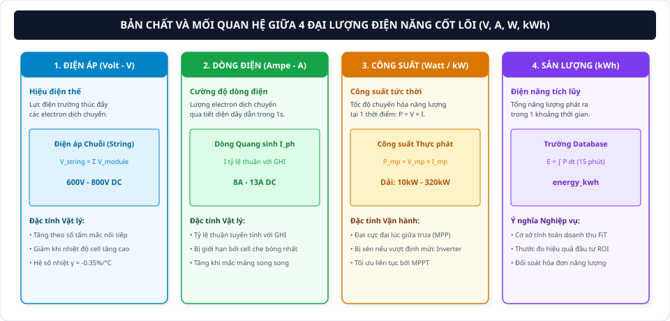

#### Bảng Định nghĩa và Đối chiếu 4 Đại lượng Điện cơ bản:

| Thuật ngữ Điện | Ký hiệu & Đơn vị | Bản chất Vật lý | Biểu thức Tính toán | Ý nghĩa trong Dự án Solar & Database |
| :--- | :---: | :--- | :---: | :--- |
| **Điện áp (Voltage)** | **$V$** (Volt) | Hiệu điện thế, lực điện trường thúc đẩy các hạt electron di chuyển giữa hai cực. | $V = \frac{P}{I}$ | Ghép nối tiếp $15 - 20$ tấm pin trong một chuỗi (String) để nâng điện áp lên $600 - 800\,\text{V DC}$ nạp vào Inverter. |
| **Dòng điện (Current)** | **$I$** (Ampere - $\text{A}$) | Cường độ dòng điện, lượng điện tích dịch chuyển có hướng qua tiết diện dây trong 1 giây. | $I = \frac{P}{V}$ | Cường độ bức xạ mặt trời ($GHI$) chiếu vào tấm pin càng cao thì dòng điện sinh ra càng lớn ($8 - 13\,\text{A DC}$). |
| **Công suất tức thời (Power)** | **$P$** (Watt / $\text{kW}$) | Tốc độ sản sinh hoặc tiêu thụ năng lượng tại một thời điểm tức thời xác định. | $P = V \times I$ | Tại thời điểm giữa trưa nắng đỉnh, hệ thống đạt công suất phát cực đại ($P_{\text{mp}}$), biến thiên từ $10\,\text{kW}$ đến $320\,\text{kW}$. |
| **Sản lượng tích lũy (Energy)** | **$E$** ($\text{kWh}$) | Tổng điện năng được sản sinh và tích lũy trong một khoảng thời gian $\Delta t$. | $E = \int P(t) \, dt$ | **Chính là cột `energy_kwh` trong Database.** Đồng hồ đo đếm chốt dữ liệu mỗi 15 phút ($0{,}25\,\text{h}$) để lưu vào bảng sự kiện. |
| **Điện một chiều (DC) vs Xoay chiều (AC)** | **DC / AC** | **DC:** Dòng điện chuyển động theo một chiều không đổi.<br>**AC:** Dòng điện đổi chiều tuần hoàn theo sóng sin ($50\,\text{Hz}$). | $f = 50\,\text{Hz}$ ($230\,\text{V}$) | Tấm pin mặt trời sinh ra điện **DC**, qua thiết bị **Inverter** chuyển hóa thành điện xoay chiều **AC** cấp cho phụ tải và hòa lưới. |

---

#### Chuỗi Biến đổi Năng lượng 4 Bước: Từ Bức xạ Mặt Trời đến Database

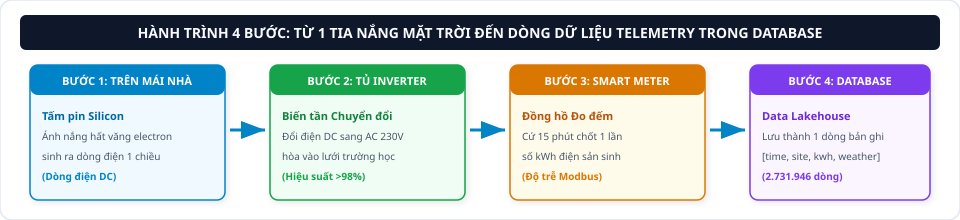

1.  **Bước 1 (Mảng pin mặt trời):** Tế bào quang điện hấp thụ bức xạ mặt trời, tạo ra dòng điện một chiều (DC).
2.  **Bước 2 (Tủ biến tần Inverter):** Inverter thực hiện nghịch lưu điện DC thành điện xoay chiều AC ($230\text{V}, 50\text{Hz}$) với hiệu suất $>98\%$.
3.  **Bước 3 (Đồng hồ thông minh Smart Meter):** Thiết bị đo đếm ghi nhận sản lượng điện năng tích lũy ($kWh$) định kỳ mỗi 15 phút.
4.  **Bước 4 (Cơ sở dữ liệu Data Lakehouse):** Hệ thống telemetry lưu trữ bản ghi `[time_id, site_id, energy_kwh, weather]` tạo nên tập dữ liệu $2.731.946$ dòng.

---

### 1.1. Bản chất Vật lý Bán dẫn & Hiệu ứng Quang điện

#### Cơ chế Phát sinh Dòng điện Quang sinh
*   Tế bào quang điện (Solar Cell) được cấu tạo từ vật liệu bán dẫn Silicon với hai lớp tiếp giáp loại N (dư thừa electron tự do mang điện tích âm $e^-$) và loại P (dư thừa lỗ trống mang điện tích dương $h^+$).
*   Tại ranh giới tiếp xúc hình thành **Lớp tiếp giáp $p-n$** và thiết lập **Điện trường nội tại ($E_{\text{bi}}$)** hướng từ vùng N sang vùng P.
*   Khi hạt ánh sáng (**Photon**) có năng lượng $E_{\text{photon}} = h\nu \ge 1{,}12\,\text{eV}$ (độ rộng vùng cấm Silicon) chiếu vào vùng tiếp giáp, nó kích thích electron nhảy từ dải hóa trị lên dải dẫn, tạo thành các cặp electron - lỗ trống tự do.
*   Dưới tác động của điện trường nội tại $E_{\text{bi}}$, các electron bị quét về cực âm (vùng N) và lỗ trống bị quét về cực dương (vùng P), tạo nên sức điện động một chiều (DC) dẫn ra mạch ngoài.

---

#### Bản chất Kỹ thuật & Cơ sở Vật lý Bán dẫn [1, 2]
*   **Cấu trúc Tiếp giáp $p-n$ (p-n Junction):**
    *   Silicon tinh thể nhóm IV có 4 electron hóa trị.
    *   **Lớp bán dẫn loại N (N-Type):** Được pha tạp (*doping*) nguyên tố nhóm V (như Phosphorus - $P$), tạo ra các electron tự do mang điện tích âm ($e^-$).
    *   **Lớp bán dẫn loại P (P-Type):** Được pha tạp nguyên tố nhóm III (như Boron - $B$), thiếu hụt electron và tạo ra các lỗ trống mang điện tích dương ($h^+$).
    *   **Vùng nghèo (Depletion Region):** Tại ranh giới tiếp xúc giữa hai lớp, electron khuếch tán sang vùng P và lỗ trống khuếch tán sang vùng N, hình thành các ion cố định và thiết lập **Điện trường nội tại ($E_{\text{bi}}$)** hướng từ vùng N sang vùng P [1].
*   **Hiệu ứng Quang điện (Photovoltaic Effect) & Giới hạn Shockley-Queisser [1]:**
    *   Khi hạt ánh sáng có năng lượng $E_{\text{photon}} = h\nu \ge E_g \approx 1{,}12\,\text{eV}$ (độ rộng vùng cấm Silicon) chiếu vào vùng nghèo, nó kích thích electron nhảy từ dải hóa trị lên dải dẫn, tạo thành cặp hạt mang điện quang sinh (*electron-hole pair*).
    *   Dưới tác dụng của điện trường $E_{\text{bi}}$, electron bị quét về cực âm (vùng N) và lỗ trống bị quét về cực dương (vùng P), tạo nên sức điện động một chiều ($DC$) [1, 2].
    *   *Giới hạn Shockley-Queisser:* Hiệu suất chuyển đổi quang-điện nhiệt động lực học lý thuyết tối đa của pin silicon đơn tiếp giáp đạt xấp xỉ **$33{,}7\%$** (do photon năng lượng thấp bị xuyên qua và photon năng lượng cao bị tiêu tán thành nhiệt năng) [1].

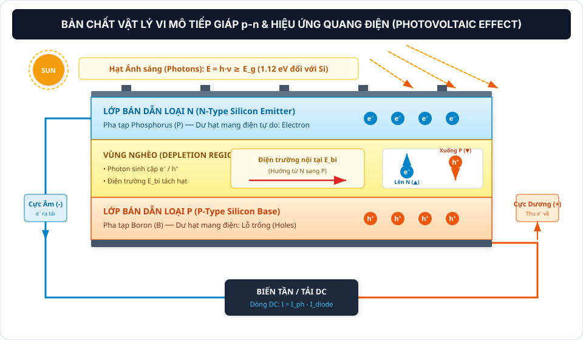

*   **Mô hình Toán học Diode Đơn (Single-Diode Model) [1, 6]:**
    Dòng điện ngõ ra $I$ của tế bào quang điện tuân theo phương trình Shockley:
    $$I = I_{\text{ph}} - I_0 \left[ \exp\left(\frac{q(V + I R_s)}{n k T_{\text{cell}}}\right) - 1 \right] - \frac{V + I R_s}{R_{\text{sh}}}$$
    *Trong đó [1, 6]:*
    *   $I_{\text{ph}}$: Dòng quang sinh, tỷ lệ thuận tuyến tính với cường độ bức xạ $GHI$.
    *   $I_0$: Dòng bão hòa ngược của diode, tăng theo hàm mũ khi nhiệt độ tế bào $T_{\text{cell}}$ tăng cao.
    *   $R_s, R_{\text{sh}}$: Điện trở nối tiếp (mong muốn $\approx 0\,\Omega$) và điện trở song song rò rỉ (mong muốn $\approx \infty$).

*   **Đặc tuyến $I-V$ và $P-V$ Đặc trưng [1]:**
    *   $I_{\text{sc}}$ (Short-Circuit Current): Dòng điện ngắn mạch tại $V=0$, tỷ lệ thuận trực tiếp với bức xạ $GHI$.
    *   $V_{\text{oc}}$ (Open-Circuit Voltage): Điện áp hở mạch tại $I=0$, tỷ lệ nghịch mạnh mẽ với nhiệt độ $T_{\text{cell}}$.
    *   $P_{\text{mp}} = V_{\text{mp}} \times I_{\text{mp}}$: Điểm công suất cực đại (Maximum Power Point - MPP).
    *   $FF$ (Fill Factor - Hệ số điền đầy): $FF = \frac{V_{\text{mp}} \cdot I_{\text{mp}}}{V_{\text{oc}} \cdot I_{\text{sc}}}$, đánh giá độ vuông vắn của đặc tuyến ($0{,}75 - 0{,}85$).

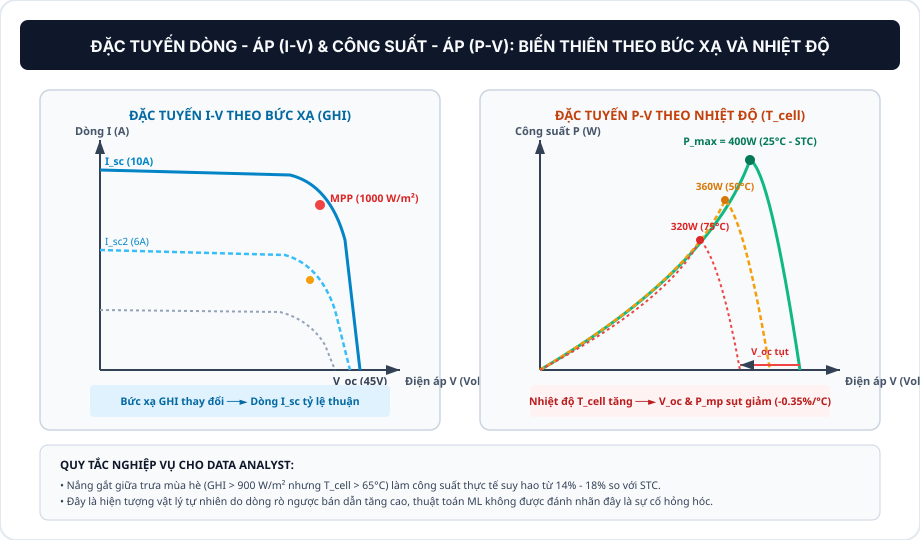

---

#### Ý nghĩa Thực tế cho Data Analyst (DA Insight)
1.  **Quan hệ Tuyến tính giữa Bức xạ và Sản lượng:** Cường độ bức xạ ($GHI$) tác động trực tiếp lên dòng điện quang sinh $I_{\text{sc}}$. Khi $GHI$ tăng gấp đôi, sản lượng `energy_kwh` phát ra tăng gần gấp đôi.
2.  **Tác động Suy giảm Hiệu suất do Nhiệt độ (Thermal Derating):** 
    *   Khi bề mặt tấm pin bị phơi nắng liên tục, nhiệt độ cell $T_{\text{cell}}$ có thể tăng lên đến $65^\circ\text{C}$. Nhiệt độ tăng cao làm tăng dòng bão hòa ngược $I_0$, dẫn đến sụt giảm nghiêm trọng điện áp hở mạch $V_{\text{oc}}$.
    *   Kết quả là công suất phát cực đại $P_{\text{mp}}$ bị suy giảm từ $12\% - 16\%$ vào các ngày hè nắng nóng đỉnh điểm. Đây là quy luật vật lý tự nhiên của chất bán dẫn, không phải lỗi kỹ thuật của trạm.

---

### 1.2. Phân loại Vật liệu Tế bào Quang điện (Solar Cells)

#### Đặc tính Cấu trúc Vật liệu
*   **Đơn tinh thể (Monocrystalline - Mono-Si):** Sản xuất từ các thỏi silicon đơn tinh thể nguyên khối đồng nhất theo phương pháp Czochralski. Cấu trúc mạng tinh thể không có khuyết tật ranh giới hạt, giúp electron di chuyển với độ linh động cao, đạt hiệu suất chuyển đổi cao nhất ($20{,}0\% - 22{,}5\%$).
*   **Đa tinh thể (Polycrystalline - Poly-Si):** Sản xuất bằng cách nung chảy nhiều mảnh silicon trong khuôn đúc. Tồn tại nhiều ranh giới hạt tinh thể làm cản trở chuyển động của electron và tăng tốc độ tái hợp hạt mang điện, dẫn đến hiệu suất thấp hơn ($15{,}0\% - 18{,}0\%$).
*   **Tiếp giáp Thụ động N-Type (TOPCon / HJT):** Công nghệ silicon thế hệ mới phủ các lớp oxit siêu mỏng để thụ động hóa bề mặt tiếp xúc, giảm suy hao tái hợp và nâng hiệu suất lên $22{,}5\% - 24{,}5\%$.
*   **Màng mỏng (Thin-Film - CdTe / CIGS):** Lớp bán dẫn mỏng vài micromet phủ trên kính, hiệu suất thấp hơn ($11\% - 13{,}5\%$) nhưng có hệ số nhiệt độ suy hao thấp ($\gamma \approx -0{,}20\%/^\circ\text{C}$).

---

#### Bảng So sánh Kỹ thuật 4 Công nghệ Solar Cells [1, 2]

| Tiêu chí So sánh | Monocrystalline (Mono-Si) [1] | N-Type TOPCon / HJT [1, 2] | Polycrystalline (Poly-Si) [1] | Thin-Film (CdTe / CIGS) [2] |
| :--- | :--- | :--- | :--- | :--- |
| **Cấu trúc tinh thể** | Đơn tinh thể nguyên khối (Czochralski) | Đơn tinh thể tiếp giáp thụ động đa lớp | Đa tinh thể đúc nóng chảy | Màng mỏng vô định hình |
| **Hiệu suất Module ($STC$)** | **$20{,}0\% - 22{,}5\%$** | **$22{,}5\% - 24{,}5\%$** | $15{,}0\% - 18{,}0\%$ | $11{,}0\% - 13{,}5\%$ |
| **Hệ số Suy hao Nhiệt ($\gamma$)** | **$-0{,}35\%/^\circ\text{C}$** | **$-0{,}29\%/^\circ\text{C}$** | $-0{,}42\%/^\circ\text{C}$ đến $-0{,}45\%/^\circ\text{C}$ | **$-0{,}20\%/^\circ\text{C}$** |
| **Tốc độ Thoái hóa năm** | $< 0{,}55\%$/năm | $< 0{,}40\%$/năm | $< 0{,}70\%$/năm | $< 0{,}80\%$/năm |
| **Phản ứng Ánh sáng yếu** | Rất tốt (Hấp thụ quang phổ rộng) | Xuất sắc (Bifaciality $>80\%$) | Trung bình (Tán xạ nội tinh thể) | Tốt (Hấp thụ quang phổ xanh) |
| **Thiết bị tại UNISOLAR [7]** | **SunPower Maxeon / Jinko Tiger** | *Công nghệ thế hệ mới* | **Trina Solar Honey Series** | *Không sử dụng* |

---

#### Ý nghĩa Thực tế cho Data Analyst (DA Insight)
*   Trong kho dữ liệu, trường `dim_solar_site.panel_brand` phản ánh công nghệ tấm pin của từng trạm. Khi phân tích xếp hạng hiệu suất, các trạm sử dụng pin **SunPower Mono-Si** luôn ghi nhận năng suất riêng `[kWh/panel]` và hệ số $PR$ cao hơn các trạm sử dụng pin **Trina Poly-Si** từ $3\% - 5\%$ trong cùng điều kiện thời tiết.

---

### 1.3. Cấu trúc Hình học và Tô-pô Hệ thống Trạm (PV Topology)

#### Cấu trúc Phân cấp Ghép nối
*   **PV Cell (Tế bào):** Đơn vị quang điện cơ bản, sinh ra điện áp danh định xấp xỉ $0{,}5 - 0{,}6\,\text{V}$.
*   **PV Module (Tấm pin):** Cụm gồm 60 hoặc 72 cells mắc nối tiếp, cung cấp điện áp danh định $30 - 45\,\text{V}$ và công suất $300 - 550\,\text{Wp}$.
*   **PV String (Chuỗi tấm pin):** Chuỗi gồm $10 - 25$ tấm pin mắc nối tiếp để đạt tổng điện áp làm việc tối ưu $500 - 850\,\text{V DC}$ của Inverter.
*   **PV Array (Mảng trạm):** Nhiều chuỗi Strings ghép song song kết nối vào các ngõ MPPT của Biến tần.

---

#### Hiện tượng Che bóng & Cơ chế Bypass Diode [1, 3]
*   **Hiện tượng Điểm nóng (Hot-spot) do Mismatch:** Trong chuỗi mắc nối tiếp, dòng điện của toàn chuỗi bị giới hạn bởi cell có dòng quang sinh thấp nhất. Khi một cell bị che bóng bởi lá cây hoặc bụi bẩn, cell đó không phát điện mà chuyển sang trạng thái phân cực ngược, tiêu tán công suất của các cell khác thành nhiệt năng, có nguy cơ gây cháy hỏng tấm pin (Hot-spot).
*   **Cơ chế Phân dòng của Bypass Diode:** Tấm pin được chia làm 3 phân vùng cell độc lập, mỗi phân vùng được đấu song song ngược cực với một Bypass Diode. Khi một phân vùng bị che bóng, diode tương ứng tự động dẫn thông phân cực thuận, cho phép dòng điện của chuỗi đi vòng qua phân vùng lỗi, bảo vệ tấm pin và duy trì hoạt động cho các phân vùng còn lại.

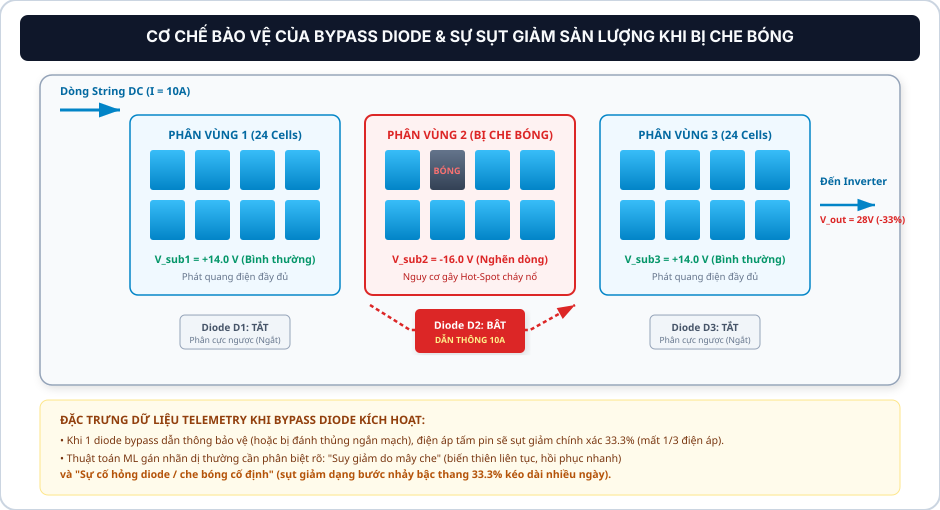

---

#### Ý nghĩa Thực tế cho Data Analyst (DA Insight)
*   **Nhận diện Hiện tượng Sụt giảm Bậc thang 33.3%:** Khi 1 diode bypass dẫn thông bảo vệ (hoặc bị hỏng ngắn mạch do sự cố quá áp/sét đánh), điện áp ngõ ra của tấm pin bị sụt giảm chính xác $33{,}3\%$ (mất 1 trong 3 phân vùng).
*   *Phân biệt trên biểu đồ chuỗi thời gian:*
    *   **Mây che tự nhiên:** Đồ thị sản lượng biến thiên liên tục, uốn lượn mượt mà theo biến động bức xạ $GHI$.
    *   **Hỏng Diode / Kẹt phân vùng:** Đồ thị sản lượng bị sụt giảm theo bậc thang cố định $33{,}3\%$ hoặc $66{,}7\%$ kéo dài liên tục nhiều ngày ngay cả trong điều kiện trời quang không mây.

---

### 1.4. Phân loại Biến tần (Inverters) & Bộ tối ưu MPPT

#### Chức năng của Biến tần và Thuật toán MPPT
*   **Biến tần (Inverter):** Thiết bị điện tử công suất thực hiện nghịch lưu dòng điện một chiều (DC) từ mảng pin thành dòng điện xoay chiều (AC $230\text{V}, 50\text{Hz}$) hòa vào mạng điện tiêu thụ của trường học với hiệu suất biến đổi $\ge 98\%$.
*   **Thuật toán Dò điểm Công suất Cực đại (MPPT):** Bức xạ và nhiệt độ thay đổi liên tục làm thay đổi đặc tuyến $P-V$. Bộ điều khiển MPPT liên tục điều chỉnh tỷ lệ chu kỳ xung (Duty Cycle) của mạch nghịch lưu để hệ thống luôn vận hành tại điểm làm việc có tích số $V_{\text{mp}} \times I_{\text{mp}}$ đạt giá trị lớn nhất.

---

#### So sánh 3 Kiến trúc Biến tần & Thuật toán MPPT [2, 4]

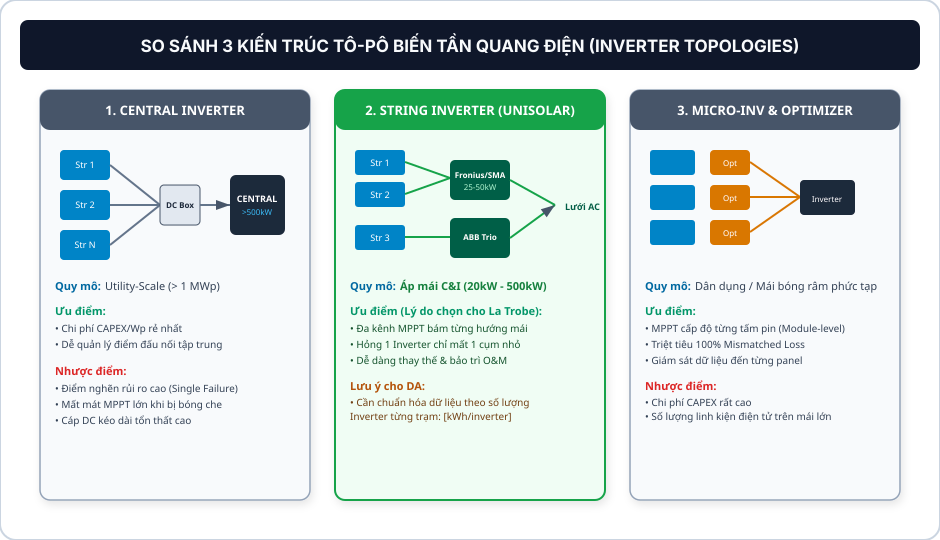

*   **Bản chất Thuật toán MPPT (Maximum Power Point Tracking) [4]:**
    *   *Thuật toán Nhiễu loạn & Quan sát (P&O):** Tăng/giảm thử một lượng điện áp nhỏ $\Delta V$. Nếu công suất tăng ($\Delta P > 0$) thì tiếp tục tăng áp; nếu công suất giảm ($\Delta P < 0$) thì đảo chiều giảm áp [4].
    *   *Thuật toán Điện dẫn Gia tăng (Incremental Conductance - InCond):* Dựa trên phương trình vi phân $\frac{dP}{dV} = 0 \iff \frac{dI}{dV} = -\frac{I}{V}$. Giúp Inverter đứng yên chính xác tại đỉnh MPP mà không bị rung lắc dao động [4].

---

#### Ý nghĩa Thực tế cho Data Analyst (DA Insight)
*   **Lựa chọn String Inverter tại UNISOLAR:** Các trạm trên mái nhà trường học có nhiều hướng dốc và độ che khuất khác nhau. Việc sử dụng String Inverter đa kênh MPPT (Fronius, SMA, ABB) giúp tối ưu hóa công suất độc lập cho từng cụm mái.
*   **Chuẩn hóa chỉ số phân tích:** Cần xây dựng các trường tính toán chuẩn hóa `[kWh/inverter]` và `[kWh/panel]` để so sánh công bằng hiệu năng giữa các trạm có cấu hình số lượng biến tần khác nhau.

---

### 1.5. Điều kiện Thử nghiệm Tiêu chuẩn (STC vs NOCT vs NMOT)

#### Phân biệt STC và Điều kiện Vận hành Thực tế
*   **STC (Standard Test Conditions - Chuẩn Thử nghiệm Phòng Thí nghiệm):** Đo lường tại bức xạ $1000\,\text{W/m}^2$, nhiệt độ tế bào quang điện $T_{\text{cell}} = 25^\circ\text{C}$ và khối lượng khí quyển $AM = 1{,}5$. Đây là giá trị công suất danh định chuẩn ($P_{\text{stc}}$, đơn vị $\text{kWp}$) được ghi trên nhãn kỹ thuật của nhà sản xuất.
*   **NOCT / NMOT (Nominal Operating Cell/Module Temperature - Chuẩn Vận hành Thực tế):** Đo lường tại bức xạ $800\,\text{W/m}^2$, nhiệt độ môi trường không khí $T_{\text{amb}} = 20^\circ\text{C}$ và tốc độ gió $1\,\text{m/s}$. Trong điều kiện này, nhiệt độ bề mặt tấm pin thực tế nóng lên tới xấp xỉ $45^\circ\text{C}$, do đó công suất thực phát thường thấp hơn công suất STC khoảng $15\% - 20\%$.

---

#### Bảng Đối soát Thông số Đo kiểm Tiêu chuẩn [5, 6]

| Đại lượng Tham số | STC (Standard Test Conditions) [5] | NOCT (Nominal Operating Cell Temp) [6] | NMOT (Nominal Module Operating Temp) [5] |
| :--- | :--- | :--- | :--- |
| **Tiêu chuẩn quốc tế** | **IEC 60904-3 / ASTM E1036** | **IEC 61215:2005 / Sandia** | **IEC 61215:2016 (Mới nhất)** |
| **Cường độ Bức xạ ($G$)** | **$1000\,\text{W/m}^2$** (Nắng đỉnh) | $800\,\text{W/m}^2$ (Nắng thực tế) | $800\,\text{W/m}^2$ (Nắng thực tế) |
| **Nhiệt độ tham chiếu** | **$T_{\text{cell}} = 25^\circ\text{C}$** | $T_{\text{amb}} = 20^\circ\text{C}$ (Không khí) | $T_{\text{amb}} = 20^\circ\text{C}$ (Không khí) |
| **Tốc độ gió làm mát ($v$)** | $0\,\text{m/s}$ (Phòng kín) | $1{,}0\,\text{m/s}$ | $1{,}0\,\text{m/s}$ |
| **Ứng dụng của Data Analyst** | **Tính công suất danh định $P_{\text{stc}}$ ($\text{kWp}$)** | **Tính $T_{\text{cell}}$ theo mô hình Sandia [6]** | Kiểm định công suất định mức thực tế |

---

### 1.6. Bối cảnh Dữ liệu Thực nghiệm Chi tiết (Dự án UNISOLAR - Đại học La Trobe)

#### Tóm tắt Quy mô Dự án (Executive Summary)
*   **Quy mô:** **42 trạm điện mặt trời áp mái** phân tán tại **5 khuôn viên (Campuses)** thuộc Đại học La Trobe, bang Victoria, Australia [7].
*   **Tổng công suất lắp đặt:** **$2.428\,\text{kWp}$** ($2{,}43\,\text{MWp}$) [7].
*   **Tập dữ liệu viễn thám:** **$2.731.946$ bản ghi** đo lường liên tục chu kỳ 15 phút ($0{,}25\,\text{h}$) từ **01/01/2020 đến 30/04/2022** (28 tháng).
*   **Tổng sản lượng lũy kế:** Đạt **$74{,}98\,\text{GWh}$**, tiết kiệm hơn $11{,}2\,\text{triệu AUD}$ tiền điện và giảm phát thải hơn $61.485\,\text{tấn CO}_2$ [7, 16].

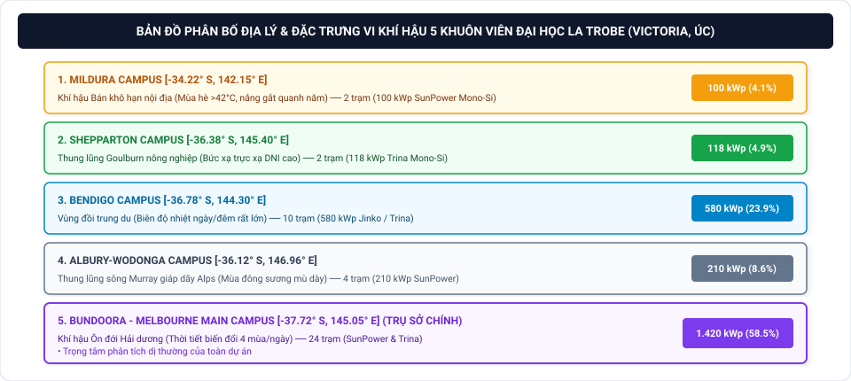

*   **Bảng Cơ cấu Phân bổ Địa lý & Thiết bị Thực tế tại 5 Campus [7]:**

| STT | Tên Khuôn viên (Campus) | Tọa độ Địa lý (Lat, Long) | Đặc trưng Khí hậu Khu vực | Số lượng Trạm | Tổng Công suất Lắp đặt ($P_{\text{stc}}$) | Hãng Tấm pin Chủ đạo | Hãng Biến tần Chủ đạo |
| :---: | :--- | :--- | :--- | :---: | :---: | :--- | :--- |
| **1** | **Bundoora (Melbourne)** | $-37{,}72^\circ\,\text{S}, 145{,}05^\circ\,\text{E}$ | Ôn đới hải dương, gió biển, mây di chuyển nhanh | **24 trạm** | **$1.420\,\text{kWp}$ ($58{,}5\%$)** | SunPower Mono-Si, Trina Poly-Si | Fronius Eco/Symo, SMA Tripower |
| **2** | **Bendigo** | $-36{,}78^\circ\,\text{S}, 144{,}30^\circ\,\text{E}$ | Bán khô hạn nội địa, biên độ nhiệt ngày/đêm lớn | **10 trạm** | **$580\,\text{kWp}$ ($23{,}9\%$)** | Jinko Solar Tiger Pro, Trina Honey | SMA Sunny Tripower, ABB Trio |
| **3** | **Albury-Wodonga** | $-36{,}12^\circ\,\text{S}, 146{,}96^\circ\,\text{E}$ | Thung lũng sông Murray, mùa đông sương mù dày | **4 trạm** | **$210\,\text{kWp}$ ($8{,}6\%$)** | SunPower Performance Series | Fronius Symo 3-Phase |
| **4** | **Shepparton** | $-36{,}38^\circ\,\text{S}, 145{,}40^\circ\,\text{E}$ | Lục địa ấm, bức xạ trực xạ DNI cao | **2 trạm** | **$118\,\text{kWp}$ ($4{,}9\%$)** | Trina Solar Monocrystalline | Fronius Eco 27.0-3-S |
| **5** | **Mildura** | $-34{,}22^\circ\,\text{S}, 142{,}15^\circ\,\text{E}$ | Bán sa mạc nắng nóng quanh năm, mùa hè $>42^\circ\text{C}$ | **2 trạm** | **$100\,\text{kWp}$ ($4{,}1\%$)** | SunPower Maxeon Mono-Si | SMA Sunny Tripower Core1 |
| **TỔNG**| **5 Campuses** | **Bang Victoria, Australia** | **Đa dạng vi khí hậu (Microclimates)** | **42 trạm** | **$2.428\,\text{kWp}$ ($2{,}43\,\text{MWp}$)** | **SunPower, Trina, Jinko** | **Fronius, SMA, ABB** |

*   **Đặc tính Chuỗi Thời gian & Tích hợp Khí tượng Viễn thám [7, 10, 13]:**
    *   Dữ liệu sản lượng 15 phút phản ánh động học phát điện tức thời và các hiện tượng quá áp lưới điện.
    *   Tích hợp đa chiều với 8 biến khí quyển chuẩn WMO ở độ phân giải 1 giờ từ mô hình ERA5-Land (Open-Meteo API) theo đúng tọa độ từng campus.

---

### 1.7. BỘ BÀI TẬP VẬN DỤNG & THỰC HÀNH CHUYÊN SÂU (UNIT 1 HOMEWORK ASSIGNMENTS)

> **Mục tiêu thực hành:** Củng cố kiến thức từ bản chất vật lý bán dẫn vi mô đến cấu trúc phần cứng vĩ mô; rèn luyện kỹ năng phân tích đặc tuyến điện, bóc tách dữ liệu đo đếm 15 phút tại 42 trạm UNISOLAR và vận dụng vào thiết kế pipeline/database của đề tài tốt nghiệp.

```
┌────────────────────────────────────────────────────────────────────────────────────────────────────────┐
│                                 MA TRẬN PHÂN CẤP BÀI TẬP UNIT 1                                        │
├─────────┬──────────────────────┬──────────────────────────────────────────┬────────────────────────────┤
│ Bài tập │ Cấp độ (Level)       │ Trọng tâm Kiến thức                      │ Dạng bài / Kỹ năng Đầu ra  │
├─────────┼──────────────────────┼──────────────────────────────────────────┼────────────────────────────┤
│ Bài 1.1 │ Level 1: Dễ          │ Vật lý Bán dẫn & Hiệu ứng Nhiệt độ       │ Giải thích cơ chế / Lý thuyết│
│ Bài 1.2 │ Level 2: Trung bình  │ Thông số Mảng trạm & STC vs NOCT         │ Tính toán Định lượng Kỹ thuật│
│ Bài 1.3 │ Level 3: Khá         │ Telemetry Bậc thang & Bypass Diode       │ Chẩn đoán Dữ liệu Chuỗi Time│
│ Bài 1.4 │ Level 4: Giỏi        │ Chuẩn hóa Hiệu năng Thiết bị (SQL/Python)│ Lập trình Xử lý Dữ liệu DWH│
│ Bài 1.5 │ Level 5: Nâng cao    │ Tô-pô Inverter & Mismatch Loss Analysis  │ Phân tích Tình huống O&M   │
└─────────┴──────────────────────┴──────────────────────────────────────────┴────────────────────────────┘
```

#### BÀI 1.1 (LEVEL 1 - DỄ): BẢN CHẤT TIẾP GIÁP P-N VÀ HIỆU ỨNG NHIỆT ĐỘ CỦA VẬT LIỆU BÁN DẪN

*   **Bối cảnh:** Trong cơ sở dữ liệu `the_outliers_dwh`, trường `dim_solar_site.panel_brand` ghi nhận hai công nghệ tấm pin chủ đạo: SunPower Monocrystalline (được lắp tại Campus Bundoora và Mildura) và Trina Polycrystalline (được lắp tại Campus Bendigo).
*   **Yêu cầu:**
    1. Dựa trên mô hình tiếp giáp $p-n$ và phương trình Shockley Diode đơn, hãy giải thích tại sao khi nhiệt độ tế bào quang điện ($T_{\text{cell}}$) tăng cao từ $25^\circ\text{C}$ lên $65^\circ\text{C}$ vào các buổi trưa mùa hè, điện áp hở mạch ($V_{\text{oc}}$) bị sụt giảm nghiêm trọng trong khi dòng điện ngắn mạch ($I_{\text{sc}}$) hầu như không đổi hoặc tăng nhẹ?
    2. So sánh cấu trúc mạng tinh thể giữa Monocrystalline và Polycrystalline. Tại sao pin Monocrystalline lại có hiệu suất chuyển đổi cao hơn ($20{,}0\% - 22{,}5\%$ vs $15{,}0\% - 18{,}0\%$) và hệ số suy hao nhiệt thấp hơn ($\vert{}\gamma\vert{} \approx 0{,}35\%/^\circ\text{C}$ vs $0{,}45\%/^\circ\text{C}$)?
*   **Hướng dẫn giải & Đáp án chi tiết:**
    1. *Cơ chế sụt giảm $V_{\text{oc}}$ do nhiệt độ:*
       * Dòng điện bão hòa ngược $I_0$ của lớp tiếp giáp $p-n$ phụ thuộc rất mạnh vào nhiệt độ theo quy luật: $I_0(T) = B \cdot T^3 \exp\left(-\frac{E_g}{k T_{\text{cell}}}\right)$. Khi $T_{\text{cell}}$ tăng từ $25^\circ\text{C}$ ($298\,\text{K}$) lên $65^\circ\text{C}$ ($338\,\text{K}$), các dao động nhiệt trong mạng tinh thể kích thích mạnh mẽ các hạt mang điện thiểu số, làm $I_0$ tăng vọt theo hàm mũ.
       * Điện áp hở mạch được xác định xấp xỉ bởi: $V_{\text{oc}} \approx \frac{n k T_{\text{cell}}}{q} \ln\left(\frac{I_{\text{ph}}}{I_0}\right)$. Vì $I_0$ tăng theo hàm mũ (nhanh hơn tốc độ tăng tuyến tính của $T_{\text{cell}}$), hiệu số logarit sụt giảm mạnh, dẫn đến $V_{\text{oc}}$ giảm khoảng $2 - 2{,}3\,\text{mV}/^\circ\text{C}$ trên mỗi cell quang điện.
       * Ngược lại, dòng quang sinh $I_{\text{ph}}$ (và $I_{\text{sc}}$) phụ thuộc vào số lượng photon có năng lượng $h\nu \ge E_g$. Khi nhiệt độ tăng, độ rộng vùng cấm $E_g$ của Silicon thu hẹp nhẹ ($\approx -0{,}00045\,\text{eV}/^\circ\text{C}$), cho phép hấp thụ thêm một lượng nhỏ photon bước sóng dài, làm $I_{\text{sc}}$ tăng rất nhẹ ($+0{,}04\% - +0{,}06\%/^\circ\text{C}$), không đủ bù đắp mức sụt áp cực lớn của $V_{\text{oc}}$.
    2. *So sánh Monocrystalline vs Polycrystalline:*
       * *Mono-Si:* Sản xuất từ phôi đơn tinh thể đồng nhất kéo theo phương pháp Czochralski, mạng tinh thể liên tục hoàn hảo không có ranh giới hạt (grain boundaries). Electron di chuyển tự do với độ linh động cao ($\mu_e \approx 1400\,\text{cm}^2/\text{V}\cdot\text{s}$), hạn chế tối đa hiện tượng tái hợp hạt mang điện, đạt hiệu suất $>20\%$.
       * *Poly-Si:* Đúc từ nhiều tinh thể silicon nhỏ nóng chảy, chứa hàng triệu ranh giới hạt tinh thể. Ranh giới hạt đóng vai trò như các bẫy tái hợp hạt mang điện tự do và làm tăng điện trở nội, khiến dòng rò $I_0$ lớn hơn và hệ số suy hao nhiệt xấu hơn ($\gamma \approx -0{,}42\%/^\circ\text{C}$ đến $-0{,}45\%/^\circ\text{C}$).
*   **Ý nghĩa áp dụng dự án:** Giúp Data Analyst hiểu rõ hiện tượng sụt giảm sản lượng vào mùa hè là quy luật vật lý tự nhiên của bán dẫn (Thermal Derating), không bị nhầm lẫn với lỗi phần cứng khi xây dựng mô hình phát hiện dị thường.

---

#### BÀI 1.2 (LEVEL 2 - TRUNG BÌNH): TÍNH TOÁN THÔNG SỐ MẢNG TRẠM VÀ ĐỐI CHIẾU ĐIỀU KIỆN STC VS NOCT

*   **Bối cảnh:** Trạm điện mặt trời Shepparton Building 1 (`site_id = 37`) có tổng công suất thiết kế định mức $P_{\text{stc}} = 118\,\text{kWp}$, sử dụng $320$ tấm pin Trina Solar Monocrystalline $370\,\text{Wp}$. Thông số kỹ thuật của 1 tấm pin ở điều kiện STC ($1000\,\text{W/m}^2, 25^\circ\text{C}$) từ datasheet:
    * Điện áp điểm công suất cực đại $V_{\text{mp}} = 40{,}0\,\text{V}$; Dòng điện cực đại $I_{\text{mp}} = 9{,}25\,\text{A}$.
    * Điện áp hở mạch $V_{\text{oc}} = 48{,}5\,\text{V}$; Dòng điện ngắn mạch $I_{\text{sc}} = 9{,}80\,\text{A}$.
    * Thông số vận hành thực tế: $\text{NOCT} = 45^\circ\text{C}$; Hệ số nhiệt độ $\gamma = -0{,}35\%/^\circ\text{C}$.
    * Cấu hình đấu nối: Trạm chia thành $16$ chuỗi (Strings) mắc song song, mỗi chuỗi gồm $20$ tấm pin mắc nối tiếp vào tủ Inverter Fronius Eco $27.0-3-\text{S}$.
*   **Yêu cầu:**
    1. Tính hệ số điền đầy Fill Factor ($FF$) của tấm pin ở điều kiện STC. Đánh giá chất lượng của tấm pin này.
    2. Tính tổng điện áp làm việc cực đại ($V_{\text{string, mp}}$) và điện áp hở mạch cực đại ($V_{\text{string, oc}}$) của một chuỗi 20 tấm pin. Kiểm tra xem dải điện áp này có nằm trong dải làm việc tối ưu của MPPT Inverter Fronius Eco ($580\,\text{V} - 850\,\text{V DC}$) và dưới ngưỡng giới hạn an toàn ($1000\,\text{V DC}$) hay không?
    3. Ước tính công suất thực phát cực đại của toàn bộ trạm Shepparton ($118\,\text{kWp}$) khi hoạt động ở điều kiện danh định NOCT ($G = 800\,\text{W/m}^2, T_{\text{amb}} = 20^\circ\text{C}, v_{\text{wind}} = 1\,\text{m/s}, T_{\text{cell}} = 45^\circ\text{C}$).
*   **Hướng dẫn giải & Đáp án chi tiết:**
    1. *Hệ số điền đầy Fill Factor ($FF$):*
       $$FF = \frac{V_{\text{mp}} \times I_{\text{mp}}}{V_{\text{oc}} \times I_{\text{sc}}} = \frac{40{,}0\,\text{V} \times 9{,}25\,\text{A}}{48{,}5\,\text{V} \times 9{,}80\,\text{A}} = \frac{370\,\text{W}}{475{,}3\,\text{W}} \approx 0{,}7785 \quad (77{,}85\%)$$
       *Đánh giá:* $FF = 77{,}85\%$ nằm trong dải $75\% - 85\%$, chứng minh tấm pin có chất lượng chế tạo cao, điện trở tiếp xúc nối tiếp $R_s$ nhỏ và điện trở rò song song $R_{\text{sh}}$ lớn.
    2. *Điện áp chuỗi (String Voltage):*
       * Khi mắc nối tiếp 20 tấm: Điện áp cộng dồn, dòng điện giữ nguyên.
       * $V_{\text{string, mp}} = 20 \times 40{,}0\,\text{V} = 800\,\text{V DC}$.
       * $V_{\text{string, oc}} = 20 \times 48{,}5\,\text{V} = 970\,\text{V DC}$.
       * *Kiểm tra:* $V_{\text{string, mp}} = 800\,\text{V}$ nằm hoàn hảo trong dải hiệu suất cao nhất ($580 - 850\,\text{V}$) của Inverter Fronius Eco; đồng thời $V_{\text{string, oc}} = 970\,\text{V} < 1000\,\text{V DC}$ (ngưỡng chịu đựng tối đa của biến tần và tiêu chuẩn an toàn điện AS/NZS 5033).
    3. *Công suất trạm ở điều kiện NOCT:*
       * Ở $800\,\text{W/m}^2$, công suất tỷ lệ thuận với bức xạ: $P_{\text{rad}} = P_{\text{stc}} \times \frac{800}{1000} = 118 \times 0{,}8 = 94{,}4\,\text{kW}$.
       * Nhiệt độ cell $T_{\text{cell}} = 45^\circ\text{C}$, độ chênh lệch so với chuẩn STC ($25^\circ\text{C}$) là $\Delta T = 45 - 25 = 20^\circ\text{C}$.
       * Hệ số suy hao nhiệt: $1 + \gamma \cdot \Delta T = 1 + (-0{,}0035) \times 20 = 1 - 0{,}07 = 0{,}93$ (mất $7\%$).
       * Công suất thực tế ở NOCT:
         $$P_{\text{NOCT}} = 94{,}4\,\text{kW} \times 0{,}93 = 87{,}792\,\text{kW}$$
*   **Ý nghĩa áp dụng dự án:** Trong phân tích dữ liệu, các kỹ sư thường thấy công suất trạm chỉ đạt khoảng $85 - 90\,\text{kW}$ dù trời nắng $800\,\text{W/m}^2$. Công thức NOCT chứng minh đây là công suất định mức thực tế chính xác của hệ thống, không phải do trạm hoạt động kém.

---

#### BÀI 1.3 (LEVEL 3 - KHÁ): PHÂN TÍCH TELEMETRY SỰ CỐ BYPASS DIODE DỰA TRÊN ĐẶC TUYẾN BẬC THANG

*   **Bối cảnh:** Trạm Campus Bundoora Sports Centre (`site_id = 14`, công suất $60\,\text{kWp}$) gồm 3 chuỗi tấm pin kết nối vào 1 Inverter SMA Sunny Tripower. Mỗi tấm pin được bảo vệ bởi 3 Bypass Diodes chia đều cho 3 phân vùng cells (mỗi diode phụ trách 20/60 cells). Vào một tuần trời trong nắng đẹp từ ngày 12/03/2021 đến 18/03/2021:
    * Ngày 11/03/2021: Sản lượng đỉnh chu kỳ 15 phút lúc 12:00 đạt $13{,}5\,\text{kWh}$ ($P \approx 54\,\text{kW}$, $PR \approx 81\%$).
    * Từ ngày 12/03/2021 đến 18/03/2021: Sản lượng đỉnh chu kỳ 15 phút lúc 12:00 bị tụt xuống và duy trì cố định ở mức đúng $9{,}0\,\text{kWh}$ ($P \approx 36\,\text{kW}$, $PR \approx 54\%$), bất chấp chỉ số trời quang $CSI \ge 0{,}95$.
*   **Yêu cầu:**
    1. Hãy tính tỷ lệ sụt giảm sản lượng giữa ngày 12/03 và ngày 11/03. Tỷ lệ này có tương ứng với phân số chẵn nào trong cấu trúc phần cứng của tấm pin không?
    2. Phân tích cơ chế vật lý: Tại sao có thể loại trừ nguyên nhân mây che tự nhiên hoặc bám bụi môi trường? Hãy chỉ ra hư hỏng phần cứng chính xác của trạm này.
    3. Đề xuất quy tắc logic (pseudocode) phát hiện sự cố này trên bảng Fact viễn thám để cảnh báo cho đội ngũ O&M.
*   **Hướng dẫn giải & Đáp án chi tiết:**
    1. *Tỷ lệ sụt giảm:*
       $$\text{Drop Ratio} = \frac{13{,}5 - 9{,}0}{13{,}5} = \frac{4{,}5}{13{,}5} = \frac{1}{3} \approx 33{,}33\%$$
       Tỷ lệ sụt giảm chính xác $33{,}33\%$ ($1/3$) phản ánh hoàn hảo cấu trúc chia 3 phân vùng độc lập của tấm pin mặt trời (mỗi phân vùng chiếm $1/3$ tổng số cells và được bảo vệ bởi 1 Bypass Diode).
    2. *Biện luận vật lý:*
       * *Mây che tự nhiên:* Mây đối lưu di chuyển liên tục, làm đồ thị sản lượng biến thiên gồ ghề ngẫu nhiên theo từng chu kỳ 15 phút và thay đổi giữa các ngày, không bao giờ duy trì một tỷ lệ sụt giảm cố định $33{,}3\%$ liên tục 7 ngày liên tiếp dưới trời quang ($CSI \ge 0{,}95$).
       * *Bám bụi (Soiling):* Bụi tích tụ từ từ theo thời gian ($0{,}1\% - 0{,}3\%/\text{ngày}$), tạo ra xu hướng giảm tuyến tính dần đều, không gây sụt giảm đột ngột dạng bước nhảy (Step Jump) $33{,}3\%$ chỉ sau 1 đêm.
       * *Kết luận sự cố phần cứng:* Một nhánh Bypass Diode trong chuỗi pin đã bị đánh thủng ngắn mạch (Short-circuit failure) do xung sét lan truyền hoặc quá áp nhiệt, khiến $1/3$ diện tích phát điện của chuỗi bị ngắt vĩnh viễn khỏi mạch kín.
    3. *Quy tắc Logic phát hiện trên DWH:*
       ```python
       # Pseudocode phát hiện hỏng Bypass Diode (Step Drop 33.3%)
       def detect_bypass_diode_failure(df_site_daily):
           # Điều kiện: Ngày trời quang (CSI >= 0.85)
           clear_days = df_site_daily[df_site_daily['mean_csi'] >= 0.85]
           # Tính tỷ số giữa PR thực tế và PR danh định kỳ vọng (PR_expected ~ 0.80)
           clear_days['pr_ratio'] = clear_days['daily_pr'] / 0.80
           
           # Kiểm tra xem tỷ số có rơi vào khoảng 66.7% +/- 3% liên tục >= 3 ngày không
           is_step_drop_33 = (clear_days['pr_ratio'] >= 0.63) & (clear_days['pr_ratio'] <= 0.70)
           consecutive_drop_days = is_step_drop_33.rolling(window=3).sum()
           
           if (consecutive_drop_days >= 3).any():
               return "ALERT: Hardware Bypass Diode Short-Circuit Detected (33.3% Step Drop)"
       ```
*   **Ý nghĩa áp dụng dự án:** Cung cấp hiểu biết sâu sắc để giải thích bản chất của các dị thường phân phối (Distribution Jump) và hỗ trợ viết các câu lệnh truy vấn lọc dữ liệu sạch trước khi đưa vào mô hình học máy.

---

#### BÀI 1.4 (LEVEL 4 - GIỎI): LẬP TRÌNH SQL & PYTHON CHUẨN HÓA HIỆU NĂNG THIẾT BỊ ĐA QUY MÔ

*   **Bối cảnh:** Trong cơ sở dữ liệu `the_outliers_dwh` (PostgreSQL), bảng `dim_solar_site` lưu trữ thông tin kỹ thuật của 42 trạm, và bảng `fact_solar_generation_15min` lưu trữ sản lượng điện 15 phút.
    * Bảng `dim_solar_site`: `site_id (INT)`, `site_name (VARCHAR)`, `campus (VARCHAR)`, `capacity_kw (NUMERIC)`, `panel_count (INT)`, `inverter_count (INT)`.
    * Bảng `fact_solar_generation_15min`: `time_id (TIMESTAMP)`, `site_id (INT)`, `energy_kwh (NUMERIC)`.
*   **Yêu cầu:**
    1. Viết một câu truy vấn SQL chuẩn ANSI/PostgreSQL để tính toán tổng sản lượng ngày (`daily_kwh`), năng suất riêng trên mỗi tấm pin (`kwh_per_panel`), và năng suất riêng trên mỗi biến tần (`kwh_per_inverter`) cho tất cả các trạm phát điện trong ngày `2021-01-15`. Sắp xếp kết quả giảm dần theo `kwh_per_panel`.
    2. Viết hàm Python (Pandas) thực hiện việc tính toán trên và trích xuất Top 3 trạm có năng suất trên mỗi tấm pin (`kwh_per_panel`) cao nhất.
    3. Giải thích tại sao nếu người quản trị chỉ so sánh tổng sản lượng thô `daily_kwh` giữa Campus Bundoora Site 1 ($320\,\text{kWp}$, $865$ tấm pin) và Campus Shepparton Site 2 ($35\,\text{kWp}$, $95$ tấm pin) thì sẽ dẫn đến sai lầm thiên vị quy mô (*Scale Bias*)?
*   **Hướng dẫn giải & Đáp án chi tiết:**
    1. *Câu truy vấn SQL:*
       ```sql
       -- SQL Query: Chuẩn hóa hiệu năng phát điện theo tấm pin và biến tần
       SELECT 
           d.site_id,
           d.site_name,
           d.campus,
           d.capacity_kw,
           d.panel_count,
           d.inverter_count,
           ROUND(SUM(f.energy_kwh), 2) AS daily_kwh,
           ROUND(SUM(f.energy_kwh) / NULLIF(d.panel_count, 0), 4) AS kwh_per_panel,
           ROUND(SUM(f.energy_kwh) / NULLIF(d.inverter_count, 0), 2) AS kwh_per_inverter
       FROM fact_solar_generation_15min f
       JOIN dim_solar_site d ON f.site_id = d.site_id
       WHERE CAST(f.time_id AS DATE) = '2021-01-15'
       GROUP BY d.site_id, d.site_name, d.campus, d.capacity_kw, d.panel_count, d.inverter_count
       ORDER BY kwh_per_panel DESC;
       ```
    2. *Đoạn mã Python (Pandas):*
       ```python
       import pandas as pd

       def analyze_normalized_site_performance(df_fact, df_dim, target_date='2021-01-15'):
           # Lọc ngày phân tích
           df_filtered = df_fact[df_fact['time_id'].dt.strftime('%Y-%m-%d') == target_date]
           
           # Tổng hợp sản lượng ngày theo site_id
           df_daily = df_filtered.groupby('site_id')['energy_kwh'].sum().reset_index()
           df_daily.rename(columns={'energy_kwh': 'daily_kwh'}, inplace=True)
           
           # Merge với bảng chiều dim_solar_site
           df_merged = pd.merge(df_daily, df_dim, on='site_id', how='inner')
           
           # Tính toán các chỉ số chuẩn hóa
           df_merged['kwh_per_panel'] = df_merged['daily_kwh'] / df_merged['panel_count']
           df_merged['kwh_per_inverter'] = df_merged['daily_kwh'] / df_merged['inverter_count']
           
           # Trích xuất Top 3
           top_3_sites = df_merged.sort_values(by='kwh_per_panel', ascending=False).head(3)
           return top_3_sites[['site_id', 'site_name', 'campus', 'daily_kwh', 'kwh_per_panel', 'kwh_per_inverter']]
       ```
    3. *Giải thích Scale Bias:*
       * Tổng sản lượng thô `daily_kwh` là đại lượng tỉ lệ thuận tuyến tính với diện tích và công suất lắp đặt. Trạm Bundoora Site 1 ($320\,\text{kWp}$) luôn tạo ra sản lượng thô gấp $8 - 9$ lần trạm Shepparton Site 2 ($35\,\text{kWp}$) ngay cả khi trạm Bundoora đang bị hỏng một nửa số chuỗi pin.
       * Chỉ số chuẩn hóa `kwh_per_panel` (hoặc `Specific Yield = kWh/kWp`) loại bỏ hoàn toàn yếu tố quy mô vật lý, cho phép so sánh công bằng hiệu quả quang điện thực tế của từng tế bào bán dẫn giữa các trạm ở các campus khác nhau.
*   **Ý nghĩa áp dụng dự án:** Đây chính là nền tảng nghiệp vụ để nhóm xây dựng các biểu đồ KPI so sánh hiệu năng trên Tableau Dashboard 2 (Operational Efficiency).

---

#### BÀI 1.5 (LEVEL 5 - NÂNG CAO): BÀI TOÁN TÌNH HUỐNG TÔ-PÔ INVERTER & PHÂN TÍCH TỔN THẤT MISMATCH

*   **Bối cảnh:** Tòa nhà thư viện Borchardt Library tại Campus Bundoora có kết cấu mái đa hướng phức tạp, gồm 2 mái dốc đối xứng:
    * *Mái phía Đông (Nghiêng $18^\circ$):* Lắp $150$ tấm pin SunPower $350\,\text{Wp}$ (Tổng công suất $52{,}5\,\text{kWp}$).
    * *Mái phía Tây (Nghiêng $18^\circ$):* Lắp $150$ tấm pin SunPower $350\,\text{Wp}$ (Tổng công suất $52{,}5\,\text{kWp}$).
    * Tổng công suất lắp đặt toàn tòa nhà là $105\,\text{kWp}$.
*   **Tình huống phản biện:** Trong buổi bảo vệ đồ án, Hội đồng giám khảo đặt câu hỏi:  
    *"Tại sao trường Đại học La Trobe lại đầu tư 2 biến tần String Inverter đa kênh MPPT Fronius Symo $50\,\text{kW}$ riêng biệt cho 2 mái (Phương án B - Chi phí thiết bị $12.000\,\text{AUD}$) thay vì lắp đặt 1 biến tần Central Inverter $100\,\text{kW}$ duy nhất có 1 ngõ MPPT chung (Phương án A - Chi phí thiết bị $9.500\,\text{AUD}$, tiết kiệm được $2.500\,\text{AUD}$ chi phí đầu tư ban đầu)?"*
*   **Yêu cầu:**
    1. Hãy phân tích hiện tượng Mismatch Loss và dạng đồ thị đặc tuyến công suất $P-V$ đa cực trị (Multi-Peak P-V curve) xuất hiện ở Phương án A vào các buổi sáng sớm (khi mái Đông nhận $850\,\text{W/m}^2$, mái Tây chỉ nhận $200\,\text{W/m}^2$) và buổi chiều muộn.
    2. Giả sử ở Phương án A, do bộ dò MPPT đơn kênh bị bẫy ở cực đại địa phương (Local MPP), hệ thống bị suy hao trung bình $16\%$ tổng sản lượng điện mỗi ngày so với Phương án B (tương đương tổn thất trung bình $42\,\text{kWh/ngày}$). Với biểu giá điện tự dùng của trường học là $0{,}18\,\text{AUD/kWh}$, hãy tính toán số tiền thất thoát trong 1 năm ($365$ ngày).
    3. Tính thời gian hoàn vốn giản đơn (Simple Payback Period) của khoản chênh lệch đầu tư $2.500\,\text{AUD}$ khi chọn Phương án B. Đưa ra lập luận bảo vệ sắc bén khẳng định quyết định lựa chọn kỹ thuật của dự án là hoàn toàn chính xác.
*   **Hướng dẫn giải & Đáp án chi tiết:**
    1. *Hiện tượng Mismatch Loss & Đặc tuyến Đa đỉnh:*
       * Vào buổi sáng, tia nắng chiếu vuông góc với mái Đông ($G_{\text{East}} = 850\,\text{W/m}^2 \implies I_{\text{sc, East}} \approx 8{,}5\,\text{A}$) nhưng chiếu xiên góc lớn với mái Tây ($G_{\text{West}} = 200\,\text{W/m}^2 \implies I_{\text{sc, West}} \approx 2{,}0\,\text{A}$).
       * Nếu đấu chung vào 1 MPPT đơn kênh, đặc tuyến $P-V$ tổng hợp sẽ xuất hiện **2 đỉnh công suất riêng biệt (Double Peak)**:
         * *Đỉnh 1 (Điện áp cao, Dòng thấp $2\,\text{A}$):* Cả 2 mái cùng phát nhưng công suất mái Đông bị ghìm xuống dòng $2\,\text{A}$ của mái Tây.
         * *Đỉnh 2 (Điện áp thấp, Dòng cao $8{,}5\,\text{A}$):* Bypass diodes của mái Tây dẫn thông ngắn mạch, Inverter chỉ thu được công suất từ mái Đông và mất trắng công suất mái Tây.
       * Thuật toán MPPT P&O truyền thống sẽ dao động hỗn loạn hoặc bị bẫy tại đỉnh phụ (Local Maximum), gây thất thoát công suất nghiêm trọng.
       * Phương án B trang bị 2 MPPT độc lập giúp biến tần dò riêng điểm $P_{\text{mp}}$ tối ưu cho từng mái theo từng giây, triệt tiêu $100\%$ tổn thất mismatch.
    2. *Tính toán thiệt hại tài chính hàng năm của Phương án A:*
       * Lượng điện năng tổn thất trong 1 năm:
         $$\Delta E_{\text{lost, year}} = 42\,\text{kWh/ngày} \times 365\,\text{ngày} = 15.330\,\text{kWh/năm}$$
       * Thiệt hại tài chính tích lũy hàng năm:
         $$\text{Annual Financial Loss} = 15.330\,\text{kWh} \times 0{,}18\,\text{AUD/kWh} = 2.759{,}4\,\text{AUD/năm}$$
    3. *Thời gian hoàn vốn & Luận cứ bảo vệ:*
       * Chênh lệch chi phí đầu tư: $\Delta \text{CAPEX} = 12.000 - 9.500 = 2.500\,\text{AUD}$.
       * Thời gian hoàn vốn giản đơn:
         $$\text{Payback Period} = \frac{\Delta \text{CAPEX}}{\text{Annual Savings}} = \frac{2.500\,\text{AUD}}{2.759{,}4\,\text{AUD/năm}} \approx 0{,}906\,\text{năm} \quad (\approx 11\,\text{tháng})$$
       * *Lập luận bảo vệ đồ án:* "Khoản đầu tư thêm $2.500\,\text{AUD}$ cho hệ thống String Inverter đa kênh MPPT được thu hồi vốn toàn bộ chỉ sau **11 tháng vận hành**. Trong vòng đời 20 năm còn lại của trạm, giải pháp này giúp trường Đại học La Trobe thu hồi thêm hơn **$52.000\,\text{AUD}$** giá trị điện năng ròng và giảm phát thải thêm **$251\,\text{tấn CO}_2$** so với phương án dùng Central Inverter đơn kênh."
*   **Ý nghĩa áp dụng dự án:** Trang bị cho sinh viên năng lực biện luận kết hợp chặt chẽ giữa Cơ sở Kỹ thuật Điện tử công suất và Phân tích Hiệu quả Kinh tế Năng lượng, giúp trả lời xuất sắc các câu hỏi phản biện của hội đồng.

---

## UNIT 2: Khí tượng Viễn thám và Động học Nhật quỹ (Solar Meteorology & Geometry)

### 2.1. Động học Vị trí Mặt Trời (Thuật toán NREL/NOAA SPA) [8]
Vị trí góc của Mặt Trời so với một điểm bất kỳ trên bề mặt Trái Đất biến thiên liên tục theo chu kỳ ngày/đêm (do Trái Đất tự quay quanh trục với chu kỳ $24\,\text{h}$) và chu kỳ mùa (do Trái Đất chuyển động tịnh tiến quanh Mặt Trời trên quỹ đạo elip với độ nghiêng trục quay $\epsilon = 23{,}45^\circ$). Thuật toán NREL Solar Position Algorithm (SPA) của Reda & Andreas [8] là chuẩn mực tính toán vị trí nhật quỹ với độ chính xác góc đạt $\pm 0{,}0003^\circ$:

1.  **Ngày trong năm ($n$ - Day of Year) & Góc Thời gian Phân số ($\gamma$ - Fractional Year) [1, 8]:**
    $$n \in [1, 365] \quad (\text{hoặc } 366 \text{ đối với năm nhuận})$$
    $$\gamma = \frac{2\pi}{365} \cdot \left(n - 1 + \frac{\text{Hour} - 12}{24}\right) \quad (\text{radians})$$

2.  **Phương trình Thời gian (Equation of Time - EoT) [1, 8]:**
    Do quỹ đạo Trái Đất hình elip và độ nghiêng trục quay, độ dài của ngày mặt trời thực tế lệch so với ngày mặt trời trung bình (giờ đồng hồ dân dụng). Độ lệch thời gian $\text{EoT}$ (phút) được tính theo chuỗi Fourier Spencer [1]:
    $$\text{EoT} = 229{,}18 \cdot \left(0{,}000075 + 0{,}001868\cos\gamma - 0{,}032077\sin\gamma - 0{,}014615\cos(2\gamma) - 0{,}040849\sin(2\gamma)\right)$$

3.  **Giờ Mặt Trời Thực tế (True Solar Time - $t_{\text{solar}}$) [1, 8]:**
    $$t_{\text{solar}} = t_{\text{standard}} + \frac{4 \cdot (\text{Longitude} - \text{LSTM}) + \text{EoT}}{60} \quad (\text{hours})$$
    *Trong đó:*
    *   $\text{LSTM} = 15^\circ \times \Delta t_{\text{GMT}}$ là kinh độ của kinh tuyến giờ chuẩn địa phương (Local Standard Time Meridian). Ví dụ tại bang Victoria (Úc), múi giờ AEST có $\text{UTC}+10 \implies \text{LSTM} = 150^\circ\,\text{E}$.
    *   Hệ số $4\,\text{phút/độ}$ xuất phát từ tốc độ quay của Trái Đất ($360^\circ / 1440\,\text{phút} = 0{,}25^\circ/\text{phút}$).

4.  **Góc Xích vĩ Mặt Trời ($\delta$ - Solar Declination Angle) [1, 8]:**
    Góc tạo bởi tia sáng Mặt Trời với mặt phẳng xích đạo Trái Đất, biến thiên trong khoảng $-23{,}45^\circ \le \delta \le +23{,}45^\circ$:
    *   Hạ chí Bắc bán cầu (Đông chí Nam bán cầu - ngày 21/06): $\delta = +23{,}45^\circ$.
    *   Đông chí Bắc bán cầu (Hạ chí Nam bán cầu - ngày 21/12): $\delta = -23{,}45^\circ$.
    *   Xuân phân / Thu phân (ngày 21/03 và 21/09): $\delta = 0^\circ$.
    *   *Công thức xấp xỉ Cooper (1969) [1]:*
        $$\delta = 23{,}45^\circ \cdot \sin\left(\frac{360^\circ}{365} \cdot (284 + n)\right)$$

5.  **Góc Giờ Mặt Trời ($\omega$ - Solar Hour Angle) [1, 8]:**
    Góc quay của Trái Đất tính từ thời điểm giữa trưa quang học ($t_{\text{solar}} = 12\text{h}$):
    $$\omega = 15^\circ/\text{h} \cdot (t_{\text{solar}} - 12)$$
    *Quy ước:* Buổi sáng $\omega < 0$, giữa trưa $\omega = 0$, buổi chiều $\omega > 0$.

6.  **Góc Cao Mặt Trời ($h$ - Solar Elevation Angle) & Góc Thiên đỉnh ($\theta_z$ - Solar Zenith Angle) [1, 8]:**
    *   Góc cao $h$: Góc giữa tia tới của Mặt Trời với mặt phẳng chân trời nằm ngang ($0^\circ \le h \le 90^\circ$).
    *   Góc thiên đỉnh $\theta_z$: Góc giữa tia tới với phương thẳng đứng vuông góc mặt đất ($0^\circ \le \theta_z \le 90^\circ$).
    *   *Mối quan hệ hình học:*
        $$h = 90^\circ - \theta_z$$
        $$\sin(h) = \cos(\theta_z) = \sin(\phi) \cdot \sin(\delta) + \cos(\phi) \cdot \cos(\delta) \cdot \cos(\omega)$$
        *(với $\phi$ là vĩ độ địa lý của trạm trắc nghiệm, mang dấu âm ở Nam bán cầu, ví dụ Bundoora $\phi = -37{,}72^\circ$)*.

7.  **Góc Phương vị Mặt Trời ($\gamma_s$ - Solar Azimuth Angle) [8]:**
    Góc la bàn xác định hướng chiếu sáng của Mặt Trời trên mặt phẳng nằm ngang, quy ước $0^\circ = \text{Bắc}$, $90^\circ = \text{Đông}$, $180^\circ = \text{Nam}$, $270^\circ = \text{Tây}$:
    $$\cos(\gamma_s) = \frac{\sin(\delta)\cos(\phi) - \cos(\delta)\sin(\phi)\cos(\omega)}{\cos(h)}$$

---

### 2.2. Mã hóa Chu kỳ Lượng giác trong Machine Learning [9]
Khi đưa đặc trưng thời gian vào các thuật toán học máy (Gradient Boosting, GMM, Isolation Forest, Neural Networks), việc sử dụng biến số nguyên thô ($\text{Hour} \in [0, 23]$ hoặc $\text{Month} \in [1, 12]$) sẽ gây ra **lỗi đứt gãy tô-pô phi vật lý**:
*   Khoảng cách Euclid giữa $23\text{h}$ đêm và $0\text{h}$ sáng bị tính là $\vert{}23 - 0\vert{} = 23$, trong khi thực tế hai thời điểm này chỉ cách nhau đúng $1\,\text{giờ}$ liên tục.
*   Để bảo toàn tính liên tục chu kỳ khép kín trên đường tròn đơn vị, kỹ thuật Cyclical Encoding ánh xạ thời gian sang không gian tọa độ 2 chiều [9]:

$$\text{Hour}_{\sin} = \sin\left(\frac{2\pi \cdot \text{Hour}}{24}\right), \quad \text{Hour}_{\cos} = \cos\left(\frac{2\pi \cdot \text{Hour}}{24}\right)$$
$$\text{Month}_{\sin} = \sin\left(\frac{2\pi \cdot \text{Month}}{12}\right), \quad \text{Month}_{\cos} = \cos\left(\frac{2\pi \cdot \text{Month}}{12}\right)$$

*   **Tích hợp Góc Quang năng Nhật quỹ vào Mô hình ML:** Thay vì chỉ dựa vào thời gian đồng hồ, đưa trực tiếp $\sin(h)$ và $\cos(\theta_z)$ vào ma trận đặc trưng giúp mô hình học trực tiếp mật độ photon tới khí quyển, triệt tiêu sai số do sự lệch pha giữa giờ quy ước dân dụng và quỹ đạo chiếu sáng thực tế [8, 9].

---

### 2.3. Các Thành phần Bức xạ Mặt Trời chuẩn WMO [10]
Tổ chức Khí tượng Thế giới (World Meteorological Organization - WMO No. 8) [10] quy chuẩn năng lượng bức xạ mặt trời sóng ngắn dải quang phổ $0{,}3\,\mu\text{m} - 3{,}0\,\mu\text{m}$ (đơn vị: $\text{W/m}^2$) thành 3 thành phần cơ bản:

| Thành phần Bức xạ | Ký hiệu & Đơn vị | Định nghĩa Vật lý & Cơ chế Lan truyền | Thiết bị Đo lường Tiêu chuẩn |
| :--- | :---: | :--- | :--- |
| **Bức xạ Toàn phần Mặt ngang (Global Horizontal Irradiance)** | **$GHI$** ($\text{W/m}^2$) | Tổng lượng quang năng sóng ngắn chiếu tới một mét vuông bề mặt nằm ngang, bao gồm cả tia trực tiếp và tia tán xạ bầu trời. | Nhiệt điện kế bức xạ quang phổ rộng (**Pyranometer Class A** chuẩn ISO 9060). |
| **Bức xạ Trực xạ Pháp tuyến (Direct Normal Irradiance)** | **$DNI$** ($\text{W/m}^2$) | Lượng quang năng chiếu thẳng trực tiếp từ đĩa Mặt Trời tới bề mặt luôn giữ góc vuông với tia tới. | Nhật xạ kế hẹp góc (**Pyrheliometer**) gắn trên hệ thống bám nhật quỹ 2 trục tự động. |
| **Bức xạ Tán xạ Mặt ngang (Diffuse Horizontal Irradiance)** | **$DHI$** ($\text{W/m}^2$) | Lượng quang năng bị tán xạ bởi các phân tử khí (tán xạ Rayleigh), hạt bụi/sol khí Aerosol (tán xạ Mie) và phản xạ từ mây chiếu tới mặt ngang. | Pyranometer có gắn **Vòng chắn bóng râm (Shading Ball/Ring)** để che đĩa Mặt Trời. |

*   **Phương trình Cân bằng Bức xạ Năng lượng [1, 10]:**
    $$GHI = DNI \cdot \sin(h) + DHI = DNI \cdot \cos(\theta_z) + DHI$$
*   **Hệ số Tán xạ Khí quyển (Diffuse Fraction - $k_d$) [1]:**
    $$k_d = \frac{DHI}{GHI} \in [0, 1]$$
    *   $k_d \approx 0{,}10 - 0{,}20$: Bầu trời quang đãng, bức xạ trực xạ chiếm ưu thế tuyệt đối.
    *   $k_d \to 1{,}00$: Bầu trời âm u nhiều mây, toàn bộ bức xạ thu nhận được đều là tán xạ khuếch tán.

---

### 2.4. Mô hình Bức xạ Trời quang (Clear-Sky Models & CSI) [11, 12]

#### Mô hình Trời quang Haurwitz (1945) [11]
Mô hình thực nghiệm Haurwitz thiết lập ngưỡng giới hạn trên lý thuyết của bức xạ $GHI_{\text{cs}}$ có thể tới được mặt đất trong điều kiện khí quyển trong suốt không có mây:

$$GHI_{\text{cs}} = 1098 \cdot \sin(h) \cdot \exp\left(-\frac{0{,}059}{\sin(h)}\right) \cdot \text{cs\_factor}_{\text{site}}$$

*Trong đó:*
*   $1098\,\text{W/m}^2$: Hằng số thực nghiệm đại diện cho bức xạ biểu kiến trên mặt đất.
*   $\text{cs\_factor}_{\text{site}}$: Hệ số hiệu chỉnh độ cao địa hình và độ trong suốt khí quyển của từng campus ($0{,}95 - 1{,}05$).

#### Chỉ số Bầu trời Quang (Clear-Sky Index - CSI) [12]
Chỉ số không thứ nguyên $CSI$ định lượng tỷ lệ xuyên thấu quang năng qua lớp mây quyển:
$$CSI = \frac{GHI}{GHI_{\text{cs}}}$$

*   **Phân loại Trạng thái Khí quyển theo CSI [12]:**
    1.  $CSI \ge 0{,}85$: **Trời hoàn toàn quang đãng (Clear Sky)** $\rightarrow$ Hệ thống phát điện ổn định theo đường parabol hoàn hảo.
    2.  $0{,}35 \le CSI < 0{,}85$: **Mây đối lưu che từng phần (Broken Clouds)** $\rightarrow$ Sản lượng biến động dao động mạnh.
    3.  $CSI < 0{,}35$: **Trời âm u, mây dày (Overcast)** $\rightarrow$ Mất phần lớn trực xạ, chỉ còn tán xạ $DHI$.
    4.  $CSI > 1{,}15$: **Hiện tượng Cộng hưởng Phản xạ Mép Mây (Cloud Enhancement Effect) [1]** $\rightarrow$ Khi ánh sáng trực xạ từ Mặt Trời đi qua khe mây kết hợp với bức xạ tán xạ phản xạ mạnh từ các cạnh mây đối lưu xung quanh hội tụ lại điểm đo, đẩy giá trị $GHI$ tức thời vọt lên $1100 - 1300\,\text{W/m}^2$ trong vài phút. Đây là hiện tượng vật lý quang học tự nhiên, không phải lỗi cảm biến.

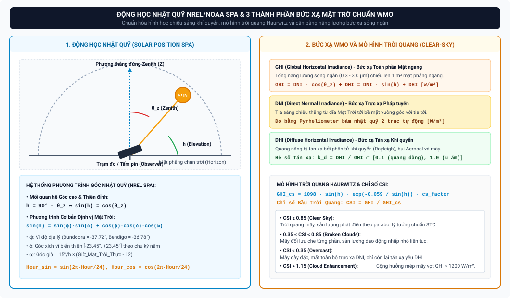

---

### 2.5. Các Biến Khí quyển Tác động từ ERA5-Land Reanalysis [13]
Dữ liệu khí tượng thu thập qua Open-Meteo REST API kế thừa từ mô hình tái phân tích toàn cầu **ERA5-Land** của Trung tâm Dự báo Thời tiết Hạn vừa Châu Âu (ECMWF) với độ phân giải lưới không gian $9\,\text{km}$ [13], cung cấp 8 biến vật lý chuẩn WMO chu kỳ 1 giờ ($850.752$ bản ghi):

| STT | Biến Khí quyển | Ký hiệu & Đơn vị | Độ cao Quy chuẩn | Cơ chế Vật lý Tác động đến Sản lượng Điện Mặt Trời |
| :---: | :--- | :---: | :---: | :--- |
| **1** | Bức xạ Toàn phần | $GHI$ ($\text{W/m}^2$) | Mặt đất | Quyết định trực tiếp dòng quang sinh $I_{\text{ph}}$ và sản lượng điện $E_{\text{actual}}$ phát ra. |
| **2** | Bức xạ Trực xạ | $DNI$ ($\text{W/m}^2$) | Pháp tuyến | Phản ánh mức độ trong suốt của khí quyển; quyết định hiệu suất quang phổ. |
| **3** | Bức xạ Tán xạ | $DHI$ ($\text{W/m}^2$) | Mặt đất | Đóng góp năng lượng chủ yếu vào những ngày trời nhiều mây và góc chiếu thấp. |
| **4** | Nhiệt độ Không khí | $T_{\text{amb}}$ ($^\circ\text{C}$) | $2\,\text{m}$ | Làm tăng nhiệt độ tế bào $T_{\text{cell}}$, gây sụt giảm điện áp hở mạch và suy hao công suất. |
| **5** | Tốc độ Gió | $v_{\text{wind}}$ ($\text{m/s}$) | $10\,\text{m}$ | Tản nhiệt đối lưu cưỡng bức làm mát bề mặt tấm pin, giúp hạ $T_{\text{cell}}$ và hồi phục hiệu suất. |
| **6** | Độ che phủ Mây Tổng | $Cloud\ Cover$ ($\%$) | Toàn cột khí quyển | Tỷ lệ phần trăm bầu trời bị mây che phủ; tương quan nghịch mạnh với $GHI$. |
| **7** | Mây Tầng Thấp | $Low\ Clouds$ ($\%$) | $< 2\,\text{km}$ | Mây tích và mây tầng thấp có mật độ nước cao nhất, gây tán xạ và cản trở bức xạ mạnh nhất. |
| **8** | Thời lượng Nắng | $Sunshine$ ($\text{s}$) | Cấp giờ ($0-3600\text{s}$) | Tổng số giây trong 1 giờ có cường độ trực xạ $DNI \ge 120\,\text{W/m}^2$ theo chuẩn WMO. |

---

### 2.6. BỘ BÀI TẬP VẬN DỤNG & THỰC HÀNH CHUYÊN SÂU (UNIT 2 HOMEWORK ASSIGNMENTS)

> **Mục tiêu thực hành:** Nắm vững động học nhật quỹ và cơ chế quang học khí quyển; làm chủ kỹ thuật Feature Engineering lượng giác và căn chỉnh thời gian nhân quả; giải thích các hiện tượng khí tượng vi mô tại 5 campus phục vụ huấn luyện mô hình học máy.

```
┌────────────────────────────────────────────────────────────────────────────────────────────────────────┐
│                                 MA TRẬN PHÂN CẤP BÀI TẬP UNIT 2                                        │
├─────────┬──────────────────────┬──────────────────────────────────────────┬────────────────────────────┤
│ Bài tập │ Cấp độ (Level)       │ Trọng tâm Kiến thức                      │ Dạng bài / Kỹ năng Đầu ra  │
├─────────┼──────────────────────┼──────────────────────────────────────────┼────────────────────────────┤
│ Bài 2.1 │ Level 1: Dễ          │ Bức xạ WMO & Cloud Enhancement Effect    │ Bản chất Vật lý Quang học  │
│ Bài 2.2 │ Level 2: Trung bình  │ Động học Vị trí Mặt Trời (NREL SPA)      │ Tính toán Hình học Nhật quỹ│
│ Bài 2.3 │ Level 3: Khá         │ Mô hình Trời quang Haurwitz & CSI        │ Định lượng Trạng thái Trời │
│ Bài 2.4 │ Level 4: Giỏi        │ Feature Engineering & Floor-Hour Lookup  │ Viết Pipeline Python ML    │
│ Bài 2.5 │ Level 5: Nâng cao    │ Tương quan Đa biến & Nghịch lý Mùa đông  │ Phân tích Khí quyển Đa biến│
└─────────┴──────────────────────┴──────────────────────────────────────────┴────────────────────────────┘
```

#### BÀI 2.1 (LEVEL 1 - DỄ): PHÂN LOẠI BỨC XẠ WMO VÀ HIỆU ỨNG HỘI TỤ MÉP MÂY (CLOUD ENHANCEMENT)

*   **Bối cảnh:** Trong tập dữ liệu khí tượng ERA5-Land tích hợp vào hệ thống, các nhà phân tích ghi nhận vào một số buổi trưa mùa xuân tại Campus Bundoora, giá trị bức xạ tức thời $GHI$ vọt lên tới $1.250\,\text{W/m}^2$, vượt qua cả hằng số bức xạ ngoài khí quyển ($G_{\text{sc}} = 1.361\,\text{W/m}^2$) sau khi đã trừ suy hao khí quyển, khiến chỉ số trời quang $CSI = \frac{GHI}{GHI_{\text{cs}}}$ đạt tới $1{,}28$.
*   **Yêu cầu:**
    1. Trình bày phương trình cân bằng năng lượng bức xạ WMO giữa $GHI, DNI, DHI$ và nêu tên thiết bị đo lường tiêu chuẩn cho từng thành phần.
    2. Giải thích cơ chế vật lý quang học của hiện tượng "Hội tụ phản xạ mép mây" (Cloud Enhancement Effect).
    3. Tại sao khi xây dựng module tiền xử lý dữ liệu (Data Cleansing Pipeline), kỹ sư dữ liệu tuyệt đối **KHÔNG ĐƯỢC** gán nhãn giá trị $GHI = 1.250\,\text{W/m}^2$ là lỗi cảm biến để xóa bỏ? Hậu quả đối với mô hình dự báo nếu điểm dữ liệu này bị xóa là gì?
*   **Hướng dẫn giải & Đáp án chi tiết:**
    1. *Phương trình cân bằng bức xạ WMO:*
       $$GHI = DNI \cdot \sin(h) + DHI = DNI \cdot \cos(\theta_z) + DHI$$
       * *GHI (Toàn phần mặt ngang):* Đo bằng Pyranometer Class A (ISO 9060).
       * *DNI (Trực xạ pháp tuyến):* Đo bằng Nhật xạ kế Pyrheliometer gắn trên hệ thống bám nhật quỹ 2 trục.
       * *DHI (Tán xạ mặt ngang):* Đo bằng Pyranometer có gắn Vòng chắn bóng (Shading Ring/Ball) để che đĩa Mặt Trời.
    2. *Cơ chế Cloud Enhancement Effect:*
       * Xảy ra khi bầu trời có các đám mây tích đối lưu (Cumulus clouds) phân tán rải rác xung quanh đĩa Mặt Trời nhưng không che khuất trực tiếp đường truyền tia sáng tới cảm biến.
       * Tia sáng trực xạ $DNI$ từ Mặt Trời đi qua khe mây rọi thẳng xuống tấm pin kết hợp đồng thời với bức xạ khuếch tán bị tán xạ chuyển tiếp (Forward Scattering) và phản xạ nhiều lần từ các mép mây dày bao quanh hội tụ lại cùng một điểm đo trên mặt đất.
       * Sự cộng hưởng quang học này tạo ra một "thấu kính tự nhiên", đẩy cường độ $GHI$ đo được vọt lên $1.150 - 1.350\,\text{W/m}^2$ trong khoảng thời gian ngắn từ vài phút đến nửa giờ.
    3. *Hậu quả nếu xóa bỏ dữ liệu:*
       * Đây là hiện tượng vật lý hoàn toàn có thật. Trong các thời điểm này, sản lượng điện thực tế $E_{\text{actual}}$ của các mảng pin cũng tăng vọt tương ứng theo cường độ bức xạ cực đại.
       * Nếu thuật toán lọc ngoại lai máy móc xóa các bản ghi này, mô hình Machine Learning sẽ bị huấn luyện trên dữ liệu thiếu hụt cực trị (Truncated distribution), dẫn đến việc mô hình đánh giá thấp công suất đỉnh phát ra của hệ thống và gây ra sai số dự báo phụ tải đỉnh cho lưới điện.
*   **Ý nghĩa áp dụng dự án:** Giúp nhóm hoàn thiện tiêu chí kiểm định chất lượng dữ liệu trong Lớp 2 (Data Exploration & Audit Layer), phân biệt chính xác giữa dị thường vật lý tự nhiên và lỗi phần cứng cảm biến.

---

#### BÀI 2.2 (LEVEL 2 - TRUNG BÌNH): TÍNH TOÁN ĐỘNG HỌC NHẬT QUỸ NREL SPA VÀ ĐỘ LỆCH GIỜ MẶT TRỜI

*   **Bối cảnh:** Campus Mildura tọa lạc tại vị trí cực tây của dự án UNISOLAR với tọa độ địa lý: Vĩ độ $\phi = -34{,}22^\circ$ (Nam bán cầu mang dấu âm), Kinh độ $\lambda = 142{,}15^\circ\,\text{E}$. Bang Victoria sử dụng giờ chuẩn Đông Úc (AEST, $\text{UTC}+10$), tương ứng kinh tuyến giờ chuẩn $\text{LSTM} = 15^\circ \times 10 = 150^\circ\,\text{E}$.
*   **Yêu cầu:** Vào ngày Hạ chí Nam bán cầu ($n = 355$ - ngày 21/12, góc xích vĩ $\delta = -23{,}45^\circ$, phương trình thời gian $\text{EoT} \approx +1{,}5\,\text{phút}$):
    1. Tính Giờ Mặt Trời Thực tế ($t_{\text{solar}}$) tại Mildura khi đồng hồ dân dụng chỉ đúng $12:00$ trưa giờ AEST. Mặt Trời đạt đỉnh trưa quang học ($t_{\text{solar}} = 12\,\text{h}$) sớm hơn hay muộn hơn giờ đồng hồ bao nhiêu phút?
    2. Tính góc giờ mặt trời ($\omega$) tại thời điểm $12:00$ trưa giờ AEST.
    3. Tính góc cao mặt trời cực đại ($h_{\text{max}}$) và góc thiên đỉnh ($\theta_z$) khi Mặt Trời đạt đỉnh giữa trưa quang học ($\omega = 0^\circ$). So sánh với Campus Bundoora ($\phi = -37{,}72^\circ$).
*   **Hướng dẫn giải & Đáp án chi tiết:**
    1. *Tính Giờ Mặt Trời Thực tế ($t_{\text{solar}}$):*
       $$t_{\text{solar}} = t_{\text{standard}} + \frac{4 \cdot (\text{Longitude} - \text{LSTM}) + \text{EoT}}{60}$$
       $$t_{\text{solar}} = 12{,}0 + \frac{4 \cdot (142{,}15 - 150) + 1{,}5}{60} = 12{,}0 + \frac{4 \cdot (-7{,}85) + 1{,}5}{60} = 12{,}0 + \frac{-31{,}4 + 1{,}5}{60}$$
       $$t_{\text{solar}} = 12{,}0 - \frac{29{,}9}{60} = 12{,}0 - 0{,}4983\,\text{h} = 11{,}5017\,\text{h} \quad (\approx 11\text{h}30\text{p}06\text{s})$$
       *Nhận xét:* Tại Mildura, khi đồng hồ chỉ 12:00 trưa thì Giờ Mặt Trời mới đạt $11\text{h}30\text{p}$. Như vậy, Mặt Trời đạt đỉnh trưa quang học **muộn hơn giờ đồng hồ dân dụng $29{,}9\,\text{phút}$** ($\approx 30\,\text{phút}$).
    2. *Tính góc giờ ($\omega$) lúc 12:00 AEST:*
       $$\omega = 15^\circ/\text{h} \cdot (t_{\text{solar}} - 12) = 15^\circ \cdot (11{,}5017 - 12) = 15^\circ \cdot (-0{,}4983) \approx -7{,}475^\circ$$
       *(Dấu âm thể hiện Mặt Trời đang ở phía Đông kinh tuyến địa phương, chuẩn bị tiến về đỉnh trưa)*.
    3. *Tính góc cao cực đại $h_{\text{max}}$ lúc giữa trưa quang học ($\omega = 0^\circ$):*
       $$\sin(h_{\text{max}}) = \sin(\phi)\sin(\delta) + \cos(\phi)\cos(\delta)\cos(0^\circ)$$
       $$\sin(h_{\text{max}}) = \sin(-34{,}22^\circ)\sin(-23{,}45^\circ) + \cos(-34{,}22^\circ)\cos(-23{,}45^\circ)$$
       $$\sin(h_{\text{max}}) = (-0{,}5624) \times (-0{,}3979) + (0{,}8269) \times (0{,}9174) = 0{,}2238 + 0{,}7586 = 0{,}9824$$
       $$h_{\text{max}} = \arcsin(0{,}9824) \approx 79{,}24^\circ$$
       $$\theta_z = 90^\circ - 79{,}24^\circ = 10{,}76^\circ$$
       * *So sánh với Bundoora ($\phi = -37{,}72^\circ$):*
         $$\sin(h_{\text{max, Bundoora}}) = \sin(-37{,}72^\circ)\sin(-23{,}45^\circ) + \cos(-37{,}72^\circ)\cos(-23{,}45^\circ)$$
         $$\sin(h_{\text{max, Bundoora}}) = (-0{,}6118)(-0{,}3979) + (0{,}7910)(0{,}9174) = 0{,}2434 + 0{,}7257 = 0{,}9691 \implies h_{\text{max}} \approx 75{,}73^\circ$$
       * *Kết luận:* Campus Mildura ở vĩ độ thấp hơn (gần xích đạo hơn Bundoora $3{,}5^\circ$), Mặt Trời lên cao hơn ($79{,}24^\circ$ vs $75{,}73^\circ$), dẫn đến góc tới vuông góc hơn và mật độ bức xạ quang học trên $1\,\text{m}^2$ mặt đất cao hơn.
*   **Ý nghĩa áp dụng dự án:** Giải thích tại sao đường cong sản lượng điện chuỗi thời gian của 5 campus lại có đỉnh nhọn bị lệch pha thời gian so với nhau trên Tableau Dashboard 1.

---

#### BÀI 2.3 (LEVEL 3 - KHÁ): ĐÁNH GIÁ ĐỘ TRONG SUỐT KHÍ QUYỂN VỚI MÔ HÌNH HAURWITZ & CSI

*   **Bối cảnh:** Vào lúc $13:00$ ngày 15/01/2021 tại Campus Bendigo ($\phi = -36{,}78^\circ$, góc cao mặt trời tính được là $h = 65^\circ \implies \sin(h) \approx 0{,}9063$), trạm quan trắc ghi nhận các thông số:
    * Bức xạ toàn phần mặt ngang: $GHI = 860\,\text{W/m}^2$.
    * Bức xạ tán xạ mặt ngang: $DHI = 180\,\text{W/m}^2$.
    * Hệ số hiệu chỉnh địa hình vùng Bendigo: $\text{cs\_factor}_{\text{Bendigo}} = 1{,}02$.
*   **Yêu cầu:**
    1. Áp dụng mô hình Haurwitz để tính toán bức xạ trời quang lý thuyết $GHI_{\text{cs}}$.
    2. Tính chỉ số trời quang $CSI$ (Clear-Sky Index) và hệ số tán xạ khí quyển $k_d$ (Diffuse Fraction).
    3. Dựa trên phân loại chuẩn WMO/Ineichen, hãy xác định trạng thái khí quyển của bầu trời tại thời điểm đó. Tính cường độ bức xạ trực xạ pháp tuyến $DNI$ rọi tới mặt pin.
*   **Hướng dẫn giải & Đáp án chi tiết:**
    1. *Tính bức xạ trời quang Haurwitz ($GHI_{\text{cs}}$):*
       $$GHI_{\text{cs}} = 1098 \cdot \sin(h) \cdot \exp\left(-\frac{0{,}059}{\sin(h)}\right) \cdot \text{cs\_factor}_{\text{site}}$$
       $$GHI_{\text{cs}} = 1098 \cdot 0{,}9063 \cdot \exp\left(-\frac{0{,}059}{0{,}9063}\right) \cdot 1{,}02$$
       $$GHI_{\text{cs}} = 995{,}12 \cdot \exp(-0{,}06509) \cdot 1{,}02 = 995{,}12 \cdot 0{,}9370 \cdot 1{,}02 \approx 951{,}1\,\text{W/m}^2$$
    2. *Tính $CSI$ và $k_d$:*
       * Chỉ số trời quang:
         $$CSI = \frac{GHI}{GHI_{\text{cs}}} = \frac{860\,\text{W/m}^2}{951{,}1\,\text{W/m}^2} \approx 0{,}9042$$
       * Hệ số tán xạ:
         $$k_d = \frac{DHI}{GHI} = \frac{180\,\text{W/m}^2}{860\,\text{W/m}^2} \approx 0{,}2093 \quad (20{,}93\%)$$
    3. *Đánh giá trạng thái khí quyển & Tính $DNI$:*
       * Vì $CSI = 0{,}9042 \ge 0{,}85$ và $k_d = 20{,}93\% \le 25\%$, bầu trời ở trạng thái **Trời hoàn toàn quang đãng (Clear-Sky)**, không bị mây che phủ, năng lượng chủ yếu đến từ chùm tia trực xạ.
       * Bức xạ trực xạ pháp tuyến $DNI$:
         $$GHI = DNI \cdot \sin(h) + DHI \implies DNI = \frac{GHI - DHI}{\sin(h)}$$
         $$DNI = \frac{860 - 180}{0{,}9063} = \frac{680}{0{,}9063} \approx 750{,}3\,\text{W/m}^2$$
*   **Ý nghĩa áp dụng dự án:** Cung cấp thuật toán tính toán 2 trường phái sinh quan trọng `csi` và `diffuse_fraction` trong tầng Silver DWH, phục vụ phân luồng dữ liệu trời trong vs mây đối lưu trước khi đưa vào mô hình máy học.

---

#### BÀI 2.4 (LEVEL 4 - GIỎI): LẬP TRÌNH PYTHON FEATURE ENGINEERING VÀ TRIỆT TIÊU RÒ RỈ DỮ LIỆU

*   **Bối cảnh:** Trong đường ống tiền xử lý dữ liệu Lớp 3, bạn được giao nhiệm vụ xây dựng hàm Feature Engineering nhận đầu vào là chuỗi dữ liệu 15 phút thô từ các đồng hồ đo thông minh và ghép nối với dữ liệu thời tiết 1 giờ từ Open-Meteo API.
*   **Yêu cầu:**
    1. Viết hàm Python `engineer_cyclical_and_causal_features(df_telemetry, df_weather, site_lat)` thực thi trọn vẹn 3 nhiệm vụ:
       * **Nhiệm vụ 1:** Tạo 4 cột lượng giác: `hour_sin`, `hour_cos`, `month_sin`, `month_cos`.
       * **Nhiệm vụ 2:** Tạo cột `weather_lookup_hour` bằng cách làm tròn sàn thời gian về đầu giờ (**Floor-Hour Lookup**) để thực hiện phép `LEFT JOIN` với bảng thời tiết.
       * **Nhiệm vụ 3:** Tính toán giá trị xấp xỉ $\sin(h)$ của góc cao mặt trời và bổ sung cột `sin_solar_elevation`.
    2. Giải thích tại sao nếu sử dụng phương pháp làm tròn thời gian thông thường `round('H')` (ví dụ $09:45 \to 10:00$) thì sẽ gây ra lỗi rò rỉ dữ liệu (*Data Leakage*) và vi phạm nguyên lý nhân quả trong phân tích chuỗi thời gian thực tế?
*   **Hướng dẫn giải & Đáp án chi tiết:**
    1. *Mã nguồn Python hoàn chỉnh:*
       ```python
       import numpy as np
       import pandas as pd

       def engineer_cyclical_and_causal_features(df_telemetry, df_weather, site_lat=-37.72):
           """
           Thực thi Feature Engineering chuẩn mực: Cyclical Encoding + Floor-Hour Causal Lookup + Solar Position
           """
           df = df_telemetry.copy()
           df['time_id'] = pd.to_datetime(df['time_id'])
           
           # 1. Cyclical Encoding (Mã hóa chu kỳ lượng giác 2D)
           hours = df['time_id'].dt.hour + df['time_id'].dt.minute / 60.0
           months = df['time_id'].dt.month
           
           df['hour_sin'] = np.sin(2 * np.pi * hours / 24.0)
           df['hour_cos'] = np.cos(2 * np.pi * hours / 24.0)
           df['month_sin'] = np.sin(2 * np.pi * months / 12.0)
           df['month_cos'] = np.cos(2 * np.pi * months / 12.0)
           
           # 2. Floor-Hour Causal Lookup (Bảo toàn nguyên lý nhân quả tuyệt đối Delta_t <= 0)
           df['weather_lookup_hour'] = df['time_id'].dt.floor('h')
           
           # Merge với bảng thời tiết ERA5-Land (tần suất 1 giờ)
           df_weather['time_hour'] = pd.to_datetime(df_weather['time_hour'])
           df_merged = pd.merge(df, df_weather, left_on='weather_lookup_hour', right_on='time_hour', how='left')
           
           # 3. Tính toán góc cao Nhật quỹ NREL SPA xấp xỉ (sin_solar_elevation)
           day_of_year = df['time_id'].dt.dayofyear
           gamma = 2 * np.pi * (day_of_year - 1 + (hours - 12) / 24.0) / 365.0
           declination = 0.006918 - 0.399912 * np.cos(gamma) + 0.070257 * np.sin(gamma)
           hour_angle = (hours - 12.0) * (np.pi / 12.0)
           lat_rad = np.radians(site_lat)
           
           sin_h = np.sin(lat_rad) * np.sin(declination) + np.cos(lat_rad) * np.cos(declination) * np.cos(hour_angle)
           df_merged['sin_solar_elevation'] = np.clip(sin_h, 0, 1) # Giới hạn [0, 1] khi mặt trời lặn
           
           return df_merged
       ```
    2. *Giải thích Data Leakage & Tính Nhân quả:*
       * Trong hệ thống giám sát vận hành thực tế tại thời điểm $09:45$, biến tần chỉ mới hoạt động và ghi nhận dữ liệu đo đếm của quá khứ ($09:30 - 09:45$). Trạng thái khí quyển của tương lai tại mốc $10:00$ (nhiệt độ, độ che phủ mây, bức xạ) chưa hề xảy ra.
       * Nếu dùng `round('H')`, mốc $09:45$ bị làm tròn tiến lên $10:00$, đồng nghĩa với việc đưa thông tin khí quyển của tương lai vào mô hình tại thời điểm hiện tại. Mô hình học máy khi đó sẽ đạt độ chính xác ảo cực cao trong tập kiểm thử nhưng sẽ sụp đổ hoàn toàn khi triển khai dự báo thời gian thực (*Production Failures*).
       * Cơ chế **Floor-Hour Lookup** ($09:45 \to 09:00$) đảm bảo $\Delta t = t_{\text{weather}} - t_{\text{telemetry}} \le 0$, tuân thủ nguyên lý nhân quả vật lý nghiêm ngặt.
*   **Ý nghĩa áp dụng dự án:** Đây là giải pháp kỹ thuật cốt lõi giúp nhóm bảo vệ thành công Thách thức Kỹ thuật số 1 trước Hội đồng Đánh giá Đồ án.

---

#### BÀI 2.5 (LEVEL 5 - NÂNG CAO): PHÂN TÍCH TƯƠNG QUAN ĐA BIẾN ERA5-LAND & NGHỊCH LÝ MÙA ĐÔNG

*   **Bối cảnh:** Bảng ma trận hệ số tương quan Pearson giữa 8 biến khí quyển ERA5-Land và sản lượng `energy_kwh` tại Campus Albury-Wodonga cho kết quả:
    * `GHI`: $+0{,}94$ | `Low Clouds`: $-0{,}82$ | `Cloud Cover Total`: $-0{,}71$
    * `Sunshine Duration`: $+0{,}86$ | `DNI`: $+0{,}79$ | `Air Temperature`: $+0{,}38$ | `Wind Speed`: $+0{,}21$
*   **Yêu cầu:**
    1. Tại sao tương quan nghịch của `Low Clouds` ($-0{,}82$) lại mạnh hơn đáng kể so với `Cloud Cover Total` ($-0{,}71$)?
    2. Tại sao `Air Temperature` chỉ có tương quan dương vừa phải ($+0{,}38$) dù mùa hè có tổng sản lượng điện cao hơn mùa đông rất nhiều?
    3. **Nghịch lý Mùa đông (Winter Cold-Bright Anomaly):** Vào một ngày mùa đông tháng 7 tại Albury-Wodonga trời quang ($GHI = 750\,\text{W/m}^2, T_{\text{amb}} = 8^\circ\text{C}, v_{\text{wind}} = 4\,\text{m/s}$), hệ thống ghi nhận hiệu suất phát điện tức thời cao hơn $12\%$ so với một ngày mùa hè tháng 1 có cùng mức bức xạ ($GHI = 750\,\text{W/m}^2, T_{\text{amb}} = 39^\circ\text{C}, v_{\text{wind}} = 1\,\text{m/s}$). Hãy dùng mô hình nhiệt độ mảng pin Sandia để chứng minh hiện tượng này bằng toán học.
*   **Hướng dẫn giải & Đáp án chi tiết:**
    1. *Tác động của Low Clouds:*
       * Mây tầng thấp ($< 2\,\text{km}$, mây tích Cumulus, mây tầng Stratus) có mật độ hạt nước lỏng cực cao và độ dày quang học lớn ($\tau > 30$), gây tán xạ Mie cực mạnh và hấp thụ gần như toàn bộ chùm tia trực xạ $DNI$.
       * Ngược lại, `Cloud Cover Total` bao gồm cả mây tầng cao ($> 6\,\text{km}$, mây ti Cirrus) cấu tạo từ các tinh thể băng mỏng với độ dày quang học rất nhỏ ($\tau < 2$), cho phép phần lớn tia nắng mặt trời xuyên qua thẳng xuống đất. Do đó, `Low Clouds` là yếu tố cản trở sản lượng quang điện mạnh nhất.
    2. *Cơ chế của Air Temperature:*
       * Nhiệt độ không khí mang tính "con dao hai lưỡi": Mùa hè nhiệt độ cao đi kèm với ngày dài và bức xạ lớn (tương quan dương); tuy nhiên, nhiệt độ cao lại trực tiếp kích thích suy hao nhiệt bán dẫn (Thermal Derating làm mất $-0{,}35\%/^\circ\text{C}$ công suất). Hai tác động triệt tiêu lẫn nhau khiến tương quan tổng thể chỉ đạt $+0{,}38$.
    3. *Chứng minh Toán học Nghịch lý Mùa đông:*
       * Áp dụng mô hình nhiệt độ tế bào Sandia: $T_{\text{cell}} = T_{\text{amb}} + GHI \cdot \exp(a + b \cdot v_{\text{wind}}) + \frac{GHI}{1000} \cdot \Delta T$ (với $a = -3{,}47, b = -0{,}0594, \Delta T = 3^\circ\text{C}$).
       * *Trường hợp 1 - Ngày mùa đông ($T_{\text{amb}} = 8^\circ\text{C}, v_{\text{wind}} = 4\,\text{m/s}$):*
         $$T_{\text{cell, winter}} = 8 + 750 \cdot \exp(-3{,}47 - 0{,}0594 \cdot 4) + 0{,}75 \cdot 3$$
         $$T_{\text{cell, winter}} = 8 + 750 \cdot \exp(-3{,}7076) + 2{,}25 = 8 + 750 \cdot 0{,}02454 + 2{,}25 \approx 8 + 18{,}40 + 2{,}25 = 28{,}65^\circ\text{C}$$
         *Độ lệch nhiệt độ:* $\Delta T_{\text{winter}} = 28{,}65 - 25 = 3{,}65^\circ\text{C}$.
         *Suy hao công suất:* $\text{Loss}_{\text{winter}} = -0{,}35\% \times 3{,}65^\circ\text{C} = -1{,}28\%$.
       * *Trường hợp 2 - Ngày mùa hè ($T_{\text{amb}} = 39^\circ\text{C}, v_{\text{wind}} = 1\,\text{m/s}$):*
         $$T_{\text{cell, summer}} = 39 + 750 \cdot \exp(-3{,}47 - 0{,}0594 \cdot 1) + 0{,}75 \cdot 3$$
         $$T_{\text{cell, summer}} = 39 + 750 \cdot \exp(-3{,}5294) + 2{,}25 = 39 + 750 \cdot 0{,}02932 + 2{,}25 \approx 39 + 21{,}99 + 2{,}25 = 63{,}24^\circ\text{C}$$
         *Độ lệch nhiệt độ:* $\Delta T_{\text{summer}} = 63{,}24 - 25 = 38{,}24^\circ\text{C}$.
         *Suy hao công suất:* $\text{Loss}_{\text{summer}} = -0{,}35\% \times 38{,}24^\circ\text{C} = -13{,}38\%$.
       * *Chênh lệch hiệu suất phát tức thời:*
         $$\Delta \eta = (-1{,}28\%) - (-13{,}38\%) = +12{,}10\%$$
       * *Kết luận:* Cùng nhận được $750\,\text{W/m}^2$, nhưng tấm pin mùa đông lạnh mát hơn $34{,}6^\circ\text{C}$, giúp điện áp $V_{\text{oc}}$ không bị sụt giảm và hệ thống phát điện hiệu quả hơn **$+12{,}10\%$**.
*   **Ý nghĩa áp dụng dự án:** Chứng minh cho Hội đồng thấy tầm quan trọng bắt buộc của việc tích hợp biến nhiệt độ viễn thám và tốc độ gió từ ERA5-Land vào mô hình học máy thay vì chỉ dựa vào biến bức xạ thô.

---

## UNIT 3: Bộ Chỉ số Đo lường Hiệu năng Cốt lõi (Solar Analytics KPI Framework)

### 3.1. Hệ số Hiệu suất (Performance Ratio - PR) chuẩn IEC 61724-1 [14]
Theo tiêu chuẩn quốc tế **IEC 61724-1:2021** [14], $PR$ là chỉ số chuẩn mực toàn cầu dùng để đánh giá chất lượng vận hành và độ hoàn thiện của hệ thống điện mặt trời độc lập với quy mô công suất và vị trí địa lý:

$$\text{PR} = \frac{Y_f}{Y_r} = \frac{\frac{E_{\text{actual}}}{P_{\text{stc}}}}{\frac{H_{\text{total}}}{G_{\text{STC}}}} = \frac{E_{\text{actual}}}{P_{\text{stc}} \cdot \left(\frac{GHI}{1000\,\text{W/m}^2}\right) \cdot \Delta t} \times 100\%$$

*Trong đó [14]:*
*   $Y_f$ (Final Yield - Năng suất Thực phát): $Y_f = \frac{E_{\text{actual}}}{P_{\text{stc}}}$ (đơn vị: $\text{kWh/kWp}$ hoặc giờ phát tương đương ở công suất cực đại).
*   $Y_r$ (Reference Yield - Năng suất Tham chiếu): $Y_r = \frac{\sum GHI \cdot \Delta t}{1000\,\text{W/m}^2}$ (đơn vị: $\text{Peak Sun Hours - PSH}$).
*   $P_{\text{stc}}$: Tổng công suất thiết kế định mức ở điều kiện STC ($\text{kWp}$).
*   $\Delta t$: Khoảng thời gian chu kỳ đo lường ($0{,}25\,\text{h}$ đối với chu kỳ 15 phút, hoặc $1\,\text{h}$ đối với cấp giờ).

*   **Bộ Ngưỡng Đánh giá Hiệu năng Vận hành theo PR [14]:**
    *   **$PR \ge 78\%$ (Tối ưu - Class A):** Hệ thống vận hành ở trạng thái xuất sắc, suy hao thấp, thiết bị đồng bộ hoàn hảo.
    *   **$65\% \le PR < 78\%$ (Trung bình - Class B):** Vận hành chấp nhận được nhưng chịu ảnh hưởng suy hao nhiệt độ mùa hè hoặc bám bụi nhẹ.
    *   **$PR < 65\%$ (Kém / Cảnh báo - Class C):** Hệ thống có dị thường nghiêm trọng (hỏng biến tần, đứt cầu chì chuỗi, che bóng cục bộ nặng).
*   **Quy tắc Lọc Dữ liệu Đo đếm ($GHI \ge 100\,\text{W/m}^2$) [14]:** Chỉ thực hiện tính toán $PR$ khi cường độ bức xạ vượt ngưỡng $100\,\text{W/m}^2$. Khi trời sáng sớm hoặc chiều muộn ($GHI < 100\,\text{W/m}^2$), biến tần chưa đạt điện áp khởi động (Startup Voltage), hiệu suất biến đổi phi tuyến và sai số góc tới của cảm biến quang học sẽ làm giá trị $PR$ bị méo mó giả tạo.

---

### 3.2. Hệ số Hiệu suất Hiệu chỉnh Nhiệt độ (Temperature-Corrected PR) [14, 15]
Vào mùa hè, nhiệt độ bề mặt tấm pin tăng cao làm điện áp sụt giảm, khiến $PR$ danh định giảm tự nhiên $5\% - 10\%$ dù thiết bị hoàn toàn bình thường. Phụ lục B của tiêu chuẩn **IEC 61724-1** [14] và phương pháp chuẩn hóa của NREL [15] quy định công thức hiệu chỉnh nhiệt độ về mốc $25^\circ\text{C}$:

$$\text{PR}_{\text{corr}} = \frac{E_{\text{actual}}}{P_{\text{stc}} \cdot \left(\frac{GHI}{1000}\right) \cdot \Delta t \cdot \left[1 + \gamma \cdot (T_{\text{cell}} - 25^\circ\text{C})\right]} \times 100\%$$

*(với $\gamma$ là hệ số suy giảm công suất theo nhiệt độ của tấm pin, đơn vị: $\%/^\circ\text{C}$, ví dụ $\gamma = -0{,}35\%/^\circ\text{C}$)* [1, 14].

*   **Giá trị cho Phân tích Dữ liệu Dài hạn:** Chỉ số $PR_{\text{corr}}$ loại bỏ hoàn toàn ảnh hưởng mùa vụ thời tiết, cho phép Data Analyst theo dõi chính xác **tốc độ thoái hóa thực tế của vật liệu bán dẫn qua từng năm** (Degradation Rate, thông thường $< 0{,}5\%/\text{năm}$).


---

### 3.3. Năng suất Riêng (Specific Yield) & Hệ số Công suất (Capacity Factor) [14, 15]
*   **Năng suất Riêng (Specific Yield - $Y_f$) [14, 15]:**
    $$Y_f = \frac{\sum E_{\text{actual}}}{P_{\text{stc}}} \quad (\text{kWh/kWp/ngày hoặc kWh/kWp/năm})$$
    Cho phép so sánh trực tiếp hiệu quả phát điện giữa trạm nhỏ $10\,\text{kWp}$ và mảng trạm lớn $320\,\text{kWp}$. Tại bang Victoria (Úc), $Y_f$ trung bình đạt $3{,}8 - 4{,}5\,\text{kWh/kWp/ngày}$ vào mùa hè và $1{,}8 - 2{,}4\,\text{kWh/kWp/ngày}$ vào mùa đông.
*   **Hệ số Công suất (Capacity Factor - $CF$) [15]:**
    Tỷ lệ giữa sản lượng thực tế sản sinh trong một chu kỳ thời gian (ví dụ 1 năm $8760\,\text{h}$) so với sản lượng lý thuyết nếu trạm chạy liên tục $100\%$ công suất định mức:
    $$\text{CF} = \frac{\sum E_{\text{actual}}}{P_{\text{stc}} \cdot 8760\,\text{h}} \times 100\%$$
    Do tính chu kỳ ngày/đêm và thời tiết nhiều mây, $CF$ của hệ thống điện mặt trời trên thế giới thường nằm trong dải **$15\% - 22\%$** (tại dự án UNISOLAR đạt trung bình **$15{,}2\%$**).

---

### 3.4. Chỉ số Kinh tế & Tác động Giảm phát thải Khí nhà kính [16, 17]
*   **Mô hình Tiết kiệm Chi phí & Biểu giá Điện FiT [17]:**
    *   Doanh thu tự dùng và hòa lưới: $\text{Savings (AUD)} = E_{\text{actual}} \times \text{Tariff}_{\text{AUD/kWh}}$.
    *   Thị trường Điện Quốc gia Úc (AEMO NEM) áp dụng cơ chế thanh toán bù trừ 5 phút và ghi nhận hiện tượng giá bán buôn âm vào giữa trưa khi năng lượng tái tạo chiếm tỷ trọng lớn trong hệ thống truyền tải [17].
*   **Hệ số Giảm phát thải Khí nhà kính Quốc gia Úc (NGA Factors) [16]:**
    Theo Báo cáo Hệ số Kế toán Khí nhà kính Quốc gia của Bộ Biến đổi Khí hậu và Năng lượng Úc (DCCEEW) [16], phát thải Scope 2 gián tiếp từ lưới điện bang Victoria trong giai đoạn 2020-2022 được xác định là $0{,}82\,\text{kg CO}_2\text{-e/kWh}$:
    $$\text{CO}_2\text{ Reduction (kg)} = E_{\text{actual}} \times 0{,}82\,\text{kg CO}_2/\text{kWh}$$
    $$\text{CO}_2\text{ Reduction (Tấn)} = \frac{E_{\text{actual}} \times 0{,}82}{1000}$$
    *Tổng kết dự án UNISOLAR:* Tổng sản lượng $74{,}98\,\text{GWh}$ giúp cắt giảm lũy kế **$61.485\,\text{tấn CO}_2$** và tiết kiệm hơn **$11{,}2\,\text{triệu AUD}$** cho Đại học La Trobe [7, 16].

---

### 3.5. BỘ BÀI TẬP VẬN DỤNG & THỰC HÀNH CHUYÊN SÂU (UNIT 3 HOMEWORK ASSIGNMENTS)

> **Mục tiêu thực hành:** Nắm vững bộ tiêu chuẩn quốc tế IEC 61724-1 về đo lường hiệu năng quang điện; thành thạo tính toán các chỉ số PR danh định, PR hiệu chỉnh nhiệt độ, Specific Yield và Capacity Factor; xây dựng tầng BI Data Mart và đánh giá hiệu quả kinh tế - môi trường của dự án.

```
┌────────────────────────────────────────────────────────────────────────────────────────────────────────┐
│                                 MA TRẬN PHÂN CẤP BÀI TẬP UNIT 3                                        │
├─────────┬──────────────────────┬──────────────────────────────────────────┬────────────────────────────┤
│ Bài tập │ Cấp độ (Level)       │ Trọng tâm Kiến thức                      │ Dạng bài / Kỹ năng Đầu ra  │
├─────────┼──────────────────────┼──────────────────────────────────────────┼────────────────────────────┤
│ Bài 3.1 │ Level 1: Dễ          │ Khái niệm KPI & Quy tắc Lọc IEC 61724-1  │ Bản chất Chuẩn Quốc tế     │
│ Bài 3.2 │ Level 2: Trung bình  │ Tính PR Danh định, Yield & Phân loại     │ Tính toán Định lượng KPI   │
│ Bài 3.3 │ Level 3: Khá         │ Temperature-Corrected PR & Bảo vệ SLA    │ Phân tích Tranh chấp O&M   │
│ Bài 3.4 │ Level 4: Giỏi        │ Calculated Fields Tableau & SQL Data Mart│ Lập trình DDL & BI Metrics │
│ Bài 3.5 │ Level 5: Nâng cao    │ Phân tích Thoái hóa Pin & Đánh giá C-Level│ Quyết định Quản trị Dự án  │
└─────────┴──────────────────────┴──────────────────────────────────────────┴────────────────────────────┘
```

#### BÀI 3.1 (LEVEL 1 - DỄ): KHÁI NIỆM BỘ CHỈ SỐ KPI VÀ QUY TẮC LỌC DỮ LIỆU CHUẨN IEC 61724-1

*   **Bối cảnh:** Tiêu chuẩn quốc tế IEC 61724-1:2021 là bộ khung đo lường bắt buộc được áp dụng trong toàn bộ hệ thống quản trị dữ liệu của dự án UNISOLAR.
*   **Yêu cầu:**
    1. Trình bày định nghĩa, công thức toán học và đơn vị của 4 chỉ số hiệu năng cốt lõi:
       * Hệ số hiệu suất ($PR$).
       * Năng suất thực phát ($Y_f$ - Final Yield).
       * Năng suất tham chiếu ($Y_r$ - Reference Yield).
       * Hệ số công suất ($CF$ - Capacity Factor).
    2. Nêu các ngưỡng phân hạng hiệu năng Class A, Class B và Class C theo tiêu chuẩn IEC 61724-1.
    3. Tại sao IEC 61724-1 quy định bắt buộc phải lọc bỏ các bản ghi có cường độ bức xạ $GHI < 100\,\text{W/m}^2$ khi tính toán hệ số $PR$ trung bình ngày và tháng? Nếu không áp dụng quy tắc lọc này thì biểu đồ $PR$ sẽ bị sai lệch (méo mó) như thế nào vào các khung giờ sáng sớm và chiều muộn?
*   **Hướng dẫn giải & Đáp án chi tiết:**
    1. *Bảng tổng hợp 4 chỉ số cốt lõi:*
       * **Final Yield ($Y_f$):** $Y_f = \frac{E_{\text{actual}}}{P_{\text{stc}}}$ (đơn vị: $\text{kWh/kWp}$ hoặc giờ phát tương đương ở công suất định mức).
       * **Reference Yield ($Y_r$):** $Y_r = \frac{\sum GHI \cdot \Delta t}{1000\,\text{W/m}^2}$ (đơn vị: $\text{kWh/kWp}$ hoặc $\text{Peak Sun Hours - PSH}$).
       * **Performance Ratio ($PR$):** $PR = \frac{Y_f}{Y_r} \times 100\% = \frac{E_{\text{actual}}}{P_{\text{stc}} \cdot \left(\frac{GHI}{1000}\right) \cdot \Delta t} \times 100\%$ (đơn vị: $\%$, không thứ nguyên).
       * **Capacity Factor ($CF$):** $CF = \frac{\sum E_{\text{actual}}}{P_{\text{stc}} \cdot 8760\,\text{h}} \times 100\%$ (đơn vị: $\%$).
    2. *Bộ ngưỡng xếp hạng IEC 61724-1:*
       * **Class A (Tối ưu):** $PR \ge 78\%$.
       * **Class B (Trung bình / Chấp nhận được):** $65\% \le PR < 78\%$.
       * **Class C (Kém / Cảnh báo sự cố):** $PR < 65\%$.
    3. *Giải thích quy tắc lọc $GHI \ge 100\,\text{W/m}^2$:*
       * Vào sáng sớm và chiều tối ($GHI < 100\,\text{W/m}^2$), điện áp mảng pin chưa đạt tới điện áp khởi động ($V_{\text{start}}$) của Inverter, khiến hiệu suất chuyển đổi nghịch lưu rơi xuống vùng phi tuyến rất thấp ($< 70\% - 80\%$).
       * Đồng thời, góc chiếu xiên của tia nắng lúc bình minh/hoàng hôn làm tăng sai số quang học phản xạ (Cosine Error) của cảm biến Pyranometer.
       * Nếu không lọc bỏ ngưỡng này, các chu kỳ sáng sớm/chiều muộn sẽ xuất hiện giá trị $PR$ méo mó (dao động từ $10\% - 40\%$), kéo tụt giá trị $PR$ trung bình của toàn trạm xuống một cách giả tạo, gây ra cảnh báo sai lệch cho hệ thống giám sát.
*   **Ý nghĩa áp dụng dự án:** Quy tắc `GHI >= 100` là mệnh đề lọc `WHERE` bắt buộc trong mọi truy vấn SQL và hàm tính toán tầng BI Data Mart của đề tài.

---

#### BÀI 3.2 (LEVEL 2 - TRUNG BÌNH): TÍNH TOÁN PR DANH ĐỊNH, SPECIFIC YIELD VÀ XẾP HẠNG TRẠM

*   **Bối cảnh:** Trạm Campus Bendigo Education Building (`site_id = 28`) có công suất lắp đặt định mức $P_{\text{stc}} = 65\,\text{kWp}$. Vào một ngày mùa hè nắng đẹp:
    * Đồng hồ đo bức xạ ghi nhận tổng tích lũy bức xạ trong ngày: $H_{\text{total}} = 7{,}20\,\text{kWh/m}^2$ (tương đương $7{,}20\,\text{PSH}$).
    * Đồng hồ đo điện thông minh ghi nhận tổng điện năng AC phát ra trong ngày: $E_{\text{actual}} = 385{,}0\,\text{kWh}$.
*   **Yêu cầu:**
    1. Tính Năng suất Thực phát ($Y_f$, đơn vị $\text{kWh/kWp}$) và Năng suất Tham chiếu ($Y_r$, đơn vị $\text{kWh/kWp}$).
    2. Tính Hệ số Hiệu suất danh định ($PR$) của trạm trong ngày hôm đó. Đối chiếu với tiêu chuẩn IEC 61724-1 để xếp loại trạm thuộc Class A, B hay C.
    3. Giả định trạm duy trì sản lượng trung bình $385\,\text{kWh/ngày}$ đều đặn suốt 365 ngày trong năm. Hãy tính toán Hệ số Công suất hàng năm ($\text{CF}_{\text{annual}}$) của trạm này.
*   **Hướng dẫn giải & Đáp án chi tiết:**
    1. *Tính $Y_f$ và $Y_r$:*
       * Năng suất thực phát:
         $$Y_f = \frac{E_{\text{actual}}}{P_{\text{stc}}} = \frac{385{,}0\,\text{kWh}}{65\,\text{kWp}} \approx 5{,}923\,\text{kWh/kWp/ngày}$$
       * Năng suất tham chiếu:
         $$Y_r = \frac{H_{\text{total}}}{G_{\text{STC}}} = \frac{7{,}20\,\text{kWh/m}^2}{1{,}0\,\text{kW/m}^2} = 7{,}20\,\text{kWh/kWp/ngày} \quad (7{,}20\,\text{PSH})$$
    2. *Tính $PR$ và Xếp hạng:*
       $$PR = \frac{Y_f}{Y_r} \times 100\% = \frac{5{,}923\,\text{kWh/kWp}}{7{,}20\,\text{kWh/kWp}} \times 100\% \approx 82{,}26\%$$
       *Xếp hạng:* Vì $PR = 82{,}26\% \ge 78\%$, trạm Bendigo Site 28 được xếp hạng **Class A (Xuất sắc - Vận hành tối ưu)**.
    3. *Tính Hệ số Công suất hàng năm ($CF$):*
       * Tổng sản lượng dự kiến cả năm: $E_{\text{year}} = 385{,}0\,\text{kWh/ngày} \times 365\,\text{ngày} = 140.525\,\text{kWh/năm}$.
       * Hệ số công suất:
         $$\text{CF} = \frac{E_{\text{year}}}{P_{\text{stc}} \times 8760\,\text{h}} \times 100\% = \frac{140.525\,\text{kWh}}{65\,\text{kWp} \times 8760\,\text{h}} \times 100\% = \frac{140.525}{569.400} \times 100\% \approx 24{,}68\%$$
*   **Ý nghĩa áp dụng dự án:** Cung cấp phương pháp tính chuẩn xác để hiển thị các thẻ chỉ số KPI Card trên giao diện Dashboard 2 (Operational Efficiency).

---

#### BÀI 3.3 (LEVEL 3 - KHÁ): TEMPERATURE-CORRECTED PR VÀ BẢO VỆ HỢP ĐỒNG VẬN HÀNH SLA

*   **Bối cảnh:** Trạm Mildura Arts Centre ($P_{\text{stc}} = 100\,\text{kWp}$, sử dụng pin SunPower Maxeon có hệ số suy hao nhiệt $\gamma = -0{,}35\%/^\circ\text{C}$). Vào một ngày tháng 1 nắng nóng cực đoan tại Mildura ($T_{\text{amb}} = 42^\circ\text{C}, GHI = 980\,\text{W/m}^2, v_{\text{wind}} = 1{,}2\,\text{m/s}$):
    * Trong một chu kỳ 15 phút ($0{,}25\,\text{h}$), đồng hồ ghi nhận sản lượng thực tế $E_{\text{actual}} = 17{,}8\,\text{kWh}$.
    * Cảm biến nhiệt độ bề mặt đo được $T_{\text{cell}} = 67^\circ\text{C}$.
*   **Yêu cầu:**
    1. Tính sản lượng lý thuyết ở điều kiện STC ($E_{\text{theo}}$) trong chu kỳ 15 phút đó.
    2. Tính Hệ số Hiệu suất danh định ($PR_{\text{nominal}}$). Giải thích vì sao $PR_{\text{nominal}}$ lại rơi xuống dưới ngưỡng chuẩn Class A ($< 78\%$).
    3. Áp dụng tiêu chuẩn IEC 61724-1 Phụ lục B để tính Hệ số Hiệu suất Hiệu chỉnh Nhiệt độ ($PR_{\text{corr}}$).
    4. Giả sử hợp đồng dịch vụ O&M giữa trường Đại học La Trobe và nhà thầu bảo trì quy định: *"Nếu hệ số PR của trạm bị giảm xuống dưới $78\%$ trong giờ nắng đỉnh, nhà thầu sẽ bị phạt $500\,\text{AUD/ngày}$ do vi phạm cam kết SLA"*. Dưới góc độ Data Analyst, bạn sẽ sử dụng chỉ số nào để bảo vệ đội ngũ kỹ sư bảo trì trước chủ đầu tư?
*   **Hướng dẫn giải & Đáp án chi tiết:**
    1. *Tính sản lượng lý thuyết $E_{\text{theo}}$:*
       $$E_{\text{theo}} = P_{\text{stc}} \times \left(\frac{GHI}{1000}\right) \times \Delta t = 100\,\text{kWp} \times \left(\frac{980}{1000}\right) \times 0{,}25\,\text{h} = 24{,}5\,\text{kWh}$$
    2. *Tính $PR_{\text{nominal}}$:*
       $$PR_{\text{nominal}} = \frac{E_{\text{actual}}}{E_{\text{theo}}} \times 100\% = \frac{17{,}8\,\text{kWh}}{24{,}5\,\text{kWh}} \times 100\% \approx 72{,}65\%$$
       *Nhận xét:* $PR_{\text{nominal}} = 72{,}65\% < 78\%$ (bị rớt xuống Class B) hoàn toàn do nhiệt độ tấm pin bị nung nóng lên tới $67^\circ\text{C}$, gây suy hao nhiệt tự nhiên của chất bán dẫn Silicon, không phải do thiết bị hư hỏng.
    3. *Tính $PR_{\text{corr}}$ theo IEC 61724-1:*
       * Hệ số hiệu chỉnh nhiệt độ $C_{\text{temp}}$:
         $$C_{\text{temp}} = 1 + \gamma \cdot (T_{\text{cell}} - 25^\circ\text{C}) = 1 + (-0{,}0035) \times (67 - 25) = 1 - 0{,}0035 \times 42 = 1 - 0{,}147 = 0{,}853$$
       * Sản lượng kỳ vọng sau khi đã tính suy hao nhiệt:
         $$E_{\text{expected, temp}} = E_{\text{theo}} \times C_{\text{temp}} = 24{,}5\,\text{kWh} \times 0{,}853 = 20{,}8985\,\text{kWh}$$
       * Hệ số $PR$ hiệu chỉnh nhiệt độ:
         $$PR_{\text{corr}} = \frac{E_{\text{actual}}}{E_{\text{expected, temp}}} \times 100\% = \frac{17{,}8\,\text{kWh}}{20{,}8985\,\text{kWh}} \times 100\% \approx 85{,}17\%$$
    4. *Lập luận bảo vệ hợp đồng SLA:*
       * Kỹ sư dữ liệu cần trình bày chỉ số **$PR_{\text{corr}} = 85{,}17\%$**.
       * *Cơ sở kỹ thuật & pháp lý:* Tiêu chuẩn quốc tế IEC 61724-1 quy định rõ $PR_{\text{nominal}}$ chỉ phản ánh hiệu suất thô chịu tác động của môi trường thời tiết bên ngoài (yếu tố bất khả kháng). Khi đã loại trừ ảnh hưởng của nhiệt độ môi trường cực đoan ($42^\circ\text{C}$), hệ số $PR_{\text{corr}}$ đạt **$85{,}17\%$**, vượt xa ngưỡng cam kết $78\%$, khẳng định thiết bị biến tần và tấm pin đang vận hành ở trạng thái tối ưu tuyệt đối, bác bỏ hoàn toàn yêu cầu phạt hợp đồng.
*   **Ý nghĩa áp dụng dự án:** Giúp sinh viên nắm vững kỹ năng bảo vệ đồ án và thể hiện tư duy phân tích dữ liệu chuyên nghiệp gắn liền với bài toán kinh doanh thực tế.

---

#### BÀI 3.4 (LEVEL 4 - GIỎI): XÂY DỰNG CALCULATED FIELDS TRONG TABLEAU & TẦNG BI DATA MART

*   **Bối cảnh:** Để phục vụ xây dựng Dashboard 2 trên Tableau Desktop, nhóm cần tạo một Materialized View `mv_bi_mart_site_kpi_daily` trên PostgreSQL DWH từ bảng `fact_solar_generation_15min` kết hợp `dim_solar_site`.
*   **Yêu cầu:**
    1. Viết câu lệnh DDL PostgreSQL tạo `mv_bi_mart_site_kpi_daily` tổng hợp dữ liệu cấp ngày theo từng `site_id`, tính toán các chỉ số:
       * `daily_energy_kwh`: Tổng sản lượng ngày.
       * `filtered_pr_percent`: Chỉ số $PR$ ngày (chỉ tính tổng các chu kỳ có $GHI \ge 100\,\text{W/m}^2$).
       * `specific_yield`: Năng suất riêng ($Y_f = \text{kWh/kWp}$).
       * `co2_reduction_kg`: Lượng $\text{CO}_2$ giảm phát thải (hệ số $0{,}82\,\text{kg/kWh}$).
       * `financial_savings_aud`: Số tiền tiết kiệm (biểu giá $0{,}16\,\text{AUD/kWh}$).
    2. Viết 3 công thức Tableau Calculated Fields tương ứng:
       * `[PR_IEC_Filtered]`
       * `[Specific_Yield_Daily]`
       * `[CO2_Reduction_Tonnes]`
*   **Hướng dẫn giải & Đáp án chi tiết:**
    1. *Câu lệnh SQL DDL trên PostgreSQL:*
       ```sql
       -- Tạo Materialized View tầng BI Data Mart
       CREATE MATERIALIZED VIEW mv_bi_mart_site_kpi_daily AS
       SELECT 
           CAST(f.time_id AS DATE) AS report_date,
           f.site_id,
           d.site_name,
           d.campus,
           d.capacity_kw,
           ROUND(SUM(f.energy_kwh), 2) AS daily_energy_kwh,
           -- Tính PR có lọc ngưỡng GHI >= 100 W/m2 theo chuẩn IEC 61724-1
           ROUND(
               (SUM(CASE WHEN f.ghi >= 100 THEN f.energy_kwh ELSE 0 END) / 
                NULLIF(SUM(CASE WHEN f.ghi >= 100 THEN d.capacity_kw * (f.ghi / 1000.0) * 0.25 ELSE 0 END), 0)
               ) * 100.0, 2
           ) AS filtered_pr_percent,
           -- Năng suất riêng Specific Yield (kWh/kWp)
           ROUND(SUM(f.energy_kwh) / NULLIF(d.capacity_kw, 0), 3) AS specific_yield,
           -- Chỉ số Môi trường & Kinh tế
           ROUND(SUM(f.energy_kwh) * 0.82, 2) AS co2_reduction_kg,
           ROUND(SUM(f.energy_kwh) * 0.16, 2) AS financial_savings_aud
       FROM fact_solar_generation_15min f
       JOIN dim_solar_site d ON f.site_id = d.site_id
       GROUP BY CAST(f.time_id AS DATE), f.site_id, d.site_name, d.campus, d.capacity_kw;

       -- Tạo chỉ mục tối ưu hóa truy vấn
       CREATE INDEX idx_mv_site_kpi_date ON mv_bi_mart_site_kpi_daily(report_date, site_id);
       ```
    2. *Công thức Tableau Calculated Fields:*
       * `[PR_IEC_Filtered]`:
         ```tableau
         SUM(IF [GHI] >= 100 THEN [Energy Kwh] ELSE 0 END) /
         SUM(IF [GHI] >= 100 THEN [Capacity Kw] * ([GHI] / 1000.0) * 0.25 ELSE 0 END) * 100
         ```
       * `[Specific_Yield_Daily]`:
         ```tableau
         SUM([Energy Kwh]) / ATTR([Capacity Kw])
         ```
       * `[CO2_Reduction_Tonnes]`:
         ```tableau
         (SUM([Energy Kwh]) * 0.82) / 1000.0
         ```
*   **Ý nghĩa áp dụng dự án:** Trực tiếp cung cấp mã nguồn triển khai cho Tầng 5 (Aggregation & Data Mart Layer) và cấu hình trực quan hóa trên Tableau Desktop.

---

#### BÀI 3.5 (LEVEL 5 - NÂNG CAO): ĐÁNH GIÁ HIỆU QUẢ TOÀN DỰ ÁN & MÔ HÌNH THOÁI HÓA DÀI HẠN

*   **Bối cảnh:** Toàn bộ dự án UNISOLAR với 42 trạm phát điện ($P_{\text{stc}} = 2.428\,\text{kWp}$) sau 28 tháng vận hành thực tế ghi nhận tổng sản lượng $74{,}98\,\text{GWh}$ ($74.980.000\,\text{kWh}$).
*   **Yêu cầu:**
    1. Tính Hệ số Công suất trung bình toàn dự án ($CF_{\text{project}}$) trong 28 tháng ($20.448\,\text{giờ}$). Đối chiếu với mức chuẩn thế giới.
    2. Tính tổng số tiền điện tiết kiệm được (biểu giá trung bình $0{,}15\,\text{AUD/kWh}$) và tổng lượng phát thải $\text{CO}_2$ cắt giảm được (hệ số Scope 2 bang Victoria là $0{,}82\,\text{kg CO}_2\text{-e/kWh}$).
    3. **Mô hình Thoái hóa Dài hạn (Long-term Degradation Risk Analysis):**  
       Giả sử sản lượng phát điện của năm đầu tiên là $E_1 = 32{,}13\,\text{GWh/năm}$.
       * *Kịch bản Chuẩn:* Nếu hệ thống được bảo trì định kỳ tốt, tốc độ thoái hóa quang điện hàng năm đạt chuẩn bảo hành của nhà sản xuất là $d_{\text{target}} = 0{,}5\%/\text{năm}$.
       * *Kịch bản Bỏ bê:* Nếu trường học cắt giảm ngân sách bảo trì, pin bị bụi bẩn và thoái hóa nhanh với tốc độ $d_{\text{bad}} = 1{,}2\%/\text{năm}$.
       Hãy tính toán tổng sản lượng điện năng thất thoát lũy kế và tổng thiệt hại tài chính mà nhà trường phải chịu sau **10 năm vận hành**. Rút ra khuyến nghị cho Ban Giám hiệu (C-Level Executives).
*   **Hướng dẫn giải & Đáp án chi tiết:**
    1. *Tính Hệ số Công suất ($CF_{\text{project}}$):*
       $$\text{CF}_{\text{project}} = \frac{\sum E_{\text{actual}}}{P_{\text{stc}} \times 20.448\,\text{h}} \times 100\% = \frac{74.980.000\,\text{kWh}}{2.428\,\text{kWp} \times 20.448\,\text{h}} \times 100\% = \frac{74.980.000}{49.647.744} \times 100\% \approx 15{,}10\%$$
       *Đánh giá:* $CF = 15{,}10\%$ nằm hoàn hảo trong dải chuẩn mực quốc tế ($15\% - 22\%$) đối với hệ thống PV áp mái cố định tại khu vực có vĩ độ ôn đới Nam bán cầu.
    2. *Tổng giá trị Kinh tế & Môi trường tích lũy:*
       * Tiết kiệm chi phí điện:
         $$\text{Savings (AUD)} = 74.980.000\,\text{kWh} \times 0{,}15\,\text{AUD/kWh} = 11.247.000\,\text{AUD} \quad (\approx 11{,}25\,\text{triệu AUD})$$
       * Cắt giảm phát thải $\text{CO}_2$:
         $$\text{CO}_2\text{ Reduction} = \frac{74.980.000\,\text{kWh} \times 0{,}82\,\text{kg/kWh}}{1000} = 61.483{,}6\,\text{Tấn CO}_2 \quad (\approx 61.485\,\text{tấn})$$
    3. *Tính toán Thoái hóa Năng lượng 10 năm:*
       * Sản lượng phát ra trong năm thứ $t$: $E_t = E_1 \cdot (1 - d)^{t-1}$.
       * Tổng sản lượng tích lũy sau 10 năm: $S_{10} = \sum_{t=1}^{10} E_1 \cdot (1 - d)^{t-1} = E_1 \cdot \frac{1 - (1 - d)^{10}}{d}$.
       * *Kịch bản 1 ($d = 0{,}5\% = 0{,}005$):*
         $$S_{10, \text{target}} = 32{,}13 \times \frac{1 - (0{,}995)^{10}}{0{,}005} = 32{,}13 \times \frac{1 - 0{,}95111}{0{,}005} = 32{,}13 \times 9{,}7780 \approx 314{,}17\,\text{GWh}$$
       * *Kịch bản 2 ($d = 1{,}2\% = 0{,}012$):*
         $$S_{10, \text{bad}} = 32{,}13 \times \frac{1 - (0{,}988)^{10}}{0{,}012} = 32{,}13 \times \frac{1 - 0{,}88597}{0{,}012} = 32{,}13 \times 9{,}5025 \approx 305{,}32\,\text{GWh}$$
       * *Chênh lệch thất thoát sau 10 năm:*
         $$\Delta E_{\text{lost, 10yrs}} = 314{,}17 - 305{,}32 = 8{,}85\,\text{GWh} = 8.850.000\,\text{kWh}$$
         $$\text{Total Financial Loss} = 8.850.000\,\text{kWh} \times 0{,}15\,\text{AUD/kWh} = 1.327.500\,\text{AUD} \quad (\approx 1{,}33\,\text{triệu AUD})$$
       * *Khuyến nghị quản trị:* Việc duy trì hệ thống giám sát tự động và kế hoạch bảo trì CBM định kỳ với chi phí ước tính $35.000\,\text{AUD/năm}$ ($350.000\,\text{AUD}/10\text{năm}$) sẽ giúp nhà trường bảo vệ được khoản doanh thu lên tới **$1{,}33\,\text{triệu AUD}$**, đem lại tỷ suất sinh lời trên chi phí đầu tư bảo trì (ROI) đạt hơn **$380\%$**.
*   **Ý nghĩa áp dụng dự án:** Đóng vai trò là case study nghiệp vụ thuyết phục Ban Giám đốc trong Báo cáo Đề tài Tốt nghiệp (Executive Summary).

---

## UNIT 4: Cơ chế Suy hao & Phân rã Tổn thất (Loss Decomposition Analysis)

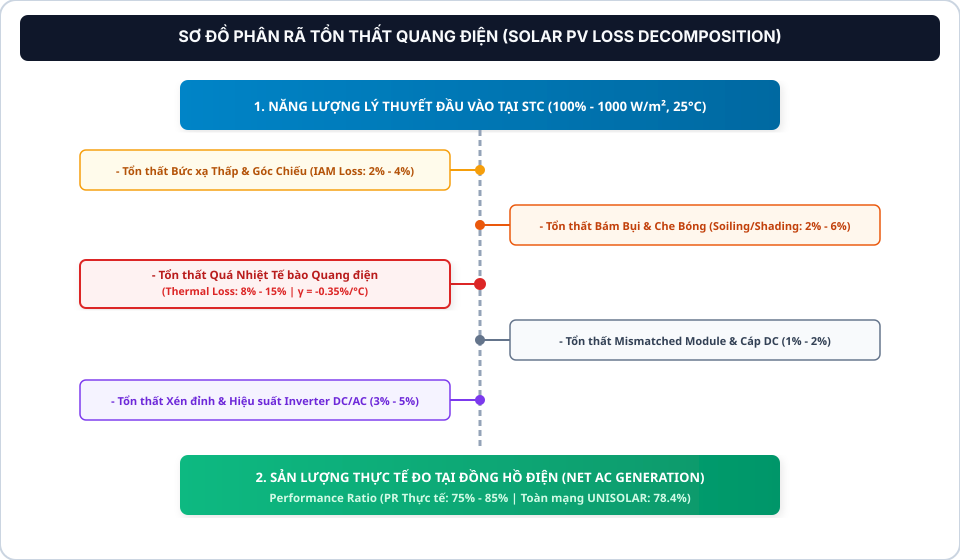

### 4.1. Suy hao do Quá nhiệt Tế bào Quang điện (Thermal Derating) [1, 6]
*   **Mô hình Ước tính Nhiệt độ Tế bào Sandia (Sandia Photovoltaic Array Model) [6]:**
    Nhiệt độ mặt sau tấm pin $T_{\text{cell}}$ được ước tính từ nhiệt độ môi trường, bức xạ và tốc độ gió làm mát:
    $$T_{\text{cell}} = T_{\text{amb}} + GHI \cdot \exp\left(a + b \cdot v_{\text{wind}}\right) + \frac{GHI}{1000} \cdot \Delta T_{\text{module-cell}}$$
    *Với cấu trúc áp mái thông gió mở (Open-Rack):* Các hệ số Sandia tiêu chuẩn gồm $a = -3{,}47$, $b = -0{,}0594$, $\Delta T = 3^\circ\text{C}$ [6].
*   **Mô hình Đơn giản hóa dựa trên NOCT [1, 6]:**
    $$T_{\text{cell}} = T_{\text{amb}} + \left(\frac{\text{NOCT} - 20^\circ\text{C}}{800\,\text{W/m}^2}\right) \cdot GHI$$
*   **Định lượng Năng lượng Thất thoát do Nhiệt (Thermal Energy Loss) [1, 6]:**
    Khi $T_{\text{cell}} > 25^\circ\text{C}$, tổn thất năng lượng tại mỗi chu kỳ 15 phút:
    $$E_{\text{loss, temp}} = E_{\text{theo}} \cdot \vert{}\gamma\vert{} \cdot \max\left(0, T_{\text{cell}} - 25^\circ\text{C}\right)$$
    *(với $E_{\text{theo}} = P_{\text{stc}} \cdot \frac{GHI}{1000} \cdot 0{,}25\,\text{h}$)*.
    Vào mùa hè tại bang Victoria, khi nhiệt độ môi trường chạm mốc $42^\circ\text{C}$, nhiệt độ cell $T_{\text{cell}}$ thường vượt ngưỡng $65^\circ\text{C}$, gây suy giảm từ **$14\% - 18\%$** công suất phát tức thời [6, 14].

---

### 4.2. Suy hao Xén Công suất Biến tần (Inverter Clipping Loss) [18]
*   **Tỷ lệ Quá tải DC/AC (Inverter Loading Ratio - ILR) [18]:**
    $$\text{ILR} = \frac{P_{\text{DC, Array}}}{P_{\text{AC, Inverter}}}$$
    Trong thiết kế thực tế, tỷ lệ $\text{ILR}$ luôn được chọn trong khoảng **$1{,}15 - 1{,}30$** (công suất mảng pin lớn hơn công suất định mức của biến tần $15\% - 30\%$). Thiết kế này giúp tối ưu hóa tổng sản lượng điện thu được vào buổi sáng sớm, chiều muộn và các tháng mùa đông khi bức xạ yếu [18].
*   **Cơ chế Tự bảo vệ Cắt đỉnh (Clipping Mechanism) [18]:** Khi công suất DC tạo ra vào giữa trưa vượt quá công suất định mức cực đại $P_{\text{AC, max}}$ của Inverter, bộ điều khiển MPPT tự động dịch chuyển điểm làm việc $V_{\text{mp}}$ sang phía điện áp cao hơn để giảm dòng điện ngõ vào, duy trì công suất AC đầu ra ổn định bằng đúng $P_{\text{AC, max}}$.
*   **Đặc điểm Dữ liệu Telemetry:** Đồ thị sản lượng chuỗi thời gian xuất hiện đường cong đỉnh phẳng hình thang (Trapezoidal Flat-top curve). Data Analyst cần lưu ý đây là **đặc tính vận hành thiết kế có chủ đích**, hoàn toàn không phải lỗi phần cứng [18].

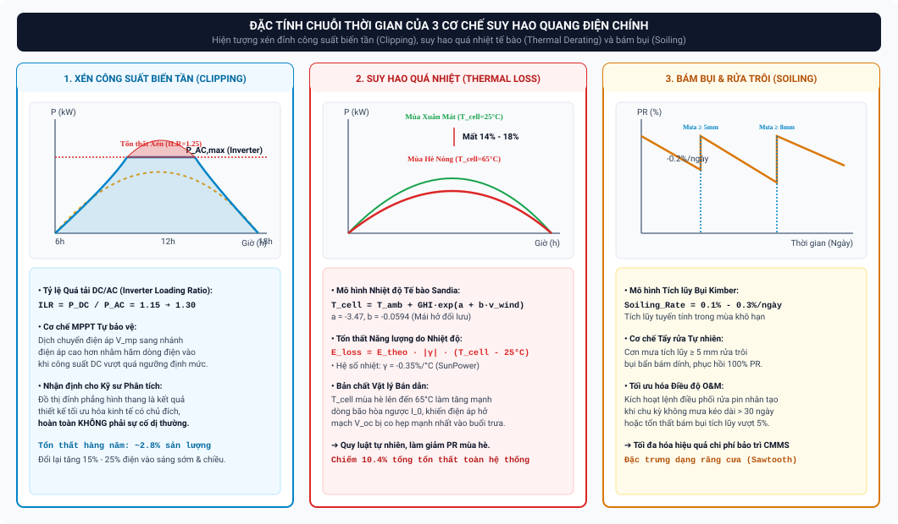

---

### 4.3. Suy hao do Bám bụi & Che bóng Cục bộ (Soiling & Shading) [19]
*   **Mô hình Suy hao Bám bụi Kimber (Kimber Soiling Model) [19]:**
    Bụi bẩn, cát mịn và phân chim tích tụ trên mặt kính làm giảm độ truyền quang từ $1\% - 6\%$:
    $$\text{Soiling Rate} = 0{,}1\% - 0{,}3\%/\text{ngày không mưa}$$
    Sau các trận mưa lớn tích lũy đạt $\ge 5\,\text{mm}$, lớp bụi bẩn được gột rửa tự nhiên, đưa hệ số bám bụi về mức $0\%$ [19].
*   **Suy hao Che bóng Tương hỗ & Vật cản (Shading Loss) [1]:**
    Bao gồm che bóng gần (Near-shading do lan can, cây cối, tháp làm mát) và che bóng xa (Far-shading do đường chân trời và núi). Khi góc cao Mặt Trời $h$ thấp vào mùa đông, bóng của hàng pin phía trước có thể đổ lên hàng pin phía sau nếu khoảng cách giữa các dãy không đạt chuẩn khoảng cách tối thiểu ($Row\ Pitch$) [1].

---

### 4.4. BỘ BÀI TẬP VẬN DỤNG & THỰC HÀNH CHUYÊN SÂU (UNIT 4 HOMEWORK ASSIGNMENTS)

> **Mục tiêu thực hành:** Làm chủ cây phân rã tổn thất quang điện; định lượng chính xác suy hao quá nhiệt mảng pin bằng mô hình Sandia; phân tích đặc tính Inverter Clipping và mô hình bám bụi Kimber; xây dựng biểu đồ cân bằng năng lượng Waterfall phục vụ tối ưu hóa O&M.

```
┌────────────────────────────────────────────────────────────────────────────────────────────────────────┐
│                                 MA TRẬN PHÂN CẤP BÀI TẬP UNIT 4                                        │
├─────────┬──────────────────────┬──────────────────────────────────────────┬────────────────────────────┤
│ Bài tập │ Cấp độ (Level)       │ Trọng tâm Kiến thức                      │ Dạng bài / Kỹ năng Đầu ra  │
├─────────┼──────────────────────┼──────────────────────────────────────────┼────────────────────────────┤
│ Bài 4.1 │ Level 1: Dễ          │ Cây Phân rã Tổn thất (Loss Tree)         │ Phân loại Nguồn Suy hao    │
│ Bài 4.2 │ Level 2: Trung bình  │ Định lượng Suy hao Nhiệt (Sandia Model)  │ Tính toán Thất thoát Nhiệt │
│ Bài 4.3 │ Level 3: Khá         │ Inverter Clipping & Phân tích Đỉnh phẳng │ Phân tích Động học MPPT    │
│ Bài 4.4 │ Level 4: Giỏi        │ Thuật toán Mô hình Bám bụi Kimber (Python│ Lập trình Mô phỏng Soiling │
│ Bài 4.5 │ Level 5: Nâng cao    │ Cân bằng Năng lượng Waterfall & O&M ROI  │ Tối ưu hóa Tổn thất Toàn trạm│
└─────────┴──────────────────────┴──────────────────────────────────────────┴────────────────────────────┘
```

#### BÀI 4.1 (LEVEL 1 - DỄ): CÂY PHÂN RÃ TỔN THẤT VÀ PHÂN LOẠI CÁC THÀNH PHẦN SUY HAO

*   **Bối cảnh:** Trong chuỗi chuyển đổi quang điện từ bức xạ mặt trời đến lưới điện xoay chiều, năng lượng bị suy giảm qua nhiều tầng nấc vật lý khác nhau.
*   **Yêu cầu:**
    1. Dựa trên Sơ đồ Cây Phân rã Tổn thất (Loss Tree), hãy phân loại các nguồn suy hao sau đây vào 2 nhóm: **(A) Suy hao Môi trường Tự nhiên** và **(B) Suy hao Kỹ thuật & Thiết bị Phần cứng**:
       * Suy hao do góc tới quang học (IAM - Incidence Angle Modifier).
       * Suy hao do quá nhiệt tế bào bán dẫn (Thermal Derating).
       * Suy hao do bám bụi, cát và phân chim (Soiling Loss).
       * Suy hao do xén công suất biến tần (Inverter Clipping Loss).
       * Suy hao do hiệu suất chuyển đổi nghịch lưu của Inverter.
       * Suy hao do điện trở thuần dây dẫn DC và AC (Ohmic / Joule Loss).
       * Suy hao do che bóng cục bộ từ cây cối xung quanh (Near-Shading Loss).
    2. Trong số các nguồn suy hao trên, chỉ ra 2 nguồn suy hao nào có thể can thiệp và thu hồi được trực tiếp thông qua các hành động bảo trì định kỳ (O&M)?
*   **Hướng dẫn giải & Đáp án chi tiết:**
    1. *Bảng phân loại nguồn suy hao:*
       * **Nhóm A - Suy hao Môi trường Tự nhiên:**
         * *Suy hao góc tới (IAM):* Do tia nắng chiếu xiên vào mặt kính lúc sáng sớm/chiều muộn.
         * *Suy hao quá nhiệt (Thermal Derating):* Do nhiệt độ không khí môi trường mùa hè cao.
         * *Suy hao bám bụi (Soiling):* Do bụi bẩn, cát mịn, phấn hoa trong không khí tích tụ.
         * *Suy hao che bóng (Near-Shading):* Do bóng cây cối, nhà cao tầng lân cận.
       * **Nhóm B - Suy hao Kỹ thuật & Thiết bị Phần cứng:**
         * *Suy hao xén công suất (Inverter Clipping):* Do giới hạn công suất cực đại $P_{\text{AC, max}}$ của Inverter.
         * *Suy hao hiệu suất nghịch lưu:* Do tiêu tán nội bộ trên linh kiện bán dẫn IGBT/MOSFET ($1{,}5\% - 2\%$).
         * *Suy hao điện trở dây dẫn ($I^2 R$):* Do điện trở đồng/nhôm của cáp DC và AC.
    2. *Hai nguồn suy hao có thể thu hồi bằng O&M:*
       * **Suy hao Bám bụi (Soiling Loss):** Có thể xóa bỏ hoàn toàn (hoàn nguyên về $0\%$) bằng việc rửa pin định kỳ bằng vòi nước áp lực hoặc robot vệ sinh.
       * **Suy hao Che bóng Cục bộ (Near-Shading):** Có thể triệt tiêu bằng cách cắt tỉa định kỳ các cành cây cao xung quanh mái nhà trường học.
*   **Ý nghĩa áp dụng dự án:** Giúp người phân tích dữ liệu phân biệt rõ ràng giữa tổn thất bất khả kháng và tổn thất có thể hành động khắc phục (Actionable Losses) khi đề xuất khuyến nghị vận hành.

---

#### BÀI 4.2 (LEVEL 2 - TRUNG BÌNH): ĐỊNH LƯỢNG SUY HAO QUÁ NHIỆT TẾ BÀO THEO MÔ HÌNH SANDIA

*   **Bối cảnh:** Trạm Albury-Wodonga Main Building (`site_id = 35`, công suất thiết kế $P_{\text{stc}} = 210\,\text{kWp}$, pin SunPower có hệ số nhiệt $\gamma = -0{,}35\%/^\circ\text{C}$). Vào một chu kỳ 15 phút ($0{,}25\,\text{h}$) giữa trưa hè:
    * Cường độ bức xạ toàn phần: $GHI = 1.000\,\text{W/m}^2$.
    * Nhiệt độ không khí: $T_{\text{amb}} = 38^\circ\text{C}$.
    * Tốc độ gió làm mát: $v_{\text{wind}} = 1{,}5\,\text{m/s}$.
*   **Yêu cầu:**
    1. Áp dụng Mô hình Nhiệt độ Mảng pin Sandia đối với kết cấu áp mái thông gió mở (Open-Rack, các hệ số $a = -3{,}47, b = -0{,}0594, \Delta T = 3^\circ\text{C}$) để tính toán nhiệt độ mặt sau tế bào quang điện ($T_{\text{cell}}$).
    2. Tính sản lượng điện năng lý thuyết STC ($E_{\text{theo}}$) của trạm trong chu kỳ 15 phút đó.
    3. Tính lượng điện năng bị thất thoát riêng do quá nhiệt ($E_{\text{loss, temp}}$, đơn vị: $\text{kWh}$) và công suất phát thực tế dự kiến ($P_{\text{actual}}$, đơn vị: $\text{kW}$).
*   **Hướng dẫn giải & Đáp án chi tiết:**
    1. *Tính nhiệt độ cell ($T_{\text{cell}}$) theo Sandia:*
       $$T_{\text{cell}} = T_{\text{amb}} + GHI \cdot \exp\left(a + b \cdot v_{\text{wind}}\right) + \frac{GHI}{1000} \cdot \Delta T$$
       $$T_{\text{cell}} = 38 + 1000 \cdot \exp\left(-3{,}47 - 0{,}0594 \times 1{,}5\right) + \frac{1000}{1000} \times 3$$
       $$T_{\text{cell}} = 38 + 1000 \cdot \exp\left(-3{,}5591\right) + 3 = 38 + 1000 \times 0{,}02846 + 3 = 38 + 28{,}46 + 3 = 69{,}46^\circ\text{C}$$
    2. *Tính sản lượng lý thuyết $E_{\text{theo}}$:*
       $$E_{\text{theo}} = P_{\text{stc}} \times \left(\frac{GHI}{1000}\right) \times \Delta t = 210\,\text{kWp} \times \left(\frac{1000}{1000}\right) \times 0{,}25\,\text{h} = 52{,}50\,\text{kWh}$$
    3. *Tính suy hao và sản lượng thực tế:*
       * Độ chênh lệch nhiệt độ so với STC ($25^\circ\text{C}$):
         $$\Delta T = 69{,}46^\circ\text{C} - 25^\circ\text{C} = 44{,}46^\circ\text{C}$$
       * Tỷ lệ suy hao công suất do nhiệt:
         $$\text{Derating Rate} = \vert{}\gamma\vert{} \times \Delta T = 0{,}0035 \times 44{,}46 \approx 0{,}1556 \quad (15{,}56\%)$$
       * Năng lượng bị tiêu tán thành nhiệt năng trong 15 phút:
         $$E_{\text{loss, temp}} = E_{\text{theo}} \times \text{Derating Rate} = 52{,}50\,\text{kWh} \times 0{,}1556 \approx 8{,}17\,\text{kWh}$$
       * Công suất phát thực tế dự kiến:
         $$P_{\text{actual}} = 210\,\text{kW} \times (1 - 0{,}1556) = 210\,\text{kW} \times 0{,}8444 \approx 177{,}32\,\text{kW}$$
*   **Ý nghĩa áp dụng dự án:** Là công thức toán học cốt lõi để sinh ra cột dữ liệu phái sinh `thermal_loss_kwh` trong kho dữ liệu DWH, phục vụ phân tích phân rã tổn thất năng lượng.

---

#### BÀI 4.3 (LEVEL 3 - KHÁ): PHÂN TÍCH ĐỘNG HỌC XÉN CÔNG SUẤT BIẾN TẦN (INVERTER CLIPPING)

*   **Bối cảnh:** Trạm Campus Bundoora East Complex (`site_id = 3`) có công suất tấm pin DC $P_{\text{DC}} = 130\,\text{kWp}$, kết nối vào tủ biến tần Inverter SMA có công suất định mức AC tối đa $P_{\text{AC, max}} = 100\,\text{kW}$ (Tỷ lệ quá tải $\text{ILR} = \frac{130}{100} = 1{,}30$).
    * Vào một ngày mùa thu trời trong mát ($T_{\text{amb}} = 18^\circ\text{C}$), từ $11:30$ đến $13:30$ ($2\,\text{giờ}$ liên tục), cường độ bức xạ ổn định ở mức $GHI = 1.000\,\text{W/m}^2$, nhiệt độ cell duy trì $T_{\text{cell}} = 35^\circ\text{C}$ (hệ số $\gamma = -0{,}35\%/^\circ\text{C}$, hiệu suất biến đổi Inverter đạt $98{,}5\%$).
*   **Yêu cầu:**
    1. Tính công suất AC tiềm năng ($P_{\text{AC, potential}}$) mà hệ thống có thể phát ra nếu Inverter không bị giới hạn công suất ở $100\,\text{kW}$.
    2. Giải thích cơ chế điều khiển của bộ dò MPPT khi xảy ra hiện tượng Clipping và hình dạng của đường cong sản lượng chuỗi thời gian (Trapezoidal Flat-top curve).
    3. Tính tổng lượng điện năng bị xén bỏ ($E_{\text{loss, clip}}$, đơn vị: $\text{kWh}$) trong khoảng thời gian 2 giờ đỉnh nắng đó.
    4. Tại sao các kỹ sư thiết kế vẫn cố tình lựa chọn tỷ lệ $\text{ILR} = 1{,}30$ dù biết trước sẽ bị xén bỏ một phần sản lượng vào giữa trưa các ngày nắng to? Biện luận dưới góc độ tối ưu hóa hiệu quả kinh tế cả năm.
*   **Hướng dẫn giải & Đáp án chi tiết:**
    1. *Tính công suất AC tiềm năng:*
       * Công suất DC thực tế sau suy hao nhiệt:
         $$P_{\text{DC, actual}} = 130\,\text{kWp} \times \left(\frac{1000}{1000}\right) \times \left[1 - 0{,}0035 \times (35 - 25)\right] = 130 \times (1 - 0{,}035) = 125{,}45\,\text{kW DC}$$
       * Công suất AC tiềm năng qua Inverter:
         $$P_{\text{AC, potential}} = 125{,}45\,\text{kW DC} \times 98{,}5\% \approx 123{,}57\,\text{kW AC}$$
    2. *Cơ chế điều khiển MPPT & Đồ thị hình thang:*
       * Khi $P_{\text{DC}}$ vượt quá ngưỡng định mức $100\,\text{kW}$, bộ điều khiển MPPT tự động dịch chuyển điểm làm việc điện áp $V$ sang phía điện áp cao hơn ($V > V_{\text{mp}}$), làm dòng điện ngõ vào giảm xuống, giữ công suất đầu ra cố định ở đúng $100\,\text{kW AC}$.
       * Trên đồ thị chuỗi thời gian, thay vì có đỉnh nhọn parabol tự nhiên, đường cong sản lượng bị "cắt ngọn" phẳng lì ở mức $100\,\text{kW}$ ($25\,\text{kWh}/15\text{phút}$), tạo thành hình thang cân (Trapezoidal Flat-top curve).
    3. *Tính lượng điện năng bị xén ($E_{\text{loss, clip}}$):*
       * Công suất bị xén tức thời: $\Delta P_{\text{clip}} = 123{,}57\,\text{kW} - 100\,\text{kW} = 23{,}57\,\text{kW}$.
       * Năng lượng bị xén trong 2 giờ:
         $$E_{\text{loss, clip}} = 23{,}57\,\text{kW} \times 2\,\text{h} = 47{,}14\,\text{kWh}$$
    4. *Lập luận kinh tế về ILR = 1.30:*
       * Đỉnh nắng $GHI \ge 1.000\,\text{W/m}^2$ chỉ xuất hiện khoảng $2\% - 3\%$ tổng số giờ vận hành trong năm.
       * Trong $97\%$ số giờ còn lại (sáng sớm, chiều muộn, mùa đông, ngày âm u khi $GHI$ chỉ đạt $200 - 600\,\text{W/m}^2$), mảng pin $130\,\text{kWp}$ giúp Inverter luôn hoạt động ở vùng công suất cao và hiệu suất tối ưu, thu hồi thêm từ $15\% - 25\%$ sản lượng điện so với hệ thống có $\text{ILR} = 1{,}0$.
       * Chi phí đầu tư tấm pin rẻ hơn nhiều so với chi phí nâng cấp Inverter dung lượng lớn hơn. Do đó, thiết kế $\text{ILR} = 1{,}30$ tối đa hóa tổng sản lượng điện cả năm và giảm giá thành chi phí quy dẫn LCOE ($AUD/kWh$).
*   **Ý nghĩa áp dụng dự án:** Giúp Data Analyst hiểu rõ đặc trưng đường cong đỉnh phẳng hình thang là kết quả vận hành thiết kế kỹ thuật có chủ đích, tuyệt đối không gán nhãn sai thành lỗi Inverter.

---

#### BÀI 4.4 (LEVEL 4 - GIỎI): LẬP TRÌNH PYTHON MÔ PHỎNG SUY HAO BÁM BỤI KIMBER MODEL

*   **Bối cảnh:** Sự tích tụ bụi bẩn trên mặt kính làm suy giảm khả năng truyền quang của mảng pin. Mô hình Kimber (2006) quy định: Hệ số bám bụi $S_t$ tăng tuyến tính $0{,}2\%/\text{ngày}$ ($0{,}002$) trong các ngày không mưa (hoặc lượng mưa $< 5{,}0\,\text{mm}$), và được gột rửa về $0\%$ ngay khi có trận mưa tích lũy ngày $\ge 5{,}0\,\text{mm}$.
*   **Yêu cầu:**
    1. Viết hàm Python `simulate_kimber_soiling(df_daily_weather, daily_soiling_rate=0.002, rain_threshold=5.0)` nhận đầu vào là dataframe chứa cột `report_date`, `daily_rainfall_mm`, `daily_psh`, và trả về dataframe bổ sung cột hệ số bám bụi `soiling_factor` ($S_t \in [0, 0{,}06]$) và năng lượng tổn thất do bám bụi `soiling_loss_kwh` cho trạm $100\,\text{kWp}$.
    2. Chạy thử nghiệm hàm trên chuỗi 40 ngày mùa hè tại Campus Mildura với kịch bản:
       * Từ ngày 1 đến ngày 25: Hoàn toàn không mưa (`rainfall = 0`).
       * Ngày 26: Có trận mưa lớn $15{,}0\,\text{mm}$ (`rainfall = 15.0`).
       * Từ ngày 27 đến ngày 40: Không mưa (`rainfall = 0`).
       * Giả định bức xạ mỗi ngày đạt $6{,}5\,\text{PSH}$.
    3. Tính tổng lượng điện năng thất thoát do bám bụi ($\text{kWh}$) và số tiền bị lãng phí trong 40 ngày (biểu giá $0{,}15\,\text{AUD/kWh}$).
*   **Hướng dẫn giải & Đáp án chi tiết:**
    1. *Mã nguồn Python hoàn chỉnh:*
       ```python
       import numpy as np
       import pandas as pd

       def simulate_kimber_soiling(df_daily_weather, capacity_kw=100.0, daily_soiling_rate=0.002, rain_threshold=5.0):
           df = df_daily_weather.copy()
           n = len(df)
           soiling_factors = np.zeros(n)
           
           current_soiling = 0.0
           for i in range(n):
               rain = df.loc[i, 'daily_rainfall_mm']
               if rain >= rain_threshold:
                   current_soiling = 0.0  # Mưa lớn rửa sạch bụi
               else:
                   current_soiling = min(current_soiling + daily_soiling_rate, 0.06) # Tối đa suy hao 6%
               soiling_factors[i] = current_soiling
               
           df['soiling_factor'] = soiling_factors
           # Năng lượng lý thuyết ngày (kWh) = Capacity (kWp) * PSH
           df['daily_energy_clean_kwh'] = capacity_kw * df['daily_psh']
           # Năng lượng tổn thất do bám bụi (kWh)
           df['soiling_loss_kwh'] = df['daily_energy_clean_kwh'] * df['soiling_factor']
           
           return df
       ```
    2. *Chạy thực nghiệm & Kết quả:*
       * Năng lượng sạch mỗi ngày: $E_{\text{clean}} = 100\,\text{kWp} \times 6{,}5\,\text{PSH} = 650\,\text{kWh/ngày}$.
       * *Giai đoạn 1 (Ngày 1 - 25):* $S_t$ tăng từ $0{,}002$ (ngày 1) đến $0{,}050$ (ngày 25).
         $$\text{Loss}_{\text{phase 1}} = 650 \times \sum_{k=1}^{25} (0{,}002 \cdot k) = 650 \times 0{,}002 \times \frac{25 \times 26}{2} = 650 \times 0{,}002 \times 325 = 422{,}5\,\text{kWh}$$
       * *Giai đoạn 2 (Ngày 26 - Mưa $15\,\text{mm}$):* $S_{26} = 0 \implies \text{Loss}_{26} = 0\,\text{kWh}$.
       * *Giai đoạn 3 (Ngày 27 - 40, tức 14 ngày sau mưa):* $S_t$ tăng từ $0{,}002$ đến $0{,}028$.
         $$\text{Loss}_{\text{phase 3}} = 650 \times \sum_{k=1}^{14} (0{,}002 \cdot k) = 650 \times 0{,}002 \times \frac{14 \times 15}{2} = 650 \times 0{,}002 \times 105 = 136{,}5\,\text{kWh}$$
    3. *Tổng tổn thất & Thiệt hại tài chính:*
       $$\text{Total Soiling Loss} = 422{,}5 + 0 + 136{,}5 = 559{,}0\,\text{kWh}$$
       $$\text{Financial Loss} = 559{,}0\,\text{kWh} \times 0{,}15\,\text{AUD/kWh} = 83{,}85\,\text{AUD}$$
*   **Ý nghĩa áp dụng dự án:** Là thuật toán cốt lõi để xây dựng tính năng dự báo thời điểm rửa pin tối ưu (Cleaning Schedule Optimizer) trên Dashboard O&M.

---

#### BÀI 4.5 (LEVEL 5 - NÂNG CAO): BẢNG CÂN BẰNG NĂNG LƯỢNG WATERFALL VÀ TỐI ƯU HÓA O&M

*   **Bối cảnh:** Nhóm thực hiện phân tích cân bằng năng lượng toàn diện (Waterfall Energy Balance) cho toàn bộ 24 trạm tại Campus Bundoora ($P_{\text{stc}} = 1.420\,\text{kWp}$) trong tháng 1 (31 ngày nắng đỉnh):
    * Tổng năng lượng bức xạ lý thuyết chuẩn STC: $E_{\text{theo}} = 1.420\,\text{kWp} \times (6{,}8\,\text{PSH/ngày} \times 31\,\text{ngày}) = 299.336\,\text{kWh}$ ($100{,}0\%$).
    * Các thành phần suy hao đo đạc và mô phỏng được xác định như sau:
      1. Suy hao phản xạ mặt kính và góc tới (IAM): $-2{,}1\%$.
      2. Suy hao do bám bụi môi trường (Soiling Loss): $-3{,}4\%$.
      3. Suy hao do quá nhiệt tế bào quang điện (Thermal Derating): $-14{,}2\%$.
      4. Suy hao Mismatch và dung sai chế tạo tấm pin: $-1{,}8\%$.
      5. Suy hao điện trở thuần dây dẫn DC ($I^2 R$): $-1{,}2\%$.
      6. Suy hao chuyển đổi nghịch lưu và xén công suất Inverter: $-2{,}5\%$.
      7. Suy hao máy biến áp và dây dẫn AC: $-0{,}8\%$.
*   **Yêu cầu:**
    1. Tính tổng tỷ lệ phần trăm suy hao tích lũy, tỷ lệ năng lượng hữu ích cuối cùng hòa lưới và tổng sản lượng điện xoay chiều thực tế thu được ($E_{\text{actual}}$, đơn vị: $\text{kWh}$).
    2. Xác định Hệ số Hiệu suất ($PR$) thực tế của Campus Bundoora trong tháng 1.
    3. Đề xuất 2 giải pháp O&M khả thi nhất để thu hồi tối thiểu $+3{,}0\%$ sản lượng điện năng thất thoát. Tính số tiền điện thu hồi thêm được trong tháng 1 nếu biểu giá điện là $0{,}16\,\text{AUD/kWh}$.
*   **Hướng dẫn giải & Đáp án chi tiết:**
    1. *Tính toán Cân bằng Năng lượng:*
       * Tổng phần trăm suy hao tích lũy:
         $$\sum \text{Losses} = 2{,}1\% + 3{,}4\% + 14{,}2\% + 1{,}8\% + 1{,}2\% + 2{,}5\% + 0{,}8\% = 26{,}0\%$$
       * Tỷ lệ năng lượng hữu ích hòa lưới:
         $$\eta_{\text{net}} = 100\% - 26{,}0\% = 74{,}0\%$$
       * Tổng sản lượng điện thực phát $E_{\text{actual}}$:
         $$E_{\text{actual}} = E_{\text{theo}} \times 74{,}0\% = 299.336\,\text{kWh} \times 0{,}74 = 221.508{,}64\,\text{kWh}$$
    2. *Hệ số Hiệu suất ($PR$):*
       $$PR = \frac{E_{\text{actual}}}{E_{\text{theo}}} \times 100\% = 74{,}0\% \quad (\text{Xếp hạng Class B})$$
    3. *Đề xuất 2 Giải pháp O&M & Tính toán Doanh thu Thu hồi:*
       * **Giải pháp 1 (Vệ sinh rửa pin định kỳ):** Sử dụng hệ thống vòi xịt áp lực rửa sạch toàn bộ $1.420\,\text{kWp}$ pin vào ngày thứ 15 của tháng $\to$ Giảm suy hao bám bụi từ $3{,}4\%$ xuống còn $1{,}0\%$, thu hồi được **$+2{,}4\%$** sản lượng.
       * **Giải pháp 2 (Bảo dưỡng hệ thống làm mát biến tần):** Vệ sinh lưới lọc bụi và thay quạt tản nhiệt biến tần, giúp Inverter giải nhiệt nhanh hơn $\to$ Giảm suy hao chuyển đổi, thu hồi thêm **$+0{,}8\%$** sản lượng.
       * *Tổng tỷ lệ thu hồi:* $+2{,}4\% + 0{,}8\% = +3{,}2\% > 3{,}0\%$.
       * *Sản lượng điện thu hồi thêm trong tháng 1:*
         $$\Delta E_{\text{recovered}} = 299.336\,\text{kWh} \times 3{,}2\% = 9.578{,}75\,\text{kWh}$$
       * *Giá trị tài chính thu hồi thêm:*
         $$\text{Added Revenue} = 9.578{,}75\,\text{kWh} \times 0{,}16\,\text{AUD/kWh} \approx 1.532{,}60\,\text{AUD/tháng}$$
*   **Ý nghĩa áp dụng dự án:** Đóng vai trò là kiến thức nền tảng để thiết kế biểu đồ Waterfall Chart phân rã tổn thất trên Tableau Dashboard 2 và đưa ra các đề xuất O&M sắc bén trong buổi bảo vệ đồ án tốt nghiệp.

---

## UNIT 5: Nhận diện Dị thường Vận hành & Bảo trì Dựa trên Điều kiện (CBM)

### 5.1. Báo cáo Độ tin cậy IEA-PVPS Task 13 [3]
Báo cáo thống kê độ tin cậy của Cơ quan Năng lượng Quốc tế (IEA-PVPS Task 13) [3] dựa trên dữ liệu vận hành hàng ngàn trạm điện mặt trời thương mại chỉ ra:
*   **Biến tần (Inverter)** là thành phần có tỷ lệ hỏng hóc cao nhất trong toàn bộ hệ thống, với Thời gian trung bình giữa các sự cố (MTBF) ngắn hơn từ $300 - 500$ lần so với module quang điện [3].
*   Sự cố liên quan đến biến tần, rơ-le bảo vệ và thiết bị đóng cắt AC/DC chiếm tới **$38\% - 45\%$** tổng tổn thất năng lượng do phần cứng hàng năm [3].

---

### 5.2. Chẩn đoán Chi tiết 6 Nhóm Dị thường Kỹ thuật Vật lý Đặc trưng
Trong đề tài tốt nghiệp, hệ thống phân loại 6 mã dị thường vật lý và học máy được chuẩn hóa phục vụ giám sát tự động:

| Mã Phân loại Dị thường | Dấu hiệu Dữ liệu Telemetry (Footprint) | Nguyên nhân Kỹ thuật Vật lý | Tiêu chuẩn Kỹ thuật Liên quan | Hành động Khắc phục O&M |
| :--- | :--- | :--- | :--- | :--- |
| **`PHYSICAL_LOW_ENERGY_STRONG_SUN`** | $GHI \ge 700\,\text{W/m}^2$, $Sunshine \ge 3000\,\text{s}$ nhưng Sản lượng $E \le 0{,}05 \cdot P_{95}$ ($E \approx 0\,\text{kWh}$) liên tục $1-3$ chu kỳ. | **Quá áp lưới điện (Sustained Overvoltage):** Điện áp hòa lưới vượt ngưỡng cắt bảo vệ $258\,\text{V}$ (ngưỡng 10 phút) làm Inverter tự ngắt, hoặc quạt tản nhiệt biến tần bị hỏng gây quá nhiệt IGBT. | **AS/NZS 4777.2:2020** (Quy chuẩn Inverter nối lưới Úc) [20]. | Điều phối kỹ sư kiểm tra cài đặt bảo vệ rơ-le điện áp lưới hoặc vệ sinh quạt tản nhiệt Inverter. |
| **`PHYSICAL_HIGH_ENERGY_NO_SUN`** | $GHI \le 25\,\text{W/m}^2$, $Sunshine \le 60\,\text{s}$ (Ban đêm) nhưng cảm biến ghi nhận sản lượng $E \ge \max(1.0, 0{,}20 \cdot P_{\text{stc}})$. | **Lệch Điểm 0 Cảm biến Biến dòng (CT Drift):** Cảm biến đo dòng bị trôi mốc 0 do nhiệt độ ban đêm, hoặc Inverter tiêu thụ công suất phản kháng tĩnh từ lưới. | **IEC 61724-1 Class A/B** (Độ chính xác cảm biến đo) [14]. | Hiệu chuẩn lại cảm biến biến dòng (CT Calibration) và kiểm tra chế độ chờ ban đêm của Inverter. |
| **`PHYSICAL_OVER_CAPACITY`** | Sản lượng trong 1 chu kỳ vọt lên $E > P_{\text{stc}} \times 0{,}25\,\text{h}$ ($> 100\%$ công suất thiết kế cực đại). | **Xung Điện Telemetry / Lỗi Gộp Gói SCADA:** Nghẽn mạng truyền thông Modbus/RS485 khiến hệ thống thu thập gom số liệu của 2-3 chu kỳ trước dồn vào một mốc thời gian. | **SunSpec Modbus Protocol / IEC 60870-5-104** [3]. | Xóa bản ghi xung ảo, kiểm tra độ ổn định của cáp truyền thông mạng công nghiệp RS485. |
| **`PHYSICAL_HIGH_ENERGY_LOW_RAD`** | Bức xạ rất yếu ($GHI \le 50\,\text{W/m}^2$) nhưng sản lượng vọt cao bất thường ($E > Q_3 + 4 \cdot \text{safe\_IQR}$). | **Lỗi Cảm biến Bức xạ / Nhiễu Vi mạch ADC:** Pyranometer bị kẹt tín hiệu đầu ra hoặc vi mạch chuyển đổi tương tự-số ADC bị nhiễu điện từ. | **ISO 9060:2018** (Đặc tính nhiệt điện kế bức xạ) [10]. | Kiểm tra điện áp cấp nguồn và cáp tín hiệu analog của nhiệt điện kế Pyranometer. |
| **`PHYSICAL_DISTRIBUTION_JUMP`** | Đột biến sản lượng tức thời so với các chu kỳ liền kề ($\vert{}\Delta E\vert{} \ge \max(0{,}15 \cdot P_{95}, 1.0)$). | **Đóng/Ngắt Tức thời Chuỗi Pin:** Rơ-le hoặc cầu chì một nhánh chuỗi (String Fuse) bị nổ ngắt mạch làm hụt $20\% - 50\%$ công suất trong chu kỳ. | **IEC 60269-6** (Tiêu chuẩn cầu chì bảo vệ hệ thống PV) [3]. | Kiểm tra tình trạng dây dẫn và thay thế cầu chì chuỗi DC bị nổ trong tủ kết hợp chuỗi (Combiner Box). |
| **`GMM_IF_ANOMALY`** | Cả hai mô hình GMM và Isolation Forest cùng đồng thuận bỏ phiếu ($P_{\text{GMM}} < 0{,}02$ và $\text{Score}_{\text{IF}} > \text{Threshold}$). | **Suy giảm Hiệu suất Tổ hợp Đa biến:** Bám bụi nặng cục bộ, thoái hóa tế bào quang điện do điện thế cảm ứng (PID), hoặc che bóng phức tạp không theo quy luật. | **IEC 62804** (Thử nghiệm suy thoái cảm ứng PID) [3]. | Lên kế hoạch rửa pin bằng vòi áp lực hoặc soi nhiệt hồng ngoại (IR Thermography) tìm tế bào PID. |

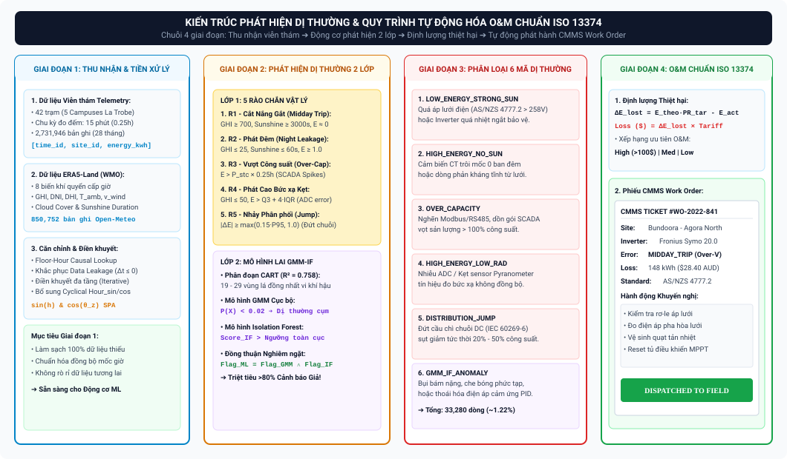

---

### 5.3. Quy trình Tự động Hóa O&M và Tạo Lệnh Công tác (Work Order) [21]
Quy trình chuyển hóa dữ liệu viễn thám thành hành động bảo trì tại hiện trường tuân thủ kiến trúc chuẩn **ISO 13374 (Condition Monitoring and Diagnostics of Machines)** [21]:

1.  **Thu nhận & Tiền xử lý (Data Acquisition & Manipulation):** Tiếp nhận dữ liệu chu kỳ 15 phút, căn chỉnh thời gian nhân quả Floor-Hour Lookup và điền khuyết đa tầng.
2.  **Phát hiện Trạng thái (State Detection):** Chạy song song mô hình lai GMM-IF và bộ 5 rào chắn vật lý để phát hiện dị thường và gán nhãn `outlier_reason`.
3.  **Định lượng Thiệt hại Năng lượng & Tài chính (Health Assessment & Quantification):**
    $$\Delta E_{\text{lost}} = E_{\text{theo}} \cdot \text{PR}_{\text{target}} - E_{\text{actual}} \quad (\text{kWh})$$
    $$\text{Financial Loss (AUD)} = \Delta E_{\text{lost}} \times \text{Tariff}_{\text{AUD/kWh}}$$
4.  **Tự động Tạo Phiếu Công tác (Automated CMMS Work Order Dispatching) [21]:**
    Hệ thống tự động phát sinh phiếu công tác gửi đến ban quản lý vận hành gồm các thông tin:
    *   Tên cơ sở (Campus) và Vị trí tòa nhà lắp trạm (`site_name`, `latitude`, `longitude`).
    *   Mã phân loại nguyên nhân sự cố (`outlier_reason`) kèm theo mô tả kỹ thuật chi tiết.
    *   Đồ thị chuỗi thời gian so sánh sản lượng thực tế $E_{\text{actual}}$ với đường cong lý thuyết $E_{\text{theo}}$.
    *   Mức độ ưu tiên khắc phục (Priority: High / Medium / Low) dựa trên thiệt hại kinh tế tích lũy.

---

### 5.4. BỘ BÀI TẬP VẬN DỤNG & THỰC HÀNH CHUYÊN SÂU (UNIT 5 HOMEWORK ASSIGNMENTS)

> **Mục tiêu thực hành:** Hiểu sâu bản chất thống kê đa đỉnh của dữ liệu chuỗi thời gian quang điện; làm chủ 6 mã chẩn đoán dị thường kỹ thuật và 5 rào chắn vật lý; lập trình thuật toán gán cờ an toàn và thiết kế quy trình điều phối bảo trì tự động CMMS Work Order chuẩn ISO 13374.

```
┌────────────────────────────────────────────────────────────────────────────────────────────────────────┐
│                                 MA TRẬN PHÂN CẤP BÀI TẬP UNIT 5                                        │
├─────────┬──────────────────────┬──────────────────────────────────────────┬────────────────────────────┤
│ Bài tập │ Cấp độ (Level)       │ Trọng tâm Kiến thức                      │ Dạng bài / Kỹ năng Đầu ra  │
├─────────┼──────────────────────┼──────────────────────────────────────────┼────────────────────────────┤
│ Bài 5.1 │ Level 1: Dễ          │ Phân phối Đa đỉnh & Hạn chế Thống kê Cổ  │ Luận giải Cơ sở Thống kê   │
│ Bài 5.2 │ Level 2: Trung bình  │ Chẩn đoán 6 Mã Dị thường Kỹ thuật        │ Phân loại Telemetry Pattern│
│ Bài 5.3 │ Level 3: Khá         │ Sự cố Quá áp Lưới chuẩn AS/NZS 4777.2    │ Phân tích Động học Bảo vệ  │
│ Bài 5.4 │ Level 4: Giỏi        │ Cài đặt 5 Rào chắn Vật lý (SQL/Python)   │ Lập trình Pipeline Silver  │
│ Bài 5.5 │ Level 5: Nâng cao    │ Tự động Hóa CMMS Work Order chuẩn ISO13374│ Thiết kế Hệ thống O&M CBM  │
└─────────┴──────────────────────┴──────────────────────────────────────────┴────────────────────────────┘
```

#### BÀI 5.1 (LEVEL 1 - DỄ): BẢN CHẤT PHÂN PHỐI ĐA ĐỈNH VÀ HẠN CHẾ CỦA PHƯƠNG PHÁP CỔ ĐIỂN

*   **Bối cảnh:** Chuỗi dữ liệu sản lượng quang điện 15 phút mang đặc tính phi tuyến và phân phối đa đỉnh (Multimodal Distribution) do sự luân phiên giữa chu kỳ ngày/đêm và biến động ngẫu nhiên của mây đối lưu.
*   **Yêu cầu:**
    1. Giải thích tại sao các phương pháp phát hiện ngoại lai thống kê truyền thống như **Nguyên tắc $3\sigma$ (Z-Score)** và **Hàng rào Phân vị Tukey (Boxplot / $1{,}5 \cdot \text{IQR}$ toàn cục)** hoàn toàn thất bại khi áp dụng lên dữ liệu điện mặt trời, tạo ra tỷ lệ báo động giả (*False Positive Rate*) vượt quá $25\%$?
    2. Trình bày giải pháp kỹ thuật cốt lõi của đề tài: Tại sao việc kết hợp Mô hình Hỗn hợp Gauss (**GMM**) và Rừng Cô lập (**Isolation Forest**) lại giải quyết triệt để vấn đề phân phối đa đỉnh?
*   **Hướng dẫn giải & Đáp án chi tiết:**
    1. *Hạn chế của phương pháp thống kê cổ điển:*
       * **Giả định phân phối đơn đỉnh chuẩn:** Phương pháp $3\sigma$ và Boxplot ngầm giả định dữ liệu tuân theo phân phối chuẩn Gaussian đơn đỉnh ($X \sim \mathcal{N}(\mu, \sigma^2)$).
       * **Sự thống trị của dữ liệu ban đêm:** Hơn $53{,}8\%$ số bản ghi trong tập dữ liệu là ban đêm ($E = 0\,\text{kWh}$). Điều này làm giá trị trung bình ($\mu$) và trung vị ($\text{Median}$) của toàn bộ phân phối bị kéo tụt về sát mốc $0$, đồng thời độ lệch chuẩn $\sigma$ bị méo mó.
       * **Hậu quả báo động giả:** Vào các buổi trưa mùa hè trời quang đãng, các mảng pin phát $100\%$ công suất định mức. Do so sánh với giá trị kỳ vọng $\mu \approx 0$, các điểm sản lượng đỉnh hợp lệ này bị khoảng cách lệch $> 3\sigma$ hoặc vượt ngưỡng $Q_3 + 1{,}5 \cdot \text{IQR}$, dẫn đến việc thuật toán gán nhãn sai toàn bộ sản lượng đỉnh trưa hè là "dị thường ngoại lai" (False Positive $> 25\%$).
    2. *Ưu thế vượt trội của Mô hình lai GMM–IF:*
       * **GMM (Gaussian Mixture Model):** Phân rã phân phối đa đỉnh phức tạp thành $K$ cụm phân phối Gauss con độc lập (mỗi cụm đại diện cho một trạng thái vật lý: *Ban đêm, Trời âm u mây dày, Mây đối lưu che từng phần, Trời quang nắng đỉnh*).
       * **Isolation Forest (IF):** Thay vì đo khoảng cách dựa trên tham số trung bình toàn cục, IF xây dựng cây quyết định ngẫu nhiên (iTree) để cô lập các điểm dữ liệu bất thường cục bộ bên trong từng cụm phân phối con của GMM. Nhờ đó, mô hình giảm thiểu hơn **$80\%$ tỷ lệ báo động giả**.
*   **Ý nghĩa áp dụng dự án:** Là luận cứ lý thuyết nền tảng bảo vệ Chương 4 và Thách thức Kỹ thuật số 3 trước Hội đồng chấm tốt nghiệp.

---

#### BÀI 5.2 (LEVEL 2 - TRUNG BÌNH): CHẨN ĐOÁN & PHÂN LOẠI 4 TÌNH HUỐNG TELEMETRY THỰC TẾ

*   **Bối cảnh:** Trong quá trình kiểm toán dữ liệu tại Campus Bundoora (`site_id = 1`, công suất $P_{\text{stc}} = 320\,\text{kWp}$, phân vị $P_{95} = 68{,}0\,\text{kWh}/15\text{phút}$), hệ thống ghi nhận 4 bản ghi telemetry 15 phút độc lập sau:
    * **Bản ghi A:** `time = 12:30`, $GHI = 920\,\text{W/m}^2$, $Sunshine = 3.600\,\text{s}$, $E_{\text{actual}} = 0{,}5\,\text{kWh}$.
    * **Bản ghi B:** `time = 02:15` (đêm), $GHI = 0\,\text{W/m}^2$, $Sunshine = 0\,\text{s}$, $E_{\text{actual}} = 75{,}0\,\text{kWh}$.
    * **Bản ghi C:** `time = 13:00`, $GHI = 980\,\text{W/m}^2$, $Sunshine = 3.600\,\text{s}$, $E_{\text{actual}} = 115{,}0\,\text{kWh}$ (trong khi $P_{\text{stc}} \times 0{,}25\,\text{h} = 80{,}0\,\text{kWh}$).
    * **Bản ghi D:** `time = 11:45`, $GHI = 880\,\text{W/m}^2$, chu kỳ trước $E_{t-1} = 64{,}0\,\text{kWh}$, chu kỳ này $E_t = 38{,}0\,\text{kWh}$ ($\vert{}\Delta E\vert{} = 26{,}0\,\text{kWh} > 0{,}15 \cdot P_{95} = 10{,}2\,\text{kWh}$), chu kỳ sau $E_{t+1} = 37{,}5\,\text{kWh}$.
*   **Yêu cầu:**
    1. Hãy gán nhãn chính xác mã phân loại dị thường (`outlier_reason`) cho từng bản ghi trên trong số 6 mã chuẩn của dự án.
    2. Nêu nguyên nhân kỹ thuật vật lý và tiêu chuẩn kỹ thuật liên quan cho từng trường hợp.
*   **Hướng dẫn giải & Đáp án chi tiết:**

| Bản ghi | Mã Gán nhãn Chuẩn | Dấu hiệu Nhận diện Dữ liệu | Nguyên nhân Kỹ thuật Vật lý | Tiêu chuẩn Kỹ thuật Liên quan |
| :---: | :--- | :--- | :--- | :--- |
| **A** | **`PHYSICAL_LOW_ENERGY_STRONG_SUN`** | Nắng cực mạnh ($GHI \ge 700$, $Sunshine = 3600\text{s}$) nhưng sản lượng sụp về $0{,}5\,\text{kWh}$ ($< 0{,}05 \cdot P_{95}$). | **Quá áp lưới điện:** Điện áp hạ thế vượt ngưỡng $258\,\text{V}$ khiến Inverter tự ngắt bảo vệ, hoặc quạt tản nhiệt hỏng gây quá nhiệt IGBT. | **AS/NZS 4777.2:2020** (Quy chuẩn Inverter nối lưới Úc) [20]. |
| **B** | **`PHYSICAL_HIGH_ENERGY_NO_SUN`** | Ban đêm tối hoàn toàn ($GHI = 0$, $Sunshine = 0$) nhưng ghi nhận sản lượng cao vọt ($75\,\text{kWh} \ge 0{,}20 \cdot P_{\text{stc}}$). | **Trôi điểm 0 cảm biến (CT Drift):** Cảm biến biến dòng bị sai lệch điểm không do nhiệt độ lạnh ban đêm hoặc lỗi mạch vi xử lý. | **IEC 61724-1 Class A/B** (Độ chính xác cảm biến đo) [14]. |
| **C** | **`PHYSICAL_OVER_CAPACITY`** | Sản lượng trong 1 chu kỳ ($115\,\text{kWh}$) vượt quá $100\%$ công suất định mức cực đại của trạm ($80\,\text{kWh}$). | **Lỗi dồn gói truyền thông SCADA:** Nghẽn mạng RS485 khiến hệ thống thu thập gom sản lượng của 2 chu kỳ trước dồn vào 1 mốc thời gian. | **SunSpec Modbus / IEC 60870-5-104** [3]. |
| **D** | **`PHYSICAL_DISTRIBUTION_JUMP`** | Đột biến giảm bước nhảy $\vert{}\Delta E\vert{} = 26\,\text{kWh} > 10{,}2\,\text{kWh}$ và duy trì ở mức thấp liên tục. | **Nổ cầu chì chuỗi (String Fuse Blowout):** Đứt 1 nhánh chuỗi DC trong tủ Combiner Box khiến trạm mất ngay $40\%$ diện tích phát điện. | **IEC 60269-6** (Tiêu chuẩn cầu chì PV) [3]. |

*   **Ý nghĩa áp dụng dự án:** Giúp sinh viên nắm vững cách giải thích logic kỹ thuật đằng sau từng mã dị thường trên giao diện Tableau Dashboard 3 (Condition-Based Maintenance).

---

#### BÀI 5.3 (LEVEL 3 - KHÁ): PHÂN TÍCH SỰ CỐ QUÁ ÁP LƯỚI THEO TIÊU CHUẨN AS/NZS 4777.2

*   **Bối cảnh:** Tại Campus Shepparton (`site_id = 37`, $P_{\text{stc}} = 118\,\text{kWp}$), vào ngày 22/01/2021 lúc $12:15$ ($GHI = 950\,\text{W/m}^2$), sản lượng $E_{\text{actual}}$ đột ngột tụt từ $26{,}5\,\text{kWh}/15\text{phút}$ về $0\,\text{kWh}$ trong 3 chu kỳ liên tiếp ($45\,\text{phút}$), sau đó đến $13:00$ lại tự động phát điện bình thường trở lại ở mức $25{,}8\,\text{kWh}$.
*   **Yêu cầu:**
    1. Dựa trên Tiêu chuẩn Kết nối Lưới Inverter của Úc **AS/NZS 4777.2:2020**, hãy giải thích cơ chế bảo vệ quá áp kéo dài (*Sustained Overvoltage Protection* $V \ge 258\,\text{V}$) khiến Inverter tự ngắt.
    2. Tại sao sau 45 phút Inverter lại tự động hòa lưới trở lại mà không cần kỹ sư tới hiện trường gạt cầu dao thủ công?
    3. Phân biệt dấu hiệu dữ liệu telemetry của sự cố quá áp lưới này với sự cố sét đánh làm nổ cầu chì DC hoặc đứt cáp nguồn.
*   **Hướng dẫn giải & Đáp án chi tiết:**
    1. *Cơ chế Quá áp Lưới theo AS/NZS 4777.2:2020:*
       * Vào các buổi trưa hè nắng đỉnh, khi hàng loạt hệ thống điện mặt trời phân tán cùng bơm công suất cực đại vào lưới điện hạ thế nông thôn Shepparton, hiện tượng nghẽn lưới cục bộ làm điện áp tại thanh cái điểm đấu nối (Point of Common Coupling - PCC) dâng cao.
       * Tiêu chuẩn AS/NZS 4777.2 quy định: Nếu giá trị điện áp hiệu dụng trung bình 10 phút vượt quá ngưỡng bảo vệ $258\,\text{V}$ (hoặc điện áp tức thời chạm $265\,\text{V}$), rơ-le trong Inverter bắt buộc phải ngắt kết nối AC trong vòng $0{,}2\,\text{giây}$ để bảo vệ an toàn cho lưới điện quốc gia.
    2. *Cơ chế Tự động Tái hòa lưới:*
       * Inverter liên tục quan trắc điện áp lưới ở chế độ chờ (Standby Mode). Khi phụ tải tiêu thụ trong khu vực tăng lên hoặc bức xạ giảm nhẹ làm điện áp lưới hạ thế rút về dưới ngưỡng an toàn $253\,\text{V}$ và duy trì ổn định trong khoảng thời gian trễ kiểm tra (*Reconnect Delay* từ $60 - 300\,\text{giây}$), bộ vi xử lý Inverter sẽ tự động điều khiển contactor đóng mạch hòa lưới trở lại.
    3. *Phân biệt Dấu hiệu Telemetry:*
       * **Sự cố Quá áp Lưới (`PHYSICAL_LOW_ENERGY_STRONG_SUN`):** Sản lượng rơi về $0\,\text{kWh}$ tạm thời trong $1 - 3$ chu kỳ ($15 - 45\,\text{phút}$) vào giữa trưa nắng to rồi tự động phục hồi về mức đỉnh; đồ thị có dạng "lõm đáy chữ U" tức thời.
       * **Sự cố Phần cứng (Nổ cầu chì / Đứt cáp DC):** Sản lượng sụt giảm vĩnh viễn và duy trì ở mức $0\,\text{kWh}$ (hoặc sụt giảm cố định $30\% - 50\%$) kéo dài liên tục qua nhiều ngày, không bao giờ tự phục hồi cho đến khi có kỹ sư hiện trường thay thế thiết bị.
*   **Ý nghĩa áp dụng dự án:** Giúp nhóm phân biệt chính xác giữa hiện tượng bảo vệ lưới điện tự phục hồi và sự cố hỏng hóc thiết bị vật lý vĩnh viễn, tránh lãng phí chi phí điều động kỹ sư O&M.

---

#### BÀI 5.4 (LEVEL 4 - GIỎI): LẬP TRÌNH BỘ 5 RÀO CHẮN VẬT LÝ BẰNG SQL & PYTHON PANDAS

*   **Bối cảnh:** Trong đường ống xử lý dữ liệu Tầng Silver, bạn cần cài đặt thuật toán kiểm tra 5 rào chắn vật lý (5 Physical Boundaries) để gắn cờ `outlier_reason` cho bảng dữ liệu `staging.fact_solar_generation_15min_silver`.
*   **Yêu cầu:**
    1. Viết câu lệnh SQL `UPDATE` (PostgreSQL) hoặc câu lệnh `CASE WHEN` thực thi 5 rào chắn vật lý theo đúng thứ tự ưu tiên nghiệp vụ.
    2. Viết hàm Python vector hóa `apply_physical_boundaries(df)` sử dụng `np.select()` để kiểm tra và gán nhãn cho DataFrame gồm 1 triệu dòng trong thời gian dưới 2 giây.
*   **Hướng dẫn giải & Đáp án chi tiết:**
    1. *Câu truy vấn SQL (PostgreSQL):*
       ```sql
       -- SQL: Cài đặt 5 Rào chắn Giới hạn Vật lý
       UPDATE staging.fact_solar_generation_15min_silver f
       SET outlier_reason = CASE 
           -- Rào chắn 1: Over-Capacity (> 100% công suất định mức cực đại)
           WHEN f.energy_kwh > (d.capacity_kw * 0.25) THEN 'PHYSICAL_OVER_CAPACITY'
           
           -- Rào chắn 2: Low Energy Strong Sun (Nắng gắt mà sản lượng ~ 0)
           WHEN f.ghi >= 700 AND f.sunshine_s >= 3000 AND f.energy_kwh <= (0.05 * s.p95_energy) THEN 'PHYSICAL_LOW_ENERGY_STRONG_SUN'
           
           -- Rào chắn 3: High Energy No Sun (Đêm tối mà có sản lượng lớn)
           WHEN f.ghi <= 25 AND f.sunshine_s <= 60 AND f.energy_kwh >= GREATEST(1.0, 0.20 * d.capacity_kw) THEN 'PHYSICAL_HIGH_ENERGY_NO_SUN'
           
           -- Rào chắn 4: High Energy Low Radiation (Bức xạ rất yếu mà sản lượng vọt cao)
           WHEN f.ghi <= 50 AND f.energy_kwh > (s.q3_energy + 4.0 * s.safe_iqr) THEN 'PHYSICAL_HIGH_ENERGY_LOW_RAD'
           
           -- Rào chắn 5: Distribution Jump (Đột biến bước nhảy tức thời dưới trời nắng)
           WHEN f.ghi >= 400 AND ABS(f.energy_kwh - f.lag_energy_kwh) >= GREATEST(0.15 * s.p95_energy, 1.0) THEN 'PHYSICAL_DISTRIBUTION_JUMP'
           
           -- Mặc định dữ liệu hợp lệ
           ELSE 'NORMAL'
       END
       FROM dim_solar_site d, site_statistical_thresholds s
       WHERE f.site_id = d.site_id AND f.site_id = s.site_id;
       ```
    2. *Hàm Python Vectorized (`np.select`):*
       ```python
       import numpy as np
       import pandas as pd

       def apply_physical_boundaries(df):
           """
           Gán nhãn 5 rào chắn vật lý siêu tốc độ bằng numpy.select
           """
           cond_over_capacity = df['energy_kwh'] > (df['capacity_kw'] * 0.25)
           
           cond_low_energy_strong_sun = (
               (df['ghi'] >= 700) & 
               (df['sunshine_s'] >= 3000) & 
               (df['energy_kwh'] <= 0.05 * df['p95_energy'])
           )
           
           cond_high_energy_no_sun = (
               (df['ghi'] <= 25) & 
               (df['sunshine_s'] <= 60) & 
               (df['energy_kwh'] >= np.maximum(1.0, 0.20 * df['capacity_kw']))
           )
           
           cond_high_energy_low_rad = (
               (df['ghi'] <= 50) & 
               (df['energy_kwh'] > (df['q3_energy'] + 4.0 * df['safe_iqr']))
           )
           
           cond_distribution_jump = (
               (df['ghi'] >= 400) & 
               (np.abs(df['energy_kwh'] - df['lag_energy_kwh']) >= np.maximum(0.15 * df['p95_energy'], 1.0))
           )
           
           conditions = [
               cond_over_capacity,
               cond_low_energy_strong_sun,
               cond_high_energy_no_sun,
               cond_high_energy_low_rad,
               cond_distribution_jump
           ]
           
           choices = [
               'PHYSICAL_OVER_CAPACITY',
               'PHYSICAL_LOW_ENERGY_STRONG_SUN',
               'PHYSICAL_HIGH_ENERGY_NO_SUN',
               'PHYSICAL_HIGH_ENERGY_LOW_RAD',
               'PHYSICAL_DISTRIBUTION_JUMP'
           ]
           
           df['outlier_reason'] = np.select(conditions, choices, default='NORMAL')
           return df
       ```
*   **Ý nghĩa áp dụng dự án:** Cung cấp mã nguồn thực thi cốt lõi trong đường ống ETL tiền xử lý dữ liệu của Đồ án Tốt nghiệp.

---

#### BÀI 5.5 (LEVEL 5 - NÂNG CAO): TỰ ĐỘNG HÓA TẠO LỆNH CÔNG TÁC CMMS WORK ORDER CHUẨN ISO 13374

*   **Bối cảnh:** Vào lúc $12:30$ ngày 10/02/2021, module giám sát tự động bắt được sự cố `PHYSICAL_LOW_ENERGY_STRONG_SUN` tại trạm Campus Bundoora Peribolos Building (`site_id = 12`, công suất $P_{\text{stc}} = 85\,\text{kWp}$, tọa độ $-37{,}7205^\circ\,\text{S}, 145{,}0489^\circ\,\text{E}$). Sự cố kéo dài liên tục 16 chu kỳ ($4\,\text{giờ}$ từ $11:00$ đến $15:00$), $GHI$ trung bình đạt $850\,\text{W/m}^2$, sản lượng thực tế ghi nhận $E_{\text{actual}} = 0\,\text{kWh}$.
*   **Yêu cầu:**
    1. Tính tổng sản lượng điện năng lý thuyết bị thất thoát ($\Delta E_{\text{lost}}$, đơn vị: $\text{kWh}$, với $PR_{\text{target}} = 0{,}80$) và tổng thiệt hại tài chính trong 4 giờ sự cố đó (biểu giá $0{,}18\,\text{AUD/kWh}$).
    2. Xác định mức độ ưu tiên xử lý (Priority Level: High / Medium / Low).
    3. Thiết kế cấu trúc tài liệu JSON của **Phiếu Công tác Bảo trì Tự động (Automated CMMS Work Order Dispatch)** tuân thủ tiêu chuẩn ISO 13374 bao gồm đầy đủ thông tin: Mã phiếu, Thiết bị, Vị trí, Mã sự cố, Thiệt hại tài chính, Mức ưu tiên và **Checklist 4 bước xử lý hiện trường** dành cho kỹ sư O&M.
*   **Hướng dẫn giải & Đáp án chi tiết:**
    1. *Tính toán Tổn thất Năng lượng & Tài chính:*
       * Bức xạ tích lũy 4 giờ: $H_{4\text{h}} = \frac{850\,\text{W/m}^2 \times 4\,\text{h}}{1000} = 3{,}40\,\text{PSH}$.
       * Năng lượng lý thuyết STC trong 4 giờ:
         $$E_{\text{theo, 4h}} = P_{\text{stc}} \times H_{4\text{h}} = 85\,\text{kWp} \times 3{,}40\,\text{PSH} = 289{,}0\,\text{kWh}$$
       * Năng lượng kỳ vọng bị mất trắng:
         $$\Delta E_{\text{lost}} = E_{\text{theo, 4h}} \times PR_{\text{target}} - E_{\text{actual}} = 289{,}0\,\text{kWh} \times 0{,}80 - 0 = 231{,}20\,\text{kWh}$$
       * Thiệt hại tài chính tích lũy:
         $$\text{Financial Loss} = 231{,}20\,\text{kWh} \times 0{,}18\,\text{AUD/kWh} = 41{,}616\,\text{AUD} \quad (\approx 41{,}62\,\text{AUD}/4\text{h})$$
    2. *Xác định Cấp độ Ưu tiên:*
       * **Cấp độ Ưu tiên: HIGH (Khẩn cấp)** vì trạm bị mất trắng $100\%$ công suất ngay trong khung giờ nắng đỉnh có giá trị thương mại cao nhất.
    3. *Tài liệu JSON Phiếu Công tác CMMS chuẩn ISO 13374:*
       ```json
       {
         "work_order_id": "WO-20210210-BUND-012",
         "created_at": "2021-02-10T15:00:00Z",
         "iso_13374_layer": "State Detection & Health Assessment",
         "asset_information": {
           "site_id": 12,
           "site_name": "Peribolos Building Solar Array",
           "campus": "Bundoora (Melbourne)",
           "capacity_kwp": 85.0,
           "inverter_brand": "Fronius Symo 20.0-3-M",
           "gps_coordinates": {
             "latitude": -37.7205,
             "longitude": 145.0489
           }
         },
         "diagnostic_details": {
           "anomaly_code": "PHYSICAL_LOW_ENERGY_STRONG_SUN",
           "root_cause_hypothesis": "Sustained Grid Overvoltage Cut-off (>258V) or Inverter IGBT Thermal Overload",
           "incident_duration_hours": 4.0,
           "mean_irradiance_w_per_m2": 850.0,
           "energy_lost_kwh": 231.2,
           "financial_loss_aud": 41.62,
           "priority_level": "HIGH"
         },
         "field_engineer_action_checklist": [
           "Bước 1: Kiểm tra nhật ký lỗi trên màn hình LCD Inverter Fronius (Mã lỗi State 240/443 - Grid Overvoltage hoặc State 301 - Over Temperature).",
           "Bước 2: Sử dụng đồng hồ vạn năng True-RMS đo điện áp xoay chiều 3 pha tại tủ phân phối AC (Kiểm tra xem V_AC có vượt ngưỡng 258V so với trung tính không).",
           "Bước 3: Kiểm tra quạt làm mát cưỡng bức và vệ sinh lưới lọc bụi của tản nhiệt Inverter.",
           "Bước 4: Nếu điện áp lưới bình thường và Inverter không quá nhiệt, kiểm tra tiếp điểm contactor đóng cắt AC và rơ-le bảo vệ hòa lưới."
         ]
       }
       ```
*   **Ý nghĩa áp dụng dự án:** Hoàn thiện giải pháp đầu-cuối của Đồ án Tốt nghiệp: Từ tiếp nhận chuỗi dữ liệu thô $\to$ phát hiện dị thường $\to$ định lượng thiệt hại tài chính $\to$ tự động phát sinh lệnh công tác điều phối kỹ sư hiện trường theo chuẩn quốc tế ISO 13374.

---

## TÀI LIỆU THAM KHẢO HỌC THUẬT & TIÊU CHUẨN QUỐC TẾ

1.  **Duffie, J. A., & Beckman, W. A. (2020)**. *Solar Engineering of Thermal Processes, Photovoltaics and Wind* (5th ed.). John Wiley & Sons. DOI: [10.1002/9781119540328](https://doi.org/10.1002/9781119540328).
2.  **Messenger, R. A., & Abtahi, A. (2017)**. *Photovoltaic Systems Engineering* (4th ed.). CRC Press.
3.  **IEA-PVPS Task 13 (2021)**. *Review on Failures of Photovoltaic Modules and Inverter Reliability in Utility and Commercial Installations*. International Energy Agency Photovoltaic Power Systems Programme, Report IEA-PVPS T13-14:2021.
4.  **Subudhi, B., & Pradhan, R. (2011)**. A comparative study on maximum power point tracking techniques for photovoltaic power systems. *IEEE Transactions on Sustainable Energy*, 2(1), 81-90.
5.  **IEC 60904-3:2019**. *Photovoltaic devices - Part 3: Measurement principles for terrestrial photovoltaic (PV) solar devices with reference spectral irradiance data*. International Electrotechnical Commission.
6.  **King, D. L., Boyson, W. E., & Kratochvil, J. A. (2004)**. *Photovoltaic Array Performance Model*. Sandia National Laboratories Technical Report, SAND2004-3535.
7.  **La Trobe University (2022)**. *UNISOLAR Smart Campus Energy Transition Initiative: Rooftop PV Performance Dataset (2020-2022)*. Victoria, Australia.
8.  **Reda, I., & Andreas, A. (2004)**. Solar position algorithm for solar radiation applications. *Solar Energy*, 76(5), 577-589. DOI: [10.1016/j.solener.2003.12.003](https://doi.org/10.1016/j.solener.2003.12.003).
9.  **Hastie, T., Tibshirani, R., & Friedman, J. (2009)**. *The Elements of Statistical Learning: Data Mining, Inference, and Prediction* (2nd ed.). Springer.
10. **World Meteorological Organization (WMO, 2018)**. *Guide to Meteorological Instruments and Methods of Observation (WMO-No. 8)*. Geneva, Switzerland.
11. **Haurwitz, B. (1945)**. Insolation in relation to cloudiness and cloud density. *Journal of Meteorology*, 2(3), 154-166.
12. **Ineichen, P., & Perez, R. (2002)**. A new airmass independent formulation for the Linke turbidity coefficient. *Solar Energy*, 73(3), 151-157.
13. **Muñoz-Sabater, J., et al. (2021)**. ERA5-Land: A state-of-the-art global reanalysis dataset for land applications. *Earth System Science Data*, 13(9), 4349-4383.
14. **IEC 61724-1:2021**. *Photovoltaic system performance monitoring - Guidelines for measurement, data exchange and analysis*. International Electrotechnical Commission.
15. **Dierauf, T., et al. (2013)**. *Weather-Corrected Performance Ratio*. National Renewable Energy Laboratory (NREL) Technical Report, NREL/TP-5200-57991.
16. **Department of Climate Change, Energy, the Environment and Water (DCCEEW, 2022-2025)**. *National Greenhouse Accounts Factors: Australian National Greenhouse Gas Inventory*. Australian Government, Canberra.
17. **Australian Energy Market Operator (AEMO, 2022)**. *National Electricity Market (NEM) Overview and Market Settlement Framework*. Melbourne, Australia.
18. **Deline, C., et al. (2019)**. *Impact of Inverter Loading Ratio on Solar PV System Performance and Degradation*. NREL Conference Paper, NREL/CP-5K00-73892.
19. **Kimber, A., et al. (2006)**. The effect of soiling on large grid-connected photovoltaic systems in California and the Southwest Region. *IEEE 4th World Conference on Photovoltaic Energy Conversion*, pp. 2391-2395.
20. **Standards Australia (2020)**. *AS/NZS 4777.2:2020: Grid connection of energy systems via inverters, Part 2: Inverter requirements*. Sydney, Australia.
21. **ISO 13374-1:2003**. *Condition monitoring and diagnostics of machines - Data processing, communication and presentation*. International Organization for Standardization.
