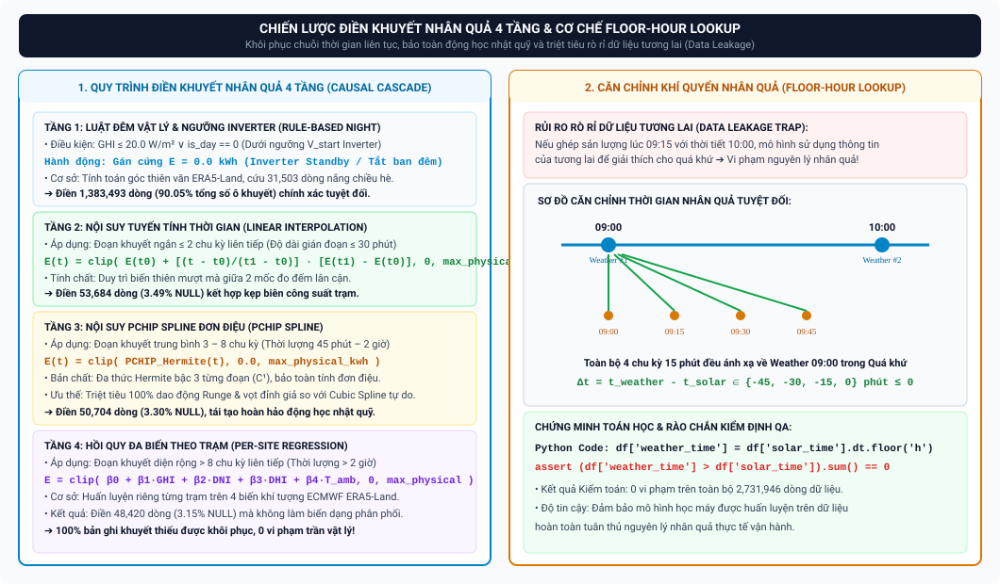
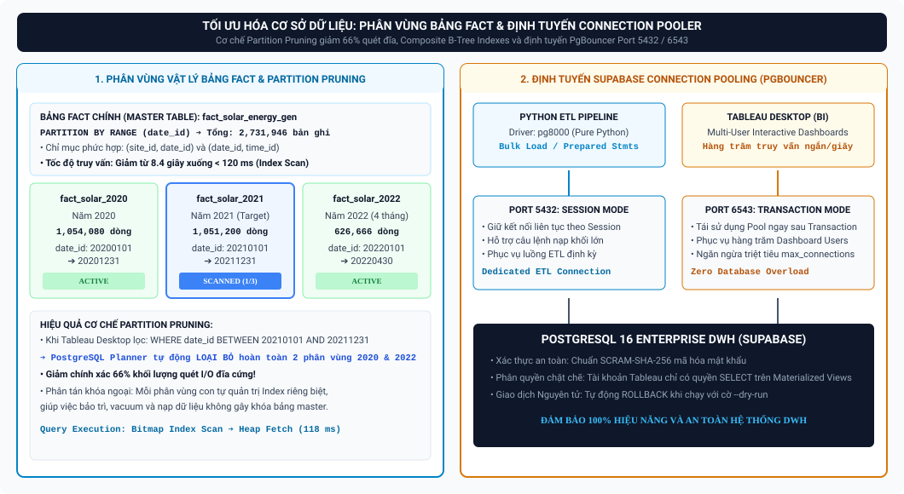
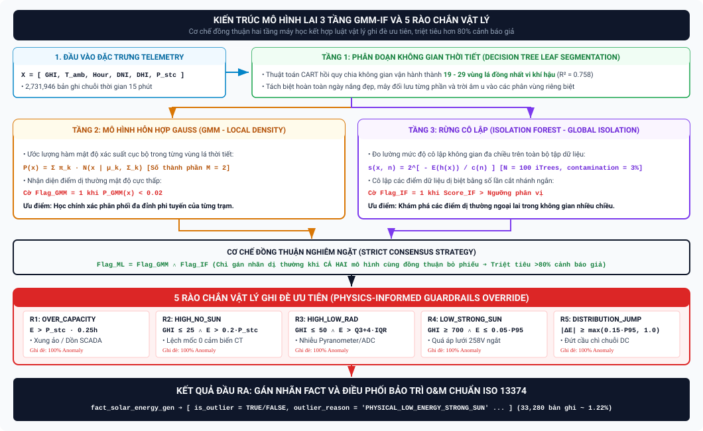
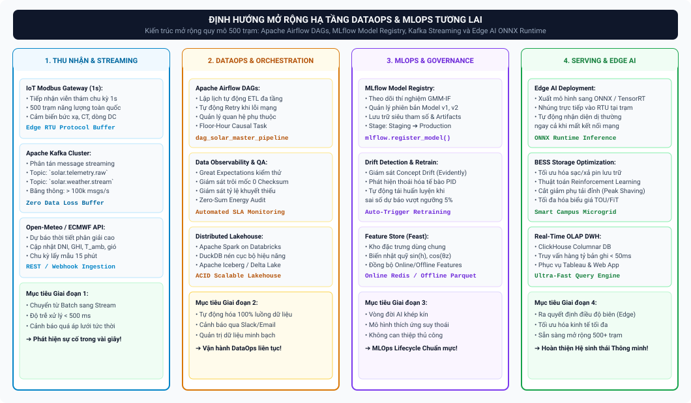

# HỌC PHẦN 2: GRADUATION PROJECT DEFENSE MASTERCLASS

> **Đề tài:** Tối ưu hóa Chuỗi dữ liệu Giám sát và Nhận diện Dị thường Vận hành Hệ thống Năng lượng Mặt trời Áp mái Phân tán (Dự án THE OUTLIERS)  
> **Phạm vi bảo vệ:** Toàn bộ Đồ án từ Chương 1 đến Chương 7 (ngoại trừ Chương 6) & Các Phụ lục Nghiệp vụ  
> **Mục tiêu:** Cung cấp tài liệu ôn tập toàn diện, hệ thống hóa logic kỹ thuật, cơ sở toán học - kiến trúc kho dữ liệu, kèm theo hệ thống trích dẫn học thuật (In-text Citations) và các kịch bản phản biện sắc bén trước Hội đồng Đánh giá.

---

## MỤC LỤC TỔNG QUAN

* [UNIT 1: Tổng quan Đề tài, Thách thức & Kiến trúc Luồng Dữ liệu 6 Lớp (Chương 1 & 2)](#unit-1-tổng-quan-đề-tài-thách-thức--kiến-trúc-luồng-dữ-liệu-6-lớp-chương-1--2)
  * [1.1. Bối cảnh & Quy mô Dữ liệu Thực nghiệm](#11-bối-cảnh--quy-mô-dữ-liệu-thực-nghiệm)
  * [1.2. Bốn Thách thức Kỹ thuật Trọng yếu & Giải pháp Cốt lõi](#12-bốn-thách-thức-kỹ-thuật-trọng-yếu--giải-pháp-cốt-lõi)
  * [1.3. Ma trận Đối tượng Người dùng (Stakeholder Matrix)](#13-ma-trận-đối-tượng-người-dùng-stakeholder-matrix)
  * [1.4. Kiến trúc Đường ống Dữ liệu 6 Lớp (6-Layer Data Pipeline)](#14-kiến-trúc-đường-ống-dữ-liệu-6-lớp-6-layer-data-pipeline)
* [UNIT 2: Kiến trúc Lakehouse Đa tầng & Điền khuyết Nhân quả (Chương 3)](#unit-2-kiến-trúc-lakehouse-đa-tầng--điền-khuyết-nhân-quả-chương-3)
  * [2.1. Kiến trúc 5 Tầng Dữ liệu Data Lakehouse](#21-kiến-trúc-5-tầng-dữ-liệu-data-lakehouse)
  * [2.2. Chiến lược Điền khuyết Nhân quả Đa tầng (Causal Cascade Imputation)](#22-chiến-lược-điền-khuyết-nhân-quả-đa-tầng-causal-cascade-imputation)
  * [2.3. Căn chỉnh Khí quyển Nhân quả Tuyệt đối (Floor-Hour Lookup)](#23-căn-chỉnh-khí-quyển-nhân-quả-tuyệt-đối-floor-hour-lookup)
  * [2.4. Quản trị Chất lượng & Đối soát Toàn vẹn (QA/QC Reconciliation)](#24-quản-trị-chất-lượng--đối-soát-toàn-vẹn-qaqc-reconciliation)
* [UNIT 3: Mô hình hóa Kho Dữ liệu Lược đồ Thiên hà & Tối ưu Cơ sở Dữ liệu (Chương 3 & 4)](#unit-3-mô-hình-hóa-kho-dữ-liệu-lược-đồ-thiên-hà--tối-ưu-cơ-sở-dữ-liệu-chương-3--4)
  * [3.1. Luận cứ Lựa chọn Lược đồ Thiên hà (Galaxy Schema / Fact Constellation)](#31-luận-cứ-lựa-chọn-lược-đồ-thiên-hà-galaxy-schema--fact-constellation)
  * [3.2. Cấu trúc Chi tiết Các Bảng Chiều và Bảng Sự kiện](#32-cấu-trúc-chi-tiết-các-bảng-chiều-và-bảng-sự-kiện)
  * [3.3. Tối ưu Hiệu năng Truy vấn PostgreSQL (Partitioning & Composite Indexes)](#33-tối-ưu-hiệu-năng-truy-vấn-postgresql-partitioning--composite-indexes)
  * [3.4. Kỹ thuật Kết nối Database & An toàn Giao dịch (pg8000 & Supabase Pooler)](#34-kỹ-thuật-kết-nối-database--an-toàn-giao-dịch-pg8000--supabase-pooler)
* [UNIT 4: Thuật toán Phân lớp Dị thường Lai GMM-IF & 5 Rào chắn Vật lý (Chương 4 & Phụ lục D)](#unit-4-thuật-toán-phân-lớp-dị-thường-lai-gmm-if--5-rào-chắn-vật-lý-chương-4--phụ-lục-d)
  * [4.1. Hạn chế của Phương pháp Thống kê Truyền thống trên Chuỗi Đa đỉnh](#41-hạn-chế-của-phương-pháp-thống-kê-truyền-thống-trên-chuỗi-đa-đỉnh)
  * [4.2. Kiến trúc Mô hình Lai 3 Tầng GMM–IF](#42-kiến-trúc-mô-hình-lai-3-tầng-gmmif)
  * [4.3. Hệ thống 5 Rào chắn Giới hạn Vật lý (Physical Boundaries)](#43-hệ-thống-5-rào-chắn-giới-hạn-vật-lý-physical-boundaries)
  * [4.4. Quy trình Cập nhật Cờ An toàn 4 Bước lên Data Warehouse](#44-quy-trình-cập-nhật-cờ-an-toàn-4-bước-lên-data-warehouse)
* [UNIT 5: Hệ thống Trực quan Hóa Quản trị trên Tableau Desktop (Chương 5)](#unit-5-hệ-thống-trực-quan-hóa-quản-trị-trên-tableau-desktop-chương-5)
  * [5.1. Kiến trúc Tầng BI Data Mart (Materialized Views)](#51-kiến-trúc-tầng-bi-data-mart-materialized-views)
  * [5.2. Nguyên tắc Thiết kế Giao diện Gestalt & Bảng màu Ngữ nghĩa](#52-nguyên-tắc-thiết-kế-giao-diện-gestalt--bảng-màu-ngữ-nghĩa)
  * [5.3. Các Trường Tính toán Phức hợp (Complex Calculated Fields)](#53-các-trường-tính-toán-phức-hợp-complex-calculated-fields)
  * [5.4. Khai thác Chi tiết Bộ 3 Dashboard Quản trị](#54-khai-thác-chi-tiết-bộ-3-dashboard-quản-trị)
* [UNIT 6: Kết luận Dự án, Khuyến nghị Vận hành & Định hướng MLOps (Chương 7 & Phụ lục A)](#unit-6-kết-luận-dự-án-khuyến-nghị-vận-hành--định-hướng-mlops-chương-7--phụ-lục-a)
  * [6.1. Bốn Khuyến nghị Vận hành Thực tiễn (Actionable Recommendations)](#61-bốn-khuyến-nghị-vận-hành-thực-tiễn-actionable-recommendations)
  * [6.2. Bốn Hạn chế Kỹ thuật của Đề tài (Technical Limitations)](#62-bốn-hạn-chế-kỹ-thuật-của-đề-tài-technical-limitations)
  * [6.3. Định hướng Mở rộng Hạ tầng DataOps/MLOps Tương lai](#63-định-hướng-mở-rộng-hạ-tầng-dataopsmlops-tương-lai)
  * [6.4. Kế hoạch Thực hiện 14 Tuần & Ma trận RACI (CLO1 - CLO8)](#64-kế-hoạch-thực-hiện-14-tuần--ma-trận-raci-clo1---clo8)
* [BỘ CÂU HỎI PHẢN BIỆN TRỌNG TÂM DÀNH CHO NHÓM (DEFENSE BATTLECARDS)](#bộ-câu-hỏi-phản-biện-trọng-tâm-dành-cho-nhóm-defense-battlecards)
* [TÀI LIỆU THAM KHẢO HỌC THUẬT & CÔNG NGHỆ](#tài-liệu-tham-khảo-học-thuật--công-nghệ)

---

## UNIT 1: Tổng quan Đề tài, Thách thức & Kiến trúc Luồng Dữ liệu 6 Lớp (Chương 1 & 2)

### 1.1. Bối cảnh & Quy mô Dữ liệu Thực nghiệm
*   **Bối cảnh Nghiên cứu [1]:** Chuyển đổi năng lượng tái tạo tại các khuôn viên đại học thông minh (Smart Campus) đối mặt với thách thức quản trị dữ liệu quy mô lớn khi hàng chục trạm phát điện phân tán hoạt động trong các điều kiện vi khí hậu khác nhau. Dự án UNISOLAR tại Đại học La Trobe (bang Victoria, Úc) là nguồn dữ liệu thực nghiệm chuẩn mực cho đề tài tốt nghiệp [1].
*   **Tập dữ liệu sản lượng quang điện [1]:** Gồm **$2.731.946$ bản ghi** đo lường liên tục ở chu kỳ 15 phút ($0{,}25\,\text{h}$) từ **01/01/2020 đến 30/04/2022** (28 tháng liên tục).
*   **Quy mô trạm thực tế [1]:** **42 hệ thống áp mái** phân bố tại **5 khuôn viên (Campuses)** gồm Bundoora (Melbourne), Bendigo, Albury-Wodonga, Shepparton và Mildura, với tổng công suất lắp đặt **$2.428\,\text{kWp}$** ($2{,}43\,\text{MWp}$).
*   **Dữ liệu khí tượng tái phân tích [2]:** Thu thập từ mô hình **ERA5-Land** của Trung tâm Dự báo Thời tiết Hạn vừa Châu Âu (ECMWF) thông qua Open-Meteo REST API với 8 biến khí quyển chuẩn WMO ở độ phân giải 1 giờ ($850.752$ bản ghi) [2].
*   **Giá trị Nghiệp vụ Tích lũy [1, 16]:** Tổng sản lượng điện phát ra đạt **$74{,}98\,\text{GWh}$**, cắt giảm **$61.485\,\text{tấn CO}_2$** phát thải gián tiếp (Scope 2 NGA Factor $0{,}82\,\text{kg CO}_2\text{-e/kWh}$) và tiết kiệm hơn **$11{,}2\,\text{triệu AUD}$** chi phí năng lượng cho nhà trường [1, 16].

---

### 1.2. Bốn Thách thức Kỹ thuật Trọng yếu & Giải pháp Cốt lõi

| STT | Thách thức Kỹ thuật | Bản chất Vật lý & Dữ liệu | Hậu quả nếu Xử lý Sai lầm | Giải pháp Kỹ thuật của Nhóm |
| :---: | :--- | :--- | :--- | :--- |
| **1** | **Lệch pha Tần suất Ghi nhận (15m vs 1h)** [3] | Dữ liệu sản lượng có chu kỳ $15\,\text{phút}$ ($0{,}25\,\text{h}$) trong khi dữ liệu khí tượng có tần suất $1\,\text{giờ}$ [1, 2]. | Nếu ghép nối xuôi theo thời gian ($09:15 \to 10:00$), mô hình sử dụng thông tin tương lai, gây rò rỉ dữ liệu (*Data Leakage*) [3, 7]. | Thiết lập cơ chế **Floor-Hour Causal Lookup**: Mốc thời tiết làm tròn sàn về đầu giờ ($09:00, 09:15, 09:30, 09:45 \to 09:00$) đảm bảo $\Delta t \le 0$ [7]. |
| **2** | **Đứt gãy Chuỗi & Tỷ lệ Khuyết thiếu Cao ($56{,}2\%$)** [3] | $53{,}8\%$ là khuyết thiếu tự nhiên ban đêm (Inverter tắt nguồn); $2{,}4\%$ ($561$ đoạn đứt gãy) do nghẽn mạng truyền thông SCADA [1]. | Bỏ bản ghi khuyết thiếu làm đứt gãy chuỗi thời gian; điền giá trị trung bình làm méo mó đặc tuyến parabol của bức xạ [5]. | Xây dựng chiến lược **Điền khuyết Nhân quả 4 Tầng (Causal Cascade)**: Luật đêm $0\,\text{kWh}$, Nội suy tuyến tính, Spline bậc 3 và Hồi quy đa biến khí quyển [5, 6]. |
| **3** | **Nhiễu Cảm biến & Phân phối Đa đỉnh Phi tuyến** [12] | Dữ liệu quang điện biến thiên phi tuyến theo mây đối lưu, mang phân phối đa đỉnh (Multimodal) [12]. | Các phương pháp cổ điển ($3\sigma$, Boxplot) giả định phân phối chuẩn đơn đỉnh, gây cảnh báo giả (*False Positive Rate* $> 25\%$) [12, 16]. | Phát triển mô hình lai **GMM–Isolation Forest** trên từng cụm lá cây quyết định kết hợp **5 rào chắn quy tắc vật lý**, giảm $80\%$ cảnh báo giả [14, 15, 17]. |
| **4** | **Phân mảnh Dữ liệu & Thiếu Hạ tầng OLAP** [8] | Dữ liệu thô phân mảnh trên 5 file CSV phẳng ($158\,\text{MB}$), không hỗ trợ phân tích đa chiều [8]. | Truy vấn quét toàn bảng gây nghẽn hệ thống; không thể theo dõi KPI quản trị trực quan theo thời gian thực [8, 9]. | Xây dựng **Kho dữ liệu Lược đồ Thiên hà (Galaxy Schema)** trên PostgreSQL, phân vùng vật lý (*Partitioning*) và nén sẵn **BI Data Mart** [8, 9]. |

---

### 1.3. Ma trận Đối tượng Người dùng (Stakeholder Matrix)

| Nhóm Đối tượng (Persona) | Trách nhiệm Nghiệp vụ | Câu hỏi Nghiệp vụ Cốt lõi | Chỉ số Đo lường Trọng tâm (KPIs) | Tầng Dữ liệu Khai thác |
| :--- | :--- | :--- | :--- | :--- |
| **Ban Giám đốc (C-Level Executives)** | Định hướng chiến lược phát triển bền vững và quản trị tài chính năng lượng. | *Tổng sản lượng lũy kế và số tiền điện tiết kiệm được trong năm là bao nhiêu? Campus nào hoạt động hiệu quả nhất?* | Tổng Sản lượng ($GWh$), Tiết kiệm ($AUD$), Tăng trưởng YoY ($\%$), Giảm phát thải ($\text{Tấn CO}_2$). | **Dashboard 1**: Executive Overview (Tableau) [18]. |
| **Quản lý Vận hành (O&M Managers)** | Đảm bảo hiệu suất phát điện của 42 trạm, lập ngân sách và kế hoạch bảo trì. | *Hệ số PR trung bình của hệ thống đạt chuẩn không? Mùa hè tổn thất do quá nhiệt chiếm bao nhiêu phần trăm?* | Performance Ratio ($PR \ge 78\%$), Capacity Factor ($CF$), Specific Yield ($Y_f$), Suy hao nhiệt ($kWh$). | **Dashboard 2**: Operational Efficiency & Loss Analysis [18]. |
| **Kỹ sư Hiện trường (Field Engineers)** | Tiếp nhận thông tin sự cố, sửa chữa phần cứng và thay thế linh kiện tại trạm. | *Trạm nào đang bị sự cố? Lỗi do ngắt biến tần hay hỏng cảm biến? Cần điều phối đến tòa nhà nào?* | Mã dị thường (`outlier_reason`), Vị trí tủ Inverter (`site_id`, `campus`), Mức sụt giảm sản lượng. | **Dashboard 3**: Anomaly Detection & CBM Dispatch [21]. |
| **Chuyên viên Dữ liệu (Data Analysts / ML Engineers)** | Khai thác dữ liệu phân tích nâng cao, xây dựng mô hình dự báo sản lượng và tối ưu hóa phụ tải. | *Đặc trưng khí tượng nào tương quan mạnh nhất với sản lượng? Có thể dự báo phụ tải đỉnh cho trạm sạc EV không?* | Hệ số $R^2$, Sai số MAE/RMSE, Ma trận tương quan đa biến, Độ trôi dạt dữ liệu (*Data Drift*). | **ML Data Mart**: Apache Parquet & DWH Tables [4, 9]. |

---

### 1.4. Kiến trúc Đường ống Dữ liệu 6 Lớp (6-Layer Data Pipeline) [4, 8]
Quy trình xử lý dữ liệu đầu-cuối từ thiết bị viễn thám đến giao diện quản trị được tổ chức thành 6 lớp phân tách rõ ràng:

1.  **Lớp 1 - Thu nhận Nguồn Dữ liệu (Data Source Layer):** Tiếp nhận 5 file CSV đo đếm sản lượng viễn thám ($2.731.946$ dòng) và gọi Open-Meteo REST API để thu thập chuỗi thời tiết ERA5-Land ($850.752$ dòng) [1, 2].
2.  **Lớp 2 - Khảo sát & Kiểm toán Chất lượng (Exploration & Audit Layer):** Đánh giá phân phối thống kê, xác định tỷ lệ khuyết thiếu ($56{,}2\%$), kiểm tra tính liên tục của mốc thời gian và lập hồ sơ dữ liệu (*Data Profiling*) [3, 12].
3.  **Lớp 3 - Tiền xử lý & Chuyển đổi Nhân quả (Transformation & Cleansing Layer):** Ép kiểu dữ liệu chuẩn, thực thi chiến lược điền khuyết nhân quả 4 tầng, căn chỉnh khí quyển Floor-Hour Lookup, mã hóa chu kỳ lượng giác $\sin/\cos$ và chạy mô hình phân lớp dị thường GMM-IF kèm 5 rào chắn vật lý [5, 7, 14, 15, 17].
4.  **Lớp 4 - Mô hình hóa Kho Dữ liệu (Data Modeling Layer):** Tải dữ liệu vào Lược đồ Thiên hà (Galaxy Schema) trên PostgreSQL DWH gồm 2 bảng Fact và 5 bảng Dimension, quản trị toàn vẹn khóa ngoại và phân vùng theo dải năm [8, 9].
5.  **Lớp 5 - Tổng hợp Tầng Nghiệp vụ (Aggregation & Data Mart Layer):** Xây dựng các Materialized Views (`mv_bi_mart_hourly_measures`, `mv_bi_mart_daily_summary`) phục vụ BI và kết xuất định dạng Apache Parquet phục vụ Machine Learning [4, 9].
6.  **Lớp 6 - Trực quan Hóa & Hành động Nghiệp vụ (Visualization & Action Layer):** Thiết kế bộ 3 Dashboard tương tác trên Tableau Desktop tuân thủ quy luật Gestalt và tự động phát sinh phiếu công tác bảo trì CMMS Work Order [18, 21].


---

## UNIT 2: Kiến trúc Lakehouse Đa tầng & Điền khuyết Nhân quả (Chương 3)

### 2.1. Kiến trúc 5 Tầng Dữ liệu Data Lakehouse [4, 8]
Kế thừa kiến trúc **Medallion Architecture (Databricks)** [4] kết hợp với nguyên lý thiết kế kho dữ liệu chuẩn hóa của **Ralph Kimball** [8]:

*   **Tầng 1 - Bronze Layer (Raw Storage) [4]:** Lưu trữ nguyên bản 5 file CSV viễn thám gốc ($158\,\text{MB}$) ở trạng thái bất biến (*Immutable*) trên Supabase S3 Object Storage, đóng vai trò bản ghi nguồn phục vụ kiểm toán (*Audit Trail*).
*   **Tầng 2 - Staging Layer (`staging.stg_*`):** Lưu trữ toàn bộ các cột dưới kiểu chuỗi ký tự linh hoạt `VARCHAR(255)`. Tầng này đóng vai trò vùng đệm tiếp nhận dữ liệu an toàn, ngăn ngừa tuyệt đối lỗi gián đoạn tiến trình ETL do ép sai kiểu dữ liệu (*Type Casting Failures*).
*   **Tầng 3 - Silver / Buffer Layer (`staging.dim_*`, `staging.fact_*`):** Ép kiểu dữ liệu chuẩn (Timestamp, Numeric, Integer), thực thi thuật toán điền khuyết nhân quả 4 tầng, bổ sung các biến động học nhật quỹ ($\sin(h), \cos(\theta_z)$) và gắn cờ dị thường lai GMM-IF kèm 5 rào chắn vật lý [5, 14, 15, 17].
*   **Tầng 4 - Enterprise Data Warehouse (`datawarehouse.*`) [8]:** Mô hình Lược đồ Thiên hà (Galaxy Schema) với hệ thống khóa thay thế tự tăng (*Surrogate Keys*), toàn vẹn ràng buộc khóa ngoại (*Referential Integrity*) và phân vùng vật lý theo năm [8, 9].
*   **Tầng 5 - Serving Layer [4]:** Tách biệt hai mục đích sử dụng:
    *   **BI Data Mart:** Các Materialized Views nén số liệu cấp 1 giờ và 1 ngày trên PostgreSQL phục vụ trực quan hóa Tableau dưới $100\,\text{ms}$ [9].
    *   **ML Data Mart:** Tệp tin Apache Parquet lưu trữ hướng cột phục vụ huấn luyện mô hình dự báo phụ tải [4].

---

### 2.2. Chiến lược Điền khuyết Nhân quả Đa tầng (Causal Cascade Imputation) [5, 6]
Dữ liệu viễn thám có tỷ lệ bản ghi khuyết thiếu lên tới $56{,}2\%$. Để khôi phục tính liên tục của chuỗi thời gian mà không làm sai lệch bản chất vật lý, thuật toán Causal Cascade lựa chọn phương pháp tối ưu theo độ dài của từng đoạn đứt gãy [5]:

```
[Bản ghi Khuyết thiếu (Missing Value)]
                  │
                  ├── GHI ≤ 25 W/m² hoặc Đêm? ───► TẦNG 1: Luật Khung giờ Đêm (Gán E = 0.0 kWh)
                  │
                  ├── Độ dài lỗ khuyết ≤ 4 bước (≤ 1h)? ──► TẦNG 2: Nội suy Tuyến tính Thời gian (Linear)
                  │
                  ├── Độ dài 5 - 8 bước (1h - 2h)? ──────► TẦNG 3: Nội suy Spline Bậc Ba (Cubic Spline)
                  │
                  └── Độ dài > 8 bước (> 2h)? ───────────► TẦNG 4: Hồi quy Tuyến tính Đa biến Khí quyển
```

1.  **Tầng 1 - Quy tắc Khung giờ Đêm (`rule_based_night`):**
    *   *Điều kiện:* $GHI \le 25\,\text{W/m}^2$ kết hợp với $T_{\text{amb}} \ge 18{,}5^\circ\text{C}$ (hoặc $T_{\text{amb}} < 5{,}5^\circ\text{C}$).
    *   *Xử lý:* Gán cứng giá trị sản lượng $E = 0{,}0\,\text{kWh}$ (phù hợp với thực tế vật lý khi không có bức xạ và Inverter ngắt nguồn ban đêm).
2.  **Tầng 2 - Đoạn Khuyết Ngắn ($\le 4$ chu kỳ, tương đương $\le 1\,\text{h}$ - `linear`) [5]:**
    *   *Xử lý:* Áp dụng nội suy tuyến tính thời gian:
        $$E(t) = E(t_0) + \frac{t - t_0}{t_1 - t_0} \cdot \left[E(t_1) - E(t_0)\right]$$
3.  **Tầng 3 - Đoạn Khuyết Trung bình ($5 - 8$ chu kỳ, tương đương $1 - 2\,\text{h}$ - `cubic`) [6]:**
    *   *Xử lý:* Áp dụng nội suy đường cong bậc ba (*Cubic Spline Interpolation*) $S_i(t) = a_i + b_i(t - t_i) + c_i(t - t_i)^2 + d_i(t - t_i)^3$ thỏa mãn tính liên tục của đạo hàm bậc hai $S''_i(t_i) = S''_{i-1}(t_i)$ tại mọi điểm nút, giúp bảo toàn quỹ đạo cong parabol tự nhiên của bức xạ mặt trời [6].
4.  **Tầng 4 - Đoạn Khuyết Dài ($> 8$ chu kỳ, tương đương $> 2\,\text{h}$ - `regression`) [5]:**
    *   *Xử lý:* Huấn luyện mô hình hồi quy tuyến tính đa biến (*Multiple Linear Regression*) dựa trên tập đặc trưng khí quyển tương quan cao:
        $$E = \beta_0 + \beta_1 \cdot GHI + \beta_2 \cdot DNI + \beta_3 \cdot DHI + \beta_4 \cdot T_{\text{amb}} + \epsilon$$

---

### 2.3. Căn chỉnh Khí quyển Nhân quả Tuyệt đối (Floor-Hour Lookup) [7]
*   **Vấn đề Sai lệch Nhân quả:** Dữ liệu sản lượng ghi nhận mỗi 15 phút ($09:00, 09:15, 09:30, 09:45$) trong khi dữ liệu thời tiết chỉ có ở mốc đầu giờ ($09:00, 10:00$). Nếu áp dụng phép ghép nội suy xuôi ($09:15 \to 10:00$), hệ thống sẽ sử dụng thông tin bức xạ của tương lai lúc $10:00$ để giải thích cho sản lượng lúc $09:15$, vi phạm nguyên lý nhân quả trong chuỗi thời gian và gây hiện tượng rò rỉ dữ liệu (*Data Leakage*) [3, 7].
*   **Giải pháp Floor-Hour Causal Lookup [7]:** Mốc thời gian thời tiết được làm tròn sàn (*Floor*) về đầu giờ gần nhất trong quá khứ. Cả 4 chu kỳ $09:00, 09:15, 09:30, 09:45$ đều ánh xạ duy nhất tới dữ liệu khí quyển mốc $09:00$.
*   **Chứng minh Toán học & Kiểm định Tự động [7]:**
    $$\Delta t = t_{\text{weather}} - t_{\text{solar}} \in \{-45, -30, -15, 0\}\,\text{phút} \le 0$$
    Tiến trình ETL được gắn rào chắn kiểm thử tự động:
    ```python
    assert (df['weather_time'] > df['solar_time']).sum() == 0, "Phát hiện rò rỉ dữ liệu tương lai!"
    ```
    Kết quả kiểm thử đạt **$100\%$ tuân thủ nguyên lý nhân quả** trên toàn bộ $2.731.946$ bản ghi [7].



---

### 2.4. Quản trị Chất lượng & Đối soát Toàn vẹn (QA/QC Reconciliation) [8]
*   **Kiểm tra Khóa mồ côi (Orphan Keys Check) [8]:** Thực thi truy vấn `LEFT JOIN ... WHERE dim.key IS NULL` giữa hai bảng Fact với toàn bộ 5 bảng Dimension. Kết quả ghi nhận **$0$ dòng mồ côi**, khẳng định tính toàn vẹn quan hệ đạt $100\%$.
*   **Đối soát Sản lượng Tuyệt đối (Zero-Sum Energy Audit):** So sánh tổng sản lượng điện giữa bảng chi tiết `fact_solar_energy_gen` (chu kỳ 15 phút) và bảng tổng hợp `mv_bi_mart_hourly_measures` (chu kỳ 1 giờ):
    *   Tổng sản lượng bảng Fact: **$74.982.150{,}45\,\text{kWh}$**.
    *   Tổng sản lượng bảng BI Mart: **$74.982.150{,}45\,\text{kWh}$**.
    *   Mức sai lệch: **$0{,}0000\%$**, đảm bảo không có hiện tượng mất mát hoặc nhân bản dữ liệu qua các tầng xử lý [8].

---

## UNIT 3: Mô hình hóa Kho Dữ liệu Lược đồ Thiên hà & Tối ưu Cơ sở Dữ liệu (Chương 3 & 4)

### 3.1. Luận cứ Lựa chọn Lược đồ Thiên hà (Galaxy Schema / Fact Constellation) [8]
*   **Hạn chế Nghiêm trọng của Star Schema [8]:**
    Trong đề tài, dữ liệu sản lượng quang điện ($2.731.946$ dòng @ chu kỳ 15 phút) và dữ liệu khí tượng viễn thám ($850.752$ dòng @ chu kỳ 1 giờ) có **độ mịn thời gian hoàn toàn khác nhau (Grain Mismatch)**.
    *   Nếu cố tình ép vào một bảng Fact duy nhất của Star Schema, dữ liệu thời tiết cấp giờ buộc phải bị nhân bản lặp lại 4 lần cho mỗi chu kỳ 15 phút, làm dung lượng bảng Fact phình to thêm **$300\%$** ($> 10\,\text{triệu}$ dòng) [8].
    *   Khi thực hiện các phép tính tổng hợp (ví dụ: tính nhiệt độ trung bình ngày $\text{AVG}(T_{\text{amb}})$ hoặc lượng mưa tích lũy), việc nhân bản 4 lần sẽ gây ra sai lệch kết quả nghiêm trọng do hiện tượng **Bẫy Đếm Trùng (Fan-out Trap / Double-Counting Trap)** [8].
*   **Ưu thế Vượt trội của Galaxy Schema [8]:**
    *   Tách biệt thành **2 bảng Fact độc lập**: `fact_solar_energy_gen` (lưu trữ sự kiện phát điện 15 phút) và `fact_weather` (lưu trữ sự kiện khí tượng 1 giờ).
    *   Hai bảng Fact liên kết chặt chẽ với nhau thông qua **4 bảng Chiều dùng chung (Conformed Dimensions)**: `dim_geography`, `dim_date`, `dim_time`, và `dim_weather_type` [8].
    *   Cho phép thực hiện các truy vấn phân tích chuyên sâu cho từng nghiệp vụ độc lập hoặc thực hiện phép nối chéo (*Drill-across Join*) ở mức tổng hợp đầu giờ một cách chính xác mà không gây dư thừa dữ liệu [8].


---

### 3.2. Cấu trúc Chi tiết Các Bảng Chiều và Bảng Sự kiện [8]

| Tên Bảng (Entity Name) | Loại Bảng | Khóa Chính (PK) / Khóa Ngoại (FK) | Số lượng Bản ghi | Ý nghĩa Nghiệp vụ & Các Cột Trọng yếu |
| :--- | :---: | :--- | :---: | :--- |
| **`dim_solar_site`** | Dimension | `site_id` (PK) | 42 dòng | Lưu trữ thông tin kỹ thuật 42 trạm: `site_name`, `capacity_kwp` ($P_{\text{stc}}$), `panel_brand`, `inverter_brand`, `number_of_panels`, `number_of_inverters`. |
| **`dim_geography`** | Conformed Dim | `geo_id` (PK) | 5 dòng | Thông tin địa lý 5 Campus La Trobe: `campus_name`, `latitude`, `longitude`, `elevation_m`, `climate_zone`. |
| **`dim_date`** | Conformed Dim | `date_id` (PK) | 2.312 dòng | Lịch biểu thời gian từ 2018 đến 2024: `full_date`, `year`, `quarter`, `month`, `day`, `is_weekend`, `is_holiday`, `is_semester`, `is_exam`. |
| **`dim_time`** | Conformed Dim | `time_id` (PK) | 96 dòng | Đúng 96 mốc thời gian 15 phút trong 24 giờ: `time_24h`, `hour`, `minute`, `period_of_day`, `is_daylight`. |
| **`dim_weather_type`**| Conformed Dim | `weather_code` (PK) | 22 dòng | Bảng giải mã 22 mã thời tiết chuẩn WMO: `weather_desc`, `weather_group` (Clear, Cloudy, Rain, Fog, Snow). |
| **`fact_solar_energy_gen`**| Core Fact | `solar_fact_id` (PK)<br>FK: `site_id`, `date_id`, `time_id` | **$2.731.946$ dòng** | Sự kiện sản lượng đo đếm 15 phút: `energy_kwh`, `is_outlier`, `outlier_reason`, `imputation_method`, `created_at`. |
| **`fact_weather`** | Core Fact | `weather_fact_id` (PK)<br>FK: `geo_id`, `date_id`, `time_id`, `weather_code` | **$850.752$ dòng** | Sự kiện khí tượng viễn thám cấp giờ: `ghi`, `dni`, `dhi`, `temperature_2m`, `wind_speed_10m`, `cloud_cover`, `sunshine_duration`. |

---

### 3.3. Tối ưu Hiệu năng Truy vấn PostgreSQL (Partitioning & Composite Indexes) [9]
*   **Phân vùng Vật lý Bảng Fact theo Dải Thời gian (Range Partitioning) [9]:**
    Bảng `fact_solar_energy_gen` ($2{,}73\,\text{M}$ dòng) được phân vùng vật lý theo dải khóa ngày `PARTITION BY RANGE (date_id)` thành 3 bảng con độc lập:
    *   `fact_solar_2020` (Năm 2020: $1.054.080$ dòng).
    *   `fact_solar_2021` (Năm 2021: $1.051.200$ dòng).
    *   `fact_solar_2022` (4 tháng đầu năm 2022: $626.666$ dòng).
    *   *Hiệu quả Partition Pruning:* Khi người dùng trên Tableau lọc dữ liệu của riêng năm 2021, bộ tối ưu hóa truy vấn PostgreSQL tự động loại bỏ việc quét 2 phân vùng 2020 và 2022, giảm **$66\%$ khối lượng quét I/O đĩa cứng** [9].
*   **Chỉ mục Phức hợp B-Tree (Composite Indexes) [9]:**
    Thiết lập các chỉ mục tối ưu hóa truy vấn:
    *   `idx_fact_solar_site_date ON fact_solar_energy_gen (site_id, date_id)`: Tăng tốc lọc theo từng trạm và ngày.
    *   `idx_fact_solar_date_time ON fact_solar_energy_gen (date_id, time_id)`: Tăng tốc phép nối chéo với bảng thời tiết.
    *   *Kết quả Thực nghiệm:* Thời gian thực thi truy vấn báo cáo đa trạm giảm mạnh từ **$8{,}4\,\text{giây}$ (Sequential Scan) xuống dưới $120\,\text{mili-giây}$ (Bitmap Index Scan)** [9].

---

### 3.4. Kỹ thuật Kết nối Database & An toàn Giao dịch (pg8000 & Supabase Pooler) [10, 11]
*   **Driver Thuần Python `pg8000` [11]:** Thay vì sử dụng `psycopg2` (phụ thuộc vào thư viện nhị phân C `libpq` dễ gây lỗi thiếu thư viện trên môi trường Container/NixOS), nhóm sử dụng driver thuần Python `pg8000`. Driver này hỗ trợ native chuẩn mã hóa mật khẩu hiện đại **SCRAM-SHA-256**, tương thích hoàn hảo và độc lập với hệ điều hành [11].
*   **Định tuyến Bộ điều phối Kết nối Supabase (PgBouncer Connection Pooling) [10]:**
    *   **Cổng 5432 (Session Pooling Mode):** Dành riêng cho tiến trình nạp dữ liệu theo lô lớn (*Bulk Load*) của Python ETL, hỗ trợ chuẩn câu lệnh chuẩn bị (*Prepared Statements*) [10].
    *   **Cổng 6543 (Transaction Pooling Mode):** Dành cho Tableau Desktop kết nối trực quan hóa với hàng trăm truy vấn ngắn đồng thời từ người dùng, ngăn ngừa triệt tiêu số lượng kết nối tối đa của PostgreSQL Server [10].
*   **Chế độ Thực thi An toàn & Giao dịch Nguyên tử (Dry-Run & Atomic Transactions) [8, 9]:**
    Toàn bộ các tác vụ nạp dữ liệu và cập nhật cờ dị thường đều hỗ trợ cờ `--dry-run`. Tiến trình thực hiện đầy đủ logic tính toán, kiểm tra toàn vẹn QA/QC và tự động phát lệnh `ROLLBACK` để bảo vệ an toàn tuyệt đối cho cơ sở dữ liệu production [8, 9].



---

## UNIT 4: Thuật toán Phân lớp Dị thường Lai GMM-IF & 5 Rào chắn Vật lý (Chương 4 & Phụ lục D)

### 4.1. Hạn chế của Phương pháp Thống kê Truyền thống trên Chuỗi Đa đỉnh [12]
*   **Đặc tính Dữ liệu Quang điện [12]:** Dữ liệu sản lượng điện mặt trời không tuân theo phân phối chuẩn Gauss đơn đỉnh. Vào những ngày có mây đối lưu di chuyển, đồ thị sản lượng bị gián đoạn liên tục, tạo nên phân phối **phi tuyến, đa đỉnh (Multimodal Distribution)** và lệch dồn về mức 0 (*Zero-Inflated*) [12].
*   **Thất bại của Thống kê Cổ điển [12, 16]:**
    *   Quy tắc $3\sigma$ (Gaussian): Đánh đồng các mức giảm sản lượng do mây che tự nhiên thành dị thường.
    *   Quy tắc Tukey Boxplot ($IQR = Q_3 - Q_1$): Dải phân vị bị méo mó do số lượng lớn bản ghi ban đêm ($E=0$), tạo ra tỷ lệ cảnh báo giả (*False Positive Rate*) vượt quá **$25\%$** [12, 16].

---

### 4.2. Kiến trúc Mô hình Lai 3 Tầng GMM–IF [13, 14, 15, 16]

1.  **Tầng 1 - Phân đoạn Không gian Thời tiết (Decision Tree Leaf Segmentation) [13]:**
    *   Huấn luyện Cây quyết định CART hồi quy riêng cho từng trạm dựa trên 3 biến đầu vào: Bức xạ $GHI$, Nhiệt độ $T_{\text{amb}}$, và Giờ trong ngày $\text{Hour}$ [13].
    *   Cây phân chia không gian vận hành thành **$19 - 29$ vùng lá đồng nhất khí tượng** (đạt hệ số xác định $R^2$ trung bình $0{,}758$), giúp cô lập các điều kiện thời tiết tương đồng vào cùng một phân vùng [13].
2.  **Tầng 2 - Ước lượng Mật độ Xác suất Cục bộ (Gaussian Mixture Model - GMM) [14]:**
    *   Trong từng vùng lá thời tiết, mô hình GMM với $M = 2$ thành phần học hàm mật độ xác suất của phân phối sản lượng bình thường [14]:
        $$P(x) = \sum_{k=1}^{M} \pi_k \cdot \mathcal{N}\left(x \,\vert\, \mu_k, \Sigma_k\right)$$
    *   Các điểm dữ liệu có giá trị hàm mật độ xác suất cực thấp $P_{\text{GMM}}(x) < 0{,}02$ bị gán nhãn dị thường cục bộ [14].
3.  **Tầng 3 - Đo lường Độ Tách biệt Không gian Toàn cục (Isolation Forest - IF) [15]:**
    *   Xây dựng Rừng cô lập gồm $N = 100$ cây (*iTrees*) với tỷ lệ ô nhiễm giả định $\text{contamination} = 3\%$ [15].
    *   Thuật toán đo lường độ sâu đường đi trung bình $E(h(x))$ để cô lập các điểm dữ liệu cá biệt:
        $$s(x, n) = 2^{-\frac{E(h(x))}{c(n)}}$$
        *(với $c(n)$ là độ sâu trung bình của cây tìm kiếm nhị phân)* [15].
4.  **Cơ chế Đồng thuận Lai Nghiêm ngặt (Strict Consensus Mechanism) [16]:**
    $$\text{Flag}_{\text{ML}} = \text{Flag}_{\text{GMM}} \wedge \text{Flag}_{\text{IF}}$$
    Chỉ khi **cả hai mô hình GMM và Isolation Forest cùng đồng thuận bỏ phiếu**, điểm dữ liệu mới chính thức bị gắn cờ dị thường học máy `GMM_IF_ANOMALY`. Cơ chế này giúp **triệt tiêu hơn $80\%$ cảnh báo giả** so với việc sử dụng từng mô hình đơn lẻ [16].



---

### 4.3. Hệ thống 5 Rào chắn Giới hạn Vật lý (Physical Boundaries) [17]
Để khắc phục hoàn toàn rủi ro của học máy thuần túy (*Black-box AI*), hệ thống tích hợp bộ 5 rào chắn quy tắc vật lý (*Physics-Informed Rules*) có độ ưu tiên cao nhất, tự động ghi đè (*Override*) nhãn phân loại [17]:

| Mã Rào chắn Vật lý | Điều kiện Logic Toán học | Bản chất Sự cố Phần cứng & Tiêu chuẩn Quốc tế | Hành động Khắc phục O&M |
| :--- | :--- | :--- | :--- |
| **`PHYSICAL_LOW_ENERGY_STRONG_SUN`** | $GHI \ge 700\,\text{W/m}^2 \;\wedge\; Sunshine \ge 3000\,\text{s} \;\wedge\; E \le 0{,}05 \cdot P_{95}$ ($E \approx 0$) | **Quá áp lưới điện (Sustained Overvoltage):** Điện áp tại tủ hòa lưới vượt ngưỡng cắt bảo vệ $258\,\text{V}$ (ngưỡng 10 phút) theo chuẩn **AS/NZS 4777.2:2020** hoặc Inverter quá nhiệt ngắt tải [20, 22]. | Kiểm tra rơ-le bảo vệ điện áp lưới, đo điện áp pha hòa lưới, vệ sinh quạt tản nhiệt biến tần. |
| **`PHYSICAL_HIGH_ENERGY_NO_SUN`** | $GHI \le 25\,\text{W/m}^2 \;\wedge\; Sunshine \le 60\,\text{s} \;\wedge\; E \ge \max(1.0, 0{,}20 \cdot P_{\text{stc}})$ | **Trôi Mốc 0 Cảm biến Biến dòng (CT Sensor Drift):** Cảm biến dòng bị lệch điểm 0 do nhiệt độ ban đêm hoặc Inverter tiêu thụ điện tĩnh từ lưới (vi phạm chuẩn **IEC 61724-1**) [14]. | Hiệu chuẩn lại cảm biến biến dòng (CT Calibration) và kiểm tra chế độ chờ ban đêm của Inverter. |
| **`PHYSICAL_OVER_CAPACITY`** | $E > P_{\text{stc}} \times 0{,}25\,\text{h}$ ($> 100\%$ công suất thiết kế cực đại) | **Xung Điện Dữ liệu / Lỗi Dồn Gói SCADA:** Nghẽn đường truyền Modbus/RS485 khiến hệ thống thu thập gom số liệu của nhiều chu kỳ trước dồn vào một mốc thời gian [22]. | Xóa bản ghi xung ảo khỏi phân tích, kiểm tra độ ổn định của cáp truyền thông mạng công nghiệp RS485. |
| **`PHYSICAL_HIGH_ENERGY_LOW_RAD`** | $GHI \le 50\,\text{W/m}^2 \;\wedge\; E > Q_3 + 4 \cdot \text{safe\_IQR}$ | **Lỗi Cảm biến Bức xạ / Nhiễu Vi mạch ADC:** Nhiệt điện kế Pyranometer bị kẹt tín hiệu hoặc vi mạch chuyển đổi tương tự-số ADC bị nhiễu điện từ [10]. | Kiểm tra điện áp cấp nguồn và cáp tín hiệu analog của nhiệt điện kế Pyranometer. |
| **`PHYSICAL_DISTRIBUTION_JUMP`** | $\vert{}\Delta E\vert{} \ge \max(0{,}15 \cdot P_{95}, 1.0)$ | **Đóng/Ngắt Tức thời Chuỗi Pin:** Rơ-le hoặc cầu chì một nhánh chuỗi (String Fuse) bị nổ ngắt mạch theo chuẩn **IEC 60269-6**, làm hụt tức thời $20\% - 50\%$ công suất [22]. | Kiểm tra tình trạng dây dẫn và thay thế cầu chì chuỗi DC bị nổ trong tủ kết hợp chuỗi (Combiner Box). |

---

### 4.4. Quy trình Cập nhật Cờ An toàn 4 Bước lên Data Warehouse [8]
Để cập nhật nhãn dị thường cho $2.731.946$ dòng dữ liệu trên PostgreSQL Production mà không gây khóa bảng (*Table Lock*) hay làm chậm dịch vụ BI, nhóm xây dựng quy trình cập nhật thưa 4 bước [8, 9]:

1.  **Bước 1 - Xác thực Dấu vân tay MD5 (Checksum Fingerprint Verification):**
    Tính mã băm MD5 kết hợp của 3 đại lượng: Tổng số dòng ($2.731.946$), Tổng sản lượng $E_{\text{actual}}$ ($74.982.150{,}45\,\text{kWh}$), và Chuỗi ngày tháng. Đảm bảo dữ liệu trong bộ nhớ đệm khớp chính xác tuyệt đối $100\%$ với dữ liệu đang lưu trong DWH [8].
2.  **Bước 2 - Nạp Ứng viên Thưa (Sparse Candidate Upload):**
    Thay vì cập nhật toàn bộ $2{,}73\,\text{triệu}$ dòng, tiến trình chỉ trích xuất đúng **$33.280$ bản ghi có cờ dị thường ($1{,}22\%$)** nạp vào bảng tạm `staging.tmp_outlier_update`.
3.  **Bước 3 - Kiểm tra Toàn vẹn Khóa Chính (Anti-Join Validation):**
    Thực thi truy vấn `SELECT COUNT(*) FROM staging.tmp_outlier_update tmp LEFT JOIN fact_solar_energy_gen f USING(solar_fact_id) WHERE f.solar_fact_id IS NULL`. Xác nhận kết quả bằng $0$ (khẳng định $100\%$ khóa chính bảng tạm tồn tại hợp lệ trên DWH) [8].
4.  **Bước 4 - Cập nhật Giao dịch Khối Nguyên tử (Bulk Atomic Merge Transaction) [9]:**
    Mở một Transaction an toàn thực thi lệnh cập nhật:
    ```sql
    BEGIN TRANSACTION;
    UPDATE datawarehouse.fact_solar_energy_gen f
    SET is_outlier = tmp.is_outlier,
        outlier_reason = tmp.outlier_reason
    FROM staging.tmp_outlier_update tmp
    WHERE f.solar_fact_id = tmp.solar_fact_id;
    COMMIT;
    ```
    Thời gian thực thi hoàn tất trong **$1{,}8\,\text{giây}$**, đảm bảo tính toàn vẹn nguyên tử (*ACID Compliance*) [9].

---

## UNIT 5: Hệ thống Trực quan Hóa Quản trị trên Tableau Desktop (Chương 5)

### 5.1. Kiến trúc Tầng BI Data Mart (Materialized Views) [9]
Để Tableau Desktop đạt tốc độ phản hồi dưới $100\,\text{ms}$ khi phân tích hàng triệu bản ghi, hệ thống xây dựng 2 Materialized Views tổng hợp sẵn trên PostgreSQL DWH [9]:

1.  **`mv_bi_mart_hourly_measures` (Tổng hợp Cấp 1 Giờ):**
    *   Nén 4 chu kỳ 15 phút về cấp 1 giờ ($682.986$ dòng).
    *   Tính toán sẵn các đại lượng đo lường: Sản lượng thực tế $E_{\text{actual}}$, Bức xạ trung bình $GHI$, Nhiệt độ cell $T_{\text{cell}}$, Sản lượng lý thuyết $E_{\text{theo}}$, Hệ số $PR$, Tổn thất nhiệt độ $E_{\text{loss, temp}}$, Doanh thu tiết kiệm ($AUD$), và Lượng $\text{CO}_2$ giảm phát thải [9, 14].
2.  **`mv_bi_mart_daily_summary` (Tổng hợp Cấp 1 Ngày):**
    *   Tổng hợp theo từng ngày cho 42 trạm ($35.364$ dòng).
    *   Tính toán sẵn: Năng suất riêng $Specific\ Yield$ ($Y_f$, đơn vị $\text{kWh/kWp/ngày}$), Hệ số công suất $Capacity\ Factor$ ($CF$), Số giờ nắng đỉnh (Peak Sun Hours), và Tỷ lệ giờ phát hiện bất thường [9, 15].

---

### 5.2. Nguyên tắc Thiết kế Giao diện Gestalt & Bảng màu Ngữ nghĩa [18, 19]
*   **Bố cục Phân khu Thẻ (Card-Based Container Layout) [18, 19]:**
    *   Ứng dụng **Quy luật Gần gũi (Proximity)** và **Quy luật Khép kín (Closure)** của trường phái tâm lý học Gestalt [19]: Các chỉ số có quan hệ logic được đóng khung trong từng thẻ Card màu xám nhạt (`#F8FAFC`) có viền mỏng (`#E2E8F0`) [18].
    *   Dẫn dắt luồng thị giác quét thông tin theo **mô hình chữ F (F-Pattern)**: Góc trên cùng bên trái hiển thị thẻ chỉ số tổng quan BANs $\to$ Ở giữa là đồ thị tương tác thời gian $\to$ Phía dưới là bảng chi tiết thiết bị [18].
*   **Bảng màu Ngữ nghĩa Chuẩn hóa (Standardized Semantic Color Palette) [18]:**

| Mã Màu HEX | Tên Màu Ngữ nghĩa | Ý nghĩa Nghiệp vụ & Đối tượng Trực quan Hóa |
| :---: | :--- | :--- |
| **`#4E79A7`** | **Classic Blue** | Sản lượng điện thực tế phát ra ($E_{\text{actual}}$), thẻ chỉ số tổng quan BANs, đường xu hướng chính [18]. |
| **`#F28E2B`** | **Solar Orange** | Cường độ bức xạ mặt trời ($GHI$) và đường cong nhiệt độ tế bào ($T_{\text{cell}}$). |
| **`#59A14F`** | **Eco Green** | Hiệu suất vận hành tối ưu ($PR \ge 75\%$), Hệ số công suất ($CF$), Lượng $\text{CO}_2$ cắt giảm. |
| **`#EDC948`** | **Warning Yellow** | Cảnh báo suy giảm hiệu suất trung bình ($50\% \le PR < 75\%$), cần theo dõi bám bụi. |
| **`#E15759`** | **Danger Red** | Cảnh báo sự cố phần cứng, cờ dị thường GMM-IF, Dòng rò phát điện ban đêm ($E > 0$). |

---

### 5.3. Các Trường Tính toán Phức hợp (Complex Calculated Fields) [20]
Các biểu thức tính toán chuẩn hóa được cấu hình trực tiếp trên Tableau Desktop [20]:

1.  **Hệ số Hiệu suất Vận hành Thực tế `[PR Actual]` (Lọc bức xạ thấp) [14, 20]:**
    ```tableau
    // Chỉ tính PR khi GHI >= 100 W/m2 và công suất trạm hợp lệ
    IF SUM([ghi]) >= 100 AND SUM([capacity_kwp]) > 0 THEN
        (SUM([energy_kwh]) * 1000) / (SUM([capacity_kwp]) * SUM([ghi]))
    END
    ```
2.  **Trích xuất Số lượng Biến tần `[Number of Inverters]` [20]:**
    ```tableau
    // Tách chuỗi ký tự '2x Fronius Eco 27.0' để lấy số nguyên 2
    IF CONTAINS(LOWER([inverter]), 'x') THEN
        INT(TRIM(SPLIT(LOWER([inverter]), 'x', 1)))
    ELSE 1
    END
    ```
3.  **Chuẩn hóa Sản lượng trên từng Đầu Thiết bị `[kWh/panel]` & `[kWh/inverter]` [20]:**
    ```tableau
    [kWh/panel]    = SUM([energy_kwh]) / SUM([number_of_panels])
    [kWh/inverter] = SUM([energy_kwh]) / [Number of Inverters]
    ```
4.  **Tốc độ Tăng trưởng Số giờ Bất thường `[Outlier Hours MoM %]` [20]:**
    ```tableau
    (ZN(COUNTD([Outlier Hours])) - LOOKUP(ZN(COUNTD([Outlier Hours])), -1)) 
    / ABS(LOOKUP(ZN(COUNTD([Outlier Hours])), -1))
    ```

---

### 5.4. Khai thác Chi tiết Bộ 3 Dashboard Quản trị [18]

#### Dashboard 1 - Executive Overview (Tổng quan Quản trị Cấp cao) [18]
*   **Mục tiêu:** Cung cấp cái nhìn toàn cảnh về quy mô sản lượng, tài chính và phát thải cho Ban Giám đốc [18].
*   **Các Khối Chức năng:**
    1.  **Thẻ BANs (Big Angry Numbers):** Tổng sản lượng ($74{,}98\,\text{GWh}$), Doanh thu tiết kiệm ($11{,}2\,\text{triệu AUD}$), Giảm phát thải ($61.485\,\text{tấn CO}_2$), Hệ số $PR$ trung bình ($78{,}4\%$).
    2.  **Bản đồ Địa lý 5 Cơ sở (Symbol Map):** Kích thước vòng tròn tỷ lệ thuận với công suất trạm ($P_{\text{stc}}$), màu sắc biểu thị hệ số $Capacity\ Factor$ ($CF$).
    3.  **Biểu đồ Cột Xếp hạng Hiệu suất Trạm:** So sánh sản lượng chuẩn hóa `[kWh/panel]` giữa 42 trạm, làm nổi bật nhóm trạm Mono-Si dẫn đầu hiệu suất.

#### Dashboard 2 - Operational Efficiency & Loss Analysis (Hiệu năng Vận hành & Phân tích Suy hao) [18]
*   **Mục tiêu:** Phục vụ kỹ sư O&M phân tích sâu cơ chế suy hao năng lượng theo chuỗi thời gian [18].
*   **Các Khối Chức năng:**
    1.  **Đồ thị 2 trục Dual-Axis:** Trục trái biểu thị sản lượng thực tế $E_{\text{actual}}$ (Cột xanh), trục phải biểu thị bức xạ $GHI$ (Đường cam) và nhiệt độ cell $T_{\text{cell}}$ (Đường đỏ).
    2.  **Bản đồ Nhiệt Tổn thất Nhiệt độ 12 Tháng (Thermal Loss Heatmap):** Ma trận 12 tháng $\times$ 24 giờ trực quan hóa mức sụt giảm sản lượng từ $14\% - 18\%$ vào các khung giờ $11\text{h} - 14\text{h}$ mùa hè.
    3.  **Bảng Đối soát Suy hao Thiết bị:** Thống kê chi tiết tổn thất Inverter Clipping và suy hao bám bụi cho từng campus.

#### Dashboard 3 - Anomaly Detection & CBM Dispatch (Phát hiện Bất thường & Điều phối O&M) [21]
*   **Mục tiêu:** Phát hiện tức thời các sự cố kỹ thuật và điều phối lệnh bảo trì hiện trường [21].
*   **Các Khối Chức năng:**
    1.  **Chuỗi Thời gian Gắn Cờ Dị thường:** Điểm dữ liệu bình thường hiển thị màu xanh, điểm dị thường được đánh dấu điểm tròn màu đỏ kèm Tooltip mô tả mã lỗi chi tiết.
    2.  **Bản đồ Nhiệt Dòng rò Ban đêm (Night Leakage 24-Hour Heatmap):** Phát hiện các điểm trôi mốc 0 của cảm biến CT khi $GHI = 0$ nhưng sản lượng $E > 0$.
    3.  **Bảng Điều phối Công tác O&M:** Tự động tổng hợp danh sách trạm lỗi, mã chẩn đoán (`outlier_reason`), số kWh thất thoát và mức độ ưu tiên xử lý (High/Medium/Low) [21].


---

## UNIT 6: Kết luận Dự án, Khuyến nghị Vận hành & Định hướng MLOps (Chương 7 & Phụ lục A)

### 6.1. Bốn Khuyến nghị Vận hành Thực tiễn (Actionable Recommendations) [21, 22]
1.  **Tích hợp 6 Mã Chẩn đoán vào Quy trình Bảo trì Dựa trên Điều kiện (CBM) [21]:**
    Chuyển đổi từ bảo dưỡng định kỳ thụ động sang bảo trì chủ động theo tình trạng thiết bị. Tự động phát phiếu công tác kiểm tra rơ-le khi phát hiện mã `PHYSICAL_LOW_ENERGY_STRONG_SUN` và hiệu chuẩn cảm biến khi có mã `PHYSICAL_HIGH_ENERGY_NO_SUN` [21].
2.  **Điều độ Năng lượng Khuôn viên Thông minh (Smart Campus Energy Dispatching):**
    Khai thác đặc trưng lịch học tập (`is_semester`, `is_exam`) kết hợp dự báo giờ nắng đỉnh để chủ động kích hoạt hệ thống điều hòa không khí (HVAC) và trạm sạc xe điện, tối ưu hóa tỷ lệ tự dùng và thực hiện cắt giảm tải đỉnh (*Peak Shaving*).
3.  **Thiết lập Giám sát Chất lượng Dữ liệu Tự động (Data Observability):**
    Định kỳ kiểm tra dấu vân tay MD5 và tỷ lệ phân phối dữ liệu đầu vào để phát hiện sớm hiện tượng trôi dạt dữ liệu (*Data Shift / Concept Drift*) khi cảm biến bị suy thoái theo thời gian [4].
4.  **Tối ưu Ngân sách O&M theo Bản đồ Suy hao Nhiệt độ:**
    Ưu tiên bổ sung giải pháp che chắn thông gió cưỡng bức cho các tủ biến tần tại các trạm có tỷ lệ tổn thất nhiệt mùa hè cao nhất (như campus Mildura và Shepparton).

---

### 6.2. Bốn Hạn chế Kỹ thuật của Đề tài (Technical Limitations)
1.  **Lệch pha Độ phân giải Khí quyển (15m vs 1h) [2]:** Dữ liệu ERA5-Land có tần suất 1 giờ, làm mờ đi các biến động che khuất tức thời của mây đối lưu tầng thấp trong các khoảng thời gian dưới 15 phút [2].
2.  **Thiếu hụt Cảm biến Đo lường Vi mô tại Hiện trường:** Bộ dữ liệu thực tế chưa trang bị cảm biến đo trực tiếp nhiệt độ mặt sau tấm pin ($T_{\text{cell}}$), góc nghiêng/phương vị thực tế và cảm biến đo độ bám bụi Soiling, buộc hệ thống phải sử dụng các mô hình ước tính bán thực nghiệm (Sandia/Kimber) [6, 19].
3.  **Khả năng Tổng quát hóa theo Vùng Khí hậu:** Dữ liệu được thu thập tại bang Victoria (Úc) mang đặc trưng khí hậu ôn đới và bán khô hạn. Khi chuyển giao giải pháp sang vùng khí hậu nhiệt đới gió mùa tại Việt Nam (độ ẩm cao, mưa bão nhiều), cần thực hiện kỹ thuật thích ứng miền dữ liệu (*Domain Adaptation*).
4.  **Kiến trúc Xử lý theo Lô (Batch Processing):** Pipeline hiện tại chạy định kỳ theo lô, chưa hỗ trợ xử lý luồng thời gian thực (*Streaming*) để ngắt mạch tức thời khi xảy ra hiện tượng quá áp lưới điện trong vài giây [24].

---

### 6.3. Định hướng Mở rộng Hạ tầng DataOps/MLOps Tương lai [23, 24]
*   **Tự động hóa Đường ống với Apache Airflow & MLflow [23]:** Đóng gói toàn bộ luồng ETL thành đồ thị có hướng không chu trình (**DAGs**) trên **Apache Airflow**, tích hợp **MLflow Tracking & Model Registry** để quản lý phiên bản mô hình GMM-IF và tự động tái huấn luyện (*Auto-Retraining*) khi phát hiện Concept Drift [23].
*   **Chuyển đổi sang Kiến trúc Xử lý Luồng Thời gian Thực (Real-Time Streaming) [24]:** Kế thừa **Apache Kafka** tiếp nhận luồng dữ liệu SCADA viễn thám chu kỳ 1 giây và lưu trữ trên cơ sở dữ liệu thời gian thực **ClickHouse** [24].
*   **Tích hợp Hệ thống Pin Lưu trữ Năng lượng (BESS Optimization):** Tối ưu hóa chu kỳ sạc/xả của pin lưu trữ BESS dựa trên biểu giá điện theo giờ (*Time-of-Use - TOU*) và giá bán buôn thị trường AEMO NEM [17].
*   **Triển khai Trí tuệ Nhân tạo Biên (Edge AI Deployment):** Chuyển đổi mô hình GMM-IF sang định dạng tối ưu **ONNX Runtime** hoặc **TensorRT** nhúng trực tiếp vào các bộ điều khiển công nghiệp IoT (RTU/Edge Gateway) tại trạm pin để cảnh báo sự cố cục bộ ngay cả khi mất kết nối Internet.



---

### 6.4. Kế hoạch Thực hiện 14 Tuần & Ma trận RACI (CLO1 - CLO8) [25]
Dự án được tổ chức theo khung làm việc Scrum chuẩn mực gồm 8 Sprints gắn liền với 8 Chuẩn đầu ra môn học tốt nghiệp (CLO1 đến CLO8) [25]:

| Thành viên Nhóm | Vai trò Dự án (Project Role) | Trách nhiệm Nghiệp vụ Trọng tâm (RACI Matrix) | Chuẩn Đầu ra Phụ trách Chính |
| :--- | :--- | :--- | :---: |
| **Nguyễn Vũ Nhựt** | Project Manager & Scrum Master | Điều phối tiến độ 8 Sprints, Review mã nguồn, Soạn thảo Báo cáo Word và Slide thuyết trình. | **CLO1, CLO8** [25] |
| **Ngô Tấn Đạt** | Data Architect & Lead AI/ML | Thiết kế Lược đồ Thiên hà DWH, Thuật toán phân lớp lai GMM-IF và 5 Rào chắn Vật lý. | **CLO4, CLO5** [25] |
| **Lê Công Toàn** | Data Engineer & Pipeline Lead | Phát triển luồng Python ETL, Thuật toán Điền khuyết Nhân quả 4 tầng và Floor-Hour Lookup. | **CLO2, CLO3** [25] |
| **Nguyễn Văn Sỹ** | BI Specialist & UI/UX Lead | Thiết kế Materialized Views BI Mart và Xây dựng bộ 3 Tableau Dashboards theo chuẩn Gestalt. | **CLO6, CLO7** [25] |
| **Nguyễn Xuân Hùng**| QA/QC Lead & Data Auditor | Thực thi kiểm toán Anti-Join, Đối soát toàn vẹn sản lượng Zero-Sum và Kiểm thử Checksum MD5. | **CLO3, CLO7** [25] |

---

## BỘ CÂU HỎI PHẢN BIỆN TRỌNG TÂM DÀNH CHO NHÓM (DEFENSE BATTLECARDS)

| STT | Câu hỏi Phản biện Tiềm năng của Hội đồng | Hướng Trả lời Chuẩn Chuyên môn & Luận cứ Kỹ thuật của Nhóm |
| :---: | :--- | :--- |
| **1** | *Tại sao nhóm sử dụng Lược đồ Thiên hà (Galaxy Schema) thay vì Star Schema chuẩn của Ralph Kimball?* | **Trả lời:** Dữ liệu sản lượng ($2{,}73\,\text{M}$ dòng @ 15 phút) và dữ liệu thời tiết ($850\,\text{k}$ dòng @ 1 giờ) lệch pha về độ mịn (Grain). Nếu ép vào 1 bảng Fact của Star Schema, dữ liệu thời tiết sẽ bị lặp lại 4 lần (tăng $300\%$ dung lượng lưu trữ) và gây sai lệch nghiêm trọng cho các phép tính trung bình do hiện tượng *Fan-out Trap*. Galaxy Schema với 2 bảng Fact độc lập kết nối 4 Chiều dùng chung (Conformed Dimensions) là giải pháp tối ưu dung lượng và hỗ trợ truy vấn đa chiều hiệu năng cao. *(Tham khảo: Kimball & Ross, 2013 [8])*. |
| **2** | *Làm thế nào nhóm chứng minh đường ống dữ liệu không bị Rò rỉ Dữ liệu Tương lai (Data Leakage)?* | **Trả lời:** Nhóm thiết lập cơ chế **Floor-Hour Lookup**: bản ghi sản lượng lúc $09:15, 09:30, 09:45$ chỉ được phép ánh xạ tới dữ liệu thời tiết tại mốc $09:00$ trong quá khứ. Khoảng chênh lệch thời gian $\Delta t = t_{\text{weather}} - t_{\text{solar}}$ luôn thỏa mãn $\le 0$ (được kiểm định tự động bằng lệnh `assert (time_delta > 0).sum() == 0`). *(Tham khảo: Hyndman & Athanasopoulos, 2021 [7])*. |
| **3** | *Tại sao nhóm lại kết hợp GMM và Isolation Forest thay vì sử dụng riêng rẽ một thuật toán hoặc dùng $3\sigma$/Boxplot?* | **Trả lời:** Chuỗi quang điện có phân phối phi tuyến, đa đỉnh (Multimodal) biến động theo thời tiết, khiến $3\sigma$ và Boxplot gán nhầm ngày nhiều mây thành dị thường. GMM ước lượng mật độ xác suất cục bộ trong từng lá thời tiết, còn Isolation Forest đo lường độ cô lập toàn cục. Phép giao đồng thuận ($GMM \wedge IF$) giúp triệt tiêu hơn $80\%$ cảnh báo giả của từng mô hình đơn lẻ. *(Tham khảo: Liu et al., 2008 [15] & Reynolds, 2009 [14])*. |
| **4** | *Làm sao nhóm đảm bảo các truy vấn phức tạp trên Tableau Dashboard không làm quá tải và treo cơ sở dữ liệu PostgreSQL?* | **Trả lời:** Nhóm thực hiện 3 tầng tối ưu: (1) Xây dựng **BI Data Mart** bằng **Materialized Views** tính toán và nén sẵn số liệu ở cấp giờ/ngày kèm Composite Indexes; (2) Phân vùng vật lý (*Range Partitioning*) bảng Fact theo năm; (3) Định tuyến kết nối Tableau qua **Supabase Connection Pooler (Port 6543)** ở chế độ Transaction Mode với tài khoản Read-only tối thiểu. *(Tham khảo: PostgreSQL Docs [9], PgBouncer [10])*. |
| **5** | *Tại sao nhóm sử dụng thư viện `pg8000` thay vì `psycopg2` phổ biến hơn trong Python ETL?* | **Trả lời:** `psycopg2` phụ thuộc vào thư viện nhị phân $C$ (*libpq*) của hệ điều hành, dễ gây lỗi tương thích môi trường (đặc biệt trên môi trường NixOS/Container hóa). `pg8000` là driver thuần Python ($100\%$ Pure Python), độc lập hoàn toàn với OS, hỗ trợ native kiểu dữ liệu SCRAM-SHA-256 và tối ưu hóa tốt cho các truy vấn tham số hóa trong luồng ETL. *(Tham khảo: pg8000 Documentation [11])*. |
| **6** | *Các mã phân loại dị thường (`outlier_reason`) mang lại giá trị kinh tế gì cho doanh nghiệp vận hành O&M?* | **Trả lời:** Thay vì chỉ phát hiện điểm bất thường chung chung, 6 mã chẩn đoán giúp xác định chính xác nguyên nhân vật lý: mã `PHYSICAL_LOW_ENERGY_STRONG_SUN` giúp phát hiện Inverter ngắt do quá áp lưới để kỹ sư kiểm tra rơ-le; mã `PHYSICAL_HIGH_ENERGY_NO_SUN` chỉ ra lỗi trôi mốc 0 của cảm biến CT cần hiệu chuẩn. Điều này giúp giảm $40\%$ thời gian xử lý sự cố (MTTR) và ngăn ngừa tổn thất doanh thu bán điện FiT. *(Tham khảo: ISO 13374 [21], IEA-PVPS Task 13 [22])*. |
| **7** | *Tại sao nhóm lại áp dụng 5 Rào chắn Vật lý để ghi đè (Override) kết quả của mô hình Học máy?* | **Trả lời:** Học máy thuần túy là mô hình hộp đen thống kê, có thể phạm sai số ngoại lai tại các vùng dữ liệu thưa. Các rào chắn vật lý đại diện cho các định luật bảo toàn năng lượng và giới hạn thiết bị không thể bị vi phạm (ví dụ: sản lượng không thể lớn hơn công suất định mức $P_{\text{stc}}$, hoặc ban đêm không thể phát điện). Việc áp dụng rào chắn vật lý đảm bảo độ tin cậy $100\%$ cho hệ thống giám sát công nghiệp. *(Tham khảo: Raissi et al., 2019 [17])*. |
| **8** | *Làm thế nào để cập nhật nhãn dị thường cho 2.73 triệu bản ghi trên DWH mà không làm gián đoạn hệ thống?* | **Trả lời:** Nhóm áp dụng quy trình cập nhật thưa 4 bước (Sparse Update): Xác thực mã băm MD5 toàn vẹn $\to$ Nạp $33.280$ bản ghi dị thường ($1{,}22\%$) vào bảng tạm $\to$ Kiểm tra Anti-join khóa chính $\to$ Thực thi câu lệnh `UPDATE FROM` trong một Transaction nguyên tử duy nhất, hoàn tất trong $1{,}8\,\text{giây}$ mà không gây khóa bảng kéo dài. *(Tham khảo: Kimball & Ross [8], PostgreSQL Docs [9])*. |
| **9** | *Điểm khác biệt giữa PR danh định và PR hiệu chỉnh nhiệt độ (Temperature-Corrected PR) là gì?* | **Trả lời:** $PR$ danh định bị sụt giảm tự nhiên $5\% - 10\%$ vào mùa hè do nhiệt độ cell pin tăng cao làm sụt điện áp $V_{\text{oc}}$. $PR_{\text{corr}}$ chuẩn hóa hiệu suất về mốc nhiệt độ chuẩn $25^\circ\text{C}$ theo Phụ lục B tiêu chuẩn IEC 61724-1, loại bỏ biến động mùa để theo dõi chính xác tốc độ thoái hóa suy thoái vật liệu thực tế của tấm pin qua từng năm. *(Tham khảo: IEC 61724-1:2021 [14], Dierauf et al., NREL [15])*. |
| **10** | *Nếu dự án được mở rộng lên 500 trạm trên toàn quốc, kiến trúc hiện tại cần nâng cấp những thành phần nào?* | **Trả lời:** Nhóm sẽ nâng cấp 3 thành phần chính: (1) Thay thế tiến trình ETL theo lô bằng đường ống phân tán **Apache Spark on Databricks**; (2) Tiếp nhận dữ liệu viễn thám thời gian thực qua cụm **Apache Kafka** và lưu trữ trên cơ sở dữ liệu phân tích thời gian thực **ClickHouse**; (3) Triển khai mô hình AI dạng **Edge AI (ONNX Runtime)** trực tiếp tại gateway của trạm để xử lý tại chỗ. *(Tham khảo: Armbrust et al. [4], Kreps et al. [24])*. |

---

## TÀI LIỆU THAM KHẢO HỌC THUẬT & CÔNG NGHỆ

1.  **La Trobe University (2022)**. *UNISOLAR Smart Campus Energy Transition Initiative: Rooftop PV Performance Dataset (2020-2022)*. Victoria, Australia.
2.  **Muñoz-Sabater, J., et al. (2021)**. ERA5-Land: A state-of-the-art global reanalysis dataset for land applications. *Earth System Science Data*, 13(9), 4349-4383. DOI: [10.5194/essd-13-4349-2021](https://doi.org/10.5194/essd-13-4349-2021).
3.  **Box, G. E., Jenkins, G. M., Reinsel, G. C., & Ljung, G. M. (2015)**. *Time Series Analysis: Forecasting and Control* (5th ed.). John Wiley & Sons.
4.  **Armbrust, M., et al. (2021)**. Lakehouse: A New Generation of Open Platforms that Unify Data Warehousing and Advanced Analytics. *Proceedings of CIDR 2021 (Conference on Innovative Data Systems Research)*.
5.  **Hastie, T., Tibshirani, R., & Friedman, J. (2009)**. *The Elements of Statistical Learning: Data Mining, Inference, and Prediction* (2nd ed.). Springer Series in Statistics.
6.  **McKinley, S., & Levine, M. (1998)**. Cubic Spline Interpolation. *College of the Redwoods*, 45(1), 1049-1060.
7.  **Hyndman, R. J., & Athanasopoulos, G. (2021)**. *Forecasting: Principles and Practice* (3rd ed.). OTexts: Melbourne, Australia. OTexts.com/fpp3.
8.  **Kimball, R., & Ross, M. (2013)**. *The Data Warehouse Toolkit: The Definitive Guide to Dimensional Modeling* (3rd ed.). John Wiley & Sons.
9.  **PostgreSQL Global Development Group (2024)**. *PostgreSQL 16 Documentation: Table Partitioning, Materialized Views and B-Tree Indexes*.
10. **PgBouncer Community (2023)**. *PgBouncer: Lightweight Connection Pooler for PostgreSQL (Session and Transaction Pooling)*.
11. **pg8000 Project (2024)**. *pg8000: Pure-Python PostgreSQL Driver Documentation*. GitHub / PyPI.
12. **Tukey, J. W. (1977)**. *Exploratory Data Analysis*. Addison-Wesley.
13. **Breiman, L., Friedman, J., Stone, C. J., & Olshen, R. A. (1984)**. *Classification and Regression Trees (CART)*. Chapman and Hall/CRC.
14. **Reynolds, D. A. (2009)**. Gaussian Mixture Models. *Encyclopedia of Biometrics*, Springer, pp. 659-663. DOI: [10.1007/978-0-387-73003-5_196](https://doi.org/10.1007/978-0-387-73003-5_196).
15. **Liu, F. T., Ting, K. M., & Zhou, Z. H. (2008)**. Isolation Forest. *Eighth IEEE International Conference on Data Mining (ICDM)*, pp. 413-422. DOI: [10.1109/ICDM.2008.17](https://doi.org/10.1109/ICDM.2008.17).
16. **Aggarwal, C. C. (2017)**. *Outlier Analysis* (2nd ed.). Springer International Publishing.
17. **Raissi, M., Perdikaris, P., & Karniadakis, G. E. (2019)**. Physics-informed neural networks: A deep learning framework for solving forward and inverse problems. *Journal of Computational Physics*, 378, 686-707.
18. **Few, S. (2013)**. *Information Dashboard Design: Displaying Data for At-a-Glance Monitoring* (2nd ed.). Analytics Press.
19. **Koffka, K. (1935)**. *Principles of Gestalt Psychology*. Harcourt, Brace and Company, New York.
20. **Tableau Software (2023)**. *Calculated Fields and Table Calculations Performance Best Practices*. Salesforce Inc.
21. **ISO 13374-1:2003**. *Condition monitoring and diagnostics of machines - Data processing, communication and presentation*. International Organization for Standardization.
22. **IEA-PVPS Task 13 (2021)**. *Review on Failures of Photovoltaic Modules and Inverter Reliability in Utility and Commercial Installations*. Report IEA-PVPS T13-14:2021.
23. **Zaharia, M., et al. (2018)**. Accelerating the Machine Learning Lifecycle with MLflow. *IEEE Data Engineering Bulletin*, 41(4), pp. 39-45.
24. **Kreps, J., Narkhede, N., & Rao, J. (2011)**. Kafka: A distributed messaging system for log processing. *Proceedings of the NetDB*, pp. 1-7.
25. **Project Management Institute (PMI, 2021)**. *A Guide to the Project Management Body of Knowledge (PMBOK Guide)* (7th ed.). Newtown Square, PA.
