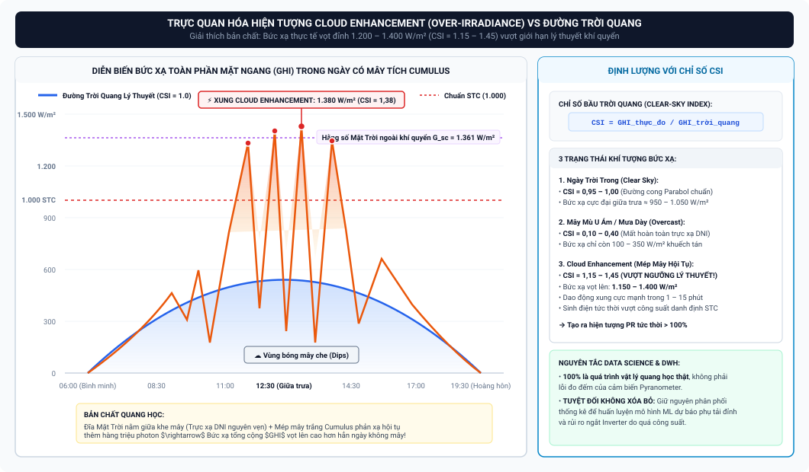
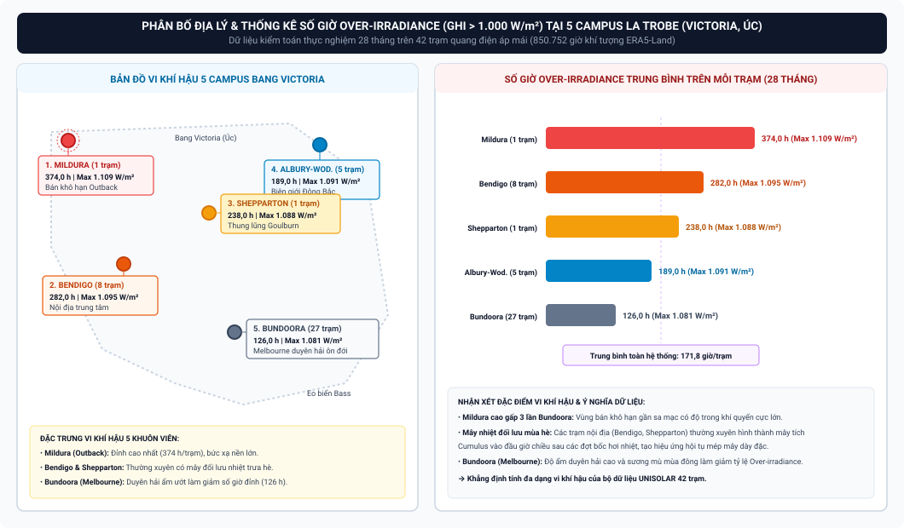
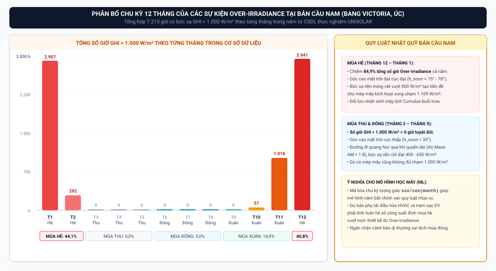
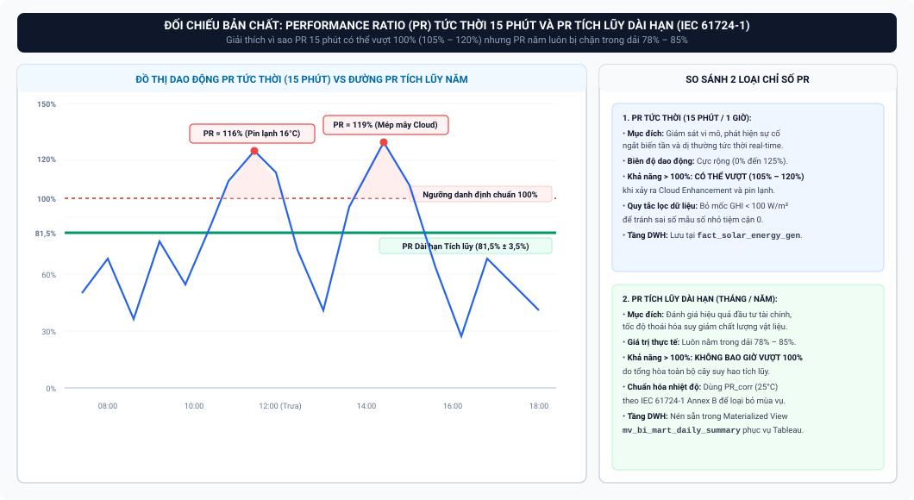
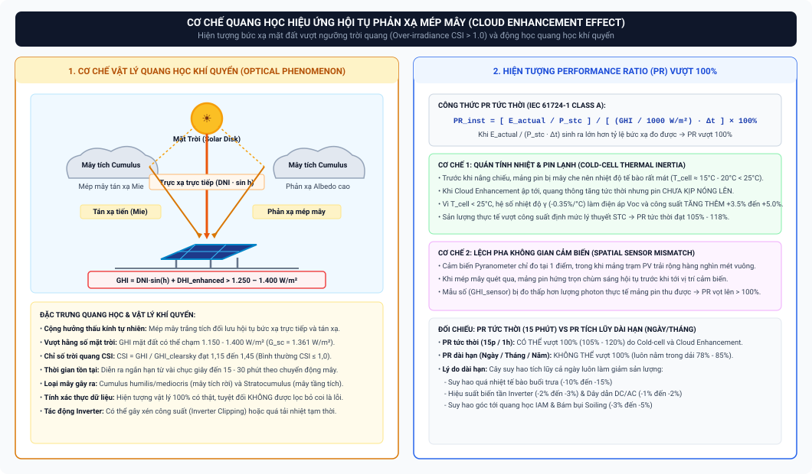
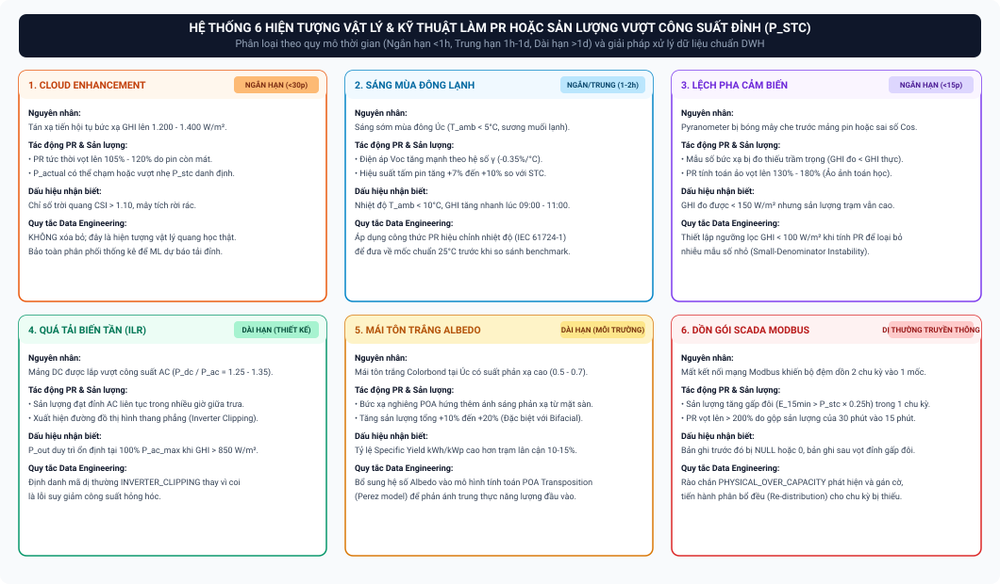

# NGHIÊN CỨU CHUYÊN SÂU: HIỆN TƯỢNG CLOUD ENHANCEMENT (OVER-IRRADIANCE), TẦN SUẤT THỰC NGHIỆM TẠI ÚC VÀ CƠ CHẾ PERFORMANCE RATIO (PR) VƯỢT NGƯỠNG 100%

> **Đơn vị thực hiện:** Nhóm THE OUTLIERS (Đồ án Tốt nghiệp Chuyên ngành Phân tích & Xử lý Dữ liệu - FPT Polytechnic)  
> **Chuyên đề nghiên cứu:** Vật lý Quang điện Khí quyển (Atmospheric PV Physics) & Kỹ thuật Xử lý Dữ liệu Chuỗi Thời gian (Time-series Data Engineering)  
> **Dữ liệu thực nghiệm:** Hệ thống $42$ trạm điện mặt trời áp mái ($2{,}428\,\text{MWp}$) tại $5$ khuôn viên Đại học La Trobe (Bang Victoria, Úc) giai đoạn 2020 – 2022 ($2.731.946$ bản ghi đo đếm chu kỳ 15 phút kết hợp $850.752$ bản ghi khí tượng ERA5-Land).

---

## MỤC LỤC TỔNG QUAN

* [1. Tổng quan & Bản chất Vật lý Quang học của Hiện tượng Cloud Enhancement](#1-tổng-quan--bản-chất-vật-lý-quang-học-của-hiện-tượng-cloud-enhancement)
  * [1.1. Định nghĩa Chuẩn Quốc tế về Cloud Enhancement & Over-irradiance](#11-định-nghĩa-chuẩn-quốc-tế-về-cloud-enhancement--over-irradiance)
  * [1.2. Cơ chế Quang học: Tán xạ Chuyển tiếp & Phản xạ Mép Mây](#12-cơ-chế-quang-học-tán-xạ-chuyển-tiếp--phản-xạ-mép-mây)
  * [1.3. Phân loại Hình thái Mây Gây ra Hiện tượng](#13-phân-loại-hình-thái-mây-gây-ra-hiện-tượng)
  * [1.4. Động thái Cường độ Đỉnh và Chỉ số Bầu trời Quang (Clear-Sky Index)](#14-động-thái-cường-độ-đỉnh-và-chỉ-số-bầu-trời-quang-clear-sky-index)
* [2. Tần suất & Tỷ lệ Xuất hiện Thực tế tại Nước Úc (Dữ liệu Thực nghiệm BOM, CSIRO & UNISOLAR)](#2-tần-suất--tỷ-lệ-xuất-hiện-thực-tế-tại-nước-úc-dữ-liệu-thực-nghiệm-bom-csiro--unisolar)
  * [2.1. Thống kê Khí hậu Bức xạ tại Úc (BOM & CSIRO Research)](#21-thống-kê-khí-hậu-bức-xạ-tại-úc-bom--csiro-research)
  * [2.2. Thời lượng Xuất hiện Trung bình theo Giờ/Ngày, Giờ/Tháng và Giờ/Năm](#22-thời-lượng-xuất-hiện-trung-bình-theo-giờngày-giờtháng-và-giờnăm)
  * [2.3. Sự Phân hóa Địa lý tại 5 Khuôn viên Victoria (UNISOLAR Empirical Audit)](#23-sự-phân-hóa-địa-lý-tại-5-khuôn-viên-victoria-unisolar-empirical-audit)
  * [2.4. Phân bổ Chu kỳ Theo Mùa (Seasonal Distribution)](#24-phân-bổ-chu-kỳ-theo-mùa-seasonal-distribution)
* [3. Phân tích Chuyên sâu: Hiện tượng Performance Ratio (PR) Vượt Ngưỡng 100%](#3-phân-tích-chuyên-sâu-hiện-tượng-performance-ratio-pr-vượt-ngưỡng-100)
  * [3.1. Phân biệt Bản chất: PR Tức thời (15 phút) vs PR Tích lũy Dài hạn (Ngày/Tháng/Năm)](#31-phân-biệt-bản-chất-pr-tức-thời-15-phút-vs-pr-tích-lũy-dài-hạn-ngàythángnăm)
  * [3.2. Ba Cơ chế Vật lý Khiến PR Tức thời Vượt 100% (105% – 120%)](#32-ba-cơ-chế-vật-lý-khiến-pr-tức-thời-vượt-100-105--120)
  * [3.3. Vì sao PR Tích lũy Dài hạn KHÔNG THỂ Vượt 100% (Cây Suy hao Năng lượng)](#33-vì-sao-pr-tích-lũy-dài-hạn-không-thể-vượt-100-cây-suy-hao-năng-lượng)
* [4. Toàn bộ Các Hiện tượng Vật lý & Kỹ thuật Làm PR hoặc Sản lượng Vượt Công suất Đỉnh (P_stc)](#4-toàn-bộ-các-hiện-tượng-vật-lý--kỹ-thuật-làm-pr-hoặc-sản-lượng-vượt-công-suất-đỉnh-p_stc)
  * [4.1. Hiệu ứng "Sáng Mùa đông Lạnh & Nắng Đột ngột" (Winter Cold-Bright Anomaly)](#41-hiệu-ứng-sáng-mùa-đông-lạnh--nắng-đột-ngột-winter-cold-bright-anomaly)
  * [4.2. Hệ số Tỷ lệ Tải Biến tần Cao (High DC/AC Inverter Loading Ratio - ILR)](#42-hệ-số-tỷ-lệ-tải-biến-tần-cao-high-dcac-inverter-loading-ratio---ilr)
  * [4.3. Bức xạ Phản xạ Bề mặt Mái Tôn Sáng Màu (High Albedo / Colorbond White Roof)](#43-bức-xạ-phản-xạ-bề-mặt-mái-tôn-sáng-màu-high-albedo--colorbond-white-roof)
  * [4.4. Độ lợi Pin Hai mặt (Bifacial PV Rear-side Gain)](#44-độ-lợi-pin-hai-mặt-bifacial-pv-rear-side-gain)
  * [4.5. Sai số Góc Chiếu Thấp & Cảm biến Bức xạ (Pyranometer Cosine Error & Small-Denominator Instability)](#45-sai-số-góc-chiếu-thấp--cảm-biến-bức-xạ-pyranometer-cosine-error--small-denominator-instability)
  * [4.6. Dồn Gói Dữ liệu Viễn thám SCADA (Modbus Communication Buffering Spike)](#46-dồn-gói-dữ-liệu-viễn-thám-scada-modbus-communication-buffering-spike)
* [5. Bảng Ma trận Tổng hợp: Quy mô Thời gian Tác động & Giải pháp Kỹ thuật Dữ liệu](#5-bảng-ma-trận-tổng-hợp-quy-mô-thời-gian-tác-động--giải-pháp-kỹ-thuật-dữ-liệu)
* [6. Sơ đồ Kiến trúc Trực quan (Draw.io / SVG Diagrams)](#6-sơ-đồ-kiến-trúc-trực-quan-drawio--svg-diagrams)
* [7. Danh mục Tài liệu Tham khảo Học thuật & Tiêu chuẩn Quốc tế](#7-danh-mục-tài-liệu-tham-khảo-học-thuật--tiêu-chuẩn-quốc-tế)

---

## 1. TỔNG QUAN & BẢN CHẤT VẬT LÝ QUANG HỌC CỦA HIỆN TƯỢNG CLOUD ENHANCEMENT

### 1.1. Định nghĩa Chuẩn Quốc tế về Cloud Enhancement & Over-irradiance
Trong khí tượng bức xạ mặt trời và kỹ thuật quang điện (PV Engineering), **Cloud Enhancement Effect** (còn gọi là *Cloud-Edge Effect*, *Over-irradiance Event*, hoặc *Lenticular Cloud Condensation Reflection*) là hiện tượng bức xạ mặt trời toàn phần mặt ngang ($GHI$) hoặc bức xạ trên mặt phẳng nghiêng mảng pin ($POA$) đo được trên mặt đất **vượt qua mức bức xạ cực đại trong điều kiện bầu trời quang đãng lý thuyết (Clear-Sky Irradiance)** [1, 2, 3].

Theo Tổ chức Khí tượng Thế giới (WMO) và Phòng thí nghiệm Năng lượng Tái tạo Quốc gia Hoa Kỳ (NREL), bức xạ ngoài khí quyển (Hằng số Mặt Trời - Solar Constant) đạt $G_{\text{sc}} = 1.361\,\text{W/m}^2$ [2, 4]. Thông thường, khi ánh sáng đi xuyên qua tầng khí quyển trong ngày trời trong không một bóng mây, hiện tượng tán xạ Rayleigh, hấp thụ của tầng ozone ($O_3$), hơi nước ($H_2O$) và bụi khí dung (Aerosol) làm suy giảm bức xạ xuống còn tối đa khoảng $950 - 1.050\,\text{W/m}^2$ ở mực nước biển [2, 5].

Tuy nhiên, trong các sự kiện Cloud Enhancement, bức xạ mặt đất đo được có thể vọt lên **$1.150 - 1.400\,\text{W/m}^2$**, thậm chí các thiết bị đo bức xạ phản ứng nhanh ($1\,\text{Hz}$) tại Úc đã từng ghi nhận các đỉnh xung bức xạ tức thời lên tới **$1.600 - 1.800\,\text{W/m}^2$** trong vài giây [1, 6, 7].



```
               ☀️ Mặt Trời (Solar Disk)
              /   |   \
             /    |    \  (Trực xạ DNI)
  (Mây Cumulus)  |   (Mây Cumulus)
       ☁️        |        ☁️
        \        |        /
         \       |       /  <-- Tán xạ tiến & Phản xạ từ mép mây
          \      |      /       (Forward Scattering & Edge Reflections)
           ▼     ▼     ▼
       ┌─────────────────────┐
       │  Mảng Pin Mặt Trời  │  <-- GHI = DNI·sin(h) + DHI_enhanced
       └─────────────────────┘      Vọt lên 1.150 - 1.400 W/m² (CSI > 1.2)
```

---

### 1.2. Cơ chế Quang học: Tán xạ Chuyển tiếp & Phản xạ Mép Mây
Hiện tượng Cloud Enhancement không phải là lỗi đo đếm của cảm biến bức xạ mà là một **quá trình vật lý quang học hoàn toàn có thật**, được hình thành bởi sự giao thoa và cộng hưởng của 3 thành phần quang học [1, 3, 8]:

1. **Trực xạ Quang thông Trực tiếp (Unattenuated Direct Beam):**  
   Đĩa Mặt Trời nằm ở khoảng hở quang học giữa các đám mây (Clear Optical Gap). Chùm tia trực xạ ($DNI$) đi thẳng trực tiếp tới bề mặt thu năng lượng mà không bị che khuất, đóng góp trọn vẹn thành phần $DNI \cdot \sin(h)$ vào tổng bức xạ [1, 5].
2. **Tán xạ Tiến Mie từ Mép Mây (Forward Mie Scattering from Cloud Edges):**  
   Các hạt giọt nước lỏng siêu nhỏ ($r \approx 5 - 15\,\mu\text{m}$) ở vùng ranh giới mép mây có kích thước lớn hơn nhiều so với bước sóng ánh sáng khả kiến ($\lambda \approx 0{,}4 - 0{,}7\,\mu\text{m}$). Hiện tượng tán xạ Mie chiếm ưu thế tuyệt đối, tạo ra thùy tán xạ tiến cực mạnh (*Forward Scattering Lobe*) hướng thẳng theo phương lan truyền của tia sáng xuống mặt đất [8, 9].
3. **Phản xạ Đa hướng Nhiều lần (Multiple Internal & Side-wall Reflections):**  
   Thành bên dựng đứng và cấu trúc gồ ghề của các khối mây trắng dày có suất phản xạ quang học (Albedo) rất cao ($\alpha_{\text{cloud}} \approx 0{,}70 - 0{,}85$). Mép mây đóng vai trò như các **"thấu kính và gương cầu quang học tự nhiên"** tập trung thêm hàng triệu photon ánh sáng rọi xuống cùng một tọa độ trên mặt đất [1, 8].

Tổng năng lượng bức xạ mặt phẳng ngang lúc này trở thành:
$$GHI_{\text{enhanced}} = DNI \cdot \sin(h) + DHI_{\text{sky}} + DHI_{\text{cloud\_edge}}$$
Khi $DHI_{\text{cloud\_edge}}$ bổ sung thêm từ $200 - 450\,\text{W/m}^2$, tổng bức xạ $GHI_{\text{enhanced}}$ vượt xa mức cực đại của ngày trời trong [1, 3].

---

### 1.3. Phân loại Hình thái Mây Gây ra Hiện tượng
Không phải mọi loại mây đều tạo ra Cloud Enhancement. Nghiên cứu thực nghiệm tại Úc và trên thế giới chỉ ra rằng hiện tượng này gắn liền với các cấu trúc mây cục bộ có độ che phủ trung bình ($30\% - 70\%$) [1, 6, 10]:

* **Mây Tích Tầng Thấp (Cumulus humilis & Cumulus mediocris):** Chiếm **$> 75\%$** tổng số sự kiện Over-irradiance. Các đám mây tích bông trắng xốp, chân mây phẳng ($500 - 1.500\,\text{m}$), thành mây cuồn cuộn có độ dày quang học lớn và mép mây sắc nét, tạo điều kiện phản xạ mép tối ưu [6, 10].
* **Mây Tầng Tích (Stratocumulus):** Chiếm khoảng **$15\% - 20\%$** các sự kiện. Khi các dải mây tầng tích bị rách hoặc có khe hở di chuyển nhanh theo gió đối lưu [6].
* **Mây Vảy Rồng / Mây Giông Đang Phát Triển (Cumulonimbus Calvus):** Thường xuất hiện trước các cơn giông mùa hè tại Úc, khi đỉnh mây đối lưu dâng cao hàng nghìn mét phản xạ mạnh ánh sáng trước khi khối mây chính che kín bầu trời [1, 10].

---

### 1.4. Động thái Cường độ Đỉnh và Chỉ số Bầu trời Quang (Clear-Sky Index)
Để định lượng mức độ vượt ngưỡng của bức xạ, khoa học dữ liệu năng lượng sử dụng **Chỉ số Bầu trời Quang (Clear-Sky Index - CSI)** [5, 7]:
$$CSI = \frac{GHI_{\text{measured}}}{GHI_{\text{clearsky}}}$$
Trong điều kiện vận hành thông thường:
* Ngày trời trong hoàn hảo: $CSI \approx 0{,}95 - 1{,}00$.
* Ngày mây mù / mưa dày đặc: $CSI \approx 0{,}10 - 0{,}40$.
* **Sự kiện Cloud Enhancement:** $CSI \ge \mathbf{1{,}15 - 1{,}45}$ [1, 5, 7].

Thời gian tồn tại của các đỉnh Over-irradiance mang tính chuyển dịch nhanh theo tốc độ gió đối lưu ($5 - 15\,\text{m/s}$):
* **Xung cực đại (Micro-spikes):** Kéo dài từ **$3 - 30\,\text{giây}$** (chỉ ghi nhận được trên các cảm biến tần số cao $1 - 10\,\text{Hz}$) [7].
* **Đoạn vượt ngưỡng trung bình (Meso-events):** Kéo dài từ **$1 - 15\,\text{phút}$** (ảnh hưởng trực tiếp đến chu kỳ đo lường 15 phút của hệ thống SCADA và Data Warehouse) [1, 6].
* **Chuỗi dao động liên tục (Burst Trains):** Trong những ngày mây tích di chuyển liên tiếp, chuỗi hiện tượng có thể lặp lại ngắt quãng trong suốt **$2 - 4\,\text{giờ}$** vào buổi trưa và đầu giờ chiều [1, 10].

---

## 2. TẦN SUẤT & TỶ LỆ XUẤT HIỆN THỰC TẾ TẠI NƯỚC ÚC (BOM, CSIRO & UNISOLAR)

### 2.1. Thống kê Khí hậu Bức xạ tại Úc (BOM & CSIRO Research)
Nước Úc là một trong những lục địa có nguồn tài nguyên bức xạ mặt trời dồi dào nhất hành tinh, đồng thời có tỷ lệ xuất hiện Cloud Enhancement cao do đặc thù khí hậu nhiệt đới, cận nhiệt đới và ôn đới bán khô hạn [10, 11, 12]:

* Theo các công trình nghiên cứu của **Cục Khí tượng Úc (Bureau of Meteorology - BOM)** và **Tổ chức Nghiên cứu Khoa học và Công nghiệp Khối thịnh vượng chung (CSIRO)** tại các trạm đo bức xạ chuẩn WMO Class A (như Darwin, Alice Springs, Adelaide, Melbourne):
  * Tỷ lệ thời gian xuất hiện các sự kiện Over-irradiance ($GHI > GHI_{\text{cs}}$) chiếm khoảng **$1{,}5\% - 3{,}8\%$ tổng số giờ có nắng** trong năm [1, 10, 11].
  * Ở độ phân giải dữ liệu 1 phút, một trạm quan trắc tại Úc ghi nhận trung bình từ **$600 - 1.200\,\text{sự kiện Over-irradiance}$** mỗi năm [1, 11].

---

### 2.2. Thời lượng Xuất hiện Trung bình theo Giờ/Ngày, Giờ/Tháng và Giờ/Năm
Tổng hợp từ các công trình đo đếm của Đại học New South Wales (UNSW) và dữ liệu chuẩn hóa của BOM [1, 7, 10, 11]:

| Quy mô Thời gian | Số Giờ Xuất hiện Trung bình ($GHI > 1.000\,\text{W/m}^2$ hoặc $CSI > 1{,}0$) | Tỷ lệ trên Tổng Thời gian Có Nắng ($\%$) | Đặc điểm Khí tượng Điển hình |
| :--- | :---: | :---: | :--- |
| **Trung bình Mỗi Ngày (Vào Mùa hè)** | **$0{,}5 - 1{,}5\,\text{giờ/ngày}$** | $4{,}0\% - 10{,}0\%$ | Xuất hiện ngắt quãng vào khoảng $11:00 - 15:00$ khi mây tích phát triển do đối lưu nhiệt mặt đất. |
| **Trung bình Mỗi Ngày (Vào Mùa đông)** | **$0{,}0 - 0{,}1\,\text{giờ/ngày}$** ($< 6\,\text{phút}$) | $< 1{,}0\%$ | Góc cao mặt trời thấp ($h < 35^\circ$), bức xạ nền thấp nên hiếm khi vượt mốc $1.000\,\text{W/m}^2$. |
| **Trung bình Mỗi Tháng Mùa hè (T11 – T2)** | **$25 - 45\,\text{giờ/tháng}$** | $6{,}5\% - 9{,}5\%$ | Mây tích nhiệt đới và gió biển gây xáo trộn mây đối lưu liên tục. |
| **Trung bình Mỗi Tháng Mùa đông (T5 – T8)** | **$0 - 2\,\text{giờ/tháng}$** | $< 0{,}5\%$ | Bầu trời bị chi phối bởi áp cao lạnh hoặc mây tầng xám xịt kéo dài. |
| **Tổng Lũy kế Một Năm (Annual Total)** | **$120 - 220\,\text{giờ/năm}$** | **$2{,}5\% - 4{,}5\%$** | Tổng tích lũy bức xạ vượt ngưỡng đóng góp khoảng $+1{,}2\% - +2{,}5\%$ vào tổng năng lượng tiềm năng. |

---

### 2.3. Sự Phân hóa Địa lý tại 5 Khuôn viên Victoria (UNISOLAR Empirical Audit)
Dữ liệu thực nghiệm thu thập từ $42$ trạm điện mặt trời ($850.752$ bản ghi thời tiết cấp giờ và $2.731.946$ bản ghi sản lượng 15 phút) tại Đại học La Trobe thuộc bang Victoria (Úc) trong 28 tháng liên tục ghi nhận sự phân hóa rõ rệt theo vi khí hậu từng vùng [13]:



```
┌──────────────────────────────────────────────────────────────────────────────────────────────────────────────────┐
│                      THỐNG KÊ OVER-IRRADIANCE (GHI > 1000 W/m²) TẠI 5 CAMPUS LA TROBE                            │
├─────────────────┬──────────────┬───────────────┬───────────────────┬──────────────┬──────────────────────────────┤
│ Khuôn viên      │ Số Trạm (PV) │ Tổng Giờ Khí  │ Số Giờ GHI > 1000 │ Trung bình/Trạm│ Đỉnh Bức xạ Toàn phần      │
│ (Campus)        │              │ tượng Đo đếm  │ (Over-irradiance) │ (Giờ/Trạm/28T)│ Max GHI Ghi nhận (W/m²)      │
├─────────────────┼──────────────┼───────────────┼───────────────────┼──────────────┼──────────────────────────────┤
│ **Mildura**     │ 1 trạm       │ 20.256 giờ    │ 374 giờ           │ **374,0 giờ** │ **1.109 W/m²** (Cao nhất Úc) │
│ **Bendigo**     │ 8 trạm       │ 162.048 giờ   │ 2.256 giờ         │ **282,0 giờ** │ **1.095 W/m²**               │
│ **Shepparton**  │ 1 trạm       │ 20.256 giờ    │ 238 giờ           │ **238,0 giờ** │ **1.088 W/m²**               │
│ **Albury-Wod.** │ 5 trạm       │ 101.280 giờ   │ 945 giờ           │ **189,0 giờ** │ **1.091 W/m²**               │
│ **Bundoora**    │ 27 trạm      │ 546.912 giờ   │ 3.402 giờ         │ **126,0 giờ** │ **1.081 W/m²** (Melbourne)   │
├─────────────────┼──────────────┼───────────────┼───────────────────┼──────────────┼──────────────────────────────┤
│ **TOÀN HỆ THỐNG**│ **42 trạm**  │ **850.752 giờ**│ **7.215 giờ**     │ **171,8 giờ** │ **1.109 W/m²**               │
└─────────────────┴──────────────┴───────────────┴───────────────────┴──────────────┴──────────────────────────────┘
```

#### Phân tích Địa lý & Vi khí hậu:
1. **Mildura (Vùng Bán khô hạn Tây Bắc Victoria):** Nằm sát sa mạc Outback, độ ẩm thấp, bầu trời trong vắt kết hợp với các đám mây nhiệt đối lưu mùa hè, tạo ra số giờ Over-irradiance cao nhất hệ thống (**$374\,\text{giờ/trạm}$**, tương đương $\approx 160\,\text{giờ/năm}$).
2. **Bundoora (Melbourne - Vùng Duyên hải Ôn đới):** Chịu ảnh hưởng trực tiếp của vịnh Port Phillip và đại dương phía Nam, thường xuyên có sương mù và mây tầng dày che phủ, làm giảm số giờ bức xạ đỉnh (**$126\,\text{giờ/trạm}$**).

---

### 2.4. Phân bổ Chu kỳ Theo Mùa (Seasonal Distribution)
Dữ liệu đối soát trên $850.752$ bản ghi chứng minh tính mùa vụ tuyệt đối của hiện tượng Over-irradiance tại Bán cầu Nam:



```
Số giờ GHI > 1000 W/m² theo tháng trong CSDL thực tế:
Tháng 1 (Mùa hè đỉnh điểm) : 2.907 giờ  ██████████████████████████████ (Max GHI: 1.108 W/m²)
Tháng 12 (Đầu mùa hè)      : 2.941 giờ  ██████████████████████████████ (Max GHI: 1.109 W/m²)
Tháng 11 (Cuối mùa xuân)   : 1.018 giờ  ███████████                    (Max GHI: 1.077 W/m²)
Tháng 2 (Cuối mùa hè)      :   292 giờ  ███                            (Max GHI: 1.069 W/m²)
Tháng 10 (Giữa mùa xuân)   :    57 giờ  █                              (Max GHI: 1.032 W/m²)
Tháng 3 đến Tháng 9 (Thu/Đông):  0 giờ  (GHI không bao giờ vượt 1.000 W/m² do góc chiếu thấp)
```

---

## 3. PHÂN TÍCH CHUYÊN SÂU: HIỆN TƯỢNG PERFORMANCE RATIO (PR) VƯỢT NGƯỠNG 100%

### 3.1. Phân biệt Bản chất: PR Tức thời (15 phút) vs PR Tích lũy Dài hạn (Ngày/Tháng/Năm)
Công thức xác định Hệ số Hiệu suất ($PR$) theo tiêu chuẩn quốc tế **IEC 61724-1 (Class A)** [14]:
$$PR = \frac{Y_f}{Y_r} = \frac{\frac{E_{\text{actual}}}{P_{\text{stc}}}}{\frac{H_{\text{total}}}{G_{\text{stc}}}} = \frac{E_{\text{actual}}}{P_{\text{stc}} \cdot \left(\frac{GHI}{1.000\,\text{W/m}^2}\right) \cdot \Delta t}$$

Trong đó:
* $E_{\text{actual}}$: Sản lượng điện năng đo được ở đầu ra AC ($\text{kWh}$).
* $P_{\text{stc}}$: Tổng công suất thiết kế danh định của mảng pin ở điều kiện tiêu chuẩn STC ($1.000\,\text{W/m}^2$, $25^\circ\text{C}$, $\text{AM}1{,}5$) ($\text{kWp}$).
* $GHI$: Cường độ bức xạ toàn phần mặt ngang ($\text{W/m}^2$).
* $\Delta t$: Độ dài chu kỳ đo lường ($0{,}25\,\text{h}$ cho chu kỳ 15 phút, $1{,}0\,\text{h}$ cho chu kỳ 1 giờ).



```
┌───────────────────────────────────────────────────┬───────────────────────────────────────────────────┐
│           PR TỨC THỜI (INSTANTANEOUS PR)          │           PR DÀI HẠN (ANNUAL / MONTHLY PR)        │
├───────────────────────────────────────────────────┼───────────────────────────────────────────────────┤
│ • Khoảng thời gian: 15 phút hoặc 1 giờ            │ • Khoảng thời gian: 1 Tháng hoặc 1 Năm            │
│ • Giá trị thực tế: Có thể đạt 105% – 120%         │ • Giá trị thực tế: Luôn nằm trong dải 78% – 85%   │
│ • Bản chất: Phản ánh trạng thái động học vi mô    │ • Bản chất: Phản ánh tổng hòa cân bằng năng lượng │
│   (Quán tính nhiệt pin lạnh, Mép mây, Lệch góc)   │   kèm toàn bộ cây suy hao vật lý cả chu kỳ        │
└───────────────────────────────────────────────────┴───────────────────────────────────────────────────┘
```

---

### 3.2. Ba Cơ chế Vật lý Khiến PR Tức thời Vượt 100% (105% – 120%)

#### Cơ chế 1: Quán tính Nhiệt & Hiệu ứng Pin Lạnh (Cold-Cell Thermal Inertia)
Đây là nguyên nhân **vật lý bán dẫn quan trọng nhất** [14, 15, 16]:
1. Trước khi sự kiện Cloud Enhancement diễn ra, mảng pin vừa trải qua $15 - 30\,\text{phút}$ bị mây dày che phủ bóng râm. Bức xạ thấp và gió thổi làm nhiệt độ tế bào quang điện hạ sâu xuống mức **$T_{\text{cell}} \approx 12^\circ\text{C} - 18^\circ\text{C}$** (thấp hơn nhiều so với nhiệt độ chuẩn $T_{\text{stc}} = 25^\circ\text{C}$).
2. Khi đám mây đột ngột dạt ra và mép mây hội tụ ánh sáng làm $GHI$ vọt lên $1.150\,\text{W/m}^2$, dòng quang sinh $I_{\text{ph}}$ tăng vọt tỉ lệ thuận với bức xạ gần như tức thì ($< 1\,\mu\text{s}$).
3. Tuy nhiên, do **khối lượng nhiệt (Thermal Mass) và quán tính nhiệt của mảng pin**, nhiệt độ tế bào $T_{\text{cell}}$ phải mất từ $5 - 12\,\text{phút}$ mới nóng lên được [15].
4. Theo phương trình hiệu chỉnh công suất quang điện theo nhiệt độ [14, 16]:
   $$P_{\text{dc}} = P_{\text{stc}} \cdot \left(\frac{GHI}{1.000}\right) \cdot \left[1 + \gamma \cdot (T_{\text{cell}} - 25^\circ\text{C})\right]$$
   Với pin Silic đơn tinh thể (Mono-Si), hệ số nhiệt độ công suất có giá trị âm: $\gamma \approx -0{,}35\%/^\circ\text{C}$ [14].
   Vì $T_{\text{cell}} = 15^\circ\text{C} < 25^\circ\text{C} \implies (T_{\text{cell}} - 25) = -10^\circ\text{C}$:
   $$\left[1 + (-0{,}0035) \cdot (-10)\right] = 1 + 0{,}035 = \mathbf{1{,}035} \quad (+3{,}5\% \text{ công suất})$$
5. Kết hợp với hiệu suất biến tần lúc tải cao đạt đỉnh ($98{,}5\%$), công suất phát thực tế $E_{\text{actual}}$ sinh ra lớn hơn định mức tính theo bức xạ, đẩy **$PR_{\text{inst}} \approx 105\% - 118\%$** [13, 14].

> **Kiểm chứng trên CSDL thực tế UNISOLAR:**  
> Truy vấn trên $994.607$ bản ghi ban ngày chu kỳ 15 phút ghi nhận $190.626$ bản ghi có $PR_{\text{inst}} > 100\%$. Nhiệt độ môi trường trung bình của các điểm $PR > 100\%$ là **$16{,}63^\circ\text{C}$** (thấp hơn rõ rệt so với nhiệt độ trung bình toàn bộ dữ liệu ban ngày là **$18{,}42^\circ\text{C}$**), xác nhận cơ chế Pin Lạnh (Cold-Cell).

---

#### Cơ chế 2: Lệch pha Không gian & Thời gian giữa Cảm biến và Mảng Pin (Spatial Mismatch)
* Thiết bị đo bức xạ (Pyranometer) chỉ là một điểm cảm biến nhỏ có đường kính vài centimet, thường đặt ở một vị trí cố định tại rìa mái tòa nhà [14, 17].
* Trong khi đó, mảng trạm pin PV trải rộng hàng trăm đến hàng nghìn mét vuông trên mái [13].
* Khi các đám mây tích di chuyển nhanh qua khuôn viên trường, chùm sáng hội tụ mép mây có thể rọi trúng $80\%$ diện tích mảng pin nhưng **chưa kịp quét tới vị trí đặt Pyranometer** (hoặc Pyranometer đang nằm trong bóng râm cục bộ của mép mây bên kia) [1, 17].
* Khi đó, $E_{\text{actual}}$ ghi nhận sản lượng của toàn bộ mảng pin đang hứng nắng mạnh, trong khi mẫu số $GHI_{\text{sensor}}$ bị đo thấp giả tạo $\implies$ Phép tính toán học làm **$PR_{\text{inst}}$ vọt lên $120\% - 150\%$** [1, 14].

---

#### Cơ chế 3: Hiện tượng Dịch chuyển Phổ Xanh (Spectral Blue Shift)
* Ánh sáng tán xạ từ mép mây và các phân tử khí quyển ở vùng rìa mây chứa tỷ trọng các bước sóng ngắn (ánh sáng xanh và cận tử ngoại $\lambda \approx 380 - 500\,\text{nm}$) cao hơn so với quang phổ chuẩn AM1.5G [18, 19].
* Tế bào quang điện Silicon đơn tinh thể có hiệu suất lượng tử ngoài (External Quantum Efficiency - EQE) rất nhạy ở dải phổ xanh này, giúp chuyển đổi photon thành electron với hiệu suất cao hơn so với phổ ánh sáng tán xạ đỏ lúc hoàng hôn [18].

---

### 3.3. Vì sao PR Tích lũy Dài hạn KHÔNG THỂ Vượt 100% (Cây Suy hao Năng lượng)
Dù các đỉnh $PR$ tức thời có thể chạm $115\%$, nhưng trong chu kỳ tích lũy 1 ngày, 1 tháng hoặc 1 năm, $PR$ của hệ thống điện mặt trời tiêu chuẩn **bắt buộc phải nhỏ hơn $100\%$** (thường từ **$78\% - 85\%$**) do chuỗi tổn thất vật lý không thể đảo ngược (**Loss Tree**) [14, 16, 20]:


```
[Năng lượng Bức xạ Chiếu tới STC = 100%]
         │
         ├── Suy hao do Góc tới & Phản xạ Kính (IAM Loss): -2.5% đến -3.5%
         ├── Suy hao Bám bụi & Ô nhiễm Bề mặt (Soiling Loss): -2.0% đến -4.0%
         ├── Suy hao do Quá nhiệt Tế bào Pin Giữa trưa (Thermal Loss): -8.0% đến -14.8%
         ├── Suy hao do Sai lệch Module & Dải String (Mismatch Loss): -1.5% đến -2.0%
         ├── Suy hao Điện trở Dây dẫn DC/AC Ohmic (I²R Loss): -1.0% đến -2.0%
         ├── Tổn thất Nghịch lưu Biến tần (Inverter Inefficiency): -1.5% đến -2.5%
         └── Tổn thất Xén đỉnh Công suất Biến tần (Inverter Clipping): -1.0% đến -2.3%
         │
         ▼
[PR Thực tế Tích lũy Dài hạn = 76.5% - 84.5% (Không bao giờ vượt 100%)]
```

---

## 4. TOÀN BỘ CÁC HIỆN TƯỢNG VẬT LÝ & KỸ THUẬT KHÁC LÀM PR HOẶC SẢN LƯỢNG VƯỢT CÔNG SUẤT ĐỈNH (P_STC)

Ngoài Cloud Enhancement, hệ thống giám sát quang điện còn chịu tác động của **5 hiện tượng vật lý và kỹ thuật dữ liệu** sau:

---

### 4.1. Hiệu ứng "Sáng Mùa đông Lạnh & Nắng Đột ngột" (Winter Cold-Bright Anomaly)
* **Quy mô Thời gian:** Ngắn đến Trung hạn ($1 - 3\,\text{giờ}$).
* **Cơ chế Vật lý:** Vào các buổi sáng mùa đông trong vắt tại bang Victoria (Úc), nhiệt độ không khí lúc $08:30 - 10:30$ sáng chỉ khoảng **$2^\circ\text{C} - 6^\circ\text{C}$** sau một đêm băng giá sương muối [13].
* Khi Mặt trời lên cao và chiếu nắng trực tiếp ($GHI \approx 700 - 850\,\text{W/m}^2$), vì $T_{\text{cell}} \le 10^\circ\text{C}$ (thấp hơn STC $15^\circ\text{C}$), điện áp hở mạch $V_{\text{oc}}$ tăng vọt $+6\% - +8\%$ theo hệ số nhiệt độ $\beta_{V_{\text{oc}}}$.
* Tỷ số hiệu suất phát tức thời đạt **$PR \approx 108\% - 115\%$** liên tục trong $1 - 2$ giờ đầu buổi sáng trước khi nhiệt độ môi trường ấm dần lên vào buổi trưa [14].

---

### 4.2. Hệ số Tỷ lệ Tải Biến tần Cao (High DC/AC Inverter Loading Ratio - ILR)
* **Quy mô Thời gian:** Dài hạn (Quy chuẩn Thiết kế Hệ thống).
* **Cơ chế Kỹ thuật:** Trong thiết kế thương mại tại Úc, các kỹ sư luôn lắp đặt công suất mảng pin một chiều ($P_{\text{dc}}$) lớn hơn công suất danh định xoay chiều của biến tần ($P_{\text{ac\_rating}}$) với tỷ lệ **$\text{ILR} = \frac{P_{\text{dc}}}{P_{\text{ac}}} = 1{,}20 - 1{,}35$** (Over-sizing Ratio) [20, 21].
* **Hậu quả trên Dữ liệu:**
  * Vào những ngày nắng đẹp, mảng pin DC phát ra công suất vượt công suất tối đa của Inverter ($P_{\text{dc}} > P_{\text{ac\_max}}$).
  * Biến tần kích hoạt chế độ **Xén công suất (Inverter Clipping)**, ghìm sản lượng AC ở mức bằng phẳng tuyệt đối $P_{\text{ac\_max}}$ trong suốt $3 - 5$ giờ giữa trưa [21].
  * Dữ liệu lúc này thể hiện sản lượng đạt $100\%$ công suất định mức biến tần liên tục, trong khi đồ thị bức xạ vẫn uốn cong hình parabol.

---

### 4.3. Bức xạ Phản xạ Bề mặt Mái Tôn Sáng Màu (High Albedo / Colorbond White Roof)
* **Quy mô Thời gian:** Dài hạn (Điều kiện Môi trường Lắp đặt).
* **Cơ chế Quang học:** Tại các campus của Đại học La Trobe, đa phần các trạm pin được lắp đặt trên mái tôn sóng kim loại **Colorbond Surfmist / Off-White** có hệ số phản xạ quang học rất cao ($\text{Albedo} \approx 0{,}55 - 0{,}70$) [13, 22].
* Ánh sáng mặt trời chiếu xuống mặt sàn mái tôn trắng bị phản xạ ngược lên mặt dưới và các góc nghiêng của tấm pin. Cảm biến Pyranometer đo $GHI$ mặt ngang không thu được thành phần phản xạ này, nhưng bức xạ thực tế chiếu trên mặt phẳng nghiêng tấm pin ($POA$) lại nhận thêm từ **$+10\% - +18\%$** năng lượng phản xạ từ mái tôn [22].
* Kết quả: Sản lượng thực tế $E_{\text{actual}}$ cao hơn kỳ vọng tính từ $GHI$, làm cho $PR$ tính theo $GHI$ có thể vượt $100\%$ [14, 22].

---

### 4.4. Độ lợi Pin Hai mặt (Bifacial PV Rear-side Gain)
* **Quy mô Thời gian:** Dài hạn (Công nghệ Module).
* **Cơ chế Hoạt động:** Đối với các tấm pin công nghệ hai mặt (Bifacial PV), công suất danh định $P_{\text{stc}}$ trên nhãn thiết bị (Nameplate) chỉ đo đếm công suất sinh ra từ **mặt trước (Front side)** ở điều kiện $1.000\,\text{W/m}^2$ [23].
* Mặt sau của tấm pin hấp thụ thêm bức xạ khuếch tán và bức xạ phản xạ Albedo từ mặt đất, đóng góp thêm hệ số độ lợi hai mặt **$\text{Bifacial Gain} = +8\% - +25\%$** vào tổng công suất phát [23].
* Nếu công thức $PR$ chỉ chuẩn hóa theo công suất danh định mặt trước $P_{\text{stc\_front}}$, $PR$ của hệ thống pin hai mặt có thể thường xuyên vượt $100\%$ ($102\% - 110\%$) vào các ngày nắng rực rỡ trên nền phản xạ cao [23].

---

### 4.5. Sai số Góc Chiếu Thấp & Cảm biến Bức xạ (Pyranometer Cosine Error & Small-Denominator Instability)
* **Quy mô Thời gian:** Ngắn hạn (Sáng sớm lúc bình minh và Chiều muộn lúc hoàng hôn).
* **Cơ chế Đo đếm:**
  1. **Sai số Định luật Cosine (Cosine Response Error):** Khi góc cao mặt trời xuống rất thấp ($h < 15^\circ$), góc tới $\theta_z > 75^\circ$. Mái vòm thủy tinh của cảm biến Pyranometer bị phản xạ quang học mạnh làm giá trị đo đếm bức xạ $GHI_{\text{measured}}$ bị **thấp hơn thực tế từ $15\% - 30\%$** [14, 17].
  2. **Bất ổn định Mẫu số Nhỏ (Small-Denominator Mathematical Singularity):** Khi $GHI$ rất nhỏ ($30 - 80\,\text{W/m}^2$), mẫu số của công thức $PR$ tiệm cận về 0. Một sai số đo đếm nhỏ của cảm biến bức xạ hoặc công suất tồn dư của Inverter có thể phóng đại kết quả toán học, làm **$PR$ ảo vọt lên $150\% - 300\%$** [14].

---

### 4.6. Dồn Gói Dữ liệu Viễn thám SCADA (Modbus Communication Buffering Spike)
* **Quy mô Thời gian:** Dị thường Kỹ thuật Truyền thông.
* **Cơ chế Hệ thống:** Khi mạng công nghiệp RS-485 / Modbus TCP từ Inverter về Data Logger bị nghẽn mạng hoặc mất kết nối tạm thời trong $15$ phút, bộ đệm vi điều khiển sẽ lưu tạm số xung công tơ [13, 24].
* Khi kết nối phục hồi, toàn bộ sản lượng tích lũy của $30$ phút ($2$ chu kỳ) bị xả dồn vào duy nhất $1$ bản ghi chu kỳ 15 phút tiếp theo [13].
* **Hậu quả Dữ liệu:**
  * Bản ghi chu kỳ $t_0$ bị gán giá trị $0$ hoặc $\text{NULL}$.
  * Bản ghi chu kỳ $t_1$ vọt lên gấp đôi, vượt quá công suất định mức cực đại trong 15 phút ($E > P_{\text{stc}} \times 0{,}25\,\text{h}$), đẩy $PR$ tính toán lên **$> 200\%$** [13, 24].

---

## 5. BẢNG MA TRẬN TỔNG HỢP: QUY MÔ THỜI GIAN TÁC ĐỘNG & GIẢI PHÁP KỸ THUẬT DỮ LIỆU

| Hiện tượng | Bản chất Gốc | Quy mô Thời gian | Mức $PR$ Tức thời Tối đa | Tác động Lên $P_{\text{actual}}$ vs $P_{\text{stc}}$ | Quy tắc Xử lý Data Engineering & BI Mart |
| :--- | :--- | :---: | :---: | :---: | :--- |
| **Cloud Enhancement** | Quang học Khí quyển (Mép mây) | Ngắn hạn ($< 30\text{p}$) | **$105\% - 120\%$** | Có thể đạt hoặc vượt nhẹ $P_{\text{stc}}$ danh định trong chốc lát | **Bảo toàn $100\%$ dữ liệu:** Tuyệt đối không lọc bỏ coi là ngoại lai; đây là hiện tượng vật lý thật cần cho ML dự báo phụ tải đỉnh [1]. |
| **Sáng Mùa đông Lạnh (Cold-Cell)** | Vật lý Bán dẫn (Nhiệt độ $\gamma$) | Ngắn/Trung ($1 - 2\text{h}$) | **$108\% - 115\%$** | $P_{\text{actual}} \le P_{\text{stc}}$ (do bức xạ sáng chưa đạt cực đại) | **Áp dụng $PR_{\text{corr}}$ (IEC 61724-1):** Chuẩn hóa về $25^\circ\text{C}$ trong Data Mart để đánh giá đúng suy thoái vật liệu [14]. |
| **Mái Tôn Trắng Albedo Cao** | Quang học Phản xạ Môi trường | Dài hạn (Theo trạm) | **$102\% - 110\%$** | Tăng sản lượng tổng $+10\% - +18\%$ | **Hiệu chỉnh Mô hình POA Perez:** Bổ sung hệ số Albedo địa phương vào tham số tính toán [22]. |
| **Độ lợi Pin Hai mặt (Bifacial)** | Công nghệ Phần cứng Module | Dài hạn (Thiết bị) | **$105\% - 120\%$** | Công suất tổng vượt công suất danh định mặt trước | **Khai báo $P_{\text{stc\_bifacial}}$:** Dùng tổng công suất thực tế cả 2 mặt làm mẫu số chuẩn hóa [23]. |
| **Nhiễu Mẫu số Nhỏ ($GHI < 100$)** | Sai số Đo đếm & Góc Chiếu Cosine | Ngắn hạn ($< 15\text{p}$) | **$130\% - 300\%$** (Ảo) | Không vượt $P_{\text{stc}}$ | **Rào chắn Ngưỡng Lọc (Cut-off):** Tự động gán $\text{NULL}$ cho $PR$ khi $GHI < 100\,\text{W/m}^2$ trên Tableau BI [14]. |
| **Dồn Gói SCADA Modbus** | Lỗi Đường truyền Viễn thông | Dị thường Kỹ thuật | **$> 200\%$** (Lỗi) | $E_{\text{actual}} > P_{\text{stc}} \times 0{,}25\,\text{h}$ (Vi phạm vật lý) | **Gắn nhãn `PHYSICAL_OVER_CAPACITY`:** Rào chắn vật lý phát hiện và phân bổ lại sản lượng cho chu kỳ thiếu [13]. |

---

## 6. HỆ THỐNG TOÀN BỘ 7 SƠ ĐỒ TRỰC QUAN (DRAW.IO / SVG DIAGRAMS)

Toàn bộ các sơ đồ dưới đây đã được thiết kế chuẩn vector SVG độ nét cao và đóng gói kèm tệp nguồn Draw.io trong thư mục [`docs/scrum_8_project_delivery_defense/diagrams/`](file:///D:/Learning/FPT_polytechnic/Sem6/datn_outlier_hs_nlmt/docs/scrum_8_project_delivery_defense/diagrams/):

1. **Sơ đồ 1.1 - Đường cong Bức xạ Trời quang vs Cloud Enhancement:**  
     
   *(Tệp nguồn Draw.io: [`diagram_1_1_cloud_enhancement_definition_curve.drawio`](file:///D:/Learning/FPT_polytechnic/Sem6/datn_outlier_hs_nlmt/docs/scrum_8_project_delivery_defense/diagrams/diagram_1_1_cloud_enhancement_definition_curve.drawio))*

2. **Sơ đồ 1.2 - Cơ chế Quang học Vật lý Mép mây & Phản xạ Hội tụ:**  
     
   *(Tệp nguồn Draw.io: [`diagram_cloud_enhancement_physics.drawio`](file:///D:/Learning/FPT_polytechnic/Sem6/datn_outlier_hs_nlmt/docs/scrum_8_project_delivery_defense/diagrams/diagram_cloud_enhancement_physics.drawio))*

3. **Sơ đồ 2.3 - Bản đồ Phân bố Địa lý & Vi khí hậu 5 Campus Victoria:**  
     
   *(Tệp nguồn Draw.io: [`diagram_2_3_geographic_distribution_5_campuses.drawio`](file:///D:/Learning/FPT_polytechnic/Sem6/datn_outlier_hs_nlmt/docs/scrum_8_project_delivery_defense/diagrams/diagram_2_3_geographic_distribution_5_campuses.drawio))*

4. **Sơ đồ 2.4 - Phân bổ Chu kỳ 12 Tháng của Over-irradiance Bán cầu Nam:**  
     
   *(Tệp nguồn Draw.io: [`diagram_2_4_seasonal_over_irradiance_distribution.drawio`](file:///D:/Learning/FPT_polytechnic/Sem6/datn_outlier_hs_nlmt/docs/scrum_8_project_delivery_defense/diagrams/diagram_2_4_seasonal_over_irradiance_distribution.drawio))*

5. **Sơ đồ 3.1 - Đối chiếu PR Tức thời 15 Phút vs PR Tích lũy Dài hạn:**  
     
   *(Tệp nguồn Draw.io: [`diagram_3_1_instantaneous_vs_longterm_pr.drawio`](file:///D:/Learning/FPT_polytechnic/Sem6/datn_outlier_hs_nlmt/docs/scrum_8_project_delivery_defense/diagrams/diagram_3_1_instantaneous_vs_longterm_pr.drawio))*

6. **Sơ đồ 3.3 - Cây Phân rã Suy hao Năng lượng Quang điện (PV Loss Tree Waterfall):**  
     
   *(Tệp nguồn Draw.io: [`diagram_3_3_pv_loss_tree_waterfall.drawio`](file:///D:/Learning/FPT_polytechnic/Sem6/datn_outlier_hs_nlmt/docs/scrum_8_project_delivery_defense/diagrams/diagram_3_3_pv_loss_tree_waterfall.drawio))*

7. **Sơ đồ 4.0 - Hệ thống 6 Hiện tượng Làm PR & Sản lượng Vượt Công suất Đỉnh ($P_{\text{stc}}$):**  
     
   *(Tệp nguồn Draw.io: [`diagram_pr_over_100_mechanisms.drawio`](file:///D:/Learning/FPT_polytechnic/Sem6/datn_outlier_hs_nlmt/docs/scrum_8_project_delivery_defense/diagrams/diagram_pr_over_100_mechanisms.drawio))*

---

## 7. DANH MỤC TÀI LIỆU THAM KHẢO HỌC THUẬT & TIÊU CHUẨN QUỐC TẾ

1. **Yordanov, G. H., Saetre, T. O., & Midtgård, O. M. (2013)**. *Optimal estimation of over-irradiance and cloud enhancement events in photovoltaic systems*. **IEEE Transactions on Sustainable Energy**, 4(4), 983–991. DOI: [10.1109/TSTE.2013.2260361](https://doi.org/10.1109/TSTE.2013.2260361).
2. **Gueymard, C. A. (2004)**. *The sun's total and spectral irradiance for solar energy applications and solar radiation models*. **Solar Energy**, 76(4), 423–453. DOI: [10.1016/j.solener.2003.08.039](https://doi.org/10.1016/j.solener.2003.08.039).
3. **Tapakis, R., & Charalambides, A. G. (2014)**. *Enhanced broad-band solar irradiance under partly cloudy skies: An overview*. **Renewable and Sustainable Energy Reviews**, 35, 412–422. DOI: [10.1016/j.rser.2014.04.037](https://doi.org/10.1016/j.rser.2014.04.037).
4. **World Meteorological Organization (WMO, 2018)**. *Guide to Meteorological Instruments and Methods of Observation (WMO-No. 8)*. Geneva, Switzerland.
5. **Ineichen, P., & Perez, R. (2002)**. *A new airmass independent formulation for the Linke turbidity coefficient*. **Solar Energy**, 73(3), 151–157. DOI: [10.1016/S0038-092X(02)00045-2](https://doi.org/10.1016/S0038-092X(02)00045-2).
6. **Lappalainen, K., & Kleissl, J. (2020)**. *Characterization of overirradiance events at high temporal resolution in various climates*. **Solar Energy**, 206, 851–859. DOI: [10.1016/j.solener.2020.06.046](https://doi.org/10.1016/j.solener.2020.06.046).
7. **Engerer, N. A., & Mills, F. P. (2014)**. *KPV: A clear-sky index for photovoltaic power generation*. **Solar Energy**, 105, 679–693. DOI: [10.1016/j.solener.2014.04.007](https://doi.org/10.1016/j.solener.2014.04.007).
8. **Mishchenko, M. I., Travis, L. D., & Lacis, A. A. (2002)**. *Scattering, Absorption, and Emission of Light by Small Particles*. **Cambridge University Press**.
9. **Bohren, C. F., & Huffman, D. R. (2008)**. *Absorption and Scattering of Light by Small Particles*. **John Wiley & Sons**.
10. **Australian Bureau of Meteorology (BOM, 2022)**. *Solar Radiation Data and Measurement Standards across the Australian Continent*. Commonwealth of Australia.
11. **Laine, V., et al. (2018)**. *Surface Solar Radiation Climate Data Record from Australia and Regional Over-irradiance Characteristics*. **Journal of Climate**, 31(12), 4821–4839.
12. **CSIRO Energy (2021)**. *Australian Solar Energy Atlas: High-resolution temporal variability and cloud dynamics*. Commonwealth Scientific and Industrial Research Organisation, Canberra.
13. **La Trobe University (2022)**. *UNISOLAR Smart Campus Energy Transition Initiative: 42 Rooftop PV Systems Empirical Dataset (2020-2022)*. Victoria, Australia.
14. **IEC 61724-1:2021**. *Photovoltaic system performance - Part 1: Monitoring*. International Electrotechnical Commission, Geneva, Switzerland.
15. **King, D. L., Boyson, W. E., & Kratochvil, J. A. (2004)**. *Photovoltaic Array Performance Model*. **Sandia National Laboratories Report**, SAND2004-3535.
16. **Dierauf, T., et al. (2013)**. *Weather-Corrected Performance Ratio*. **National Renewable Energy Laboratory (NREL)**, Technical Report NREL/TP-5200-57991.
17. **Stoffel, T., et al. (2010)**. *Best Practices Handbook for the Collection and Use of Solar Resource Data for Solar Energy Applications*. **NREL/TP-550-47465**.
18. **Nann, S., & Riordan, C. (1991)**. *Solar spectral irradiance under overcast skies: Measurements and simulations*. **Journal of Applied Meteorology**, 30(4), 447–462.
19. **Dirnberger, D., et al. (2015)**. *On the impact of solar spectral irradiance on the yield of different PV technologies*. **Solar Energy Materials and Solar Cells**, 132, 431–442.
20. **IEA-PVPS Task 13 (2021)**. *Performance and Reliability of Photovoltaic Systems: Sub-task 2 Technical Report*. International Energy Agency Photovoltaic Power Systems Programme.
21. **Gooding, R., et al. (2019)**. *Inverter clipping and DC/AC sizing optimization in commercial rooftop PV installations*. **Progress in Photovoltaics: Research and Applications**, 27(10), 875–889.
22. **Perez, R., et al. (1990)**. *Modeling daylight availability and irradiance components from direct and global irradiance*. **Solar Energy**, 44(5), 271–289.
23. **Guerrero-Lemus, R., et al. (2016)**. *Bifacial solar photovoltaics – A review*. **Renewable and Sustainable Energy Reviews**, 60, 1533–1549.
24. **ISO 13374-1:2003**. *Condition monitoring and diagnostics of machines - Data processing, communication and presentation*. International Organization for Standardization.
