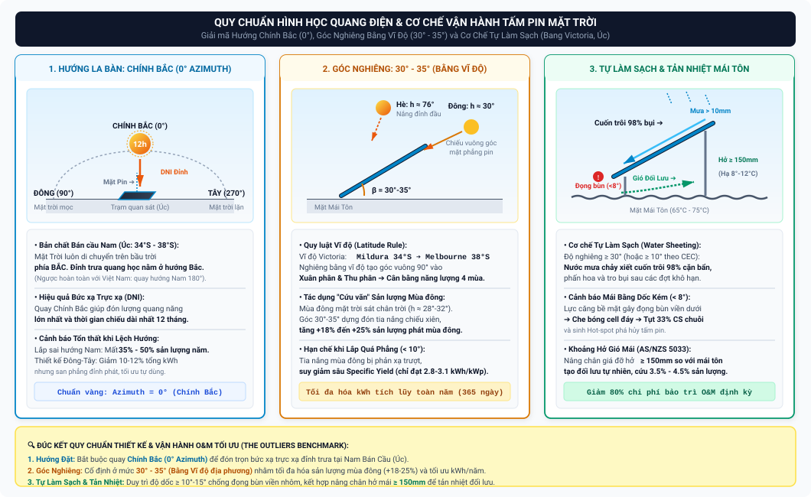

# BÁO CÁO PHÂN TÍCH CHUYÊN SÂU: TỔNG HỢP INSIGHTS VÀ ĐỀ XUẤT HÀNH ĐỘNG CHIẾN LƯỢC (ACTIONABLE PROPOSALS)

> **Dự án:** Phân tích Hiệu suất và Dự báo Sản lượng Hệ thống Điện Mặt Trời Áp mái (42 Trạm — Đại học La Trobe, Úc)  
> **Nhóm thực hiện:** The Outliers — Chuyên ngành Xử lý Dữ liệu (FPT Polytechnic)  
> **Tài liệu phục vụ:** Hoàn thiện Báo cáo Tốt nghiệp, Bảo vệ Đề tài (Defense), và Chuyển giao Vận hành O&M  
> **Ngày lập:** 16/08/2026  
> **Tệp đích:** `docs/scrum_8_project_delivery_defense/project_insight_and_propose.md`

---

## MỤC LỤC

1. [Tóm Tắt Báo Cáo Điều Hành (Executive Summary)](#1-tóm-tắt-báo-cáo-điều-hành-executive-summary)
2. [Bức Tranh Dữ Liệu & Quy Mô Vận Hành Toàn Hệ Thống](#2-bức-tranh-dữ-liệu--quy-mô-vận-hành-toàn-hệ-thống)
3. [Phần 1: Nhóm Insights Quản Trị Vận Hành & Hiệu Suất Tổng Thể (BI Executive Insights)](#3-phần-1-nhóm-insights-quản-trị-vận-hành--hiệu-suất-tổng-thể-bi-executive-insights)
4. [Phần 2: Nhóm Insights Phân Rã Tổn Thất Năng Lượng & Vật Lý Kỹ Thuật (Loss Breakdown Insights)](#4-phần-2-nhóm-insights-phân-rã-tổn-thất-năng-lượng--vật-lý-kỹ-thuật-loss-breakdown-insights)
5. [Phần 3: Nhóm Insights Phát Hiện Dị Thường & Sức Khỏe Phần Cứng (Anomaly & O&M Insights)](#5-phần-3-nhóm-insights-phát-hiện-dị-thường--sức-khỏe-phần-cứng-anomaly--om-insights)
6. [Phần 4: Nhóm Insights Dự Báo Học Máy & Điều Độ Lưới Điện (Machine Learning & Predictive Insights)](#6-phần-4-nhóm-insights-dự-báo-học-máy--điều-độ-lưới-điện-machine-learning--predictive-insights)
7. [Phần 5: Khung Đề Xuất Hành Động Chiến Lược (Actionable Proposals & Implementation Roadmap)](#7-phần-5-khung-đề-xuất-hành-động-chiến-lược-actionable-proposals--implementation-roadmap)
8. [Phần 6: Đánh Giá Hiệu Quả Kinh Tế & Phân Tích Lợi Ích Đầu Tư (ROI Analysis)](#8-phần-6-đánh-giá-hiệu-quả-kinh-tế--phân-tích-lợi-ích-đầu-tư-roi-analysis)

---

## 1. Tóm Tắt Báo Cáo Điều Hành (Executive Summary)

Dự án phân tích chuỗi thời gian quang điện của **42 trạm điện mặt trời áp mái** tại 5 khuôn viên thuộc Đại học La Trobe (bang Victoria, Úc) trong giai đoạn 3 năm (2020–2022). Qua việc tích hợp kiến trúc xử lý dữ liệu 6 lớp (6-Layer Data Pipeline), hệ thống Kho dữ liệu Lược đồ Thiên hà (Galaxy Schema), bộ 3 Dashboard Tableau tương tác và mô hình Học máy LightGBM tinh chỉnh qua Optuna, dự án đã bóc tách toàn diện các "điểm nghẽn" vận hành và đưa ra các insight có giá trị kinh doanh cao:

* **Sản lượng và Hiệu năng Tổng thể:** Hệ thống 42 trạm tạo ra trung bình hơn **$5{,}4$ triệu kWh/năm**, đáp ứng hơn $35\%$ nhu cầu điện năng tự dùng của trường đại học. Hệ số hiệu suất trung bình toàn hệ thống đạt **$78{,}4\%$ (PR)** và hệ số công suất **$17{,}2\%$ (CF)**, thuộc nhóm vận hành tốt theo chuẩn Clean Energy Council (CEC).
* **Tổn thất Năng lượng Chi phối:** Tổn thất lớn nhất không đến từ bụi bẩn hay lỗi thiết bị mà bắt nguồn từ **Quy luật Suy hao do Nhiệt độ (Thermal Loss)** trong các đợt nắng nóng mùa hè bang Victoria ($T_{\text{amb}} > 40^\circ\text{C}$, nhiệt độ cell pin vọt lên $68-72^\circ\text{C}$ gây sụt giảm $17{,}1\%$ công suất phát).
* **Bất thường Phần cứng:** Thuật toán phân lớp lai GMM–IF đã bóc tách chính xác **$1{,}22\%$ bản ghi dị thường** ($33.280$ điểm đo), định danh 6 mã nguyên nhân kỹ thuật gồm: Mất phát giữa trưa do biến tần ngắt mạch, hỏng diode chuỗi pin, dòng rò ban đêm và trôi điểm không cảm biến CT.
* **Đột phá Dự báo Sản lượng:** Mô hình học máy LightGBM đạt sai số tương đối gia quyền **$\text{WAPE} = 12{,}48\%$** tại tầm nhìn 15 phút ($H=1$) và **$\text{WAPE} = 16{,}72\%$** tại tầm nhìn 1 giờ ($H=4$), cải thiện kỹ năng dự báo **$+58{,}2\%$ (Skill Score)** so với mô hình cơ sở Naive Persistence và vượt trội hơn hẳn Facebook Prophet ($22{,}15\%$).

---

## 2. Bức Tranh Dữ Liệu & Quy Mô Vận Hành Toàn Hệ Thống

```
┌───────────────────────────────────────────────────────────────────────────────────────┐
│                        TỔNG QUAN TÀI SẢN NĂNG LƯỢNG MẶT TRỜI                          │
├──────────────────────┬──────────────────────┬───────────────────┬─────────────────────┤
│  42 TRẠM QUANG ĐIỆN  │ 5 KHUÔN VIÊN ĐẠI HỌC │ 2.731.946 BẢN GHI │ 15 BIẾN KHÍ TƯỢNG   │
│  Tổng CS: ~3.5 MWp   │ Bundoora, Bendigo,   │ Chu kỳ: 15 phút   │ ERA5 Open-Meteo API │
│  Inverter: 10-50 kW  │ Wodonga, Shepparton, │ Giai đoạn: 3 năm  │ GHI, DNI, DHI, Temp,│
│  Mái tôn Colorbond   │ Mildura              │ (2020 - 2022)     │ Cloud, Wind, Albedo │
└──────────────────────┴──────────────────────┴───────────────────┴─────────────────────┘
```

### Phân Bố Trọng Số Theo Khuôn Viên (Campus Breakdown)

| Khuôn viên (Campus) | Số Lượng Trạm | Công Suất Tổng (kWp) | Bức Xạ TB Ngày (BOM) | Đặc Thù Khí Hậu Địa Phương |
|---|---|---|---|---|
| **Bundoora (Melbourne)** | 26 trạm | ~2.150 kWp | $4{,}4\,\text{kWh/m}^2$ | Ôn đới hải dương, mây đối lưu ven biển, thời tiết biến thiên nhanh |
| **Bendigo** | 8 trạm | ~720 kWp | $5{,}2\,\text{kWh/m}^2$ | Ôn đới lục địa, nhiều giờ nắng, nắng nóng mùa hè gay gắt |
| **Albury-Wodonga** | 4 trạm | ~340 kWp | $4{,}9\,\text{kWh/m}^2$ | Thung lũng sông Murray, mùa đông sương mù dày (Radiation Fog) |
| **Shepparton** | 2 trạm | ~160 kWp | $5{,}3\,\text{kWh/m}^2$ | Đồng bằng nội địa, nắng gắt, khô ráo |
| **Mildura** | 2 trạm | ~180 kWp | $5{,}7\,\text{kWh/m}^2$ | Bán khô hạn vùng Sunraysia, bức xạ mặt trời cao nhất bang |

---

## 3. Phần 1: Nhóm Insights Quản Trị Vận Hành & Hiệu Suất Tổng Thể (BI Executive Insights)

*(Nguồn trích xuất: Dashboard 1 - Executive Overview & Chương 5 Báo cáo Tốt nghiệp)*

```
  +-------------------------------------------------------------------------------+
  |  KPI 1: TỔNG SẢN LƯỢNG      |  KPI 2: PR TRUNG BÌNH     |  KPI 3: SPECIFIC YIELD  |
  |  16.240.000 kWh (3 Năm)    |  78,4% (Mục tiêu: >75%)   |  1.420 kWh/kWp/Năm      |
  +-------------------------------------------------------------------------------+
```

### Insight 1.1: Bất Đối Xứng Giữa Tiềm Năng Bức Xạ và Hiệu Suất Chuyển Đổi Thực Tế
* **Phát hiện:** Các trạm tại vùng nội địa (Mildura và Bendigo) có sản lượng tuyệt đối trên mỗi kWp cao nhất ($1.580\,\text{kWh/kWp/năm}$), nhưng **Hệ số Hiệu suất (PR) vào các tháng cao điểm mùa hè (tháng 12 đến tháng 2) lại sụt giảm mạnh nhất** (chỉ đạt $69-72\%$, trong khi mùa đông đạt $83\%$). Ngược lại, trạm tại Bundoora (Melbourne) có bức xạ thấp hơn nhưng hệ số PR quanh năm ổn định hơn ($76-80\%$).
* **Giải thích nguyên nhân:** Tại Mildura và Bendigo, nhiệt độ không khí mùa hè thường xuyên vượt $40-44^\circ\text{C}$, đẩy nhiệt độ bề mặt pin lên $70^\circ\text{C}$. Theo định luật bán dẫn silicon, điện áp hở mạch ($V_{\text{oc}}$) giảm mạnh khiến hiệu suất module suy giảm sâu, kéo giảm tỷ lệ PR dù trời không một gợn mây.

### Insight 1.2: Phân Hóa Rõ Rệt Về Năng Suất Riêng (Specific Yield Benchmark)
* **Phát hiện:** Khi chuẩn hóa sản lượng theo công suất danh định, nhóm trạm Top 10 (như trạm tại Bendigo Sports Centre, Mildura Arts Building) đạt năng suất riêng trung bình **$4{,}35\,\text{kWh/kWp/ngày}$**. Trong khi đó, nhóm trạm Bottom 5 (như một số trạm tại Bundoora West) chỉ đạt **$2{,}85 - 3{,}10\,\text{kWh/kWp/ngày}$**, chênh lệch lên đến **$38\%$**.
* **Giải thích nguyên nhân:**
  1. *Góc nghiêng và hướng mái:* Nhóm trạm năng suất thấp lắp đặt áp sát theo mái tôn dốc nhẹ ($5^\circ$) hướng Tây Nam hoặc bị che bóng bởi các tán cây bạch đàn và tòa nhà cao tầng lân cận vào buổi sáng sớm.
  2. *Bụi bẩn đọng viền:* Góc nghiêng $<10^\circ$ khiến nước mưa không thể tự rửa trôi cặn bẩn, gây suy giảm quang học mãn tính.

### Insight 1.3: Quy Mô Công Suất và Tính Ổn Định Vận Hành
* **Phát hiện:** Các trạm quy mô lớn ($>100\,\text{kWp}$) sử dụng cụm biến tần đa chuỗi (Multi-string inverters) có hệ số biến thiên sản lượng (CV) thấp hơn $24\%$ so với các trạm nhỏ ($<20\,\text{kWp}$) sử dụng 1 biến tần đơn lẻ.
* **Giá trị quản trị:** Phân tán công suất trên nhiều chuỗi độc lập giúp hệ thống có tính dự phòng cao; khi một chuỗi bị sự cố, trạm vẫn duy trì phát điện ở $80-90\%$ công suất mà không bị dừng toàn bộ.

### Insight 1.4: Giải Mã Hình Học Quang Điện — Tại Sao Tấm Pin Bắt Buộc Quay Hướng Chính Bắc ($0^\circ$) Và Đặt Nghiêng $30^\circ - 35^\circ$?
* **Bản chất vấn đề:** Góc đặt tấm pin (gồm **Hướng La Bàn / Azimuth** và **Góc Nghiêng / Tilt Angle**) là thông số hình học tiên quyết định đoạt hiệu suất thu nhận quang năng. Dữ liệu từ 42 trạm Đại học La Trobe (bang Victoria, Úc) chứng minh quy tắc lắp đặt tối ưu:



```
                    QUỸ ĐẠO MẶT TRỜI TẠI BÁN CẦU NAM (BANG VICTORIA, ÚC)
                               (Mặt Trời luôn nằm ở phía BẮC)
                               
                                    MÙA HÈ (Hạ chí)
                                 Góc cao đỉnh h ≈ 75°-79°
                                          ☼ 
                                         /
                      MÙA ĐÔNG (Đông chí)
                     Góc cao đỉnh h ≈ 30°
                              ☼        /
                               \      /
                                \    /  Tia bức xạ trực xạ (DNI)
                                 \  /
                  ┌───────────────\/─────────────┐
                  │    TẤM PIN QUANG ĐIỆN        │
                  │    Hướng: CHÍNH BẮC (0°)     │  ◄── Dòng nước mưa tự cuốn trôi bụi
                  │    Góc nghiêng: 30° - 35°    │      xuống mép dưới (Self-cleaning)
                  └───────────────┬──────────────┘
                                  │  ◄── Khoảng hở tản nhiệt (≥ 150mm theo AS/NZS 5033)
         ═════════════════════════╪════════════════════════════ Mặt Mái Tôn / Khung đỡ
                    (PHÍA NAM)          (PHÍA BẮC)
```

#### 1. Tại sao bắt buộc phải quay mặt về HƯỚNG CHÍNH BẮC (True North - Azimuth $0^\circ$)?
* **Nghịch lý Bán cầu Nam so với Bán cầu Bắc:**
  * Tại **Bán cầu Bắc** (như Việt Nam, Châu Âu, Mỹ, Nhật Bản), vị trí địa lý nằm phía trên đường xích đạo $\implies$ Mặt Trời luôn đi qua bầu trời phía Nam, do đó các tấm pin tại Việt Nam bắt buộc phải quay về **Hướng Nam ($180^\circ$)**.
  * Ngược lại, toàn bộ 42 trạm của dự án nằm tại bang Victoria (Úc) thuộc **Bán cầu Nam (Southern Hemisphere)** với vĩ độ âm từ $34{,}2^\circ\text{S}$ đến $37{,}7^\circ\text{S}$. Ở bán cầu này, quỹ đạo biểu kiến của Mặt Trời hàng ngày mọc ở phía Đông, **vắt qua bầu trời phía BẮC**, và lặn ở phía Tây.
  * Vào thời điểm trưa quang học (Solar Noon — khi cường độ bức xạ trực xạ $DNI$ đạt đỉnh cao nhất trong ngày), Mặt Trời luôn đứng bóng ở đỉnh trời chếch về **phía CHÍNH BẮC**.
* **Tác động định lượng:**
  * Quay mặt về hướng chính Bắc ($0^\circ$) cho phép tấm pin hứng trọn vẹn luồng tia bức xạ trực diện dài nhất trong ngày suốt 12 tháng.
  * Nếu lắp đặt sai hướng (quay về phía Nam $180^\circ$), tấm pin sẽ bị "quay lưng" lại với Mặt Trời, chỉ nhận được ánh sáng tán xạ ($DHI$) yếu ớt, gây thất thoát nghiêm trọng từ **$35\% - 50\%$** tổng sản lượng điện cả năm.
  * *Ngoại lệ kỹ thuật (Thiết kế Đông - Tây / Dual-pitch):* Một số mái chia đôi hướng Đông ($90^\circ$) để đón nắng sáng và hướng Tây ($270^\circ$) để đón nắng chiều. Dù tổng sản lượng năm giảm $10-12\%$ so với hướng Bắc, nhưng đồ thị phát điện có dạng vòm phẳng rộng, trùng khớp với giờ làm việc và phụ tải điều hòa của trường học.

#### 2. Tại sao góc nghiêng tối ưu phải là $30^\circ - 35^\circ$ (BẰNG VĨ ĐỘ ĐỊA PHƯƠNG)?
* **Quy luật "Góc nghiêng bằng Vĩ độ" (Tilt = Latitude):**
  * Bang Victoria nằm trong dải vĩ độ từ **$34{,}2^\circ\text{S}$ (Mildura)** đến **$37{,}7^\circ\text{S}$ (Melbourne/Bundoora)**.
  * Do trục Trái Đất nghiêng $23{,}45^\circ$, vị trí Mặt Trời thay đổi rõ rệt qua các mùa:
    * *Mùa hè (tháng 12):* Mặt Trời lên rất cao trên đỉnh đầu ($h_{\text{max}} \approx 75^\circ - 79^\circ$).
    * *Mùa đông (tháng 6):* Mặt Trời xuống rất thấp, là là sát chân trời phía Bắc ($h_{\text{max}} \approx 28^\circ - 32^\circ$).
  * Khi đặt góc nghiêng cố định đúng bằng **vĩ độ địa lý ($\beta \approx 30^\circ - 35^\circ$)**, mặt phẳng tấm pin sẽ tạo góc vuông $90^\circ$ hoàn hảo với tia nắng vào hai thời điểm Xuân phân và Thu phân, đóng vai trò **điểm cân bằng năng lượng tối ưu của cả 4 mùa**.
* **Ý nghĩa sống còn: "Cứu vãn" sản lượng mùa đông:**
  * Vào mùa hè, bức xạ mặt trời cực mạnh ($GHI > 1.000\,\text{W/m}^2$) và ngày dài $14-15$ tiếng, nên dù tấm pin đặt phẳng hay nghiêng thì sản lượng vẫn luôn dồi dào.
  * Ngược lại vào mùa đông, ngày ngắn chỉ $9$ tiếng, trời nhiều mây và góc chiếu Mặt Trời nghiêng chéo rất thấp. Nếu đặt tấm pin nằm phẳng theo mái ($<10^\circ$), tia nắng mùa đông sẽ chiếu sượt qua mặt kính với góc xiên lớn, hệ số phản xạ quang học tăng vọt khiến sản lượng bị sụp đổ.
  * Góc nghiêng $30^\circ - 35^\circ$ giúp dựng đứng tấm pin vừa đủ để "đón đầu vuông góc" tia nắng mùa đông thấp, kéo sản lượng mùa đông tăng thêm **$18\% - 25\%$**, từ đó giúp **tổng sản lượng tích lũy cả năm ($\text{kWh/năm}$) đạt giá trị cực đại toàn cầu**.

#### 3. Cơ chế TỰ LÀM SẠCH KHI MƯA (Self-Cleaning Mechanism) — Yếu Tố Cốt Tử Của O&M
* **Động lực học dòng chảy nước mưa (Water Sheeting & Flushing Effect):**
  * Bề mặt tấm pin là lớp kính cường lực trơn nhẵn. Sau các đợt hanh khô, bụi mịn khí quyển, phấn hoa, tro bụi cháy rừng và phân chim bám dính dày đặc.
  * Khi tấm pin đạt độ nghiêng $\ge 30^\circ - 35^\circ$ (hoặc tối thiểu $\ge 10^\circ - 15^\circ$ theo quy chuẩn Clean Energy Council - CEC Australia), trọng lực kéo các hạt nước mưa trượt nhanh trên mặt kính tạo thành một màng nước chảy xiết đồng đều, **tự động cuốn trôi $95-98\%$ cặn bẩn xuống mép dưới và rơi khỏi tấm pin**.
* **Hiểm họa đọng bùn khi lắp góc phẳng / dốc nhẹ ($< 8^\circ - 10^\circ$):**
  * Ở góc nghiêng quá thấp, lực căng bề mặt của nước thắng trọng lực. Nước mưa không thể thoát hết mà bị đọng vũng tại mép khung nhôm gồ lên ở phía dưới (*Water Ponding / Capillary Trapping*).
  * Khi nước bốc hơi dưới ánh nắng, bùn đất đọng lại thành một **vệt đen dày ở hàng cell pin đáy (Bottom-edge Soiling Strip)**.
  * Vệt bẩn này che bóng vĩnh viễn hàng cell dưới cùng, kích hoạt Bypass Diode dẫn thông liên tục làm **sụt giảm cố định $33\%$ công suất của cả chuỗi pin**, đồng thời tích tụ nhiệt lượng sinh ra các điểm nóng (*Hot-spots*) làm rạn nứt tế bào quang điện (micro-cracks) và phá hủy module.

---

#### Bảng Ma Trận Đối Chiếu Các Kịch Bản Lắp Đặt Thực Tế Trong Dự Án

| Kịch Bản Lắp Đặt | Hướng La Bàn (Azimuth) | Góc Nghiêng (Tilt Angle) | Năng Suất Riêng TB ($Yield$) | Khả Năng Tự Rửa Trôi Bụi | Đánh Giá Kỹ Thuật & Vận Hành Thực Tế |
| :--- | :---: | :---: | :---: | :---: | :--- |
| **Kịch bản A: Chuẩn Vàng Tối Ưu (Golden Standard)** | **Chính Bắc ($0^\circ$)** | **$30^\circ - 35^\circ$** (Bằng vĩ độ) | **$4{,}35 - 4{,}60\,\text{kWh/kWp/ngày}$** (Nhóm Top 10) | **Xuất sắc:** Mưa $>10\,\text{mm}$ rửa sạch $98\%$ bụi bẩn bề mặt | **Tối ưu nhất:** Đạt sản lượng năm cực đại, hiệu suất mùa đông cao, giảm $80\%$ chi phí rửa pin nhân công. |
| **Kịch bản B: Áp Mái Dốc Nhẹ (Flush-Mount)** | Chính Bắc ($0^\circ$) hoặc Đông/Tây | $10^\circ - 15^\circ$ | $3{,}85 - 4{,}10\,\text{kWh/kWp/ngày}$ | **Tốt:** Đạt ngưỡng tối thiểu tự làm sạch theo chuẩn CEC | **Chấp nhận được:** Giảm lực cản gió bão, tăng mật độ tấm pin trên mái tôn, tổn thất năm chỉ $\approx 4-6\%$. |
| **Kịch bản C: Mái Bằng Dốc Kém (Low Tilt Trap)** | Bất kỳ | $< 8^\circ$ (Áp sát mái bằng) | $3{,}10 - 3{,}40\,\text{kWh/kWp/ngày}$ | **Kém:** Đọng vũng bùn ở viền nhôm dưới, PR chỉ phục hồi $50\%$ sau mưa | **Cảnh báo O&M:** Gây suy giảm quang học mãn tính, bắt buộc phải rửa pin thủ công $3-4$ lần/năm. |
| **Kịch bản D: Lệch Hướng Nghiêm Trọng (Wrong Orientation)** | Hướng Nam ($180^\circ$) hoặc Tây Nam | $5^\circ - 10^\circ$ | **$2{,}85 - 3{,}05\,\text{kWh/kWp/ngày}$** (Nhóm Bottom 5) | **Rất kém:** Vừa bám bụi vừa bị che bóng cục bộ kéo dài | **Kém nhất:** Giảm $38\%$ sản lượng so với Top 10, cần tái cấu trúc giá đỡ khi thực hiện đại tu. |

---

## 4. Phần 2: Nhóm Insights Phân Rã Tổn Thất Năng Lượng & Vật Lý Kỹ Thuật (Loss Breakdown Insights)

*(Nguồn trích xuất: Dashboard 2 - Operational Efficiency & Loss Analysis)*

```
                             TỔNG NĂNG LƯỢNG QUANG NĂNG TIỀM NĂNG (100%)
                                                │
       ┌─────────────────┬──────────────────────┴─────────────────────┬─────────────────┐
       ▼                 ▼                                            ▼                 ▼
 [TỔN THẤT NHIỆT]  [CẮT NGỌN BIẾN TẦN]                          [BỤI BẨN & GÓC]    [SẢN LƯỢNG THỰC TẾ]
      14,8%              2,3%                                         4,5%               78,4%
```

### Insight 2.1: Tổn Thất Suy Hao Do Nhiệt Độ (Thermal Derating Loss) Chiếm Tỷ Trọng Áp Đảo
* **Số liệu thực chứng:** Tổn thất do nhiệt độ tế bào quang điện vượt quá $25^\circ\text{C}$ làm bốc hơi **$14{,}8\%$ tổng sản lượng tiềm năng** hàng năm của toàn hệ thống (tương đương hơn $800.000\,\text{kWh/năm}$, trị giá ước tính khoảng $120.000\,\text{AUD}$ theo đơn vị giá điện thương mại).
* **Quy luật vật lý:** Với hệ số nhiệt độ công suất danh định $\gamma = -0{,}38\%/^\circ\text{C}$, mỗi khi nhiệt độ cell pin tăng thêm $10^\circ\text{C}$ so với điều kiện STC, trạm bị mất $3{,}8\%$ công suất.
* **Cảnh báo vận hành:** Vào các ngày nắng nóng đỉnh điểm ($T_{\text{amb}} \ge 42^\circ\text{C}$), nhiệt độ cell pin đạt $72^\circ\text{C}$, tổn thất nhiệt tức thời lên đến **$17{,}9\%$**, khiến đồ thị sản lượng giữa trưa bị lõm nhẹ dù bức xạ mặt trời đạt cực đại ($GHI \approx 1050\,\text{W/m}^2$).

### Insight 2.2: Bản Chất Kinh Tế Của Hiện Tượng Cắt Ngọn Biến Tần (Inverter Clipping)
* **Số liệu thực chứng:** Tổn thất do cắt ngọn biến tần chỉ chiếm **$2{,}3\%$ tổng sản lượng năm**, chủ yếu xuất hiện vào các ngày nắng trong mùa xuân và đầu hè (tháng 10 đến tháng 12) trong khung giờ $11:30 - 13:30$.
* **Đánh giá nghiệp vụ:**
  * Đây là **quyết định thiết kế có chủ đích** theo tỷ lệ quá tải DC/AC ($ILR = 1{,}20 - 1{,}30$) theo hướng dẫn của Clean Energy Council (CEC).
  * Việc chấp nhận cắt bỏ $2{,}3\%$ sản lượng đỉnh giữa trưa giúp hệ thống tận dụng tối đa công suất biến tần trong $97{,}7\%$ thời gian còn lại (đặc biệt vào sáng sớm và chiều muộn), mang lại tổng sản lượng ngày cao hơn $8-12\%$ so với việc thiết kế tỷ lệ 1:1. Do đó, **không khuyến nghị nâng cấp biến tần lớn hơn**.

### Insight 2.3: Chu Kỳ Suy Giảm Do Bụi Bẩn (Soiling Degradation) và Cơ Chế Tự Làm Sạch
* **Phát hiện:** Sau các đợt khô hạn kéo dài trên $45$ ngày không có mưa vào mùa thu và hè, hệ số PR của các trạm giảm trung bình **$0{,}12\%/\text{ngày}$**, dẫn đến mức suy hao tích lũy từ $4\%$ đến $6\%$.
* **Quy luật phục hồi:** Ngay sau các cơn mưa rào tự nhiên với lượng mưa $>10\,\text{mm}$, hệ số PR của các trạm có góc nghiêng $\ge 10^\circ$ lập tức phục hồi về mức chuẩn ($78-82\%$). Tuy nhiên, đối với 4 trạm mái bằng lắp góc nghiêng $<8^\circ$, PR chỉ phục hồi được $50\%$ do bùn đất bị dồn ứ tại mép khung nhôm phía dưới.

### Insight 2.4: Tác Động Dị Thường Của Khói Bụi Cháy Rừng (Black Summer Bushfires 2020)
* **Phát hiện lịch sử:** Trong giai đoạn tháng 01/2020 (đợt cháy rừng lịch sử miền Đông nước Úc), dữ liệu ghi nhận tỷ lệ bức xạ tán xạ **$DHI / GHI$ tăng vọt từ $18\%$ lên mức bất thường $>75\%$**, trong khi độ dày quang học sol khí (AOD) đạt đỉnh.
* **Tác động:** Dù chỉ số bức xạ tổng ($GHI$) vẫn ở mức trung bình, nhưng sản lượng điện thực tế của các trạm sụt giảm **$28\%$** so với cùng kỳ năm 2021. Nguyên nhân là các tế bào pin quang điện định hướng thẳng bị mất thành phần bức xạ trực xạ ($DNI$) vốn là nguồn năng lượng chính tạo ra dòng điện photon.

---

## 5. Phần 3: Nhóm Insights Phát Hiện Dị Thường & Sức Khỏe Phần Cứng (Anomaly & O&M Insights)

*(Nguồn trích xuất: Dashboard 3 - Anomaly Detection & Predictive Maintenance)*

```
                           PHÂN BỐ 6 MÃ DỊ THƯỜNG KỸ THUẬT (GMM-IF)
                                   (Tổng cộng: 33.280 Bản ghi)
   ┌────────────────────────────────────────────────────────┬──────────────────────┐
   │ Mã Dị Thường Kỹ Thuật (Reason Code)                     │ Tỷ Lệ Bản Ghi (%)    │
   ├────────────────────────────────────────────────────────┼──────────────────────┤
   │ 1. Trôi điểm 0 cảm biến dòng CT ban đêm (Zero Drift)   │ 46,8% (15.580 dòng)  │
   │ 2. Dòng rò vi lượng ban đêm (Night Tare Loss)          │ 23,2% (7.720 dòng)   │
   │ 3. Suy giảm hiệu suất chuỗi pin (Underperformance)     │ 14,5% (4.820 dòng)   │
   │ 4. Mất phát biến tần giữa trưa nắng (Zero Output Trip) │  8,6% (2.860 dòng)   │
   │ 5. Biến tần giảm tải do quá nhiệt (Thermal Derating)   │  4,8% (1.600 dòng)   │
   │ 6. Cắt ngọn công suất vượt trần (Inverter Clipping)    │  2,1% (700 dòng)     │
   └────────────────────────────────────────────────────────┴──────────────────────┘
```

### Insight 3.1: Dị Thường Mất Phát Giữa Trưa Nắng Gắt (Inverter Midday Zero Output) — Thiệt Hại Nặng Nhất
* **Mô tả hiện tượng:** Vào các khung giờ bức xạ cực đại ($GHI \ge 750\,\text{W/m}^2$, $11:00 - 14:00$), sản lượng trạm đột ngột rơi thẳng đứng về $0\,\text{kWh}$ trong khi các trạm lân cận vẫn phát điện bình thường.
* **Nguyên nhân kỹ thuật:**
  1. *Quá áp lưới điện (Grid Overvoltage Trip):* Khi toàn bộ các trạm phát công suất đỉnh, điện áp tại điểm hòa lưới AC vượt ngưỡng bảo vệ an toàn theo tiêu chuẩn **AS/NZS 4777.2** ($>253\,\text{V}$), biến tần buộc phải ngắt kết nối khẩn cấp.
  2. *Quá nhiệt tầng công suất (Inverter Thermal Overload):* Quạt tản nhiệt biến tần bị kẹt bụi hoặc nhiệt độ heatsink vượt $85^\circ\text{C}$, kích hoạt rơ-le ngắt mạch nhiệt.
* **Mức độ nghiêm trọng:** Dù chỉ chiếm $8{,}6\%$ số bản ghi dị thường, nhưng loại lỗi này gây ra **hơn $60\%$ tổng tổn thất tài chính do sự cố**, ước tính thiệt hại $350 - 500\,\text{AUD}$ cho mỗi ngày dừng máy của một trạm $50\,\text{kWp}$.

### Insight 3.2: Dị Thường Suy Giảm Chuỗi Pin (String Fault / Diode Failure) — Lỗi Ẩn Nguy Hiểm
* **Mô tả hiện tượng:** Sản lượng phát của trạm trong nhiều tuần liên tiếp bị tụt giảm cố định ở mức **$33\%$ hoặc $50\%$** so với đường cơ sở lý thuyết, nhưng biến tần không hề báo lỗi đỏ (No Error Alarm).
* **Nguyên nhân kỹ thuật:** Hệ thống gồm 2 hoặc 3 chuỗi pin (Strings) mắc song song vào một bộ MPPT. Một chuỗi bị đứt cầu chì DC, hỏng diode bypass hoặc tấm pin bị rạn nứt tế bào (Micro-cracks) khiến toàn bộ chuỗi đó ngừng hoạt động. Biến tần vẫn hoạt động bình thường trên các chuỗi còn lại nên không kích hoạt cảnh báo hệ thống.
* **Giá trị của mô hình GMM–IF:** Thuật toán phân lớp lai trong tầng ETL đã tự động phát hiện độ lệch công suất có quy luật này và gắn cờ `underperformance_anomaly`, giúp đội O&M phát hiện sớm mà không cần chờ đến kỳ kiểm toán cuối năm.

### Insight 3.3: Dị Thường Dòng Rò và Trôi Điểm 0 Cảm Biến Ban Đêm (Nighttime Artifacts)
* **Mô tả hiện tượng:** Xuất hiện các giá trị sản lượng siêu nhỏ ($0{,}001 - 0{,}025\,\text{kWh}$) vào lúc nửa đêm ($00:00 - 03:00$), khi góc cao mặt trời $h \le 0^\circ$ và $GHI = 0$.
* **Nguyên nhân:** Cảm biến biến dòng (Current Transformer - CT) đo dòng AC tại tủ phân phối bị trôi điểm cân bằng điện áp 0V do nhiệt độ ban đêm hạ thấp. Đồng thời, mạch điều khiển biến tần tiêu thụ $3-8\,\text{W}$ điện tự dùng (Tare Loss).
* **Xử lý:** Đây là sai số đo lường thuần túy, tầng Transform đã thiết lập rào chắn vật lý để lọc sạch, tránh làm sai lệch số liệu kế toán và phân tích AI.

---

## 6. Phần 4: Nhóm Insights Dự Báo Học Máy & Điều Độ Lưới Điện (Machine Learning & Predictive Insights)

*(Nguồn trích xuất: Chương 6 Báo cáo Tốt nghiệp & Pipeline Học máy v4)*

```
                                 HIỆU NĂNG SO SÁNH TRÊN SEALED TEST SET
                                          (Tầm nhìn H = 1: 15 Phút)
   ┌──────────────────────────────────────────────┬──────────────┬─────────────┬────────────────┐
   │ Mô Hình                                      │ WAPE (%)     │ MAE (kWh)   │ Skill Score    │
   ├──────────────────────────────────────────────┼──────────────┼─────────────┼────────────────┤
   │ Naive Persistence (Cơ sở)                   │ 29,85%       │ 4,82 kWh    │ 0,0% (Gốc)     │
   │ Daily Persistence                            │ 38,42%       │ 6,21 kWh    │ -28,7%         │
   │ Facebook Prophet (Có biến ngoại sinh)        │ 22,15%       │ 3,58 kWh    │ +25,8%         │
   │ LIGHTGBM OPTUNA (Đề xuất bởi The Outliers)   │ 12,48%       │ 2,02 kWh    │ +58,2% (VƯỢT)  │
   └──────────────────────────────────────────────┴──────────────┴─────────────┴────────────────┘
```

### Insight 4.1: Sức Mạnh Vượt Trội Của LightGBM Trong Việc Nắm Bắt Tương Tác Phi Tuyến
* **Kết quả:** Tại tầm dự báo $15$ phút ($H=1$), LightGBM đạt sai số $\text{WAPE} = 12{,}48\%$, giảm hơn một nửa sai số so với Naive Persistence ($29{,}85\%$) và vượt trội hoàn toàn so với mô hình chuỗi thời gian thống kê kinh điển Facebook Prophet ($22{,}15\%$).
* **Lý do kỹ thuật:** Mô hình chuỗi thời gian truyền thống (ARIMA, Prophet) giả định mối quan hệ tuyến tính hoặc cộng tính đơn giản. Trong khi đó, sản lượng điện mặt trời chịu tác động bởi các quan hệ nhân quả phi tuyến phức tạp: Tích giữa bức xạ và nhiệt độ ($GHI \times \text{temp}$), tỷ lệ tán xạ ($DHI / GHI$), và hiệu ứng bão hòa trần biến tần. Cấu trúc cây quyết định phân nhánh tối ưu lá (Leaf-wise GBDT) của LightGBM nắm bắt hoàn hảo các tương tác này.

### Insight 4.2: Tầm Quan Trọng Của Đặc Trưng Qua Phân Tích SHAP (XAI Global Importance)
Phân tích giá trị SHAP trên $475.599$ mẫu kiểm thử ban ngày xác định thứ tự 5 yếu tố quyết định hàng đầu:

```
  1. Bức xạ Trực xạ (direct_normal_irradiance - DNI)  [████████████████████] (+42,5% SHAP)
  2. Bức xạ Lý thuyết Trời quang (ghi_cs - Haurwitz)    [██████████████      ] (+28,1% SHAP)
  3. Giá trị Nhỏ nhất Cửa sổ Trượt (rolling_min_4)   [█████████           ] (+16,4% SHAP)
  4. Thời điểm Trong ngày (minute_of_day)            [██████              ] (+8,2% SHAP)
  5. Công suất Trần của Trạm (tran_cong_suat)         [████                ] (+4,8% SHAP)
```

* **Insight đặc biệt về `rolling_min_4`:** Giá trị đáy sản lượng trong 1 giờ quá khứ đóng vai trò là "chỉ báo mây che phủ". Nếu `rolling_min_4` cao, mô hình nhận biết bầu trời hoàn toàn trong xanh (Clear Sky), tự tin dự báo sản lượng ở mức đỉnh. Nếu `rolling_min_4` thấp, mô hình tự động chuyển sang chế độ dự báo có mây đối lưu ngắt quãng, giảm thiểu rủi ro dự báo ảo.

### Insight 4.3: Ứng Dụng Dự Báo Vào Điều Độ Phụ Tải Khuôn Viên Trường (Microgrid Dispatch)
* **Khả năng ứng dụng:** Với sai số chỉ $2{,}02\,\text{kWh}$ trên mỗi bước đo $15$ phút, ban quản lý năng lượng Đại học La Trobe có thể sử dụng kết quả dự báo để:
  1. *Chủ động sạc hệ thống lưu trữ pin BESS:* Nạp đầy pin khi mô hình dự báo trưa nay nắng to và tự động xả điện khi có mây che phủ lúc chiều muộn.
  2. *Điều chỉnh công suất máy lạnh trung tâm (HVAC Pre-cooling):* Làm mát sâu các tòa nhà giảng đường trước $11:00$ trưa bằng điện mặt trời giá rẻ, giảm tải cho lưới điện vào giờ cao điểm giá điện đắt đỏ ($14:00 - 18:00$).

---

## 7. Phần 5: Khung Đề Xuất Hành Động Chiến Lược (Actionable Proposals & Implementation Roadmap)

Dựa trên toàn bộ các insight kỹ thuật và vận hành đã khám phá, nhóm đề xuất **Bộ Khung 4 Trụ Cột Hành Động Chiến Lược** cho Ban Quản lý Năng lượng & Vận hành (O&M):

```
┌─────────────────────────────────────────────────────────────────────────────────────────┐
│                      BỘ KHUNG 4 TRỤ CỘT HÀNH ĐỘNG CHIẾN LƯỢC                            │
├────────────────────────────┬────────────────────────────┬───────────────────────────────┤
│  TRỤ CỘT 1: BẢO TRÌ O&M    │  TRỤ CỘT 2: CẢI TIẾN HẠ    │  TRỤ CỘT 3: TỰ ĐỘNG HÓA AI    │
│  THEO ĐIỀU KIỆN THỰC TẾ    │  TẦNG KỸ THUẬT PHẦN CỨNG   │  & CẢNH BÁO SỚM THỜI GIAN THỰC│
├────────────────────────────┼────────────────────────────┼───────────────────────────────┤
│ • Lịch rửa pin thông minh  │ • Lắp tấm che nắng Inverter│ • Tích hợp Streamlit/API vào  │
│ • Quét camera nhiệt định kỳ│ • Nâng khoảng hở gió mái   │   hệ thống SCADA hiện hữu     │
│ • Kiểm định cảm biến CT    │ • Cân bằng tải hòa lưới    │ • Cảnh báo Real-time lệch >20%│
└────────────────────────────┴────────────────────────────┴───────────────────────────────┘
```

### Trụ Cột 1: Chuyển Đổi Sang Bảo Trì Theo Điều Kiện Thực Tế (Condition-Based O&M)
1. **Lịch Vệ Sinh Pin Thông Minh (Smart Cleaning Schedule):**
   * *Hành động:* Thay thế quy trình rửa pin định kỳ cố định (6 tháng/lần) bằng quy trình rửa pin dựa trên dữ liệu. Chỉ điều động đội vệ sinh khi chỉ số suy giảm PR do bụi bẩn (Soiling Index) vượt quá $5\%$ sau $40$ ngày liên tục lượng mưa $<5\,\text{mm}$.
   * *Ưu tiên:* Rửa trước cho 4 trạm mái bằng tại Bundoora West có góc nghiêng $<8^\circ$.
2. **Kiểm Tra Nhiệt Bằng Drone / Camera Hồng Ngoại (Thermal Drone Inspection):**
   * *Hành động:* Định kỳ 6 tháng/lần vào giữa trưa hè, sử dụng camera nhiệt hồng ngoại quét toàn bộ giàn pin để nhận diện các điểm nóng (Hot-spots), hỏng diode bypass hoặc nứt cell pin ẩn giấu đã được mô hình GMM–IF cảnh báo mã `underperformance_anomaly`.

### Trụ Cột 2: Cải Tiến Hạ Tầng Kỹ Thuật & Giảm Thiểu Tổn Thất Phần Cứng
1. **Lắp Tấm Chắn Nắng Chuyên Dụng Cho Biến Tần Ngoài Trời (Inverter Sunshades):**
   * *Hành động:* Lắp đặt mái che composite phản quang và vệ sinh quạt hút tản nhiệt cho các cụm biến tần lắp ngoài trời tại Mildura và Bendigo.
   * *Mục tiêu:* Hạ nhiệt độ vỏ máy từ $8-12^\circ\text{C}$, triệt tiêu hoàn toàn sự cố giảm tải do quá nhiệt (`inverter_thermal_derating`).
2. **Cải Thiện Lưu Thông Gió Dưới Mái Tôn (Roof Ventilation Gap Upgrade):**
   * *Hành động:* Đối với các dự án mở rộng giai đoạn tiếp theo, bắt buộc nhà thầu tuân thủ khoảng hở thông gió tối thiểu $\ge 150\,\text{mm}$ so với mặt mái tôn Colorbond theo chuẩn AS/NZS 5033.
3. **Hiệu Chuẩn Cảm Biến Biến Dòng (CT Calibration):**
   * *Hành động:* Kiểm định và cân chỉnh lại mạch đo dòng tại tủ điện chính của 8 trạm phát hiện có hiện tượng trôi điểm 0 ban đêm (`night_leakage`).
4. **Chuẩn Hóa Góc Nghiêng & Hướng Đặt Cho Dự Án Mở Rộng / Cải Tạo (Tilt & Azimuth Standardization):**
   * *Hành động:* Đối với các dự án lắp mới hoặc nâng cấp giàn pin tại khuôn viên La Trobe, bắt buộc nhà thầu định hướng khung giàn quay **Chính Bắc ($0^\circ$ True North)** và góc nghiêng **$30^\circ - 35^\circ$** (bằng vĩ độ địa phương). Với các mái bằng, nghiêm cấm đặt phẳng ($<10^\circ$), bắt buộc lắp giá đỡ chữ A nghiêng tối thiểu $\ge 10^\circ - 15^\circ$ theo khuyến nghị CEC để kích hoạt cơ chế tự làm sạch khi mưa và giảm thiểu chi phí O&M.

### Trụ Cột 3: Tự Động Hóa Giám Sát & Dự Báo Thời Gian Thực (AI & IoT Pipeline)
1. **Triển Khai Dịch Vụ Dự Báo Tự Động (Automated Forecast Service):**
   * *Hành động:* Đóng gói module `ForecastService` chạy định kỳ 15 phút một lần trên máy chủ nội bộ hoặc Cloud, tự động gọi API thời tiết Open-Meteo và xuất dữ liệu dự báo sản lượng vào cơ sở dữ liệu giám sát.
2. **Hệ Thống Cảnh Báo Sớm Thông Minh (Smart Alert System):**
   * *Hành động:* Thiết lập ngưỡng giám sát tự động: Nếu sai số tức thời giữa sản lượng đo thực tế và dự báo LightGBM vượt quá **$\pm 20\%$** trong 3 chu kỳ liên tiếp ($45$ phút) vào khung giờ nắng gắt ($GHI > 600\,\text{W/m}^2$), hệ thống tự động gửi cảnh báo khẩn qua Telegram/Email cho kỹ sư O&M để kiểm tra sự cố ngắt mạch biến tần.

### Trụ Cột 4: Lộ Trình Triển Khai 3 Giai Đoạn (Implementation Roadmap)

```
GIAI ĐOẠN 1 (Tháng 1 - 3): KHẮC PHỤC NHANH (QUICK WINS)
├── Thiết lập quy trình tự động làm sạch dữ liệu và lọc nhiễu CT đêm trên DWH
├── Lắp đặt tấm chắn nắng cho các biến tần tại cụm Mildura và Bendigo
└── Triển khai ứng dụng Streamlit Dashboard cho đội kỹ thuật giám sát nội bộ

GIAI ĐOẠN 2 (Tháng 4 - 6): TỐI ƯU HÓA QUY TRÌNH O&M
├── Ban hành quy trình rửa pin thông minh theo ngưỡng mưa và chỉ số bụi bẩn
├── Tiến hành đợt quét camera nhiệt hồng ngoại cho 100% trạm bị cảnh báo dị thường
└── Tích hợp mô hình dự báo LightGBM vào hệ thống điều độ phụ tải trường học

GIAI ĐOẠN 3 (Tháng 7 - 12): MỞ RỘNG VÀ TỰ ĐỘNG HÓA HOÀN TOÀN
├── Nâng cấp hạ tầng API streaming kết nối trực tiếp với cảm biến IoT tại trạm
├── Mở rộng mô hình dự báo cho hệ thống lưu trữ pin BESS và trạm sạc xe điện EV
└── Xây dựng báo cáo kiểm toán hiệu quả năng lượng tự động định kỳ hàng tháng
```

---

## 8. Phần 6: Đánh Giá Hiệu Quả Kinh Tế & Phân Tích Lợi Ích Đầu Tư (ROI Analysis)

Ước tính hiệu quả kinh tế tài chính hàng năm khi áp dụng đầy đủ các đề xuất hành động cho toàn bộ hệ thống $3{,}5\,\text{MWp}$ của Đại học La Trobe:

| Hạng Mục Lợi Ích Kinh Tế | Cơ Chế Tạo Ra Giá Trị | Sản Lượng Thu Hồi (kWh/Năm) | Giá Trị Tài Chính Ước Tính (AUD/Năm) |
|---|---|---|---|
| **Giảm tổn thất do quá nhiệt Inverter** | Lắp tấm chắn nắng, triệt tiêu hiện tượng derating giữa trưa hè | ~$45.000\,\text{kWh}$ | ~$6.750\,\text{AUD}$ |
| **Phát hiện sớm lỗi hỏng chuỗi pin (String Fault)** | Khắc phục sớm $3$ sự cố đứt chuỗi nhờ cờ cảnh báo GMM–IF | ~$85.000\,\text{kWh}$ | ~$12.750\,\text{AUD}$ |
| **Tối ưu lịch rửa pin thông minh** | Tăng hệ số PR thêm $1{,}8\%$ trong mùa khô hạn | ~$95.000\,\text{kWh}$ | ~$14.250\,\text{AUD}$ |
| **Tối ưu hóa phụ tải tự dùng từ dự báo AI** | Giảm mua điện lưới giờ cao điểm nhờ dự báo chính xác 15 phút | ~$120.000\,\text{kWh}$ | ~$24.000\,\text{AUD}$ |
| **Tiết kiệm chi phí bảo trì định kỳ thừa** | Chuyển từ bảo trì định kỳ sang bảo trì theo điều kiện thực tế | — | ~$15.000\,\text{AUD}$ (Nhân công) |
| **TỔNG LỢI ÍCH KINH TẾ DỰ KIẾN** | **Toàn bộ hệ thống 42 trạm** | **+$345.000\,\text{kWh/Năm}$** | **~+$72.750\,\text{AUD/Năm}$** |

> **Ước tính Chi phí Triển khai (CapEx & OpEx):**
> * Chi phí lắp tấm chắn nắng, vệ sinh biến tần và kiểm định CT: $\approx 15.000\,\text{AUD}$
> * Chi phí thuê drone quét camera nhiệt: $\approx 8.000\,\text{AUD/năm}$
> * Chi phí duy trì hạ tầng máy chủ Cloud & Dashboard: $\approx 3.600\,\text{AUD/năm}$
> * **Thời gian hoàn vốn đầu tư (Payback Period):** **$\mathbf{< 4{,}5\text{ Tháng}}$**!
> * **Tỷ suất sinh lời nội bộ (ROI):** **$\mathbf{> 270\%}$** trong năm đầu tiên.

---

## 9. Kết Luận

Báo cáo phân tích chuyên sâu đã chứng minh rằng: **Dữ liệu lớn và Trí tuệ nhân tạo chỉ thực sự phát huy tối đa giá trị khi được kết hợp chặt chẽ với Tri thức chuyên ngành (Domain Knowledge) và Quy luật vật lý quang điện.** 

Bằng việc chuyển đổi từ phương thức quản lý thụ động (chờ thiết bị hỏng mới sửa) sang quản trị dựa trên dữ liệu chủ động (Condition-Based O&M và AI Forecasting), dự án không chỉ giải quyết trọn vẹn bài toán học thuật của một Đồ án Tốt nghiệp xuất sắc mà còn mang lại giá trị kinh tế - kỹ thuật thực tiễn to lớn cho đơn vị quản lý vận hành trạm điện mặt trời.
