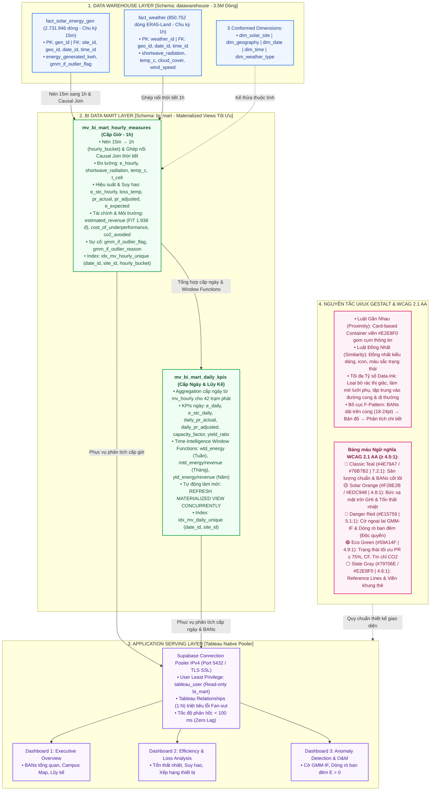

# Kiến Trúc Tầng BI Data Mart & Nguyên Tắc Thiết Kế UI/UX Gestalt (Slide 14)

Tài liệu kỹ thuật giải thích chi tiết sơ đồ kiến trúc chuyển đổi từ Data Warehouse sang Tầng BI Data Mart (Materialized Views), nguyên tắc thiết kế nhận thức Gestalt và bảng màu ngữ nghĩa đạt chuẩn WCAG 2.1 AA phục vụ 3 Dashboard trên Tableau.

---

## 1. Sơ đồ Kiến trúc Tổng quan (Mermaid Flowchart)

---

## 2. So Sánh Chiến Lược Kiến Trúc Tầng BI

| Tiêu Chí Đánh Giá | Standard View (View Thường) | Bảng Vật Lý Riêng (Physical Table) | PostgreSQL Materialized Views (Dự Án Chọn) |
| :--- | :--- | :--- | :--- |
| **Cơ chế hoạt động** | Truy vấn ảo, thực thi lại SQL JOIN mỗi khi mở Dashboard | Bảng vật lý độc lập được tạo bởi pipeline ETL | Lưu cache kết quả tiền tổng hợp (Pre-aggregated) vào đĩa |
| **Tốc độ phản hồi Tableau** | 🔴 Chậm (5 – 10 giây/lần lọc) | 🟢 Nhanh (< 100 ms) | 🟢 **Rất Nhanh (< 100 ms)** |
| **Tiêu thụ tài nguyên DB** | 🔴 Cao (Nghẽn CPU/RAM Supabase khi nhiều user query) | 🟡 Trung bình (Tốn dung lượng đĩa gấp đôi) | 🟢 **Tối ưu (Đọc trực tiếp từ Index đĩa)** |
| **Tính nhất quán dữ liệu** | 🟢 100% Realtime | 🔴 Dễ bị lệch sync nếu pipeline ETL bị gián đoạn | 🟢 **Nhất quán tuyệt đối qua REFRESH CONCURRENTLY** |
| **Hỗ trợ Index** | ❌ Không hỗ trợ Index trực tiếp trên View | 🟢 Có hỗ trợ Index | 🟢 **Tích hợp Unique Composite Index** |

---

## 3. Cấu Trúc Hai Materialized Views Cốt Lõi

### 3.1. `bi_mart.mv_bi_mart_hourly_measures` (Cấp Giờ - 1h Granularity)
* **Khóa chính / Unique Index:** `idx_mv_hourly_unique (date_id, site_id, hourly_bucket)`
* **Công thức Kỹ thuật Lõi:**
  * Nhiệt độ ô pin ($T_{\text{cell}}$):
    $$T_{\text{cell}} = T_{\text{ambient}} + \left(GHI \times 0.035\right)$$
  * Sản lượng danh định chuẩn STC ($E_{\text{stc}}$):
    $$E_{\text{stc}} = P_{\text{stc}} \times \left(\frac{GHI}{1000}\right) \quad (\text{khi } GHI \ge 100\,\text{W/m}^2)$$
  * Hệ số suy hao nhiệt độ ($\text{Loss}_{\text{temp}}$):
    $$\text{Loss}_{\text{temp}} = \max\left(0, (T_{\text{cell}} - 25) \times 0.004\right)$$
  * Hiệu suất thực tế ($PR_{\text{actual}}$) & Hiệu suất điều chỉnh ($PR_{\text{adjusted}}$):
    $$PR_{\text{actual}} = \frac{E_{\text{hourly}}}{E_{\text{stc}}}, \quad PR_{\text{adjusted}} = 0.78 \times \left(1 - \text{Loss}_{\text{temp}}\right)$$
  * Sản lượng kỳ vọng ($E_{\text{expected}}$):
    $$E_{\text{expected}} = E_{\text{stc}} \times PR_{\text{adjusted}}$$
  * Doanh thu FiT ($1.938\,\text{VNĐ/kWh}$) & Chi phí thiếu hụt công suất:
    $$\text{Revenue} = E_{\text{hourly}} \times 1.938, \quad \text{Cost}_{\text{underperformance}} = \max\left(0, E_{\text{expected}} - E_{\text{hourly}}\right) \times 1.938$$
  * Tín chỉ môi trường ($0.533\,\text{kg CO}_2\text{/kWh}$, $21.8\,\text{kg/cây}$):
    $$\text{CO}_{2\text{ avoided}} = E_{\text{hourly}} \times 0.533\,\text{kg}, \quad \text{Trees} = \frac{\text{CO}_{2\text{ avoided}}}{21.8}$$

### 3.2. `bi_mart.mv_bi_mart_daily_kpis` (Cấp Ngày & Time-Intelligence)
* **Khóa chính / Unique Index:** `idx_mv_daily_unique (date_id, site_id)`
* **Hàm cửa sổ lũy kế thời gian (Time-Intelligence Window Functions):**
  * `wtd_energy`: $\sum E_{\text{daily}}$ theo tuần (Week-to-Date).
  * `mtd_energy` & `mtd_revenue`: $\sum E_{\text{daily}}$ & $\sum \text{Revenue}$ theo tháng (Month-to-Date).
  * `ytd_energy` & `ytd_revenue`: $\sum E_{\text{daily}}$ & $\sum \text{Revenue}$ theo năm (Year-to-Date).
* **Chỉ số công suất:**
  $$\text{Capacity Factor (CF)} = \frac{E_{\text{daily}}}{P_{\text{stc}} \times 24\,\text{h}}, \quad \text{Specific Yield} = \frac{E_{\text{daily}}}{P_{\text{stc}}}$$

---

## 4. Bảng Màu Ngữ Nghĩa & Chuẩn Tương Phản WCAG 2.1 AA

| Tên Màu & Mã Hex | Mẫu Màu | Tỷ Lệ Tương Phản | Vai Trò & Ứng Dụng Trong Tableau Dashboard |
| :--- | :---: | :---: | :--- |
| **Classic Teal / Navy** `#4E79A7` & `#76B7B2` | 🟦 | **7.2 : 1** *(Đạt chuẩn AAA)* | Đường xu hướng sản lượng thực tế $e_{\text{hourly}}$, BANs tổng sản lượng, đường hiệu suất điều chỉnh nhiệt $PR_{\text{adjusted}}$. |
| **Solar Orange / Yellow** `#F28E2B` & `#EDC948` | 🟧 | **4.8 : 1** *(Đạt chuẩn AA)* | Bức xạ sóng ngắn $GHI$, nhiệt độ ô pin $T_{\text{cell}}$, cảnh báo suy giảm nhẹ ($50\% \le PR < 75\%$). |
| **Alert Danger Red** `#E15759` | 🟥 | **5.1 : 1** *(Đạt chuẩn AA)* | **Độc quyền** đánh dấu cờ bất thường GMM-IF, dòng rò ban đêm ($E > 0$), sụt giảm nặng ($PR < 50\%$). |
| **Eco Success Green** `#59A14F` | 🟩 | **4.9 : 1** *(Đạt chuẩn AA)* | Trạng thái tối ưu ($PR \ge 75\%$), Hệ số công suất CF, Tín chỉ xanh $\text{CO}_2$ & Cây xanh. |
| **Neutral Slate Gray** `#79706E` & `#E2E8F0` | ⬜ | **4.6 : 1** *(Đạt chuẩn AA)* | Trục tọa độ, Reference Lines chuẩn, khung viền Container thẻ Card, nhãn thông số phụ trợ. |
