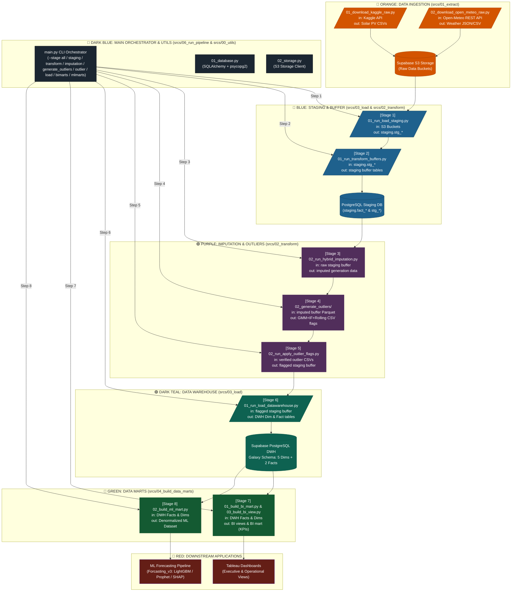

# SƠ ĐỒ LUỒNG CHẠY PIPELINE MÃ NGUỒN (DATA EXECUTION PIPELINE DIAGRAM) - THE OUTLIERS

Tài liệu này mô tả chi tiết kiến trúc luồng dữ liệu và trình tự thi hành mã nguồn (Code Execution Pipeline) trong thư mục `srcs/` của dự án **Phân tích Hiệu suất và Dự báo Sản lượng Điện Mặt Trời (The Outliers - FPT Polytechnic)**.

---

## 1. MÃ MÀU VÀ NGUYÊN TẮC HÌNH KHỐI (COLOR CODING & SHAPES)

- **Main Orchestrator Header (`#1B2631` / `#2C3E50` - Dark Blue):** Thanh điều phối trung tâm `main.py` và các module tiện ích `00_utils/`.
- **Orange (`#D35400` / `#F39C12`):** DATA INGESTION (`srcs/01_extract`) - Hình Parallelogram đại diện cho các script download/crawl API.
- **Blue (`#1F618D` / `#2980B9`):** STAGING & BUFFER (`srcs/03_load` & `02_transform`) - Hình Cylinder đại diện cho PostgreSQL Staging DB.
- **Purple (`#512E5B` / `#8E44AD`):** IMPUTATION & OUTLIERS (`srcs/02_transform`) - Hình Rounded Rectangle đại diện cho các bước xử lý dữ liệu (Imputation, GMM+IF, Apply Flags).
- **Dark Teal (`#0E6251` / `#16A085`):** DATA WAREHOUSE (`srcs/03_load`) - Hình Cylinder đại diện cho Supabase PostgreSQL DWH (Galaxy Schema: 5 Dims + 2 Facts).
- **Green (`#145A32` / `#27AE60`):** DATA MARTS (`srcs/04_build_data_marts`) - Các khối build BI Mart (KPIs) và ML Mart.
- **Red (`#641E16` / `#E74C3C`):** DOWNSTREAM APPLICATIONS - Tableau Dashboards và Machine Learning Forecasting Pipeline.

---

## 2. BIỂU ĐỒ MERMAID CHI TIẾT (MERMAID DATA FLOW)

