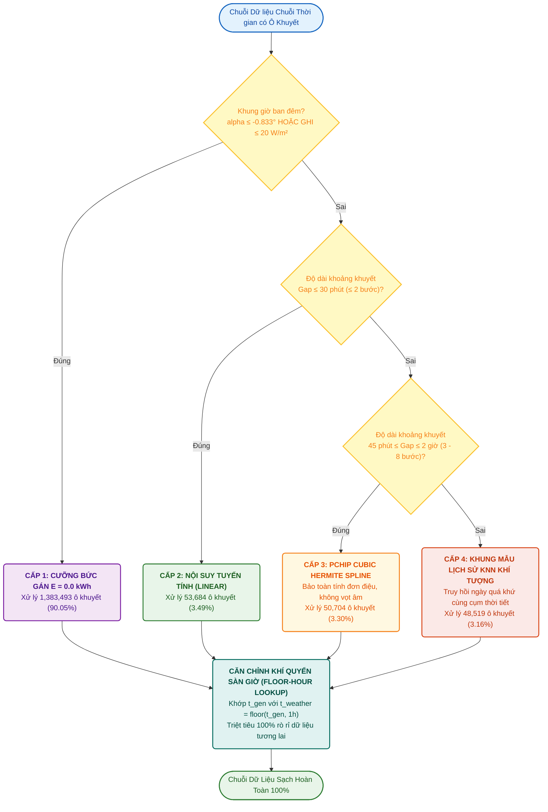
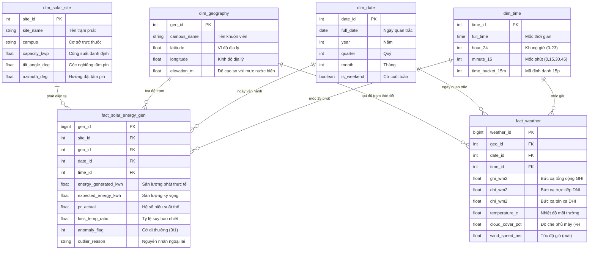
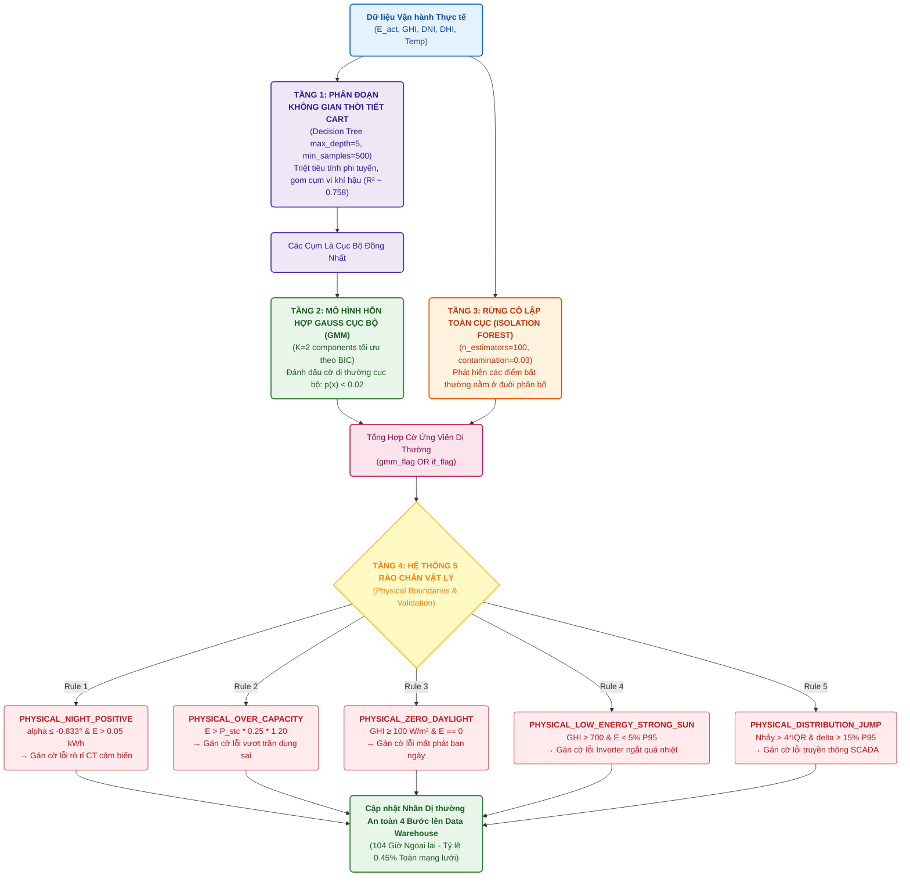
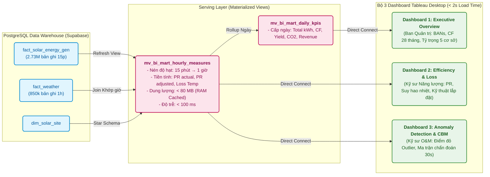

# HỆ THỐNG SƠ ĐỒ KIẾN TRÚC & ĐƯỜNG ỐNG DỮ LIỆU TOÀN DỰ ÁN
## Comprehensive Architecture, ETL Pipelines, Data Modeling & ML Workflows

> **Dự án:** Hệ thống Xử lý Dữ liệu, Nhận diện Dị thường Vận hành và Dự báo Sản lượng 42 Trạm Điện Mặt Trời tại Úc  
> **Nhóm thực hiện:** The Outliers — Chuyên ngành Xử lý Dữ liệu  
> **Tài liệu tham chiếu:** [`README.md`](../../README.md), [`DATN_REPORT_FINAL_02.tex`](../DATN_REPORT_FINAL_02.tex)

---

## MỤC LỤC SƠ ĐỒ
1. [Sơ đồ 1: Kiến Trúc Đường Ống Dữ Liệu Tổng Thể 6 Lớp](#sơ-đồ-1-kiến-trúc-đường-ống-dữ-liệu-tổng-thể-6-lớp)
2. [Sơ đồ 2: Luồng Điền Khuyết Nhân Quả Đa Tầng](#sơ-đồ-2-luồng-điền-khuyết-nhân-quả-đa-tầng)
3. [Sơ đồ 3: Mô Hình Hóa Kho Dữ Liệu Lược Đồ Thiên Hà](#sơ-đồ-3-mô-hình-hóa-kho-dữ-liệu-lược-đồ-thiên-hà)
4. [Sơ đồ 4: Kiến Trúc Nhận Diện Dị Thường Lai GMM-IF & 5 Rào Chắn Vật Lý](#sơ-đồ-4-kiến-trúc-nhận-diện-dị-thường-lai-gmm-if--5-rào-chắn-vật-lý)
5. [Sơ đồ 5: Kiến Trúc Tầng Phục Vụ BI Mart & Đồng Bộ Tableau Desktop](#sơ-đồ-5-kiến-trúc-tầng-phục-vụ-bi-mart--đồng-bộ-tableau-desktop)
6. [Sơ đồ 6: Đường Ống Huấn Luyện & Suy Luận Machine Learning](#sơ-đồ-6-đường-ống-huấn-luyện--suy-luận-machine-learning)

---

## Sơ đồ 1: Kiến Trúc Đường Ống Dữ Liệu Tổng Thể 6 Lớp

```mermaid
flowchart LR
    %% Bảng màu trực quan chuẩn hóa cho các tầng kiến trúc
    classDef l1 fill:#E1F5FE,stroke:#0288D1,stroke-width:1.5px,color:#01579B,rx:6px,ry:6px;
    classDef l2 fill:#F1F5F9,stroke:#64748B,stroke-width:1.5px,color:#0F172A,rx:6px,ry:6px;
    classDef l3 fill:#EDE7F6,stroke:#5E35B1,stroke-width:1.5px,color:#311B92,rx:6px,ry:6px;
    classDef l4 fill:#E8F5E9,stroke:#2E7D32,stroke-width:1.5px,color:#1B5E20,rx:6px,ry:6px;
    classDef bi fill:#FCE4EC,stroke:#C2185B,stroke-width:1.5px,color:#880E4F,rx:6px,ry:6px;
    classDef ml fill:#FFF3E0,stroke:#EF6C00,stroke-width:1.5px,color:#BF360C,rx:6px,ry:6px;
    classDef db fill:#FFFFFF,stroke:#37474F,stroke-width:1.5px,color:#263238,rx:4px,ry:4px;

    %% 1. INGESTION LAYER
    subgraph L1 ["<b>1. INGESTION</b>"]
        direction TB
        S1["<b>IoT 42 Sites</b><br/>2.73M dòng • 15p"]:::l1
        S2["<b>ERA5 Weather</b><br/>850k dòng • 1h"]:::l1
        S3[("<b>Raw S3 Lake</b><br/>DVC Storage")]:::db
        S1 --> S3
        S2 --> S3
    end

    %% 2. STAGING LAYER
    subgraph L2 ["<b>2. STAGING</b>"]
        direction TB
        ST1["<b>Staging Tables</b><br/>VARCHAR Buffer"]:::l2
        ST2["<b>Grid Resampling</b><br/>Lưới chuẩn 15p"]:::l2
        ST3["<b>QA/QC Integrity</b><br/>MD5 Checksum"]:::l2
        ST1 --> ST2 --> ST3
    end

    %% 3. TRANSFORM & CLEANING
    subgraph L3 ["<b>3. TRANSFORM</b>"]
        direction TB
        T1["<b>Cascade Impute</b><br/>4 cấp (1.54M ô)"]:::l3
        T2["<b>Floor-Hour</b><br/>Khớp nối nhân quả"]:::l3
        T3["<b>GMM-IF + 5 Rules</b><br/>Lọc dị thường O&M"]:::l3
        T1 --> T2 --> T3
    end

    %% 4. DWH CORE (GALAXY SCHEMA)
    subgraph L4 ["<b>4. DWH CORE (GALAXY)</b>"]
        direction TB
        D1[("<b>fact_solar_energy_gen</b><br/>2.73M dòng • 15 phút")]:::l4
        D2[("<b>fact_weather</b><br/>850k dòng • 1 giờ")]:::l4
        D3[("<b>5 Dim Tables</b><br/>Site • Geo • Date<br/>Time • WeatherType")]:::db
        D3 -.-> D1
        D3 -.-> D2
    end

    %% NHÁNH 1: BI DATA MART & TABLEAU
    subgraph BI_Branch ["<b>NHÁNH BI DATA MART & DASHBOARDS</b>"]
        direction TB
        M_BI[("<b>bi_mart.mv_bi_mart_hourly_measures</b><br/>Nén 1h • Tiền tính PR & Loss Temp")]:::bi
        A_BI["<b>Tableau Dashboard Suite</b><br/>DB1 Executive • DB2 Loss • DB3 CBM"]:::bi
        M_BI ==> A_BI
    end

    %% NHÁNH 2: ML DATA MART & MACHINE LEARNING
    subgraph ML_Branch ["<b>NHÁNH ML DATA MART & MACHINE LEARNING</b>"]
        direction TB
        M_ML[("<b>ml_mart.ml_mart_base</b><br/>Feature Store 52 biến trễ & vật lý")]:::ml
        A_ML["<b>LightGBM Regressor</b><br/>Dự báo Đa bước H1 (15p) &rarr; H4 (60p)"]:::ml
        M_ML ==> A_ML
    end

    %% PIPELINE FLOW CONNECTIONS
    S3 ==> ST1
    ST3 ==> T1
    T3 ==> D1
    T2 ==> D2

    %% TÁCH NHÁNH SONG SONG TỪ DWH CORE
    D1 ==>|Aggregate & Pre-calc| M_BI
    D2 ==>|Join Weather 1h| M_BI

    D1 ==>|Lag Features & Normalization| M_ML
    D2 ==>|Weather Features| M_ML
```

---

## Sơ đồ 2: Luồng Điền Khuyết Nhân Quả Đa Tầng

---

## Sơ đồ 3: Mô Hình Hóa Kho Dữ Liệu Lược Đồ Thiên Hà

---

## Sơ đồ 4: Kiến Trúc Nhận Diện Dị Thường Lai GMM-IF & 5 Rào Chắn Vật Lý

---

## Sơ đồ 5: Kiến Trúc Tầng Phục Vụ BI Mart & Đồng Bộ Tableau Desktop

---

## Sơ đồ 6: Đường Ống Huấn Luyện & Suy Luận Machine Learning

```mermaid
flowchart TD
    classDef l1 fill:#e3f2fd,stroke:#1565c0,stroke-width:2px,color:#0d47a1,rx:6px,ry:6px;
    classDef l2 fill:#ede7f6,stroke:#512da8,stroke-width:2px,color:#311b92,rx:6px,ry:6px;
    classDef l3 fill:#e8f5e9,stroke:#2e7d32,stroke-width:2px,color:#1b5e20,rx:6px,ry:6px;
    classDef l4 fill:#fff3e0,stroke:#e65100,stroke-width:2px,color:#bf360c,rx:6px,ry:6px;
    classDef l5 fill:#fce4ec,stroke:#c2185b,stroke-width:2px,color:#880e4f,rx:6px,ry:6px;
    classDef l6 fill:#e0f2f1,stroke:#00695c,stroke-width:2px,color:#004d40,rx:6px,ry:6px;

    DataIn["<b>Dữ liệu Sạch Lớp 3 &amp; Feature Store</b>"]:::l1 --> TargetNorm["<b>CHUẨN HÓA MỤC TIÊU VẬT LÝ</b><br/>k(t) = E(t) / [P_stc * sin(alpha(t))]<br/>Triệt tiêu quỹ đạo hình sin tự nhiên"]:::l1
    
    TargetNorm --> FeatEng["<b>KỸ NGHỆ 40 ĐẶC TRƯNG VẬT LÝ &amp; TRỄ</b><br/>- Khí tượng: GHI, DNI, DHI, Temp, Gió, Mây<br/>- Thiên văn: Góc nâng alpha, Góc thiên đỉnh, Air Mass AM1.5<br/>- Chuỗi thời gian: Lags (15p, 30p, 1h, 24h), Rolling Mean/Std<br/>- Không gian: Tọa độ, Độ cao, Dung lượng trạm"]:::l2

    FeatEng --> VIFDiag["<b>SÀNG LỌC ĐA CỘNG TUYẾN (VIF DIAGNOSTICS)</b><br/>Loại bỏ biến VIF &ge; 10 &rarr; Giữ lại tập đặc trưng tối ưu"]:::l3

    VIFDiag --> TrainLGBM["<b>HUẤN LUYỆN LIGHTGBM REGRESSOR</b><br/>- Hàm mất mát: Huber Loss (delta = 1.0)<br/>- Tối ưu siêu tham số: Optuna Bayesian TPE<br/>- 5-Fold Time-Series Cross Validation"]:::l4

    TrainLGBM --> Inference["<b>SUY LUẬN ĐA TẦM DỰ BÁO (MULTI-HORIZON)</b><br/>- H1: T + 15 phút (WAPE = 17.46%, R² = 0.9293)<br/>- H4: T + 60 phút (WAPE = 21.60%, R² = 0.8953)"]:::l5

    Inference --> InverseTrans["<b>BIẾN ĐỔI NGƯỢC VỀ ĐƠN VỊ KWH</b><br/>E_pred(t) = k_pred(t) * P_stc * sin(alpha(t))<br/>Kẹp trần an toàn [0, max_physical_kwh]"]:::l6

    InverseTrans --> FinalMetrics["<b>Kiểm định Khả năng Giải thích (SHAP &amp; XAI)</b><br/>Xuất kết quả phục vụ điều độ phụ tải và vận hành Pin lưu trữ BESS"]:::l3
```

---

  <i>Tài liệu sơ đồ kỹ thuật được chuẩn hóa bởi <b>The Outliers Team</b> — Đồ án Tốt nghiệp Chuyên ngành Xử lý Dữ liệu</i>

