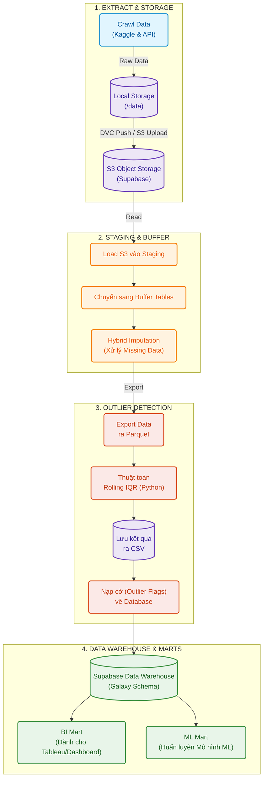

# Data Engineering Pipeline Diagram

```mermaid
flowchart TD
    classDef extract fill:#e1f5fe,stroke:#0288d1,stroke-width:2px,color:#01579b,rx:5px,ry:5px;
    classDef storage fill:#ede7f6,stroke:#673ab7,stroke-width:2px,color:#311b92,rx:5px,ry:5px;
    classDef process fill:#fff3e0,stroke:#f57c00,stroke-width:2px,color:#e65100,rx:5px,ry:5px;
    classDef transform fill:#fbe9e7,stroke:#d84315,stroke-width:2px,color:#bf360c,rx:5px,ry:5px;
    classDef load fill:#e8f5e9,stroke:#388e3c,stroke-width:2px,color:#1b5e20,rx:5px,ry:5px;

    %% --- Giai đoạn 1: Extract & Storage ---
    subgraph S1 ["1. EXTRACT & STORAGE"]
        direction TB
        E1["Crawl Data<br>(Kaggle & API)"]:::extract
        ST1[("Local Storage<br>(/data)")]:::storage
        ST2[("S3 Object Storage<br>(Supabase)")]:::storage
        
        E1 -->|Raw Data| ST1
        ST1 -->|DVC Push / S3 Upload| ST2
    end

    %% --- Giai đoạn 2: Staging & Cleaning ---
    subgraph S2 ["2. STAGING & BUFFER"]
        direction TB
        P1["Load S3 vào Staging"]:::process
        P2["Chuyển sang Buffer Tables"]:::process
        P3["Hybrid Imputation<br>(Xử lý Missing Data)"]:::process
        
        ST2 -->|Read| P1
        P1 --> P2
        P2 --> P3
    end

    %% --- Giai đoạn 3: Xử lý Outlier ---
    subgraph S3 ["3. OUTLIER DETECTION"]
        direction TB
        T1["Export Data<br>ra Parquet"]:::transform
        T2["Thuật toán<br>Rolling IQR (Python)"]:::transform
        ST3[("Lưu kết quả<br>ra CSV")]:::storage
        T3["Nạp cờ (Outlier Flags)<br>về Database"]:::transform
        
        P3 -->|Export| T1
        T1 --> T2
        T2 --> ST3
        ST3 --> T3
    end

    %% --- Giai đoạn 4: Data Warehouse & Marts ---
    subgraph S4 ["4. DATA WAREHOUSE & MARTS"]
        direction TB
        L1[("Supabase Data Warehouse<br>(Galaxy Schema)")]:::load
        L2["BI Mart<br>(Dành cho Tableau/Dashboard)"]:::load
        L3["ML Mart<br>(Huấn luyện Mô hình ML)"]:::load
        
        T3 --> L1
        L1 --> L2
        L1 --> L3
    end
```
