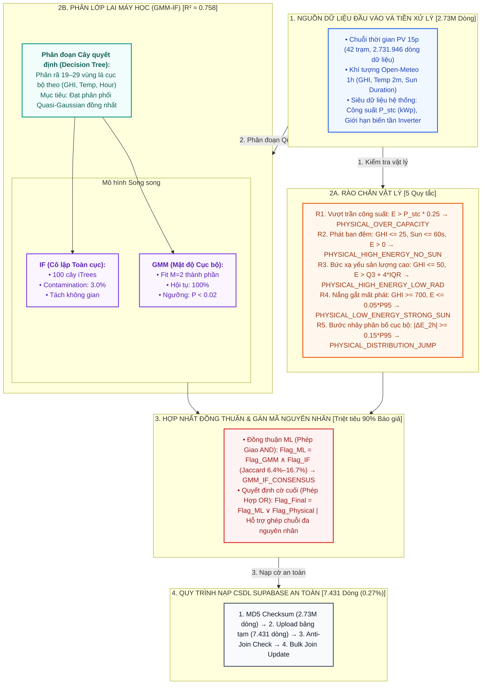

# GMM-IF Hybrid Classification and Physical Barriers Architecture

```mermaid
flowchart TD
    classDef inputStyle fill:#f0f7ff,stroke:#2563eb,stroke-width:2px,color:#1e40af;
    classDef physStyle fill:#fff7ed,stroke:#ea580c,stroke-width:2px,color:#9a3412;
    classDef treeStyle fill:#f0fdfa,stroke:#0d9488,stroke-width:2px,color:#115e59;
    classDef mlStyle fill:#faf5ff,stroke:#7c3aed,stroke-width:2px,color:#5b21b6;
    classDef fusionStyle fill:#fef2f2,stroke:#dc2626,stroke-width:2px,color:#991b1b;
    classDef dwhStyle fill:#f8fafc,stroke:#475569,stroke-width:2px,color:#0f172a;

    subgraph S1 ["1. NGUỒN DỮ LIỆU ĐẦU VÀO VÀ TIỀN XỬ LÝ [2.73M Dòng]"]
        D1["• Chuỗi thời gian PV 15p (42 trạm, 2.731.946 dòng dữ liệu)<br>• Khí tượng Open-Meteo 1h (GHI, Temp 2m, Sun Duration)<br>• Siêu dữ liệu hệ thống: Công suất P_stc (kWp), Giới hạn biến tần Inverter"]:::inputStyle
    end

    subgraph S2A ["2A. RÀO CHẮN VẬT LÝ [5 Quy tắc]"]
        P1["R1. Vượt trần công suất: E > P_stc * 0.25 → PHYSICAL_OVER_CAPACITY<br>R2. Phát ban đêm: GHI <= 25, Sun <= 60s, E > 0 → PHYSICAL_HIGH_ENERGY_NO_SUN<br>R3. Bức xạ yếu sản lượng cao: GHI <= 50, E > Q3 + 4*IQR → PHYSICAL_HIGH_ENERGY_LOW_RAD<br>R4. Nắng gắt mất phát: GHI >= 700, E <= 0.05*P95 → PHYSICAL_LOW_ENERGY_STRONG_SUN<br>R5. Bước nhảy phân bố cục bộ: |ΔE_2h| >= 0.15*P95 → PHYSICAL_DISTRIBUTION_JUMP"]:::physStyle
    end

    subgraph S2B ["2B. PHÂN LỚP LAI MÁY HỌC (GMM-IF) [R² ≈ 0.758]"]
        DT["<b>Phân đoạn Cây quyết định (Decision Tree):</b><br>Phân rã 19–29 vùng lá cục bộ theo (GHI, Temp, Hour)<br>Mục tiêu: Đạt phân phối Quasi-Gaussian đồng nhất"]:::treeStyle
        subgraph S2B_ML ["Mô hình Song song"]
            GMM["<b>GMM (Mật độ Cục bộ):</b><br>• Fit M=2 thành phần<br>• Hội tụ: 100%<br>• Ngưỡng: P < 0.02"]:::mlStyle
            IF["<b>IF (Cô lập Toàn cục):</b><br>• 100 cây iTrees<br>• Contamination: 3.0%<br>• Tách không gian"]:::mlStyle
        end
        DT --> GMM
        DT --> IF
    end

    subgraph S3 ["3. HỢP NHẤT ĐỒNG THUẬN & GÁN MÃ NGUYÊN NHÂN [Triệt tiêu 90% Báo giả]"]
        F1["• Đồng thuận ML (Phép Giao AND): Flag_ML = Flag_GMM ∧ Flag_IF (Jaccard 6.4%–16.7%) → GMM_IF_CONSENSUS<br>• Quyết định cờ cuối (Phép Hợp OR): Flag_Final = Flag_ML ∨ Flag_Physical | Hỗ trợ ghép chuỗi đa nguyên nhân"]:::fusionStyle
    end

    subgraph S4 ["4. QUY TRÌNH NẠP CSDL SUPABASE AN TOÀN [7.431 Dòng (0.27%)]"]
        W1["1. MD5 Checksum (2.73M dòng) → 2. Upload bảng tạm (7.431 dòng) → 3. Anti-Join Check → 4. Bulk Join Update"]:::dwhStyle
    end

    S1 -->|1. Kiểm tra vật lý| S2A
    S1 -->|2. Phân đoạn Quasi-Gauss| S2B
    S2A --> S3
    S2B_ML --> S3
    S3 -->|3. Nạp cờ an toàn| S4
```
