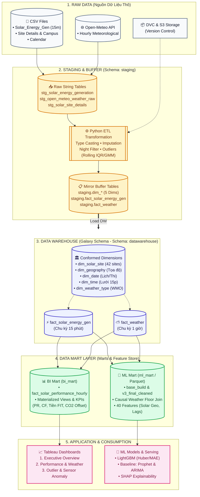

# KIẾN TRÚC HỆ THỐNG DỮ LIỆU TẬP TRUNG (SYSTEM ARCHITECTURE)
**Dự án Tốt nghiệp — The Outliers | Chuyên ngành Xử lý Dữ liệu**

Tệp nguồn Draw.io: [`system_architecture.drawio`](system_architecture.drawio)  
Hình ảnh xuất bản: [`system_architecture.png`](../figures/system_architecture.png)

---

## 1. SƠ ĐỒ LUỒNG KIẾN TRÚC TỔNG QUAN (MERMAID DIAGRAM)

---

## 2. BẢNG PHÂN RÃ CÁC TẦNG KIẾN TRÚC

| Tầng | Đối tượng CSDL / Mã nguồn | Định dạng / Công nghệ | Mô tả chức năng |
|---|---|---|---|
| **1. Raw Data** | • `Solar_Energy_Generation.csv` (2.73M dòng) • `Solar_Site_Details.csv` (42 trạm) • `open_meteo_weather_raw.csv` (367K dòng) | Local CSV, Open-Meteo API, DVC, S3 Storage | Thu thập dữ liệu IoT giám sát PV và dữ liệu khí tượng viễn thám. |
| **2. Staging & Buffer** | • Schema `staging.stg_*` • `srcs/02_transform/`, `srcs/03_load/` • Schema `staging.dim_*`, `staging.fact_*` | PostgreSQL, Pandas, Scikit-learn | Chứa dữ liệu text thô, chạy pipeline ép kiểu, xử lý khuyết thiếu, lọc nhiễu ban đêm, gắn cờ outlier. |
| **3. Data Warehouse** | • Schema `datawarehouse` • 5 Conformed Dims: `dim_solar_site`, `dim_geography`, `dim_date`, `dim_time`, `dim_weather_type` • 2 Facts: `fact_solar_energy_gen` (15p), `fact_weather` (1h) | PostgreSQL (Supabase) | Lưu trữ theo mô hình **Galaxy Schema**, giải quyết bài toán lệch pha thời gian (15p vs 1h). |
| **4. Data Marts** | • **BI Mart (`bi_mart`):** `fact_solar_performance_hourly`, MV cấp Giờ/Ngày, KPIs (PR, CF, FIT, CO2) • **ML Mart (`ml_mart`):** `base_build`, `v3_final_cleaned.parquet`, Causal Floor Join, 40 Features | PostgreSQL, Parquet Storage | Tối ưu hóa truy vấn cho Tableau Dashboard và cung cấp Feature Store sạch cho Machine Learning. |
| **5. Applications** | • 3 Tableau Dashboards (`.twbx`) • `srcs/05_machine_learning/pipeline/` (LightGBM, Prophet, ARIMA, SHAP) | Tableau Desktop, LightGBM, Optuna, SHAP | Phân tích điều hành, tối ưu bảo trì (Predictive Maintenance) và dự báo sản lượng chính xác. |
