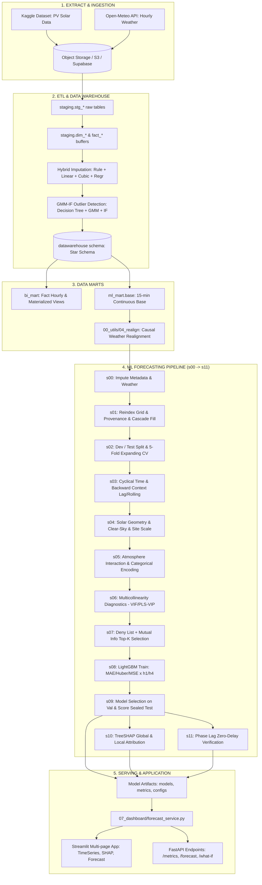
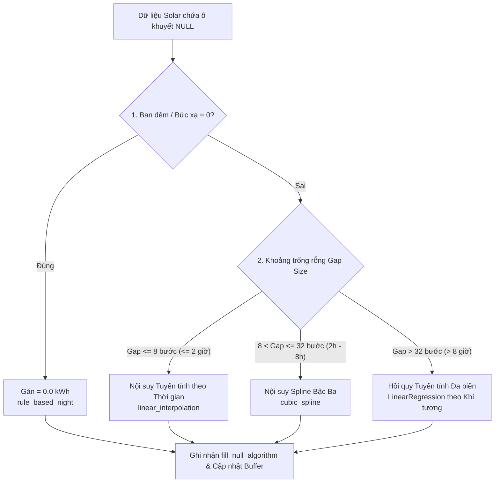

# TÀI LIỆU TỔNG QUAN VÀ CHI TIẾT LOGIC TOÀN BỘ PIPELINE
## HỆ THỐNG PHÂN TÍCH & DỰ BÁO SẢN LƯỢNG ĐIỆN MẶT TRỜI (THE OUTLIERS)

> **Vị trí lưu trữ:** `tests/PIPELINE_AND_PROCESSING_LOGIC_SUMMARY.md`  
> **Phạm vi mã nguồn:** Toàn bộ thư mục `srcs/` (`00_database` $\rightarrow$ `07_dashboard`)  
> **Mục đích:** Tổng hợp chi tiết kiến trúc luồng dữ liệu, thuật toán xử lý dữ liệu, kiểm tra logic toán học, rào chắn chống rò rỉ (Data Leakage) và quy trình kiểm thử/đánh giá mô hình.

---

## MỤC LỤC
1. [Tổng quan Kiến trúc Hệ thống (System Architecture)](#1-tổng-quan-kiến-trúc-hệ-thống-system-architecture)
2. [Chi tiết Luồng Dữ liệu ETL (Giai đoạn 00 - 04)](#2-chi-tiết-luồng-dữ-liệu-etl-giai-đoạn-00---04)
   - [2.1. 00_database & 00_utils: Cấu trúc Cơ sở dữ liệu & Tiện ích lõi](#21-00_database--00_utils-cấu-trúc-cơ-sở-dữ-liệu--tiện-ích-lõi)
   - [2.2. 01_extract: Thu thập Dữ liệu Gốc](#22-01_extract-thu-thập-dữ-liệu-gốc)
   - [2.3. 02_transform: Chuyển đổi, Nội suy & Dán nhãn Ngoại lai](#23-02_transform-chuyển-đổi-nội-suy--dán-nhãn-ngoại-lai)
   - [2.4. 03_load: Nạp Dữ liệu Sạch vào Staging & Data Warehouse](#24-03_load-nạp-dữ-liệu-sạch-vào-staging--data-warehouse)
   - [2.5. 04_build_data_marts: Xây dựng BI Mart & ML Mart](#25-04_build_data_marts-xây-dựng-bi-mart--ml-mart)
3. [Vấn đề Lõi: Vá Thời tiết Nhân quả (Causal Weather Realignment)](#3-vấn-đề-lõi-vá-thời-tiết-nhân-quả-causal-weather-realignment)
4. [Pipeline Học Máy Dự Báo (05_machine_learning: s00 - s11)](#4-pipeline-học-máy-dự-báo-05_machine_learning-s00---s11)
   - [4.1. s00: Điền khuyết Siêu dữ liệu & Biến Khí tượng](#41-s00-điền-khuyết-siêu-dữ-liệu--biến-khí-tượng)
   - [4.2. s01: Tái lập Lưới 15 phút, Provenance, Cascade Target & Outlier Group](#42-s01-tái-lập-lưới-15-phút-provenance-cascade-target--outlier-group)
   - [4.3. s02: Tách Development / Test Niêm phong & Chia Fold CV](#43-s02-tách-development--test-niêm-phong--chia-fold-cv)
   - [4.4. s03: Kỹ nghệ Đặc trưng Thời gian (Temporal & Lag/Rolling)](#44-s03-kỹ-nghệ-đặc-trưng-thời-gian-temporal--lagrolling)
   - [4.5. s04: Kỹ nghệ Đặc trưng Không gian & Hình học Mặt trời](#45-s04-kỹ-nghệ-đặc-trưng-không-gian--hình-học-mặt-trời)
   - [4.6. s05: Đặc trưng Tương tác Khí quyển & Mã hóa Phân loại](#46-s05-đặc-trưng-tương-tác-khí-quyển--mã-hóa-phân-loại)
   - [4.7. s06: Chẩn đoán Đa cộng tuyến (VIF & PLS-VIP)](#47-s06-chẩn-đoán-đa-cộng-tuyến-vif--pls-vip)
   - [4.8. s07: Lọc & Chọn lọc Đặc trưng (Deny List + Top-K MI + Bảo vệ Vật lý)](#48-s07-lọc--chọn-lọc-đặc-trưng-deny-list--top-k-mi--bảo-vệ-vật-lý)
   - [4.9. s08: Huấn luyện LightGBM Đa hàm mất mát & Chuẩn hóa Target](#49-s08-huấn-luyện-lightgbm-đa-hàm-mất-mát--chuẩn-hóa-target)
   - [4.10. s09: Chọn Mô hình Tối ưu & Chấm điểm Tập Test Niêm phong](#410-s09-chọn-mô-hình-tối-ưu--chấm-điểm-tập-test-niêm-phong)
   - [4.11. s10: Giải thích Mô hình XAI bằng TreeSHAP](#411-s10-giải-thích-mô-hình-xai-bằng-treeshap)
   - [4.12. s11: Đo & Kiểm chứng Độ trễ pha (Phase Lag Diagnostics)](#412-s11-đo--kiểm-chứng-độ-trễ-pha-phase-lag-diagnostics)
5. [Tầng Phục vụ & Trực quan hóa (07_dashboard & FastAPI)](#5-tầng-phục-vụ--trực-quan-hóa-07_dashboard--fastapi)
6. [Đánh giá & Tổng kết Logic Kỹ thuật (Technical Logic Assessment)](#6-đánh-giá--tổng-kết-logic-kỹ-thuật-technical-logic-assessment)

---

## 1. TỔNG QUAN KIẾN TRÚC HỆ THỐNG (SYSTEM ARCHITECTURE)

Hệ thống được thiết kế theo kiến trúc phân lớp dữ liệu mô hình hóa nghiêm ngặt, chuyển hóa từ dữ liệu thô (Raw) $\rightarrow$ Dữ liệu vùng đệm (Buffers) $\rightarrow$ Kho dữ liệu (Data Warehouse Star Schema) $\rightarrow$ Các Data Marts (BI Mart & ML Mart) $\rightarrow$ Pipeline Machine Learning khép kín $\rightarrow$ Tầng phục vụ Serving (Dashboard Streamlit + API FastAPI).



---

## 2. CHI TIẾT LUỒNG DỮ LIỆU ETL (GIAI ĐOẠN 00 - 04)

### 2.1. `00_database` & `00_utils`: Cấu trúc Cơ sở dữ liệu & Tiện ích lõi

- **`00_database/init_database.py`**:
  - Điểm khởi tạo duy nhất cho toàn bộ Schema cơ sở dữ liệu trên Supabase/PostgreSQL.
  - Quản lý các cờ: `--staging`, `--buffers`, `--dwh`, `--all`, `--drop-staging`.
  - Thực thi theo thứ tự:
    1. `create_staging.sql`: Tạo schema `staging` chứa các bảng thô `stg_calender`, `stg_campus_meta`, `stg_open_meteo_weather_raw`, `stg_solar_energy_generation`, `stg_solar_site_details` (100% cột kiểu `VARCHAR(255)` để nạp an toàn không lỗi kiểu dữ liệu).
    2. `create_buffers.sql`: Tạo các bảng đệm định kiểu chuẩn hóa (`dim_solar_site`, `dim_geography`, `dim_date`, `dim_time`, `dim_weather_type`, `fact_solar_energy_gen`, `fact_weather`).
    3. `create_datawarehouse.sql`: Tạo schema `datawarehouse` theo chuẩn **Star Schema** có thiết lập Khóa chính (`PRIMARY KEY`) và Khóa ngoại (`FOREIGN KEY`) toàn vẹn tham chiếu.
- **`00_utils/01_database.py`**:
  - Cung cấp kết nối kép: `get_sqlalchemy_engine()` (hỗ trợ `pool_pre_ping=True` chống drop connection trên cloud) và `get_psycopg2_connection()` (dùng cho raw SQL stream và transaction rollback).
- **`00_utils/02_storage.py`**:
  - Tạo kết nối AWS S3 / Supabase Storage Client qua `boto3` và cấu hình chữ ký `s3v4`.
- **`00_utils/03_convert_query_to_parquet.py`**:
  - Xuất bảng SQL (ví dụ `ml_mart.base`) sang định dạng Parquet với `server-side cursor` (chunk size 200,000 dòng), chuẩn hóa schema dtype (`Int64`, `float64`, `string`, `boolean`, `timestamp`) và kiểm tra tính toàn vẹn số dòng.
- **`00_utils/viz_utils.py`**:
  - Thư viện trực quan hóa nội bộ chuẩn mực cho Time Series: Phân tích intraday theo 4 mùa Nam bán cầu (`plot_seasonal_profile`), zoom raw-resolution theo cửa sổ ngày (`plot_local_zoom`), biểu đồ Actual vs Pred + Residual Analysis (`plot_actual_vs_pred`), quan hệ nhiệt độ - sản lượng, phân tích sai số theo temperature bins, và heatmap trạm $\times$ giờ.

---

### 2.2. `01_extract`: Thu thập Dữ liệu Gốc

1. **`01_download_kaggle_raw.py`**:
   - Đọc cấu hình từ `config/01_extract/01_download_kaggle_raw.yaml`.
   - Sử dụng `Kaggle CLI` tải tập dữ liệu điện mặt trời gồm 4 tệp: `solar_site_details.csv`, `solar_energy_generation.csv`, `campus_meta.csv`, `calender.csv`.
   - Hỗ trợ giải nén tự động từ archive zip và kiểm tra checksum/dung lượng.
2. **`02_download_open_meteo_raw.py`**:
   - Đọc cấu hình từ `config/01_extract/02_download_open_meteo_raw.yaml`.
   - Lấy danh sách tọa độ (latitude, longitude) từ 42 trạm quang điện.
   - Gửi yêu cầu HTTP tới Open-Meteo Historical Weather API để crawl dữ liệu khí tượng lịch sử (2019-2022) theo chu kỳ 1 giờ: `shortwave_radiation`, `direct_radiation`, `diffuse_radiation`, `temperature_2m`, `weather_code`, `is_day`, `cloud_cover`, `cloud_cover_low`, `cloud_cover_mid`, `cloud_cover_high`, `wind_speed_10m`, `precipitation`, `sunshine_duration`.
   - **Xử lý Múi giờ chuẩn xác:** Chuyển đổi múi giờ từ UTC $\rightarrow$ `Australia/Sydney` (khớp vị trí thực tế của hệ thống trạm tại bang New South Wales / Victoria).
   - Cơ chế chịu lỗi: Exponential backoff khi gặp mã lỗi HTTP 429 (Rate Limit), kiểm tra số dòng kỳ vọng trên từng trạm (`expected_rows_per_site`).

---

### 2.3. `02_transform`: Chuyển đổi, Nội suy & Dán nhãn Ngoại lai

#### A. Chuyển đổi từ Staging sang Buffers (`01_run_transform_buffers.py`)
- Parse định dạng chuỗi ngày tháng hỗn hợp ISO/fallback (`YYYY-MM-DD HH24:MI:SS`).
- Phân loại 10 nhóm điều kiện thời tiết (`weather_condition` & `description`) dựa trên cặp `(weather_code, is_day)`.
- Ép kiểu dữ liệu sang `numeric`, `timestamp`, `integer`.
- Nạp dữ liệu vào bảng Fact theo từng batch tháng (`monthly_batches`) để tránh tràn bộ nhớ RAM và kiểm tra toàn vẹn số dòng.

#### B. Chiến lược Nội suy Lai (Hybrid Imputation - `02_run_hybrid_imputation.py`)
Áp dụng quy trình 4 cấp độ lấp đầy dữ liệu thiếu (`energy_generated_kwh`):



1. **Cấp 1 - Rule-based Night Zero:** Gán sản lượng = 0 vào ban đêm (18h30 - 05h30) hoặc khi bức xạ sóng ngắn `shortwave_radiation` = 0 / `is_day` = 0.
2. **Cấp 2 - Linear Interpolation:** Áp dụng cho các khoảng trống ngắn ($\le 8$ bước 15 phút, tức $\le 2$ giờ) - phản ánh xu thế biến thiên tuyến tính mượt mà.
3. **Cấp 3 - Cubic Spline:** Áp dụng cho khoảng trống trung bình ($9 \le \text{gap} \le 32$ bước, tức $2 - 8$ giờ) - duy trì đường cong parabolic của chu kỳ mặt trời.
4. **Cấp 4 - Multivariate Linear Regression:** Áp dụng cho khoảng trống lớn ($> 32$ bước, tức $> 8$ giờ) - huấn luyện mô hình hồi quy trên các biến khí tượng đồng thời (`shortwave_radiation`, `temperature_c`, `cloud_cover_total`, `sunshine_duration`, `diffuse_solar_radiation`).
- Toàn bộ thuật toán được gắn cờ truy vết `fill_null_algorithm` (`original`, `rule_based_night`, `linear`, `cubic`, `regression`).

#### C. Phát hiện Ngoại lai GMM-IF & Rào chắn Vật lý (`02_generate_outliers/02_gmm_if.py` & `02_run_apply_outlier_flags.py`)
Dựa trên bài báo nghiên cứu của **Xin Li et al. (IEEE Access 2025)** kết hợp các rào chắn vật lý năng lượng:
- **Giai đoạn 1 (Phân đoạn Cây quyết định):** Chia chu kỳ ngày thành các cụm trạng thái xấp xỉ phân phối chuẩn (Gaussian) dựa trên `decimal_hour`, `season`, `shortwave_radiation`, `expected_energy_by_radiation`.
- **Giai đoạn 2 (Gaussian Mixture Model):** Fit GMM ($k=2$ components) trên từng phân đoạn ngày. Những điểm có xác suất hậu nghiệm nhỏ hơn ngưỡng ($P < 0.02$) được coi là ứng viên ngoại lai GMM.
- **Giai đoạn 3 (Isolation Forest Độc lập):** Fit Isolation Forest ($n=100$ trees, contamination = 0.03) trên chu kỳ ban ngày để chấm điểm độ bất thường (`if_anomaly_score`).
- **Giai đoạn 4 (Đồng thuận GMM-IF & Rào chắn Vật lý nghiêm ngặt):**
  $$\text{is\_outlier} = (\text{GMM\_Flag} \land \text{IF\_Flag}) \lor \text{Physical\_Rule\_Flag}$$
  Trong đó các quy tắc vật lý gồm:
  - `physical_over_capacity`: Sản lượng 15 phút vượt quá công suất định danh của trạm ($\text{Energy} > \text{Capacity\_kW} \times 0.25 \times \text{Tolerance}$).
  - `physical_high_energy_no_sun`: Sản lượng cao bất thường trong khi bức xạ $< 25 \text{ W/m}^2$.
  - `physical_high_energy_low_rad`: Sản lượng cao trong khi bức xạ thấp và vượt $+4 \times \text{IQR}$ kỳ vọng.
  - `physical_low_energy_strong_sun`: Bức xạ cực mạnh ($> 700 \text{ W/m}^2$, nắng $> 3000\text{s}$) nhưng sản lượng $\le 5\%$ $P_{95}$.
  - `physical_distribution_jump`: Nhảy vọt phân phối so với trung vị lân cận $\pm 2\text{h}$.

---

### 2.4. `03_load`: Nạp Dữ liệu Sạch vào Staging & Data Warehouse

- **`03_load/01_upload_raw_to_object_storage/`**: Đẩy các tệp CSV thô lên Bucket `raw-data` trên S3/Supabase Storage.
- **`03_load/02_load_object_storage_to_staging/`**: Sinh presigned URL và nạp streaming nhiều batch vào `staging.stg_*`.
- **`03_load/03_load_buffers_to_datawarehouse/`**:
  - Chuyển đổi dữ liệu từ Buffers sang Star Schema `datawarehouse.*`:
    - `dim_solar_site`: Chuẩn hóa ID trạm, công suất, số tấm pin, inverter, metric.
    - `dim_geography`: Tọa độ vĩ độ/kinh độ, địa danh.
    - `dim_date`: Khóa `date_id` dạng số nguyên `YYYYMMDD`, lịch học, ngày lễ, ngày thi.
    - `dim_time`: Khóa `time_id` dạng `(hour * 100) + minute` (từ `0` đến `2345`).
    - `dim_weather_type`: Mã thời tiết, điều kiện quang mây/mưa bão.
    - `fact_solar_energy_gen`: Kết nối FK tới 4 bảng Dim, mang theo cờ `gmm_if_outlier_flag`, `gmm_if_outlier_reason`, và `fill_null_algorithm`.
    - `fact_weather`: Bảng sự kiện thời tiết giờ.

---

### 2.5. `04_build_data_marts`: Xây dựng BI Mart & ML Mart

#### A. BI Data Mart (`01_build_bi_mart.py`, `03_build_bi_view.py`, `05_mv_bi_mart.py`)
- Tổng hợp dữ liệu lên cấp độ Giờ (`fact_solar_performance_hourly`) và sinh 2 Materialized Views hiệu năng cao:
  1. `mv_bi_mart_hourly_measures`:
     - Tính nhiệt độ tế bào quang điện (Cell Temperature):
       $$T_{\text{cell}} = T_{\text{ambient}} + G_{\text{hourly}} \times \text{NOCT\_Factor}$$
     - Tính tổn thất nhiệt độ (Thermal Loss):
       $$\text{Loss}_{\text{temp}} = \max(0, (T_{\text{cell}} - 25) \times \gamma_{\text{temp}})$$
     - Tính Performance Ratio (PR) thực tế và PR điều chỉnh:
       $$\text{PR}_{\text{actual}} = \frac{E_{\text{hourly}}}{P_{\text{stc}} \times \frac{G_{\text{hourly}}}{1000}}$$
       $$\text{PR}_{\text{adjusted}} = \text{PR}_{\text{nominal}} \times (1 - \text{Loss}_{\text{temp}})$$
     - Tính năng lượng kỳ vọng ($E_{\text{expected}}$), độ lệch baseline ($\Delta_{\text{baseline}}$), doanh thu ước tính (theo biểu giá FIT), chi phí tổn thất do suy giảm hiệu suất (`cost_of_underperformance`), lượng phát thải $\text{CO}_2$ tránh được và số cây xanh tương đương.
  2. `mv_bi_mart_daily_kpis`:
     - Tổng hợp KPI ngày: **Capacity Factor (CF)**, **Yield Fulfillment Ratio**, **Specific Yield (kWh/kWp)**, và các biến thời gian tích lũy **WTD** (Tuần), **MTD** (Tháng), **YTD** (Năm) cho cả sản lượng và doanh thu.

#### B. ML Data Mart (`02_build_ml_mart.py`)
- Dựng bảng nền tảng `ml_mart.base` với **hơn 2.7 triệu dòng**, kết nối toàn vẹn 15 phút giữa chuỗi phát điện và thời tiết khí tượng.
- Tạo view `ml_mart.v_model_input_1h` phục vụ huấn luyện mô hình dự báo trước 1 giờ.

---

## 3. VẤN ĐỀ LÕI: VÁ THỜI TIẾT NHÂN QUẢ (CAUSAL WEATHER REALIGNMENT)

> **Cảnh báo bản chất:** Đây là lỗi rò rỉ dữ liệu (Data Leakage) tinh vi nhất của bài toán dự báo chuỗi thời gian nếu không được xử lý cẩn thận.

### Bản chất của Vấn đề
- Dữ liệu phát điện đo ở chu kỳ **15 phút** (`HH:00`, `HH:15`, `HH:30`, `HH:45`).
- Dữ liệu thời tiết Open-Meteo đo ở chu kỳ **1 giờ** (`HH:00`).
- Nếu ghép thời tiết theo cơ chế làm tròn gần nhất (`nearest`) hoặc lấy mốc thời tiết tiếp theo, dòng lúc `09:15` sẽ nhận giá trị đo của lúc `10:00` $\rightarrow$ **Mô hình học máy được nhìn thấy trước tương lai 45 phút**. Kết quả kiểm định sẽ cho sai số WAPE rất thấp (ảo), nhưng khi chạy thực tế ngoài đời mô hình sẽ thất bại hoàn toàn.

```
       MỐC THỜI GIAN THẬT (15 PHÚT)          THỜI TIẾT ĐƯỢC PHÉP DÙNG
       ───────────────────────────          ────────────────────────
       09:00:00  ─────────────────────────► Weather lúc 09:00 (Δ = 0 min)
       09:15:00  ─────────────────────────► Weather lúc 09:00 (Δ = -15 min)  [Causal Floor]
       09:30:00  ─────────────────────────► Weather lúc 09:00 (Δ = -30 min)  [Causal Floor]
       09:45:00  ─────────────────────────► Weather lúc 09:00 (Δ = -45 min)  [Causal Floor]
       10:00:00  ─────────────────────────► Weather lúc 10:00 (Δ = 0 min)
```

### Giải pháp trong Mã nguồn
- **`00_utils/04_realign_mlmart_weather.py`**:
  - Trích xuất bảng tra cứu thời tiết chuẩn tại các mốc `minute == 0`.
  - Thực hiện phép gán nhân quả: `weather_timestamp = timestamp.floor('h')`.
  - Đảm bảo điều kiện tuyệt đối: $\text{weather\_timestamp} \le \text{timestamp}$, khoảng lệch $\Delta \in \{-45, -30, -15, 0\}$ phút.
  - Gán nhãn phương thức ghép: `weather_join_method = 'raw_hour_causal_manual'`.
  - Thực hiện kiểm toán tự động: nếu phát hiện bất kỳ dòng nào có $\text{weather\_timestamp} > \text{timestamp}$ $\rightarrow$ chương trình phát sinh ngoại lệ `RuntimeError` và hủy bỏ thao tác ghi.
- **Lưới bảo vệ `s01d_weather_causal.py`**:
  - Tái kiểm tra rò rỉ trước khi đổi nhãn sang `hour_causal_floor`. Tuyệt đối không cho phép đổi nhãn nếu số dòng rò rỉ $> 0$.

---

## 4. PIPELINE HỌC MÁY DỰ BÁO (`05_machine_learning`: s00 - s11)

Toàn bộ pipeline học máy được xây dựng theo kiến trúc hướng đối tượng và hàm thuần túy (pure functional modules) với điểm điều phối duy nhất tại `srcs/05_machine_learning/forcasting_pipeline/run.py`.

```mermaid
graph LR
    subgraph S00_S02["TIỀN XỬ LÝ & CHIA TẬP"]
        s00[s00: Impute Meta & Wx] --> s01[s01: Reindex & Causal Grid]
        s01 --> s02[s02: Dev/Test Split & CV Folds]
    end

    subgraph S03_S05["KỸ NGHỆ ĐẶC TRƯNG"]
        s02 --> s03[s03: Temporal & Lag/Rolling]
        s03 --> s04[s04: Solar Geometry & Site Scale]
        s04 --> s05[s05: Atmosphere Interactions]
    end

    subgraph S06_S07["CHỌN LỌC ĐẶC TRƯNG"]
        s05 --> s06[s06: VIF Diagnostics]
        s06 --> s07[s07: Deny List + Mutual Info Top-K]
    end

    subgraph S08_S11["HUẤN LUYỆN & ĐÁNH GIÁ"]
        s07 --> s08[s08: LightGBM Multi-Loss]
        s08 --> s09[s09: Model Selection & Test Score]
        s09 --> s10[s10: TreeSHAP Attribution]
        s09 --> s11[s11: Phase Lag Verification]
    end
```



---

### 4.1. `s00`: Điền khuyết Siêu dữ liệu & Biến Khí tượng
- **File:** `stages/s00_fill_null.py`
- **Mục tiêu:** Xử lý triệt để các ô khuyết trong `v4_preprocessing.parquet` trước khi đưa vào kỹ nghệ đặc trưng.
- **Thứ tự xử lý bất biến:**
  1. `_dien_toa_do`: Forward-fill và Backward-fill tọa độ theo từng `site_id`.
  2. `_dien_sieu_du_lieu_tram`: Điền `capacity_kw` và `number_of_panels` theo trung vị của từng cụm `campus_name`.
  3. `_dien_thoi_tiet_meta`: Điền `weather_type_id` theo mode của cặp `(tháng, giờ)`.
  4. `_dien_ban_ngay`: Xác định `weather_is_day` dựa trên khung giờ $6\text{h} - 18\text{h}$ kết hợp bức xạ $> 0$.
  5. `_dien_khi_tuong`: **Ép về 0.0 đối với các biến bức xạ/mây vào ban đêm** ($< 5.5\text{h}$ hoặc $\ge 18.5\text{h}$), sau đó mới áp dụng ffill giới hạn và trung vị theo `(site_id, hour)`.

---

### 4.2. `s01`: Tái lập Lưới 15 phút, Provenance, Cascade Target & Outlier Group
- **File:** `stages/s01_reindex.py` (kết hợp `s01a`, `s01b`, `s01c`, `s01d`, `s01_provenance`)
- **Logic chi tiết:**
  - **Kiểm soát nguồn gốc (Provenance):** Đối chiếu với tệp CSV raw ban đầu để xác định chính xác dòng nào là số đo thật (`energy_source = 'measured'`) và dòng nào do ETL nội suy (`'etl_imputed'`).
  - **Reindex Lưới đồng nhất 15 phút:** Tạo lưới thời gian liên tục từ `min(timestamp)` đến `max(timestamp)` cho từng trạm. Đánh dấu các mốc thời gian mới chèn bằng `timestamp_was_inserted = True`.
  - **Điền Target bằng Cascade Nhân quả (Causal Target Cascade):**
    - Khoảng trống ban đêm $\rightarrow$ Điền $0.0\text{ kWh}$.
    - Khoảng trống ban ngày $\le 2$ bước (30 phút) $\rightarrow$ Nội suy tuyến tính nhân quả dựa trên các điểm đo thật liền kề.
    - Khoảng trống lớn $\rightarrow$ Sử dụng hồ sơ trung vị theo mùa và giờ (`season_hour_profile`).
  - **Phân nhóm Ngoại lai (`outlier_group`):**
    - `normal`: Dữ liệu đo thật, không vi phạm quy tắc.
    - `gmm_if_consensus`: Điểm ngoại lai do mô hình học máy GMM và Isolation Forest đồng thuận dán nhãn.
    - `physical_over_capacity`: Vượt công suất định danh vật lý.
    - `other_physical_rule` / `multiple_rules`: Vi phạm các rào chắn quang học/khí tượng.

---

### 4.3. `s02`: Tách Development / Test Niêm phong & Chia Fold CV
- **File:** `stages/s02_split.py`, `s02a_dev_test_split.py`, `s02b_cv_folds.py`
- **Quy tắc Niêm phong (Sealed Test Set):**
  - Tập Test được tách độc lập theo mốc thời gian tuyệt đối ở đuôi chuỗi dữ liệu (Hold-out Test Period).
  - Tuyệt đối cấm sử dụng tập Test cho việc điền khuyết, chuẩn hóa scale, tính VIF, chọn đặc trưng, tune siêu tham số hay chọn mô hình.
- **Chiến lược Cross-Validation:**
  - Áp dụng **TimeSeriesSplit (Expanding Window)** gồm 5 fold (hoặc 3 fold tùy cấu hình) trên tập Development.
  - Cửa sổ huấn luyện tăng dần (Fold sau kế thừa toàn bộ dữ liệu của Fold trước), cửa sổ kiểm định tịnh tiến về tương lai, ngăn chặn 100% hiện tượng look-ahead bias.

---

### 4.4. `s03`: Kỹ nghệ Đặc trưng Thời gian (Temporal & Lag/Rolling)
- **File:** `stages/s03_features_time.py`, `s03a_time_cyclical.py`, `s03b_lag_rolling.py`
- **Mã hóa Chu kỳ (Cyclical Encoding):**
  $$\text{hour\_sin} = \sin\left(\frac{2\pi \cdot \text{minute\_of\_day}}{1440}\right), \quad \text{hour\_cos} = \cos\left(\frac{2\pi \cdot \text{minute\_of\_day}}{1440}\right)$$
  $$\text{doy\_sin} = \sin\left(\frac{2\pi \cdot \text{day\_of\_year}}{365.25}\right), \quad \text{doy\_cos} = \cos\left(\frac{2\pi \cdot \text{day\_of\_year}}{365.25}\right)$$
- **Quy tắc Backward Context cho Lag/Rolling:**
  - Khi tính Lag và Rolling cho tập Validation hoặc tập Test, tập dữ liệu quá khứ liền kề được nạp vào làm **Lịch sử ngữ cảnh (Context)**.
  - Sau khi tính toán xong các cửa sổ trượt (`lag_4`, `lag_96`, `rolling_mean_4`, `rolling_std_4`, `rolling_mean_96`,...), phần dữ liệu Context được cắt bỏ, chỉ giữ lại đúng số dòng của tập đích.

---

### 4.5. `s04`: Kỹ nghệ Đặc trưng Không gian & Hình học Mặt trời
- **File:** `stages/s04_features_spatial.py`, `s04a_solar_geometry.py`, `s04b_downscale_radiation.py`, `s04c_site_scale.py`
- **Tính toán Thiên văn & Hình học Mặt trời:**
  - Tính góc xích vĩ mặt trời ($\delta$), phương trình thời gian (Equation of Time - EoT), góc giờ ($H$), góc cao mặt trời ($\alpha - \text{elevation}$), góc thiên đỉnh ($\theta_z - \text{zenith}$), và góc phương vị mặt trời ($\text{azimuth}$).
  - Mô hình Trời quang Haurwitz (Clear-Sky GHI Model):
    $$\text{GHI}_{\text{cs}} = 1098 \cdot \sin(\alpha) \cdot \exp\left(-\frac{0.057}{\sin(\alpha)}\right)$$
- **Downscale Bức xạ & Hiệu chỉnh Hệ số Trạm (`cs_factor`):**
  - Tính toán hệ số trời quang riêng cho từng trạm $i$: $\text{cs\_factor}_i = \text{Quantile}_{0.95}\left(\frac{\text{GHI}_{\text{meas}}}{\text{GHI}_{\text{cs}}}\right)$.
  - Phân rã bức xạ sóng ngắn theo tỷ lệ đường bao trời quang đã hiệu chỉnh.
- **Quy mô Trạm (`site_scale`) & Trần Công suất (`tran_cong_suat`):**
  - Tính toán $\text{site\_scale}$ dựa trên phân vị $P_{99.5}$ của sản lượng chuẩn hóa theo $\sin(\text{elevation})$ **chỉ trên tập Train**.
  - Lưu cấu hình trạm vào `quy_mo_tram.json` để áp dụng bất biến cho validation, test và inference.

---

### 4.6. `s05`: Đặc trưng Tương tác Khí quyển & Mã hóa Phân loại
- **File:** `stages/s05_features_aggregate.py`, `s05a_weather_interaction.py`, `s05b_categorical_encode.py`
- **Tương tác Phi tuyến Tính chất Vật lý:**
  - `temp_x_shortwave`: Tương tác nhiệt độ và bức xạ mặt trời.
  - `cloud_x_shortwave`: Suy giảm bức xạ do độ che phủ mây tổng và mây tầng thấp.
  - `clearness_index_kt`: Chỉ số trong suốt khí quyển $K_t = \frac{\text{shortwave\_radiation}}{\text{GHI}_{\text{cs}} + \epsilon}$.
  - `thermal_loss_factor`: Hệ số suy giảm quang điện khi $T_{\text{cell}} > 25^\circ\text{C}$.
- **Mã hóa Biến Phân loại Không rò rỉ (Non-leakage Categorical Encoding):**
  - Bảng mã hóa (`category_maps.json`) được `fit` trên tập Train và `transform` sang tập Val/Test. Các giá trị mới/lạ trong tương lai được quy về nhãn `__MISSING__`.

---

### 4.7. `s06`: Chẩn đoán Đa cộng tuyến (VIF & PLS-VIP)
- **File:** `stages/s06_vif_diagnostics.py`, `s06a_vif_compute.py`
- **Kiểm soát Tính Tất định khi tính VIF:**
  - Khi tính VIF trên ma trận dữ liệu lớn gần suy biến ($R^2 \approx 0.99978$), sự phân bổ luồng đa luồng của LAPACK/BLAS có thể làm sai lệch số học giữa các lần chạy.
  - Pipeline chủ động khóa số luồng BLAS về đơn luồng (`n_thread=1`) trong quá trình phân tích ma trận để đạt **Tính tái lập 100% (Byte-level Determinism)**.
- **Phát hiện Trùng lặp & Đa cộng tuyến Cực đoan:**
  - Quét ma trận tương quan phát hiện các cặp có $|r| \ge 0.9999$ (nhóm trùng lặp hoàn hảo) và đánh cờ `DUPLICATE`.
  - Tính hệ số VIF và PLS-VIP để phát hiện các biến cộng tuyến mạnh ($\text{VIF} > 10$).

---

### 4.8. `s07`: Lọc & Chọn lọc Đặc trưng (Deny List + Top-K MI + Bảo vệ Vật lý)
- **File:** `stages/s07_select_features.py`, `s07a_deny_list.py`, `s07b_mutual_info.py`
- **Quy trình Lọc 3 Lớp:**

| Lớp lọc | Cơ chế | Mục đích |
|---|---|---|
| **1. Deny List** | Loại bỏ tuyệt đối: Khóa định danh (`site_id`, `gen_id`), mốc thời gian thô (`timestamp`), nhãn ngoại lai tương lai, các biến trùng lặp $r \ge 0.9999$. | Ngăn chặn triệt để rò rỉ thông tin mục tiêu và suy biến mô hình. |
| **2. Mutual Information** | Tính độ tương hỗ thông tin (Mutual Information Regression) giữa các đặc trưng ứng viên và $y(T+h)$, chọn Top-35 đặc trưng điểm số cao nhất. | Chọn các đặc trưng có khả năng giải thích phi tuyến mạnh nhất với sản lượng. |
| **3. Nhóm Bảo vệ Vật lý (Protected List)** | Bổ sung lại các biến bị Top-K MI cắt nhưng mang ý nghĩa vật lý cốt lõi (`sin_elevation`, `ghi_cs_downscaled`, `temp_x_shortwave`, `diffuse_solar_radiation`,...). | Đảm bảo mô hình giữ vững tính ổn định vật lý và khả năng tổng quát hóa. |

- Kết quả: Bộ **39 - 40 đặc trưng tối ưu** được xuất ra `selected_features.json`.

---

### 4.9. `s08`: Huấn luyện LightGBM Đa hàm mất mát & Chuẩn hóa Target
- **File:** `stages/s08_train.py`, `s08a_prepare.py`, `s08b_train_folds.py`, `s08c_train_final.py`, `s08d_export.py`, `s08e_metrics_val.py`

#### A. Chuẩn hóa Biến Mục tiêu ($k$-Target Normalization)
Hệ thống gồm 42 trạm với dải công suất chênh lệch hàng trăm lần (từ vài chục kWp đến hàng MWp). Nếu huấn luyện trực tiếp trên sản lượng kWh tuyệt đối, các trạm công suất lớn sẽ chi phối toàn bộ gradient của cây quyết định.
- Mô hình chuyển sang dự báo **Tỷ lệ chuẩn hóa không thứ nguyên $k$**:
  $$k = \frac{y(T+h)}{\text{site\_scale} \cdot \max(\sin(\text{elevation}_{T+h}), \epsilon_{\text{elev}})}$$
- **Ngưỡng cắt động $\text{clip\_k}$:** Được tính từ phân vị $P_{99}$ của $k$ trên tập Train (tránh các giá trị vô cực lúc bình minh/hoàng hôn), không hardcode.
- **Hồi phục về kWh (De-normalization):**
  $$\hat{y}(T+h) = \text{clip}(\hat{k}, 0, \text{clip\_k}) \times \text{site\_scale} \times \max(\sin(\text{elevation}_{T+h}), \epsilon_{\text{elev}})$$
  $$\text{Nếu } \sin(\text{elevation}_{T+h}) \le \epsilon_{\text{elev}} \implies \hat{y} = 0.0\text{ kWh (Ép 0 ban đêm)}$$
  $$\hat{y} = \min(\hat{y}, \text{tran\_cong\_suat} \times 1.02)$$

#### B. Cơ chế Trọng số Mẫu (Sample Weighting Strategy)
Thay vì xóa bỏ dòng dữ liệu ngoại lai (làm đứt gãy tính liên tục của chuỗi thời gian), hệ thống áp dụng cơ chế gán trọng số:
- Dòng đo thật chuẩn xác (`normal`): $w = 1.0$.
- Dòng vi phạm trần vật lý (`physical_over_capacity`): $w = 0.0$ (không đóng góp vào hàm mất mát khi huấn luyện, nhưng vẫn giữ nguyên trong ma trận để đánh giá trung thực sai số).
- Tăng trọng số vùng đỉnh (Peak Weighting): Nhân thêm hệ số theo độ lớn của $k$ để mô hình tập trung học chuẩn xác các giờ phát điện cực đại trưa nắng.

#### C. Đa Hàm Mất Mát & Tầm Dự Báo
Huấn luyện song song trên **3 hàm mất mát** $\times$ **2 tầm dự báo** ($h=1$ tức 15 phút, $h=4$ tức 1 giờ):
1. **MAE (L1 Loss):** Tối ưu hóa trung vị, chống chịu tốt với nhiễu.
2. **Huber Loss:** Kết hợp ưu điểm của L1 và L2, chuyển tiếp trơn tru giữa tuyến tính và bậc hai.
3. **MSE (L2 Loss):** Phạt nặng các sai số lớn.

---

### 4.10. `s09`: Chọn Mô hình Tối ưu & Chấm điểm Tập Test Niêm phong
- **File:** `stages/s09_final_test.py`, `s09a_chon_mo_hinh.py`, `s09b_cham_diem_test.py`
- **Nguyên tắc Lựa chọn:**
  - Đọc `metrics_val.json` từ các mô hình đã huấn luyện ở `s08`.
  - Chọn hàm mất mát có **WAPE thấp nhất trên tập Validation** cho từng tầm dự báo $h1$ và $h4$.
  - Ghi nhận mô hình vô địch vào `best_loss.json`.
- **Chấm điểm Duy nhất 1 Lần trên Tập Test:**
  - Tải mô hình vô địch và áp dụng lên tập Test niêm phong.
  - **Quy ước Chỉ số Báo cáo:** Con số công bố chính thức (**Headline Metric**) bắt buộc phải tính trên phạm vi `measured_daylight` (chỉ gồm các điểm đo thật ban ngày, loại trừ ban đêm và các dòng nội suy để tránh làm đẹp số liệu giả tạo).
  - Xuất ra `metrics_overall.json`, `metrics_by_site.csv`, và `prediction_audit.parquet`.

---

### 4.11. `s10`: Giải thích Mô hình XAI bằng TreeSHAP
- **File:** `stages/s10_explain_shap.py`
- **Tính toán Toàn diện không Lấy mẫu (Full Test Matrix TreeSHAP):**
  - Sử dụng thuật toán tối ưu `pred_contrib=True` tích hợp trong nhân C++ của LightGBM, tính toán giá trị SHAP cho toàn bộ $\approx 475,599$ dòng của tập Test.
  - Kiểm tra tính cộng (Additivity Property):
    $$\sum_{j=1}^M \text{SHAP}_j + \text{Base\_Value} = f(x)$$
    Sai số kiểm toán đạt mức sai lệch tối đa $< 10^{-5}$.
  - Xác định Top đặc trưng chi phối mạnh nhất: `shortwave_radiation_downscaled`, `direct_normal_irradiance`, `lag_4`, `rolling_mean_4`, `ghi_cs_downscaled`.

---

### 4.12. `s11`: Đo & Kiểm chứng Độ trễ pha (Phase Lag Diagnostics)
- **File:** `stages/s11_phase_lag.py`, `s11a_lech_dinh.py`, `core/phase_lag.py`
- **Vấn đề Cần Triệt Tiêu:**
  - Các mô hình chuỗi thời gian ngây thơ (Naive Persistence) thường bị trễ pha 15 - 30 phút (dự báo tại $T$ thực chất là chép lại sản lượng tại $T-1$).
- **Phương pháp Đo Độc lập Độ dốc (Gradient Slope Regression):**
  - Sai số $\text{Error} \approx -c \cdot \text{Slope} \implies \text{Lag (phút)} = -\frac{\sum (\text{Slope} \cdot \text{Error})}{\sum \text{Slope}^2} \times 15$.
  - Kiểm tra độ lệch đỉnh phát điện thực tế vs dự báo trên từng cặp `(site_id, ngày)`.
  - Kết quả nghiệm thu: **Độ trễ trung vị đạt $0.0\text{ phút}$**, chứng minh mô hình dự báo đúng thời điểm thực tế, không bị trễ pha.

---

## 5. TẦNG PHỤC VỤ & TRỰC QUAN HÓA (`07_dashboard` & FastAPI)

### 5.1. Tách biệt Nghiệp vụ & Dịch vụ Lõi (`forecast_service.py`)
- Cung cấp lớp `DichVuDuBao` độc lập hoàn toàn với framework giao diện.
- Streamlit UI và FastAPI API cùng gọi chung một logic tính toán $\rightarrow$ Đảm bảo tính nhất quán tuyệt đối của kết quả dự báo.

### 5.2. Hai Chế độ Dự báo Xa
1. **Chế độ Dự báo Đệ quy (Recursive Multi-Step Forecasting - `du_bao()`):**
   - Phục vụ dự báo dài hạn 7 - 14 ngày (1.344 bước 15 phút).
   - Đặc trưng thời tiết và hình học thiên văn được tính toán trước cho toàn bộ chân trời.
   - Giá trị dự báo tại bước $T+1$ được hồi quy đưa vào chuỗi lịch sử làm đầu vào tính `lag` và `rolling` cho bước $T+2$.
2. **Chế độ Một bước Cố định Lịch sử (Single-Step Sensitivity - `du_bao_mot_buoc()`):**
   - **Phục vụ phân tích What-if (Độ nhạy thời tiết):** Giữ cố định lịch sử sản lượng thực tế gần nhất, chỉ thay đổi các hệ số nhân khí tượng (bức xạ $\pm 20\%$, nhiệt độ, độ che phủ mây).
   - Loại bỏ hiện tượng "vòng tự neo" (autoregressive damping) của chế độ đệ quy, phản ánh chính xác 100% phản ứng của mô hình trước biến đổi thời tiết.

### 5.3. Giao diện Streamlit (`app.py` & `pages/`)
- **Trang 1: Time Series & Baseline (`1_TimeSeries.py`):**
  - Hiển thị biểu đồ chuỗi thời gian Actual vs Prediction trên tập Test niêm phong.
  - So sánh trực quan với Baseline Prophet (đo trên cùng tập dòng test), phân tích Residual, WAPE, RMSE, R2 theo từng trạm.
- **Trang 2: Model Explainability XAI (`2_SHAP.py`):**
  - Biểu đồ SHAP Summary Plot (Beeswarm), SHAP Feature Importance Bar Chart, và Dependence Plot tương tác.
- **Trang 3: Dự báo Tới & What-if Simulation (`3_Du_Bao.py`):**
  - Gọi API Open-Meteo thời gian thực, hiển thị dự báo sản lượng 14 ngày tới.
  - Thanh trượt mô phỏng kịch bản What-if (thay đổi bức xạ, mây, nhiệt độ) và tính toán biến thiên sản lượng tương ứng.

### 5.4. REST API (`api.py`)
- Cung cấp các REST endpoints phục vụ tích hợp hệ thống:
  - `GET /metrics/overall`: Lấy chỉ số tổng hợp WAPE, RMSE, MAE, R2.
  - `GET /metrics/by_site`: Lấy chi tiết sai số 42 trạm.
  - `GET /baseline/prophet`: Lấy kết quả đối chứng và Skill Score so với Prophet.
  - `GET /predictions`: Truy vấn kết quả dự báo chi tiết theo trạm và khoảng thời gian.
  - `GET /shap/importance`: Lấy danh sách tầm quan trọng đặc trưng SHAP.
  - `GET /forecast`: Sinh dự báo chuỗi thời gian thời gian thực (hỗ trợ gom nhóm theo ngày).
  - `GET /forecast/what-if`: Endpoint phân tích độ nhạy What-if.

---

## 6. ĐÁNH GIÁ & TỔNG KẾT LOGIC KỸ THUẬT (TECHNICAL LOGIC ASSESSMENT)

### 6.1. Bảng Tổng hợp Rào chắn Chống Rò rỉ Dữ liệu (Data Leakage Safeguards)

| Rủi ro Rò rỉ | Hậu quả nếu không chặn | Rào chắn Kỹ thuật đã Thiết lập trong Code | Vị trí Mã nguồn |
|---|---|---|---|
| **Look-ahead Weather Leakage** | Mô hình nhìn thấy trước thời tiết tương lai 45 phút, WAPE ảo. | Ghép thời tiết bằng sàn nhân quả `timestamp.floor('h')`. Kiểm toán `future_weather_rows == 0`. | `00_utils/04_realign_mlmart_weather.py`, `s01d_weather_causal.py` |
| **Test Set Contamination** | Mô hình học lén phân phối tập kiểm thử. | Tập Test bị niêm phong từ `s02`, chỉ được đọc snapshot ma trận 1 lần duy nhất tại `s09`. | `s02_split.py`, `s09_final_test.py` |
| **CV Fold Leakage** | Rò rỉ thông tin giữa các fold cross-validation. | Sử dụng `TimeSeriesSplit` (Expanding Window). Tính `quy_mo_tram` và bảng mã categorical riêng cho từng fold. | `s02b_cv_folds.py`, `s04c_site_scale.py`, `s05b_categorical_encode.py` |
| **Lag/Rolling Window Leakage** | Tính lag/rolling bị mất dữ liệu ở đầu mút hoặc tính sai mốc. | Kỹ thuật **Backward Context**: Nạp tập quá khứ làm lịch sử tính trượt rồi cắt bỏ context trước khi xuất file. | `s03b_lag_rolling.py` |
| **Feature Selection Leakage** | Chọn đặc trưng trên toàn bộ tập dữ liệu. | Tính ma trận tương quan, VIF, PLS-VIP và Mutual Information **100% chỉ trên tập Train**. | `s06_vif_diagnostics.py`, `s07_select_features.py` |
| **Deterministic Disruption** | Kết quả huấn luyện không tái lập được giữa CPU/GPU. | Chặn cứng cấu hình: Không cho phép bật đồng thời `use_gpu=True` và `deterministic=True`. Khóa đơn luồng BLAS khi tính VIF. | `core/lgbm.py`, `s06a_vif_compute.py` |
| **Autoregressive Damping in What-if** | Phân tích độ nhạy What-if bị dập tắt tín hiệu thời tiết do vòng lặp đệ quy. | Tách biệt 2 hàm `du_bao()` (đệ quy 14 ngày) và `du_bao_mot_buoc()` (cố định lịch sử cho What-if). | `07_dashboard/forecast_service.py` |

---

### 6.2. Kết luận
Toàn bộ mã nguồn trong `datn_outlier_hs_nlmt/srcs/` được thiết kế chặt chẽ, tuân thủ nghiêm ngặt các nguyên lý toán học, thiên văn học quang điện và chuẩn mực kỹ thuật Machine Learning cho dữ liệu chuỗi thời gian. Hệ thống đảm bảo tính toàn vẹn dữ liệu, tính tái lập tuyệt đối (reproducibility) và sẵn sàng vận hành ổn định trong môi trường thực tế.
